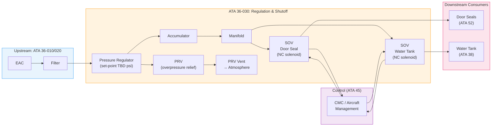
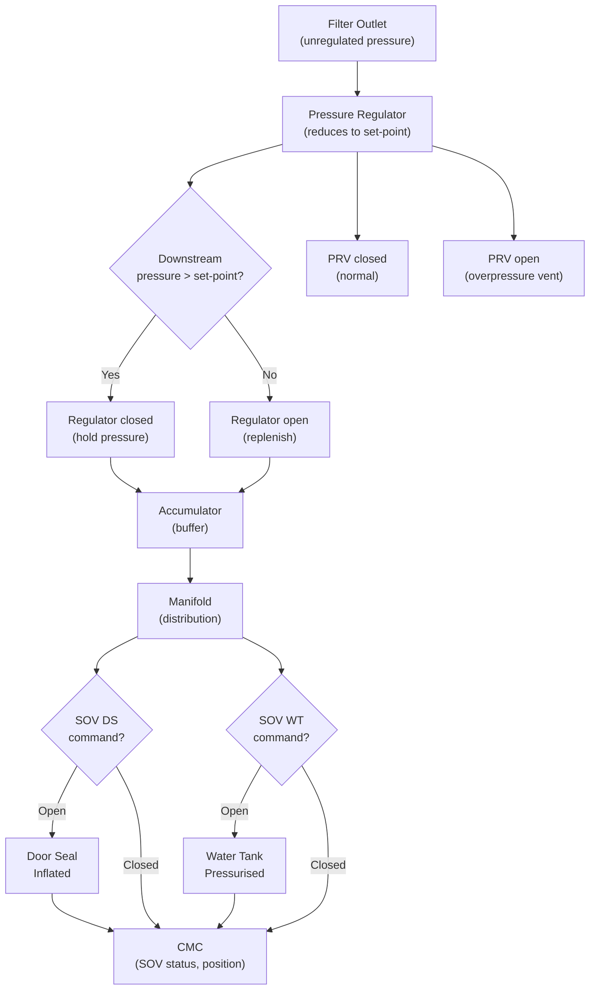
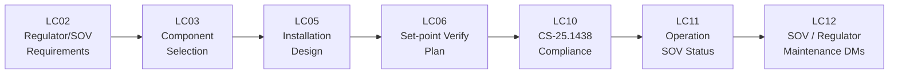

# 036-030 — Pressure Regulation and Shutoff
### AMPEL360e eWTW · ATA 36 · Q+ATLANTIDE ATLAS Scaffold

---

## §0 Hyperlink Policy

All internal links in this document use relative paths from the current directory. External regulatory and standards references use anchor links defined in [§20 References](#20-references). Links marked **TBD** indicate targets not yet allocated within the CSDB or ATLAS hierarchy. Programme-level links traverse five directory levels (`../../../../../`) to reach the repository root. No absolute URLs are used for internal navigation.

---

## §1 Purpose

This document describes the pressure regulation and shutoff provisions of the AMPEL360e eWTW residual pneumatic circuit (ATA 36-030). It covers the pressure regulator (downstream of EAC/filter), the pressure relief valve (PRV), and the consumer branch shutoff valves (SOVs).

**eWTW context**: On conventional bleed-air aircraft, the pressure regulation function is complex — modulating bleed valves, pre-coolers, and HP/LP switching valves manage high-temperature bleed air at varying engine power settings. On the eWTW, the EAC provides near-constant-pressure output (controlled by the EAC motor controller), and the regulator is a simple downstream pressure-reducing valve maintaining the circuit working pressure. There is no bleed valve, no pre-cooler regulation valve, and no cross-bleed isolation valve.

**Important cross-reference note**: ATA 36 SOVs on the eWTW do **NOT** supply wing anti-ice (ATA 30 uses electrothermal EWAI) and do **NOT** supply cabin pressurisation (ATA 21 uses EDCs). The only SOVs in ATA 36 control flow to door seals and potable water tank (TBD).

---

## §2 Applicability

| Attribute | Value |
|---|---|
| Programme | AMPEL360e Wide Tube-and-Wing (eWTW) |
| ATA Subsubject | 036-030 — Pressure Regulation and Shutoff |
| Pressure Regulator Set-Point |  psi |
| PRV Set-Point |  psi (> regulator set-point) |
| SOV Type | Electric solenoid, normally closed |
| SOV Quantity |  (1 per consumer branch — TBD) |
| SOV Actuation | 28 VDC solenoid (TBD) |
| Manual Override |  |
| Anti-Ice Supply | **None** — ATA 30 not supplied by ATA 36 on eWTW |
| ECS Supply | **None** — ATA 21 not supplied by ATA 36 on eWTW |
| Certification Basis | CS-25.1438; CS-25.1301/1309 |
| S1000D SNS | 036-30 |

---

## §3 System / Function Overview

### 3.1 Pressure Regulator

The pressure regulator is located downstream of the main air filter and upstream of the accumulator/manifold. It maintains a constant downstream pressure regardless of EAC outlet pressure variations. Key characteristics:
- Type: pressure-reducing regulator (self-regulating, spring/diaphragm or electropneumatic — TBD)
- Set-point: TBD (determined by highest consumer pressure requirement)
- No temperature regulation required (low-temperature air)
- No bleed pre-cooler or temperature limiting function

### 3.2 Pressure Relief Valve (PRV)

The PRV protects the distribution circuit from overpressure in the event of regulator failure (regulator stuck open, EAC controller fault, ground supply overpressure). The PRV opens at a set pressure above the normal working pressure and vents to atmosphere (aircraft exterior or local enclosure — TBD). The PRV is a **passive mechanical device** (no electrical actuation), providing last-resort overpressure protection.

### 3.3 Shutoff Valves (SOVs)

Consumer branch SOVs are **normally closed, electrically actuated solenoid valves**. Each consumer branch has one SOV:
- **SOV — Door Seal Branch**: opens to inflate door seals; closes to isolate door seal circuit (e.g., maintenance, fault)
- **SOV — Water Tank Branch**: opens to pressurise water tank; closes when tank pressure satisfied or on fault
- Additional branches: TBD per residual consumer list

SOV control: commanded by CMC or ECS/aircraft management system (interface TBD). Manual override (mechanical — TBD per CS-25 maintenance access requirements).

### 3.4 Cross-Reference: What ATA 36 SOVs Do NOT Supply on eWTW

| Function | Conventional Aircraft | eWTW |
|---|---|---|
| Wing anti-ice | SOV supplies bleed to ATA 30 | **N/A** — ATA 30 electrothermal; no ATA 36 SOV |
| Engine anti-ice | SOV supplies bleed to ATA 30 | **N/A** — electric; no ATA 36 SOV |
| Cabin pressurisation | Bleed SOV to ATA 21 packs | **N/A** — EDC; no ATA 36 SOV |
| Hydraulic reservoir | Bleed SOV to hydraulic res. | **N/A** — no hydraulics on eWTW |
| Cross-bleed | Cross-bleed isolation SOV | **N/A** — no bleed architecture |

---

## §4 Scope

### 4.1 Included
- Pressure regulator: body, internal spring/diaphragm mechanism, outlet port, set-point adjustment (factory set, TBD)
- Pressure relief valve (PRV): body, spring, vent port, outlet (to atmosphere or enclosure)
- SOV — Door Seal Branch: solenoid body, valve element, position feedback (TBD), electrical connector
- SOV — Water Tank Branch: solenoid body, valve element, position feedback (TBD), electrical connector
- SOV wiring harness (to aircraft electrical system and CMC)
- SOV manual override provisions (TBD per design)
- Mounting provisions for regulator, PRV, and SOVs on manifold or airframe bracket

### 4.2 Excluded
- Main air filter (ATA 36-020)
- Accumulator and manifold (ATA 36-020)
- Downstream consumer circuits (ATA 52 doors, ATA 38 water)
- Bleed valves (not applicable)
- Pre-cooler (not applicable)
- Cross-bleed isolation valve (not applicable)
- Anti-ice SOVs (not applicable — no bleed anti-ice on eWTW)

---

## §5 Architecture Description

### 5.1 Regulator Architecture

| Parameter | Value |
|---|---|
| Regulator type | Pressure-reducing, spring/diaphragm (TBD — self-regulating or electropneumatic) |
| Set-point |  psi |
| Set-point tolerance | ±  % |
| Max inlet pressure |  psi (EAC max outlet) |
| Min outlet pressure (regulated) |  psi |
| Flow capacity |  SCFM |
| Material |  (aluminium body, SS internals TBD) |
| Seal material |  (Viton / EPDM TBD) |
| Location |  |

### 5.2 PRV Architecture

| Parameter | Value |
|---|---|
| PRV type | Spring-loaded, normally closed, direct-acting |
| Set-point |  psi (> regulator set-point + tolerance margin) |
| Set-point tolerance | ±  % |
| Vent destination | To aircraft exterior or local enclosure —  |
| Re-seating pressure |  psi |
| Material |  |
| Electrical actuation | None (passive mechanical) |

### 5.3 SOV Architecture

| Parameter | Value |
|---|---|
| SOV type | 2-way, normally closed, solenoid-actuated |
| Actuation voltage | 28 VDC (TBD) |
| Actuation current |  mA |
| Fail-safe position | Closed (de-energised = closed) |
| Position feedback | Micro-switch or LVDT — TBD |
| Response time (open) |  ms |
| Response time (close) |  ms |
| Body material |  |
| Seal material |  |
| Manual override |  (manual push-pin or lockout collar TBD) |
| Quantity |  (1 per consumer branch) |

---

## §6 Functional Breakdown

| Function | Component | Control | Notes |
|---|---|---|---|
| Pressure reduction | Pressure regulator | Passive (self-regulating) | Downstream of filter/EAC |
| Overpressure protection | PRV | Passive (mechanical) | Last-resort protection |
| Door seal isolation / control | SOV — Door Seal | CMC / aircraft management | Normally closed; open on demand |
| Water tank isolation / control | SOV — Water Tank | CMC / aircraft management | Normally closed; open on demand |
| SOV manual override | Manual mechanism | Maintenance personnel | Lockout/tagout provisions TBD |
| SOV position indication | Feedback sensor | CMC / ECAM | TBD (switch or LVDT) |

---

## §7 System Context Diagram

---

## §8 Internal Functional Architecture

---

## §9 Lifecycle Traceability

---

## §10 Interfaces

| Interface | ATA Chapter | Description | Direction |
|---|---|---|---|
| Main air filter outlet | ATA 36-020 | Unregulated air to regulator inlet | ATA 36-020 → ATA 36-030 |
| Accumulator / manifold | ATA 36-020 | Regulated air to accumulator/manifold | ATA 36-030 → ATA 36-020 |
| Door seal SOV outlet | ATA 52 | Pressurised air to door seal circuit | ATA 36-030 → ATA 52 |
| Water tank SOV outlet | ATA 38 | Pressurised air to water tank | ATA 36-030 → ATA 38 |
| CMC / aircraft management | ATA 45 | SOV open/close commands, position feedback, fault flags | ATA 36-030 ↔ ATA 45 |
| Electrical power | ATA 24 | 28 VDC for SOV solenoids | ATA 24 → ATA 36-030 |
| PRV vent | Airframe | PRV discharge to exterior or enclosure | ATA 36-030 → Airframe |
| Wing anti-ice | ATA 30 | **No interface** — ATA 36 does NOT supply ATA 30 on eWTW | None |
| ECS pressurisation | ATA 21 | **No interface** — ATA 36 does NOT supply ATA 21 on eWTW | None |

---

## §11 Operating Modes

| Mode | Regulator | PRV | SOV-DS | SOV-WT |
|---|---|---|---|---|
| Normal — consumers active | Regulating | Closed | Open (door seals inflated) | Open (water tank pressurised) |
| Standby — demand met | Closed / holding | Closed | Open | Open (or closed when satisfied) |
| Maintenance isolation | Isolated (upstream SOV closed or EAC off) | May open if residual pressure | Closed (manually commanded) | Closed |
| Fault — SOV stuck open | N/A | May open if PRV threshold exceeded | Stuck open | N/A |
| Fault — SOV stuck closed | N/A | N/A | Stuck closed — door seal not inflated | Stuck closed |
| Overpressure event | Regulator failed | **Open** (venting) | Demand-state | Demand-state |
| Ground test | Regulating | Closed (normal) | Commanded via maint terminal | Commanded via maint terminal |

---

## §12 Monitoring and Diagnostics

| Parameter | Sensor | Location | Alert |
|---|---|---|---|
| SOV-DS position | Position feedback (TBD) | SOV body | Disagree with command → CMC fault |
| SOV-WT position | Position feedback (TBD) | SOV body | Disagree with command → CMC fault |
| SOV-DS stuck open | Position + pressure logic | CMC | CMC advisory |
| SOV-WT stuck closed | Position + pressure logic | CMC | CMC advisory |
| PRV open event | Pressure transducer (downstream drop + PRV flow sensor TBD) | PRV outlet / manifold | PNEU LO PR (amber CAS if sustained) |
| Regulator set-point drift | Manifold pressure vs. set-point | CMC | Maintenance advisory |

---

## §13 Maintenance Concept

### 13.1 Line Maintenance
- **SOV function test**: open/close cycle via maintenance terminal; verify position feedback and downstream pressure change; interval TBD
- **Regulator set-point check**: measure downstream pressure; compare to nominal; access TBD
- **PRV inspection**: visual for evidence of leakage (staining at vent); verify no spurious opening in service

### 13.2 Base / Heavy Maintenance
- **SOV removal and installation**: S1000D DM DMC-AMPEL360E-EWTW-036-30-520/720 (TBD); isolate circuit; lockout EAC; depressurise; remove and reinstall SOV; functional test post-install
- **Regulator removal and installation**: S1000D DM TBD; set-point verification post-install
- **PRV removal and inspection**: spring inspection; re-seating test on test bench (set-point verification TBD psi ± TBD %)

### 13.3 Repairs
- SOV: no repair — LRU replacement
- Regulator: no repair in service — LRU replacement; overhaul at approved facility TBD
- PRV: no repair — replacement

---

## §14 S1000D / CSDB Mapping

| DM Code (planned) | Info Code | Title | Status |
|---|---|---|---|
| DMC-AMPEL360E-EWTW-036-30-00A-040A-A | 040 | ATA 36-030 — Pressure Regulation and Shutoff — Description |  |
| DMC-AMPEL360E-EWTW-036-30-00A-300A-A | 300 | ATA 36-030 — Regulator / SOV / PRV Inspection |  |
| DMC-AMPEL360E-EWTW-036-30-00A-520A-A | 520 | ATA 36-030 — SOV Removal |  |
| DMC-AMPEL360E-EWTW-036-30-00A-720A-A | 720 | ATA 36-030 — SOV Installation |  |
| DMC-AMPEL360E-EWTW-036-30-00A-400A-A | 400 | ATA 36-030 — Regulator / SOV Fault Isolation |  |

---

## §15 Footprints

| Item | Mass (kg) | Volume (L) | Location | Status |
|---|---|---|---|---|
| Pressure regulator |  |  |  |  |
| PRV |  |  | Manifold / nearby |  |
| SOV — Door Seal |  |  |  |  |
| SOV — Water Tank |  |  |  |  |
| **Total 036-030** |  | — | — |  |

---

## §16 Safety and Certification

| Requirement | Standard | Applicability | Notes |
|---|---|---|---|
| Pneumatic systems | CS-25.1438 | Full | Regulator, PRV, SOV design |
| Systems and installations | CS-25.1309 | Full | SOV failure mode — stuck open/closed; FMECA |
| Equipment and installations | CS-25.1301 | Full | |
| Environmental qualification | DO-160G | All components | Temperature, vibration, humidity |
| Fail-safe design | CS-25.1309 + design standard | SOV normally closed | De-energised = closed = safe (no unintended pressurisation) |
| Manual override | CS-25 maintenance access | SOV | Maintenance access and lockout provisions TBD |
| Anti-ice supply clarification | N/A | **Not applicable** — no ATA 36 → ATA 30 interface on eWTW | Explicit non-interface documented |

### 16.1 Critical Safety Note
The SOV fail-safe position (normally closed) ensures that on loss of electrical power, all consumer branches are isolated. This prevents unintended pressurisation of door seals or water tank in unpowered states. However, it also means door seals are not inflated on electrical failure — impact on sealing to be assessed in FMECA (OI-036-010).

---

## §17 Verification and Validation

| V&V Activity | Method | Acceptance Criteria | Status |
|---|---|---|---|
| Regulator set-point verification | Ground test — downstream pressure measurement with calibrated gauge | Set-point ± TBD % |  |
| SOV open/close test | Maintenance terminal command; verify position feedback + downstream pressure | Open: pressure passes; Closed: no flow (<TBD leakage) |  |
| SOV response time | Timed test (open/close command to position confirmed) | Open within TBD ms; Close within TBD ms |  |
| PRV set-point test | Bench test: ramp pressure to PRV; measure opening pressure | PRV opens at TBD psi ± TBD % |  |
| PRV re-seating test | Bench test: reduce pressure below re-seat; measure close pressure | PRV closes at TBD psi |  |
| SOV stuck fault detection | Induce stuck-open/closed; verify CMC fault flag | CMC flags within TBD s |  |
| SOV fail-safe (de-energise) | Remove SOV power; verify closed position | Valve closed; no flow |  |
| CS-25.1438 compliance | Analysis + test | Authority acceptance |  |

---

## §18 Glossary

| Term | Definition |
|---|---|
| SOV | Shutoff Valve — electrically actuated solenoid valve controlling flow to a consumer branch; normally closed (fail-safe closed) |
| PRV | Pressure Relief Valve — passive mechanical device venting to atmosphere at set overpressure threshold |
| Pressure regulator | Pressure-reducing valve maintaining constant downstream pressure regardless of upstream variation |
| Set-point | Nominal operating pressure at which regulator maintains downstream circuit (TBD psi) |
| Fail-safe position | De-energised (unpowered) position of SOV — closed on eWTW |
| NC solenoid | Normally Closed solenoid valve — closed when de-energised; opens when energised |
| NRV | Non-Return Valve — check valve; see ATA 36-020 |
| EAC | Electric Air Compressor — see ATA 36-010 |
| CMC | Central Maintenance Computer |
| ECAM | Electronic Centralised Aircraft Monitor |
| CAS | Crew Alerting System |
| Bleed-less architecture | No engine compressor bleed air; all functions electrically supplied |
| EWAI | Electrothermal Wing Anti-Ice — ATA 30; not supplied by ATA 36 on eWTW |
| EDC | Electric Driven Compressor — ATA 21 ECS source; not part of ATA 36 |
| CS-25.1438 | EASA certification requirement for pneumatic systems |
| DO-160G | RTCA environmental qualification standard |
| FMECA | Failure Modes, Effects, and Criticality Analysis |
| LRU | Line Replaceable Unit — SOV and regulator are LRUs |

---

## §19 Citations

1. EASA CS-25 §25.1438 — Pneumatic Systems
2. EASA CS-25 §25.1309 — Systems and Installations
3. EASA CS-25 §25.1301 — Equipment and Installations
4. RTCA DO-160G — Environmental Conditions and Test Procedures
5. S1000D Issue 5.0 — Technical Publication Standard
6. ATA iSpec 2200 — ATA 36 Pneumatic

---

## §20 References

| Ref ID | Document | Source | Link |
|---|---|---|---|
| [ATA36] | ATA iSpec 2200 Chapter 36 | ATA | — |
| [CS25-1438] | CS-25 §25.1438 | EASA | https://www.easa.europa.eu/ |
| [CS25-1309] | CS-25 §25.1309 | EASA | https://www.easa.europa.eu/ |
| [DO-160G] | RTCA DO-160G | RTCA | https://www.rtca.org/ |
| [S1000D] | S1000D Issue 5.0 | ASD/AIA | https://s1000d.org/ |
| [036-000] | ATA 36 General | Internal | [036-000](./036-000-Pneumatic-General.md) |
| [036-020] | ATA 36 Air Distribution | Internal | [036-020](./036-020-Pneumatic-Air-Distribution.md) |
| [036-040] | ATA 36 Valves, Ducts, Manifolds | Internal | [036-040](./036-040-Pneumatic-Valves-Ducts-and-Manifolds.md) |
| [ATA30] | ATA 30 — Ice and Rain (no ATA 36 supply) | Internal | — |
| [ATA21] | ATA 21 — ECS (no ATA 36 supply) | Internal | — |

---

## §21 Open Issues

| Issue ID | Description | Owner | Priority | Status |
|---|---|---|---|---|
| OI-036-001 | **Retain or eliminate ATA 36**: if circuit eliminated, no regulator/SOV/PRV required | Q-AIR | Critical |  |
| OI-036-014 | **Regulator type**: self-regulating spring/diaphragm vs. electropneumatic (CMC-controlled) — complexity vs. flexibility | Q-AIR | Medium |  |
| OI-036-015 | **SOV manual override**: mechanical override required per CS-25 maintenance access — design to be confirmed | Q-MECHANICS | Medium |  |
| OI-036-010 | **SOV fail-safe assessment**: door seals not inflated on electrical failure — FMECA consequence analysis | Q-AIR / ORB-LEG | High |  |
| OI-036-016 | **PRV vent destination**: venting to fuselage exterior vs. internal enclosure — fire zone and composite structure considerations | Q-MECHANICS | Medium |  |
| OI-036-017 | **Regulator set-point**: determined by consumer pressure requirements — pending door seal and water tank design | Q-AIR | High |  |

---

## §22 Change Log

| Revision | Date | Author | Description |
|---|---|---|---|
| 0.1.0 | 2026-05-10 | Q+ATLANTIDE scaffold generator | Initial full-template scaffold — all sections present; content TBD/DRAFT |
