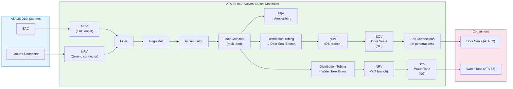
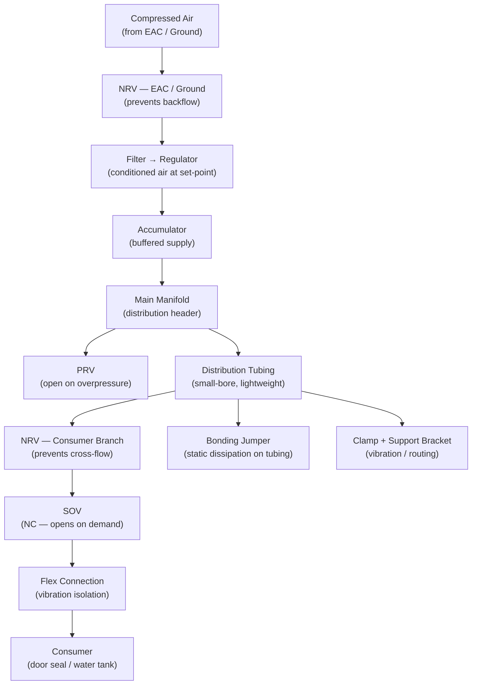
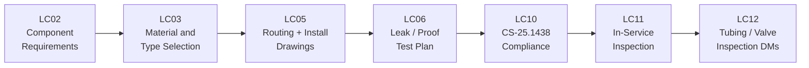

# 036-040 — Pneumatic Valves, Ducts, and Manifolds
### [PROGRAMME-AIRCRAFT] [PROGRAMME-VARIANT] · ATA 36 · Q+ATLANTIDE ATLAS Scaffold

---

## §0 Hyperlink Policy

All internal links in this document use relative paths from the current directory. External regulatory and standards references use anchor links defined in [§20 References](#20-references). Links marked **TBD** indicate targets not yet allocated within the CSDB or ATLAS hierarchy. Programme-level links traverse five directory levels (`../../../../../`) to reach the repository root. No absolute URLs are used for internal navigation.

---

## §1 Purpose

This document defines the agnostic ATLAS standard-level architecture context for `036-040 — Pneumatic Valves, Ducts, and Manifolds`.

It describes the controlled scope, functions, interfaces, safety considerations, lifecycle traceability, and S1000D/CSDB mapping logic that programme implementations shall instantiate when this node is applicable.

This document is not a programme design baseline. Programme-specific capacities, locations, part numbers, effectivity, operating limits, maintenance references, and data module codes shall be defined only inside the applicable programme implementation branch.
## §2 Applicability

| Applicability Level | Rule |
|---|---|
| Standard taxonomy | Applies to the ATLAS node `<NODE>` |
| Programme implementation | Conditional; determined by programme architecture, trade studies, certification basis, and applicability model |
| Product configuration | Defined in the programme-specific configuration baseline |
| Effectivity | Defined in the programme CSDB / applicability layer |
| Non-applicability | Must be explicitly stated in the programme impact-study branch when excluded |
## §3 System / Function Overview

### 3.1 Component Summary

| Component Category | Instances | Type | Notes |
|---|---|---|---|
| Shutoff Valves (SOV) | TBD (1 per consumer branch) | NC solenoid, 28 VDC | Door seal and water tank branches |
| Non-Return Valves (NRV) | TBD | Ball or poppet check valve | EAC outlet, ground connector, branch isolation |
| Pressure Relief Valve (PRV) | 1 | Spring-loaded, mechanical | Manifold overpressure protection |
| Pressure Regulator | 1 | Spring/diaphragm, self-regulating | Downstream of filter |
| Distribution Tubing | TBD m total | Small-bore, lightweight | Manifold to consumer SOVs |
| Main Manifold | 1 | Machined aluminium block (TBD) | Multi-port distribution header |
| Flex connections | TBD | PTFE-lined flexible hose or swaged flex | At structural penetrations and dynamic interfaces |

### 3.2 Valve Type Detail

| Valve Type | Function | Actuation | Fail-safe | Applicable Location |
|---|---|---|---|---|
| SOV (Shutoff) | Isolate / enable consumer branch | Electric solenoid (NC) | Closed | Door seal, water tank branches |
| NRV (Non-Return / Check) | Prevent reverse flow | Passive (spring/poppet) | Closed (reverse direction) | EAC outlet, ground connector outlet, branch outlets |
| PRV (Pressure Relief) | Overpressure protection | Passive (spring, mechanical) | Closed | Manifold / regulator outlet |
| Pressure Regulator | Pressure reduction | Passive (spring/diaphragm) | Closed (reduced pressure) | EAC outlet downstream |

---

## §4 Scope

### 4.1 Included
- All SOVs (NC solenoid) in ATA 36 circuit: door seal SOV, water tank SOV, and any additional branches (TBD)
- All NRVs: EAC outlet NRV, ground connector NRV, and branch NRVs (if separate from SOVs)
- PRV: body, spring, vent line/port
- Pressure regulator: body, diaphragm/spring assembly, set-point provision
- All distribution tubing from filter outlet to consumer SOV inlets
- Main distribution manifold (multi-port header)
- Flexible connections: PTFE hose sections at structural penetrations and vibration-isolated interfaces
- Tube fittings: AN flared / Swagelok / push-to-connect (TBD)
- Tube clamps and support brackets
- Bonding jumpers at tubing/clamp interfaces (static dissipation — composite fuselage)
- Grommets and sealing provisions at fuselage structural penetrations

### 4.2 Excluded
- EAC (ATA 36-010)
- Main air filter and accumulator (ATA 36-020)
- Consumer equipment downstream of SOV outlets (ATA 52 door seals, ATA 38 water tank)
- Engine bleed valves, pre-coolers, cross-bleed valves (not applicable)
- High-temperature titanium duct assemblies (not applicable)
- Thermal insulation blankets (not required)

---

## §5 Architecture Description

### 5.1 Valve Architecture

#### SOV — Shutoff Valve
- **Type**: 2-way, normally closed, solenoid-actuated poppet or ball valve
- **Actuation voltage**: 28 VDC (TBD)
- **Coil resistance**:  Ω
- **Fail position**: CLOSED (de-energised = closed — fail-safe)
- **Position feedback**: Micro-switch on valve stem (TBD) — Open/Closed indication to CMC
- **Manual override**: Mechanical push-pin or lockout collar — TBD
- **Body material**: Aluminium or stainless — TBD
- **Port size**:  (e.g., 1/4" NPT or AN-4)
- **Flow Cv**: 

#### NRV — Non-Return Valve (Check Valve)
- **Type**: Spring-loaded poppet or ball check valve
- **Cracking pressure**:  psi (delta required to open)
- **Leakage (reverse)**:  (effectively zero)
- **Body material**: Aluminium or stainless — TBD
- **Seal material**: Viton or EPDM — TBD
- **Locations**: EAC outlet (prevents backflow on shutdown), ground connector, branch outlets

#### PRV — Pressure Relief Valve
- **Type**: Spring-loaded, direct-acting, normally closed
- **Set-point**:  psi (above regulator set-point)
- **Vent**: To aircraft exterior panel vent or local enclosure — TBD
- **Body material**: Aluminium — TBD
- **Re-seat pressure**:  psi

### 5.2 Duct / Tubing Architecture

| Attribute | Value |
|---|---|
| Tube material options | Option A: aluminium alloy (6061-T6 or 3003); Option B: stainless 304; Option C: PTFE-lined SS |
| Tube OD |  (est. 1/4"–1/2" depending on branch) |
| Wall thickness |  |
| Fitting standard |  (AN MS flare / Swagelok / push-to-connect) |
| Flex connections | PTFE-lined SS braid hose — at penetrations and dynamic interfaces |
| Clamp type | Adel clamp / cushioned support clamp — TBD |
| Clamp spacing | TBD per vibration analysis |
| Bend radius (min) | Per tubing manufacturer specification — TBD |
| Working temperature | −40°C to +70°C (TBD — near-ambient compression outlet) |
| Pressure rating | Working × 4.0 (min safety factor) — TBD |
| Corrosion protection | Alodine / anodize (aluminium) or passivation (SS) — TBD |
| Bonding jumpers | At each clamp group — connects tubing to airframe ground (composite fuselage grounding) |

### 5.3 Manifold Architecture

| Attribute | Value |
|---|---|
| Material | Machined aluminium alloy block (TBD grade) |
| Ports | 1 × inlet (from accumulator), 2+ × consumer outlets, 1 × PRV port, 1 × drain/vent |
| Pressure transducer ports | 2 × (primary + redundant) — 1/4" NPT or AN fitting |
| Seals | O-ring face seal or pipe thread (TBD — O-ring face seal preferred for metal-to-metal sealing) |
| Surface treatment | Anodize or Alodine + primer (corrosion protection) — TBD |
| Bonding lug | Integral bonding lug for static dissipation |
| Mounting | 4× bolted to bracket or structure — TBD |

---

## §6 Functional Breakdown

| Component | Function | Quantity | Status |
|---|---|---|---|
| SOV — Door Seal | Isolate / enable door seal circuit | TBD (1 per door group or 1 total — TBD) |  |
| SOV — Water Tank | Isolate / enable water tank pressurisation | 1 |  |
| NRV — EAC outlet | Prevent EAC backflow | 1 per EAC |  |
| NRV — Ground connector | Prevent ground cart backflow | 1 |  |
| NRV — Consumer branches | Prevent cross-flow | TBD |  |
| PRV | Overpressure protection | 1 |  |
| Pressure regulator | Pressure reduction to set-point | 1 |  |
| Main manifold | Air distribution header | 1 |  |
| Distribution tubing | Supply lines to consumers | TBD m |  |
| Flex hose sections | Vibration isolation, penetrations | TBD |  |
| Bonding jumpers | Static dissipation | TBD |  |

---

## §7 System Context Diagram

---

## §8 Internal Functional Architecture

---

## §9 Lifecycle Traceability

---

## §10 Interfaces

| Interface | ATA Chapter | Description | Direction |
|---|---|---|---|
| EAC outlet | ATA 36-010 | NRV to filter | ATA 36-010 → ATA 36-040 |
| Ground connector | ATA 36-010 | NRV to filter | ATA 36-010 → ATA 36-040 |
| Pressure regulator outlet | ATA 36-030 | Regulated air to accumulator | ATA 36-030 ↔ ATA 36-040 |
| Door seal circuit | ATA 52 | SOV outlet to door seal tubing | ATA 36-040 → ATA 52 |
| Water tank pressurisation | ATA 38 | SOV outlet to water tank | ATA 36-040 → ATA 38 |
| CMC | ATA 45 | SOV position feedback and fault | ATA 36-040 → ATA 45 |
| Electrical power | ATA 24 | 28 VDC for SOV solenoids | ATA 24 → ATA 36-040 |
| Airframe structure | ATA 53 | Clamp / bracket attachment; penetration sealing | — |
| Bonding network | ATA 24 | Bonding jumpers to airframe ground | ATA 36-040 → ATA 24 |

---

## §11 Operating Modes

| Mode | SOVs | NRVs | PRV | Tubing |
|---|---|---|---|---|
| Normal (consumers active) | Open (energised) | Passive — passing | Closed | Pressurised to set-point |
| EAC standby (accumulator holding) | Open | Passive | Closed | Pressurised |
| Maintenance isolation | Closed (de-energised or manual) | Passive | May open if residual pressure | Depressurised after isolation |
| Overpressure event | N/A | Passive | Open (venting) | Potential transient over-pressure |
| Ground test | Commanded via terminal | Passive | Closed (normal) | Pressurised per test procedure |

---

## §12 Monitoring and Diagnostics

| Parameter | Sensor | Alert |
|---|---|---|
| SOV position (open/closed) | Micro-switch feedback | Disagree with command → CMC fault |
| SOV leak (internal) | Downstream pressure without command | CMC pressure logic |
| NRV backflow | Pressure transducer logic (upstream vs. downstream) | CMC advisory TBD |
| PRV spurious opening | Pressure transducer (manifold drop + PRV flow detection TBD) | PNEU LO PR (amber CAS) |
| Manifold pressure | Pressure transducer (×2 redundant) | PNEU LO PR (amber CAS) |
| Tubing integrity | Pressure decay test (maintenance) | Fail = leak — maintenance action |

---

## §13 Maintenance Concept

### 13.1 Line Maintenance
- SOV function test: maintenance terminal open/close cycle; verify feedback and downstream pressure
- Visual inspection of tubing, clamps, and fittings for chafing, leakage (staining), corrosion
- Bonding jumper continuity check (TBD interval)

### 13.2 Base / Heavy Maintenance
- Tubing inspection: internal visual (if accessible), external visual, pressure test post-repair
- SOV removal / installation: per S1000D DM 036-30-520/720 (ATA 36-030 cross-reference)
- NRV inspection: bench test cracking pressure and reverse leakage; replace if out of tolerance
- PRV bench test: verify set-point within tolerance; replace if failed
- Manifold inspection: visual for corrosion, seal condition, port integrity

### 13.3 Repairs
- Tubing: approved repair per AMM / SRM; dent/scratch limits TBD; kinked tube = replace
- Fittings: replace per approved fastener / fitting standards
- Manifold: repair by replacement (LRU) unless approved limited damage repair TBD

---

## §14 S1000D / CSDB Mapping

| DM Code (planned) | Info Code | Title | Status |
|---|---|---|---|
| DMC-<PROGRAMME>-<VARIANT>-036-40-00A-040A-A | 040 | ATA 36-040 — Valves, Ducts, Manifolds — Description |  |
| DMC-<PROGRAMME>-<VARIANT>-036-40-00A-300A-A | 300 | ATA 36-040 — Valve and Tubing Inspection |  |
| DMC-<PROGRAMME>-<VARIANT>-036-40-00A-400A-A | 400 | ATA 36-040 — Valve Fault Isolation |  |

---

## §15 Footprints

| Item | Mass (kg) | Location | Status |
|---|---|---|---|
| SOVs (all, total) |  |  |  |
| NRVs (all, total) |  |  |  |
| PRV |  | Manifold adjacent |  |
| Pressure regulator |  |  |  |
| Manifold (machined) |  |  |  |
| Distribution tubing (total) |  | Throughout fuselage |  |
| Flex connections |  | Penetrations |  |
| **Total 036-040** |  | — |  |

---

## §16 Safety and Certification

| Requirement | Standard | Notes |
|---|---|---|
| Pneumatic systems | CS-25.1438 | Valve, duct, manifold design |
| Systems and installations | CS-25.1309 | Valve failure modes (FMECA) |
| Equipment and installations | CS-25.1301 | All ATA 36-040 components |
| Bonding and grounding | CS-25.1353 | Bonding jumpers — composite fuselage |
| Environmental qualification | DO-160G | All valves, sensors |
| No hot bleed | N/A | No titanium ducts, no insulation blankets, no hot-air fire risk in ATA 36 |
| Fitting / tubing proof pressure | CS-25.1438 + design standard | 4× working pressure (min safety factor TBD) |
| Composite fuselage penetrations | CS-25 / authority ruling TBD | Penetration sealing provisions — TBD |

---

## §17 Verification and Validation

| V&V Activity | Method | Acceptance Criteria | Status |
|---|---|---|---|
| SOV open/close test | Maintenance terminal; position + pressure | Open: flow; Closed: no flow (< TBD leak) |  |
| NRV backflow test | Reverse pressurisation; measure leakage | < TBD leak rate |  |
| PRV set-point bench test | Ramp pressure to PRV; measure crack pressure | TBD psi ± TBD % |  |
| System leak test (pressure decay) | Pressurise circuit; isolate; monitor decay | < TBD psi/min |  |
| Tubing proof pressure test | Hydrostatic / pneumatic at 1.5× working | No deformation; no leakage |  |
| Bonding continuity test | Measured resistance per bonding jumper | < TBD mΩ |  |
| Manifold pressure indication accuracy | Transducer vs. reference gauge | ± TBD psi |  |
| Vibration survey (tubing) | Flight test / ground vibration; strain gauge at clamp | Stress < allowable TBD |  |
| CS-25.1438 compliance | Analysis + test | Authority acceptance |  |

---

## §18 Glossary

| Term | Definition |
|---|---|
| SOV | Shutoff Valve — normally closed solenoid valve controlling consumer branch flow |
| NRV | Non-Return Valve — check valve preventing reverse flow; also called check valve |
| PRV | Pressure Relief Valve — passive overpressure protection device |
| NC | Normally Closed — valve position when de-energised (fail-safe closed for SOVs) |
| Manifold | Multi-port distribution header connecting supply to consumer branches |
| Distribution tubing | Small-bore tubing carrying low-pressure air from manifold to consumer SOVs |
| Flex connection | PTFE-lined flexible hose section providing vibration isolation and accommodating installation tolerances |
| Bonding jumper | Electrical strap ensuring metallic continuity across tubing/clamp joints for static discharge in composite fuselage |
| Cracking pressure | Minimum differential pressure required to open an NRV |
| Proof pressure | Test pressure applied to verify structural integrity (typically 1.5× working pressure) |
| Bleed-less architecture | No engine compressor bleed air; residual circuit is low-pressure EAC-sourced only |
| LRU | Line Replaceable Unit — valve or manifold replaced as a unit |
| CS-25.1438 | EASA certification requirement for pneumatic systems |
| DO-160G | RTCA environmental qualification standard |
| FMECA | Failure Modes, Effects, and Criticality Analysis |
| CMC | Central Maintenance Computer |
| CAS | Crew Alerting System |

---

## §19 Citations

1. EASA CS-25 §25.1438 — Pneumatic Systems
2. EASA CS-25 §25.1309 — Systems and Installations
3. EASA CS-25 §25.1353 — Electrical Equipment and Installations (bonding)
4. RTCA DO-160G — Environmental Conditions and Test Procedures
5. S1000D Issue 5.0
6. ATA iSpec 2200 — ATA 36 Pneumatic

---

## §20 References

| Ref ID | Document | Source | Link |
|---|---|---|---|
| [ATA36] | ATA iSpec 2200 Chapter 36 | ATA | — |
| [CS25-1438] | CS-25 §25.1438 | EASA | https://www.easa.europa.eu/ |
| [CS25-1309] | CS-25 §25.1309 | EASA | https://www.easa.europa.eu/ |
| [DO-160G] | RTCA DO-160G | RTCA | https://www.rtca.org/ |
| [S1000D] | S1000D Issue 5.0 | ASD/AIA | https://s1000d.org/ |
| [036-000] | ATA 36 General | Internal | [036-000](./036-000-Pneumatic-General.md) |
| [036-030] | ATA 36 Regulation / Shutoff | Internal | [036-030](./036-030-Pressure-Regulation-and-Shutoff.md) |
| [ATA52] | ATA 52 — Doors | Internal | — |
| [ATA38] | ATA 38 — Water | Internal | — |

---

## §21 Open Issues

| Issue ID | Description | Owner | Priority | Status |
|---|---|---|---|---|
| OI-036-006 | **Manifold material and routing**: aluminium vs. stainless; composite fuselage penetration provisions | Q-MECHANICS | Medium |  |
| OI-036-018 | **Tubing material selection**: aluminium 6061 vs. stainless 304 vs. PTFE-lined — trade study required | Q-MECHANICS | Medium |  |
| OI-036-019 | **Fitting standard**: AN flare vs. Swagelok vs. push-to-connect — standardisation with other [PROGRAMME-VARIANT] systems | Q-MECHANICS | Low |  |
| OI-036-020 | **SOV quantity per door group**: 1 SOV per door pair vs. 1 SOV per door — trade-off sealing reliability vs. complexity | Q-AIR | Medium |  |
| OI-036-001 | **Retain or eliminate ATA 36**: if eliminated, ATA 36-040 scope is null | Q-AIR | Critical |  |
| OI-036-016 | **PRV vent destination**: exterior vs. internal enclosure — fire zone and composite structure | Q-MECHANICS | Medium |  |

---

## §22 Change Log

| Revision | Date | Author | Description |
|---|---|---|---|
| 0.1.0 | 2026-05-10 | Q+ATLANTIDE scaffold generator | Initial full-template scaffold — all sections present; content TBD/DRAFT |
