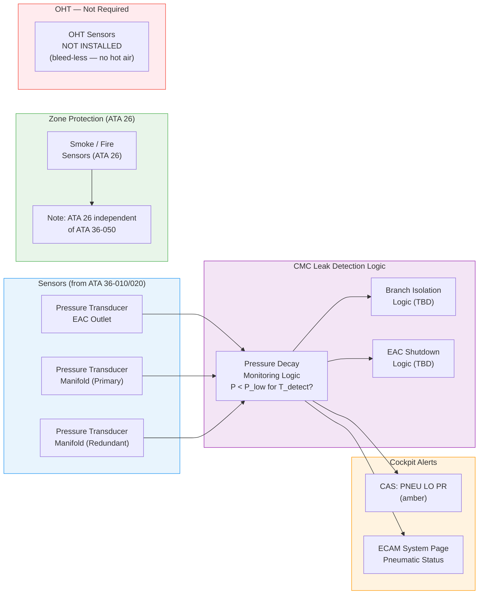
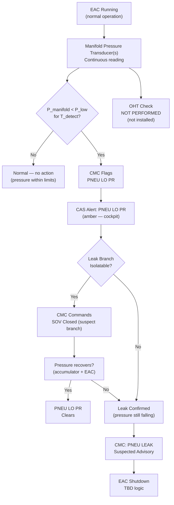
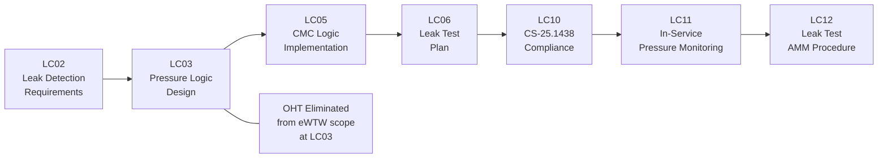

# 036-050 — Leak Detection and Overheat Protection
### AMPEL360e eWTW · ATA 36 · Q+ATLANTIDE ATLAS Scaffold

---

## §0 Hyperlink Policy

All internal links in this document use relative paths from the current directory. External regulatory and standards references use anchor links defined in [§20 References](#20-references). Links marked **TBD** indicate targets not yet allocated within the CSDB or ATLAS hierarchy. Programme-level links traverse five directory levels (`../../../../../`) to reach the repository root. No absolute URLs are used for internal navigation.

---

## §1 Purpose

This document describes the leak detection and overheat protection provisions of the AMPEL360e eWTW residual pneumatic circuit (ATA 36-050).

**Fundamental eWTW architectural statement for ATA 36-050:**

> **Overheat (OHT) sensors are NOT required for ATA 36 on the eWTW.** On conventional bleed-air aircraft, OHT sensing loops (thermistor cables or pneumatic sensing tubes routed adjacent to bleed air ducts) detect duct rupture by sensing the high-temperature air escaping from fractured hot-bleed ductwork. This is a primary safety function on bleed-air aircraft. Since the eWTW carries NO hot bleed air in ATA 36 — only low-pressure, near-ambient-temperature compressed air from the EAC — there is no hot-air duct rupture hazard and no thermal overheat detection requirement for ATA 36.

**Leak detection on eWTW ATA 36** is accomplished entirely through **pressure differential monitoring** using the existing pressure transducers on the EAC outlet and distribution manifold. A sustained pressure loss (pressure decay) detected by CMC logic indicates a leak. No dedicated OHT hardware is installed in ATA 36.

Zone fire and smoke protection for the aircraft is provided by ATA 26, which is independent of ATA 36.

---

## §2 Applicability

| Attribute | Value |
|---|---|
| Programme | AMPEL360e Wide Tube-and-Wing (eWTW) |
| ATA Subsubject | 036-050 — Leak Detection and Overheat Protection |
| OHT Sensors | **NOT REQUIRED** — bleed-less architecture; no hot bleed air |
| OHT Sensing Loops | **NOT INSTALLED** |
| Thermal Insulation Blankets | **NOT REQUIRED** |
| Leak Detection Method | Pressure differential monitoring via existing transducers |
| Pressure Transducers | EAC outlet + manifold (ATA 36-010/020) |
| CMC Fault Logic | Pressure decay = leak flag |
| Fire / Smoke Detection | ATA 26 (zone sensors — independent of ATA 36) |
| Certification Basis | CS-25.1438; CS-25.1309; CS-25.207 (not applicable — see §3) |
| S1000D SNS | 036-50 |

---

## §3 System / Function Overview

### 3.1 Conventional OHT vs. eWTW Approach

| Feature | Conventional Bleed-Air Aircraft | eWTW |
|---|---|---|
| OHT sensing loops | Thermistor or pneumatic tube loops alongside bleed ducts | **Not installed** |
| OHT detection | Detects hot air escaping from duct rupture (200–500°C) | **Not required** — no hot air |
| OHT alert | BLEED DUCT OVHT (amber/red CAS) | **Not applicable** |
| Thermal insulation | Required on hot bleed ducts | **Not required** |
| Bleed leak indication | BLEED LEAK (CMC + CAS) | **Not applicable** |
| Leak detection method | OHT loop: temperature rise from escaped hot air | Pressure decay: sustained pressure loss below threshold |
| Smoke detection (zone) | ATA 26 (independent) | ATA 26 (independent — same) |

### 3.2 eWTW Leak Detection Approach

The residual pneumatic circuit (if retained) uses **pressure-based leak detection**:

1. **EAC outlet pressure transducer**: monitors EAC outlet pressure; sustained drop with EAC running = possible leak upstream of regulator
2. **Manifold pressure transducer(s)** (×2, redundant): monitor manifold pressure; sustained drop below threshold with EAC running = possible leak in distribution circuit
3. **CMC pressure decay logic**: if manifold pressure falls below threshold `P_low` for duration `T_leak_detect` with EAC running, CMC flags "PNEU LO PR" and may flag "PNEU LEAK SUSPECTED" (TBD — alert text TBD)
4. **Branch pressure comparison** (TBD): if individual branch transducers fitted, CMC can isolate the leaking branch by comparing branch pressures

### 3.3 CS-25.207 (Stall Warning) Note

CS-25.207 (stall warning) is **not applicable** to ATA 36 on the eWTW. This regulatory paragraph does not govern pneumatic leak detection. It is cited here only to clarify that it does not apply, as it is sometimes cited in ATA 36 references for conventional aircraft bleed-air stall warning pitot-static interfaces.

---

## §4 Scope

### 4.1 Included
- Pressure-based leak detection logic in CMC (using existing transducers from ATA 36-010/020)
- CMC fault flag: "PNEU LO PR" (amber) when manifold pressure below threshold
- CMC fault flag: "PNEU LEAK SUSPECTED" (TBD — if pressure decay logic implemented)
- EAC shutdown logic on confirmed leak (TBD — to prevent compressor running into leaking circuit)
- SOV close-on-leak logic (TBD — isolate leaking branch)
- Maintenance procedure for circuit leak test (pressure decay — see ATA 36-070)
- Cross-reference to ATA 26 (zone fire/smoke sensors — zone protection not part of ATA 36-050)

### 4.2 Excluded
- OHT sensors / sensing loops (NOT installed — bleed-less architecture)
- Thermal insulation blankets (NOT required)
- BLEED OVHT/BLEED LEAK CAS alerts (NOT applicable)
- Hot duct rupture protection hardware (NOT applicable)
- ATA 26 fire/smoke sensors (separate system — cross-reference only)
- CS-25.207 provisions (not applicable — stall warning, unrelated)

---

## §5 Architecture Description

### 5.1 Pressure-Based Leak Detection Architecture

```
EAC Running → Manifold Pressure Transducer (×2) → CMC Pressure Logic
                                                         ↓
                             Manifold P < P_low for T_detect → PNEU LO PR (CAS amber)
                                                         ↓
                              Optional: Branch isolation by SOV close → Isolate leaking branch
                                                         ↓
                              Optional: EAC shutdown if confirmed major leak → PNEU EAC OFF
```

### 5.2 Leak Detection Logic (CMC)

| Parameter | Value |
|---|---|
| Low pressure threshold (P_low) |  psi (below nominal set-point) |
| Detection delay (T_detect) |  seconds (filter out transients) |
| Alert: manifold low pressure | PNEU LO PR (amber CAS) |
| Alert: leak suspected (TBD) |  (alert text and logic TBD) |
| Branch isolation on leak | TBD (CMC commands SOV closed for suspected branch) |
| EAC shutdown on major leak | TBD (prevent compressor running into open circuit) |

### 5.3 Why No OHT Is Required — Rationale

| Hazard | Conventional Aircraft | eWTW |
|---|---|---|
| Hot bleed air duct rupture | Yes — 200–500°C air escaping into structure; fire risk; injury risk | **N/A** — no bleed; EAC air ≈ ambient temp |
| Duct burn-through | Yes — titanium ducts at high temp | **N/A** — aluminium/SS tubing at low temp |
| Structure overtemperature | Yes — adjacent structure damaged by hot air leak | **N/A** — no thermal hazard from ATA 36 |
| OHT sensor trigger | Thermistor or pneumatic tube detects hot air | **N/A** — no hot air to detect |

---

## §6 Functional Breakdown

| Function | Implementation | Component | Notes |
|---|---|---|---|
| Leak detection — manifold | Pressure decay monitoring | CMC + pressure transducers | No dedicated hardware; uses existing sensors |
| Leak detection — EAC outlet | EAC outlet pressure monitoring | CMC + EAC outlet transducer | Cross-reference ATA 36-010 |
| Leak alert — cockpit | CAS amber alert | ECAM + CMC | "PNEU LO PR" |
| Branch isolation | SOV close command on suspected branch | CMC → SOV | TBD logic and threshold |
| Circuit isolation (EAC shutdown) | EAC off command | CMC → EAC motor controller | TBD — on confirmed major leak |
| OHT detection | **Not installed** | N/A | Not required — bleed-less |
| Zone fire/smoke | ATA 26 (cross-reference) | ATA 26 sensors | Independent — not part of ATA 36-050 |
| Maintenance leak test | Pressure decay test procedure | Ground test — see ATA 36-070 | Manual maintenance procedure |

---

## §7 System Context Diagram



---

## §8 Internal Functional Architecture



---

## §9 Lifecycle Traceability



---

## §10 Interfaces

| Interface | ATA Chapter | Description | Direction |
|---|---|---|---|
| Pressure transducers | ATA 36-010/020 | Existing manifold and EAC outlet transducers feed CMC | ATA 36-010/020 → ATA 36-050 |
| CMC / OMS | ATA 45 | Leak detection logic resides in CMC; fault flags and alerts | ATA 36-050 ↔ ATA 45 |
| ECAM / CAS | ATA 31 | "PNEU LO PR" alert presentation | ATA 36-050 → ATA 31 |
| SOV — Branch isolation | ATA 36-030/040 | CMC commands SOV closed on suspected leak branch | ATA 36-050 → ATA 36-030 |
| EAC — shutdown | ATA 36-010 | CMC commands EAC off on confirmed major leak | ATA 36-050 → ATA 36-010 |
| ATA 26 fire/smoke | ATA 26 | Zone fire sensors — independent; not part of ATA 36-050 | ATA 26 (separate) |
| Maintenance leak test | ATA 36-070 | Manual leak test procedure cross-reference | — |
| OHT sensors | N/A | **Not installed** — bleed-less architecture | None |

---

## §11 Operating Modes

| Mode | Leak Detection | OHT | CMC Action |
|---|---|---|---|
| Normal flight | Active (continuous pressure monitoring) | Not installed / N/A | No action if pressure within limits |
| Normal — pressure transient | Active | N/A | T_detect timer — brief transients ignored |
| Leak detected | Active — alert triggered | N/A | PNEU LO PR alert; branch isolation TBD |
| Major leak — EAC running | Active — sustained drop | N/A | EAC shutdown (TBD); alert |
| Ground maintenance | Active (if circuit pressurised) | N/A | Maintenance terminal readout |
| Ground leak test (manual) | Manual pressure decay procedure | N/A | Technician monitors pressure vs. time |
| Circuit depressurised | N/A | N/A | No monitoring (circuit isolated) |

---

## §12 Monitoring and Diagnostics

| Parameter | Sensor | Threshold | Alert | Destination |
|---|---|---|---|---|
| Manifold pressure (primary) | Pressure transducer | < P_low for T_detect | PNEU LO PR (amber CAS) | CMC, ECAM |
| Manifold pressure (redundant) | Pressure transducer | < P_low for T_detect | Confirm primary reading | CMC |
| EAC outlet pressure | Pressure transducer | Below EAC set-point | PNEU EAC FAULT (amber CAS) | CMC, ECAM |
| Leak sustained (TBD) | CMC logic | Pressure continuing to fall after T_detect | PNEU LEAK advisory (TBD) | CMC |
| OHT (zone) | **Not installed** | N/A — see ATA 26 | N/A | N/A |

---

## §13 Maintenance Concept

### 13.1 In-Service Leak Detection
Leak detection is fully automatic via CMC pressure monitoring. No crew action required beyond acknowledging CAS alerts. Maintenance is triggered by CMC fault log entry.

### 13.2 Ground Leak Test (Manual — per AMM ATA 36-070)
- Pressurise circuit to working pressure using EAC or ground cart
- Isolate EAC (close EAC isolation or shut off ground cart)
- Monitor manifold pressure for TBD minutes
- Acceptance: pressure decay < TBD psi/min
- On fail: locate leak using soap solution / electronic leak detector (TBD)
- Repair: replace fitting, tube section, or valve as applicable

### 13.3 Pressure Transducer Calibration
- Check manifold transducer vs. calibrated reference gauge: interval TBD
- Replace if reading deviates > TBD psi

---

## §14 S1000D / CSDB Mapping

| DM Code (planned) | Info Code | Title | Status |
|---|---|---|---|
| DMC-AMPEL360E-EWTW-036-50-00A-040A-A | 040 | ATA 36-050 — Leak Detection and Overheat Protection — Description |  |
| DMC-AMPEL360E-EWTW-036-50-00A-300A-A | 300 | ATA 36-050 — Pressure Transducer Inspection / Calibration Check |  |
| DMC-AMPEL360E-EWTW-036-50-00A-400A-A | 400 | ATA 36-050 — Leak Detection Fault Isolation (CMC Logic Fault) |  |

---

## §15 Footprints

| Item | Notes | Status |
|---|---|---|
| OHT sensors | **Not installed** — zero mass, zero volume | Eliminated |
| OHT sensing loops | **Not installed** | Eliminated |
| Thermal insulation blankets (ATA 36 ducts) | **Not required** — zero mass | Eliminated |
| Leak detection hardware (dedicated) | None — relies on existing pressure transducers | No additional mass |
| CMC software (leak logic) | Software only — no hardware addition |  |

Mass saving vs. conventional: Elimination of OHT sensors and bleed duct insulation blankets represents a meaningful mass reduction. Quantification TBD in weight control report.

---

## §16 Safety and Certification

| Requirement | Standard | Applicability | Notes |
|---|---|---|---|
| Pneumatic systems | CS-25.1438 | Full | Leak detection provisions |
| Systems and installations | CS-25.1309 | Full | Leak detection failure analysis — undetected leak failure mode |
| Equipment and installations | CS-25.1301 | Full | Pressure transducer qualification |
| Bleed air hot duct OHT | N/A | **Not applicable** | Bleed-less — no OHT hazard in ATA 36 |
| CS-25.207 (stall warning) | N/A | **Not applicable** | Unrelated to ATA 36 leak detection |
| CS-25.831 (bleed contamination) | N/A | **Not applicable** | No bleed — no contamination pathway |
| Zone fire / smoke | CS-25.858 (smoke detection) | ATA 26 (separate) | ATA 26 provides zone protection independently |
| Environmental qualification | DO-160G | Pressure transducers (existing) | Covered in ATA 36-010/020 |

### 16.1 Undetected Leak Failure Mode

The primary safety concern for ATA 36-050 is an **undetected leak** causing consumer depressurisation (door seals deflate, water tank depressurises). The pressure-decay CMC logic provides functional detection. Failure of both manifold pressure transducers simultaneously (common cause failure) could result in undetected leak — this scenario must be addressed in FMECA (CS-25.1309 compliance).

---

## §17 Verification and Validation

| V&V Activity | Method | Acceptance Criteria | Status |
|---|---|---|---|
| Leak detection CMC logic test | Simulate pressure decay (reduce EAC flow); verify CMC flags alert | PNEU LO PR within T_detect + TBD s |  |
| Manifold pressure indication accuracy | Compare transducer to reference gauge | ± TBD psi |  |
| Detection threshold verification | Set P_low; verify alert triggers at correct pressure | Alert at P_low ± TBD psi |  |
| False alert suppression (T_detect) | Brief pressure transient; verify no spurious alert | No alert for transient < T_detect |  |
| Branch isolation on leak (TBD) | Simulate branch leak; verify CMC closes correct SOV | Correct SOV closed within TBD s |  |
| Ground leak test procedure | Manual pressure decay per AMM | < TBD psi/min decay |  |
| OHT absence confirmation | Design review | No OHT hardware on ATA 36 BOM |  (architecture defined) |
| CS-25.1438 compliance | Analysis + test | Authority acceptance |  |
| FMECA — undetected leak | Analysis | Dual transducer failure probability < TBD |  |

---

## §18 Glossary

| Term | Definition |
|---|---|
| OHT | Overheat sensor / sensing loop — used on conventional bleed-air aircraft to detect duct rupture by sensing escaped hot air; **not required on eWTW ATA 36** |
| Pressure decay | Progressive reduction in circuit pressure over time, indicating a leak in the pneumatic circuit |
| P_low | Lower pressure threshold below which a leak is suspected (CMC logic parameter — TBD) |
| T_detect | Detection delay time — duration P < P_low must persist before CMC flags an alert (filters transients — TBD) |
| Leak detection | Identification of pneumatic circuit leaks via pressure monitoring (pressure-based method on eWTW) |
| Bleed-less architecture | No engine compressor bleed air; no hot air duct overheat hazard in ATA 36 |
| CMC | Central Maintenance Computer — contains leak detection logic |
| CAS | Crew Alerting System |
| ECAM | Electronic Centralised Aircraft Monitor |
| PNEU LO PR | CAS amber alert — manifold pressure below threshold |
| ATA 26 | Fire and smoke protection chapter — provides zone fire/smoke detection independent of ATA 36-050 |
| CS-25.1438 | EASA certification requirement for pneumatic systems |
| CS-25.1309 | Systems and installations — FMECA requirement |
| CS-25.207 | Stall warning — not applicable to ATA 36 |
| CS-25.831 | Ventilation / bleed air contamination — not applicable (no bleed) |
| FMECA | Failure Modes, Effects, and Criticality Analysis |
| Branch isolation | CMC-commanded closure of consumer branch SOV to isolate suspected leak source |

---

## §19 Citations

1. EASA CS-25 §25.1438 — Pneumatic Systems
2. EASA CS-25 §25.1309 — Systems and Installations
3. EASA CS-25 §25.858 — Smoke Detection in Cargo and Baggage Compartments
4. RTCA DO-160G — Environmental Conditions and Test Procedures
5. S1000D Issue 5.0
6. ATA iSpec 2200 — ATA 36 Pneumatic
7. ATA iSpec 2200 — ATA 26 Fire Protection

---

## §20 References

| Ref ID | Document | Source | Link |
|---|---|---|---|
| [ATA36] | ATA iSpec 2200 Chapter 36 | ATA | — |
| [CS25-1438] | CS-25 §25.1438 | EASA | https://www.easa.europa.eu/ |
| [CS25-1309] | CS-25 §25.1309 | EASA | https://www.easa.europa.eu/ |
| [DO-160G] | RTCA DO-160G | RTCA | https://www.rtca.org/ |
| [S1000D] | S1000D Issue 5.0 | ASD/AIA | https://s1000d.org/ |
| [036-000] | ATA 36 General | Internal | [036-000](./036-000-Pneumatic-General.md) |
| [036-010] | ATA 36 Air Sources | Internal | [036-010](./036-010-Pneumatic-Air-Sources.md) |
| [036-060] | ATA 36 Indication and Warning | Internal | [036-060](./036-060-Pneumatic-System-Indication-and-Warning.md) |
| [036-070] | ATA 36 Ground Service | Internal | [036-070](./036-070-Pneumatic-Ground-Service-and-Test-Interfaces.md) |
| [ATA26] | ATA 26 — Fire Protection | Internal | — |

---

## §21 Open Issues

| Issue ID | Description | Owner | Priority | Status |
|---|---|---|---|---|
| OI-036-001 | **Retain or eliminate ATA 36**: if eliminated, ATA 36-050 is informational only | Q-AIR | Critical |  |
| OI-036-021 | **Leak detection logic thresholds**: P_low and T_detect values — pending circuit sizing and pressure characterisation | Q-AIR | High |  |
| OI-036-022 | **Branch isolation logic**: whether CMC should auto-isolate suspect branch or annunciate only (crew action vs. automatic) | Q-AIR / ORB-LEG | High |  |
| OI-036-023 | **FMECA — dual transducer failure**: common cause failure probability of both manifold transducers — CS-25.1309 compliance path | Q-AIR / ORB-LEG | High |  |
| OI-036-024 | **EAC shutdown on major leak**: automatic vs. manual EAC shutdown on confirmed leak — safety analysis required | Q-AIR | Medium |  |

---

## §22 Change Log

| Revision | Date | Author | Description |
|---|---|---|---|
| 0.1.0 | 2026-05-10 | Q+ATLANTIDE scaffold generator | Initial full-template scaffold — all sections present; OHT elimination explicitly documented |
