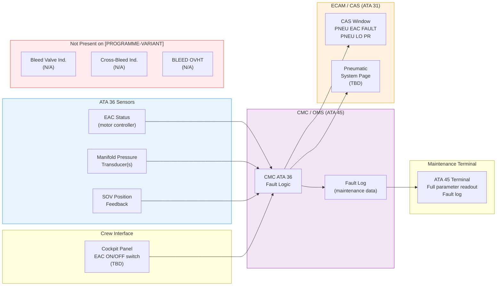
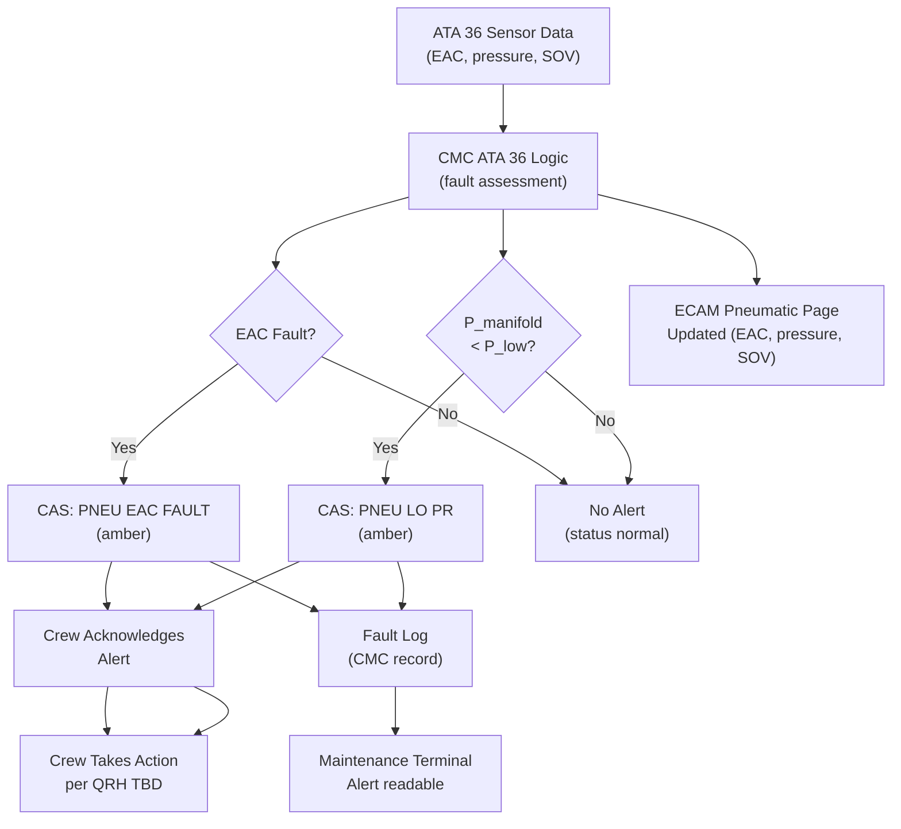
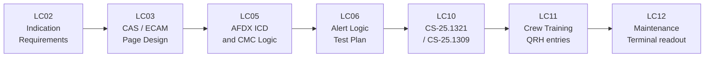

# 036-060 — Pneumatic System Indication and Warning
### [PROGRAMME-AIRCRAFT] [PROGRAMME-VARIANT] · ATA 36 · Q+ATLANTIDE ATLAS Scaffold

---

## §0 Hyperlink Policy

All internal links in this document use relative paths from the current directory. External regulatory and standards references use anchor links defined in [§20 References](#20-references). Links marked **TBD** indicate targets not yet allocated within the CSDB or ATLAS hierarchy. Programme-level links traverse five directory levels (`../../../../../`) to reach the repository root. No absolute URLs are used for internal navigation.

---

## §1 Purpose

This document defines the agnostic ATLAS standard-level architecture context for `036-060 — Pneumatic System Indication and Warning`.

It describes the controlled scope, functions, interfaces, safety considerations, lifecycle traceability, and S1000D/CSDB mapping logic that programme implementations shall instantiate when this node is applicable.

This document is not a programme design baseline. Programme-specific capacities, locations, part numbers, effectivity, operating limits, maintenance references, and data module codes shall be defined only inside the applicable programme implementation branch.
## §2 Applicability

| Applicability Level | Rule |
|---|---|
| Standard taxonomy | Applies to the ATLAS node `<NODE>` |
| Programme implementation | Conditional; determined by programme architecture, trade studies, certification basis, and applicability model |
| Product configuration | Defined in the programme-specific configuration baseline |
| Effectivity | Defined in the programme CSDB / applicability layer |
| Non-applicability | Must be explicitly stated in the programme impact-study branch when excluded |
## §3 System / Function Overview

### 3.1 [PROGRAMME-VARIANT] Pneumatic Indication Architecture

The ATA 36 indication and warning system for the [PROGRAMME-VARIANT] provides:

1. **Crew Alerting System (CAS) alerts** — two primary alerts via ECAM CAS window:
   - `PNEU EAC FAULT` (amber) — EAC motor fault, controller fault, or overcurrent
   - `PNEU LO PR` (amber) — manifold pressure below P_low threshold (leak or EAC failure)

2. **ECAM Pneumatic System Page** (TBD — if dedicated page created):
   - EAC status (ON / OFF / FAULT) — text annunciation
   - Manifold pressure — analogue or digital readout (psi)
   - SOV status (Door Seal / Water Tank) — OPEN / CLOSED
   - System schematic (simplified) showing EAC → manifold → consumers

3. **Maintenance terminal** (ATA 45):
   - Full EAC parameters: outlet pressure, motor current, temperature, run hours
   - SOV position (each)
   - CMC fault log for ATA 36
   - Ground test mode activation

### 3.2 Indications NOT Present on [PROGRAMME-VARIANT] (vs. Conventional)

| Indication | Conventional Aircraft | [PROGRAMME-VARIANT] |
|---|---|---|
| ENG 1 BLEED ON/OFF | Yes (both engines) | **None** — no bleed |
| CROSS BLEED OPEN/CLOSED | Yes | **None** — no cross-bleed |
| Bleed valve position (each) | Yes | **None** — no bleed valve |
| Pre-cooler outlet temperature | Yes | **None** — no pre-cooler |
| BLEED OVHT alert | Yes (amber/red) | **None** — no OHT (bleed-less) |
| BLEED LEAK alert | Yes | **None** — replaced by PNEU LO PR |
| HP/LP selection indication | Yes (some types) | **None** |
| Pack valve status (from bleed) | Yes (ATA 21 bleed valve indication) | **None** — EDC sourced |
| APU BLEED indication | Yes | **None** — no APU |

---

## §4 Scope

### 4.1 Included
- CAS alert: "PNEU EAC FAULT" (amber) — definition, trigger logic, display, reset condition
- CAS alert: "PNEU LO PR" (amber) — definition, trigger logic, display, reset condition
- ECAM Pneumatic System Page content specification (if page created — TBD)
- ECAM page: EAC ON/OFF/FAULT, manifold pressure readout, SOV status display
- ECAM page simplified schematic: EAC → filter → regulator → manifold → consumers
- AFDX data interface from ATA 36 sensors/CMC to ECAM (ATA 31)
- Overhead or central pedestal panel provisions for EAC ON/OFF switch (TBD — if manual switch fitted)
- Maintenance terminal readout for ATA 36 parameters and fault log

### 4.2 Excluded
- Bleed valve indications (not applicable)
- Cross-bleed valve indications (not applicable)
- Bleed OVHT alerts (not applicable)
- ATA 26 fire/smoke alerts (separate — ATA 26 scope)
- ECS/Pressurisation ECAM page (ATA 21 — separate)
- Wing anti-ice ECAM page (ATA 30 — separate; no ATA 36 supply)

---

## §5 Architecture Description

### 5.1 CAS Alert Definitions

| Alert Text | Colour | Priority | Trigger Condition | Reset Condition |
|---|---|---|---|---|
| PNEU EAC FAULT | Amber | Caution | EAC motor controller fault signal active | EAC fault cleared + CMC reset |
| PNEU LO PR | Amber | Caution | Manifold pressure < P_low (TBD psi) for T_detect (TBD s) | Manifold pressure returns to ≥ P_low + hysteresis |

### 5.2 ECAM Pneumatic Page Content (TBD — Provisional)

```
PNEUMATIC                               [ATA 36]
─────────────────────────────────────────────────
  EAC        [ON  / OFF / FAULT]
  MANIFOLD   [XX.X psi]
  SOV DS     [OPEN / CLSD]
  SOV WT     [OPEN / CLSD]

  ┌──────────────────────────────────────────┐
  │  [EAC]──[F]──[REG]──[ACC]──[MFD]        │
  │                           │              │
  │                      [SOV DS]─ Door Seals│
  │                      [SOV WT]─ Water Tank│
  └──────────────────────────────────────────┘
NOTE: This [PROGRAMME-VARIANT] has no engine bleed air.
      ATA 36 = residual low-pressure circuit only.
─────────────────────────────────────────────────
```
*(Schematic above is indicative only — final display format TBD per ATA 31 ECAM design standard)*

### 5.3 AFDX Data Interface

| Data Item | Source | Bus | Destination | Refresh Rate |
|---|---|---|---|---|
| EAC ON/OFF status | EAC motor controller | AFDX | CMC → ECAM |  Hz |
| EAC FAULT flag | EAC motor controller | AFDX | CMC → ECAM |  Hz |
| Manifold pressure (primary) | Pressure transducer | AFDX | CMC → ECAM |  Hz |
| SOV-DS position | SOV micro-switch | AFDX | CMC → ECAM |  Hz |
| SOV-WT position | SOV micro-switch | AFDX | CMC → ECAM |  Hz |
| PNEU EAC FAULT CAS | CMC logic | AFDX | CMC → CAS | Event-driven |
| PNEU LO PR CAS | CMC logic | AFDX | CMC → CAS | Event-driven |

### 5.4 Cockpit Panel Provisions

| Item | Location | Type | Status |
|---|---|---|---|
| EAC ON/OFF switch | Overhead panel (TBD) or pedestal | Latching toggle / guarded switch (TBD) |  |
| EAC FAULT light | Integrated with switch (TBD) or ECAM only | Amber LED / ECAM only (TBD) |  |
| Pneumatic ECAM page access | ECAM keypad / touch (ATA 31) | Software page selection |  |

---

## §6 Functional Breakdown

| Function | Component | Interface | Status |
|---|---|---|---|
| PNEU EAC FAULT alert generation | CMC ATA 36 logic | ATA 36-010 EAC → CMC → ECAM CAS |  |
| PNEU LO PR alert generation | CMC pressure logic | ATA 36-020 transducers → CMC → ECAM CAS |  |
| ECAM Pneumatic Page display | ECAM display system (ATA 31) | AFDX from CMC |  |
| Manifold pressure readout | ECAM display | CMC → AFDX → ECAM |  |
| SOV position display | ECAM display | CMC → AFDX → ECAM |  |
| EAC status display | ECAM display | CMC → AFDX → ECAM |  |
| Maintenance terminal readout | ATA 45 terminal | CMC data |  |

---

## §7 System Context Diagram



---

## §8 Internal Functional Architecture



---

## §9 Lifecycle Traceability



---

## §10 Interfaces

| Interface | ATA Chapter | Description | Direction |
|---|---|---|---|
| EAC motor controller | ATA 36-010 | EAC ON/OFF, FAULT status to CMC | ATA 36-010 → ATA 36-060 |
| Manifold pressure transducers | ATA 36-020 | Pressure data to CMC | ATA 36-020 → ATA 36-060 |
| SOV position feedback | ATA 36-030/040 | SOV open/closed status to CMC | ATA 36-030 → ATA 36-060 |
| CMC / OMS | ATA 45 | Fault logic, data consolidation, AFDX output | ATA 36-060 ↔ ATA 45 |
| ECAM display system | ATA 31 | CAS alerts and system page display | ATA 36-060 → ATA 31 |
| Cockpit panel | ATA 31 | EAC ON/OFF switch (TBD) | Crew → ATA 36-060 |
| Maintenance terminal | ATA 45 | Full parameter readout and fault log | ATA 36-060 → ATA 45 |
| AFDX bus | ATA 42 | Data transport from CMC to ECAM | ATA 36-060 → ATA 42 |

---

## §11 Operating Modes

| Mode | CAS Active | ECAM Page | Maint Terminal |
|---|---|---|---|
| Normal — EAC running, no fault | None | Normal (all green) | Live data |
| EAC FAULT | PNEU EAC FAULT (amber) | EAC shows FAULT | Fault code + run hours |
| PNEU LO PR | PNEU LO PR (amber) | Pressure readout in amber | Pressure data + fault flag |
| Both alerts | Both amber alerts | EAC FAULT + pressure amber | Both fault codes |
| Maintenance mode | None (ground — EAC test) | N/A | Active test readout |
| Circuit depressurised / EAC OFF | None (if commanded OFF) | EAC shows OFF | OFF status |

---

## §12 Monitoring and Diagnostics

| Alert | Trigger | Inhibit Conditions | Cockpit Effect |
|---|---|---|---|
| PNEU EAC FAULT | EAC fault signal from motor controller | Ground test mode (TBD) | Amber CAS, ECAM pneumatic page |
| PNEU LO PR | Manifold P < P_low for T_detect | EAC intentionally OFF (no demand) | Amber CAS, pressure amber on ECAM page |
| SOV disagree (TBD) | SOV command ≠ feedback for >TBD s | Transition time (TBD) | CMC fault log only (no crew alert TBD) |

---

## §13 Maintenance Concept

### 13.1 Maintenance Terminal Readout
Via ATA 45 maintenance terminal:
- EAC status: ON / OFF / FAULT
- EAC motor current (A): 
- EAC motor temperature (°C): 
- EAC run hours: 
- Manifold pressure (primary + redundant) (psi): live
- SOV-DS position: OPEN / CLSD
- SOV-WT position: OPEN / CLSD
- Fault log: up to TBD entries (PNEU EAC FAULT, PNEU LO PR with timestamp)
- Ground test mode: activate EAC and SOVs for maintenance test

### 13.2 CAS Alert Response (QRH — TBD)
- "PNEU EAC FAULT": check EAC switch ON; if fault persists → maintenance action post-flight (EAC fault isolation per S1000D DM 036-10-400)
- "PNEU LO PR": check EAC running; if pressure low with EAC ON → possible leak; monitor; maintenance action post-flight (leak test per S1000D DM 036-70 procedure)

---

## §14 S1000D / CSDB Mapping

| DM Code (planned) | Info Code | Title | Status |
|---|---|---|---|
| DMC-<PROGRAMME>-<VARIANT>-036-60-00A-040A-A | 040 | ATA 36-060 — Pneumatic Indication and Warning — Description |  |
| DMC-<PROGRAMME>-<VARIANT>-036-60-00A-300A-A | 300 | ATA 36-060 — CAS Alert Functional Test |  |
| DMC-<PROGRAMME>-<VARIANT>-036-60-00A-400A-A | 400 | ATA 36-060 — ECAM Indication Fault Isolation |  |

---

## §15 Footprints

| Item | Notes | Status |
|---|---|---|
| ECAM Pneumatic Page | Software — no additional hardware |  |
| CAS alerts (2) | Software entries in CAS database |  |
| EAC ON/OFF switch (TBD) | If fitted: small panel switch; mass negligible |  |
| AFDX ICD entries | Software / data — no hardware |  |

---

## §16 Safety and Certification

| Requirement | Standard | Applicability | Notes |
|---|---|---|---|
| Pneumatic systems indication | CS-25.1438 | Full | Alert coverage for ATA 36 |
| Flight crew alerting | CS-25.1309 + AMC | Full | Alert priority, colour, logic per CS-25.1322 |
| Display arrangement | CS-25.1321 | Full | ECAM page layout and readability |
| Systems and installations | CS-25.1309 | Full | Alert logic failure modes |
| No bleed indications | N/A | Confirmed | [PROGRAMME-VARIANT] ECAM does not include bleed valve or OHT indications |

---

## §17 Verification and Validation

| V&V Activity | Method | Acceptance Criteria | Status |
|---|---|---|---|
| PNEU EAC FAULT alert functional test | Induce EAC fault; verify CAS alert and ECAM page | Alert within TBD s; correct colour/priority |  |
| PNEU LO PR alert functional test | Reduce manifold pressure below P_low; verify alert | Alert within T_detect + TBD s |  |
| Alert reset test | Clear fault; verify alert clears | Alert clears within TBD s |  |
| ECAM page readability | Cockpit evaluation | All parameters readable in ambient and low-light |  |
| Manifold pressure indication accuracy | Compare ECAM readout to reference gauge | ± TBD psi |  |
| Maintenance terminal readout functional | CMC terminal test with EAC running | All parameters displayed correctly |  |
| CMC fault log verification | Generate fault; verify log entry with timestamp | Log entry correct within TBD s |  |
| CS-25.1322 alert priority compliance | Analysis | Alert colour/priority per CS-25.1322 |  |

---

## §18 Glossary

| Term | Definition |
|---|---|
| CAS | Crew Alerting System — cockpit alert presentation system |
| ECAM | Electronic Centralised Aircraft Monitor — multi-function display for system status and alerts |
| PNEU EAC FAULT | Amber CAS alert indicating EAC motor/controller fault |
| PNEU LO PR | Amber CAS alert indicating manifold pressure below threshold |
| AFDX | Avionics Full-Duplex Switched Ethernet — aircraft data bus connecting CMC to ECAM |
| CMC | Central Maintenance Computer — processes ATA 36 sensor data and generates alerts |
| EAC | Electric Air Compressor — on-board pneumatic source (ATA 36-010) |
| SOV | Shutoff Valve — consumer branch isolation valve |
| Bleed-less architecture | No engine bleed air; eliminates most conventional pneumatic indications |
| ICD | Interface Control Document — defines AFDX data items between ATA 36 and ATA 31/42 |
| QRH | Quick Reference Handbook — crew procedure for CAS alert response |
| CS-25.1321 | EASA — Arrangement and visibility of instruments |
| CS-25.1322 | EASA — Flight crew alerting — alert categories and colours |
| CS-25.1438 | EASA — Pneumatic systems certification requirement |
| DO-160G | RTCA environmental qualification standard |
| P_low | Lower pressure threshold for PNEU LO PR alert (TBD psi) |

---

## §19 Citations

1. EASA CS-25 §25.1438 — Pneumatic Systems
2. EASA CS-25 §25.1309 — Systems and Installations
3. EASA CS-25 §25.1321 — Arrangement and Visibility of Instruments
4. EASA CS-25 §25.1322 — Flight Crew Alerting
5. RTCA DO-160G — Environmental Conditions and Test Procedures
6. S1000D Issue 5.0
7. ATA iSpec 2200 — ATA 36 Pneumatic / ATA 31 Indicating Systems

---

## §20 References

| Ref ID | Document | Source | Link |
|---|---|---|---|
| [ATA36] | ATA iSpec 2200 Chapter 36 | ATA | — |
| [ATA31] | ATA iSpec 2200 Chapter 31 — Instruments | ATA | — |
| [CS25-1438] | CS-25 §25.1438 | EASA | https://www.easa.europa.eu/ |
| [CS25-1322] | CS-25 §25.1322 | EASA | https://www.easa.europa.eu/ |
| [CS25-1321] | CS-25 §25.1321 | EASA | https://www.easa.europa.eu/ |
| [DO-160G] | RTCA DO-160G | RTCA | https://www.rtca.org/ |
| [S1000D] | S1000D Issue 5.0 | ASD/AIA | https://s1000d.org/ |
| [036-000] | ATA 36 General | Internal | [036-000](./036-000-Pneumatic-General.md) |
| [036-050] | ATA 36 Leak Detection | Internal | [036-050](./036-050-Leak-Detection-and-Overheat-Protection.md) |
| [036-080] | ATA 36 Monitoring / Diagnostics | Internal | [036-080](./036-080-Pneumatic-Monitoring-Diagnostics-and-Control-Interfaces.md) |

---

## §21 Open Issues

| Issue ID | Description | Owner | Priority | Status |
|---|---|---|---|---|
| OI-036-001 | **Retain or eliminate ATA 36**: if eliminated, ECAM page and CAS alerts not required | Q-AIR | Critical |  |
| OI-036-025 | **Dedicated ECAM page**: whether ATA 36 warrants a dedicated ECAM page or is integrated into a "utilities" page — depends on system scope | Q-AIR / ATA 31 | Medium |  |
| OI-036-026 | **EAC ON/OFF switch location**: overhead panel vs. ECAM touchscreen control vs. software-only (auto) — crew workload and philosophy | Q-AIR / human factors | Medium |  |
| OI-036-027 | **CAS alert text finalisation**: "PNEU EAC FAULT" and "PNEU LO PR" text to be approved by human factors / authority | Q-AIR / ORB-LEG | Medium |  |
| OI-036-028 | **SOV disagree alert**: whether to surface SOV position disagree to crew or maintenance-only — alert philosophy TBD | Q-AIR | Low |  |
| OI-036-029 | **AFDX ICD**: ATA 36 → ATA 31/42 interface control document — not yet authored | Q-DATAGOV | High |  |

---

## §22 Change Log

| Revision | Date | Author | Description |
|---|---|---|---|
| 0.1.0 | 2026-05-10 | Q+ATLANTIDE scaffold generator | Initial full-template scaffold — all sections present; minimal [PROGRAMME-VARIANT] indication set documented |
