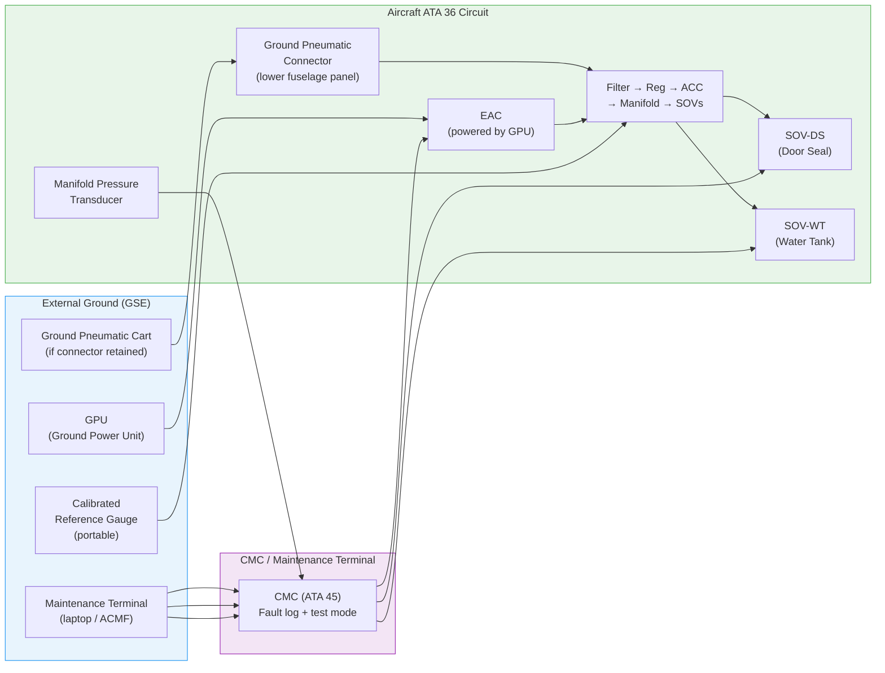
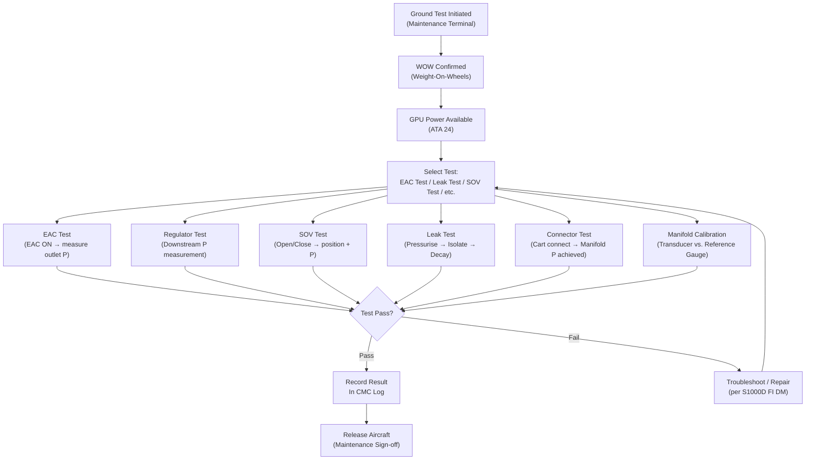
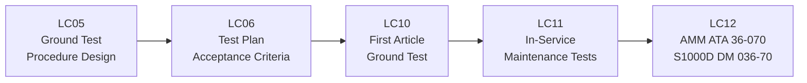

# 036-070 — Pneumatic Ground Service and Test Interfaces
### AMPEL360e eWTW · ATA 36 · Q+ATLANTIDE ATLAS Scaffold

---

## §0 Hyperlink Policy

All internal links in this document use relative paths from the current directory. External regulatory and standards references use anchor links defined in [§20 References](#20-references). Links marked **TBD** indicate targets not yet allocated within the CSDB or ATLAS hierarchy. Programme-level links traverse five directory levels (`../../../../../`) to reach the repository root. No absolute URLs are used for internal navigation.

---

## §1 Purpose

This document describes the ground service and test interfaces for the AMPEL360e eWTW residual pneumatic circuit (ATA 36-070). It covers the external ground pneumatic connector, ground test procedures (EAC functional test, regulator set-point verification, SOV function test, system leak test, ground connector coupling test, manifold pressure indication accuracy check), and the Ground Support Equipment (GSE) interface.

**eWTW context**: The ground service scope for ATA 36 on the eWTW is significantly reduced compared to conventional bleed-air aircraft. Conventional aircraft require extensive ground bleed testing (engine start for bleed supply, cross-bleed checks, pack valve tests, pre-cooler temperature measurements). On the eWTW, all ground tests can be performed with external electrical power (GPU), using the on-board EAC or an external pneumatic cart (if ground connector retained). No engine operation is required for ATA 36 ground testing.

---

## §2 Applicability

| Attribute | Value |
|---|---|
| Programme | AMPEL360e Wide Tube-and-Wing (eWTW) |
| ATA Subsubject | 036-070 — Ground Service and Test Interfaces |
| Engine operation for ATA 36 test | **Not required** — EAC powered by GPU |
| Ground pneumatic connector |  (retained or eliminated — see OI-036-005) |
| Ground connector type |  (standard aircraft pneumatic quick-disconnect TBD) |
| Ground connector location | Lower fuselage panel —  |
| Test pressure (leak test) |  psi (circuit working pressure) |
| GSE required | Ground pneumatic cart (if connector retained) and/or calibrated pressure gauge |
| Certification Basis | CS-25.1438; CS-25.1301/1309 |
| S1000D SNS | 036-70 |

---

## §3 System / Function Overview

### 3.1 Ground Service Operations

Ground service operations for ATA 36 on the eWTW include:

| Operation | Method | Frequency |
|---|---|---|
| EAC functional test | GPU power → EAC enable → measure outlet pressure and flow | Post-install; periodic (TBD) |
| Regulator set-point verification | Downstream pressure measurement with calibrated gauge | Post-install; after regulator replacement |
| SOV function test | Maintenance terminal → open/close each SOV → verify position feedback and downstream pressure | Periodic (TBD); post-SOV replacement |
| System leak test (pressure decay) | Pressurise circuit; isolate EAC; monitor pressure vs. time | Post-repair; periodic (TBD) |
| Ground connector coupling test | Connect ground cart; verify supply to manifold; disconnect | After connector replacement or periodic check |
| Manifold pressure indication accuracy | Compare ECAM/CMC transducer vs. calibrated reference gauge | Periodic calibration (TBD) |
| Door seal inflation test | Command SOV-DS open; verify door seals inflate (visual + pressure) | Post-maintenance; door replacement |
| Water tank pressurisation test | Command SOV-WT open; verify tank pressure achieved | Post-maintenance; water tank service |
| EAC BITE test | Maintenance terminal → EAC BITE command | On power-up; post-EAC replacement |

### 3.2 Ground Pneumatic Connector Functional Use

If the ground pneumatic connector is retained (OI-036-005 TBD), it provides:
- **Maintenance blow-down** of residual circuit (clearing contaminants)
- **Circuit test with EAC isolated** (EAC de-energised for safety; ground cart supplies air)
- **Door seal test** from external source
- **Water tank pressurisation** from ground supply (if EAC not suitable for ground servicing)
- **Cargo hold cleaning** (compressed air blow-down — TBD applicability)

---

## §4 Scope

### 4.1 Included
- Ground pneumatic connector: receptacle, coupling, isolation solenoid, check valve, dust cap, access panel (ATA 36-010 interface — hardware described here for ground service context)
- Ground test procedures: EAC output test, regulator set-point check, SOV function test, pressure decay leak test, connector coupling test, manifold pressure indication calibration
- GSE interface: standard ground pneumatic cart (if connector retained), calibrated pressure gauge, maintenance terminal connection
- Ground test mode activation: via ATA 45 maintenance terminal, EAC commanded on ground; SOVs commanded individually
- Post-maintenance test requirements: mandatory tests after EAC or component replacement
- Acceptance criteria for each test (TBD values noted with TBD badges)

### 4.2 Excluded
- EAC component detail (ATA 36-010)
- SOV component detail (ATA 36-030/040)
- In-flight test procedures (covered in ATA 36-080)
- Engine operation (not required for ATA 36 ground test on eWTW)
- High-pressure ground cart for bleed air (not applicable)

---

## §5 Architecture Description

### 5.1 Ground Test Circuit (Test Mode)

When ground test mode is activated via the maintenance terminal:
1. Aircraft on ground (weight-on-wheels confirmed)
2. GPU power connected (ATA 24)
3. Maintenance terminal commands EAC ON (or ground cart connected)
4. EAC runs; circuit pressurises to set-point
5. Maintenance technician can command each SOV open/closed
6. Pressure transducers readable via maintenance terminal
7. At end of test: EAC commanded OFF; circuit can be vented via PRV or manual drain (TBD)

### 5.2 Leak Test Procedure (Overview)

| Step | Action | Acceptance |
|---|---|---|
| 1 | Pressurise circuit to working pressure via EAC or ground cart | Manifold P ≥ set-point |
| 2 | Isolate EAC (de-energise or close EAC isolation) | EAC off; no supply |
| 3 | Stabilise (TBD min) | Pressure settles |
| 4 | Record initial pressure P₀ | — |
| 5 | Wait T_test (TBD min) | — |
| 6 | Record final pressure P₁ | — |
| 7 | Calculate decay: P₀ − P₁ | Accept if < TBD psi/min |
| 8 | If fail: locate leak with approved detection method | Soap solution / electronic detector TBD |
| 9 | Repair and retest | Pass criteria as step 7 |

### 5.3 Ground Connector Specification (For Ground Service Context)

| Parameter | Value |
|---|---|
| Connector type | Standard aircraft pneumatic quick-disconnect — TBD (e.g., 2.5" HP or LP coupling) |
| Location | Lower fuselage panel, station TBD |
| Access panel | Hinged or flush — TBD |
| Max supply pressure from cart | TBD psi |
| Built-in NRV | Yes (prevents backflow into ground cart) |
| Built-in isolation solenoid | TBD (normally closed — opens when cart connected + ground command) |
| Dust cap | Required (captive preferred) |
| Placard | "PNEUMATIC SERVICE / MAX PRESSURE TBD PSI" — TBD |
| Colour code | TBD (to differentiate from other service points) |

---

## §6 Functional Breakdown

| Ground Service / Test | Purpose | Trigger | Method |
|---|---|---|---|
| EAC functional test | Verify EAC output pressure and flow | Post-install; post-fault | Maintenance terminal + calibrated gauge |
| Regulator set-point verification | Confirm regulator set-point within tolerance | Post-install; post-regulator replacement | Calibrated gauge downstream of regulator |
| SOV open/close test | Verify SOV opens and closes correctly; confirm position feedback | Post-install; periodic | Maintenance terminal command + pressure observation |
| System leak test | Confirm circuit integrity (no leaks) | Post-repair; periodic | Pressure decay procedure (§5.2) |
| Ground connector coupling test | Verify external cart interfaces correctly with aircraft connector | Post-connector replacement; periodic | Connect cart; verify manifold pressurises |
| Manifold pressure calibration | Verify transducer accuracy | Periodic; post-replacement | Compare vs. calibrated reference gauge |
| Door seal inflation test | Verify door seals inflate from circuit | Post-door maintenance | SOV-DS open; visual + pressure check |
| Water tank pressurisation test | Verify water tank pressurises from circuit | Post-water system maintenance | SOV-WT open; verify tank pressure |
| EAC BITE test | Verify EAC self-test | Post-EAC replacement; power-up | Maintenance terminal BITE command |

---

## §7 System Context Diagram

---

## §8 Internal Functional Architecture

---

## §9 Lifecycle Traceability

---

## §10 Interfaces

| Interface | ATA Chapter | Description | Direction |
|---|---|---|---|
| Ground pneumatic connector | ATA 36-010 | External cart to circuit via connector | External → ATA 36 |
| EAC (test command) | ATA 36-010 | Maintenance terminal commands EAC ON/OFF | ATA 36-070 → ATA 36-010 |
| SOVs (test command) | ATA 36-030/040 | Maintenance terminal commands SOV open/close | ATA 36-070 → ATA 36-030 |
| Manifold pressure transducer | ATA 36-020 | Pressure data during leak test | ATA 36-020 → ATA 36-070 |
| CMC / maintenance terminal | ATA 45 | Test mode activation, fault log, parameter readout | ATA 36-070 ↔ ATA 45 |
| Electrical power (GPU) | ATA 24 | Powers EAC and SOV solenoids during ground test | ATA 24 → ATA 36-070 |
| Door seals | ATA 52 | Door seal inflation test (observe seals) | ATA 36-070 → ATA 52 |
| Water tank | ATA 38 | Water tank pressurisation test | ATA 36-070 → ATA 38 |

---

## §11 Operating Modes

| Mode | Description | Prerequisites |
|---|---|---|
| EAC ground test | EAC ON from GPU; measure outlet pressure and flow | WOW, GPU power, maintenance terminal |
| Pressure decay leak test | Pressurise circuit; isolate; monitor decay | WOW, GPU or cart, circuit sealed |
| SOV function test | Command each SOV open/close via terminal | WOW, circuit pressurised, terminal connected |
| Ground connector test | Connect external cart; verify manifold pressurises | WOW, external cart available |
| Regulator set-point check | Downstream pressure vs. set-point with calibrated gauge | WOW, circuit pressurised |
| Manifold transducer calibration | Compare terminal readout vs. reference gauge | WOW, circuit pressurised |
| Post-maintenance verification | Mandatory tests after component replacement | Specific test per replaced component |

---

## §12 Monitoring and Diagnostics

Ground test monitoring is via the maintenance terminal (ATA 45). All test results are recorded in the CMC fault log. Key parameters monitored during ground test:

| Parameter | Instrument | Acceptance |
|---|---|---|
| EAC outlet pressure | CMC terminal readout + portable reference gauge | ≥ set-point TBD psi |
| Manifold pressure (during leak test) | CMC terminal readout | Decay < TBD psi/min |
| SOV position (after command) | CMC terminal readout | Open = confirmed open; Closed = confirmed closed |
| Ground connector manifold pressure | CMC terminal readout | ≥ set-point within TBD s |
| Regulator downstream pressure | Portable calibrated gauge + CMC readout | Set-point ± TBD % |
| Door seal inflation (visual) | Technician visual inspection | Seals visibly inflated, no obvious leakage |

---

## §13 Maintenance Concept

### 13.1 Mandatory Post-Replacement Tests

| Replaced Component | Mandatory Test |
|---|---|
| EAC | EAC functional test + BITE + system leak test |
| Pressure regulator | Regulator set-point verification + system leak test |
| SOV (any) | SOV function test + system leak test |
| Any tubing / fitting | System leak test |
| Manifold pressure transducer | Manifold pressure calibration check |
| Ground connector / coupling | Ground connector coupling test |
| Accumulator | System leak test + accumulator proof pressure test (bench) |

### 13.2 Periodic Ground Tests (Maintenance Programme — TBD)

| Test | Interval | Reference DM |
|---|---|---|
| System leak test (pressure decay) | TBD (e.g., A-check or on-condition) | DMC-AMPEL360E-EWTW-036-70-300 |
| Manifold pressure calibration | TBD | DMC-AMPEL360E-EWTW-036-70-300 |
| SOV function test | TBD | DMC-AMPEL360E-EWTW-036-70-300 |
| EAC BITE | On power-up (automatic) + TBD scheduled | DMC-AMPEL360E-EWTW-036-70-400 |
| Ground connector inspection | TBD | DMC-AMPEL360E-EWTW-036-70-300 |

---

## §14 S1000D / CSDB Mapping

| DM Code (planned) | Info Code | Title | Status |
|---|---|---|---|
| DMC-AMPEL360E-EWTW-036-70-00A-040A-A | 040 | ATA 36-070 — Ground Service and Test Interfaces — Description |  |
| DMC-AMPEL360E-EWTW-036-70-00A-300A-A | 300 | ATA 36-070 — System Leak Test (Pressure Decay) Procedure |  |
| DMC-AMPEL360E-EWTW-036-70-00A-300B-A | 300 | ATA 36-070 — SOV Function Test Procedure |  |
| DMC-AMPEL360E-EWTW-036-70-00A-300C-A | 300 | ATA 36-070 — Regulator Set-Point Verification |  |
| DMC-AMPEL360E-EWTW-036-70-00A-400A-A | 400 | ATA 36-070 — Ground Test Fault Isolation |  |

---

## §15 Footprints

| Item | Notes | Status |
|---|---|---|
| Ground pneumatic connector (aircraft side) | Low mass — small panel fitting |  |
| Access panel for connector | Small hinged/flush panel — lower fuselage |  |
| Placard / markings | Per airport/MRO marking standards |  |
| GSE (ground cart) | Customer-provided or MRO-provided — not aircraft mass | External |

---

## §16 Safety and Certification

| Requirement | Standard | Applicability | Notes |
|---|---|---|---|
| Ground test procedures | CS-25.1438 compliance evidence | Ground test used to demonstrate compliance | |
| Ground safety | Company ground test safety standards | Mandatory | Lockout/tagout of EAC before tubing work; WOW interlock |
| Max test pressure | CS-25.1438 | Circuit must not exceed proof pressure during test | Test pressure ≤ working pressure (not a proof test unless noted) |
| Ground personnel safety | Company HSE standards | Low-pressure circuit — low injury risk from ATA 36 (no hot air) | |
| Engine operation | **Not required** | eWTW — EAC powered by GPU for all ATA 36 ground tests | Significant safety benefit (no jet blast during test) |

### 16.1 Safety Notes
- All ground pneumatic tests require WOW (weight-on-wheels) confirmation
- EAC must be de-energised before disconnecting any tubing (depressurise first)
- Ground connector must be capped when not in use (FOD / contamination prevention)
- PRV vent must be clear of personnel and equipment during test

---

## §17 Verification and Validation

| V&V Activity | Method | Acceptance Criteria | Status |
|---|---|---|---|
| EAC functional test | GPU power → EAC → calibrated gauge | Outlet P ≥ set-point TBD psi |  |
| Regulator set-point verification | Downstream calibrated gauge | Set-point ± TBD % |  |
| SOV open/close test | Terminal command → position + pressure | Open: flow confirmed; Close: no flow |  |
| System leak test (pressure decay) | Pressurise → isolate → monitor TBD min | Decay < TBD psi/min |  |
| Ground connector coupling test | Connect cart → manifold pressure achieved | Manifold P ≥ set-point within TBD s |  |
| Manifold pressure indication accuracy | CMC readout vs. calibrated reference | ± TBD psi |  |
| CMC fault flag verification | Induce EAC fault → CAS alert | Alert within TBD s |  |
| EAC BITE | BITE command → CMC log | BITE PASS |  |

---

## §18 Glossary

| Term | Definition |
|---|---|
| GPU | Ground Power Unit — external electrical power source used to power aircraft systems on ground without engines running |
| GSE | Ground Support Equipment — equipment used to service and test aircraft on the ground (carts, gauges, tools) |
| Ground pneumatic connector | External service receptacle on fuselage for connecting ground pneumatic cart |
| Pressure decay test | Leak test method: pressurise circuit, isolate source, monitor pressure loss over time |
| WOW | Weight-On-Wheels — landing gear compressed = aircraft on ground; interlock prevents certain operations in flight |
| EAC | Electric Air Compressor — on-board pneumatic source; ground-testable with GPU power only |
| SOV | Shutoff Valve — consumer branch isolation valve |
| CMC | Central Maintenance Computer — provides maintenance terminal interface |
| BITE | Built-In Test Equipment — EAC self-test on command |
| Maintenance terminal | Laptop or ACMF (Aircraft Condition Monitoring Function) interface to CMC |
| Set-point | Nominal regulated pressure downstream of pressure regulator (TBD psi) |
| Calibrated reference gauge | Portable, traceable pressure gauge used to verify in-situ transducer accuracy |
| CS-25.1438 | EASA certification requirement for pneumatic systems |
| DO-160G | RTCA environmental qualification standard |
| AMM | Aircraft Maintenance Manual — document containing all maintenance and test procedures |
| ACMF | Aircraft Condition Monitoring Function — on-board or ground-based maintenance data system |

---

## §19 Citations

1. EASA CS-25 §25.1438 — Pneumatic Systems
2. EASA CS-25 §25.1309 — Systems and Installations
3. RTCA DO-160G — Environmental Conditions and Test Procedures
4. S1000D Issue 5.0
5. ATA iSpec 2200 — ATA 36 Pneumatic / Ground Service
6. AMPEL360e eWTW Maintenance Programme — TBD

---

## §20 References

| Ref ID | Document | Source | Link |
|---|---|---|---|
| [ATA36] | ATA iSpec 2200 Chapter 36 | ATA | — |
| [CS25-1438] | CS-25 §25.1438 | EASA | https://www.easa.europa.eu/ |
| [CS25-1309] | CS-25 §25.1309 | EASA | https://www.easa.europa.eu/ |
| [DO-160G] | RTCA DO-160G | RTCA | https://www.rtca.org/ |
| [S1000D] | S1000D Issue 5.0 | ASD/AIA | https://s1000d.org/ |
| [036-000] | ATA 36 General | Internal | [036-000](./036-000-Pneumatic-General.md) |
| [036-010] | ATA 36 Air Sources | Internal | [036-010](./036-010-Pneumatic-Air-Sources.md) |
| [036-050] | ATA 36 Leak Detection | Internal | [036-050](./036-050-Leak-Detection-and-Overheat-Protection.md) |
| [036-080] | ATA 36 Monitoring / Diagnostics | Internal | [036-080](./036-080-Pneumatic-Monitoring-Diagnostics-and-Control-Interfaces.md) |

---

## §21 Open Issues

| Issue ID | Description | Owner | Priority | Status |
|---|---|---|---|---|
| OI-036-005 | **Ground pneumatic connector retention**: retain or replace with ground electric-only supply — TBD architectural decision | Q-AIR | Medium |  |
| OI-036-001 | **Retain or eliminate ATA 36**: if eliminated, ATA 36-070 is informational only | Q-AIR | Critical |  |
| OI-036-030 | **Leak test acceptance criteria**: P_low, T_test, and acceptable decay rate — pending circuit sizing | Q-AIR | High |  |
| OI-036-031 | **Ground connector type and standard**: standard aircraft coupling type TBD — compatibility with ground fleet equipment at target airports | Q-MECHANICS | Medium |  |
| OI-036-032 | **WOW interlock for EAC ground test**: logic to prevent EAC in-flight activation during ground test mode — safety design TBD | Q-AIR | Medium |  |
| OI-036-033 | **Ground test DM structure**: S1000D DMRL for ATA 36-070 procedures — not yet authored | Q-DATAGOV | Medium |  |

---

## §22 Change Log

| Revision | Date | Author | Description |
|---|---|---|---|
| 0.1.0 | 2026-05-10 | Q+ATLANTIDE scaffold generator | Initial full-template scaffold — all sections present; content TBD/DRAFT |
