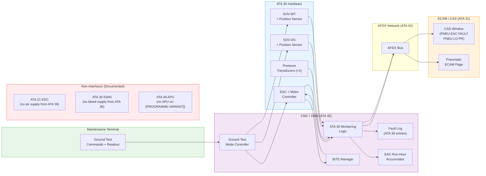
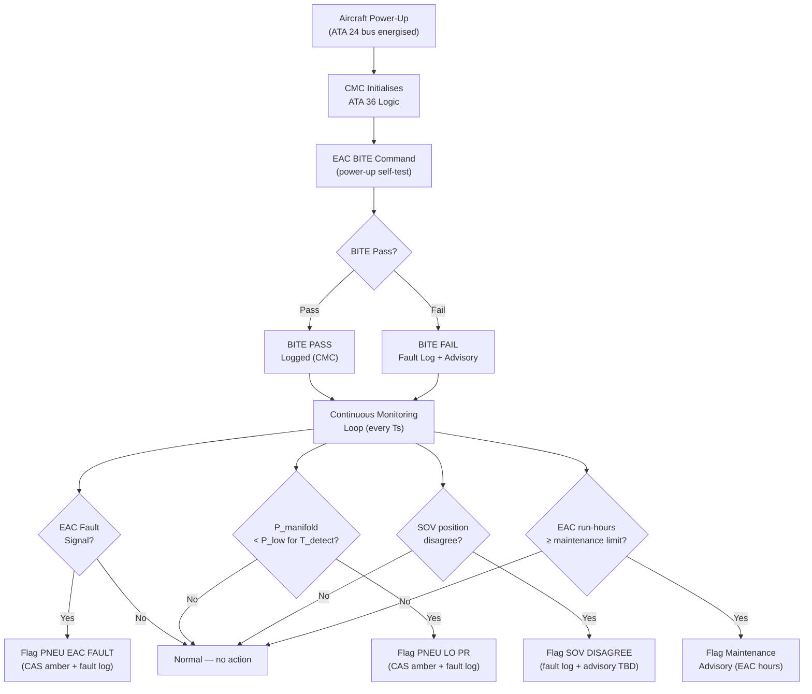
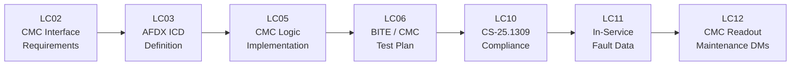

# 036-080 — Pneumatic Monitoring, Diagnostics, and Control Interfaces
### [PROGRAMME-AIRCRAFT] [PROGRAMME-VARIANT] · ATA 36 · Q+ATLANTIDE ATLAS Scaffold

---

## §0 Hyperlink Policy

All internal links in this document use relative paths from the current directory. External regulatory and standards references use anchor links defined in [§20 References](#20-references). Links marked **TBD** indicate targets not yet allocated within the CSDB or ATLAS hierarchy. Programme-level links traverse five directory levels (`../../../../../`) to reach the repository root. No absolute URLs are used for internal navigation.

---

## §1 Purpose

This document defines the agnostic ATLAS standard-level architecture context for `036-080 — Pneumatic Monitoring, Diagnostics, and Control Interfaces`.

It describes the controlled scope, functions, interfaces, safety considerations, lifecycle traceability, and S1000D/CSDB mapping logic that programme implementations shall instantiate when this node is applicable.

This document is not a programme design baseline. Programme-specific capacities, locations, part numbers, effectivity, operating limits, maintenance references, and data module codes shall be defined only inside the applicable programme implementation branch.
## §2 Applicability

| Applicability Level | Rule |
|---|---|
| Standard taxonomy | Applies to the ATLAS node `<NODE>` |
| Programme implementation | Conditional; determined by programme architecture, trade studies, certification basis, and applicability model |
| Product configuration | Defined in the programme-specific configuration baseline |
| Effectivity | Defined in the programme CSDB / applicability layer |
| Non-applicability | Must be explicitly stated in the programme impact-study branch when excluded |
## §3 System / Function Overview

### 3.1 CMC / OMS Monitoring Functions

The Central Maintenance Computer (CMC) performs the following functions for ATA 36:

| Function | Description |
|---|---|
| EAC status monitoring | Receives EAC ON/OFF and FAULT status from motor controller; records in fault log |
| EAC run-hour accumulation | CMC software counter increments while EAC motor running; triggers maintenance advisory at TBD hours |
| Manifold pressure monitoring | Reads primary + redundant manifold pressure transducers; compares to P_low threshold |
| Leak detection logic | Monitors for sustained pressure decay (see ATA 36-050); generates fault flags |
| SOV position monitoring | Reads SOV position feedback; detects disagree between command and position |
| BITE management | Commands EAC BITE on power-up; receives BITE pass/fail; records result |
| Fault log | Records all ATA 36 faults with timestamp (EAC FAULT, PNEU LO PR, SOV disagree, BITE fail) |
| AFDX data output | Transmits ATA 36 status data to ECAM (ATA 31) via AFDX (ATA 42) |
| Ground test mode control | When activated via maintenance terminal: enables EAC and SOV manual commands on ground |

### 3.2 Control Interface Summary

| Control Input | Source | Target | Action |
|---|---|---|---|
| EAC ON/OFF command | CMC (auto demand) or maintenance terminal | EAC motor controller | Start/stop EAC |
| SOV open/close command | CMC or maintenance terminal | SOV solenoid | Open/close consumer branch |
| EAC BITE command | CMC (power-up) or maintenance terminal | EAC BITE logic | Run self-test |
| Ground test mode enable | Maintenance terminal (ATA 45) | CMC ATA 36 logic | Enable manual test commands on ground |
| EAC shutdown (leak) | CMC leak detection logic | EAC motor controller | Shutdown EAC on confirmed major leak (TBD) |
| SOV isolation (leak) | CMC leak detection logic | SOV solenoid | Close suspect branch SOV on leak (TBD) |

---

## §4 Scope

### 4.1 Included
- CMC monitoring functions: EAC status, run hours, manifold pressure, SOV position, leak logic, BITE management
- CMC fault log entries for ATA 36 (EAC FAULT, PNEU LO PR, SOV disagree, BITE FAIL)
- AFDX ICD: data items from ATA 36 CMC to ECAM (ATA 31) and between ATA 36 and ATA 45
- EAC BITE: self-test logic within EAC motor controller; result reported to CMC
- Ground test mode: CMC enables manual EAC and SOV commands via maintenance terminal
- CMC run-hour advisory: maintenance alert at EAC scheduled maintenance interval
- Cross-interface documentation: ATA 21, ATA 30, ATA 49 — explicit non-interfaces documented

### 4.2 Excluded
- EAC hardware and motor controller design (ATA 36-010)
- SOV hardware (ATA 36-030/040)
- Pressure transducer hardware (ATA 36-010/020)
- CMC hardware (ATA 45 scope)
- AFDX switch/network hardware (ATA 42 scope)
- ATA 21 EDC monitoring (ATA 21 scope)
- ATA 30 EWAI monitoring (ATA 30 scope)
- ATA 49 APU functions (not applicable)

---

## §5 Architecture Description

### 5.1 AFDX Data Interface (ATA 36 → ATA 45/31/42)

| Data Item | Format | Source | Destination | Refresh Rate | Notes |
|---|---|---|---|---|---|
| EAC-1 ON/OFF | Boolean | EAC motor controller | CMC → ECAM |  Hz | |
| EAC-1 FAULT | Boolean | EAC motor controller | CMC → ECAM | Event-driven | Triggers CAS alert |
| EAC-1 motor current | Analog (A) | Motor controller | CMC (maintenance) |  Hz | Maintenance data |
| EAC-1 motor temp | Analog (°C) | Thermistor | CMC (maintenance) |  Hz | Maintenance data |
| EAC-1 run hours | Discrete (h) | CMC accumulator | CMC (maintenance) | On request | |
| Manifold P (primary) | Analog (psi) | Pressure transducer | CMC → ECAM |  Hz | |
| Manifold P (redundant) | Analog (psi) | Pressure transducer | CMC |  Hz | Cross-check |
| SOV-DS position | Discrete (Open/Closed) | SOV micro-switch | CMC → ECAM |  Hz | |
| SOV-WT position | Discrete (Open/Closed) | SOV micro-switch | CMC → ECAM |  Hz | |
| PNEU EAC FAULT flag | Boolean | CMC logic | ECAM CAS | Event-driven | |
| PNEU LO PR flag | Boolean | CMC logic | ECAM CAS | Event-driven | |
| BITE result | Pass/Fail | EAC BITE | CMC fault log | On BITE completion | |
| Leak flag (TBD) | Boolean | CMC pressure logic | ECAM / maint term | Event-driven | TBD logic |

### 5.2 CMC Fault Logic Description

```
Power-up:
  → CMC commands EAC BITE
  → BITE result received: PASS (log) / FAIL (flag CMC fault + advisory)

Continuous monitoring:
  → Manifold P read every Ts (TBD)
  → If P < P_low for T_detect: flag PNEU LO PR (CAS alert + fault log)
  → EAC motor controller fault: flag PNEU EAC FAULT (CAS alert + fault log)
  → SOV position feedback disagree for >T_disagree: flag SOV disagree (fault log + advisory TBD)
  → EAC run hours increment; advisory at TBD hours

Ground test mode:
  → Enabled via maintenance terminal (WOW = True)
  → Manual commands: EAC ON/OFF, SOV-DS OPEN/CLOSE, SOV-WT OPEN/CLOSE
  → Test results captured in CMC fault log
```

### 5.3 Interface with ATA 21, ATA 30, ATA 49 (Non-Interfaces)

| ATA Chapter | System | Interface Type | Description |
|---|---|---|---|
| ATA 21 | ECS / Pressurisation (EDC) | **No air supply** | EDC is independent source; ATA 36 EAC does not supply ATA 21 packs. Cross-reference documentation only — explicit in CMC ICD. |
| ATA 30 | Wing Anti-Ice (EWAI) | **No air supply** | EWAI is electric; ATA 36 provides no anti-ice bleed. ATA 30 data visible on ECAM anti-ice page; no ATA 36 data appears there. |
| ATA 49 | APU (none on [PROGRAMME-VARIANT]) | **No interface** | No APU; no APU bleed; no pneumatic interface. ATA 49 is replaced by electric GPU equivalent — no data exchange with ATA 36. |
| ATA 24 | Electrical power | **Power supply** | ATA 24 supplies 28 VDC to EAC motor and SOV solenoids; ELMS controls EAC bus assignment |
| ATA 45 | CMC / OMS | **Control + data** | CMC is the primary monitoring and fault management interface for ATA 36 |

---

## §6 Functional Breakdown

| Function | Implementation | Owner ATA | Status |
|---|---|---|---|
| EAC status monitoring | CMC reads motor controller output | ATA 36 / ATA 45 |  |
| EAC run-hour accumulation | CMC software counter | ATA 45 |  |
| Manifold pressure monitoring | CMC reads transducer data | ATA 36 / ATA 45 |  |
| Leak detection logic | CMC pressure decay algorithm | ATA 45 (ATA 36 logic) |  |
| SOV position monitoring | CMC reads SOV feedback | ATA 36 / ATA 45 |  |
| BITE management | CMC commands EAC BITE | ATA 36 / ATA 45 |  |
| Fault log | CMC fault database | ATA 45 |  |
| CAS alert output | ECAM CAS window | ATA 31 (from CMC via AFDX) |  |
| ECAM page data supply | AFDX data stream | ATA 42 / ATA 31 |  |
| Ground test mode | Maintenance terminal | ATA 45 |  |

---

## §7 System Context Diagram



---

## §8 Internal Functional Architecture



---

## §9 Lifecycle Traceability



---

## §10 Interfaces

| Interface | ATA Chapter | Interface Type | Description |
|---|---|---|---|
| EAC motor controller | ATA 36-010 | Data (status, current, temp, hours) | EAC → CMC via discrete/analog |
| Pressure transducers (×2) | ATA 36-020 | Data (analog pressure) | PT → CMC |
| SOV position sensors | ATA 36-030/040 | Data (discrete open/closed) | SOV → CMC |
| CMC / OMS | ATA 45 | Primary monitoring + fault management | ATA 36 ↔ ATA 45 |
| AFDX network | ATA 42 | Data transport to ECAM | ATA 45 → ATA 42 → ATA 31 |
| ECAM / CAS | ATA 31 | Alert display and system page | ATA 45 → ATA 31 |
| Maintenance terminal | ATA 45 | Ground test mode; fault log readout | Technician ↔ ATA 45 |
| Electrical power | ATA 24 | 28 VDC to EAC and SOVs | ATA 24 → ATA 36 |
| ATA 21 (EDC) | ATA 21 | **No interface** — documented explicitly | N/A |
| ATA 30 (EWAI) | ATA 30 | **No interface** — documented explicitly | N/A |
| ATA 49 (APU) | ATA 49 | **No interface** — no APU on [PROGRAMME-VARIANT] | N/A |

---

## §11 Operating Modes

| Mode | CMC Monitoring | BITE | Fault Log | Ground Test |
|---|---|---|---|---|
| Normal flight | Active (continuous) | Not running | Appending on fault | Inhibited (WOW = False) |
| Ground — power on | Active | Runs on power-up | Appending | Available (WOW = True) |
| Ground test mode | Active | On demand | Appending | Active (manual commands) |
| Fault active | Active (alert flagged) | On demand | Fault recorded | Available |
| Maintenance cleared | Active | On demand | Cleared entry TBD | Available |

---

## §12 Monitoring and Diagnostics

| CMC Function | Parameter Monitored | Threshold | Action |
|---|---|---|---|
| EAC status | ON/OFF/FAULT | FAULT = flag | PNEU EAC FAULT CAS + fault log |
| EAC motor current | A | > limit TBD | PNEU EAC FAULT |
| EAC motor temperature | °C | > limit TBD | PNEU EAC FAULT |
| EAC run hours | h | > maintenance interval TBD | Maintenance advisory |
| Manifold pressure (primary) | psi | < P_low for T_detect | PNEU LO PR |
| Manifold pressure (redundant) | psi | Cross-check with primary | Disagreement → advisory |
| SOV-DS position vs. command | Open/Closed | Disagree for > T_disagree | SOV DISAGREE (fault log) |
| SOV-WT position vs. command | Open/Closed | Disagree for > T_disagree | SOV DISAGREE (fault log) |
| BITE result (EAC) | Pass/Fail | Fail | BITE FAIL advisory (maintenance) |

---

## §13 Maintenance Concept

### 13.1 CMC Fault Log Access
- Via maintenance terminal (laptop / ACMF) connected to CMC interface port (ATA 45)
- Fault entries include: fault code, timestamp, duration, flight phase (ground/air TBD), parameter values at time of fault
- Fault log capacity: TBD entries (rolling buffer)
- Clear fault log: maintenance action after repair confirmed

### 13.2 EAC Run-Hour Maintenance Action
- CMC advisory issued at TBD hours EAC runtime
- Maintenance action: EAC filter replacement + inspection per S1000D DM 036-10-300
- CMC hour counter reset by maintenance terminal after action completed

### 13.3 BITE Results Review
- BITE results available from maintenance terminal
- Failed BITE → fault isolation per S1000D DM 036-10-400
- BITE results included in CMC fault log download for off-wing analysis (ACMF / OMS)

---

## §14 S1000D / CSDB Mapping

| DM Code (planned) | Info Code | Title | Status |
|---|---|---|---|
| DMC-<PROGRAMME>-<VARIANT>-036-80-00A-040A-A | 040 | ATA 36-080 — Monitoring, Diagnostics, and Control Interfaces — Description |  |
| DMC-<PROGRAMME>-<VARIANT>-036-80-00A-300A-A | 300 | ATA 36-080 — CMC Fault Log Readout Procedure |  |
| DMC-<PROGRAMME>-<VARIANT>-036-80-00A-400A-A | 400 | ATA 36-080 — CMC / BITE Fault Isolation |  |

---

## §15 Footprints

| Item | Notes | Status |
|---|---|---|
| CMC ATA 36 logic | Software module in CMC — no hardware addition |  |
| AFDX ICD entries (ATA 36) | Software / data definition — no hardware |  |
| Fault log (ATA 36 entries) | Software database in CMC |  |
| BITE logic (EAC controller) | Firmware in EAC motor controller |  |

---

## §16 Safety and Certification

| Requirement | Standard | Applicability | Notes |
|---|---|---|---|
| Systems and installations | CS-25.1309 | Full | CMC fault logic failure mode analysis; BITE DAL TBD |
| Pneumatic systems | CS-25.1438 | Full | CMC monitoring provides CS-25.1438 surveillance function |
| Equipment and installations | CS-25.1301 | Full | CMC software qualification (DO-178C level TBD) |
| Software qualification | DO-178C | CMC ATA 36 logic | DAL TBD per criticality of monitored functions |
| AFDX communication | ARINC 664 Part 7 | AFDX data links | Network design and VL allocation TBD |
| ATA 21 non-interface | N/A | Documented explicitly | No bleed supply — prevents hazardous assumption |
| ATA 30 non-interface | N/A | Documented explicitly | No bleed anti-ice — prevents hazardous assumption |

---

## §17 Verification and Validation

| V&V Activity | Method | Acceptance Criteria | Status |
|---|---|---|---|
| CMC EAC status monitoring | Inject EAC ON/OFF; verify CMC records correctly | State recorded within TBD s |  |
| CMC PNEU EAC FAULT flag | Induce EAC fault; verify CMC flags + CAS alert | Alert within TBD s |  |
| CMC PNEU LO PR flag | Reduce manifold pressure below P_low; verify flag | Alert within T_detect + TBD s |  |
| EAC run-hour accumulation | Run EAC for known duration; verify CMC hours | Hours ± TBD min |  |
| BITE pass/fail recording | Command BITE; inject pass/fail; verify CMC log | Correct result in log within TBD s |  |
| Maintenance terminal readout | Connect terminal; verify all ATA 36 parameters displayed | All parameters readable |  |
| Ground test mode activation | Activate via terminal; command SOV; verify response | SOV responds; EAC responds |  |
| ATA 21 non-interface verification | Design review + ICD review | No ATA 36 → ATA 21 data/air link in design |  |
| AFDX ICD compliance | ICD review + network analysis | All ATA 36 data items per ARINC 664 |  |
| CS-25.1309 compliance | Analysis + test | Authority acceptance |  |

---

## §18 Glossary

| Term | Definition |
|---|---|
| CMC | Central Maintenance Computer — primary monitoring and fault management system for aircraft systems including ATA 36 |
| OMS | On-board Maintenance System — broader maintenance support suite, of which CMC is a component |
| BITE | Built-In Test Equipment — self-test logic within EAC motor controller; commanded by CMC on power-up |
| AFDX | Avionics Full-Duplex Switched Ethernet (ARINC 664 Part 7) — data bus for CMC → ECAM and ATA 36 data |
| ECAM | Electronic Centralised Aircraft Monitor — cockpit display system |
| CAS | Crew Alerting System — cockpit alert presentation |
| PNEU EAC FAULT | Amber CAS alert — EAC motor/controller fault |
| PNEU LO PR | Amber CAS alert — manifold pressure below threshold |
| EAC | Electric Air Compressor — on-board pneumatic source (ATA 36-010) |
| SOV | Shutoff Valve — consumer branch isolation valve (ATA 36-030/040) |
| EDC | Electric Driven Compressor — ATA 21 pressurisation source; **not ATA 36** |
| EWAI | Electrothermal Wing Anti-Ice — ATA 30; **no bleed supply from ATA 36** |
| Bleed-less architecture | No engine bleed air; minimal ATA 36 circuit |
| ICD | Interface Control Document — defines data items on AFDX between systems |
| VL | Virtual Link — AFDX network path allocation |
| DO-178C | RTCA software qualification standard for airborne software |
| ARINC 664 | ARINC standard for AFDX communication |
| CS-25.1309 | EASA — systems and installations safety requirement (FMECA) |
| CS-25.1438 | EASA — pneumatic systems certification requirement |
| WOW | Weight-On-Wheels — interlock preventing ground test mode in flight |
| ACMF | Aircraft Condition Monitoring Function — analysis tool for CMC data |

---

## §19 Citations

1. EASA CS-25 §25.1438 — Pneumatic Systems
2. EASA CS-25 §25.1309 — Systems and Installations
3. EASA CS-25 §25.1301 — Equipment and Installations
4. RTCA DO-178C — Software Considerations in Airborne Systems
5. ARINC 664 Part 7 — Aircraft Data Network (AFDX)
6. RTCA DO-160G — Environmental Conditions and Test Procedures
7. S1000D Issue 5.0
8. ATA iSpec 2200 — ATA 36 Pneumatic / ATA 45 CMC

---

## §20 References

| Ref ID | Document | Source | Link |
|---|---|---|---|
| [ATA36] | ATA iSpec 2200 Chapter 36 | ATA | — |
| [ATA45] | ATA iSpec 2200 Chapter 45 — CMC | ATA | — |
| [CS25-1438] | CS-25 §25.1438 | EASA | https://www.easa.europa.eu/ |
| [CS25-1309] | CS-25 §25.1309 | EASA | https://www.easa.europa.eu/ |
| [DO-178C] | RTCA DO-178C | RTCA | https://www.rtca.org/ |
| [DO-160G] | RTCA DO-160G | RTCA | https://www.rtca.org/ |
| [ARINC664] | ARINC 664 Part 7 — AFDX | ARINC | — |
| [S1000D] | S1000D Issue 5.0 | ASD/AIA | https://s1000d.org/ |
| [036-000] | ATA 36 General | Internal | [036-000](./036-000-Pneumatic-General.md) |
| [036-060] | ATA 36 Indication and Warning | Internal | [036-060](./036-060-Pneumatic-System-Indication-and-Warning.md) |

---

## §21 Open Issues

| Issue ID | Description | Owner | Priority | Status |
|---|---|---|---|---|
| OI-036-001 | **Retain or eliminate ATA 36**: if eliminated, ATA 36-080 CMC logic not required | Q-AIR | Critical |  |
| OI-036-029 | **AFDX ICD**: ATA 36 → ATA 31/42 ICD not yet authored; VL allocation TBD | Q-DATAGOV | High |  |
| OI-036-034 | **CMC software DAL**: DAL assignment for ATA 36 CMC logic module — depends on criticality of monitored functions | Q-AIR / ORB-LEG | High |  |
| OI-036-035 | **EAC BITE DAL**: firmware qualification level for EAC motor controller BITE — TBD | Q-AIR | Medium |  |
| OI-036-036 | **EAC run-hour maintenance interval**: TBD — requires EAC MTBF data from supplier | Q-MECHANICS | Medium |  |
| OI-036-037 | **Ground test mode WOW interlock**: software logic to prevent ground test mode activation in flight — design TBD | Q-AIR | Medium |  |

---

## §22 Change Log

| Revision | Date | Author | Description |
|---|---|---|---|
| 0.1.0 | 2026-05-10 | Q+ATLANTIDE scaffold generator | Initial full-template scaffold — all sections present; ATA 21/30/49 non-interfaces explicitly documented |
