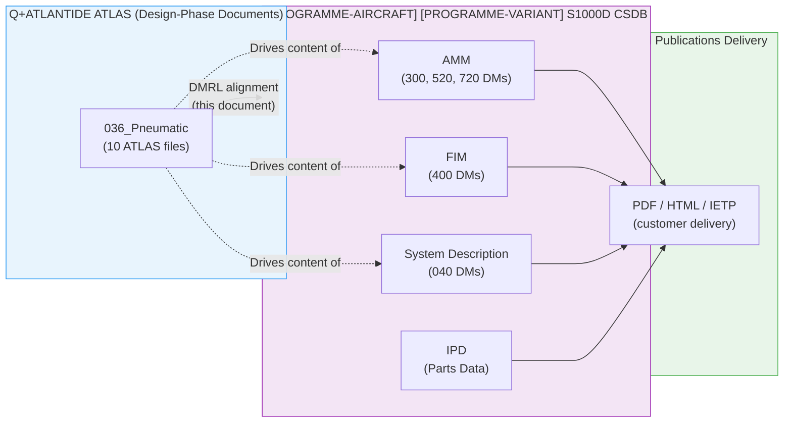
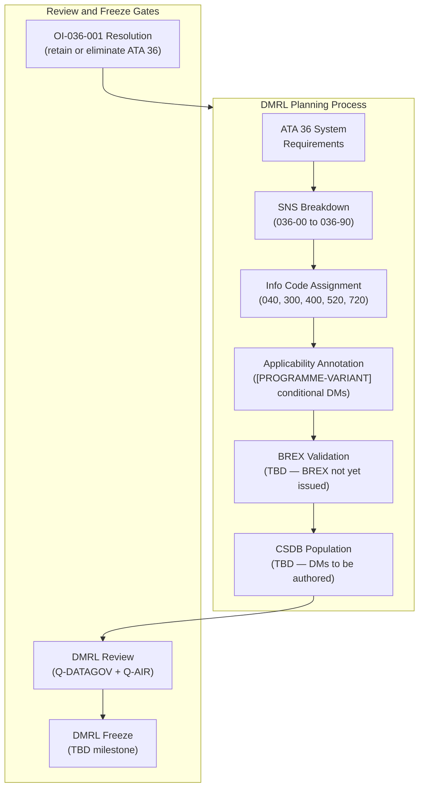
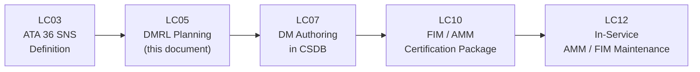

# 036-090 — S1000D / CSDB Mapping and Traceability
### [PROGRAMME-AIRCRAFT] [PROGRAMME-VARIANT] · ATA 36 · Q+ATLANTIDE ATLAS Scaffold

---

## §0 Hyperlink Policy

All internal links in this document use relative paths from the current directory. External regulatory and standards references use anchor links defined in [§20 References](#20-references). Links marked **TBD** indicate targets not yet allocated within the CSDB or ATLAS hierarchy. Programme-level links traverse five directory levels (`../../../../../`) to reach the repository root. No absolute URLs are used for internal navigation.

---

## §1 Purpose

This document defines the agnostic ATLAS standard-level architecture context for `036-090 — S1000D / CSDB Mapping and Traceability`.

It describes the controlled scope, functions, interfaces, safety considerations, lifecycle traceability, and S1000D/CSDB mapping logic that programme implementations shall instantiate when this node is applicable.

This document is not a programme design baseline. Programme-specific capacities, locations, part numbers, effectivity, operating limits, maintenance references, and data module codes shall be defined only inside the applicable programme implementation branch.

## §2 Applicability

| Applicability Level | Rule |
|---|---|
| Standard taxonomy | Applies to the ATLAS node `<NODE>` |
| Programme implementation | Conditional; determined by programme architecture, trade studies, certification basis, and applicability model |
| Product configuration | Defined in the programme-specific configuration baseline |
| Effectivity | Defined in the programme CSDB / applicability layer |
| Non-applicability | Must be explicitly stated in the programme impact-study branch when excluded |

## §3 System / Function Overview

### 3.1 ATA 36 SNS Structure

The System / Subsystem / Subject (SNS) breakdown for [PROGRAMME-AIRCRAFT] [PROGRAMME-VARIANT] ATA 36 is:

| SNS Code | Title | ATLAS File |
|---|---|---|
| 036-00 | Pneumatic — General | [036-000](./036-000-Pneumatic-General.md) |
| 036-10 | Pneumatic Air Sources (EAC + Ground Connector) | [036-010](./036-010-Pneumatic-Air-Sources.md) |
| 036-20 | Pneumatic Air Distribution | [036-020](./036-020-Pneumatic-Air-Distribution.md) |
| 036-30 | Pressure Regulation and Shutoff | [036-030](./036-030-Pressure-Regulation-and-Shutoff.md) |
| 036-40 | Pneumatic Valves, Ducts, and Manifolds | [036-040](./036-040-Pneumatic-Valves-Ducts-and-Manifolds.md) |
| 036-50 | Leak Detection and Overheat Protection | [036-050](./036-050-Leak-Detection-and-Overheat-Protection.md) |
| 036-60 | Pneumatic System Indication and Warning | [036-060](./036-060-Pneumatic-System-Indication-and-Warning.md) |
| 036-70 | Pneumatic Ground Service and Test Interfaces | [036-070](./036-070-Pneumatic-Ground-Service-and-Test-Interfaces.md) |
| 036-80 | Pneumatic Monitoring, Diagnostics, and Control Interfaces | [036-080](./036-080-Pneumatic-Monitoring-Diagnostics-and-Control-Interfaces.md) |
| 036-90 | S1000D / CSDB Mapping and Traceability | This document |

### 3.2 Comparison: Conventional Bleed vs. [PROGRAMME-VARIANT] Bleed-Less ATA 36 DMRL

| DM Subject (Conventional) | Conventional Aircraft | [PROGRAMME-AIRCRAFT] [PROGRAMME-VARIANT] |
|---|---|---|
| General / Description | Yes | Yes (reduced scope) |
| Engine LP bleed valve | Yes (many DMs) | **Not applicable — no bleed ports** |
| Engine HP bleed valve | Yes | **Not applicable** |
| APU bleed valve | Yes | **Not applicable — no APU** |
| Cross-bleed manifold | Yes | **Not applicable** |
| Pre-cooler / Heat exchanger | Yes | **Not applicable** |
| Overheat detection (loop) | Yes | **Not applicable — no hot bleed** |
| Bleed duct distribution | Yes (complex) | Minimal (low-pressure tubing only) |
| Pressure regulation | Yes | Minimal (EAC relief valve only) |
| Shutoff valves | Yes | Minimal (consumer SOVs: ×2 TBD) |
| Indication / Warning | Yes | Reduced (2 CAS alerts only) |
| Electric Air Compressor | **Not applicable** | Yes (EAC R/I + FI DMs) |
| Ground connector (pneumatic) | Yes | Yes (if retained) |
| CMC / monitoring | Yes | Yes (reduced) |
| S1000D mapping | Yes | Yes (this document) |

---

## §4 Scope

### 4.1 Included
- Full DMRL for ATA 36 subsubjects 036-00 through 036-90
- S1000D Data Module codes (planned, not yet allocated in CSDB)
- Information code mapping per DM type (040 Descriptive, 300 Inspection, 400 Fault Isolation, 520 Remove, 720 Install)
- Publication hierarchy: where ATA 36 DMs appear in [PROGRAMME-AIRCRAFT] [PROGRAMME-VARIANT] technical publications
- BREX and DMRL status declarations
- Rationale for DM types not required (bleed valve, OHT, pre-cooler, cross-bleed)

### 4.2 Excluded
- Actual DM content (see individual ATLAS files per subsubject)
- CSDB configuration and build rules (ATA 42 / CSDB project scope)
- [PROGRAMME-VARIANT] programme BREX (BREX document — TBD separate publication)
- Other ATA chapters' S1000D mapping

---

## §5 Architecture Description

### 5.1 Publication Hierarchy

The [PROGRAMME-AIRCRAFT] [PROGRAMME-VARIANT] ATA 36 DMs appear in the following publications:

| Publication | Publication Code | ATA 36 DMs Included |
|---|---|---|
| Aircraft Maintenance Manual (AMM) | AMM-[PROGRAMME-AIRCRAFT]-[PROGRAMME-VARIANT]-036 | All 036-xx maintenance DMs (300, 520, 720) |
| Fault Isolation Manual (FIM) | FIM-[PROGRAMME-AIRCRAFT]-[PROGRAMME-VARIANT]-036 | All 036-xx FI DMs (400) |
| System Description (SD) | SD-[PROGRAMME-AIRCRAFT]-[PROGRAMME-VARIANT]-036 | Descriptive DMs (040) |
| Illustrated Parts Data (IPD) | IPD-[PROGRAMME-AIRCRAFT]-[PROGRAMME-VARIANT]-036 | Parts data for ATA 36 components |
| Aircraft Maintenance Planning Document (AMPD) | AMPD-[PROGRAMME-AIRCRAFT]-[PROGRAMME-VARIANT] | ATA 36 maintenance task intervals |

### 5.2 S1000D DMC Structure

S1000D Data Module Codes (DMC) for [PROGRAMME-VARIANT] ATA 36 follow the pattern:
```
DMC-<PROGRAMME>-<VARIANT>-036-{SNS}-{SubSNS}-{InfoCode}{InfoCodeVariant}-{ItemLocationCode}
```

Where:
- `[PROGRAMME-AIRCRAFT]-[PROGRAMME-VARIANT]` = Model identification code (MIC) — TBD confirmation required
- `036` = System code
- `{SNS}` = Subsystem code (00, 10, 20 … 90)
- `{InfoCode}` = Information code (040, 300, 400, 520, 720 etc.)
- `{InfoCodeVariant}` = A (default)
- `{ItemLocationCode}` = A (default)

### 5.3 Applicability Annotation

All ATA 36 DMs apply to the [PROGRAMME-AIRCRAFT] [PROGRAMME-VARIANT] variant. The Applicability Cross-Reference Table (ACRT) within the CSDB will be used to annotate DMs that are conditionally applicable (e.g., DMs for ground pneumatic connector are conditional on OI-036-005 resolution — if connector is eliminated, those DMs are voided).

---

## §6 Full DMRL — ATA 36 Subsubject Mapping

### 6.1 036-00 — Pneumatic General

| DM Code (Planned) | Info Code | DM Type | Title | Status |
|---|---|---|---|---|
| DMC-<PROGRAMME>-<VARIANT>-036-00-00A-040A-A | 040 | Descriptive | ATA 36 Pneumatic System — General Description ([PROGRAMME-VARIANT] bleed-less) |  |
| DMC-<PROGRAMME>-<VARIANT>-036-00-00A-400A-A | 400 | Fault Isolation | ATA 36 General Fault Isolation Index |  |

### 6.2 036-10 — Pneumatic Air Sources (EAC + Ground Connector)

| DM Code (Planned) | Info Code | DM Type | Title | Status |
|---|---|---|---|---|
| DMC-<PROGRAMME>-<VARIANT>-036-10-00A-040A-A | 040 | Descriptive | Electric Air Compressor (EAC) — Description and Operation |  |
| DMC-<PROGRAMME>-<VARIANT>-036-10-00A-300A-A | 300 | Inspection/Check | EAC — Operational Check (ground) |  |
| DMC-<PROGRAMME>-<VARIANT>-036-10-00A-400A-A | 400 | Fault Isolation | EAC Fault Isolation (PNEU EAC FAULT) |  |
| DMC-<PROGRAMME>-<VARIANT>-036-10-00A-520A-A | 520 | Remove | EAC — Removal |  |
| DMC-<PROGRAMME>-<VARIANT>-036-10-00A-720A-A | 720 | Install | EAC — Installation |  |
| DMC-<PROGRAMME>-<VARIANT>-036-10-00A-040B-A | 040 | Descriptive | Ground Pneumatic Connector — Description (if retained) |  |
| DMC-<PROGRAMME>-<VARIANT>-036-10-00A-520B-A | 520 | Remove | Ground Pneumatic Connector Cap — Removal |  |
| DMC-<PROGRAMME>-<VARIANT>-036-10-00A-720B-A | 720 | Install | Ground Pneumatic Connector Cap — Installation |  |

> **Note (OI-036-005):** Ground connector DMs are conditional — see OI-036-005. If connector is eliminated, DMs 040B, 520B, 720B are voided.

### 6.3 036-20 — Pneumatic Air Distribution

| DM Code (Planned) | Info Code | DM Type | Title | Status |
|---|---|---|---|---|
| DMC-<PROGRAMME>-<VARIANT>-036-20-00A-040A-A | 040 | Descriptive | Pneumatic Distribution Manifold — Description |  |
| DMC-<PROGRAMME>-<VARIANT>-036-20-00A-300A-A | 300 | Inspection/Check | Pneumatic Distribution — Filter and Accumulator Check |  |
| DMC-<PROGRAMME>-<VARIANT>-036-20-00A-520A-A | 520 | Remove | Pneumatic Filter Assembly — Removal |  |
| DMC-<PROGRAMME>-<VARIANT>-036-20-00A-720A-A | 720 | Install | Pneumatic Filter Assembly — Installation |  |

### 6.4 036-30 — Pressure Regulation and Shutoff

| DM Code (Planned) | Info Code | DM Type | Title | Status |
|---|---|---|---|---|
| DMC-<PROGRAMME>-<VARIANT>-036-30-00A-040A-A | 040 | Descriptive | Pressure Regulating Valve (PRV) — Description |  |
| DMC-<PROGRAMME>-<VARIANT>-036-30-00A-300A-A | 300 | Inspection/Check | PRV — Functional Check |  |
| DMC-<PROGRAMME>-<VARIANT>-036-30-00A-520A-A | 520 | Remove | PRV — Removal |  |
| DMC-<PROGRAMME>-<VARIANT>-036-30-00A-720A-A | 720 | Install | PRV — Installation |  |

### 6.5 036-40 — Pneumatic Valves, Ducts, and Manifolds

| DM Code (Planned) | Info Code | DM Type | Title | Status |
|---|---|---|---|---|
| DMC-<PROGRAMME>-<VARIANT>-036-40-00A-040A-A | 040 | Descriptive | SOV (Door Seal) — Description |  |
| DMC-<PROGRAMME>-<VARIANT>-036-40-00A-040B-A | 040 | Descriptive | SOV (Water Tank) — Description |  |
| DMC-<PROGRAMME>-<VARIANT>-036-40-00A-300A-A | 300 | Inspection/Check | SOV Functional Test (all branches) |  |
| DMC-<PROGRAMME>-<VARIANT>-036-40-00A-400A-A | 400 | Fault Isolation | SOV Disagree — Fault Isolation |  |
| DMC-<PROGRAMME>-<VARIANT>-036-40-00A-520A-A | 520 | Remove | SOV (Any Branch) — Removal |  |
| DMC-<PROGRAMME>-<VARIANT>-036-40-00A-720A-A | 720 | Install | SOV (Any Branch) — Installation |  |

### 6.6 036-50 — Leak Detection and Overheat Protection

| DM Code (Planned) | Info Code | DM Type | Title | Status |
|---|---|---|---|---|
| DMC-<PROGRAMME>-<VARIANT>-036-50-00A-040A-A | 040 | Descriptive | Leak Detection (Pressure-Decay Method) — Description |  |
| DMC-<PROGRAMME>-<VARIANT>-036-50-00A-300A-A | 300 | Inspection/Check | Pneumatic System Leak Check (Pressure Decay) |  |
| DMC-<PROGRAMME>-<VARIANT>-036-50-00A-400A-A | 400 | Fault Isolation | PNEU LO PR — Fault Isolation (Leak or EAC) |  |

> **Note (OHT):** No overheat detection DMs — [PROGRAMME-VARIANT] uses pressure-decay method only. No OHT loop, no OHT sensor R/I DMs.

### 6.7 036-60 — Pneumatic System Indication and Warning

| DM Code (Planned) | Info Code | DM Type | Title | Status |
|---|---|---|---|---|
| DMC-<PROGRAMME>-<VARIANT>-036-60-00A-040A-A | 040 | Descriptive | Pneumatic ECAM Page and CAS Alerts — Description |  |
| DMC-<PROGRAMME>-<VARIANT>-036-60-00A-400A-A | 400 | Fault Isolation | PNEU EAC FAULT / PNEU LO PR — Fault Isolation (Indication) |  |

### 6.8 036-70 — Pneumatic Ground Service and Test Interfaces

| DM Code (Planned) | Info Code | DM Type | Title | Status |
|---|---|---|---|---|
| DMC-<PROGRAMME>-<VARIANT>-036-70-00A-040A-A | 040 | Descriptive | Ground Pneumatic Service Interface — Description |  |
| DMC-<PROGRAMME>-<VARIANT>-036-70-00A-300A-A | 300 | Inspection/Check | Pneumatic System Ground Service — Check and Pressurisation Test |  |
| DMC-<PROGRAMME>-<VARIANT>-036-70-00A-520A-A | 520 | Remove | Ground Connector Dust Cap — Removal (if retained) |  |
| DMC-<PROGRAMME>-<VARIANT>-036-70-00A-720A-A | 720 | Install | Ground Connector Dust Cap — Installation (if retained) |  |

### 6.9 036-80 — Pneumatic Monitoring, Diagnostics, and Control Interfaces

| DM Code (Planned) | Info Code | DM Type | Title | Status |
|---|---|---|---|---|
| DMC-<PROGRAMME>-<VARIANT>-036-80-00A-040A-A | 040 | Descriptive | CMC / OMS Monitoring, BITE, and Control Interfaces — Description |  |
| DMC-<PROGRAMME>-<VARIANT>-036-80-00A-300A-A | 300 | Inspection/Check | CMC Fault Log Readout — Procedure |  |
| DMC-<PROGRAMME>-<VARIANT>-036-80-00A-400A-A | 400 | Fault Isolation | CMC / BITE Fault Isolation — ATA 36 |  |

### 6.10 036-90 — S1000D / CSDB Mapping and Traceability

| DM Code (Planned) | Info Code | DM Type | Title | Status |
|---|---|---|---|---|
| DMC-<PROGRAMME>-<VARIANT>-036-90-00A-040A-A | 040 | Descriptive | ATA 36 DMRL and CSDB Mapping — Description (this document) |  |

---

## §7 System Context Diagram



---

## §8 Internal Functional Architecture



---

## §9 Lifecycle Traceability



---

## §10 Interfaces

| Interface | System / Standard | Description |
|---|---|---|
| Q+ATLANTIDE ATLAS files | ATA 36 system documents | ATLAS files drive DMRL content and are listed in §3 SNS table |
| S1000D Issue 5.0 | S1000D international standard | Governs DM structure, info codes, BREX |
| [PROGRAMME-VARIANT] programme BREX | [PROGRAMME-AIRCRAFT] BREX (TBD) | Programme-specific business rules for DM authoring |
| CSDB (TBD) | [PROGRAMME-AIRCRAFT] [PROGRAMME-VARIANT] S1000D CSDB | Target repository for all ATA 36 DMs |
| AMM, FIM, SD, IPD publications | Technical publications | Delivery vehicles for ATA 36 DMs to customers/operators |
| DMRL freeze milestone | Programme schedule | Milestone at which DMRL is frozen for authoring to begin |
| OI-036-001 | Architectural decision | If ATA 36 eliminated: entire DMRL is voided (one informational DM retained) |

---

## §11 Operating Modes

| DMRL Phase | Description |
|---|---|
| Draft (current) | DMRL entries planned; codes assigned notionally; not yet CSDB-allocated |
| Validated | BREX checked; DM codes confirmed in CSDB; applicability annotations complete |
| Frozen | DMRL frozen at programme milestone; DM authoring begins |
| Published | DMs authored and published in AMM / FIM / SD / IPD |

---

## §12 Monitoring and Diagnostics

| DMRL Health Check | Method | Notes |
|---|---|---|
| DM completeness vs. SNS | Compare DMRL entries to SNS table | All SNS codes must have ≥1 descriptive DM (040) |
| BREX validation | CSDB build with [PROGRAMME-VARIANT] BREX | Not yet available — BREX TBD |
| Applicability consistency | ACRT review | Ground connector DMs conditional on OI-036-005 |
| Status tracking | This document §6 status badges | Updated at each revision |

---

## §13 Maintenance Concept

S1000D DMs for ATA 36 maintenance tasks are delivered via the AMM (300, 520, 720 DMs) and FIM (400 DMs). Task intervals for EAC filter replacement and run-hour maintenance are planned in the Aircraft Maintenance Planning Document (AMPD). Fault isolation procedures are supported by CMC fault log data (ATA 36-080).

---

## §14 S1000D / CSDB Mapping (Meta)

This document is itself an S1000D scaffold DM (036-90 → DMC-<PROGRAMME>-<VARIANT>-036-90-00A-040A-A). Its purpose within the CSDB is to serve as the DMRL traceability record for ATA 36, cross-referencing all other ATA 36 DMs and noting their planning status.

---

## §15 Footprints

| Item | Notes | Status |
|---|---|---|
| Total ATA 36 DMs (planned) | ~30–35 DMs across all info codes |  |
| Comparison vs. conventional bleed | Conventional: ~80–120 ATA 36 DMs; [PROGRAMME-VARIANT]: ~30–35 | Reduction ~60–70% |
| CSDB storage | CSDB server — TBD |  |
| DMRL document location | Q+ATLANTIDE ATLAS 036-090 (this file) + CSDB | This file = design-phase record |

---

## §16 Safety and Certification

| Requirement | Standard | Applicability | Notes |
|---|---|---|---|
| Publication accuracy | CS-25.1529 | All AMM / FIM DMs | Maintenance instructions must reflect actual system |
| FIM accuracy | CS-25.1309 (indirect) | FIM DMs | FIM fault isolation must correctly isolate CS-25.1309 monitored functions |
| S1000D compliance | S1000D Issue 5.0 | All DMs | DMs must conform to applicable info code schemas |
| ATA 36 elimination acknowledgement | CS-25.1438 | If OI-036-001 eliminates ATA 36 | Certification authority must acknowledge no pneumatic system — explicit record required |

---

## §17 Verification and Validation

| V&V Activity | Method | Acceptance Criteria | Status |
|---|---|---|---|
| DMRL completeness review | Compare to ATA 36 requirements | All requirements have ≥1 DM |  |
| SNS code consistency | Cross-check SNS table with CSDB | All SNS codes registered |  |
| BREX validation | CSDB build | Zero BREX errors |  |
| DM code format check | Pattern match vs. [PROGRAMME-VARIANT] DMC template | All codes conform |  |
| Applicability annotation check | ACRT review | Conditional DMs correctly flagged |  |
| Publication delivery test | CSDB build + IETP generation | DMs appear in correct publications |  |

---

## §18 Glossary

| Term | Definition |
|---|---|
| S1000D | International specification for technical publications (Issue 5.0) |
| CSDB | Common Source Database — S1000D repository for DMs |
| DM | Data Module — atomic unit of technical information in S1000D |
| DMC | Data Module Code — unique identifier for a DM in S1000D |
| DMRL | Data Module Requirement List — planned set of DMs for a system or publication |
| SNS | System / Subsystem / Subject — hierarchical classification code in S1000D (maps to ATA chapter/section/subject) |
| Info Code | S1000D information type identifier (040 = Descriptive; 300 = Inspection; 400 = Fault Isolation; 520 = Remove; 720 = Install) |
| BREX | Business Rules Exchange — S1000D document defining programme-specific authoring rules |
| ACRT | Applicability Cross-Reference Table — CSDB table linking DMs to applicable variants |
| AMM | Aircraft Maintenance Manual — primary operator maintenance publication |
| FIM | Fault Isolation Manual — pilot/engineer fault isolation procedure publication |
| SD | System Description — operator system knowledge publication |
| IPD | Illustrated Parts Data — parts catalogue publication |
| AMPD | Aircraft Maintenance Planning Document — maintenance task interval planning publication |
| IETP | Interactive Electronic Technical Publication — electronic delivery format for S1000D DMs |
| MIC | Model Identification Code — top-level CSDB identifier for the aircraft programme |
| VL | Virtual Link — AFDX network allocation (not a publication term; from ATA 42 interface) |
| OHT | Overheat Sensor / Detection — NOT applicable to [PROGRAMME-VARIANT] ATA 36 |
| EAC | Electric Air Compressor — primary ATA 36 component on [PROGRAMME-VARIANT] |
| SOV | Shutoff Valve — consumer branch isolation valve |
| bleed-less | No engine bleed air extraction — [PROGRAMME-VARIANT] fundamental architecture |

---

## §19 Citations

1. S1000D Issue 5.0 — International Specification for Technical Publications
2. ATA iSpec 2200 — Chapter 36 Pneumatic
3. EASA CS-25 §25.1438 — Pneumatic Systems
4. EASA CS-25 §25.1529 — Instructions for Continued Airworthiness
5. RTCA DO-160G — Environmental Conditions (referenced via ATA 36 system hardware DMs)

---

## §20 References

| Ref ID | Document | Source | Link |
|---|---|---|---|
| [S1000D] | S1000D Issue 5.0 | ASD/AIA | https://s1000d.org/ |
| [ATA36] | ATA iSpec 2200 Chapter 36 | ATA | — |
| [CS25-1438] | CS-25 §25.1438 | EASA | https://www.easa.europa.eu/ |
| [CS25-1529] | CS-25 §25.1529 | EASA | https://www.easa.europa.eu/ |
| [036-000] | ATA 36-000 General | Internal | [036-000](./036-000-Pneumatic-General.md) |
| [036-010] | ATA 36-010 Air Sources | Internal | [036-010](./036-010-Pneumatic-Air-Sources.md) |
| [036-020] | ATA 36-020 Distribution | Internal | [036-020](./036-020-Pneumatic-Air-Distribution.md) |
| [036-030] | ATA 36-030 Pressure Regulation | Internal | [036-030](./036-030-Pressure-Regulation-and-Shutoff.md) |
| [036-040] | ATA 36-040 Valves/Ducts/Manifolds | Internal | [036-040](./036-040-Pneumatic-Valves-Ducts-and-Manifolds.md) |
| [036-050] | ATA 36-050 Leak Detection | Internal | [036-050](./036-050-Leak-Detection-and-Overheat-Protection.md) |
| [036-060] | ATA 36-060 Indication/Warning | Internal | [036-060](./036-060-Pneumatic-System-Indication-and-Warning.md) |
| [036-070] | ATA 36-070 Ground Service | Internal | [036-070](./036-070-Pneumatic-Ground-Service-and-Test-Interfaces.md) |
| [036-080] | ATA 36-080 Monitoring/Diagnostics | Internal | [036-080](./036-080-Pneumatic-Monitoring-Diagnostics-and-Control-Interfaces.md) |

---

## §21 Open Issues

| Issue ID | Description | Owner | Priority | Status |
|---|---|---|---|---|
| OI-036-001 | **Retain or eliminate ATA 36**: if eliminated, entire DMRL is voided — single informational DM only | Q-AIR | Critical |  |
| OI-036-038 | **[PROGRAMME-VARIANT] programme BREX**: BREX document not yet issued; DMRL cannot be fully validated until BREX is available | Q-DATAGOV | High |  |
| OI-036-039 | **CSDB MIC confirmation**: "[PROGRAMME-AIRCRAFT]-[PROGRAMME-VARIANT]" MIC not yet registered in CSDB; DMC codes are notional until MIC is confirmed | Q-DATAGOV | High |  |
| OI-036-040 | **DMRL freeze milestone**: milestone not yet scheduled; DM authoring cannot begin until DMRL is frozen | ORB-PMO | Medium |  |
| OI-036-041 | **Ground connector DMs**: applicability conditional on OI-036-005 resolution — DMs 040B/520B/720B in 036-10 may be voided | Q-DATAGOV | Medium |  |
| OI-036-042 | **DMRL completeness vs. final system design**: DMRL based on current architecture; will require update after all ATA 36 OIs resolved | Q-DATAGOV + Q-AIR | Medium |  |

---

## §22 Change Log

| Revision | Date | Author | Description |
|---|---|---|---|
| 0.1.0 | 2026-05-10 | Q+ATLANTIDE scaffold generator | Initial full-template scaffold — complete DMRL for all 10 ATA 36 subsubjects; bleed-less DM reduction noted |
