# ATLAS 030-039 · Section 03 · Subsection 036 — Pneumatic

## 1. Purpose

Subsection-level index for *Pneumatic* (`036`) within ATLAS `030-039` — *Protección & Sistemas Mecánicos* — ATA 36.

This subsection is part of the **ATLAS-1000** register, a subpart of the controlled **Q+ATLANTIDE** baseline[^baseline][^n001].

## 2. Scope

- Reserves the subsubject namespace `00`–`99` of subsection `036` *Pneumatic*.
- Inherits Q-Division authority and ORB support from the parent row in [`../../README.md` §3](../../README.md#3-architecture-table)[^archtable] and the section index in [`../README.md`](../README.md).
- The Overview and detailed subsubjects (`00`–`99`) will be populated in subsequent baseline releases per the parent section's authorisation.

## 3. Subsubject Index

| NNN | Title | Document | Status |
|---:|---|---|---|
| `000` | Pneumatic General | [`036-000-Pneumatic-General.md`](./036-000-Pneumatic-General.md) | active |
| `010` | Pneumatic Air Sources | [`036-010-Pneumatic-Air-Sources.md`](./036-010-Pneumatic-Air-Sources.md) | active |
| `020` | Pneumatic Air Distribution | [`036-020-Pneumatic-Air-Distribution.md`](./036-020-Pneumatic-Air-Distribution.md) | active |
| `030` | Pressure Regulation and Shutoff | [`036-030-Pressure-Regulation-and-Shutoff.md`](./036-030-Pressure-Regulation-and-Shutoff.md) | active |
| `040` | Pneumatic Valves, Ducts and Manifolds | [`036-040-Pneumatic-Valves-Ducts-and-Manifolds.md`](./036-040-Pneumatic-Valves-Ducts-and-Manifolds.md) | active |
| `050` | Leak Detection and Overheat Protection | [`036-050-Leak-Detection-and-Overheat-Protection.md`](./036-050-Leak-Detection-and-Overheat-Protection.md) | active |
| `060` | Pneumatic System Indication and Warning | [`036-060-Pneumatic-System-Indication-and-Warning.md`](./036-060-Pneumatic-System-Indication-and-Warning.md) | active |
| `070` | Pneumatic Ground Service and Test Interfaces | [`036-070-Pneumatic-Ground-Service-and-Test-Interfaces.md`](./036-070-Pneumatic-Ground-Service-and-Test-Interfaces.md) | active |
| `080` | Pneumatic Monitoring, Diagnostics and Control Interfaces | [`036-080-Pneumatic-Monitoring-Diagnostics-and-Control-Interfaces.md`](./036-080-Pneumatic-Monitoring-Diagnostics-and-Control-Interfaces.md) | active |
| `090` | S1000D CSDB Mapping and Traceability | [`036-090-S1000D-CSDB-Mapping-and-Traceability.md`](./036-090-S1000D-CSDB-Mapping-and-Traceability.md) | active |

## 4. Footprint

| Metric | Value |
|---|---|
| Architecture | `ATLAS` — Aircraft Top Level Architecture Schema/System (controlled term) |
| Master range | `000–099` |
| Code range | `030-039` |
| Section | `03` — Protección & Sistemas Mecánicos |
| Subsection | `036` — Pneumatic |
| Subsubject namespace | `00`–`99` (reserved) |
| Primary Q-Division | Q-MECHANICS[^qdiv] |
| Support Q-Divisions | Q-AIR, Q-STRUCTURES |
| ORB support | ORB-PMO, ORB-LEG |
| Governance class | `baseline`[^gov] |
| Folder path | `Q+ATLANTIDE/000-099_ATLAS/030-039_Proteccion-y-Sistemas-Mecanicos/036_Pneumatic/` |
| Document | `README.md` (this file) |
| Parent section | [`../README.md`](../README.md) |
| Parent architecture | [`../../README.md`](../../README.md) |
| Parent baseline | [`organization/Q+ATLANTIDE.md`](../../../../organization/Q+ATLANTIDE.md) |

> **Footprint Notes**
> - **Architecture**: `ATLAS` is the controlled term for the Aircraft Top-Level Architecture Schema/System within the Q+ATLANTIDE-1000 register.
> - **Primary Q-Division**: Q-MECHANICS holds technical authority for mechanical and electro-mechanical aircraft systems.
> - **Support Q-Divisions**: Q-AIR provides systems integration oversight; Q-STRUCTURES provides structural interface authority.
> - **Governance class**: `baseline` documents are subject to formal change control under the Q+ATLANTIDE Configuration Management Plan.
> - **ORB support**: ORB-PMO coordinates programme management; ORB-LEG provides regulatory and certification support.

## Governance

Governed by [`organization/Q+ATLANTIDE.md`](../../../../organization/Q+ATLANTIDE.md)[^baseline]. All subsubjects under this subsection inherit `architecture_code = ATLAS`, `primary_q_division = Q-MECHANICS` and `governance_class = baseline` from the parent ATLAS section. Extensions added under `00`–`99` shall preserve those header fields and reuse the footnote set declared here.

## 4b. Interfaces Diagram

```mermaid
flowchart TB
    SEC["Section 03 · 030-039<br/>Protección &amp; Sistemas Mecánicos"]:::section
    SUB["036 — Pneumatic<br/>(ATA 36)"]:::subsection
    SEC --> SUB

    subgraph SUBS["Subsubjects (036-000 … 036-090)"]
        direction LR
        SS_000["036-000<br/>Pneumatic General"]:::document
        SS_010["036-010<br/>Pneumatic Air Sources"]:::document
        SS_020["036-020<br/>Pneumatic Air Distribution"]:::document
        SS_030["036-030<br/>Pressure Regulation and S…"]:::document
        SS_040["036-040<br/>Pneumatic Valves Ducts an…"]:::document
        SS_050["036-050<br/>Leak Detection and Overhe…"]:::document
        SS_060["036-060<br/>Pneumatic System Indicati…"]:::document
        SS_070["036-070<br/>Pneumatic Ground Service …"]:::document
        SS_080["036-080<br/>Pneumatic Monitoring Diag…"]:::document
        SS_090["036-090<br/>S1000D CSDB Mapping and T…"]:::document
    end
    SUB --> SUBS

    QPRIM["Q-MECHANICS[^qdiv]<br/>(primary authority)"]:::qdiv
    QSUPP["Q-AIR · Q-STRUCTURES<br/>(support)"]:::qdiv
    ORB["ORB-PMO · ORB-LEG<br/>(enterprise support)"]:::orb

    SUB --> QPRIM
    SUB -.-> QSUPP
    SUB -.-> ORB

    SUBS --> SS_000
    SUBS --> SS_010
    SUBS --> SS_020
    SUBS --> SS_030
    SUBS --> SS_040
    SUBS --> SS_050
    SUBS --> SS_060
    SUBS --> SS_070
    SUBS --> SS_080
    SUBS --> SS_090

    classDef baseline fill:#1f3a93,stroke:#0b1d4a,color:#fff
    classDef atlas fill:#154360,stroke:#0b1d4a,color:#fff
    classDef section fill:#2c82c9,stroke:#0b1d4a,color:#fff
    classDef subsection fill:#85c1e9,stroke:#2c82c9,color:#0b1d4a
    classDef document fill:#ffd700,stroke:#b8860b,color:#000
    classDef qdiv fill:#f6e6ff,stroke:#7d3c98,color:#3b1f4d
    classDef orb fill:#e9f7ef,stroke:#1e8449,color:#145a32
```

## 5. References & Citations

[^baseline]: **Q+ATLANTIDE controlled baseline (v1.0.0)** — [`organization/Q+ATLANTIDE.md`](../../../../organization/Q+ATLANTIDE.md).

[^archtable]: **§3 — Architecture Table (parent)** — [`../../README.md` §3](../../README.md#3-architecture-table).

[^qdiv]: **Q-Division authority** — [`organization/Q-Divisions/`](../../../../organization/Q-Divisions/).

[^gov]: **Governance class** — `baseline` denotes documents under controlled change management within the Q+ATLANTIDE baseline.

[^n001]: **Note N-001** — Q+ATLANTIDE (with its ATLAS-1000 register subpart) is a taxonomy and traceability ecosystem, not an organization chart. See [`organization/Q+ATLANTIDE.md` §4](../../../../organization/Q+ATLANTIDE.md#4-notes).

### Citation & Traceability Map

| Ref | Target Document | Relationship | Scope |
|---|---|---|---|
| [^baseline] | [`organization/Q+ATLANTIDE.md`](../../../../organization/Q+ATLANTIDE.md) | Normative baseline | ATLAS-1000 register authority |
| [^archtable] | [`../../README.md §3`](../../README.md#3-architecture-table) | Parent architecture table | Inherited Q-Division and ORB support |
| [^qdiv] | [`organization/Q-Divisions/`](../../../../organization/Q-Divisions/) | Technical authority | Q-Division assignment |
| [^gov] | Q+ATLANTIDE governance class definition | Governance class | Change-management classification |
| [^n001] | [`organization/Q+ATLANTIDE.md §4`](../../../../organization/Q+ATLANTIDE.md#4-notes) | Taxonomy note | Ecosystem scope clarification |

---

## Glossary

### Common Terms & Acronyms

| Term / Acronym | Expansion | Definition |
|---|---|---|
| **ATA** | Air Transport Association | Industry body that publishes iSpec 2200 (formerly ATA Spec. 100), the standard chapter-numbering scheme for aircraft systems documentation. |
| **ATLAS** | Aircraft Top Level Architecture Schema/System | The controlled architecture taxonomy and documentation framework within the Q+ATLANTIDE-1000 register; governs chapters 000–099. |
| **baseline** | — | A formally approved version of a document or configuration item, subject to formal change control, forming the reference for further development or maintenance. |
| **CSDB** | Common Source Data Base | The central repository defined by S1000D for storing, managing, and exchanging Data Modules and Publication Modules. |
| **DMC** | Data Module Code | Unique alphanumeric identifier for a single S1000D Data Module, encoding model identification, system/sub-system, information code, and variant. |
| **governance\_class** | — | Classification field in Q+ATLANTIDE YAML frontmatter that indicates the change-control regime (`baseline`, `programme-controlled`, `legacy-deprecated`, etc.). |
| **NNN** | — | Three-digit ATA-SNS sub-subject code (e.g., `010`, `020`, …, `090`) used as the local identifier within a subsection folder. |
| **ORB** | Operations Review Board | Enterprise-level governance body within the Q+ATLANTIDE organisational structure, responsible for cross-domain oversight and authorisation. |
| **ORB-LEG** | ORB — Legal & Regulatory | ORB function providing legal compliance, regulatory (EASA/FAA) liaison, and certification boundary advisory services. |
| **ORB-PMO** | ORB — Programme Management Office | ORB function providing programme scheduling, resource, and milestone control across all Q-Division work-packages. |
| **Q+ATLANTIDE** | — | The master controlled documentation baseline and taxonomy ecosystem for the ATLAS-1000 architecture register; versioned governance reference for all architecture bands (000–999). |
| **Q-AIR** | Q-Division — Air Systems | Technical-authority Q-Division responsible for aerodynamics, air-data systems, and systems integration oversight. |
| **Q-DATAGOV** | Q-Division — Data Governance | Technical-authority Q-Division responsible for data standards, traceability, and CSDB publication governance. |
| **Q-GREENTECH** | Q-Division — Green Technologies | Technical-authority Q-Division responsible for sustainable propulsion, energy, and environmental compliance. |
| **Q-GROUND** | Q-Division — Ground Systems | Technical-authority Q-Division responsible for ground handling, servicing interfaces, and airport compatibility. |
| **Q-INDUSTRY** | Q-Division — Industry & Supply Chain | Technical-authority Q-Division responsible for industrial producibility, supplier qualification, and manufacturing interfaces. |
| **Q-MECHANICS** | Q-Division — Mechanical Systems | Technical-authority Q-Division responsible for mechanical and electro-mechanical aircraft systems; primary authority for ATLAS sections 030–039. |
| **Q-STRUCTURES** | Q-Division — Structures | Technical-authority Q-Division responsible for structural interfaces, loads, and airframe integrity. |
| **S1000D** | — | International specification (ASD/AIA/ATA) for the production and procurement of technical publications; defines the Data Module (DM) paradigm and CSDB architecture. |
| **SNS** | Standard Numbering System | The ATA/S1000D hierarchical chapter-section-subject numbering scheme mapping physical/functional aircraft systems to a standardised code space. |
| **YAML** | YAML Ain't Markup Language | Human-readable data-serialisation language used for document frontmatter (metadata header blocks) throughout the Q+ATLANTIDE baseline. |

### Domain-Specific Terms — ATA 36 Pneumatic

| Term / Acronym | Expansion | Definition |
|---|---|---|
| **APU** | Auxiliary Power Unit | Small gas turbine on the ground/in-flight providing bleed air for ECS and electrical power when main engines are not running. |
| **CAI** | Cowl Anti-Ice | Bleed-air heated nacelle anti-icing system preventing ice accretion on engine inlet lips. |
| **DCSOV** | Dual-Control Shut-Off Valve | Pneumatic valve providing redundant (dual-actuator) closure capability for isolation of high-energy bleed air. |
| **ECS** | Environmental Control System | Aircraft system managing cabin pressurisation, temperature, and ventilation; primary consumer of engine bleed air. |
| **FCMC** | Fuel Control and Monitoring Computer | Computer controlling fuel transfer; may also interface with crossfeed valves sharing a pneumatic bus with bleed system. |
| **HP** | High Pressure | Refers to the high-pressure stage of the engine compressor, typically the source of bleed air for ground operation or hot-day conditions. |
| **HPSOV** | High-Pressure Shut-Off Valve | Valve isolating the HP bleed port; commanded closed to revert to IP bleed for fuel efficiency at cruise. |
| **IP** | Intermediate Pressure | Intermediate compressor stage bleed port, normally the preferred source of bleed air at cruise. |
| **MSOV** | Main Stop-Over Valve / Mixed Shut-Off Valve | Isolates the mixed manifold from an engine bleed supply; also called Pack Valve on some platforms. |
| **PRSOV** | Pressure-Regulating and Shut-Off Valve | Combined valve regulating bleed pressure to a set value and capable of fully closing to shut off bleed flow. |
| **PTU** | Power Transfer Unit | Hydraulic cross-connection enabling one hydraulic system to power actuators of another without fluid transfer (does not apply to bleed, but context may overlap in dual-use schematics). |
