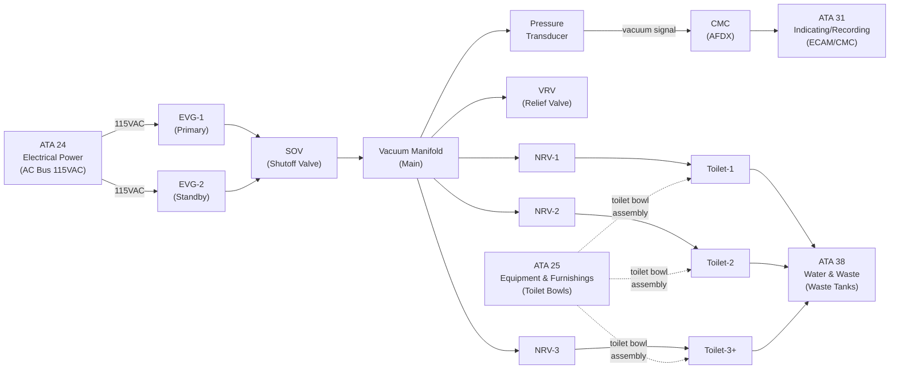
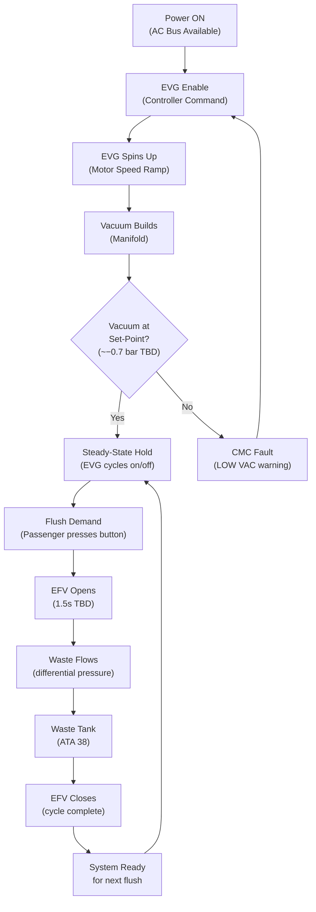
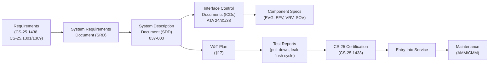

# 037-000 — Vacuum — General
### AMPEL360e eWTW · ATA 37 · Q+ATLANTIDE ATLAS Scaffold

**Status:**   
**Revision:** 0.1 — 2025-07-14  
**Classification:** Q-AIR Primary

---

## §0 Hyperlink Policy

All cross-references within this document use relative Markdown links anchored to section headings within the Q+ATLANTIDE ATLAS repository. External regulatory references (CS-25, AMC) are cited by document identifier only; no live URLs are embedded because regulatory document URLs are subject to change without notice. Internal DMC cross-references follow the pattern `DMC-AMPEL360E-EWTW-037-XX-YYYY-A`. Traceability links to CSDB are maintained in §14. Where a parameter is not yet determined, the badge  is used inline.

---

## §1 Purpose

This document provides the general overview and system-level description of ATA Chapter 37 — Vacuum — as applied to the **AMPEL360e eWTW** (Electric Wide-body Twin-engine Widebody) aircraft. It establishes:

1. The rationale for the elimination of conventional vacuum-driven gyroscopic instruments on the eWTW.
2. The residual role of vacuum in the aircraft: the **Vacuum Waste System (VWS)** serving lavatory toilets.
3. The top-level architecture of the **Electric Vacuum Generator (EVG)** and its integration with ATA 38 (Water and Waste).
4. Certification basis under CS-25.1438 and related articles.
5. The document hierarchy for ATA 37, covering subsubjects 037-000 through 037-090.

This document is authoritative for system boundary definition and interfaces for all lower-level ATA 37 documents.

---

## §2 Applicability

| Item | Value |
|---|---|
| Aircraft Programme | AMPEL360e eWTW |
| Variant | All variants (unless noted) |
| ATA Chapter | 37 — Vacuum |
| Document Tier | Level 2 — System Description Document (SDD) |
| Effectivity | MSN 0001 onwards (TBD) |
| Preceding Document | QATL-ATLAS-000099-ATLAS-030039-037-000 Rev 0.0 (scaffold) |

This document applies to all systems that produce, distribute, regulate, or consume vacuum pressure aboard the AMPEL360e eWTW. It explicitly excludes vacuum associated with:
- Pneumatic actuation (ATA 36)
- Cabin pressurisation differential (ATA 21)
- Fuel venting suction (ATA 28)

---

## §3 System/Function Overview

### 3.1 Conventional Aircraft Context

In conventional transport aircraft, ATA 37 covers two primary vacuum applications:

1. **Vacuum-driven gyroscopic instruments** — attitude indicator, directional gyro, and turn coordinator powered by engine-driven vacuum pumps (typically 4–5 in Hg suction). These provide mechanical backup to pitot-static and electrical flight instruments.
2. **Vacuum autopilot servos** — used on older aircraft types for autopilot actuation where hydraulic/electric actuators were not fitted.
3. **Vacuum waste systems** — galley/lavatory suction toilets on newer-generation narrow/widebodies.

### 3.2 eWTW Vacuum Philosophy

The AMPEL360e eWTW departs from this convention in two critical respects:

| Conventional Use | eWTW Status | Reason |
|---|---|---|
| Vacuum gyroscopic instruments | **ELIMINATED** | ADIRU/IRS (ATA 34) provides all attitude and heading data digitally; no mechanical gyros fitted |
| Vacuum autopilot servos | **ELIMINATED** | Full fly-by-wire (FBW) with electric actuators (ATA 27); no vacuum-powered control surfaces |
| Vacuum waste system (toilets) | **RETAINED** | Primary and only use of ATA 37 on eWTW |

The elimination of vacuum gyroscopes removes a significant maintenance burden (pump replacement, filter changes, suction gauge calibration) and eliminates a failure mode that has historically caused spatial disorientation accidents when vacuum supply failed undetected.

### 3.3 Vacuum Waste System (VWS) Overview

The VWS uses differential pressure (cabin pressure above ambient inside waste lines) to transport waste from toilet bowls to waste tanks:

- **Electric Vacuum Generator (EVG):** motor-driven pump maintaining manifold vacuum of approximately −0.7 to −1.0 bar gauge 
- **Vacuum manifold:** distributes vacuum to all toilet connections
- **Electric Flush Valve (EFV):** solenoid valve per toilet, initiates flush cycle
- **Non-Return Valve (NRV/check valve):** per toilet connection, prevents backflow
- **Vacuum Relief Valve (VRV):** limits maximum manifold vacuum
- **Shutoff Valve (SOV):** isolates EVG from manifold for maintenance
- **Waste tanks:** ATA 38 boundary (waste storage and ground servicing)

---

## §4 Scope

### 4.1 In-Scope

- All vacuum generation equipment (EVG units, motor controllers)
- Vacuum manifold and distribution lines from EVG outlet to toilet inlet NRVs
- Regulation and protection valves (VRV, SOV)
- Monitoring and diagnostics (vacuum transducers, CMC interface, ECAM messages)
- Interfaces with ATA 24 (electrical power), ATA 31 (indicating), ATA 38 (water and waste)

### 4.2 Out-of-Scope

- Waste tanks, waste servicing ports, and ground drain equipment (ATA 38)
- Toilet bowl assemblies and seat mechanisms (ATA 25)
- Cabin pressurisation (ATA 21)
- Avionics air supply (ATA 21)

### 4.3 Document Hierarchy

| Subsubject | Title | Status |
|---|---|---|
| 037-000 | Vacuum — General |  |
| 037-010 | Vacuum Sources |  |
| 037-020 | Vacuum Distribution |  |
| 037-030 | Vacuum Regulation and Shutoff |  |
| 037-040 | Vacuum Pumps, Ejectors, Valves, and Lines |  |
| 037-050 | Vacuum Consumers and System Interfaces |  |
| 037-060 | Vacuum System Indication and Warning |  |
| 037-070 | Vacuum Ground Service and Test Interfaces |  |
| 037-080 | Vacuum Monitoring, Diagnostics, and Control Interfaces |  |
| 037-090 | S1000D/CSDB Mapping and Traceability |  |

---

## §5 Architecture Description

### 5.1 System Architecture Summary

The ATA 37 Vacuum system on the eWTW consists of a single-purpose subsystem: the Vacuum Waste System (VWS). There is no multi-purpose vacuum bus serving instruments or autopilot.

```
[AC Bus (ATA 24)] ──────► [EVG Motor Controller]
                                    │
                              [EVG-1 (Primary)]
                              [EVG-2 (Standby)]
                                    │
                              [SOV (N/O solenoid)]
                                    │
                          [Vacuum Main Manifold]
                         /          │           \
                    [VRV]     [Pressure        [Branch lines]
                  (relief)    Transducer]      /     │     \
                                           [NRV-1] [NRV-2] [NRV-3]
                                              │       │       │
                                          [Toilet] [Toilet] [Toilet]
                                              └───────┴───────┘
                                                      │
                                              [Waste Tank (ATA 38)]
```

### 5.2 Redundancy Strategy

EVG redundancy: Two units (primary + standby). Automatic switchover on primary fault.  — exact switchover logic and timing TBD pending EVG supplier selection.

---

## §6 Functional Breakdown

| Subsubject | Function | Key Components | Status |
|---|---|---|---|
| 037-000 | System overview and general | All ATA 37 |  |
| 037-010 | Vacuum generation | EVG-1, EVG-2, motor controllers |  |
| 037-020 | Vacuum distribution | Manifold, branch lines, NRVs |  |
| 037-030 | Regulation and shutoff | VRV, SOV, EVG controller, transducer |  |
| 037-040 | Pumps, ejectors, valves, lines | EVG, EFV, NRV, VRV, SOV, lines |  |
| 037-050 | Consumers and interfaces | Toilets (ATA 25), waste tanks (ATA 38) |  |
| 037-060 | Indication and warning | ECAM, CMC, crew alerts |  |
| 037-070 | Ground service and test | Ground test port, drain panel |  |
| 037-080 | Monitoring, diagnostics, control | AFDX, CMC, BITE |  |
| 037-090 | S1000D/CSDB mapping | DMC assignments, data module codes |  |

---

## §7 System Context Diagram



---

## §8 Internal Functional Architecture



---

## §9 Lifecycle Traceability



---

## §10 Interfaces

| Interface | ATA Chapter | Direction | Signal/Medium | Notes |
|---|---|---|---|---|
| Electrical power supply | ATA 24 | In | 115 VAC  | Powers EVG motor controllers |
| Ground electrical power | ATA 24 | In | 115 VAC GPU | EVG operable on ground power |
| Waste tanks | ATA 38 | Out | Waste (liquid/solid) | Tanks receive toilet waste; serviced per ATA 38 |
| Toilet bowl assemblies | ATA 25 | Bi | Mechanical, electrical | EFV flush valve integrated with toilet; flush button signal |
| ECAM/SDAC | ATA 31 | Out | AFDX | Vacuum system status pages, crew alerts |
| CMC/OMS | ATA 45 | Bi | AFDX | Fault codes, maintenance data, BITE |
| Odour filter vent | ATA 21 | Out | Air (filtered) | Tank vent air exits via odour filter to cabin/ambient  |
| Freeze protection | ATA 30 | In | Heat (electric trace) | Waste line freeze protection  |

---

## §11 Operating Modes

| Mode | Description | EVG State | SOV | EFV |
|---|---|---|---|---|
| Normal — In-flight | EVG maintains manifold vacuum; toilets available | Running (cycling) | Open | Closed (ready) |
| Normal — Ground | EVG on ground power; toilets available for boarding/deplaning | Running | Open | Closed (ready) |
| Flush Active | Passenger flush cycle in progress | Running | Open | Open (1.5 s TBD) |
| Standby (EVG-2 Active) | EVG-1 fault; EVG-2 auto-started | EVG-2 running | Open | Closed (ready) |
| Maintenance Isolation | SOV closed; EVG off; ground drain open | Off | Closed | Closed |
| Total Vacuum Loss | Both EVGs failed; no flush capability | Off | Closed | Locked closed |
| Ground Drain | Waste tanks drained via ATA 38 service panel | Off | Closed | Closed |

---

## §12 Monitoring and Diagnostics

| Parameter | Sensor | Threshold | CMC Action | ECAM Message |
|---|---|---|---|---|
| Manifold vacuum | Pressure transducer | < −0.5 bar (low)  | Fault log, EVG-2 start | VAC SYS LO PRESS |
| Manifold vacuum | Pressure transducer | > −1.2 bar (over-vacuum) | Fault log, VRV check advisory | VAC SYS HI PRESS |
| EVG-1 motor current | Motor controller | Over-current / stall | Fault log, EVG-2 start | VAC GEN 1 FAULT |
| EVG-2 motor current | Motor controller | Over-current / stall | Fault log, crew alert | VAC GEN 2 FAULT |
| SOV position | Position sensor | Disagree | Fault log | VAC SOV FAULT |
| EFV flush cycle time | Timer | > 5 s (stuck open) | Fault log, EFV close command | LAVATORY FAULT |
| Waste tank level | Float/ultrasonic (ATA 38) | Full | Advisory via ATA 38 | WASTE TANK FULL |

---

## §13 Maintenance Concept

| Task | Interval | Skill Level | Reference |
|---|---|---|---|
| EVG filter inspection/replacement |  | L2 Avionics/Mechanical | AMM 37-10-XX |
| EVG oil replenishment (if oil-sealed) |  | L2 | AMM 37-10-XX |
| NRV check valve functional test | Annual / C-check | L2 | AMM 37-20-XX |
| VRV pop test | Annual / C-check | L2 | AMM 37-30-XX |
| SOV open/close function test | Annual / C-check | L2 | AMM 37-30-XX |
| Vacuum line visual inspection | Annual | L1 | AMM 37-20-XX |
| Vacuum decay leak test | C-check | L2 | AMM 37-40-XX |
| Odour filter replacement |  | L1 | AMM 38-XX-XX |
| EFV flush cycle test | A-check | L1 | AMM 37-40-XX |
| CMC fault log review | As required | L1 | AMM 45-XX-XX |

---

## §14 S1000D/CSDB Mapping

| DMC Code | Title | Infocode |
|---|---|---|
| DMC-AMPEL360E-EWTW-037-00-00-00A-040A-D | ATA 37 General Description | 040 (Description) |
| DMC-AMPEL360E-EWTW-037-00-00-00A-200A-D | ATA 37 Maintenance Practices | 200 (Maintenance) |
| DMC-AMPEL360E-EWTW-037-00-00-00A-520A-D | ATA 37 Fault Isolation | 520 (Fault Isolation) |
| DMC-AMPEL360E-EWTW-037-10-00-00A-040A-D | Vacuum Sources Description | 040 |
| DMC-AMPEL360E-EWTW-037-20-00-00A-040A-D | Vacuum Distribution Description | 040 |
| DMC-AMPEL360E-EWTW-037-30-00-00A-040A-D | Vacuum Regulation Description | 040 |
| DMC-AMPEL360E-EWTW-037-40-00-00A-040A-D | Pumps, Valves, Lines Description | 040 |

CSDB publication target: 

---

## §15 Footprints

| Component | Location | Volume (L) | Mass (kg) | Notes |
|---|---|---|---|---|
| EVG-1 | Aft service compartment  |  |  | Primary unit |
| EVG-2 | Aft service compartment  |  |  | Standby unit |
| Vacuum manifold | Bilge / lower sidewall  | — |  | Routing TBD |
| SOV | Adjacent to EVG outlet | — |  | |
| VRV | Manifold tee | — |  | |
| Total ATA 37 estimated mass | — | — |  | |

---

## §16 Safety and Certification

### 16.1 Certification Basis

| Regulation | Topic | Applicability |
|---|---|---|
| CS-25.1438 | Pressurisation and pneumatic systems | Applies to VWS vacuum system |
| CS-25.1301 | Function and installation | All ATA 37 equipment |
| CS-25.1309 | Equipment, systems and installations | EVG, EFV, VRV, SOV safety assessment |
| AMC 25.831 | Ventilation (odour/contamination) | Waste tank vent and odour filter |
| CS-25.869 | Fire protection (electrical equipment) | EVG motor fire risk |

### 16.2 Eliminated Hazards (vs. Conventional ATA 37)

| Conventional Hazard | eWTW Status | Reason |
|---|---|---|
| Vacuum gyro failure → spatial disorientation | **ELIMINATED** | No vacuum gyros; ADIRU/IRS provides attitude data (ATA 34) |
| Vacuum pump oil contamination of instruments | **ELIMINATED** | No instrument vacuum supply |
| Engine-driven vacuum pump seizure | **ELIMINATED** | No engine-driven vacuum pumps |

### 16.3 Failure Effects (VWS Specific)

| Failure | Effect | Severity | Mitigation |
|---|---|---|---|
| EVG-1 failure | Switchover to EVG-2; no flush loss | Minor | Auto-switchover + CMC alert |
| EVG-1 + EVG-2 failure | No toilet flushing; passenger discomfort | Major (non-hazardous) | Crew advisory; dispatch with MEL |
| SOV stuck closed | No vacuum to manifold | Major | SOV position monitoring; bypass TBD |
| SOV stuck open | Cannot isolate for maintenance | Minor | Manual override TBD |
| VRV fails to relieve | Over-vacuum; potential line damage | Hazardous | Secondary protection  |
| EFV stuck open | Continuous waste flow; tank over-capacity | Major | Auto-close timer, CMC fault |
| Line rupture | Vacuum loss; odour ingress | Major | SOV close; odour filter |

---

## §17 Verification and Validation

| Test | Method | Acceptance Criteria | Status |
|---|---|---|---|
| EVG vacuum pull-down test | Rig test — sealed manifold | Achieve set-point vacuum in < X seconds TBD |  |
| Manifold vacuum accuracy | Transducer calibration bench test | ±0.02 bar vs. reference gauge |  |
| VRV pop test | Rig test — apply increasing vacuum | VRV opens at set-point ±5% TBD |  |
| SOV open/close functional test | Ground test | Operates within < 2 s, position confirmed |  |
| EFV flush cycle test | Ground test (water substitute) | Cycle completes within 1.5 s TBD; no leakage |  |
| Vacuum decay leak test | System test — pressurised decay | < X mbar/min decay TBD at set vacuum |  |
| CMC fault flag test | Fault injection simulation | All defined fault codes logged correctly |  |
| Fill-level sensor (ATA 38) | Ground test — fill to threshold | Sensor triggers advisory at correct fill level |  |
| Auto-switchover EVG-1 → EVG-2 | Fault injection (EVG-1 shutdown) | EVG-2 starts within X seconds TBD |  |

---

## §18 Glossary

| Term | Definition |
|---|---|
| ADIRU | Air Data Inertial Reference Unit — digital replacement for vacuum-driven gyros |
| ATA 37 | Air Transport Association chapter covering vacuum systems |
| CMC | Central Maintenance Computer |
| CS-25.1438 | EASA CS-25 airworthiness standard for pressurisation and pneumatic systems |
| ECAM | Electronic Centralised Aircraft Monitor |
| EFV | Electric Flush Valve — solenoid valve initiating toilet flush cycle |
| EVG | Electric Vacuum Generator — motor-driven vacuum pump |
| FBW | Fly-By-Wire — electric flight control system eliminating need for vacuum autopilot servos |
| Freeze protection | Heating of waste lines to prevent freezing at altitude (ATA 30 interface) |
| Gyroscopic instruments | Attitude/heading instruments driven by vacuum suction — **eliminated on eWTW** |
| IRS | Inertial Reference System |
| Manifold | Common distribution tube connecting EVG to all toilet branch lines |
| MEL | Minimum Equipment List |
| NRV | Non-Return Valve (check valve) — prevents backflow from waste line to manifold |
| Odour filter | Activated-carbon filter on waste tank vent preventing odour release to cabin |
| PTFE | Polytetrafluoroethylene — chemically resistant lining for vacuum waste lines |
| SOV | Shutoff Valve — solenoid valve isolating EVG from manifold |
| Vacuum transducer | Pressure sensor measuring manifold vacuum; feeds EVG controller and CMC |
| VRV | Vacuum Relief Valve — limits maximum manifold vacuum to prevent over-pressure damage |
| VWS | Vacuum Waste System |
| Waste tank | Containment vessel for toilet waste; ATA 38 boundary |

---

## §19 Citations

1. EASA CS-25 Amendment 27 — Certification Specifications for Large Aeroplanes, Book 1, CS-25.1438 "Pressurisation and Pneumatic Systems."
2. EASA CS-25 Amendment 27 — CS-25.1301 "Function and Installation."
3. EASA CS-25 Amendment 27 — CS-25.1309 "Equipment, Systems and Installations."
4. EASA AMC 25.831 — Acceptable Means of Compliance for Ventilation.
5. ATA iSpec 2200 Chapter 37 — Vacuum (reference chapter definition).
6. S1000D Issue 5.0 — International Specification for Technical Publications.
7. AMPEL360e eWTW System Requirements Document (SRD-eWTW-037) — 

---

## §20 References

| Document | Description | Status |
|---|---|---|
| QATL-ATLAS-000099-ATLAS-030039-037-010 | Vacuum Sources |  |
| QATL-ATLAS-000099-ATLAS-030039-037-020 | Vacuum Distribution |  |
| QATL-ATLAS-000099-ATLAS-030039-037-030 | Vacuum Regulation and Shutoff |  |
| QATL-ATLAS-000099-ATLAS-030039-037-040 | Vacuum Pumps, Ejectors, Valves, and Lines |  |
| QATL-ATLAS-000099-ATLAS-030039-038-000 | Water and Waste — General (ATA 38) |  |
| QATL-ATLAS-000099-ATLAS-030039-024-000 | Electrical Power — General (ATA 24) |  |
| QATL-ATLAS-000099-ATLAS-030039-034-000 | Navigation — General (ATA 34, ADIRU) |  |
| AMM-AMPEL360E-037 | Aircraft Maintenance Manual Chapter 37 |  |

---

## §21 Open Issues

| OI ID | Title | Status | Owner |
|---|---|---|---|
| OI-037-001 | EVG count and sizing (qty, rated vacuum, motor power) |  | Systems Engineering |
| OI-037-002 | Dry-flush vs. vacuum toilet decision |  | Cabin Design / Marketing |
| OI-037-003 | Waste tank material and capacity (CFRP vs. stainless steel) |  | Structures / ATA 38 |
| OI-037-004 | Vacuum line routing through composite fuselage (penetration sealing) |  | Stress / Systems |
| OI-037-005 | Freeze protection for waste lines (altitude, electric trace heating) |  | Thermal / ATA 30 |
| OI-037-006 | Odour filter certification and replacement interval |  | Cabin Systems |
| OI-037-007 | Ground waste drain panel location |  | Ground Ops / ATA 38 |

---

## §22 Change Log

| Revision | Date | Author | Description |
|---|---|---|---|
| 0.0 | 2025-07-01 | Q+ATLANTIDE WG | Initial scaffold created |
| 0.1 | 2025-07-14 | Q+ATLANTIDE WG | Full content draft — all §0–§22 populated |
