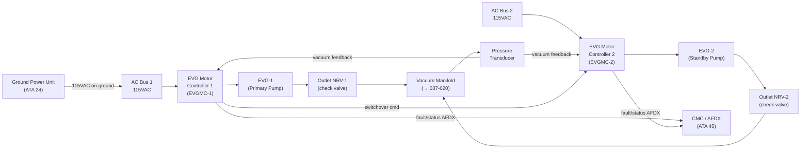
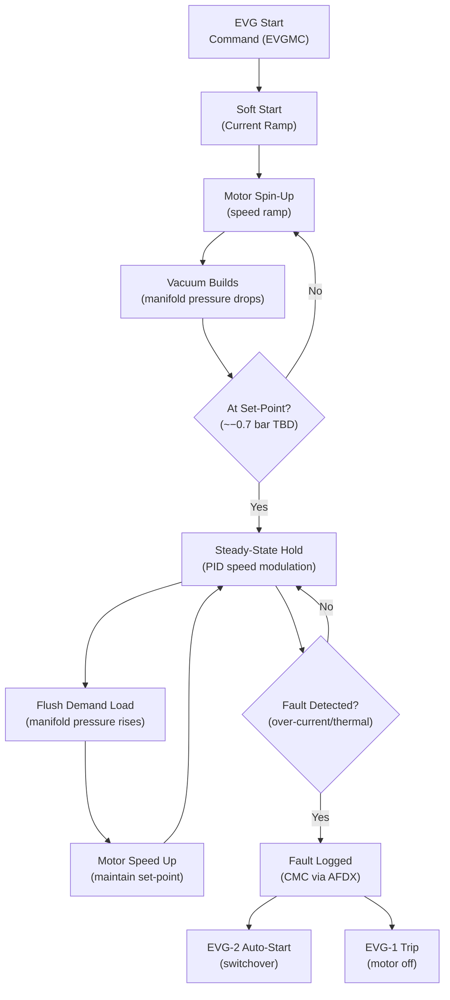
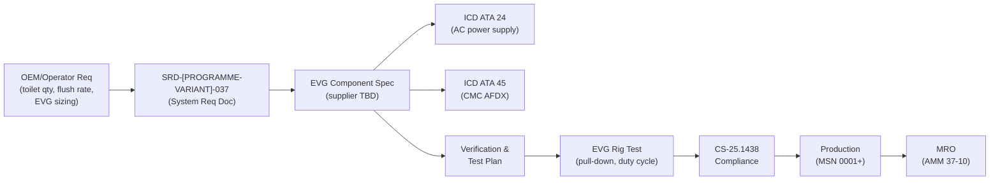

# 037-010 — Vacuum Sources
### [PROGRAMME-AIRCRAFT] [PROGRAMME-VARIANT] · ATA 37 · Q+ATLANTIDE ATLAS Scaffold

**Status:**   
**Revision:** 0.1 — 2025-07-14  
**Classification:** Q-AIR Primary

---

## §0 Hyperlink Policy

All cross-references use relative Markdown links within the Q+ATLANTIDE ATLAS repository. External regulatory references are cited by document identifier only; no live URLs are embedded. Internal DMC cross-references follow `DMC-<PROGRAMME>-<VARIANT>-037-10-YYYY-A`. Unresolved parameters use the badge  inline. Traceability to CSDB maintained in §14.

---

## §1 Purpose

This document defines the agnostic ATLAS standard-level architecture context for `037-010 — Vacuum Sources`.

It describes the controlled scope, functions, interfaces, safety considerations, lifecycle traceability, and S1000D/CSDB mapping logic that programme implementations shall instantiate when this node is applicable.

This document is not a programme design baseline. Programme-specific capacities, locations, part numbers, effectivity, operating limits, maintenance references, and data module codes shall be defined only inside the applicable programme implementation branch.
## §2 Applicability

| Applicability Level | Rule |
|---|---|
| Standard taxonomy | Applies to the ATLAS node `<NODE>` |
| Programme implementation | Conditional; determined by programme architecture, trade studies, certification basis, and applicability model |
| Product configuration | Defined in the programme-specific configuration baseline |
| Effectivity | Defined in the programme CSDB / applicability layer |
| Non-applicability | Must be explicitly stated in the programme impact-study branch when excluded |
## §3 System/Function Overview

### 3.1 EVG Role in [PROGRAMME-VARIANT]

The EVG is the sole means of generating the sub-atmospheric (vacuum) pressure required to operate the Vacuum Waste System. The EVG draws air from the vacuum manifold, reducing manifold pressure to approximately −0.7 to −1.0 bar gauge , creating the differential that drives waste from toilet bowls to waste tanks.

### 3.2 EVG Parameter Summary

| Parameter | Value | Status |
|---|---|---|
| EVG quantity | 2 (primary + standby) |  |
| EVG type | Rotary vane or diaphragm pump |  |
| Motor type | Brushless DC or AC induction |  |
| Rated operating vacuum | −0.7 to −1.0 bar gauge |  |
| Max operating vacuum (VRV limit) | −1.2 bar gauge |  |
| Motor input power | TBD kW |  |
| Power supply | 115 VAC (AC Bus 1 / AC Bus 2) |  |
| Location | Aft service compartment |  |
| Mass per unit | TBD kg |  |
| Operating life | TBD flight hours / TBD cycles |  |
| Cooling | Self-cooled / forced air TBD |  |
| Lubrication | Oil-sealed or oil-free TBD |  |
| Battery backup for EVG | TBD — likely not required (non-essential system) |  |

### 3.3 Eliminated Vacuum Source Types

| Source Type | Conventional Aircraft | [PROGRAMME-VARIANT] | Justification |
|---|---|---|---|
| Engine-driven vacuum pump | Yes (Piper, Cessna, some turboprops) | **NO** | [PROGRAMME-VARIANT] has no accessory gearbox-driven pumps |
| Bleed-air ejector/venturi | Some business jets | **NO** | [PROGRAMME-VARIANT] has no bleed air (fully electric) |
| Pneumatic engine bleed | No (ATA 36 not applicable) | **NO** | No engine bleed extraction on [PROGRAMME-VARIANT] |
| RAM air venturi | Some light aircraft | **NO** | Not applicable to transport category |
| Hydraulic vacuum pump | Rare | **NO** | Not fitted on [PROGRAMME-VARIANT] |

---

## §4 Scope

### 4.1 In-Scope

- EVG-1 (primary) unit and motor controller
- EVG-2 (standby) unit and motor controller
- Power supply connections from AC buses
- EVG outlet check valve (prevents backflow through idle EVG)
- EVG controller logic (set-point, auto-switchover, speed modulation)
- Ground power operation of EVG

### 4.2 Out-of-Scope

- Vacuum manifold downstream of EVG outlet (→ 037-020)
- Regulation and shutoff valves (→ 037-030)
- EVG exhaust air path (routed to ambient or filter; TBD)
- Waste tanks and servicing (→ ATA 38)

---

## §5 Architecture Description

### 5.1 Dual-EVG Architecture

The VWS uses a **primary/standby EVG architecture**:

- **EVG-1 (Primary):** Normally running during flight and ground ops. Powered from AC Bus 1 (TBD). Motor controller governs speed to maintain manifold vacuum at set-point.
- **EVG-2 (Standby):** Normally in standby (off or slow spin). Powered from AC Bus 2 (TBD — cross-bus connection TBD). Auto-starts on EVG-1 fault or manifold low-vacuum condition.

Each EVG has a dedicated **outlet check valve** to prevent recirculation of air back through the idle unit when its counterpart is running.

### 5.2 EVG Motor Controller Logic

The EVG Motor Controller (EVGMC) performs:
1. **Speed regulation:** PID control of motor speed to maintain manifold vacuum transducer reading at the set-point (~−0.7 bar TBD).
2. **Soft-start:** Ramp-up of motor speed on start to limit inrush current.
3. **Over-current protection:** Trips EVG on sustained over-current; sends fault to CMC.
4. **Auto-switchover:** If EVG-1 motor current fault, thermal fault, or manifold vacuum remains below threshold for > X seconds TBD → commands EVG-2 start.
5. **AFDX reporting:** Outputs motor speed, current draw, thermal status, and fault flags to CMC via AFDX network.

### 5.3 Ground Operation

The EVG operates identically on ground power (GPU) as in-flight. Ground operation supports:
- Pre-flight toilet servicing
- Passenger boarding/deplaning lavatory use
- Maintenance functional testing

Battery backup for the EVG is assessed as not required since the VWS is a non-safety-critical system.  — subject to safety assessment per CS-25.1309.

### 5.4 EVG Exhaust

The EVG pulls air from the vacuum manifold and exhausts it to:   
Options under evaluation:
- Direct exhaust to ambient (external vent port — preferred for contamination control)
- Exhaust through odour filter to bilge
- Exhaust to cargo bay ventilation

---

## §6 Functional Breakdown

| Function | Component | Parameters | Notes |
|---|---|---|---|
| Vacuum generation — primary | EVG-1 | −0.7 to −1.0 bar TBD | Motor-driven pump |
| Vacuum generation — standby | EVG-2 | −0.7 to −1.0 bar TBD | Auto-start on EVG-1 fault |
| Motor speed control | EVGMC-1 / EVGMC-2 | PID, soft-start | One controller per EVG |
| Backflow prevention | Outlet NRV per EVG | Spring-loaded check | Prevents recirculation |
| Power supply switching | AC Bus contactors (ATA 24) | 115 VAC TBD | Cross-bus TBD |
| Fault detection | EVGMC, motor current sensor | Over-current, thermal | AFDX to CMC |
| Auto-switchover | EVGMC logic | < X s TBD delay | CMC alert on switchover |
| Ground operation | GPU connection (ATA 24) | Same as in-flight | No special ground mode |

---

## §7 System Context Diagram

---

## §8 Internal Functional Architecture

---

## §9 Lifecycle Traceability

---

## §10 Interfaces

| Interface | Direction | Signal / Medium | ATA Chapter | Notes |
|---|---|---|---|---|
| AC Bus 1 power | In | 115 VAC TBD | ATA 24 | EVG-1 primary power |
| AC Bus 2 power | In | 115 VAC TBD | ATA 24 | EVG-2 standby power |
| Ground power | In | 115 VAC GPU | ATA 24 | Ground ops |
| Manifold pressure (transducer) | In | 0–5V or 4–20mA TBD | ATA 37-030 | Vacuum feedback to EVGMC |
| CMC/AFDX | Out | AFDX discrete | ATA 45 | Fault flags, speed, current, thermal |
| ECAM | Out | Via CMC | ATA 31 | EVG status display |
| SOV command | Out | 28 VDC discrete TBD | ATA 37-030 | EVGMC commands SOV close on fault |
| EVG exhaust | Out | Air (ambient) | — | Exhaust routing TBD |

---

## §11 Operating Modes

| Mode | EVG-1 | EVG-2 | EVGMC | Notes |
|---|---|---|---|---|
| Pre-flight / Ground | Running | Standby | Active | GPU power; toilets available |
| Normal — In-flight | Running | Standby | Active | AC Bus power; set-point maintained |
| Flush Load | Running (speed up) | Standby | Active | Transient demand; speed increases |
| EVG-1 Fault | Tripped | Starting | Switchover | CMC alert; crew advisory |
| Dual EVG Fault | Off | Off | Fault mode | No flushing; MEL |
| Maintenance | Off | Off | Powered down | SOV closed; AC Bus isolated |
| BITE Self-Test | Running (reduced) | Standby | Test mode | CMC-initiated |

---

## §12 Monitoring and Diagnostics

| Parameter | Sensor | CMC Fault Code | ECAM Message | Threshold |
|---|---|---|---|---|
| EVG-1 motor current | EVGMC-1 internal | F037-1001 | VAC GEN 1 FAULT | Over-current TBD A |
| EVG-1 thermal | EVGMC-1 NTC | F037-1002 | VAC GEN 1 OVERHEAT | > TBD °C |
| EVG-2 motor current | EVGMC-2 internal | F037-1003 | VAC GEN 2 FAULT | Over-current TBD A |
| EVG-2 thermal | EVGMC-2 NTC | F037-1004 | VAC GEN 2 OVERHEAT | > TBD °C |
| Auto-switchover event | EVGMC logic | F037-1005 | VAC GEN SWITCHOVER | EVG-2 started |
| Manifold vacuum (low) | Pressure transducer | F037-1010 | VAC SYS LO PRESS | < −0.5 bar TBD |
| AC Bus 1 loss | ATA 24 bus monitor | F037-1020 | VAC GEN 1 PWR LOSS | Bus voltage < TBD V |
| EVGMC-1 AFDX loss | CMC heartbeat | F037-1021 | VAC GEN 1 COM FAIL | Heartbeat timeout TBD |

---

## §13 Maintenance Concept

| Task | Interval | Level | AMM Reference |
|---|---|---|---|
| EVG-1 / EVG-2 visual inspection | Pre-flight / A-check | L1 | AMM 37-10-01 |
| EVG motor controller BITE test | A-check | L1 | AMM 37-10-02 |
| EVG oil level check (if oil-sealed) |  | L2 | AMM 37-10-03 |
| EVG oil change |  | L2 | AMM 37-10-04 |
| EVG vane replacement (rotary vane) |  FH | L3 workshop | CMM 37-10-01 |
| EVG motor winding resistance check | C-check | L2 | AMM 37-10-05 |
| Outlet NRV check valve test | Annual | L2 | AMM 37-10-06 |
| Auto-switchover functional test | A-check | L1 | AMM 37-10-07 |
| EVGMC software version verification | As required | L2 | AMM 37-10-08 |

---

## §14 S1000D/CSDB Mapping

| DMC Code | Title | Infocode | Status |
|---|---|---|---|
| DMC-<PROGRAMME>-<VARIANT>-037-10-00-00A-040A-D | Vacuum Sources — Description | 040 |  |
| DMC-<PROGRAMME>-<VARIANT>-037-10-00-00A-200A-D | EVG Removal and Installation | 200 |  |
| DMC-<PROGRAMME>-<VARIANT>-037-10-00-00A-300A-D | EVG Inspection | 300 |  |
| DMC-<PROGRAMME>-<VARIANT>-037-10-00-00A-520A-D | EVG Fault Isolation | 520 |  |
| DMC-<PROGRAMME>-<VARIANT>-037-10-00-00A-720A-D | EVG Motor Controller BITE | 720 |  |

---

## §15 Footprints

| Component | Location | Envelope (mm) | Mass (kg) | Mounting |
|---|---|---|---|---|
| EVG-1 | Aft service compartment  |  |  | Vibration-isolated mount |
| EVG-2 | Aft service compartment  |  |  | Vibration-isolated mount |
| EVGMC-1 | Adjacent to EVG-1  |  |  | Rack-mounted TBD |
| EVGMC-2 | Adjacent to EVG-2  |  |  | Rack-mounted TBD |
| Outlet NRV-1 | EVG-1 outlet port | Inline | < 0.5 TBD | Threaded inline |
| Outlet NRV-2 | EVG-2 outlet port | Inline | < 0.5 TBD | Threaded inline |

---

## §16 Safety and Certification

### 16.1 Applicable Regulations

| Regulation | Topic |
|---|---|
| CS-25.1438 | Pressurisation and pneumatic systems — applies to EVG and vacuum manifold |
| CS-25.1301 | Function and installation — EVG and EVGMC equipment approval |
| CS-25.1309 | Equipment, systems and installations — EVG failure assessment |
| CS-25.869 | Fire protection — EVG motor overtemperature protection |
| CS-25.1353 | Electrical equipment and installations — EVG motor wiring |

### 16.2 Failure Effects Table

| Failure | Probability Target | Effect | Mitigation |
|---|---|---|---|
| EVG-1 failure | < 1×10⁻³ /FH TBD | Switchover to EVG-2; no service interruption | Auto-switchover; CMC alert |
| EVG-1 + EVG-2 failure | < 1×10⁻⁵ /FH TBD | No toilet flushing; passenger discomfort | MEL dispatch; crew advisory |
| EVGMC-1 failure | < 1×10⁻³ /FH TBD | EVG-1 uncontrolled; EVGMC-2 takes over | Dual controller architecture |
| EVG motor fire | Extremely improbable | Potential smoke in service compartment | Thermal protection; fire detection ATA 26 |

### 16.3 No Gyro Vacuum Hazard Statement

The [PROGRAMME-VARIANT] does not use vacuum for gyroscopic flight instruments. The loss of EVG (both units) presents no flight safety risk. ADIRU/IRS (ATA 34) provides all attitude and heading data independently of ATA 37. This eliminates the CS-25.1438 vacuum gyro loss scenario that historically required dual vacuum pump demonstration.

---

## §17 Verification and Validation

| Test ID | Test Description | Method | Acceptance Criterion | Status |
|---|---|---|---|---|
| V037-010-001 | EVG vacuum pull-down test | Rig test, sealed manifold | Achieve −0.7 bar in < TBD seconds |  |
| V037-010-002 | EVG duty cycle endurance | Rig test, continuous operation | No degradation over TBD FH |  |
| V037-010-003 | Auto-switchover timing | Fault injection (EVGMC-1 shutdown) | EVG-2 running within < TBD seconds |  |
| V037-010-004 | EVGMC AFDX fault reporting | Simulation | All defined fault codes transmitted |  |
| V037-010-005 | EVG soft-start inrush current | Electrical rig | Inrush < TBD A peak |  |
| V037-010-006 | EVG thermal protection | Thermal chamber test | Trip at TBD °C; CMC alert generated |  |
| V037-010-007 | Ground power EVG operation | Ground test | Full EVG function on GPU |  |
| V037-010-008 | Outlet NRV backflow prevention | Rig test — reverse differential | No backflow through idle EVG |  |

---

## §18 Glossary

| Term | Definition |
|---|---|
| AC Bus | Alternating Current electrical bus supplying EVG motor controllers |
| AFDX | Avionics Full-Duplex Switched Ethernet — data network for CMC reporting |
| Auto-switchover | Automatic changeover from EVG-1 to EVG-2 upon fault detection |
| BITE | Built-In Test Equipment — internal self-test capability of EVGMC |
| CMC | Central Maintenance Computer |
| EVG | Electric Vacuum Generator — motor-driven vacuum pump |
| EVGMC | EVG Motor Controller — speed/current control and fault detection unit |
| GPU | Ground Power Unit — external electrical source for ground operations |
| NRV | Non-Return Valve — check valve preventing backflow through idle EVG |
| Oil-free pump | Vacuum pump design with no lubricating oil (dry vane or diaphragm) |
| Oil-sealed pump | Vacuum pump using oil for sealing and lubrication (e.g. rotary vane) |
| PID | Proportional-Integral-Derivative — control algorithm for EVG speed regulation |
| Rotary vane | Pump type using spring-loaded vanes rotating in an eccentric cavity |
| Soft-start | Motor starting method that ramps current gradually to limit inrush |
| VWS | Vacuum Waste System |

---

## §19 Citations

1. EASA CS-25 Amendment 27 — CS-25.1438 "Pressurisation and Pneumatic Systems."
2. EASA CS-25 Amendment 27 — CS-25.1309 "Equipment, Systems and Installations."
3. EASA CS-25 Amendment 27 — CS-25.1353 "Electrical Equipment and Installations."
4. ATA iSpec 2200 Chapter 37 — Vacuum.
5. [PROGRAMME-AIRCRAFT] [PROGRAMME-VARIANT] SRD-[PROGRAMME-VARIANT]-037 (EVG section) — 
6. EVG Supplier Specification —  (supplier not yet selected — OI-037-001)

---

## §20 References

| Document | Description |
|---|---|
| QATL-ATLAS-000099-ATLAS-030039-037-000 | ATA 37 General (parent document) |
| QATL-ATLAS-000099-ATLAS-030039-037-020 | Vacuum Distribution |
| QATL-ATLAS-000099-ATLAS-030039-037-030 | Vacuum Regulation and Shutoff |
| QATL-ATLAS-000099-ATLAS-030039-024-000 | Electrical Power — General (ATA 24) |
| QATL-ATLAS-000099-ATLAS-030039-045-000 | Central Maintenance System (ATA 45) |
| AMM-[PROGRAMME-AIRCRAFT]-037-10 | Aircraft Maintenance Manual Chapter 37-10 — Vacuum Sources |

---

## §21 Open Issues

| OI ID | Title | Impact | Status |
|---|---|---|---|
| OI-037-001 | EVG count and sizing (qty, rated vacuum, motor power) | Drives power budget, mass, footprint |  |
| OI-037-002 | Dry-flush vs. vacuum toilet decision | Determines if EVG is needed at all |  |
| OI-037-005 | Freeze protection for EVG exhaust line | EVG exhaust port may freeze at altitude |  |

---

## §22 Change Log

| Revision | Date | Author | Description |
|---|---|---|---|
| 0.0 | 2025-07-01 | Q+ATLANTIDE WG | Initial scaffold |
| 0.1 | 2025-07-14 | Q+ATLANTIDE WG | Full content draft — all §0–§22 populated |
