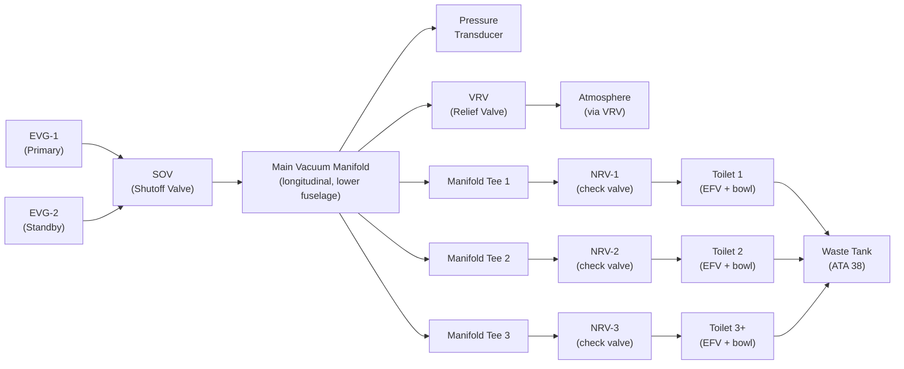
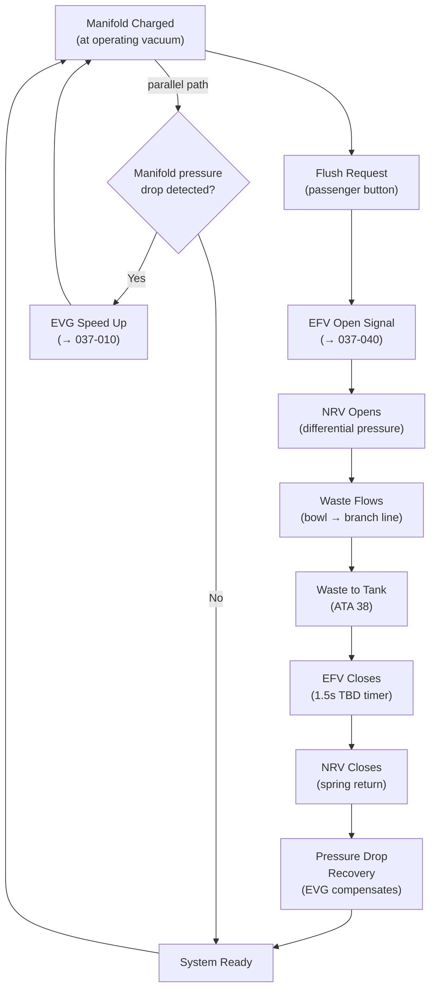

# 037-020 — Vacuum Distribution
### [PROGRAMME-AIRCRAFT] [PROGRAMME-VARIANT] · ATA 37 · Q+ATLANTIDE ATLAS Scaffold

**Status:**   
**Revision:** 0.1 — 2025-07-14  
**Classification:** Q-AIR Primary

---

## §0 Hyperlink Policy

All cross-references use relative Markdown links within the Q+ATLANTIDE ATLAS repository. External regulatory references are cited by document identifier only; no live URLs are embedded. Internal DMC cross-references follow `DMC-<PROGRAMME>-<VARIANT>-037-20-YYYY-A`. Unresolved parameters use the badge  inline.

---

## §1 Purpose

This document defines the agnostic ATLAS standard-level architecture context for `037-020 — Vacuum Distribution`.

It describes the controlled scope, functions, interfaces, safety considerations, lifecycle traceability, and S1000D/CSDB mapping logic that programme implementations shall instantiate when this node is applicable.

This document is not a programme design baseline. Programme-specific capacities, locations, part numbers, effectivity, operating limits, maintenance references, and data module codes shall be defined only inside the applicable programme implementation branch.
## §2 Applicability

| Applicability Level | Rule |
|---|---|
| Standard taxonomy | Applies to the ATLAS node `<NODE>` |
| Programme implementation | Conditional; determined by programme architecture, trade studies, certification basis, and applicability model |
| Product configuration | Defined in the programme-specific configuration baseline |
| Effectivity | Defined in the programme CSDB / applicability layer |
| Non-applicability | Must be explicitly stated in the programme impact-study branch when excluded |
## §3 System/Function Overview

### 3.1 Distribution Network Summary

| Component | Material | Size | Status |
|---|---|---|---|
| Main vacuum manifold | PTFE-lined aluminium or 316L stainless | DN40 TBD |  |
| Branch lines (manifold to toilet) | PTFE-lined aluminium or stainless | DN25 TBD |  |
| NRV (check valve) at each toilet | Stainless body, PTFE seat, spring-loaded | DN25 TBD |  |
| VRV tee fitting (manifold) | Stainless | Manifold body integrated |  |
| Pressure transducer port | Stainless | 1/4" NPT TBD |  |
| SOV connection port | Stainless | DN40 TBD |  |
| Line joints | Swaged or compression-type | Per line size |  |
| Fuselage penetration fittings | Composite-compatible sealant + through-bulkhead | Per line size |  |

### 3.2 Routing Concept

The main manifold runs longitudinally from the aft service compartment (EVG location) forward along the aircraft centreline or lower sidewall (bilge route preferred for gravity drainage of condensation). Branch lines rise from the manifold to each lavatory unit. Routing through composite fuselage frames requires sealed penetrations per structural and lightning protection requirements.

### 3.3 Toilet Count and Branch Points

| Zone | Toilets | Branch Points | Status |
|---|---|---|---|
| Aft lavatory | TBD | TBD |  |
| Mid lavatory | TBD | TBD |  |
| Fwd lavatory | TBD | TBD |  |
| Total | ~4–6 TBD | ~4–6 NRVs |  |

---

## §4 Scope

### 4.1 In-Scope

- Main vacuum manifold (from SOV outlet to last toilet branch point)
- Branch lines (from manifold tee to each toilet NRV inlet)
- NRVs at each toilet connection
- VRV tee on main manifold
- Pressure transducer port on main manifold
- Fuselage penetration fittings and sealing
- Line supports, clamps, and vibration isolation
- Bonding/grounding straps for composite fuselage integration

### 4.2 Out-of-Scope

- EVG and outlet check valves (→ 037-010)
- SOV and VRV valves (→ 037-030)
- EFV flush valves (→ 037-040)
- Waste tank connections (→ ATA 38)
- Toilet bowl assemblies (→ ATA 25)

---

## §5 Architecture Description

### 5.1 Main Manifold

The main manifold is a rigid tube running longitudinally through the lower fuselage. It collects vacuum from both EVG outlet check valves and distributes it to all branch lines. Design features:

- **Material:** PTFE-lined aluminium (preferred for mass) or 316L stainless steel (preferred for chemical resistance). Final selection pending OI-037-003/004. 
- **Diameter:** DN40 (nominal 40mm bore) TBD — sized for simultaneous flush events without excessive pressure drop. 
- **Wall pressure rating:** Must withstand cabin–to–vacuum differential (max ~1.0 bar) × safety factor (×4 per CS-25.1438 TBD).
- **Slope:** Minimum 1° slope toward low point drain to prevent condensate pooling. 
- **Thermal expansion:** Expansion loops or bellows at frame penetrations. 

### 5.2 Branch Lines

Each branch line connects a manifold tee to a toilet NRV:

- **Material:** PTFE-lined aluminium or stainless TBD. 
- **Diameter:** DN25 (nominal 25mm bore) TBD per toilet. 
- **Routing:** Routed upward from manifold bilge level to toilet bowl at floor level; shortest practical path to minimise volume and pressure drop.
- **Slope:** Drain-back slope toward manifold where possible.

### 5.3 Non-Return Valves (NRVs)

One NRV is installed on each branch line immediately upstream of the toilet EFV:

- **Function:** Prevents backflow of waste/odour from waste line to manifold when adjacent toilets flush.
- **Type:** Spring-loaded, disc-type check valve.
- **Material:** 316L stainless steel body; PTFE or EPDM seat; stainless spring.
- **Cracking pressure:** < 5 mbar TBD (opens easily under vacuum differential).
- **Seal pressure:** Positive seal against reverse flow at manifold operating vacuum.

### 5.4 Composite Fuselage Penetrations

The [PROGRAMME-VARIANT] uses a composite (CFRP) fuselage. Vacuum line penetrations require:
- **Electrically isolated through-fittings** to prevent galvanic corrosion between metal lines and CFRP.
- **Sealant** per materials specification TBD (PRC-1422 or equivalent) to maintain cabin pressurisation barrier.
- **Lightning protection:** Lines bonded at each frame crossing to structure via bonding jumpers; no unintended current paths through vacuum lines.
- **Structural approval:** Each penetration requires Stress review per CS-25 structure TBD.

### 5.5 Bonding and Grounding

In a composite fuselage, explicit bonding paths are required:
- Each metallic manifold/line segment bonded to aircraft earth via AWG 12 or heavier bonding strap at maximum 1.0 m intervals. 
- Resistance: < 2.5 mΩ from any fitting to aircraft structural earth. 

---

## §6 Functional Breakdown

| Function | Component | Material | Status |
|---|---|---|---|
| Vacuum distribution (main) | Main manifold | PTFE-lined Al or 316L SS |  |
| Vacuum distribution (branch) | Branch lines | PTFE-lined Al or 316L SS |  |
| Backflow prevention | NRV per toilet | 316L SS / PTFE seat |  |
| Relief protection | VRV tee (manifold) | SS spring-loaded | → 037-030 |
| Vacuum monitoring | Pressure transducer port | Manifold-integrated | → 037-030 |
| Line support | Clamps, hangers | Composite-compatible |  |
| Penetration sealing | Through-bulkhead fittings | Composite + sealant |  |
| Condensate drainage | Low-point drain point | Stainless |  |

---

## §7 System Context Diagram

---

## §8 Internal Functional Architecture

---

## §9 Lifecycle Traceability

```mermaid
flowchart LR
    TOQTY["Toilet Quantity\n(cabin layout TBD)"]
    LINESIZE["Line Sizing Analysis\n(pressure drop, simultaneous flush)"]
    MATSEL["Material Selection\n(PTFE-Al vs SS — OI-037-003)"]
    ROUTEAPPR["Routing Approval\n(Structures, Lightning Prot.)"]
    COMPSPEC["Component Specs\n(NRV, manifold, fittings)"]
    VTP["V&T Plan\n(§17)"]
    LEAKTEST["Leak Test\n(vacuum decay)"]
    CERT["CS-25.1438\nCompliance"]
    AMM["AMM 37-20\n(Maintenance)"]

    TOQTY --> LINESIZE --> MATSEL --> ROUTEAPPR --> COMPSPEC --> VTP
    VTP --> LEAKTEST --> CERT --> AMM
```

---

## §10 Interfaces

| Interface | Direction | Signal/Medium | ATA Chapter | Notes |
|---|---|---|---|---|
| SOV outlet | In | Vacuum (air) | ATA 37-030 | Main manifold inlet |
| VRV connection | Bi | Vacuum (air, relief) | ATA 37-030 | Relief tee on manifold |
| Pressure transducer | Out | Manifold vacuum signal | ATA 37-030 | Feedback to EVG controller |
| NRV outlets | Out | Vacuum (to toilet) | ATA 37-040 | To EFV inlet |
| Waste outlet (post-EFV) | Out | Waste (liquid/solid) | ATA 38 | Waste lines to tank |
| Fuselage structure | Physical | Mechanical attachment | ATA 53 | Clamps, brackets, penetrations |
| Electrical bonding | Physical | Bonding strap | ATA 24 | Earth continuity |
| Freeze protection heaters | In | Heat (electric trace) | ATA 30 | Manifold segments at risk of freezing |

---

## §11 Operating Modes

| Mode | Manifold State | NRV State | Notes |
|---|---|---|---|
| Normal — charged | −0.7 bar TBD | Closed (spring) | Ready for flush demand |
| Flush active (toilet N) | Slight pressure rise at NRV-N | NRV-N open | Other NRVs remain closed |
| EVG-1 failure | Manifold drains slowly | Closed | EVG-2 auto-starts; NRVs remain closed |
| Dual EVG failure | Manifold returns to ambient | Closed | No flush possible |
| VRV active | Manifold at relief pressure | Closed | Over-vacuum condition; VRV bleeds |
| Maintenance isolation | Ambient | Closed | SOV closed; manifold at cabin pressure |
| Ground drain | Ambient | Closed | Low-point drain opened (ATA 38) |

---

## §12 Monitoring and Diagnostics

| Parameter | Sensor | Location | CMC Fault | Threshold |
|---|---|---|---|---|
| Manifold vacuum | Pressure transducer | Main manifold | F037-2001 | < −0.5 bar TBD (low vacuum) |
| Manifold vacuum | Pressure transducer | Main manifold | F037-2002 | > −1.1 bar TBD (over-vacuum) |
| NRV stuck open | Inferred (continuous pressure drop) | Via transducer | F037-2010 | Pressure drop > TBD mbar/min without flush |
| Line leak | Vacuum decay test | Ground test only | — | Decay > TBD mbar/min |
| Condensate level | Low-point sensor TBD | Manifold low point | F037-2020 | Level > TBD (advisory) |

---

## §13 Maintenance Concept

| Task | Interval | Level | Reference |
|---|---|---|---|
| Manifold visual inspection | A-check | L1 | AMM 37-20-01 |
| Branch line visual inspection | A-check | L1 | AMM 37-20-02 |
| NRV functional test (per toilet) | Annual / C-check | L2 | AMM 37-20-03 |
| NRV cleaning and inspection | C-check | L2 | AMM 37-20-04 |
| NRV replacement | On-condition / TBD FH | L2 | AMM 37-20-05 |
| Vacuum decay leak test (system) | C-check | L2 | AMM 37-20-06 |
| Bonding resistance check | C-check | L2 | AMM 37-20-07 |
| Penetration seal inspection | Annual | L2 | AMM 37-20-08 |
| Condensate low-point drain | A-check or as needed | L1 | AMM 37-20-09 |
| Freeze protection heater check | Annual | L2 | AMM 30-XX-XX |

---

## §14 S1000D/CSDB Mapping

| DMC Code | Title | Infocode | Status |
|---|---|---|---|
| DMC-<PROGRAMME>-<VARIANT>-037-20-00-00A-040A-D | Vacuum Distribution Description | 040 |  |
| DMC-<PROGRAMME>-<VARIANT>-037-20-00-00A-200A-D | Manifold Removal and Installation | 200 |  |
| DMC-<PROGRAMME>-<VARIANT>-037-20-00-00A-300A-D | Line and NRV Inspection | 300 |  |
| DMC-<PROGRAMME>-<VARIANT>-037-20-00-00A-400A-D | Vacuum Decay Leak Test | 400 |  |
| DMC-<PROGRAMME>-<VARIANT>-037-20-00-00A-520A-D | Distribution Fault Isolation | 520 |  |

---

## §15 Footprints

| Component | Location | Length / Volume | Mass (kg) | Notes |
|---|---|---|---|---|
| Main manifold | Lower fuselage centreline / bilge | TBD m |  | Longitudinal run, EVG to fwd lav |
| Branch line (per toilet) | Manifold tee to toilet | TBD m each |  | Shorter = better for pressure drop |
| NRV (per toilet) | At toilet EFV inlet | ~100mm inline | < 0.3 kg TBD | One per toilet |
| Manifold clamps/hangers | Every 500mm TBD | — | < 0.1 kg each | Composite-compatible clamps |
| Penetration fittings | Per frame crossing | Inline | < 0.2 kg each | Sealed, electrically isolated |
| Bonding straps | Every 1.0m TBD | — | < 0.05 kg each | AWG 12 minimum |

---

## §16 Safety and Certification

### 16.1 Applicable Regulations

| Regulation | Application |
|---|---|
| CS-25.1438 | Vacuum system line and manifold structural integrity |
| CS-25.1301 | Distribution equipment function and installation |
| CS-25.1309 | Failure effects — manifold/line failures |
| CS-25.869 | No flammable fluid (waste — but CS-25.1438 covers system containment) |
| CS-25 Subpart D (Structural) | Fuselage penetration structural approval |
| CS-25.581 | Lightning protection — composite fuselage penetrations |

### 16.2 Failure Effects Table

| Failure | Effect | Severity | Detection | Mitigation |
|---|---|---|---|---|
| Main manifold rupture | Full vacuum loss; odour ingress | Major | CMC vacuum low; crew reports | SOV close; odour containment |
| Branch line rupture (one toilet) | That toilet unusable; odour local | Minor | CMC NRV anomaly | NRV closes; other toilets unaffected |
| NRV stuck open | Backflow of odour/waste to manifold | Major | CMC pressure anomaly | Replacement NRV on-condition |
| NRV stuck closed | That toilet unusable | Minor | Failed flush cycle CMC alert | Removal of NRV; toilet out of service |
| Penetration seal leak | Pressurisation loss path; odour to cabin | Minor to Major | Cabin crew report; CMC | Structural seal inspection |

---

## §17 Verification and Validation

| Test ID | Description | Method | Acceptance Criterion | Status |
|---|---|---|---|---|
| V037-020-001 | Manifold vacuum hold test | Sealed manifold, pump to set-point, monitor | < TBD mbar/min decay at −0.7 bar |  |
| V037-020-002 | Branch line pressure drop test | Flow simulation, simultaneous flush | Pressure drop < TBD mbar per flush cycle |  |
| V037-020-003 | NRV cracking pressure test | Apply increasing differential, note open point | Opens at < 5 mbar TBD differential |  |
| V037-020-004 | NRV backflow seal test | Reverse pressure, check leakage | Zero leakage at TBD bar reverse |  |
| V037-020-005 | Penetration seal leak test | Pressurised soap bubble / decay test | Zero visible leakage; decay < TBD |  |
| V037-020-006 | Bonding resistance measurement | Milliohm meter manifold-to-earth | < 2.5 mΩ at all test points |  |
| V037-020-007 | Thermal cycle manifold integrity | −55°C to +70°C cycle × TBD cycles | No leakage; no distortion |  |
| V037-020-008 | Simultaneous multi-toilet flush | Ground integration test | All toilets flush; vacuum recovers |  |

---

## §18 Glossary

| Term | Definition |
|---|---|
| Branch line | Vacuum tube connecting main manifold tee to individual toilet NRV |
| CFRP | Carbon Fibre Reinforced Polymer — [PROGRAMME-VARIANT] fuselage primary material |
| Cracking pressure | Minimum differential pressure required to open the NRV |
| DN | Diamètre Nominal — European pipe nominal bore designation (e.g. DN25 = 25mm bore) |
| EPDM | Ethylene Propylene Diene Monomer — rubber used for valve seats in vacuum service |
| Main manifold | Primary longitudinal vacuum distribution tube from SOV to all branch tees |
| NRV | Non-Return Valve — spring-loaded check valve preventing backflow at toilet connection |
| PTFE | Polytetrafluoroethylene — chemically resistant lining/material for vacuum waste tubes |
| Swaged joint | Permanent tube joint formed by deforming a fitting onto the tube end |
| Through-bulkhead fitting | Sealed connector passing through a structural frame or bulkhead |
| Vacuum decay test | Test method where a sealed system is evacuated and monitored for pressure rise (leakage) |
| VWS | Vacuum Waste System |

---

## §19 Citations

1. EASA CS-25 Amendment 27 — CS-25.1438 "Pressurisation and Pneumatic Systems."
2. EASA CS-25 Amendment 27 — CS-25.1309 "Equipment, Systems and Installations."
3. EASA CS-25 Amendment 27 — CS-25.581 "Lightning Protection."
4. ATA iSpec 2200 Chapter 37 — Vacuum.
5. [PROGRAMME-AIRCRAFT] [PROGRAMME-VARIANT] Composite Fuselage Penetration Standard — 
6. [PROGRAMME-AIRCRAFT] [PROGRAMME-VARIANT] Lightning Protection Plan — 

---

## §20 References

| Document | Description |
|---|---|
| QATL-ATLAS-000099-ATLAS-030039-037-000 | ATA 37 General |
| QATL-ATLAS-000099-ATLAS-030039-037-010 | Vacuum Sources (EVG) |
| QATL-ATLAS-000099-ATLAS-030039-037-030 | Vacuum Regulation and Shutoff |
| QATL-ATLAS-000099-ATLAS-030039-037-040 | Pumps, Ejectors, Valves, and Lines |
| QATL-ATLAS-000099-ATLAS-030039-038-000 | Water and Waste General (ATA 38) |
| AMM-[PROGRAMME-AIRCRAFT]-037-20 | Aircraft Maintenance Manual Chapter 37-20 |
| QATL-ATLAS-000099-ATLAS-030039-053-000 | Fuselage Structure General (ATA 53) |

---

## §21 Open Issues

| OI ID | Title | Impact | Status |
|---|---|---|---|
| OI-037-003 | Waste tank material and capacity (CFRP vs. stainless) | Affects line material compatibility |  |
| OI-037-004 | Vacuum line routing through composite fuselage | Penetration sealing, lightning protection, structural approval |  |
| OI-037-005 | Freeze protection for waste lines | Manifold and branch line heat trace routing |  |
| OI-037-002 | Dry-flush vs. vacuum toilet decision | If dry-flush: no distribution network required |  |

---

## §22 Change Log

| Revision | Date | Author | Description |
|---|---|---|---|
| 0.0 | 2025-07-01 | Q+ATLANTIDE WG | Initial scaffold |
| 0.1 | 2025-07-14 | Q+ATLANTIDE WG | Full content draft — all §0–§22 populated |
