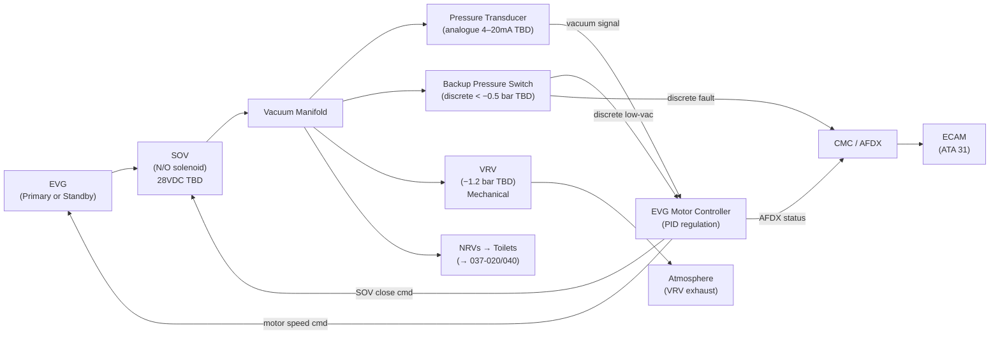
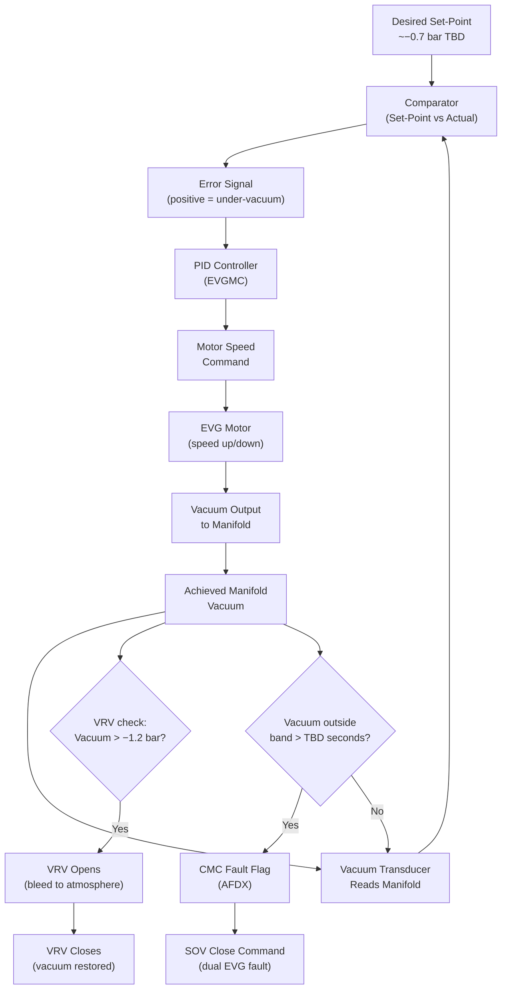
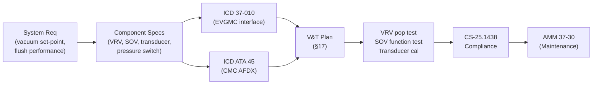

# 037-030 — Vacuum Regulation and Shutoff
### AMPEL360e eWTW · ATA 37 · Q+ATLANTIDE ATLAS Scaffold

**Status:**   
**Revision:** 0.1 — 2025-07-14  
**Classification:** Q-AIR Primary

---

## §0 Hyperlink Policy

All cross-references use relative Markdown links within the Q+ATLANTIDE ATLAS repository. External regulatory references are cited by document identifier only; no live URLs are embedded. Internal DMC cross-references follow `DMC-AMPEL360E-EWTW-037-30-YYYY-A`. Unresolved parameters use the badge  inline.

---

## §1 Purpose

This document describes the vacuum regulation and shutoff functions of the AMPEL360e eWTW Vacuum Waste System (VWS). Regulation ensures the manifold operates at the required vacuum level for reliable waste transport. Shutoff provides isolation of the vacuum source for fault management and maintenance.

The document covers:
1. The manifold vacuum set-point and the closed-loop regulation architecture.
2. The Vacuum Relief Valve (VRV) — mechanical over-vacuum protection.
3. The Shutoff Valve (SOV) — electrically actuated isolation between EVG and manifold.
4. The vacuum pressure transducer — manifold feedback sensor.
5. The backup pressure switch — independent fault detection.
6. EVG controller regulation logic (closed-loop PID).

---

## §2 Applicability

| Item | Value |
|---|---|
| Aircraft Programme | AMPEL360e eWTW |
| ATA Chapter / Subsubject | 37-030 — Vacuum Regulation and Shutoff |
| Document Tier | Level 3 — Subsystem Description |
| Effectivity | MSN 0001 onwards (TBD) |
| Parent Document | QATL-ATLAS-000099-ATLAS-030039-037-000 |

---

## §3 System/Function Overview

### 3.1 Regulation Architecture Summary

| Component | Type | Set-Point / Rating | Normal State | Status |
|---|---|---|---|---|
| EVG Motor Controller (EVGMC) | Closed-loop PID | Manifold at ~−0.7 bar TBD | Active |  |
| Vacuum Pressure Transducer | Analogue pressure sensor | 0 to −1.5 bar range TBD | Continuous measurement |  |
| Vacuum Relief Valve (VRV) | Mechanical spring-loaded | Opens at −1.2 bar TBD | Closed |  |
| Shutoff Valve (SOV) | Electric solenoid (N/O) | N/A | Normally OPEN |  |
| Backup Pressure Switch | Electromechanical | Trips at < −0.5 bar TBD | Monitoring |  |

### 3.2 Regulation Philosophy

The VWS uses **active speed regulation** of the EVG motor to hold manifold vacuum at the set-point, rather than a passive mechanical regulator. This avoids mechanical regulator complexity and wear, and allows software adjustment of the set-point without hardware changes.

The VRV provides a **mechanical safety backstop** against over-vacuum in case of EVG controller runaway. The SOV provides **electrical isolation** for fault management and maintenance.

### 3.3 Set-Point Values

| Parameter | Value | Status |
|---|---|---|
| Normal operating set-point | ~−0.6 to −0.7 bar gauge |  |
| Low-vacuum alarm threshold | < −0.5 bar gauge |  |
| High-vacuum alarm threshold | > −1.1 bar gauge |  |
| VRV relief set-point | −1.2 bar gauge |  |
| SOV close command trigger | EVG fault OR maintenance mode | — |

---

## §4 Scope

### 4.1 In-Scope

- EVG Motor Controller (EVGMC) regulation logic and set-point management
- Vacuum pressure transducer (manifold sensor)
- Vacuum Relief Valve (VRV) — location, spec, and function
- Shutoff Valve (SOV) — location, spec, and function
- Backup pressure switch — secondary fault detection
- Regulation loop description and fault detection

### 4.2 Out-of-Scope

- EVG motor and pump hardware (→ 037-010)
- Manifold and branch line hardware (→ 037-020)
- EFV flush valves and NRVs (→ 037-040)
- CMC and AFDX network architecture (→ 037-080)

---

## §5 Architecture Description

### 5.1 Closed-Loop Regulation

The EVG Motor Controller (EVGMC) implements a PID closed-loop:

```
Set-Point (~−0.7 bar TBD)
        │
        ▼
   [Comparator] ◄────── [Vacuum Transducer] ◄──── Manifold actual vacuum
        │
   Error signal
        │
        ▼
   [PID Controller]
        │
   Motor speed command
        │
        ▼
   [EVG Motor] ──► Vacuum output ──► Manifold
```

When manifold pressure rises (vacuum decreases — e.g. due to a flush cycle), the error signal increases, PID outputs higher motor speed command, EVG increases suction, and manifold vacuum is restored.

### 5.2 Vacuum Relief Valve (VRV)

- **Type:** Mechanical spring-loaded relief valve, normally closed.
- **Function:** Opens when manifold vacuum exceeds relief set-point (~−1.2 bar TBD), allowing atmospheric air to enter manifold and limit maximum vacuum.
- **Location:** Tee fitting on main vacuum manifold; installed upstream of first branch point.
- **Material:** 316L stainless steel body; stainless spring; PTFE or Viton seat. 
- **Adjustment:** Fixed spring set-point (not field-adjustable); replacement to change set-point.
- **Reset:** Automatic — closes when vacuum returns below set-point.
- **Exhaust:** VRV exhaust vents to bilge / ambient. 

### 5.3 Shutoff Valve (SOV)

- **Type:** Electric solenoid valve, **normally open** (N/O) — de-energised = open.
- **Function:** Isolates EVG from vacuum manifold on:
  - EVG fault (dual failure) — commanded by EVGMC
  - Maintenance mode — commanded by CMC or maintenance panel
  - System shutdown on ground
- **Normal operation:** SOV is de-energised (open), allowing EVG to maintain manifold vacuum.
- **Close command:** Solenoid energised (28 VDC TBD) → valve closes.
- **Fail-safe:** N/O design means SOV opens on power loss → EVG can maintain manifold vacuum without electrical power to SOV.
- **Position sensing:** Inductive proximity sensor (open/closed position feedback to CMC). 
- **Material:** 316L stainless steel body; FKM seat. 
- **Operating voltage:** 28 VDC (from Essential Bus or dedicated circuit) TBD. 
- **Response time:** < 2 seconds open/close TBD.

### 5.4 Vacuum Pressure Transducer

- **Type:** Analogue pressure transducer (4–20 mA or 0–5 VDC output TBD).
- **Range:** 0 to −1.5 bar gauge TBD.
- **Accuracy:** ±0.02 bar TBD.
- **Location:** Main vacuum manifold port, between SOV and first branch tee.
- **Output:** Provides real-time manifold vacuum to EVGMC (regulation) and CMC (monitoring, ECAM).
- **Redundancy:** Single transducer; backup pressure switch provides secondary detection. 

### 5.5 Backup Pressure Switch

- **Type:** Electromechanical vacuum switch.
- **Function:** Independent of analogue transducer; activates on vacuum below threshold (< −0.5 bar TBD).
- **Output:** Discrete signal to CMC (alarm) and to EVGMC (triggers EVG-2 start if EVG-1 running).
- **Purpose:** Catches transducer failure or wiring loss by providing binary low-vacuum detection.

---

## §6 Functional Breakdown

| Function | Component | Set-Point | Notes |
|---|---|---|---|
| Manifold vacuum regulation | EVGMC (PID) | ~−0.7 bar TBD | Closed-loop motor speed |
| Vacuum feedback | Pressure transducer | 0 to −1.5 bar range | 4–20mA or 0–5V TBD |
| Over-vacuum protection | VRV | −1.2 bar TBD | Mechanical spring, no electrical |
| Electrical isolation | SOV | N/O | Close on fault/maintenance |
| Secondary fault detection | Backup pressure switch | < −0.5 bar TBD | Binary discrete output |
| SOV position monitoring | Position sensor | Open/closed | Inductive proximity |
| CMC reporting | EVGMC AFDX | Continuous | Speed, vacuum, fault flags |

---

## §7 System Context Diagram



---

## §8 Internal Functional Architecture



---

## §9 Lifecycle Traceability



---

## §10 Interfaces

| Interface | Direction | Signal / Medium | ATA Chapter | Notes |
|---|---|---|---|---|
| EVG outlet | In | Vacuum (sub-atmospheric air) | ATA 37-010 | SOV inlet |
| Manifold | Out | Vacuum distributed | ATA 37-020 | SOV outlet → manifold |
| VRV | Bi | Mechanical (vacuum / atmospheric air) | ATA 37-030 (this doc) | Tee on manifold |
| Pressure transducer output | Out | 4–20 mA or 0–5 VDC TBD | ATA 37-010, ATA 45 | To EVGMC and CMC |
| Backup pressure switch | Out | Discrete 28 VDC TBD | ATA 37-010, ATA 45 | To EVGMC and CMC |
| SOV power | In | 28 VDC (Essential Bus TBD) | ATA 24 | Close command circuit |
| SOV position sensor | Out | Discrete 28 VDC TBD | ATA 45 | Open/closed to CMC |
| EVGMC motor speed feedback | Bi | Internal to EVGMC | ATA 37-010 | Regulation loop |

---

## §11 Operating Modes

| Mode | EVGMC | SOV | VRV | Transducer | Backup Switch |
|---|---|---|---|---|---|
| Normal (in-flight) | Active PID | Open (de-energised) | Closed | Reading | Armed |
| Flush load | Active PID (speed up) | Open | Closed | Reading | Armed |
| Over-vacuum (fault) | PID reduces speed | Open | Opens (bleeds) | Reading | Armed |
| Low vacuum (EVG-2 start) | EVG-2 PID active | Open | Closed | Reading | Triggered |
| Dual EVG fault | Off | Closed (energised) | Closed | Reading | Triggered |
| Maintenance isolation | Off | Closed (energised) | Closed | Optional | Disarmed |
| VRV test (ground) | Reduced speed | Open | Induced open | Reading | Monitored |

---

## §12 Monitoring and Diagnostics

| Parameter | Sensor | Fault Code | ECAM Message | Threshold |
|---|---|---|---|---|
| Manifold vacuum (analogue) | Pressure transducer | F037-3001 | VAC SYS LO PRESS | < −0.5 bar TBD |
| Manifold vacuum (analogue) | Pressure transducer | F037-3002 | VAC SYS HI PRESS | > −1.1 bar TBD |
| Transducer failure | EVGMC signal validity | F037-3003 | VAC SENSOR FAIL | Out-of-range / open circuit |
| Backup switch activation | Pressure switch | F037-3004 | VAC LO PRESS (backup) | < −0.5 bar TBD |
| SOV disagree (open cmd, closed pos) | Position sensor | F037-3010 | VAC SOV FAULT | Position ≠ command > 2s TBD |
| SOV disagree (close cmd, open pos) | Position sensor | F037-3011 | VAC SOV FAULT | Position ≠ command > 2s TBD |
| VRV suspected leak | Inferred (vacuum decay) | F037-3020 | VAC RELIEF LEAK | Vacuum drops at idle > TBD mbar/min |

---

## §13 Maintenance Concept

| Task | Interval | Level | Reference |
|---|---|---|---|
| SOV open/close functional test | A-check | L1 | AMM 37-30-01 |
| SOV position sensor check | A-check | L1 | AMM 37-30-02 |
| VRV pop test (vacuum bench rig) | Annual / C-check | L2 | AMM 37-30-03 |
| VRV visual inspection | A-check | L1 | AMM 37-30-04 |
| Pressure transducer calibration | Annual / C-check | L2 | AMM 37-30-05 |
| Backup pressure switch test | Annual | L2 | AMM 37-30-06 |
| SOV seal inspection / replacement | C-check | L2 | AMM 37-30-07 |
| EVGMC set-point verification | Annual | L2 | AMM 37-30-08 |
| VRV set-point verification (bench) | C-check | L2 | AMM 37-30-09 |

---

## §14 S1000D/CSDB Mapping

| DMC Code | Title | Infocode | Status |
|---|---|---|---|
| DMC-AMPEL360E-EWTW-037-30-00-00A-040A-D | Regulation and Shutoff Description | 040 |  |
| DMC-AMPEL360E-EWTW-037-30-00-00A-200A-D | SOV and VRV R&I | 200 |  |
| DMC-AMPEL360E-EWTW-037-30-00-00A-300A-D | Transducer and Switch Inspection | 300 |  |
| DMC-AMPEL360E-EWTW-037-30-00-00A-400A-D | VRV Pop Test Procedure | 400 |  |
| DMC-AMPEL360E-EWTW-037-30-00-00A-520A-D | Regulation Fault Isolation | 520 |  |

---

## §15 Footprints

| Component | Location | Envelope | Mass (kg) | Notes |
|---|---|---|---|---|
| VRV | Manifold tee, aft service comp. | ~100mm × 60mm TBD | < 0.5 TBD | Spring-loaded, no electrical |
| SOV | Between EVG outlet NRVs and manifold | ~150mm × 80mm TBD | < 1.0 TBD | Solenoid actuator; requires 28VDC |
| Pressure transducer | Manifold port | ~60mm × 30mm TBD | < 0.2 TBD | 1/4" NPT port |
| Backup pressure switch | Manifold port (secondary) | ~50mm × 30mm TBD | < 0.1 TBD | Binary switch |

---

## §16 Safety and Certification

### 16.1 Applicable Regulations

| Regulation | Application |
|---|---|
| CS-25.1438 | VRV and SOV as parts of pneumatic/vacuum system |
| CS-25.1301 | SOV, VRV, transducer function and installation |
| CS-25.1309 | Failure effects: SOV stuck, VRV fails, transducer failure |
| CS-25.1357 | Circuit protective devices — SOV solenoid circuit |

### 16.2 Failure Effects Table

| Failure | Effect | Severity | Mitigation |
|---|---|---|---|
| VRV fails to open (stuck closed) | Over-vacuum; potential manifold damage | Hazardous | Secondary VRV TBD; line strength rating > VRV set-point |
| VRV fails to close (stuck open) | Manifold bleeds to ambient; reduced vacuum | Major | EVG compensates to limit; CMC alert; crew advisory |
| SOV fails open (stuck) | Cannot isolate; maintenance only impact | Minor | Manual override TBD |
| SOV fails closed (stuck energised) | No vacuum to manifold; total VWS loss | Major | SOV position monitoring; crew advisory; MEL |
| Transducer failure | EVGMC loses primary feedback | Major | Backup switch; EVGMC safe mode |
| Backup switch failure | Loss of secondary low-vac detection | Minor | Transducer primary remains; CMC advisory |
| EVGMC regulation failure (runaway) | Over-vacuum | Hazardous | VRV mechanical protection; independent |

---

## §17 Verification and Validation

| Test ID | Description | Method | Acceptance Criterion | Status |
|---|---|---|---|---|
| V037-030-001 | EVG set-point regulation accuracy | Rig test — measure manifold at steady state | Within ±0.05 bar of set-point TBD |  |
| V037-030-002 | VRV pop test | Rig — increase vacuum until VRV opens | VRV opens at −1.2 bar ±5% TBD |  |
| V037-030-003 | VRV reclose test | Continue from V037-030-002 | VRV closes cleanly below set-point |  |
| V037-030-004 | SOV open command / position confirm | Ground test — de-energise SOV | Position sensor reads OPEN within 2s TBD |  |
| V037-030-005 | SOV close command / position confirm | Ground test — energise SOV | Position sensor reads CLOSED within 2s TBD |  |
| V037-030-006 | SOV disagree fault test | Fault injection (block position sensor) | CMC F037-3010 generated within TBD seconds |  |
| V037-030-007 | Transducer calibration | Bench calibration against reference | ±0.02 bar accuracy over full range |  |
| V037-030-008 | Backup switch activation test | Apply < −0.5 bar to switch port | Discrete output activates; CMC F037-3004 |  |
| V037-030-009 | EVGMC runaway protection | Fault injection — disable PID output limit | VRV opens before −1.3 bar reached |  |

---

## §18 Glossary

| Term | Definition |
|---|---|
| Backup pressure switch | Electromechanical binary vacuum switch providing secondary low-vacuum detection |
| Closed-loop regulation | Control method using feedback (transducer reading) to maintain output at set-point |
| EVGMC | EVG Motor Controller — implements PID regulation of motor speed |
| FKM | Fluorocarbon elastomer (Viton) — high-chemical-resistance valve seat material |
| N/O | Normally Open — SOV default state when de-energised (no power) |
| PID | Proportional-Integral-Derivative — standard closed-loop control algorithm |
| Set-point | Target manifold vacuum value (~−0.7 bar gauge TBD) |
| SOV | Shutoff Valve — electric solenoid valve isolating EVG from manifold |
| Transducer | Pressure transducer — converts manifold vacuum to electrical signal (4–20mA TBD) |
| VRV | Vacuum Relief Valve — mechanical spring valve limiting maximum manifold vacuum |
| VWS | Vacuum Waste System |

---

## §19 Citations

1. EASA CS-25 Amendment 27 — CS-25.1438 "Pressurisation and Pneumatic Systems."
2. EASA CS-25 Amendment 27 — CS-25.1309 "Equipment, Systems and Installations."
3. EASA CS-25 Amendment 27 — CS-25.1357 "Circuit Protective Devices."
4. ATA iSpec 2200 Chapter 37 — Vacuum.
5. AMPEL360e eWTW SRD-eWTW-037 (Regulation section) — 
6. VRV / SOV Supplier Specification — 

---

## §20 References

| Document | Description |
|---|---|
| QATL-ATLAS-000099-ATLAS-030039-037-000 | ATA 37 General |
| QATL-ATLAS-000099-ATLAS-030039-037-010 | Vacuum Sources (EVG, EVGMC) |
| QATL-ATLAS-000099-ATLAS-030039-037-020 | Vacuum Distribution (manifold, lines) |
| QATL-ATLAS-000099-ATLAS-030039-037-040 | Pumps, Ejectors, Valves, and Lines |
| QATL-ATLAS-000099-ATLAS-030039-024-000 | Electrical Power General (ATA 24) |
| QATL-ATLAS-000099-ATLAS-030039-045-000 | Central Maintenance System (ATA 45) |
| AMM-AMPEL360E-037-30 | Aircraft Maintenance Manual Chapter 37-30 |

---

## §21 Open Issues

| OI ID | Title | Impact | Status |
|---|---|---|---|
| OI-037-001 | EVG count and sizing | EVGMC set-point tuning depends on EVG performance |  |
| OI-037-002 | Dry-flush vs. vacuum toilet | If dry-flush: regulation system not required |  |
| OI-037-006 | Odour filter — VRV exhaust path | VRV exhaust routing affects odour filter sizing |  |

---

## §22 Change Log

| Revision | Date | Author | Description |
|---|---|---|---|
| 0.0 | 2025-07-01 | Q+ATLANTIDE WG | Initial scaffold |
| 0.1 | 2025-07-14 | Q+ATLANTIDE WG | Full content draft — all §0–§22 populated |
