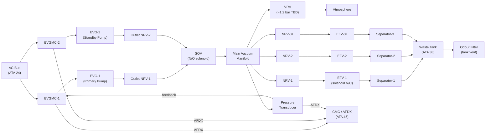
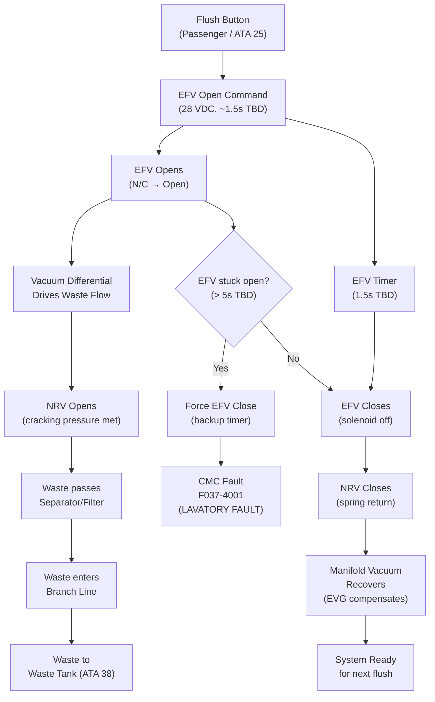
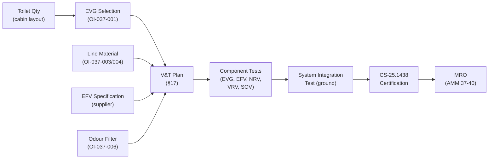

# 037-040 — Vacuum Pumps, Ejectors, Valves, and Lines
### AMPEL360e eWTW · ATA 37 · Q+ATLANTIDE ATLAS Scaffold

**Status:**   
**Revision:** 0.1 — 2025-07-14  
**Classification:** Q-AIR Primary

---

## §0 Hyperlink Policy

All cross-references use relative Markdown links within the Q+ATLANTIDE ATLAS repository. External regulatory references are cited by document identifier only; no live URLs are embedded. Internal DMC cross-references follow `DMC-AMPEL360E-EWTW-037-40-YYYY-A`. Unresolved parameters use the badge  inline.

---

## §1 Purpose

This document provides the consolidated component-level description of all vacuum pumps, ejectors (and their deliberate absence), valves, and lines that make up the AMPEL360e eWTW Vacuum Waste System (VWS). It serves as the primary hardware reference for all ATA 37 physical components.

Objectives:
1. Describe the EVG as a vacuum pump — pump type, construction, and performance parameters.
2. Explicitly document the absence of ejectors and justify this on the basis of eWTW architecture.
3. Describe the EFV (Electric Flush Valve) — the primary consumer-side valve.
4. Describe the NRV (Non-Return Valve) at each toilet connection.
5. Describe the VRV (Vacuum Relief Valve) and SOV (Shutoff Valve) at component level.
6. Describe vacuum lines (manifold and branches), separators, and odour filters.
7. Provide a complete component inventory table.

---

## §2 Applicability

| Item | Value |
|---|---|
| Aircraft Programme | AMPEL360e eWTW |
| ATA Chapter / Subsubject | 37-040 — Vacuum Pumps, Ejectors, Valves, and Lines |
| Document Tier | Level 3 — Subsystem Description |
| Effectivity | MSN 0001 onwards (TBD) |
| Parent Document | QATL-ATLAS-000099-ATLAS-030039-037-000 |

---

## §3 System/Function Overview

### 3.1 Component Inventory Table

| # | Component | Qty | Type / Material | Function | Status |
|---|---|---|---|---|---|
| 1 | Electric Vacuum Generator (EVG) | 2 TBD | Rotary vane or diaphragm pump | Vacuum source |  |
| 2 | EVG Motor Controller (EVGMC) | 2 TBD | Brushless DC or AC induction controller | Motor speed / regulation |  |
| 3 | EVG Outlet Check Valve | 2 TBD | Spring-loaded, SS / PTFE | Backflow prevention through idle EVG |  |
| 4 | Ejector (bleed-air type) | 0 | **NOT FITTED** | N/A — no bleed air on eWTW | N/A |
| 5 | Shutoff Valve (SOV) | 1 TBD | N/O solenoid, SS, FKM | EVG isolation |  |
| 6 | Vacuum Relief Valve (VRV) | 1 TBD | Spring-loaded mechanical, SS / PTFE | Over-vacuum protection |  |
| 7 | Electric Flush Valve (EFV) | TBD (1 per toilet) | Solenoid, SS, FKM | Initiates flush cycle |  |
| 8 | NRV — toilet inlet | TBD (1 per toilet) | Spring disc check, SS / PTFE | Prevents waste backflow |  |
| 9 | Vacuum Main Manifold | 1 | PTFE-lined Al or 316L SS | Vacuum distribution |  |
| 10 | Branch Lines (per toilet) | TBD | PTFE-lined Al or 316L SS | Toilet-to-manifold connection |  |
| 11 | Waste Separator / Inlet Filter | TBD (1 per toilet) | Stainless mesh or PTFE | Catches solid debris at manifold inlet |  |
| 12 | Odour Filter | TBD (1 per tank vent) | Activated carbon, ABS housing | Filters tank vent air |  |
| 13 | Vacuum Pressure Transducer | 1 | 4–20mA or 0–5V TBD, SS | Manifold vacuum feedback |  |
| 14 | Backup Pressure Switch | 1 | Electromechanical, SS | Low-vacuum alarm backup |  |

### 3.2 Architecture Overview

All physical components form a serial/parallel network:

- **Serial path (vacuum generation → consumption):** EVG → Outlet NRV → SOV → Main Manifold → Branch NRV → EFV → Toilet → Separator → Waste Tank (ATA 38)
- **Parallel relief path:** Main Manifold → VRV → Atmosphere
- **Monitoring path:** Main Manifold → Pressure Transducer → EVGMC/CMC
- **Tank vent path:** Waste Tank → Odour Filter → Cabin or ambient TBD

---

## §4 Scope

### 4.1 In-Scope

All ATA 37 physical hardware components listed in §3.1 items 1–14.

### 4.2 Out-of-Scope

- Toilet bowl assemblies and seat mechanisms (ATA 25)
- Waste tanks and ground service connections (ATA 38)
- Aircraft electrical power system (ATA 24)
- CMC and AFDX network (ATA 45)

---

## §5 Architecture Description

### 5.1 EVG — Electric Vacuum Generator (Pump)

The EVG is a motor-driven vacuum pump. It is the only vacuum generating device on the eWTW (no engine-driven pumps, no ejectors).

**Pump type options under evaluation:** 

| Option | Pros | Cons |
|---|---|---|
| Rotary vane (oil-sealed) | High vacuum, high flow, mature technology | Oil changes, oil mist in exhaust, higher maintenance |
| Rotary vane (dry) | No oil, cleaner exhaust | Vane wear, shorter service interval |
| Diaphragm | Oil-free, low maintenance, pulsation-free | Lower max vacuum, lower flow |
| Scroll pump | Oil-free, quiet, high vacuum | Heavier, higher cost |

**Preferred selection criteria:** oil-free operation preferred to avoid contamination of vacuum manifold and waste lines. Final selection pending OI-037-001. 

**Motor type:** Brushless DC (preferred for controllability and efficiency) or AC induction (simpler, no motor controller complexity). 

**Performance targets:**
- Rated operating vacuum: −0.7 to −1.0 bar gauge 
- Flow rate at operating vacuum: TBD L/min 
- Motor input power: TBD kW 
- Duty cycle: continuous operation rated 
- Overhaul interval: TBD FH 
- Vibration isolation: required; mounting to isolate from airframe structure

### 5.2 Ejectors — NOT FITTED

Bleed-air ejectors (venturi-type vacuum generators using engine bleed motive flow) are **NOT fitted** on the eWTW. Rationale:

- The eWTW is a **fully electric architecture** with **no engine bleed air extraction**. Engines have no bleed ports. There is no pneumatic manifold (ATA 36 is not applicable in the conventional bleed sense).
- Without a motive bleed air flow, ejectors cannot function.
- Even if a pneumatic source were available, ejectors would be architecturally inappropriate as they require continuous motive flow, reducing efficiency.
- Electric motor-driven EVGs are simpler, controllable, and appropriate for the eWTW all-electric philosophy.

**This section is retained as a placeholder to explicitly document and justify the non-fitment of ejectors**, preventing future re-evaluation without awareness of this decision.

### 5.3 Electric Flush Valve (EFV)

The EFV is an electrically actuated solenoid valve installed between the toilet bowl outlet and the waste line. It is the primary consumer-side actuator.

**Function:** When the passenger activates the flush button, the cabin management or toilet control unit sends a 28 VDC signal to the EFV solenoid. The EFV opens, allowing the vacuum differential to draw waste from the bowl through the waste line to the waste tank. The EFV closes after a timed cycle (nominally ~1.5 seconds TBD).

**EFV parameters:**

| Parameter | Value | Status |
|---|---|---|
| Quantity | 1 per toilet |  |
| Type | Normally closed solenoid valve | — |
| Actuation voltage | 28 VDC TBD |  |
| Flush cycle duration | ~1.5 seconds TBD |  |
| Bore size | DN25 TBD |  |
| Seat material | FKM or PTFE TBD |  |
| Body material | 316L stainless steel TBD |  |
| Differential pressure rating | −1.5 bar gauge minimum TBD |  |
| Stuck-open protection | Timer circuit; auto-close after max 5s TBD |  |
| CMC fault reporting | Stuck-open fault via AFDX |  |
| Location | Integral to toilet unit (ATA 25 boundary) | — |

**Note:** The EFV is physically integrated into the toilet unit assembly (ATA 25 boundary), but its electrical control interface and vacuum circuit function are ATA 37 responsibility.

### 5.4 Non-Return Valves — NRV (Check Valves at Toilet Connections)

One NRV is installed per toilet on the branch line, downstream of the EFV and upstream of the waste separator:

| Parameter | Value | Status |
|---|---|---|
| Quantity | 1 per toilet |  |
| Type | Spring-loaded disc check valve | — |
| Cracking differential | < 5 mbar TBD |  |
| Reverse seal pressure | Full manifold vacuum (−1.0 bar TBD) |  |
| Body material | 316L stainless steel |  |
| Seat material | PTFE TBD |  |
| Bore | DN25 TBD |  |
| Service interval | Inspect at C-check; replace on-condition |  |

**Function:** During flush, the EFV opens. Vacuum differential causes the NRV disc to lift (cracking pressure met), waste flows through. After EFV closes, spring returns disc to seat, preventing backflow of odour or waste from waste line toward manifold.

### 5.5 Vacuum Relief Valve (VRV) — Component Detail

(See also 037-030 §5.2 for regulation context.)

| Parameter | Value | Status |
|---|---|---|
| Type | Mechanical spring-loaded, normally closed | — |
| Set-point | −1.2 bar gauge TBD |  |
| Set-point tolerance | ±5% TBD |  |
| Body material | 316L stainless steel |  |
| Seat material | PTFE or Viton TBD |  |
| Spring material | Stainless steel |  |
| Exhaust direction | Bilge/ambient TBD |  |
| Maintenance | Pop test annually; replacement on deviation |  |

### 5.6 Shutoff Valve (SOV) — Component Detail

(See also 037-030 §5.3 for regulation context.)

| Parameter | Value | Status |
|---|---|---|
| Type | Electric solenoid, normally open | — |
| Actuation voltage | 28 VDC TBD |  |
| Bore | DN40 TBD |  |
| Body material | 316L stainless steel |  |
| Seat material | FKM TBD |  |
| Position sensing | Inductive proximity sensor (open/closed) |  |
| Response time | < 2 seconds TBD |  |
| Maintenance | Annual function test; O-ring replacement at C-check |  |

### 5.7 Vacuum Lines — Main Manifold and Branch Lines

| Parameter | Main Manifold | Branch Lines | Status |
|---|---|---|---|
| Nominal bore | DN40 TBD | DN25 TBD |  |
| Material | PTFE-lined aluminium or 316L SS | PTFE-lined aluminium or 316L SS |  |
| Pressure rating | > 4× maximum differential (×4 CS-25) | > 4× maximum differential |  |
| Joint type | Swaged or compression-type TBD | Swaged or compression-type TBD |  |
| Routing | Lower fuselage / bilge (longitudinal) | From manifold tee upward to toilet |  |
| Supports | Every 500mm TBD | Every 300mm TBD |  |
| Thermal expansion | Bellows at frame crossings TBD | Flexible section TBD |  |
| Bonding | Every 1.0m TBD | Every 0.5m TBD |  |

### 5.8 Waste Separator / Inlet Filter

One separator/filter is installed at each toilet waste line inlet (before waste enters the branch vacuum line):

- **Function:** Catches solid debris and fibrous material that could block the NRV or branch line.
- **Type:** Stainless mesh basket or PTFE screen filter. 
- **Mesh size:** TBD (fine enough to catch waste solids, coarse enough to pass paper). 
- **Cleaning:** During A-check or as needed (high-use routes). 
- **Location:** Immediately downstream of EFV, before NRV. 

### 5.9 Odour Filter

One activated-carbon odour filter is installed on each waste tank vent outlet:

- **Function:** Removes odourous gases (H₂S, NH₃, methane) from tank vent air before discharge.
- **Material:** Activated carbon granules in ABS or stainless housing. 
- **Vent path:** Tank vent → odour filter → cabin TBD or ambient TBD. 
- **Replacement interval:** TBD (OI-037-006). 
- **Certification:** OI-037-006 — odour filter must be certified per AMC 25.831 (cabin air quality). 

---

## §6 Functional Breakdown

| Function | Component | Normal State | Failure Mode |
|---|---|---|---|
| Vacuum generation | EVG-1 (primary) | Running | Switch to EVG-2 |
| Vacuum generation backup | EVG-2 (standby) | Standby | Auto-start on EVG-1 fail |
| Backflow prevention (EVG idle) | Outlet NRV (per EVG) | Closed | Stuck open → recirculation |
| System isolation | SOV | Open (N/O) | Stuck closed → VWS loss |
| Over-vacuum protection | VRV | Closed | Stuck closed → over-vacuum damage |
| Flush initiation | EFV (per toilet) | Closed (N/C) | Stuck open → waste backflow |
| Backflow prevention (toilet) | NRV (per toilet) | Closed | Stuck open → odour backflow |
| Debris separation | Separator/filter (per toilet) | Clear | Blocked → flush failure |
| Odour control | Odour filter (per tank vent) | Active | Saturated → odour in cabin |
| Vacuum monitoring | Pressure transducer | Measuring | Fail → backup switch |
| Vacuum alarm backup | Backup pressure switch | Armed | Fail → CMC advisory only |

---

## §7 System Context Diagram

---

## §8 Internal Functional Architecture

---

## §9 Lifecycle Traceability

---

## §10 Interfaces

| Interface | Direction | Signal/Medium | ATA Chapter | Notes |
|---|---|---|---|---|
| AC Bus power (EVG) | In | 115 VAC TBD | ATA 24 | EVG motor power |
| DC power (EFV, SOV) | In | 28 VDC TBD | ATA 24 | Flush valve and shutoff valve actuation |
| Flush button signal | In | Discrete 28 VDC TBD | ATA 25 | Passenger/crew initiates flush |
| Waste outlet | Out | Waste (liquid/solid) | ATA 38 | Post-separator waste to tank |
| Tank vent | Out | Air (filtered) | ATA 38 / ATA 21 TBD | Via odour filter |
| CMC AFDX | Out | AFDX | ATA 45 | EVG, EFV, NRV fault reporting |
| Pressure transducer | Out | 4–20mA or 0–5V TBD | ATA 37-030 | Manifold vacuum to EVGMC/CMC |
| Freeze protection | In | Heat (electric trace) | ATA 30 | Branch lines and manifold segments |

---

## §11 Operating Modes

| Mode | EVG | SOV | EFV | NRV | Separator | Odour Filter |
|---|---|---|---|---|---|---|
| Normal standby | Running | Open | Closed | Closed | Clear | Active |
| Flush active (one toilet) | Running | Open | Open (1.5s) | Open | Flowing | Active |
| Dual flush (simultaneous) | Running (speed up) | Open | Both open | Both open | Flowing | Active |
| EVG-1 fault / EVG-2 active | EVG-2 running | Open | Closed (ready) | Closed | Clear | Active |
| Total vacuum loss | Off | Closed | Locked closed | Closed | — | Active |
| Maintenance | Off | Closed | Closed | Closed | — | — |
| Ground drain (ATA 38) | Off | Closed | Closed | Closed | — | — |

---

## §12 Monitoring and Diagnostics

| Parameter | Sensor / Source | Fault Code | ECAM Message | Threshold |
|---|---|---|---|---|
| EFV stuck open | EFV timer logic | F037-4001 | LAVATORY FAULT | EFV open > 5s TBD |
| EFV no-open confirmation | Position sensor (if fitted) TBD | F037-4002 | LAVATORY FAULT | EFV commanded open, not confirmed open |
| NRV suspected stuck open | Pressure drop pattern | F037-4010 | VAC SYS ANOMALY | Vacuum decay > TBD without flush demand |
| Separator blocked | EVG over-current (increased load) | F037-4020 | VAC SEPARATOR | EVG current > TBD A with flush active |
| Odour filter saturated | Timed replacement advisory | F037-4030 | WASTE FILTER SERV | Interval TBD hrs since last change |
| Manifold vacuum (low) | Pressure transducer | F037-3001 | VAC SYS LO PRESS | < −0.5 bar TBD |
| EVG-1 fault (motor) | EVGMC-1 | F037-1001 | VAC GEN 1 FAULT | Over-current or thermal TBD |
| EVG-2 fault (motor) | EVGMC-2 | F037-1003 | VAC GEN 2 FAULT | Over-current or thermal TBD |

---

## §13 Maintenance Concept

| Task | Component | Interval | Level | Reference |
|---|---|---|---|---|
| EVG visual inspection | EVG-1/2 | Pre-flight / A-check | L1 | AMM 37-10-01 |
| EVG vane/diaphragm replacement | EVG-1/2 | TBD FH (OI-037-001) | L3 shop | CMM 37-10-01 |
| SOV function test | SOV | A-check | L1 | AMM 37-30-01 |
| VRV pop test | VRV | Annual / C-check | L2 | AMM 37-30-03 |
| EFV flush cycle test | All EFVs | A-check | L1 | AMM 37-40-01 |
| EFV seal replacement | All EFVs | C-check / on-condition | L2 | AMM 37-40-02 |
| NRV functional test | All NRVs | Annual / C-check | L2 | AMM 37-20-03 |
| NRV cleaning | All NRVs | C-check | L2 | AMM 37-20-04 |
| Separator cleaning | All separators | A-check (high use) | L1 | AMM 37-40-03 |
| Odour filter replacement | All filters | TBD hrs (OI-037-006) | L1 | AMM 37-40-04 |
| Vacuum line visual inspection | Manifold + branches | Annual | L1 | AMM 37-20-01 |
| Vacuum decay leak test | Full system | C-check | L2 | AMM 37-20-06 |

---

## §14 S1000D/CSDB Mapping

| DMC Code | Title | Infocode | Status |
|---|---|---|---|
| DMC-AMPEL360E-EWTW-037-40-00-00A-040A-D | Pumps, Valves, Lines Description | 040 |  |
| DMC-AMPEL360E-EWTW-037-40-01-00A-040A-D | EVG Description (Pump type detail) | 040 |  |
| DMC-AMPEL360E-EWTW-037-40-02-00A-040A-D | EFV Description | 040 |  |
| DMC-AMPEL360E-EWTW-037-40-03-00A-040A-D | NRV, VRV, SOV Description | 040 |  |
| DMC-AMPEL360E-EWTW-037-40-00-00A-200A-D | EFV and NRV R&I | 200 |  |
| DMC-AMPEL360E-EWTW-037-40-00-00A-300A-D | Separator and Odour Filter Inspection | 300 |  |
| DMC-AMPEL360E-EWTW-037-40-00-00A-520A-D | Component Fault Isolation | 520 |  |

---

## §15 Footprints

| Component | Location | Envelope | Mass (kg) | Notes |
|---|---|---|---|---|
| EVG-1 | Aft service compartment | TBD |  | Vibration-isolated |
| EVG-2 | Aft service compartment | TBD |  | Vibration-isolated |
| SOV | EVG outlet area | ~150×80mm |  | Solenoid coil adds height |
| VRV | Manifold tee | ~100×60mm |  | Spring-loaded; no elec. |
| EFV (per toilet) | At toilet unit (ATA 25) | ~100×60mm |  | Integrated in toilet |
| NRV (per toilet) | Branch line at toilet inlet | ~100mm inline | < 0.3 TBD | Inline fitting |
| Separator (per toilet) | Branch line pre-NRV | ~120mm inline | < 0.2 TBD | Cleanable |
| Odour filter (per tank vent) | Waste tank vent port | ~200×100mm TBD | < 0.5 TBD | Replaceable cartridge |
| Main manifold | Lower fuselage, longitudinal | TBD m length |  | Per routing TBD |

---

## §16 Safety and Certification

### 16.1 Applicable Regulations

| Regulation | Application |
|---|---|
| CS-25.1438 | All vacuum system hardware — structural and functional requirements |
| CS-25.1301 | Function and installation of all components |
| CS-25.1309 | Safety assessment of each component failure mode |
| AMC 25.831 | Odour filter — cabin air quality certification |
| CS-25.869 | Fire protection — EVG motor, EFV solenoid |
| CS-25.1353 | Electrical equipment — EFV and SOV wiring |

### 16.2 No Ejector Safety Note

The absence of bleed-air ejectors eliminates a historic failure mode in which loss of bleed air supply caused simultaneous loss of vacuum waste system on aircraft types using ejectors as vacuum source. The eWTW EVG is independent of the propulsion system — an engine failure does not affect the VWS (provided AC Bus is maintained from remaining engine generator or APU).

### 16.3 EFV Stuck-Open Failure Analysis

EFV stuck open is a credible single failure. Effects:
- Continuous waste flow into branch line → rapid waste tank filling → overflow risk.
- Mitigation: software-enforced max flush timer (backup close after 5s TBD); CMC fault alert; crew advisory; waste tank level monitoring via ATA 38.

### 16.4 Odour Filter Failure

Saturated or missing odour filter → odourous air released to cabin or ambient. This is a CS-25.831 compliance issue. Replacement interval must be established during certification testing (OI-037-006).

---

## §17 Verification and Validation

| Test ID | Description | Method | Acceptance Criterion | Status |
|---|---|---|---|---|
| V037-040-001 | EVG pump type qualification | Supplier rig test data review | Meets rated vacuum, flow, duty cycle |  |
| V037-040-002 | EFV flush cycle duration | Ground test with water | Flush cycle = 1.5 ± 0.3 s TBD |  |
| V037-040-003 | EFV stuck-open protection | Fault injection — disable timer | Auto-close at 5s TBD; CMC F037-4001 |  |
| V037-040-004 | NRV cracking pressure | Rig test — apply differential | Opens at < 5 mbar TBD |  |
| V037-040-005 | NRV reverse seal | Rig test — reverse vacuum | Zero leakage at −1.0 bar reverse TBD |  |
| V037-040-006 | Separator flow capacity | Rig test with representative waste load | No blockage over TBD flush cycles |  |
| V037-040-007 | Odour filter efficiency test | AMC 25.831 test protocol | Odour reduction ≥ TBD % |  |
| V037-040-008 | Simultaneous multi-toilet flush | Ground integration test with water | All toilets flush; vacuum maintained |  |
| V037-040-009 | EFV 10,000 cycle endurance | Rig test | No leakage; no coil failure |  |
| V037-040-010 | Full system vacuum decay | Integration test, sealed system | < TBD mbar/min at −0.7 bar |  |

---

## §18 Glossary

| Term | Definition |
|---|---|
| Activated carbon | Highly porous carbon material that adsorbs odourous molecules; used in waste tank vent filters |
| Brushless DC motor | Electronically commutated DC motor; preferred for EVG due to controllability and low maintenance |
| Diaphragm pump | Oil-free vacuum pump using a flexible diaphragm; lower vacuum capability than rotary vane |
| EFV | Electric Flush Valve — N/C solenoid valve initiating toilet flush cycle |
| Ejector | Venturi-type vacuum generator using motive gas flow — **NOT FITTED on eWTW** |
| FKM | Fluorocarbon elastomer (Viton) — chemical-resistant seat material for solenoid valves |
| Motive flow | High-pressure fluid (bleed air or liquid) that drives an ejector — absent on eWTW |
| N/C | Normally Closed — EFV default state (de-energised = closed) |
| N/O | Normally Open — SOV default state (de-energised = open) |
| NRV | Non-Return Valve — spring disc check valve preventing backflow at toilet connection |
| Odour filter | Activated-carbon filter on waste tank vent to prevent odour release |
| PTFE | Polytetrafluoroethylene — chemically resistant material for vacuum waste lines and valve seats |
| Rotary vane pump | Vacuum pump with spring-loaded vanes rotating in an eccentric chamber; oil or dry types |
| Scroll pump | Oil-free vacuum pump using two interleaved scrolls; quiet and high-vacuum capable |
| Separator | Mesh or screen filter at toilet waste inlet catching solids to protect NRV and branch line |
| SOV | Shutoff Valve — N/O electric solenoid valve isolating EVG from vacuum manifold |
| VRV | Vacuum Relief Valve — mechanical spring valve limiting manifold over-vacuum |
| VWS | Vacuum Waste System |

---

## §19 Citations

1. EASA CS-25 Amendment 27 — CS-25.1438 "Pressurisation and Pneumatic Systems."
2. EASA CS-25 Amendment 27 — CS-25.1309 "Equipment, Systems and Installations."
3. EASA AMC 25.831 — Acceptable Means of Compliance for Ventilation (odour filter).
4. EASA CS-25 Amendment 27 — CS-25.869 "Fire Protection."
5. ATA iSpec 2200 Chapter 37 — Vacuum.
6. S1000D Issue 5.0 — International Specification for Technical Publications.
7. AMPEL360e eWTW SRD-eWTW-037 (Component section) — 
8. EVG Supplier Specification —  (OI-037-001)
9. EFV Supplier Specification — 
10. Odour Filter Supplier Specification —  (OI-037-006)

---

## §20 References

| Document | Description |
|---|---|
| QATL-ATLAS-000099-ATLAS-030039-037-000 | ATA 37 General (parent) |
| QATL-ATLAS-000099-ATLAS-030039-037-010 | Vacuum Sources — EVG architecture |
| QATL-ATLAS-000099-ATLAS-030039-037-020 | Vacuum Distribution — manifold and lines |
| QATL-ATLAS-000099-ATLAS-030039-037-030 | Vacuum Regulation and Shutoff — VRV, SOV |
| QATL-ATLAS-000099-ATLAS-030039-025-000 | Cabin Equipment and Furnishings — ATA 25 (toilet units) |
| QATL-ATLAS-000099-ATLAS-030039-038-000 | Water and Waste General — ATA 38 |
| AMM-AMPEL360E-037-40 | Aircraft Maintenance Manual Chapter 37-40 |

---

## §21 Open Issues

| OI ID | Title | Impact on This Document | Status |
|---|---|---|---|
| OI-037-001 | EVG count and sizing | EVG pump type, rating, power — affects §5.1 |  |
| OI-037-002 | Dry-flush vs. vacuum toilet | If dry-flush: EFV, NRV, separator, lines all eliminated |  |
| OI-037-003 | Waste tank material | Affects line material compatibility (CFRP vs. SS tank) |  |
| OI-037-004 | Line routing through composite fuselage | Affects line material, penetration fittings |  |
| OI-037-005 | Freeze protection | Branch lines at risk of freeze; heat trace routing |  |
| OI-037-006 | Odour filter certification and interval | AMC 25.831 compliance; odour filter spec §5.9 |  |
| OI-037-007 | Ground waste drain panel location | Affects separator drain access |  |

---

## §22 Change Log

| Revision | Date | Author | Description |
|---|---|---|---|
| 0.0 | 2025-07-01 | Q+ATLANTIDE WG | Initial scaffold |
| 0.1 | 2025-07-14 | Q+ATLANTIDE WG | Full content draft — all §0–§22 populated; ejector non-fitment justified |
