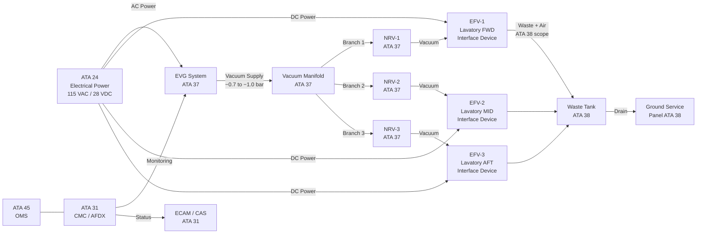
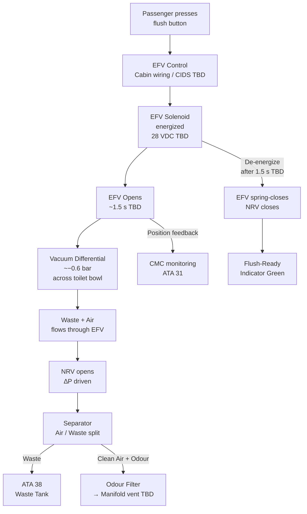
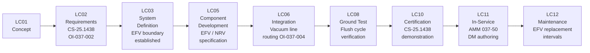

# 037-050 — Vacuum Consumers and System Interfaces
### [PROGRAMME-AIRCRAFT] [PROGRAMME-VARIANT] · ATA 37 · Q+ATLANTIDE ATLAS Scaffold

**Status:** 
**Revision:** 0.1.0 | **Created:** 2025-07-14 | **Updated:** 2025-07-14

---

## §0 Hyperlink Policy

All links in this document are relative within the Q+ATLANTIDE ATLAS repository unless explicitly marked as external. External links are informational only and do not constitute endorsement. Regulatory document links (EASA CS-25, S1000D) reference publicly available standards. Internal cross-references use relative paths from the `037_Vacuum/` node. All YAML `*_link` fields follow the same convention.

---

## §1 Purpose

This document defines the agnostic ATLAS standard-level architecture context for `037-050 — Vacuum Consumers and System Interfaces`.

It describes the controlled scope, functions, interfaces, safety considerations, lifecycle traceability, and S1000D/CSDB mapping logic that programme implementations shall instantiate when this node is applicable.

This document is not a programme design baseline. Programme-specific capacities, locations, part numbers, effectivity, operating limits, maintenance references, and data module codes shall be defined only inside the applicable programme implementation branch.
## §2 Applicability

| Applicability Level | Rule |
|---|---|
| Standard taxonomy | Applies to the ATLAS node `<NODE>` |
| Programme implementation | Conditional; determined by programme architecture, trade studies, certification basis, and applicability model |
| Product configuration | Defined in the programme-specific configuration baseline |
| Effectivity | Defined in the programme CSDB / applicability layer |
| Non-applicability | Must be explicitly stated in the programme impact-study branch when excluded |
## §3 System / Function Overview

### 3.1 Vacuum Consumer Summary

The [PROGRAMME-VARIANT] vacuum system serves **one primary consumer class**: the vacuum waste toilet system. All traditional vacuum consumers present on conventional aircraft are eliminated.

| Consumer ID | Description | ATA | Qty | Vacuum Demand | Status |
|-------------|-------------|-----|-----|---------------|--------|
| VWS-T-01 | Lavatory FWD toilet (Lavatory 1) | 37/38 | 1 |  | Planned |
| VWS-T-02 | Lavatory MID toilet (Lavatory 2) | 37/38 | 1 |  | Planned |
| VWS-T-03 | Lavatory AFT toilet (Lavatory 3) | 37/38 | 1 |  | Planned |
| GYRO-INST | Gyroscopic instruments (AI, DI, TC) | 34 | — | **NONE — ELIMINATED** | N/A |
| AP-SERVO | Autopilot vacuum servos | 22 | — | **NONE — ELIMINATED** | N/A |
| DOOR-SEAL | Door seal actuation | 52 | — | **NOT ATA 37 — TBD ATA 36** | Under review |

> **Note (OI-037-002):** The dry-flush vs. vacuum toilet decision is open. If dry-flush toilets are selected, the entire vacuum waste system (ATA 37 EVG, manifold, EFV, lines) may be eliminated. See §21.

### 3.2 Eliminated Consumers — Design Rationale

| Eliminated Consumer | Conventional Source | [PROGRAMME-VARIANT] Replacement | ATA |
|--------------------|--------------------|--------------------|-----|
| Attitude Indicator | Vacuum venturi / engine pump | ADIRU (solid-state) | 34 |
| Directional Gyro | Vacuum engine pump | ADIRU (solid-state) | 34 |
| Turn Coordinator | Vacuum venturi | ADIRU (solid-state) | 34 |
| Autopilot pitch servo | Vacuum servo | FBW electric actuator | 22 |
| Autopilot roll servo | Vacuum servo | FBW electric actuator | 22 |

---

## §4 Scope

This document covers:
- Identification of all ATA 37 vacuum consumers
- Functional interface definitions between ATA 37 and ATA 22, 24, 31, 34, 38, 45, 52
- Consumer-level requirements and interface boundary device (EFV) description
- Confirmation of eliminated consumers and design rationale
- Interface table for downstream authoring of interface control documents (ICDs)

This document does **not** cover: vacuum source (037-010), distribution (037-020), regulation (037-030), pump/valve hardware (037-040), indication (037-060), ground service (037-070), monitoring (037-080), or S1000D mapping (037-090).

---

## §5 Architecture Description

### 5.1 Vacuum Waste System Functional Boundary

The **Electrically actuated Flush Valve (EFV)** is the **interface boundary device** between ATA 37 and ATA 38:

- **Vacuum inlet side (ATA 37 scope):** EVG → SOV → manifold → NRV → EFV vacuum inlet port. Everything up to and including the EFV vacuum inlet is ATA 37 scope.
- **Waste outlet side (ATA 38 scope):** EFV waste outlet → waste transport line → separator → waste collection tank → drain valve → ground service panel. Everything from the EFV waste outlet port is ATA 38 scope.

### 5.2 Consumer Interface Description

Each toilet consumer connects to the vacuum manifold via:
1. A dedicated branch line (PTFE-lined tubing,  diameter)
2. A Non-Return Valve (NRV) to prevent back-flow between consumers
3. An EFV (solenoid-actuated, normally closed) that opens during flush cycle
4. A toilet bowl assembly with odour filter

### 5.3 Power Interface

The EVG is powered from the AC electrical bus. The EFV solenoid coils are powered from the DC bus (28 VDC TBD). Specific bus assignments are  pending electrical load analysis (ATA 24).

### 5.4 ATA 34 / ATA 22 Interface — NOT a vacuum interface

On the [PROGRAMME-VARIANT], **ATA 34 is NOT a vacuum consumer**. The ADIRU provides inertial and air data reference functions entirely via solid-state sensors (ring laser gyros, accelerometers, pitot-static). No vacuum line connection exists between ATA 37 and ATA 34.

Similarly, **ATA 22 is NOT a vacuum consumer**. The fly-by-wire flight control system uses electric actuators and no vacuum servos exist on the [PROGRAMME-VARIANT].

---

## §6 Functional Breakdown

### 6.1 Toilet Flush Cycle (per consumer)

1. Passenger activates flush (push-button or proximity sensor TBD)
2. EFV solenoid energized → EFV opens (hold time ~1.5 s TBD)
3. Vacuum differential (~−0.6 bar TBD) draws bowl contents through EFV
4. NRV opens due to differential pressure → waste + air flows to separator
5. Separator: liquid/solid waste → ATA 38 tank; clean air → manifold (odour filter)
6. EFV de-energizes → spring-return closes EFV → NRV closes
7. Flush-ready indication (green light) illuminates after EFV confirmed closed

### 6.2 Vacuum Demand Characteristics

| Parameter | Value | Notes |
|-----------|-------|-------|
| Operating vacuum | −0.7 to −1.0 bar gauge | At manifold |
| Flush vacuum at toilet | −0.6 bar TBD | After line losses |
| Flush duration | ~1.5 s TBD | EFV open time |
| Air flow per flush |  L/flush | Per flush cycle |
| Max simultaneous flushes | 1 (likely) TBD | Simultaneous flush policy TBD |
| EVG recovery time after flush |  s | Pull-down time |

---

## §7 System Context Diagram

---

## §8 Internal Functional Architecture

---

## §9 Lifecycle Traceability

---

## §10 Interfaces

| Interface ID | ATA Chapter | Direction | Signal / Media | Description | Status |
|-------------|-------------|-----------|----------------|-------------|--------|
| IF-037-050-001 | ATA 38 | Bi-directional boundary | Physical (EFV) | ATA 37 provides vacuum to EFV inlet; ATA 38 receives waste from EFV outlet | Active |
| IF-037-050-002 | ATA 24 | ATA 24 → ATA 37 | 115 VAC / 28 VDC | EVG motor power, EFV solenoid power |  bus assignment |
| IF-037-050-003 | ATA 31 | ATA 37 → ATA 31 | AFDX / ARINC 429 TBD | EVG status, manifold vacuum value, fault codes → CMC |  |
| IF-037-050-004 | ATA 45 | ATA 37 → ATA 45 | Via CMC / AFDX | OMS health data, EVG run hours, fault log |  |
| IF-037-050-005 | ATA 21 | Functional reference | N/A (no vacuum) | Lavatory ventilation / odour purge — ATA 21 scope; no vacuum connection | Reference only |
| IF-037-050-006 | ATA 34 | **NO INTERFACE** | — | ADIRU is solid-state; no vacuum gyro instruments on [PROGRAMME-VARIANT] | Eliminated |
| IF-037-050-007 | ATA 22 | **NO INTERFACE** | — | FBW electric; no vacuum autopilot servos on [PROGRAMME-VARIANT] | Eliminated |
| IF-037-050-008 | ATA 52 | Under review | TBD | Door seal actuation — may be ATA 36 (pneumatic) or electric; not ATA 37 |  |
| IF-037-050-009 | ATA 38 | ATA 37 → ATA 38 | Physical vacuum line | Waste transport lines from EFV outlet to waste tank | Active |

---

## §11 Operating Modes

| Mode ID | Mode Name | Description | EVG State | EFV State | Notes |
|---------|-----------|-------------|-----------|-----------|-------|
| OM-037-01 | Normal Flight | All lavatory facilities available, EVG running, vacuum maintained | Running (primary) | Standby (closed) | Normal operations |
| OM-037-02 | Flush Active | Passenger-initiated flush cycle in progress | Running | Open (1.5 s TBD) | Per toilet separately |
| OM-037-03 | EVG-1 Fault | Primary EVG fails; EVG-2 auto-starts | Standby active | Standby (closed) | Degraded — monitor |
| OM-037-04 | Total Vacuum Loss | Both EVGs failed or manifold vacuum loss | Off / Fault | Locked closed | CAS "VAC SYS FAULT" |
| OM-037-05 | Ground Service | Aircraft on ground, waste drain in progress | Off or test | Closed / commanded | ATA 38 scope primarily |
| OM-037-06 | Dry-Flush Fallback | If OI-037-002 resolved to dry-flush | N/A | N/A | Entire system eliminated |

---

## §12 Monitoring and Diagnostics

| Parameter | Sensor | Normal Range | Fault Threshold | CMC Response |
|-----------|--------|--------------|-----------------|--------------|
| Manifold vacuum | Pressure transducer | −0.7 to −1.0 bar gauge | < −0.5 bar: VAC LO | CAS alert, log |
| EVG motor current | Current sensor |  | > TBD A: EVG FAULT | Auto-start EVG-2 |
| EFV position | Micro-switch (TBD) | Open/Closed per command | Stuck open / stuck closed | CMC fault log |
| Waste tank level | Capacitive / float TBD | 0–75% normal | > 75% advisory, > 95% warning | CAS advisory |
| EVG outlet pressure | Pressure sensor | TBD | TBD | CMC log |

---

## §13 Maintenance Concept

- **On-condition maintenance** of EFV seals and solenoid coils (interval TBD)
- **Scheduled replacement** of odour filters (see OI-037-006 for certification interval)
- **NRV inspection** for valve leakage at scheduled maintenance (TBD interval)
- **Waste line integrity check** at C-check or equivalent
- **EFV functional test** (solenoid energize / de-energize) during ground power-up BITE
- **Line flush procedure** during lavatory service (ATA 38 AMM cross-reference)

---

## §14 S1000D / CSDB Mapping

| DM Code | Info Code | Title | Status |
|---------|-----------|-------|--------|
| DMC-<PROGRAMME>-<VARIANT>-037-50-00-00A-040A-A | 040 | Vacuum Consumers and System Interfaces — Description |  |
| DMC-<PROGRAMME>-<VARIANT>-037-50-00-00A-300A-A | 300 | EFV Inspection |  |
| DMC-<PROGRAMME>-<VARIANT>-037-50-00-00A-520A-A | 520 | EFV Removal |  |
| DMC-<PROGRAMME>-<VARIANT>-037-50-00-00A-720A-A | 720 | EFV Installation |  |
| DMC-<PROGRAMME>-<VARIANT>-037-50-00-00A-400A-A | 400 | EFV Fault Isolation |  |

---

## §15 Footprints

| Item | Value |
|------|-------|
| EFV envelope (each) |  mm × mm × mm |
| NRV envelope (each) |  mm × mm × mm |
| Vacuum line diameter |  mm (NPS TBD) |
| Odour filter size |  |
| Mass per EFV |  kg |
| Mass per NRV |  kg |
| Total ATA 37 consumer hardware mass |  kg |

---

## §16 Safety and Certification

| Requirement | Reference | Compliance Method | Status |
|-------------|-----------|-------------------|--------|
| Vacuum system plumbing integrity | CS-25.1438 | Test + Analysis |  |
| System installation correctness | CS-25.1301 | Inspection + Test |  |
| Safety assessment (FHA, FMEA) | CS-25.1309 | Analysis |  |
| Cabin air quality (odour) | AMC 25.831 | Test |  |
| EFV stuck-open failure | CS-25.1309 | FMEA — detect and alarm |  |
| Vacuum line routing through composite fuselage | CS-25.1438 | Analysis (OI-037-004) |  |

---

## §17 Verification and Validation

| V&V ID | Activity | Method | Acceptance Criteria | Status |
|--------|----------|--------|---------------------|--------|
| VV-037-050-001 | Flush cycle functional test | Ground test | EFV opens/closes per command; vacuum achieved |  |
| VV-037-050-002 | NRV back-flow prevention test | Bench test | No flow reversal under reverse differential |  |
| VV-037-050-003 | Interface boundary verification | ICD review | ATA 37 / ATA 38 boundary confirmed at EFV |  |
| VV-037-050-004 | No-gyro / no-servo confirmation | Design review | No vacuum lines to ATA 34 or ATA 22 confirmed |  |
| VV-037-050-005 | Cabin odour test | Ground / flight test | Odour level compliant with AMC 25.831 |  |

---

## §18 Glossary

| Term | Definition |
|------|-----------|
| ADIRU | Air Data Inertial Reference Unit — solid-state navigation/attitude reference, replaces vacuum gyroscopes on [PROGRAMME-VARIANT] |
| ATA 37 | Air Transport Association chapter covering Vacuum systems |
| CMC | Central Maintenance Computer — receives and logs system health data via AFDX |
| CS-25.1438 | EASA Certification Specification for pressurisation and pneumatic/vacuum system plumbing |
| EFV | Electrically actuated Flush Valve — interface boundary device between ATA 37 vacuum and ATA 38 waste |
| EVG | Electric Vacuum Generator — motor-driven vacuum pump providing system vacuum for waste toilets |
| Freeze protection | Thermal protection for vacuum waste lines in cold-soak conditions (OI-037-005) |
| Gyroscopic instruments | Traditional vacuum-driven AI, DI, TC — **eliminated on [PROGRAMME-VARIANT]** (replaced by ADIRU) |
| Manifold | Vacuum distribution header connecting EVG output to individual toilet branch lines |
| NRV | Non-Return Valve — prevents back-flow between toilet branches on the vacuum manifold |
| Odour filter | Activated carbon or equivalent filter on manifold vent line (OI-037-006 for certification interval) |
| PTFE | Polytetrafluoroethylene — lining material for vacuum waste tubing for chemical resistance |
| SOV | Shutoff Valve — solenoid-operated valve between EVG and manifold |
| Vacuum transducer | Pressure sensor measuring manifold vacuum level, feeding CMC monitoring |
| VRV | Vacuum Relief Valve — limits maximum vacuum on manifold to prevent over-pressure damage |
| VWS | Vacuum Waste System — the complete system including EVG, manifold, EFV, NRV, and connections to ATA 38 |
| VWS boundary | EFV device: vacuum inlet side = ATA 37; waste outlet side = ATA 38 |
| Waste tank | Waste collection vessel — ATA 38 scope; receives waste from EFV outlets |

---

## §19 Citations

1. EASA CS-25 Amendment 27 (TBD), Subpart F, §25.1438 — Pressurisation and pneumatic systems
2. EASA CS-25 §25.1301 — Function and installation
3. EASA CS-25 §25.1309 — Equipment, systems and installations
4. EASA AMC 25.831 — Ventilation requirements
5. ATA iSpec 2200 Chapter 37 — Vacuum
6. ATA iSpec 2200 Chapter 38 — Water/Waste
7. S1000D Issue 5.0 — International specification for technical publications

---

## §20 References

| Ref | Document | Link |
|-----|----------|------|
| R-037-001 | 037-000 Vacuum General | [037-000](./037-000-Vacuum-General.md) |
| R-037-002 | 037-010 Vacuum Sources (EVG) | [037-010](./037-010-Vacuum-Sources.md) |
| R-037-003 | 037-020 Vacuum Distribution | [037-020](./037-020-Vacuum-Distribution.md) |
| R-037-004 | 037-030 Vacuum Regulation | [037-030](./037-030-Vacuum-Regulation-and-Shutoff.md) |
| R-037-005 | 037-040 Valves and Lines | [037-040](./037-040-Vacuum-Pumps-Ejectors-Valves-and-Lines.md) |
| R-037-006 | 037-060 Indication and Warning | [037-060](./037-060-Vacuum-System-Indication-and-Warning.md) |
| R-037-007 | ATA 38 Water/Waste (sibling) | Separate ATLAS node |

---

## §21 Open Issues

| OI ID | Description | Owner | Priority | Status |
|-------|-------------|-------|----------|--------|
| OI-037-001 | EVG count and sizing (primary + standby quantity and capacity TBD) | Systems Eng | HIGH |  |
| OI-037-002 | Dry-flush vs. vacuum toilet decision — if dry-flush selected, ATA 37 may be voided | Chief Architect | CRITICAL |  |
| OI-037-003 | Waste tank material and capacity (CFRP vs. stainless steel; volume TBD) | Structures | MEDIUM |  |
| OI-037-004 | Vacuum line routing through composite fuselage — penetration and attachment design | Structures | HIGH |  |
| OI-037-005 | Freeze protection for waste lines — heater tapes, insulation, or routing strategy | Systems Eng | MEDIUM |  |
| OI-037-006 | Odour filter certification and replacement interval — regulatory acceptance TBD | Certification | MEDIUM |  |
| OI-037-007 | Ground waste drain panel location — lower aft fuselage, port side TBD; accessibility | Cabin / Ground Ops | LOW |  |

---

## §22 Change Log

| Rev | Date | Author | Description |
|-----|------|--------|-------------|
| 0.1.0 | 2025-07-14 | AI-assisted scaffold | Initial scaffold — all §0–§22 sections populated; all values TBD pending OI resolution |

---
*Q+ATLANTIDE ATLAS — ATA 37 Vacuum — 037-050 Consumers and System Interfaces — [PROGRAMME-AIRCRAFT] [PROGRAMME-VARIANT]*
*Classification: UNCLASSIFIED — ENGINEERING SCAFFOLD*
