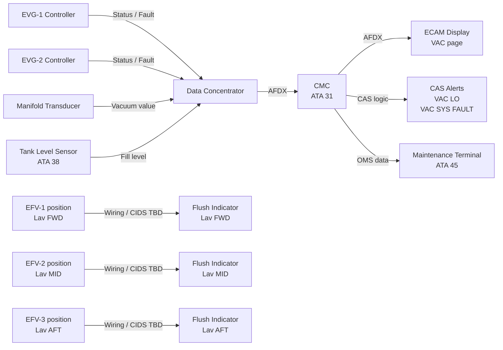
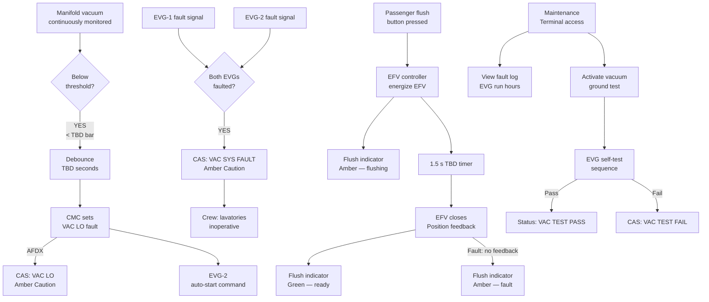
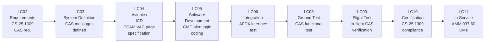

# 037-060 — Vacuum System Indication and Warning
### AMPEL360e eWTW · ATA 37 · Q+ATLANTIDE ATLAS Scaffold

**Status:** 
**Revision:** 0.1.0 | **Created:** 2025-07-14 | **Updated:** 2025-07-14

---

## §0 Hyperlink Policy

All links in this document are relative within the Q+ATLANTIDE ATLAS repository unless explicitly marked as external. External links are informational only and do not constitute endorsement. Regulatory document links (EASA CS-25, S1000D) reference publicly available standards. Internal cross-references use relative paths from the `037_Vacuum/` node. All YAML `*_link` fields follow this convention.

---

## §1 Purpose

This document defines the **indication and warning architecture** for the ATA 37 Vacuum System on the AMPEL360e eWTW aircraft. It covers cockpit Crew Alerting System (CAS) messages, ECAM vacuum system page content, lavatory flush-ready indication, maintenance terminal access, and the signal chain from vacuum system sensors to the ECAM display.

**Key design note:** The eWTW vacuum system serves only the lavatory waste toilets. There are no vacuum gauge instruments for flight (no vacuum gyros — ADIRU is solid-state). The vacuum indication suite is therefore **minimal** compared to a conventional aircraft, focused on fault detection rather than continuous cockpit monitoring.

---

## §2 Applicability

| Item | Value |
|------|-------|
| Aircraft Programme | AMPEL360e eWTW |
| ATA Chapter | 37 — Vacuum |
| Subsubject | 037-60 — Indication and Warning |
| Certification Basis | CS-25 Amendment 27 (TBD) |
| Applicable Standards | CS-25.1438, CS-25.1301, CS-25.1309, AMC 25.831 |
| Revision Status |  |
| Configuration | ~100-pax single-aisle electric |

---

## §3 System / Function Overview

### 3.1 CAS Alert Summary

The following Crew Alerting System messages are defined for ATA 37:

| CAS Message | Level | Condition | Flight Phase Inhibition | Crew Action |
|-------------|-------|-----------|------------------------|-------------|
| VAC SYS FAULT | AMBER (Caution) | Both EVGs failed, or manifold vacuum not achieved within TBD s of start | T/O roll, landing roll | Refer to ECAM procedure; both lavatories inoperative; advise cabin crew |
| VAC LO | AMBER (Caution) | Manifold vacuum < −0.5 bar gauge (TBD threshold) | T/O roll, landing roll | Check EVG status on ECAM; if EVG-2 not started, initiate manually TBD |
| WASTE TANK FULL | AMBER (Caution) | Waste tank fill level > 95% (TBD) | None (advisory in cruise) | Advise cabin crew; limit lavatory use; plan expedited ground service |
| WASTE TANK HI | ADVISORY | Waste tank fill level > 75% (TBD) | None | Cabin crew awareness; normal operation permitted |
| VAC TEST PASS | STATUS (green) | Ground self-test completed successfully | Ground only | None — maintenance record |
| VAC TEST FAIL | AMBER (Caution) | Ground self-test failed | Ground only | Refer to maintenance terminal for fault detail |

> **Note:** CAS message text, levels, and thresholds are  pending CAS design review with avionics supplier. The table above represents the planned concept.

### 3.2 ECAM System Page — Vacuum (VAC)

The vacuum system ECAM page (page format TBD) displays:

| Display Element | Source | Normal State | Fault State |
|----------------|--------|--------------|-------------|
| EVG-1 STATUS | EVG-1 controller | ON (green) | FAULT (amber) |
| EVG-2 STATUS | EVG-2 controller | STBY (white) | ON/FAULT as applicable |
| MANIFOLD VAC | Manifold transducer | −0.7 to −1.0 bar (green) | LO (amber) |
| WASTE TANK 1 | Level sensor (ATA 38) | 0–74% (white bar) | HI (amber) / FULL (amber) |
| LAVATORY STATUS | EFV position signals | READY ×3 (green) | FAULT (amber per lavatory) |

> **Note (design intent):** Vacuum system is a utility/comfort system. No vacuum indication is required on the primary flight display. ECAM page is accessed via the SYSTEM page selection — not a persistent full-time display.

### 3.3 Lavatory Flush Indicator

Each lavatory toilet has a local flush indicator:

| Indicator | Colour | Meaning |
|-----------|--------|---------|
| FLUSH READY | Green | Vacuum available; EFV functional; ready for flush |
| FLUSHING | Amber (momentary) | EFV open, flush cycle active |
| FAULT | Amber (steady) | EFV fault or vacuum unavailable |

Indicator drive: direct wiring from EFV controller, or via CIDS (Cabin Intercommunication Data System) —  architecture decision.

---

## §4 Scope

This document covers:
- CAS alert definitions (message, level, condition, inhibition, crew action)
- ECAM vacuum system page content
- Lavatory flush-ready indicator specification
- Signal chain from vacuum system sensors to ECAM and CAS
- Maintenance terminal vacuum indication and access
- AFDX interface between EVG controller and CMC / ECAM (ATA 37 signal generation scope)

This document does **not** cover: display system hardware (ATA 31), CMC hardware (ATA 45), AFDX network infrastructure (ATA 42), or vacuum source/distribution hardware (037-010 through 037-040).

---

## §5 Architecture Description

### 5.1 Indication Signal Chain

```
EVG-1 Controller ──┐
EVG-2 Controller ──┤
Manifold Transducer ─┤─→ Data Concentrator ──→ AFDX Bus ──→ CMC ──→ ECAM / CAS
Tank Level Sensor ──┘                                            └──→ Maintenance Terminal
EFV Position Fdbk ──→ Cabin wiring / CIDS ──→ Flush Indicator (local)
```

### 5.2 CAS Alert Generation Logic

1. **VAC LO:** Manifold transducer reads < TBD bar. CMC receives AFDX frame with vacuum value. CMC compares to threshold. CAS alert generated if threshold exceeded for > TBD seconds (debounce TBD).
2. **VAC SYS FAULT:** EVG-1 fault signal AND EVG-2 fault signal both active simultaneously. OR: manifold vacuum not recovered within TBD seconds after EVG-2 auto-start.
3. **WASTE TANK FULL / HI:** Tank level signal from ATA 38 level sensor, routed via CMC to CAS.

### 5.3 Maintenance Terminal Interface

Maintenance staff access the vacuum system via the maintenance terminal (ATA 45 OMS):
- EVG-1 / EVG-2 run hours (total and since last reset)
- Last 64 fault events (fault code, timestamp) — TBD log depth
- Last ground service date
- Vacuum system test activation (manual trigger)
- EVG manual start/stop (maintenance mode only, with safety interlock)
- SOV open/close command (maintenance mode)
- Fault log clear (authorized personnel only, with audit trail)

### 5.4 No Bleed Valve Indication

The eWTW has no bleed air system (ATA 36). Therefore, no bleed valve indication is associated with ATA 37. Any conventional aircraft indication items referencing "bleed valve — vacuum" are eliminated.

---

## §6 Functional Breakdown

### 6.1 Indication Functions

| Function ID | Function Name | Description | Implementation |
|-------------|--------------|-------------|----------------|
| IND-037-01 | EVG status display | Show EVG-1 and EVG-2 run/standby/fault state | ECAM VAC page |
| IND-037-02 | Manifold vacuum display | Show current manifold vacuum value | ECAM VAC page |
| IND-037-03 | Lavatory flush-ready | Per-lavatory flush-ready indicator | Local indicator light |
| IND-037-04 | Waste tank level | Show waste tank fill percentage | ECAM VAC page (ATA 38 data) |
| IND-037-05 | CAS VAC LO | Alert crew to low vacuum condition | CAS amber caution |
| IND-037-06 | CAS VAC SYS FAULT | Alert crew to total vacuum system failure | CAS amber caution |
| IND-037-07 | Maintenance data | EVG run hours, fault log, test activation | Maintenance terminal |
| IND-037-08 | Ground test status | Pass/fail of vacuum ground self-test | CAS status / maintenance terminal |

---

## §7 System Context Diagram



---

## §8 Internal Functional Architecture



---

## §9 Lifecycle Traceability



---

## §10 Interfaces

| Interface ID | ATA Chapter | Direction | Signal / Media | Description |
|-------------|-------------|-----------|----------------|-------------|
| IF-037-060-001 | ATA 31 (CMC) | ATA 37 → ATA 31 | AFDX | EVG status, vacuum value, fault codes to CMC for CAS generation |
| IF-037-060-002 | ATA 31 (ECAM) | ATA 31 → crew | Display | ECAM VAC page rendering — ATA 31 scope for display hardware |
| IF-037-060-003 | ATA 45 (OMS) | ATA 37 → ATA 45 | Via CMC | EVG run hours, fault log, test results to maintenance terminal |
| IF-037-060-004 | ATA 38 | ATA 38 → ATA 37/CMC | AFDX | Waste tank level data for ECAM display and WASTE TANK FULL alert |
| IF-037-060-005 | Cabin (CIDS TBD) | ATA 37 → lavatory | Wiring / CIDS | EFV position → flush-ready indicator (green/amber) |
| IF-037-060-006 | ATA 42 | ATA 37 ↔ ATA 42 | AFDX network | Data bus infrastructure for all AFDX frames (ATA 42 network scope) |

---

## §11 Operating Modes

| Mode | ECAM VAC Page | CAS Active | Flush Indicator | Maintenance Terminal |
|------|---------------|------------|-----------------|---------------------|
| Normal — EVG-1 running | EVG-1: ON, EVG-2: STBY, VAC: normal | None | Green per lavatory | Normal data available |
| EVG-1 fault — EVG-2 running | EVG-1: FAULT, EVG-2: ON | None (degraded, not caution if VAC maintained) | Green per lavatory | Fault logged |
| VAC LO (vacuum below threshold) | VAC: LO (amber) | VAC LO (amber) | Amber (FAULT) | CAS + fault logged |
| VAC SYS FAULT (both EVGs) | EVG-1: FAULT, EVG-2: FAULT | VAC SYS FAULT (amber) | Amber (FAULT) all | Fault logged; EVG run data |
| Flush active (per toilet) | No change | None | Amber momentary → Green | N/A during flush |
| Ground test mode | TEST ACTIVE | None during test | N/A | Test results displayed |
| Ground self-test pass | VAC: normal | VAC TEST PASS (status) | Green (ready) | Pass logged |
| Ground self-test fail | VAC: FAULT | VAC TEST FAIL (amber) | Amber | Fault code displayed |

---

## §12 Monitoring and Diagnostics

### 12.1 Monitored Parameters and Alert Logic

| Parameter | Sensor Location | Normal Range | Low Threshold | Fault Threshold | CAS Message | Inhibition |
|-----------|----------------|--------------|---------------|-----------------|-------------|------------|
| Manifold vacuum | Manifold assembly | −0.7 to −1.0 bar | < −0.5 bar | < −0.3 bar | VAC LO / VAC SYS FAULT | T/O roll, landing roll |
| EVG-1 motor current | EVG-1 controller | TBD A nominal | TBD | TBD (over/under current) | VAC SYS FAULT | TBD |
| EVG-2 motor current | EVG-2 controller | TBD A nominal | TBD | TBD | VAC SYS FAULT | TBD |
| EVG outlet pressure | EVG outlet port | TBD | TBD | TBD | VAC SYS FAULT | TBD |
| Waste tank fill level | Tank — ATA 38 | 0–74% | — | > 75% advisory, > 95% caution | WASTE TANK HI / FULL | None |
| EFV position (×3) | Each EFV | Open / Closed per command | Stuck-open | Stuck-closed | LAV FAULT TBD | TBD |
| Vacuum line temperature | TBD sensor | > 0°C | < 5°C advisory | < 0°C alarm | FREEZE RISK TBD | Ground only TBD |

### 12.2 Diagnostic Data Available at Maintenance Terminal

| Data Item | Update Rate | Retention |
|-----------|-------------|-----------|
| EVG-1 run hours | Continuous | Non-volatile (NVM) |
| EVG-2 run hours | Continuous | Non-volatile (NVM) |
| Last 64 fault events (code + timestamp) | On event | NVM, clearable |
| Last ground test result and timestamp | On test | NVM |
| Manifold vacuum min/max log (rolling 100-hr TBD) | 1 Hz TBD | NVM rolling |
| Last waste drain service timestamp | On reset | NVM |

---

## §13 Maintenance Concept

- **CAS functional test** during line maintenance: BITE activation verifies CAS message generation for VAC LO and VAC SYS FAULT conditions
- **ECAM page verification** during functional check flight (FCF) or ground check: confirm VAC page renders correctly and displays live vacuum value
- **Flush indicator lamp check**: visual check at each lavatory as part of cabin readiness check (pre-flight TBD)
- **Fault log review**: maintenance terminal access for troubleshooting; fault codes cross-referenced to AMM FI (fault isolation) DMs (info code 400)
- **CMC software update**: via OMS standard load process — ATA 45 scope

---

## §14 S1000D / CSDB Mapping

| DM Code | Info Code | Title | Status |
|---------|-----------|-------|--------|
| DMC-AMPEL360E-EWTW-037-60-00-00A-040A-A | 040 | Vacuum Indication and Warning — Description |  |
| DMC-AMPEL360E-EWTW-037-60-00-00A-300A-A | 300 | CAS Alert and ECAM Page Functional Check |  |
| DMC-AMPEL360E-EWTW-037-60-00-00A-400A-A | 400 | VAC LO / VAC SYS FAULT Fault Isolation |  |

---

## §15 Footprints

| Item | Value |
|------|-------|
| Flush indicator lamp (each) |  mm × mm, LED type TBD |
| Manifold transducer |  dimensions |
| CMC software module size |  kB (ATA 45 estimate) |
| AFDX bandwidth (ATA 37 indication) |  kbps |
| Wiring mass (indication wiring) |  kg |

---

## §16 Safety and Certification

| Requirement | Reference | Compliance Method | Status |
|-------------|-----------|-------------------|--------|
| Equipment and systems (indication) | CS-25.1301 | Inspection + Test |  |
| Safety assessment — indication failures | CS-25.1309 | FMEA: failure of indication to alert crew |  |
| CAS message format and priority | CS-25 AMJ25.1322 TBD | Design review |  |
| Vacuum system integrity | CS-25.1438 | Test + Analysis |  |
| Crew workload — alert management | CS-25.1309 + HF assessment | HF evaluation |  |
| False alert prevention (debounce) | CS-25.1309 | Analysis |  |

**Safety assessment note:** Failure of the vacuum indication system (unable to warn crew of vacuum loss) is classified as a hazard at the system level. The consequence is that lavatories may be used without functional vacuum — a cabin service impact, not a flight safety impact. Hazard classification: Minor (TBD — subject to FHA review).

---

## §17 Verification and Validation

| V&V ID | Activity | Method | Acceptance Criteria | Status |
|--------|----------|--------|---------------------|--------|
| VV-037-060-001 | CAS VAC LO functional test | Ground test | Alert generated when vacuum < threshold |  |
| VV-037-060-002 | CAS VAC SYS FAULT test | Ground test (simulated) | Alert generated on dual EVG fault |  |
| VV-037-060-003 | ECAM VAC page rendering | Ground test | All data elements displayed correctly |  |
| VV-037-060-004 | Flush indicator functional test | Ground test | Green → Amber → Green per flush cycle |  |
| VV-037-060-005 | CAS inhibition test | Ground test | Alert inhibited during T/O roll and landing roll |  |
| VV-037-060-006 | Maintenance terminal data validation | Ground test | All parameters readable; fault log accurate |  |

---

## §18 Glossary

| Term | Definition |
|------|-----------|
| ADIRU | Air Data Inertial Reference Unit — solid-state; replaces vacuum gyros on eWTW |
| ATA 37 | Air Transport Association chapter for Vacuum systems |
| CAS | Crew Alerting System — integrated flight deck alert display |
| CIDS | Cabin Intercommunication Data System — manages cabin information and possibly lavatory indicator wiring |
| CMC | Central Maintenance Computer — collects system health data via AFDX |
| CS-25.1438 | EASA CS for vacuum/pneumatic plumbing integrity |
| DEBOUNCE | Time delay applied to a sensor reading before triggering an alert, to prevent nuisance alarms |
| ECAM | Electronic Centralized Aircraft Monitor — displays system status pages and CAS messages |
| EFV | Electrically actuated Flush Valve — interface boundary device between ATA 37 and ATA 38 |
| EVG | Electric Vacuum Generator — motor-driven vacuum pump |
| Freeze protection | Thermal protection for waste lines (OI-037-005) |
| Gyroscopic instruments | Vacuum-driven AI, DI, TC — **eliminated on eWTW** (ADIRU used) |
| Manifold | Vacuum distribution header |
| NRV | Non-Return Valve — prevents back-flow between toilet branches |
| NVM | Non-Volatile Memory — retains data after power loss |
| Odour filter | Activated carbon filter on manifold vent |
| OMS | On-board Maintenance System (ATA 45) |
| PTFE | Polytetrafluoroethylene — vacuum line lining material |
| SOV | Shutoff Valve — solenoid-operated valve between EVG and manifold |
| Vacuum transducer | Pressure sensor measuring manifold vacuum |
| VRV | Vacuum Relief Valve — limits maximum system vacuum |
| VWS | Vacuum Waste System |
| Waste tank | Waste collection vessel (ATA 38 scope) |

---

## §19 Citations

1. EASA CS-25 Amendment 27 (TBD), §25.1438 — Pressurisation and pneumatic systems
2. EASA CS-25 §25.1309 — Equipment, systems and installations
3. EASA CS-25 §25.1301 — Function and installation
4. AMC 25.831 — Ventilation
5. ATA iSpec 2200 Chapter 37 — Vacuum
6. ATA iSpec 2200 Chapter 31 — Indicating/Recording Systems
7. S1000D Issue 5.0

---

## §20 References

| Ref | Document | Link |
|-----|----------|------|
| R-060-001 | 037-000 Vacuum General | [037-000](./037-000-Vacuum-General.md) |
| R-060-002 | 037-010 Vacuum Sources (EVG) | [037-010](./037-010-Vacuum-Sources.md) |
| R-060-003 | 037-050 Consumers and Interfaces | [037-050](./037-050-Vacuum-Consumers-and-System-Interfaces.md) |
| R-060-004 | 037-080 Monitoring and Diagnostics | [037-080](./037-080-Vacuum-Monitoring-Diagnostics-and-Control-Interfaces.md) |
| R-060-005 | ATA 31 Indicating/Recording Systems | Separate ATLAS node |
| R-060-006 | ATA 45 OMS | Separate ATLAS node |

---

## §21 Open Issues

| OI ID | Description | Owner | Priority | Status |
|-------|-------------|-------|----------|--------|
| OI-037-001 | EVG count and sizing — impacts number of status elements on ECAM VAC page | Systems Eng | HIGH |  |
| OI-037-002 | Dry-flush vs. vacuum toilet — if dry-flush, ATA 37 indication eliminated | Chief Architect | CRITICAL |  |
| OI-037-003 | Waste tank material and capacity — affects tank level sensor type and thresholds | Structures | MEDIUM |  |
| OI-037-004 | Vacuum line routing — affects sensor placement for manifold transducer | Structures | HIGH |  |
| OI-037-005 | Freeze protection — freeze alarm threshold and sensor placement TBD | Systems Eng | MEDIUM |  |
| OI-037-006 | Odour filter certification — may require maintenance alert if not tracked by CMC | Certification | MEDIUM |  |
| OI-037-007 | Ground service panel location — does not directly affect cockpit indication | Ground Ops | LOW |  |

---

## §22 Change Log

| Rev | Date | Author | Description |
|-----|------|--------|-------------|
| 0.1.0 | 2025-07-14 | AI-assisted scaffold | Initial scaffold — §0–§22 populated; CAS messages, ECAM page, flush indicators defined as concept; all thresholds TBD |

---
*Q+ATLANTIDE ATLAS — ATA 37 Vacuum — 037-060 Indication and Warning — AMPEL360e eWTW*
*Classification: UNCLASSIFIED — ENGINEERING SCAFFOLD*
