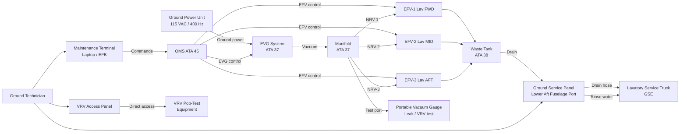
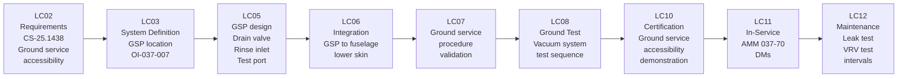

# 037-070 — Vacuum Ground Service and Test Interfaces
### AMPEL360e eWTW · ATA 37 · Q+ATLANTIDE ATLAS Scaffold

**Status:** 
**Revision:** 0.1.0 | **Created:** 2025-07-14 | **Updated:** 2025-07-14

---

## §0 Hyperlink Policy

All links in this document are relative within the Q+ATLANTIDE ATLAS repository unless explicitly marked as external. External links are informational only and do not constitute endorsement. Regulatory document links (EASA CS-25, S1000D) reference publicly available standards. Internal cross-references use relative paths from the `037_Vacuum/` node.

---

## §1 Purpose

This document defines the **ground service and ground test interfaces** for the ATA 37 Vacuum System on the AMPEL360e eWTW. It covers the waste drain ground service procedure, the ground service panel design concept, the vacuum system ground test sequence (including VRV pop-test and vacuum decay leak test), and the interfaces between the aircraft vacuum system and ground support equipment (GSE).

**Key focus:** Efficient turn-around lavatory servicing and maintainable vacuum system integrity verification on the ground.

---

## §2 Applicability

| Item | Value |
|------|-------|
| Aircraft Programme | AMPEL360e eWTW |
| ATA Chapter | 37 — Vacuum |
| Subsubject | 037-70 — Ground Service and Test Interfaces |
| Certification Basis | CS-25 Amendment 27 (TBD) |
| Applicable Standards | CS-25.1438, CS-25.1301, CS-25.1309 |
| Revision Status |  |
| Configuration | ~100-pax single-aisle electric |

---

## §3 System / Function Overview

### 3.1 Ground Service Operations Summary

| Service Operation | Type | Frequency | Duration (est.) | Actor | Status |
|-------------------|------|-----------|-----------------|-------|--------|
| Waste tank drain | Mandatory per turn | Every turnaround | ~5 min TBD | Ground servicer |  |
| Waste line rinse | Scheduled | Per operator schedule TBD | ~3 min TBD | Ground servicer |  |
| Vacuum system functional test | Scheduled maintenance | Per maintenance plan TBD | ~20 min TBD | Maintenance tech |  |
| VRV pop-test | Scheduled maintenance | Per maintenance plan TBD | ~10 min TBD | Maintenance tech |  |
| Vacuum decay leak test | Scheduled or on-condition | After line repair or schedule | ~30 min TBD | Maintenance tech |  |
| Odour filter replacement | Scheduled | Per certification interval (OI-037-006) | ~15 min TBD | Maintenance tech |  |
| EVG replacement | On-condition / scheduled | On failure or interval TBD | ~60 min TBD | Maintenance tech |  |

### 3.2 Ground Service Panel (GSP) Description

The Ground Service Panel is located on the **lower aft fuselage, port side** (TBD — see OI-037-007). It provides access points for:

| Panel Element | Description | Colour Code | Status |
|--------------|-------------|-------------|--------|
| Waste drain valve | Quarter-turn manual or electric actuated (TBD) |  |  |
| Drain hose coupling | Standard aircraft lavatory coupling |  |  |
| Rinse water inlet | Potable water connection for line flush | Blue cap |  |
| Panel vent | Pressure equalization / odour vent | — |  |
| Overflow indicator | Visual indicator if tank > 95% | Red flag / LED TBD |  |
| Vacuum test port | Access point for vacuum decay test gauge |  |  |

---

## §4 Scope

This document covers:
- Ground service panel design concept and location
- Waste drain procedure (per-turn lavatory service)
- Vacuum system ground test procedures (functional, VRV, leak test)
- GSE interface (lavatory service truck, ground power, test equipment)
- Safety precautions for ground servicers
- Maintenance concept for all ground-accessible vacuum system components

This document does **not** cover: airborne vacuum system operation (037-010 through 037-060), in-flight monitoring (037-080), or S1000D mapping (037-090).

---

## §5 Architecture Description

### 5.1 Ground Service Panel Design Concept

The Ground Service Panel (GSP) is a single integrated panel on the lower aft fuselage providing all lavatory ground service access points. Design objectives:

- **Single-point service:** Ground servicer connects one drain hose and one rinse water connection — no multiple access panels
- **Fail-safe drain:** Drain valve requires positive action (hose connect + valve open) to prevent inadvertent release
- **Overflow protection:** Waste tank level sensor triggers overflow warning indicator on GSP before tank reaches 100%
- **Visual clarity:** Colour coding and labels follow IATA ground handling standards (TBD)

### 5.2 Vacuum System Test Interface

The vacuum system is testable on ground power without aircraft engines. Ground test access includes:
- EVG activation via maintenance terminal (ATA 45 scope)
- Manifold vacuum test port on GSP (vacuum gauge connect)
- EFV individual activation (flush cycle simulation) via maintenance terminal
- VRV access for pop-test (direct access panel TBD location)

### 5.3 Ground Support Equipment Interface

| GSE Type | Standard | Purpose | Notes |
|----------|----------|---------|-------|
| Lavatory service truck | IATA AHM standard TBD | Waste drain and rinse | Vacuum/pressure drain type TBD |
| Ground electrical power unit | 115 VAC / 400 Hz TBD | EVG power for ground test | Standard aircraft GPU |
| Portable vacuum gauge | 0 to −1.5 bar, accuracy ±0.01 bar TBD | Vacuum decay leak test | Connects to test port on GSP |
| Calibrated timer | — | Vacuum decay timing | Test duration ~5 min TBD |
| Maintenance laptop | — | Maintenance terminal access | Via EFB or dedicated port TBD |

---

## §6 Functional Breakdown

### 6.1 Waste Drain Procedure (Concept)

> **Note:** Detailed step-by-step AMM procedure will be authored as S1000D DM. The following is the functional concept.

1. Position lavatory service truck adjacent to GSP (port side aft lower fuselage)
2. Verify drain hose is undamaged and coupling is clean
3. Connect drain hose to waste drain coupling on GSP
4. **Verify hose connected before opening valve** (safety requirement)
5. Open waste drain valve (quarter-turn or electric command via GSP panel)
6. Allow waste tank to drain completely (gravity or assisted suction TBD)
7. Verify tank empty (level indicator on panel reads 0%)
8. Connect rinse water line to rinse inlet on GSP
9. Open rinse valve → flush rinse water through waste lines and tank (~3 min TBD)
10. Close rinse valve, allow rinse water to drain
11. Close waste drain valve
12. Disconnect rinse water line
13. Disconnect drain hose
14. Cap all connections
15. Close and secure GSP panel
16. Record service in aircraft technical log

### 6.2 Vacuum System Functional Test Procedure (Concept)

1. Ensure aircraft on ground power (GPU connected)
2. Connect maintenance terminal to aircraft (EFB / maintenance port)
3. Access OMS → ATA 37 → Vacuum System Test
4. Command EVG-1 start (maintenance mode)
5. Monitor vacuum pull-down on maintenance terminal: vacuum should reach ≥ −0.7 bar within TBD seconds
6. Record pull-down time (trend data for OMS)
7. Simulate flush cycle (Toilet 1): command EFV-1 open via maintenance terminal → verify NRV-1 opens → EFV-1 closes → verify flush indicator Green
8. Repeat for EFV-2 and EFV-3
9. Monitor manifold vacuum recovery after each flush cycle (recovery time TBD)
10. Command EVG-1 stop; command EVG-2 start → repeat pull-down check
11. Record all results → pass/fail logged in CMC

### 6.3 VRV Pop-Test Procedure (Concept)

1. Access VRV directly (access panel TBD location — likely manifold area)
2. Connect calibrated vacuum source to manifold test port
3. Apply increasing vacuum until VRV opens (pop pressure TBD — nominally −1.0 bar TBD)
4. Record pop pressure; verify within acceptance limits (±TBD bar)
5. Reduce vacuum; verify VRV re-seats (closes) at re-seat pressure TBD
6. Leak test VRV seat after re-seat (no leakage at operating vacuum TBD)
7. Record result in technical log

### 6.4 Vacuum Decay Leak Test Procedure (Concept)

> **Purpose:** Verify vacuum line system integrity after maintenance (line repair, component replacement).

1. Ensure all EFVs are closed (default spring-closed state)
2. Ensure SOV is closed (isolate EVG from manifold for test)
3. Connect portable vacuum gauge to manifold test port
4. Apply vacuum to manifold via test equipment: draw to −0.6 bar TBD
5. Isolate test vacuum source (close test port valve)
6. Monitor vacuum for 5 minutes TBD
7. Acceptable decay: < TBD mbar/min (acceptance criterion TBD)
8. Excess decay: locate leak by ultrasonic detector or soap test on joints
9. Record result — pass: return to service. Fail: repeat after repair.

---

## §7 System Context Diagram

---

## §8 Internal Functional Architecture

```mermaid
flowchart TB
    GND_SVC[Ground Service\nStart] --> HOSE_CONN[Connect drain\nhose to GSP]
    HOSE_CONN --> VALVE_OPEN[Open drain\nvalve]
    VALVE_OPEN --> DRAIN[Tank drains\nto service truck]
    DRAIN --> RINSE_CONN[Connect rinse\nwater line]
    RINSE_CONN --> RINSE_FLUSH[Flush rinse water\nthrough lines ~3 min TBD]
    RINSE_FLUSH --> RINSE_DRAIN[Rinse water\ndrains]
    RINSE_DRAIN --> VALVE_CLS[Close drain\nvalve]
    VALVE_CLS --> DISC[Disconnect hose\nand water line]
    DISC --> LOG_SVC[Log service\nin tech record]

    VAC_TEST[Vacuum System\nTest Start] --> GPU_ON[Connect GPU\n115 VAC]
    GPU_ON --> EVG1_STR[Start EVG-1\nvia maintenance terminal]
    EVG1_STR --> PULLDOWN[Monitor vacuum\npull-down < TBD s]
    PULLDOWN --> FLUSH_SIM[Simulate flush\nEFV-1 / 2 / 3]
    FLUSH_SIM --> RECOVERY[Monitor vacuum\nrecovery per flush]
    RECOVERY --> EVG1_STP[Stop EVG-1\nStart EVG-2]
    EVG1_STP --> EVG2_CHK[EVG-2 pull-down\ncheck]
    EVG2_CHK --> LOG_TEST[Log test results\npass/fail CMC]

    LEAK_TEST[Leak Test\nStart] --> SOV_CLS[Close SOV\nisolate EVG]
    SOV_CLS --> GAUGE_CONN[Connect portable\nvacuum gauge to test port]
    GAUGE_CONN --> DRAW_VAC[Draw manifold to\n−0.6 bar TBD]
    DRAW_VAC --> ISOLATE[Isolate test source\nclose test valve]
    ISOLATE --> MONITOR[Monitor 5 min TBD]
    MONITOR --> DECAY_CHK{Decay <\nTBD mbar/min?}
    DECAY_CHK -->|PASS| RTN_SVC[Return to service]
    DECAY_CHK -->|FAIL| LOCATE[Locate leak\nultrasonic / soap test]
    LOCATE --> REPAIR[Repair and retest]
```

---

## §9 Lifecycle Traceability

---

## §10 Interfaces

| Interface ID | ATA Chapter | Direction | Description | Status |
|-------------|-------------|-----------|-------------|--------|
| IF-037-070-001 | ATA 38 | ATA 37 ↔ ATA 38 | Waste tank drain valve — ATA 37 provides vacuum supply; ATA 38 owns tank and drain valve | Active |
| IF-037-070-002 | ATA 45 | ATA 37 ← ATA 45 | OMS maintenance terminal commands — EVG start/stop, EFV activate, fault log access |  |
| IF-037-070-003 | ATA 24 | ATA 24 → ATA 37 | Ground power (GPU) for EVG operation during ground test |  |
| IF-037-070-004 | GSE | Aircraft → GSE | Drain hose coupling interface — standard lavatory coupling TBD |  |
| IF-037-070-005 | GSE | Aircraft → GSE | Rinse water connection — potable water standard coupling |  |
| IF-037-070-006 | Test equipment | Aircraft → GSE | Vacuum test port — portable gauge connection during leak test |  |

---

## §11 Operating Modes

| Mode ID | Mode Name | Description | EVG State | EFV State | SOV State |
|---------|-----------|-------------|-----------|-----------|-----------|
| OM-037-GS-01 | Ground Service — Drain | Waste tank drain in progress | Off | Closed | Closed |
| OM-037-GS-02 | Ground Service — Rinse | Waste line rinse in progress | Off | Closed | Closed |
| OM-037-GT-01 | Ground Test — Functional | EVG activated for vacuum functional test | Running (commanded) | Commanded open/close | Open |
| OM-037-GT-02 | Ground Test — VRV | VRV pop-test in progress | Off | Closed | Closed |
| OM-037-GT-03 | Ground Test — Leak | Vacuum decay leak test in progress | Off | Closed | **Closed** (SOV isolates EVG) |
| OM-037-GT-04 | Ground Test — EFV | Individual EFV activation test | Running | One open at a time | Open |
| OM-037-GT-05 | BITE — Auto | Power-up self-test (automatic) | Running (brief) | Closed | Open |

---

## §12 Monitoring and Diagnostics

### 12.1 Ground Test Monitoring

| Test Parameter | Measurement Method | Acceptance Criterion | Fault Indication |
|---------------|-------------------|---------------------|-----------------|
| EVG pull-down time | Maintenance terminal (manifold transducer) | < TBD seconds to −0.7 bar | Fail if > TBD s |
| Manifold vacuum level | Portable gauge / transducer | −0.7 to −1.0 bar at steady state | Fail if < −0.5 bar |
| VRV pop pressure | Calibrated test gauge | TBD bar ± TBD bar | Fail if outside band |
| VRV re-seat | Visual / gauge (no vacuum loss at seat) | No leakage at −0.6 bar TBD | Fail if leak detected |
| Vacuum decay rate | Portable gauge + timer | < TBD mbar/min over 5 min | Fail if > TBD mbar/min |
| EFV open/close | Maintenance terminal feedback | Open/Close within 0.5 s TBD | Fail if no feedback |
| Flush indicator | Visual observation | Green after EFV closes | Fail if amber/off |

### 12.2 Maintenance Terminal Ground Test Data

During ground test, the following are recorded in CMC:
- Test date/time stamp
- Operator ID (if applicable)
- EVG-1 pull-down time (seconds)
- EVG-2 pull-down time (seconds)
- Manifold vacuum peak achieved (bar)
- EFV-1/2/3 open/close response time (seconds)
- Vacuum decay test result (pass/fail, decay rate)
- VRV pop pressure (bar) — if performed during this maintenance event

---

## §13 Maintenance Concept

### 13.1 Per-Turn Tasks (Ground Servicing)

| Task | Scope | Duration | Access |
|------|-------|----------|--------|
| Waste tank drain | Drain tank to 0% fill | ~5 min TBD | GSP lower aft fuselage port |
| Drain line rinse | Flush lines with potable water | ~3 min TBD | GSP rinse inlet |
| Level indicator check | Verify indicator reads 0% after drain | <1 min | GSP panel |

### 13.2 Scheduled Maintenance Tasks

| Task | Interval | Scope | Access |
|------|----------|-------|--------|
| Vacuum functional test | Per maintenance plan TBD | EVG pull-down, flush cycle, EFV test | Maintenance terminal |
| VRV pop-test | Per maintenance plan TBD | VRV pop and re-seat pressure check | VRV access panel TBD |
| Vacuum decay leak test | After line/component repair, or schedule TBD | Full manifold leak test | Test port on GSP / manifold |
| Odour filter replacement | Per OI-037-006 interval | Filter element replacement | Filter access panel TBD |
| EFV seal inspection | Per maintenance plan TBD | Visual + leak check | Per-toilet access |
| EVG belt/motor check | Per maintenance plan TBD | Vibration, current, noise check | EVG bay access |

### 13.3 On-Condition Tasks

| Condition | Task | Threshold |
|-----------|------|-----------|
| CMC fault — EVG current anomaly | EVG inspection + test | Fault code logged |
| CMC fault — EFV stuck | EFV functional test + replacement if stuck | Fault code logged |
| Vacuum decay fail | Leak location + repair + retest | Decay > TBD mbar/min |
| VRV pop pressure out of limits | VRV replacement | Pop pressure ± TBD bar from nominal |

---

## §14 S1000D / CSDB Mapping

| DM Code | Info Code | Title | Status |
|---------|-----------|-------|--------|
| DMC-AMPEL360E-EWTW-037-70-00-00A-040A-A | 040 | Ground Service and Test — Description |  |
| DMC-AMPEL360E-EWTW-037-70-00-00A-300A-A | 300 | Vacuum System Functional Test |  |
| DMC-AMPEL360E-EWTW-037-70-00-00A-300B-A | 300 | Vacuum Decay Leak Test |  |
| DMC-AMPEL360E-EWTW-037-70-00-00A-300C-A | 300 | VRV Pop-Test Procedure |  |
| DMC-AMPEL360E-EWTW-037-70-00-00A-400A-A | 400 | Vacuum System Fault Isolation (Ground) |  |
| DMC-AMPEL360E-EWTW-037-70-00-00A-300D-A | 300 | Waste Drain and Line Rinse Procedure |  |

---

## §15 Footprints

| Item | Value |
|------|-------|
| Ground Service Panel dimensions |  mm × mm |
| GSP location | Lower aft fuselage, port side (OI-037-007) |
| GSP door type |  (hinged, flush-mounted) |
| Drain coupling size |  (IATA standard TBD) |
| Rinse water coupling size |  |
| Vacuum test port size |  (1/4 NPT TBD) |
| GSP access clearance required (GSE) |  m lateral, m height |

---

## §16 Safety and Certification

| Requirement | Reference | Compliance Method | Status |
|-------------|-----------|-------------------|--------|
| Vacuum plumbing integrity | CS-25.1438 | Leak test (vacuum decay) |  |
| Ground service panel accessibility | CS-25 Ground handling requirements TBD | Demonstration |  |
| Drain valve failure mode (inadvertent open) | CS-25.1309 | FMEA — drain valve stuck open |  |
| Overflow protection | Design requirement | Level sensor + warning indicator |  |
| Servicer safety (waste exposure) | Health and safety regulations (national) | Procedural — PPE requirement |  |
| GSE compatibility (coupling standards) | IATA AHM / ISO TBD | Coupling standard compliance |  |

**Safety precautions for ground servicers:**
- Wear appropriate PPE (gloves, eye protection) when handling waste drain connections
- Always connect drain hose BEFORE opening drain valve
- Verify aircraft is on chocks before opening GSP
- Do not open vacuum test port while EVG is running

---

## §17 Verification and Validation

| V&V ID | Activity | Method | Acceptance Criteria | Status |
|--------|----------|--------|---------------------|--------|
| VV-037-070-001 | Vacuum functional test procedure validation | Ground test | EVG pull-down, flush cycles pass per acceptance criteria |  |
| VV-037-070-002 | Vacuum decay leak test validation | Ground test | Manifold leak rate < TBD mbar/min over 5 min |  |
| VV-037-070-003 | VRV pop-test procedure validation | Ground test | Pop pressure within limits |  |
| VV-037-070-004 | Waste drain procedure validation | Ground demonstration | Tank drains fully; no spillage; coupling secure |  |
| VV-037-070-005 | GSP location accessibility demonstration | Ground demonstration | Servicer can connect/disconnect within TBD time |  |
| VV-037-070-006 | Overflow protection test | Ground test | Warning activates at ≥ 95% fill before overflow |  |

---

## §18 Glossary

| Term | Definition |
|------|-----------|
| ADIRU | Air Data Inertial Reference Unit — solid-state; no vacuum connection on eWTW |
| ATA 37 | Air Transport Association chapter for Vacuum systems |
| CMC | Central Maintenance Computer |
| CS-25.1438 | EASA CS for vacuum/pneumatic plumbing integrity |
| EFV | Electrically actuated Flush Valve — ATA 37 / ATA 38 interface boundary device |
| EVG | Electric Vacuum Generator — motor-driven vacuum pump |
| Freeze protection | Thermal protection for vacuum waste lines (OI-037-005) |
| GPU | Ground Power Unit — provides 115 VAC / 400 Hz (TBD) for ground testing |
| GSE | Ground Support Equipment — lavatory service truck, GPU, test equipment |
| GSP | Ground Service Panel — integrated panel providing all ground service access points |
| Gyroscopic instruments | Vacuum-driven AI, DI, TC — **eliminated on eWTW** |
| Manifold | Vacuum distribution header |
| NRV | Non-Return Valve |
| Odour filter | Activated carbon filter — replacement interval per OI-037-006 |
| OMS | On-board Maintenance System (ATA 45) |
| PTFE | Polytetrafluoroethylene — vacuum line material |
| SOV | Shutoff Valve — solenoid-operated; isolates EVG from manifold during leak test |
| Vacuum decay | Leak test method: apply vacuum, isolate, monitor pressure rise |
| Vacuum transducer | Manifold pressure sensor |
| VRV | Vacuum Relief Valve — limits maximum system vacuum; tested by pop-test |
| VWS | Vacuum Waste System |
| Waste tank | ATA 38 scope waste collection vessel |

---

## §19 Citations

1. EASA CS-25 Amendment 27 (TBD), §25.1438 — Pressurisation and pneumatic systems
2. EASA CS-25 §25.1309 — Equipment, systems and installations
3. EASA CS-25 §25.1301 — Function and installation
4. ATA iSpec 2200 Chapter 37 — Vacuum
5. ATA iSpec 2200 Chapter 38 — Water/Waste
6. IATA Airport Handling Manual (AHM) — Lavatory service procedures
7. S1000D Issue 5.0

---

## §20 References

| Ref | Document | Link |
|-----|----------|------|
| R-070-001 | 037-000 Vacuum General | [037-000](./037-000-Vacuum-General.md) |
| R-070-002 | 037-010 Vacuum Sources (EVG) | [037-010](./037-010-Vacuum-Sources.md) |
| R-070-003 | 037-030 Regulation and Shutoff (SOV, VRV) | [037-030](./037-030-Vacuum-Regulation-and-Shutoff.md) |
| R-070-004 | 037-050 Consumers and Interfaces | [037-050](./037-050-Vacuum-Consumers-and-System-Interfaces.md) |
| R-070-005 | 037-060 Indication and Warning | [037-060](./037-060-Vacuum-System-Indication-and-Warning.md) |
| R-070-006 | 037-080 Monitoring and Diagnostics | [037-080](./037-080-Vacuum-Monitoring-Diagnostics-and-Control-Interfaces.md) |
| R-070-007 | ATA 38 Water/Waste (waste tank, drain valve) | Separate ATLAS node |

---

## §21 Open Issues

| OI ID | Description | Owner | Priority | Status |
|-------|-------------|-------|----------|--------|
| OI-037-001 | EVG count and sizing — affects number of EVG tests in ground test procedure | Systems Eng | HIGH |  |
| OI-037-002 | Dry-flush vs. vacuum toilet — if dry-flush, entire ground service procedure for vacuum changed | Chief Architect | CRITICAL |  |
| OI-037-003 | Waste tank material and capacity — affects drain time and service frequency | Structures | MEDIUM |  |
| OI-037-004 | Vacuum line routing — affects leak test port accessibility | Structures | HIGH |  |
| OI-037-005 | Freeze protection — cold-soak effects on waste lines in winter operations | Systems Eng | MEDIUM |  |
| OI-037-006 | Odour filter replacement interval — regulatory acceptance required for maintenance schedule | Certification | MEDIUM |  |
| OI-037-007 | **Ground waste drain panel location** — lower aft fuselage port side TBD; GSE vehicle positioning, fuselage height access | Ground Ops / Cabin | LOW-MEDIUM |  |

---

## §22 Change Log

| Rev | Date | Author | Description |
|-----|------|--------|-------------|
| 0.1.0 | 2025-07-14 | AI-assisted scaffold | Initial scaffold — §0–§22 populated; ground service and test procedures defined as concept; all acceptance criteria TBD |

---
*Q+ATLANTIDE ATLAS — ATA 37 Vacuum — 037-070 Ground Service and Test Interfaces — AMPEL360e eWTW*
*Classification: UNCLASSIFIED — ENGINEERING SCAFFOLD*
