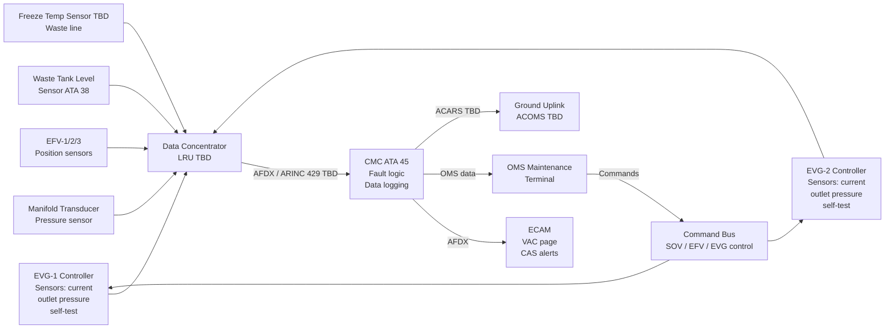
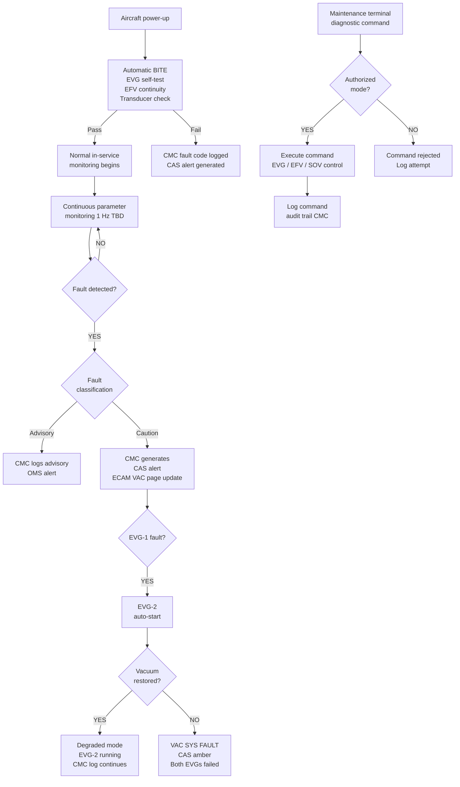
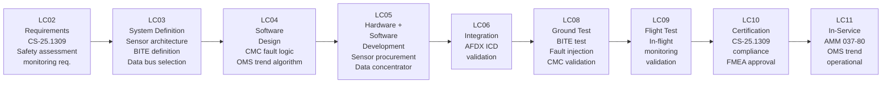

# 037-080 — Vacuum Monitoring, Diagnostics, and Control Interfaces
### AMPEL360e eWTW · ATA 37 · Q+ATLANTIDE ATLAS Scaffold

**Status:** 
**Revision:** 0.1.0 | **Created:** 2025-07-14 | **Updated:** 2025-07-14

---

## §0 Hyperlink Policy

All links in this document are relative within the Q+ATLANTIDE ATLAS repository unless explicitly marked as external. External links reference publicly available standards only. Internal cross-references use relative paths from the `037_Vacuum/` node. All YAML `*_link` fields follow this convention.

---

## §1 Purpose

This document defines the **monitoring, diagnostics, and control interface architecture** for the ATA 37 Vacuum System on the AMPEL360e eWTW. It specifies:
- All monitored parameters (sensors, ranges, fault thresholds)
- BITE (Built-In Test Equipment) functionality — power-up self-test and continuous monitoring
- CMC / OMS data flow and fault logging
- Maintenance diagnostic commands and control interfaces
- Freeze protection monitoring concept
- OMS health trend analysis (EVG degradation)
- Data bus architecture (AFDX / ARINC 429 TBD)

---

## §2 Applicability

| Item | Value |
|------|-------|
| Aircraft Programme | AMPEL360e eWTW |
| ATA Chapter | 37 — Vacuum |
| Subsubject | 037-80 — Monitoring, Diagnostics, and Control Interfaces |
| Certification Basis | CS-25 Amendment 27 (TBD) |
| Applicable Standards | CS-25.1438, CS-25.1301, CS-25.1309, AMC 25.831 |
| Revision Status |  |
| Configuration | ~100-pax single-aisle electric |

---

## §3 System / Function Overview

### 3.1 Monitored Parameters

| Parameter | Sensor Type | Location | Normal Range | Advisory Threshold | Fault Threshold | CMC Response |
|-----------|-------------|----------|--------------|-------------------|-----------------|--------------|
| Manifold vacuum | Piezoresistive transducer | Vacuum manifold body | −0.7 to −1.0 bar gauge | < −0.5 bar | < −0.3 bar | VAC LO → VAC SYS FAULT |
| EVG-1 motor current | Hall-effect current sensor | EVG-1 controller |  A | > TBD A (over) | > TBD A or < TBD A (stall) | EVG-1 FAULT |
| EVG-2 motor current | Hall-effect current sensor | EVG-2 controller |  A | > TBD A | > TBD A or < TBD A | EVG-2 FAULT |
| EVG-1 outlet pressure | Pressure sensor | EVG-1 outlet port |  bar | TBD | TBD | EVG-1 FAULT |
| EVG-2 outlet pressure | Pressure sensor | EVG-2 outlet port |  bar | TBD | TBD | EVG-2 FAULT |
| Waste tank fill level | Capacitive / float (TBD) | Waste tank — ATA 38 | 0–74% | > 75% | > 95% | WASTE TANK HI / FULL |
| EFV-1 position | Micro-switch / optical TBD | EFV-1 Lavatory FWD | Open/Closed | Slow response TBD | Stuck open/closed | LAV-1 FAULT TBD |
| EFV-2 position | Micro-switch / optical TBD | EFV-2 Lavatory MID | Open/Closed | Slow response TBD | Stuck open/closed | LAV-2 FAULT TBD |
| EFV-3 position | Micro-switch / optical TBD | EFV-3 Lavatory AFT | Open/Closed | Slow response TBD | Stuck open/closed | LAV-3 FAULT TBD |
| Freeze temp (TBD) | NTC thermistor TBD | Waste line cold zone TBD | > +5°C | < +5°C | < 0°C | FREEZE RISK TBD |
| EVG-1 vibration | Accelerometer TBD | EVG-1 housing TBD | < TBD g RMS | TBD | TBD | EVG-1 VIBRATION FAULT TBD |

> **Note:** Sensor types, locations, and thresholds are  pending supplier selection and system design freeze. OI-037-001 (EVG sizing) affects sensor specifications.

### 3.2 BITE Description

Built-In Test Equipment (BITE) functions for ATA 37:

| BITE Function | Type | Trigger | Duration | Pass Criteria | Fail Action |
|--------------|------|---------|----------|---------------|-------------|
| EVG-1 power-up self-test | Automatic | Power-up / reset | < TBD s | Vacuum achieved ≥ −0.7 bar in < TBD s; current nominal | CMC fault code logged; EVG-2 auto-start |
| EVG-2 power-up self-test | Automatic | Power-up / reset (after EVG-1 pass) | < TBD s | Same as EVG-1 criteria | CMC fault code logged; VAC SYS FAULT alert |
| EFV continuity check | Automatic | Power-up | < 1 s TBD | Solenoid coil resistance within limits | CMC EFV fault code |
| Manifold transducer check | Automatic | Power-up | < 1 s TBD | Transducer reading plausible (aircraft on ground → near-atmospheric) | CMC transducer fault |
| Manual vacuum test | Commanded | Maintenance terminal | ~20 min | Per ground test acceptance criteria | Fault detail on terminal |

---

## §4 Scope

This document covers:
- Sensor architecture and monitored parameter list
- BITE (power-up and continuous) definition
- CMC data collection, fault logging, and OMS interface
- Maintenance terminal diagnostic commands and control interface
- Freeze protection monitoring concept (OI-037-005)
- Data bus architecture (AFDX / ARINC 429 TBD)
- OMS health trend analysis concept

This document does **not** cover: hardware sensor procurement, CMC hardware (ATA 45), ECAM display (ATA 31), or ground test procedures (037-070).

---

## §5 Architecture Description

### 5.1 Monitoring Architecture

```
EVG-1 Controller ──────────────────────────────────────┐
 └ Motor current sensor                                 │
 └ Outlet pressure sensor                               │
 └ Self-test (BITE)                                     │
                                                        ├──→ Data Concentrator (ATA 42 / LRU TBD)
EVG-2 Controller ──────────────────────────────────────┤        │
 └ Motor current sensor                                 │        ↓
 └ Outlet pressure sensor                               │   AFDX Bus (ATA 42)
 └ Self-test (BITE)                                     │        │
                                                        │        ↓
Manifold Transducer ────────────────────────────────────┤   CMC (ATA 45)
                                                        │    │          │
Waste Tank Level Sensor (ATA 38) ───────────────────────┤    ↓          ↓
                                                        │  ECAM       OMS /
EFV-1/2/3 Position Sensors ─────────────────────────────┘  CAS     Maintenance
                                                               Terminal
Freeze Temp Sensor (TBD) ──────────────────────────────────→ Data Concentrator
```

### 5.2 Control Interface Description

The maintenance terminal (OMS) provides the following control commands to the vacuum system (authorized personnel only, with audit trail):

| Command | Target | Mode | Safety Interlock |
|---------|--------|------|-----------------|
| EVG-1 START | EVG-1 controller | Ground only | Aircraft weight-on-wheels (WoW) or maintenance mode active |
| EVG-1 STOP | EVG-1 controller | Ground only | WoW or maintenance mode |
| EVG-2 START | EVG-2 controller | Ground only | WoW or maintenance mode |
| EVG-2 STOP | EVG-2 controller | Ground only | WoW or maintenance mode |
| EFV-1/2/3 OPEN | EFV solenoid | Ground test only | Maintenance mode + waste tank < 95% |
| EFV-1/2/3 CLOSE | EFV solenoid | Ground test only | Maintenance mode |
| SOV OPEN | SOV solenoid | Maintenance | WoW or maintenance mode |
| SOV CLOSE | SOV solenoid | Maintenance | WoW or maintenance mode |
| FAULT LOG CLEAR | CMC NVM | Maintenance | Authorized personnel (Level 2 access TBD) |
| VACUUM TEST START | Automated test sequence | Ground | WoW; EVG not running |

### 5.3 Data Bus Architecture

| Bus | Protocol | Used For | Status |
|-----|----------|----------|--------|
| AFDX (ARINC 664) | Ethernet-based | CMC ↔ EVG controller, ECAM, OMS |  — confirm with avionics ICD |
| ARINC 429 | Serial bus | Alternative if AFDX not available on this LRU |  |
| RS-485 | Serial | EVG internal controller to data concentrator TBD |  |
| CAN bus | Controller Area Network | Alternative EVG controller bus TBD |  |
| Discrete wiring | Hard-wired | EFV flush button, flush indicator, EFV position (analog) | Planned |

---

## §6 Functional Breakdown

### 6.1 Continuous In-Service Monitoring Functions

| Function ID | Description | Update Rate | Data Destination |
|-------------|-------------|-------------|-----------------|
| MON-037-01 | Manifold vacuum measurement | 1 Hz TBD | CMC, ECAM |
| MON-037-02 | EVG-1 motor current measurement | 10 Hz TBD | CMC, EVG controller |
| MON-037-03 | EVG-2 motor current measurement | 10 Hz TBD | CMC, EVG controller |
| MON-037-04 | Waste tank level measurement | 0.1 Hz TBD | CMC, ECAM (ATA 38 sensor) |
| MON-037-05 | EFV position monitoring | Event-driven | CMC, flush indicator |
| MON-037-06 | Freeze temperature monitoring | 0.1 Hz TBD (if installed) | CMC |
| MON-037-07 | EVG run-time accumulation | 1 Hz | CMC NVM |
| MON-037-08 | Vacuum pull-down time (per EVG start) | Per-event | CMC NVM (OMS trend) |

### 6.2 OMS Health Trend Analysis

The OMS monitors EVG performance trends over time:

| Trend Parameter | Nominal Baseline | Degradation Indicator | OMS Alert Threshold |
|----------------|-----------------|----------------------|---------------------|
| EVG-1 pull-down time (to −0.7 bar) | TBD s (established at delivery) | Pull-down time increasing by > TBD s over TBD flights | OMS advisory — schedule EVG inspection |
| EVG-2 pull-down time | TBD s | Same as EVG-1 | OMS advisory |
| EVG-1 run hours since last service | 0 h at service | > TBD h | OMS scheduled maintenance alert |
| EVG-2 run hours since last service | 0 h at service | > TBD h | OMS scheduled maintenance alert |
| Flush cycle count since last service | 0 at service | > TBD cycles | OMS odour filter replacement advisory |

---

## §7 System Context Diagram



---

## §8 Internal Functional Architecture



---

## §9 Lifecycle Traceability



---

## §10 Interfaces

| Interface ID | ATA Chapter | Direction | Protocol | Description | Status |
|-------------|-------------|-----------|----------|-------------|--------|
| IF-037-080-001 | ATA 45 (CMC/OMS) | ATA 37 ↔ ATA 45 | AFDX | All monitoring data to CMC; maintenance commands from OMS to EVG/EFV/SOV |  |
| IF-037-080-002 | ATA 31 (ECAM) | ATA 45 → ATA 31 | AFDX | CAS alerts, ECAM VAC page data (via CMC to ECAM) |  |
| IF-037-080-003 | ATA 38 | ATA 38 → ATA 37/CMC | AFDX / discrete | Waste tank level sensor data |  |
| IF-037-080-004 | ATA 42 | ATA 37 ↔ ATA 42 | AFDX | AFDX network infrastructure |  |
| IF-037-080-005 | ATA 24 | ATA 24 → ATA 37 | Power | 115 VAC for EVG; 28 VDC for EFV solenoids, sensors, controllers |  |
| IF-037-080-006 | Ground (ACARS) | ATA 45 → Ground | ACARS TBD | OMS health trend data uplink to airline maintenance |  |

---

## §11 Operating Modes

| Mode ID | Mode Name | Description | BITE | Monitoring | Maintenance Control |
|---------|-----------|-------------|------|------------|---------------------|
| OM-037-80-01 | BITE mode | Power-up self-test sequence | Active — auto | Limited | Disabled |
| OM-037-80-02 | Normal monitoring | In-service continuous monitoring | Passive (continuous) | Full | Disabled (flight) |
| OM-037-80-03 | Degraded monitoring | EVG-1 fault; EVG-2 running | Passive | Full | Disabled |
| OM-037-80-04 | Fault — total vacuum loss | Both EVGs failed; CAS alert active | Passive | Reduced (fault state) | Disabled |
| OM-037-80-05 | Ground test mode | Maintenance terminal-commanded test | Manual (commanded) | Full | Enabled |
| OM-037-80-06 | Maintenance diagnostic mode | Fault log review, parameter view, component command | N/A | Full read | Enabled (authorized) |
| OM-037-80-07 | Ground power-up BITE | Auto BITE on ground power application | Active — auto | Full | Disabled during BITE |

---

## §12 Monitoring and Diagnostics — Fault Code Table

| Fault Code | Description | Severity | Auto Action | Maintenance Action |
|------------|-------------|----------|-------------|-------------------|
| F-037-001 | EVG-1 failed to reach vacuum threshold within TBD s | Caution | EVG-2 auto-start | Inspect EVG-1; check CMC log |
| F-037-002 | EVG-2 failed to reach vacuum threshold (EVG-1 also failed) | Warning | CAS VAC SYS FAULT | Replace EVG with fault; vacuum system test |
| F-037-003 | Manifold vacuum below VAC LO threshold | Caution | Log; EVG-2 start if EVG-1 on | Check EVG status; check for line leak |
| F-037-004 | EFV-1 stuck open (position feedback after de-energize = OPEN) | Caution | Log; alert crew/cabin | Inspect EFV-1; replace if stuck |
| F-037-005 | EFV-2 stuck open | Caution | Log; alert | Inspect EFV-2; replace if stuck |
| F-037-006 | EFV-3 stuck open | Caution | Log; alert | Inspect EFV-3; replace if stuck |
| F-037-007 | EFV-1 stuck closed (failed to open on command) | Advisory | Log | Inspect EFV-1 solenoid; check wiring |
| F-037-008 | EFV-2 stuck closed | Advisory | Log | Inspect EFV-2 solenoid |
| F-037-009 | EFV-3 stuck closed | Advisory | Log | Inspect EFV-3 solenoid |
| F-037-010 | Waste tank fill level > 75% (WASTE TANK HI) | Advisory | Log; ECAM display | Plan expedited ground service |
| F-037-011 | Waste tank fill level > 95% (WASTE TANK FULL) | Caution | CAS alert | Limit lavatory use; immediate ground service |
| F-037-012 | Manifold transducer out of range / failed | Advisory | Log; use secondary TBD | Replace manifold transducer |
| F-037-013 | Freeze temperature < threshold (TBD) | Advisory | Log; alert TBD | Check waste line freeze protection |
| F-037-014 | EVG-1 over-current | Caution | EVG-1 shutdown; EVG-2 auto-start | Inspect EVG-1 motor |
| F-037-015 | EVG-2 over-current | Caution | EVG-2 shutdown; CAS | Inspect EVG-2 motor |
| F-037-016 | SOV failed to open on command | Caution | Log; attempt retry | Inspect SOV solenoid; check wiring |
| F-037-017 | SOV failed to close on command | Caution | Log | Inspect SOV; check wiring |

> **Note:** Fault code list is  — this represents the planned concept. Final fault codes will be defined during CMC software design.

---

## §13 Maintenance Concept

### 13.1 Fault Isolation Using CMC

1. Access OMS maintenance terminal → ATA 37 → Fault Log
2. Note fault code(s) and timestamp(s)
3. Cross-reference fault code to AMM FI DM (info code 400)
4. Follow fault isolation procedure in AMM (see §14 for DM codes)
5. Execute directed maintenance action (component test, replacement)
6. Clear fault log (authorized access)
7. Run vacuum system functional test (037-070 ground test procedure)
8. Confirm fault resolved; close maintenance record

### 13.2 OMS Trend Monitoring

| Trend | Review Frequency | Threshold for Action |
|-------|-----------------|----------------------|
| EVG pull-down time trend | Every 50 flights TBD | Increasing by > TBD s |
| EVG run hours since last service | Continuous | > TBD h |
| Flush cycle count | Continuous | > TBD cycles (odour filter) |
| Fault event frequency | Weekly TBD | > TBD faults / 100 flights |

---

## §14 S1000D / CSDB Mapping

| DM Code | Info Code | Title | Status |
|---------|-----------|-------|--------|
| DMC-AMPEL360E-EWTW-037-80-00-00A-040A-A | 040 | Vacuum Monitoring and Diagnostics — Description |  |
| DMC-AMPEL360E-EWTW-037-80-00-00A-300A-A | 300 | CMC / OMS Monitoring Check |  |
| DMC-AMPEL360E-EWTW-037-80-00-00A-400A-A | 400 | Vacuum System Fault Isolation — EVG Fault |  |
| DMC-AMPEL360E-EWTW-037-80-00-00A-400B-A | 400 | Vacuum System Fault Isolation — EFV Fault |  |
| DMC-AMPEL360E-EWTW-037-80-00-00A-400C-A | 400 | Vacuum System Fault Isolation — Manifold Transducer Fault |  |

---

## §15 Footprints

| Item | Value |
|------|-------|
| Data concentrator (LRU) |  dimensions, mass |
| Manifold transducer |  dimensions |
| EFV position sensor (each) |  dimensions |
| Freeze temp sensor (if installed) |  |
| AFDX bandwidth (ATA 37 monitoring) |  kbps |
| CMC storage (ATA 37 fault log) |  kB NVM |
| Wiring mass (monitoring) |  kg |

---

## §16 Safety and Certification

| Requirement | Reference | Compliance Method | Status |
|-------------|-----------|-------------------|--------|
| Equipment function and installation | CS-25.1301 | Inspection + test |  |
| Safety assessment — monitoring failures | CS-25.1309 | FMEA: monitoring failure → undetected EVG fault |  |
| Vacuum system integrity | CS-25.1438 | Monitoring as part of leak detection strategy |  |
| BITE completeness | CS-25.1309 | BITE coverage analysis |  |
| Software (CMC fault logic) | DO-178C Level TBD | Software development assurance |  |
| Hardware (data concentrator) | DO-254 Level TBD | Hardware design assurance |  |

---

## §17 Verification and Validation

| V&V ID | Activity | Method | Acceptance Criteria | Status |
|--------|----------|--------|---------------------|--------|
| VV-037-080-001 | BITE power-up test | Ground test | All BITE checks pass within TBD s |  |
| VV-037-080-002 | Fault injection — EVG-1 fault | Ground test (simulated) | CMC logs F-037-001; EVG-2 auto-starts |  |
| VV-037-080-003 | Fault injection — EFV stuck open | Ground test (simulated) | CMC logs F-037-004; CAS advisory |  |
| VV-037-080-004 | OMS trend data validation | Analysis + ground test | Pull-down time trend data logged correctly |  |
| VV-037-080-005 | Maintenance command authorization test | Ground test | Unauthorized commands rejected; audit trail logged |  |
| VV-037-080-006 | AFDX data integrity test | Integration test | All ATA 37 parameters received by CMC with correct values |  |
| VV-037-080-007 | Freeze protection sensor check | Ground test (cold environment TBD) | Advisory generated at correct temperature threshold |  |

---

## §18 Glossary

| Term | Definition |
|------|-----------|
| ADIRU | Air Data Inertial Reference Unit — solid-state; no vacuum connection on eWTW |
| AFDX | Avionics Full-Duplex Switched Ethernet (ARINC 664 Part 7) — primary data bus |
| ATA 37 | Air Transport Association chapter for Vacuum systems |
| BITE | Built-In Test Equipment — automated self-test capability of the vacuum system |
| CMC | Central Maintenance Computer — collects, logs, and processes system health data |
| CS-25.1438 | EASA CS for vacuum/pneumatic plumbing integrity |
| DO-178C | Software Considerations in Airborne Systems and Equipment Certification |
| DO-254 | Design Assurance Guidance for Airborne Electronic Hardware |
| EFV | Electrically actuated Flush Valve |
| EVG | Electric Vacuum Generator — motor-driven vacuum pump |
| Fault code | Coded identifier for a specific fault condition logged in CMC NVM |
| Freeze protection | Thermal protection for waste lines (OI-037-005) |
| Gyroscopic instruments | Vacuum-driven AI, DI, TC — **eliminated on eWTW** (ADIRU) |
| Manifold | Vacuum distribution header |
| NRV | Non-Return Valve |
| NVM | Non-Volatile Memory — fault log and run-hour data storage |
| Odour filter | Activated carbon filter on manifold vent |
| OMS | On-board Maintenance System (ATA 45) |
| PTFE | Polytetrafluoroethylene — vacuum line material |
| SOV | Shutoff Valve — solenoid-operated; between EVG and manifold |
| Vacuum transducer | Piezoresistive pressure sensor measuring manifold vacuum |
| VRV | Vacuum Relief Valve — limits maximum system vacuum |
| VWS | Vacuum Waste System |
| Waste tank | ATA 38 scope waste collection vessel |

---

## §19 Citations

1. EASA CS-25 Amendment 27 (TBD), §25.1438 — Pressurisation and pneumatic systems
2. EASA CS-25 §25.1309 — Equipment, systems and installations
3. EASA CS-25 §25.1301 — Function and installation
4. DO-178C — Software Considerations in Airborne Systems
5. DO-254 — Design Assurance Guidance for Airborne Electronic Hardware
6. ARINC 664 Part 7 (AFDX) — Avionics Full-Duplex Switched Ethernet
7. ATA iSpec 2200 Chapter 37 — Vacuum
8. S1000D Issue 5.0

---

## §20 References

| Ref | Document | Link |
|-----|----------|------|
| R-080-001 | 037-000 Vacuum General | [037-000](./037-000-Vacuum-General.md) |
| R-080-002 | 037-010 Vacuum Sources (EVG) | [037-010](./037-010-Vacuum-Sources.md) |
| R-080-003 | 037-050 Consumers and Interfaces | [037-050](./037-050-Vacuum-Consumers-and-System-Interfaces.md) |
| R-080-004 | 037-060 Indication and Warning | [037-060](./037-060-Vacuum-System-Indication-and-Warning.md) |
| R-080-005 | 037-070 Ground Service and Test | [037-070](./037-070-Vacuum-Ground-Service-and-Test-Interfaces.md) |
| R-080-006 | ATA 45 OMS | Separate ATLAS node |
| R-080-007 | ATA 31 CMC | Separate ATLAS node |

---

## §21 Open Issues

| OI ID | Description | Owner | Priority | Status |
|-------|-------------|-------|----------|--------|
| OI-037-001 | EVG count and sizing — affects sensor count, BITE complexity, fault code list | Systems Eng | HIGH |  |
| OI-037-002 | Dry-flush vs. vacuum toilet — if dry-flush, all ATA 37 monitoring eliminated | Chief Architect | CRITICAL |  |
| OI-037-003 | Waste tank level sensor type (capacitive vs. float) — affects CMC interface | Structures | MEDIUM |  |
| OI-037-004 | Vacuum line routing — affects sensor placement and freeze sensor location | Structures | HIGH |  |
| OI-037-005 | **Freeze protection monitoring** — sensor location, alarm threshold, and pilot/ground alert strategy TBD | Systems Eng | MEDIUM |  |
| OI-037-006 | Odour filter tracking — should CMC track flush cycles and alert for filter replacement? | Certification | MEDIUM |  |
| OI-037-007 | Ground service panel location — does not affect monitoring architecture | Ground Ops | LOW |  |

---

## §22 Change Log

| Rev | Date | Author | Description |
|-----|------|--------|-------------|
| 0.1.0 | 2025-07-14 | AI-assisted scaffold | Initial scaffold — §0–§22; monitored parameters table, BITE, fault codes, OMS trend concept; all thresholds and bus protocols TBD |

---
*Q+ATLANTIDE ATLAS — ATA 37 Vacuum — 037-080 Monitoring, Diagnostics, and Control Interfaces — AMPEL360e eWTW*
*Classification: UNCLASSIFIED — ENGINEERING SCAFFOLD*
