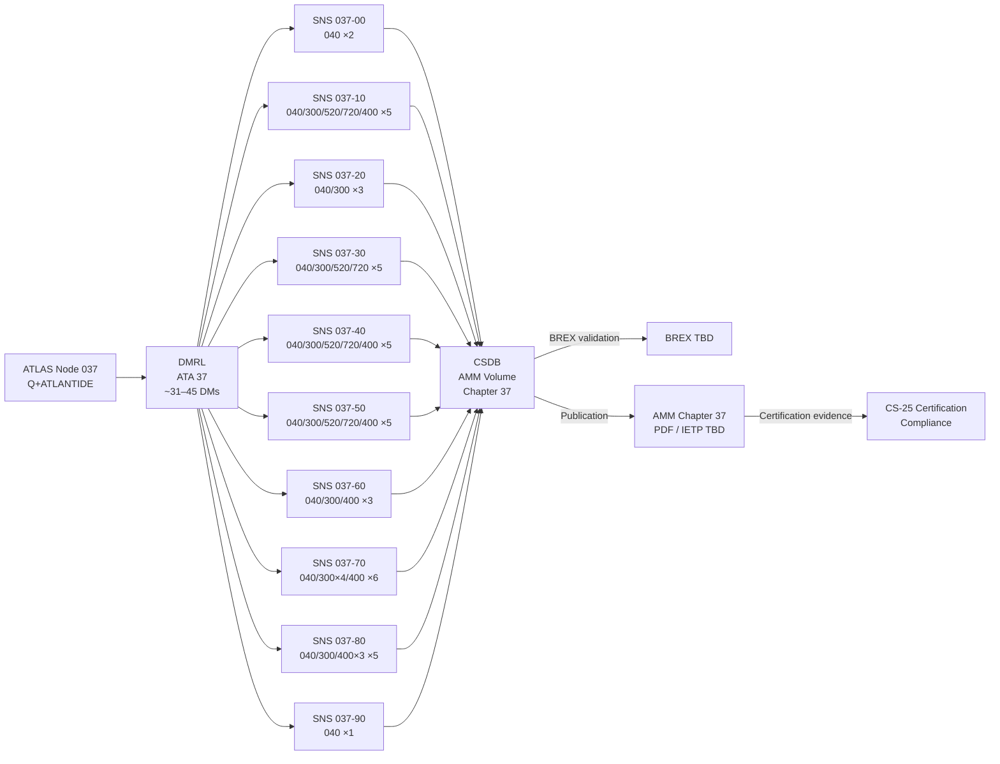
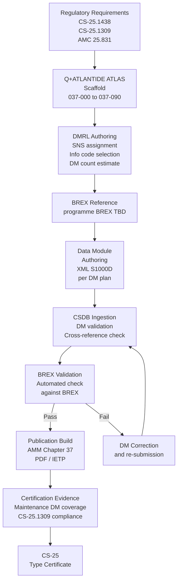
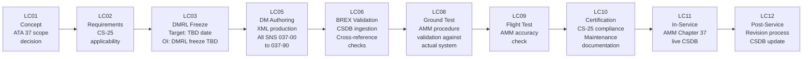

# 037-090 — S1000D / CSDB Mapping and Traceability
### <PROGRAMME> · ATA 37 · Q+ATLANTIDE ATLAS Scaffold

**Status:** 
**Revision:** 0.1.0 | **Created:** 2025-07-14 | **Updated:** 2025-07-14

---

## §0 Hyperlink Policy

All links in this document are relative within the Q+ATLANTIDE ATLAS repository unless explicitly marked as external. External links reference publicly available standards only. The S1000D standard link points to the public S1000D website. Internal cross-references use relative paths from the `037_Vacuum/` node.

---

## §1 Purpose

This document defines the **S1000D Data Module Requirements List (DMRL)** and **CSDB mapping** for the complete ATA 37 Vacuum chapter of the <PROGRAMME> aircraft. It provides traceability from the Q+ATLANTIDE ATLAS scaffold nodes (037-000 through 037-090) to the planned S1000D Data Modules (DMs) for the <PROGRAMME> Aircraft Maintenance Manual (AMM) CSDB volume.

**Key context:** ATA 37 on the <PROGRAMME-SHORT> is a **highly reduced chapter** compared to conventional aircraft. Estimated DM count: ~20–30 DMs (vs. ~60–80 for a conventional aircraft). The reduction is because:
- No engine vacuum pump DMs (no vacuum engine pump — electric EVG only)
- No gyroscopic instrument vacuum DMs (ADIRU solid-state — ATA 34)
- No vacuum autopilot servo DMs (FBW electric — ATA 22)
- No bleed-air venturi DMs (no bleed system — ATA 36)
- Only consumer is the vacuum waste toilet system (~3 toilets)

---

> **Agnostic standard.** This file defines the S1000D/CSDB mapping rule for this ATLAS node. It does not instantiate programme-specific DMCs, model identifiers, or system-difference codes. Programme-specific content belongs in the programme implementation branch.

## §2 Applicability

| Item | Value |
|------|-------|
| Aircraft Programme | <PROGRAMME> |
| ATA Chapter | 37 — Vacuum |
| Subsubject | 037-90 — S1000D / CSDB Mapping |
| S1000D Version | Issue 5.0 |
| CSDB Platform |  (CSDB path TBD) |
| BREX Document |  (<PROGRAMME-SHORT> BREX TBD) |
| DMRL Status | Not-yet-frozen |
| Publication | <PROGRAMME> AMM — Chapter 37 |
| Certification Basis | CS-25 Amendment 27 (TBD) |

---

## §3 System / Function Overview — DMRL Summary

### 3.1 Subsubject DMRL Overview

| SNS (ATA) | Subsubject Title | ATLAS Node | Planned DM Count | Info Codes Planned | DMRL Status |
|-----------|-----------------|------------|------------------|--------------------|-------------|
| 037-00 | Vacuum General | 037-000 | 2–3 | 040 |  |
| 037-10 | Vacuum Sources (EVG) | 037-010 | 4–6 | 040, 520, 720, 300 |  |
| 037-20 | Vacuum Distribution | 037-020 | 3–4 | 040, 300 |  |
| 037-30 | Regulation and Shutoff | 037-030 | 4–5 | 040, 520, 720, 300 |  |
| 037-40 | Pumps, Ejectors, Valves, Lines | 037-040 | 4–6 | 040, 520, 720, 300, 400 |  |
| 037-50 | Vacuum Consumers and Interfaces | 037-050 | 3–5 | 040, 300, 520, 720, 400 |  |
| 037-60 | Indication and Warning | 037-060 | 2–3 | 040, 300, 400 |  |
| 037-70 | Ground Service and Test | 037-070 | 5–7 | 040, 300, 400 |  |
| 037-80 | Monitoring and Diagnostics | 037-080 | 3–5 | 040, 300, 400 |  |
| 037-90 | S1000D / CSDB Mapping | 037-090 | 1 | 040 |  |
| **TOTAL** | | | **~31–45 DMs** | | Not-yet-frozen |

> **Reduction note:** A conventional aircraft ATA 37 DMRL would contain ~60–80 DMs. The <PROGRAMME-SHORT> DMRL is approximately half that due to the elimination of vacuum gyro instruments and autopilot vacuum servos. If OI-037-002 resolves to **dry-flush toilets**, the DMRL count drops further to ~2–5 DMs (general description + confirmed eliminations only).

---

## §4 Scope

This document covers:
- DMRL for all 10 ATA 37 subsubjects (037-00 through 037-90)
- Individual planned DM list per subsubject with info codes
- S1000D DMC format specification for <PROGRAMME-SHORT> ATA 37
- CSDB path, BREX reference, publication structure
- Traceability from ATLAS scaffold to S1000D DMs
- Lifecycle traceability from requirements to DM authoring to certification
- V&V for S1000D/CSDB deliverables

---

## §5 Architecture Description — S1000D for ATA 37

### 5.1 DMC Format

All ATA 37 <PROGRAMME-SHORT> data modules follow this DMC format:

```
DMC-<MODEL>-<SYSTEMDIFF>-037-{NN}-{AA}-00{infoCode}{variant}-{lang}.xml
```

Where:
| Field | Description | Example |
|-------|-------------|---------|
| `<MODEL>-<SYSTEMDIFF>` | Model identification code | Fixed |
| `037` | System code (ATA 37 — Vacuum) | Fixed |
| `{NN}` | Subsubject (ATA subsubject, 2-digit) | `10`, `50`, `70` |
| `{AA}` | Sub-subsubject (00 for general, `A`–`Z` for variants) | `00` |
| `{infoCode}` | S1000D information code | `040`, `300`, `400`, `520`, `720` |
| `{variant}` | DM variant letter | `A` (primary), `B`, `C` as needed |
| `{lang}` | Language code | `A` (English) |

### 5.2 Information Code Reference

| Info Code | S1000D Type | Use in ATA 37 |
|-----------|-------------|---------------|
| 040 | Descriptive — system description and operation | System description DMs for all subsubjects |
| 300 | Procedures — inspection/check | Functional tests, inspections, VRV test, decay test |
| 400 | Fault isolation | EVG, EFV, SOV, transducer fault isolation |
| 520 | Removal | EVG, EFV, NRV, SOV, VRV, odour filter removal |
| 720 | Installation | EVG, EFV, NRV, SOV, VRV, odour filter installation |

### 5.3 CSDB Architecture

| CSDB Element | Value | Status |
|-------------|-------|--------|
| CSDB platform |  | Not selected |
| CSDB path |  | Not assigned |
| BREX document |  <PROGRAMME-SHORT>-BREX-001 TBD | Not frozen |
| Publication | <PROGRAMME> AMM — Chapter 37 | Planned |
| AMM format | S1000D Publication Module (PM) | Planned |
| Output formats | PDF, IETP (Interactive Electronic Technical Publication) TBD |  |

### 5.4 Reduced Chapter Rationale — Explicit Elimination Table

The following conventional ATA 37 DM categories are **explicitly eliminated** from the <PROGRAMME-SHORT> DMRL:

| Eliminated DM Category | Conventional ATA 37 Count (est.) | Reason Eliminated | <PROGRAMME-SHORT> Replacement |
|------------------------|----------------------------------|-------------------|-----------------|
| Engine vacuum pump removal/installation | 4–6 DMs | No engine vacuum pump | EVG (electric) |
| Vacuum pump inspection | 2–3 DMs | No engine vacuum pump | EVG BITE + CMC |
| Gyro instrument vacuum supply | 6–10 DMs | No vacuum gyros | ADIRU (ATA 34) |
| Autopilot vacuum servo supply | 4–6 DMs | No vacuum servos | FBW electric (ATA 22) |
| Vacuum regulator (engine-side) | 2–3 DMs | No engine vacuum | EVG controller |
| Bleed venturi vacuum | 2–4 DMs | No bleed system | N/A |
| **Total eliminated** | **~20–32 DMs** | | |

---

## §6 Functional Breakdown — Detailed DM Plan per Subsubject

### 6.1 SNS 037-00 — Vacuum General

| Planned DM Code | Info Code | Title | Priority | Status |
|----------------|-----------|-------|----------|--------|
| DMC-<MODEL>-<SYSTEMDIFF>-037-00-00-00A-040A-A | 040 | Vacuum System — General Description and Operation | P1 |  |
| DMC-<MODEL>-<SYSTEMDIFF>-037-00-00-00A-040B-A | 040 | Vacuum System — <PROGRAMME-SHORT> Design Philosophy and ATA 37 Scope Reduction | P1 |  |

### 6.2 SNS 037-10 — Vacuum Sources (EVG)

| Planned DM Code | Info Code | Title | Priority | Status |
|----------------|-----------|-------|----------|--------|
| DMC-<MODEL>-<SYSTEMDIFF>-037-10-00-00A-040A-A | 040 | Electric Vacuum Generator (EVG) — Description and Operation | P1 |  |
| DMC-<MODEL>-<SYSTEMDIFF>-037-10-00-00A-300A-A | 300 | EVG — Functional Test | P1 |  |
| DMC-<MODEL>-<SYSTEMDIFF>-037-10-00-00A-520A-A | 520 | EVG — Removal | P1 |  |
| DMC-<MODEL>-<SYSTEMDIFF>-037-10-00-00A-720A-A | 720 | EVG — Installation | P1 |  |
| DMC-<MODEL>-<SYSTEMDIFF>-037-10-00-00A-400A-A | 400 | EVG — Fault Isolation | P1 |  |

### 6.3 SNS 037-20 — Vacuum Distribution

| Planned DM Code | Info Code | Title | Priority | Status |
|----------------|-----------|-------|----------|--------|
| DMC-<MODEL>-<SYSTEMDIFF>-037-20-00-00A-040A-A | 040 | Vacuum Distribution Manifold — Description | P1 |  |
| DMC-<MODEL>-<SYSTEMDIFF>-037-20-00-00A-300A-A | 300 | Vacuum Manifold — Inspection and Leak Check | P2 |  |
| DMC-<MODEL>-<SYSTEMDIFF>-037-20-00-00A-300B-A | 300 | Vacuum Line — Inspection and Leak Test (Decay Method) | P1 |  |

### 6.4 SNS 037-30 — Regulation and Shutoff

| Planned DM Code | Info Code | Title | Priority | Status |
|----------------|-----------|-------|----------|--------|
| DMC-<MODEL>-<SYSTEMDIFF>-037-30-00-00A-040A-A | 040 | Vacuum Relief Valve (VRV) — Description | P1 |  |
| DMC-<MODEL>-<SYSTEMDIFF>-037-30-00-00A-040B-A | 040 | Shutoff Valve (SOV) — Description | P1 |  |
| DMC-<MODEL>-<SYSTEMDIFF>-037-30-00-00A-300A-A | 300 | VRV — Pop-Test Procedure | P1 |  |
| DMC-<MODEL>-<SYSTEMDIFF>-037-30-00-00A-520A-A | 520 | VRV — Removal | P2 |  |
| DMC-<MODEL>-<SYSTEMDIFF>-037-30-00-00A-720A-A | 720 | VRV — Installation | P2 |  |

### 6.5 SNS 037-40 — Pumps, Ejectors, Valves, and Lines

| Planned DM Code | Info Code | Title | Priority | Status |
|----------------|-----------|-------|----------|--------|
| DMC-<MODEL>-<SYSTEMDIFF>-037-40-00-00A-040A-A | 040 | Non-Return Valve (NRV) — Description | P1 |  |
| DMC-<MODEL>-<SYSTEMDIFF>-037-40-00-00A-300A-A | 300 | NRV — Inspection and Leak Test | P2 |  |
| DMC-<MODEL>-<SYSTEMDIFF>-037-40-00-00A-520A-A | 520 | NRV — Removal | P2 |  |
| DMC-<MODEL>-<SYSTEMDIFF>-037-40-00-00A-720A-A | 720 | NRV — Installation | P2 |  |
| DMC-<MODEL>-<SYSTEMDIFF>-037-40-00-00A-400A-A | 400 | Vacuum Line — Fault Isolation (leak, blockage) | P2 |  |

### 6.6 SNS 037-50 — Vacuum Consumers and Interfaces

| Planned DM Code | Info Code | Title | Priority | Status |
|----------------|-----------|-------|----------|--------|
| DMC-<MODEL>-<SYSTEMDIFF>-037-50-00-00A-040A-A | 040 | Vacuum Consumers and System Interfaces — Description | P1 |  |
| DMC-<MODEL>-<SYSTEMDIFF>-037-50-00-00A-300A-A | 300 | EFV — Inspection | P1 |  |
| DMC-<MODEL>-<SYSTEMDIFF>-037-50-00-00A-520A-A | 520 | EFV — Removal | P1 |  |
| DMC-<MODEL>-<SYSTEMDIFF>-037-50-00-00A-720A-A | 720 | EFV — Installation | P1 |  |
| DMC-<MODEL>-<SYSTEMDIFF>-037-50-00-00A-400A-A | 400 | EFV — Fault Isolation | P1 |  |

### 6.7 SNS 037-60 — Indication and Warning

| Planned DM Code | Info Code | Title | Priority | Status |
|----------------|-----------|-------|----------|--------|
| DMC-<MODEL>-<SYSTEMDIFF>-037-60-00-00A-040A-A | 040 | Vacuum Indication and Warning — Description | P1 |  |
| DMC-<MODEL>-<SYSTEMDIFF>-037-60-00-00A-300A-A | 300 | CAS Alert Functional Check | P1 |  |
| DMC-<MODEL>-<SYSTEMDIFF>-037-60-00-00A-400A-A | 400 | Vacuum CAS Alert — Fault Isolation | P2 |  |

### 6.8 SNS 037-70 — Ground Service and Test

| Planned DM Code | Info Code | Title | Priority | Status |
|----------------|-----------|-------|----------|--------|
| DMC-<MODEL>-<SYSTEMDIFF>-037-70-00-00A-040A-A | 040 | Ground Service and Test — Description | P1 |  |
| DMC-<MODEL>-<SYSTEMDIFF>-037-70-00-00A-300A-A | 300 | Waste Drain and Line Rinse Procedure | P1 |  |
| DMC-<MODEL>-<SYSTEMDIFF>-037-70-00-00A-300B-A | 300 | Vacuum System Functional Test | P1 |  |
| DMC-<MODEL>-<SYSTEMDIFF>-037-70-00-00A-300C-A | 300 | VRV Pop-Test | P1 |  |
| DMC-<MODEL>-<SYSTEMDIFF>-037-70-00-00A-300D-A | 300 | Vacuum Decay Leak Test | P1 |  |
| DMC-<MODEL>-<SYSTEMDIFF>-037-70-00-00A-400A-A | 400 | Vacuum System Ground Fault Isolation | P2 |  |

### 6.9 SNS 037-80 — Monitoring and Diagnostics

| Planned DM Code | Info Code | Title | Priority | Status |
|----------------|-----------|-------|----------|--------|
| DMC-<MODEL>-<SYSTEMDIFF>-037-80-00-00A-040A-A | 040 | Monitoring and Diagnostics — Description | P1 |  |
| DMC-<MODEL>-<SYSTEMDIFF>-037-80-00-00A-300A-A | 300 | CMC / OMS Monitoring Check | P1 |  |
| DMC-<MODEL>-<SYSTEMDIFF>-037-80-00-00A-400A-A | 400 | Fault Isolation — EVG Fault | P1 |  |
| DMC-<MODEL>-<SYSTEMDIFF>-037-80-00-00A-400B-A | 400 | Fault Isolation — EFV Fault | P1 |  |
| DMC-<MODEL>-<SYSTEMDIFF>-037-80-00-00A-400C-A | 400 | Fault Isolation — Transducer Fault | P2 |  |

### 6.10 SNS 037-90 — S1000D / CSDB Mapping

| Planned DM Code | Info Code | Title | Priority | Status |
|----------------|-----------|-------|----------|--------|
| DMC-<MODEL>-<SYSTEMDIFF>-037-90-00-00A-040A-A | 040 | S1000D / CSDB Mapping and Traceability — Description | P1 |  |

---

## §7 System Context Diagram



---

## §8 Internal Functional Architecture



---

## §9 Lifecycle Traceability



---

## §10 Interfaces

| Interface ID | System | Direction | Description | Status |
|-------------|--------|-----------|-------------|--------|
| IF-037-090-001 | CSDB platform | ATLAS → CSDB | DMRL ingested into CSDB; DMs authored in XML per DMC format |  |
| IF-037-090-002 | BREX | CSDB ↔ BREX | All DMs validated against <PROGRAMME-SHORT> BREX before publication |  |
| IF-037-090-003 | AMM Publication | CSDB → AMM | Chapter 37 published as AMM chapter from CSDB PM |  |
| IF-037-090-004 | Certification | AMM → EASA | AMM Chapter 37 DMs provided as maintenance documentation for TC |  |
| IF-037-090-005 | ATA 38 CSDB | Cross-reference | ATA 37 DMs cross-reference ATA 38 DMs (waste tank, drain valve) |  |
| IF-037-090-006 | ATA 45 CSDB | Cross-reference | ATA 37 FI DMs cross-reference ATA 45 CMC/OMS DMs |  |

---

## §11 Operating Modes

> **Note:** This subsubject (037-90) is a documentation and traceability node — it does not define operational modes of the vacuum system. The following modes relate to the CSDB/DMRL workflow:

| Mode | Description | Status |
|------|-------------|--------|
| DMRL DRAFT | DMRL not frozen; DM count and codes subject to change | Current |
| DMRL FREEZE | DMRL frozen; no new DMs added without CCB approval |  |
| DM AUTHORING | Individual DMs being authored in XML per frozen DMRL |  |
| CSDB VALIDATION | DMs ingested into CSDB; BREX validation running |  |
| PUBLICATION | AMM Chapter 37 published and available |  |
| IN-SERVICE | AMM live; revision process operational |  |

---

## §12 Monitoring and Diagnostics

### 12.1 DMRL Completeness Metrics

| Metric | Target | Current | Status |
|--------|--------|---------|--------|
| Total planned DMs | ~31–45 | ~40 (this scaffold) |  |
| DMs with info code 040 (descriptive) | ≥1 per SNS | 10 |  |
| DMs with info code 400 (FI) | ≥1 per LRU type | 5 |  |
| DMs with info codes 520/720 (R/I) | Per each replaceable component | ~8 |  |
| BREX validation pass rate | 100% | N/A (authoring not started) |  |
| Cross-reference integrity | 100% valid links | N/A |  |
| Coverage of open OIs | Tracked in §21 | 7 OIs + 4 DMRL OIs | Active |

---

## §13 Maintenance Concept

- **DMRL maintenance:** DMRL is a living document until freeze date (TBD). Changes require CCB (Configuration Control Board) approval.
- **DM revision process:** Post-freeze changes follow S1000D change management (revision code increment, reason-for-change entry).
- **BREX enforcement:** All DMs validated against <PROGRAMME-SHORT> BREX before CSDB ingestion (automated tooling TBD).
- **Cross-reference management:** CSDB platform maintains applicability cross-references between ATA 37 and ATA 38, ATA 45 DMs.
- **Translation:** English (language A) primary. Additional languages TBD per operator requirements.

---

## §14 S1000D / CSDB Mapping — Comprehensive DMRL Table

| DMC (abbreviated) | SNS | Info Code | Title (abbreviated) | Priority | Status |
|-------------------|-----|-----------|---------------------|----------|--------|
| 037-00-…-040A | 037-00 | 040 | General Description | P1 |  |
| 037-00-…-040B | 037-00 | 040 | <PROGRAMME-SHORT> Scope Reduction | P1 |  |
| 037-10-…-040A | 037-10 | 040 | EVG Description | P1 |  |
| 037-10-…-300A | 037-10 | 300 | EVG Functional Test | P1 |  |
| 037-10-…-520A | 037-10 | 520 | EVG Removal | P1 |  |
| 037-10-…-720A | 037-10 | 720 | EVG Installation | P1 |  |
| 037-10-…-400A | 037-10 | 400 | EVG Fault Isolation | P1 |  |
| 037-20-…-040A | 037-20 | 040 | Distribution Manifold | P1 |  |
| 037-20-…-300A | 037-20 | 300 | Manifold Inspection | P2 |  |
| 037-20-…-300B | 037-20 | 300 | Decay Leak Test | P1 |  |
| 037-30-…-040A | 037-30 | 040 | VRV Description | P1 |  |
| 037-30-…-040B | 037-30 | 040 | SOV Description | P1 |  |
| 037-30-…-300A | 037-30 | 300 | VRV Pop-Test | P1 |  |
| 037-30-…-520A | 037-30 | 520 | VRV Removal | P2 |  |
| 037-30-…-720A | 037-30 | 720 | VRV Installation | P2 |  |
| 037-40-…-040A | 037-40 | 040 | NRV Description | P1 |  |
| 037-40-…-300A | 037-40 | 300 | NRV Inspection | P2 |  |
| 037-40-…-520A | 037-40 | 520 | NRV Removal | P2 |  |
| 037-40-…-720A | 037-40 | 720 | NRV Installation | P2 |  |
| 037-40-…-400A | 037-40 | 400 | Line Fault Isolation | P2 |  |
| 037-50-…-040A | 037-50 | 040 | Consumers + Interfaces | P1 |  |
| 037-50-…-300A | 037-50 | 300 | EFV Inspection | P1 |  |
| 037-50-…-520A | 037-50 | 520 | EFV Removal | P1 |  |
| 037-50-…-720A | 037-50 | 720 | EFV Installation | P1 |  |
| 037-50-…-400A | 037-50 | 400 | EFV Fault Isolation | P1 |  |
| 037-60-…-040A | 037-60 | 040 | Indication Description | P1 |  |
| 037-60-…-300A | 037-60 | 300 | CAS Functional Check | P1 |  |
| 037-60-…-400A | 037-60 | 400 | CAS Fault Isolation | P2 |  |
| 037-70-…-040A | 037-70 | 040 | Ground Service Descr. | P1 |  |
| 037-70-…-300A | 037-70 | 300 | Drain and Rinse Proc. | P1 |  |
| 037-70-…-300B | 037-70 | 300 | Functional Test | P1 |  |
| 037-70-…-300C | 037-70 | 300 | VRV Pop-Test | P1 |  |
| 037-70-…-300D | 037-70 | 300 | Decay Leak Test | P1 |  |
| 037-70-…-400A | 037-70 | 400 | Ground Fault Isolation | P2 |  |
| 037-80-…-040A | 037-80 | 040 | Monitoring Descr. | P1 |  |
| 037-80-…-300A | 037-80 | 300 | CMC / OMS Check | P1 |  |
| 037-80-…-400A | 037-80 | 400 | EVG Fault Isolation | P1 |  |
| 037-80-…-400B | 037-80 | 400 | EFV Fault Isolation | P1 |  |
| 037-80-…-400C | 037-80 | 400 | Transducer FI | P2 |  |
| 037-90-…-040A | 037-90 | 040 | S1000D Mapping | P1 |  |

**Total planned DMs: 40** (DMRL not frozen — count may change pending OI resolution, particularly OI-037-002)

---

## §15 Footprints

| Item | Value |
|------|-------|
| Total planned DMs | ~40 (not-yet-frozen) |
| Estimated XML file size per DM | 50–200 kB TBD |
| Total estimated CSDB volume (ATA 37) | ~4–8 MB XML TBD |
| AMM Chapter 37 PDF page count (est.) | ~80–120 pages TBD |
| Languages | English (primary); others TBD |
| CSDB path |  |

---

## §16 Safety and Certification

| Requirement | Reference | Compliance Method | Status |
|-------------|-----------|-------------------|--------|
| Maintenance documentation adequacy | CS-25.1529 (Instructions for CAS) | DM completeness per DMRL |  |
| AMM procedure accuracy | CS-25.1309 (safety process) | Procedure validation in ground test |  |
| DMRL coverage of all LRUs | Maintenance programme requirements | DMRL completeness review |  |
| S1000D BREX compliance | <PROGRAMME-SHORT> BREX TBD | Automated BREX validation |  |
| Regulatory language requirements | EASA Part-21 / CS-25 | Language and clarity review |  |

---

## §17 Verification and Validation

| V&V ID | Activity | Method | Acceptance Criteria | Status |
|--------|----------|--------|---------------------|--------|
| VV-037-090-001 | DMRL completeness review | Document review | All SNS have ≥1 DM with info code 040; all LRUs have 520/720 pair |  |
| VV-037-090-002 | BREX validation | Automated tool | 100% BREX pass rate |  |
| VV-037-090-003 | Cross-reference integrity check | CSDB report | No broken DM-to-DM references |  |
| VV-037-090-004 | ATLAS-to-DMRL traceability | Manual review | Each ATLAS scaffold node maps to ≥1 DM |  |
| VV-037-090-005 | AMM procedure validation | Ground test | Each AMM 300-series procedure executable as written |  |
| VV-037-090-006 | DM count vs. conventional reduction rationale | Design review | Elimination table accepted by certification authority |  |

---

## §18 Glossary

| Term | Definition |
|------|-----------|
| ADIRU | Air Data Inertial Reference Unit — solid-state; gyro vacuum DMs eliminated on <PROGRAMME-SHORT> |
| AMM | Aircraft Maintenance Manual — primary publication using ATA 37 S1000D DMs |
| ATA 37 | Air Transport Association chapter for Vacuum systems |
| BREX | Business Rules Exchange — S1000D document defining project-specific authoring rules |
| CCB | Configuration Control Board — governs DMRL changes after freeze |
| CMC | Central Maintenance Computer |
| CSDB | Common Source Data Base — S1000D DM repository and publication management system |
| CS-25.1438 | EASA CS for vacuum/pneumatic plumbing integrity |
| DMC | Data Module Code — unique identifier for each S1000D data module |
| DMRL | Data Module Requirements List — master list of all required DMs for a publication |
| EFV | Electrically actuated Flush Valve |
| EVG | Electric Vacuum Generator |
| Freeze protection | OI-037-005 — thermal protection for vacuum lines |
| Gyroscopic instruments | Vacuum-driven AI, DI, TC — **eliminated on <PROGRAMME-SHORT>**; no gyro vacuum DMs in DMRL |
| Info code | S1000D code indicating DM type (040 descriptive, 300 procedure, 400 FI, 520 removal, 720 installation) |
| IETP | Interactive Electronic Technical Publication — electronic AMM format |
| Manifold | Vacuum distribution header |
| NRV | Non-Return Valve |
| Odour filter | Activated carbon filter — replacement tracked by CMC (OI-037-006) |
| PTFE | Polytetrafluoroethylene — vacuum line material |
| S1000D | International specification for technical publications using an SGML/XML architecture |
| SNS | System / Sub-system / Sub-sub-system — S1000D hierarchical classification aligning with ATA |
| SOV | Shutoff Valve |
| Vacuum transducer | Manifold pressure sensor |
| VRV | Vacuum Relief Valve |
| VWS | Vacuum Waste System |
| Waste tank | ATA 38 scope waste collection vessel |

---

## §19 Citations

1. EASA CS-25 Amendment 27 (TBD), §25.1529 — Instructions for Continued Airworthiness
2. EASA CS-25 §25.1438, §25.1309, §25.1301
3. S1000D Issue 5.0 — International specification for technical publications
4. ATA iSpec 2200 — Air Transport Association specification for aviation maintenance documentation
5. EASA Part-21 — Certification of Aircraft and Related Products

---

## §20 References

| Ref | Document | Link |
|-----|----------|------|
| R-090-001 | 037-000 Vacuum General | [037-000](./037-000-Vacuum-General.md) |
| R-090-002 | 037-010 Vacuum Sources | [037-010](./037-010-Vacuum-Sources.md) |
| R-090-003 | 037-020 Vacuum Distribution | [037-020](./037-020-Vacuum-Distribution.md) |
| R-090-004 | 037-030 Regulation and Shutoff | [037-030](./037-030-Vacuum-Regulation-and-Shutoff.md) |
| R-090-005 | 037-040 Valves and Lines | [037-040](./037-040-Vacuum-Pumps-Ejectors-Valves-and-Lines.md) |
| R-090-006 | 037-050 Consumers and Interfaces | [037-050](./037-050-Vacuum-Consumers-and-System-Interfaces.md) |
| R-090-007 | 037-060 Indication and Warning | [037-060](./037-060-Vacuum-System-Indication-and-Warning.md) |
| R-090-008 | 037-070 Ground Service and Test | [037-070](./037-070-Vacuum-Ground-Service-and-Test-Interfaces.md) |
| R-090-009 | 037-080 Monitoring and Diagnostics | [037-080](./037-080-Vacuum-Monitoring-Diagnostics-and-Control-Interfaces.md) |
| R-090-010 | S1000D Issue 5.0 | [s1000d.org](https://www.s1000d.org/) |

---

## §21 Open Issues

| OI ID | Description | Owner | Priority | Status |
|-------|-------------|-------|----------|--------|
| OI-037-001 | EVG count and sizing — affects DMRL DM count (EVG-2 may require additional 520/720 DMs) | Systems Eng | HIGH |  |
| OI-037-002 | **Dry-flush vs. vacuum toilet decision** — if dry-flush selected, DMRL reduced to ~2–5 DMs; vacuum system eliminated | Chief Architect | CRITICAL |  |
| OI-037-003 | Waste tank material and capacity — may require ATA 38 DMRL DMs; ATA 37/38 boundary TBD | Structures | MEDIUM |  |
| OI-037-004 | Vacuum line routing — affects DM count for line inspection procedures | Structures | HIGH |  |
| OI-037-005 | Freeze protection — if heater tapes added, requires additional DMs (520/720/300 for heater) | Systems Eng | MEDIUM |  |
| OI-037-006 | Odour filter certification — requires dedicated 520/720 DMs if scheduled replacement | Certification | MEDIUM |  |
| OI-037-007 | Ground service panel location — affects 037-70 DM descriptions and access illustrations | Ground Ops | LOW |  |
| OI-DMRL-001 | **DMRL freeze date TBD** — required before DM authoring can begin | Programme | HIGH |  |
| OI-DMRL-002 | **BREX document TBD** — <PROGRAMME-SHORT> BREX not yet created; required for CSDB validation | Tech Pubs | HIGH |  |
| OI-DMRL-003 | **CSDB path TBD** — CSDB platform not yet selected; affects all DM delivery | Tech Pubs | HIGH |  |
| OI-DMRL-004 | **DM count may reduce to ~2–5 if OI-037-002 resolves to dry-flush** — entire VWS vacuum DM scope eliminated | Chief Architect | CRITICAL |  |

---

## §22 Change Log

| Rev | Date | Author | Description |
|-----|------|--------|-------------|
| 0.1.0 | 2025-07-14 | AI-assisted scaffold | Initial scaffold — §0–§22; full DMRL planned; 40 DMs defined across all 10 SNS; BREX, CSDB path, freeze date all TBD; 4 DMRL-specific OIs added |

---
*Q+ATLANTIDE ATLAS — ATA 37 Vacuum — 037-090 S1000D / CSDB Mapping and Traceability — <PROGRAMME>*
*Classification: UNCLASSIFIED — ENGINEERING SCAFFOLD*
