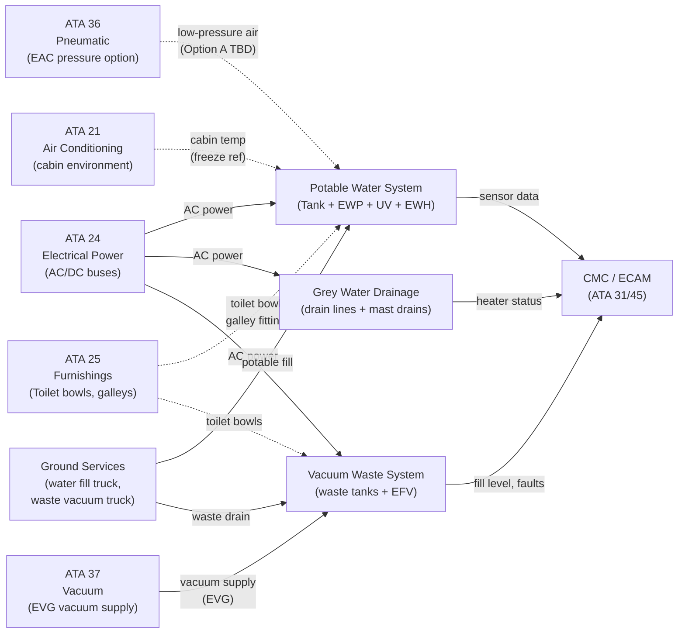
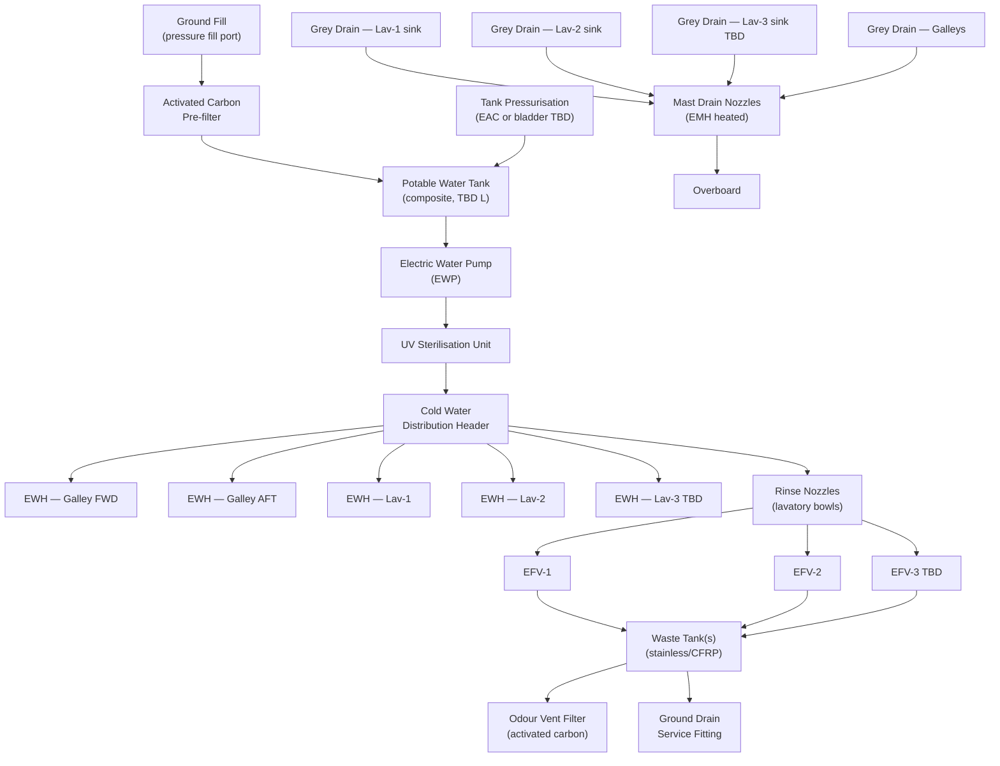
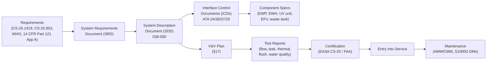

# 038-000 — Water and Waste — General
### AMPEL360e eWTW · ATA 38 · Q+ATLANTIDE ATLAS Scaffold

**Status:**   
**Revision:** 0.1.0 — 2026-05-10  
**Classification:** Q-AIR Primary | Q-MECHANICS / Q-DATAGOV / Q-GREENTECH / Q-GROUND Support

---

## §0 Hyperlink Policy

All cross-references within this document use relative Markdown links anchored to section headings within the Q+ATLANTIDE ATLAS repository. External regulatory references (CS-25, AMC, WHO, FAA) are cited by document identifier only; no live external URLs are embedded because regulatory document URLs are subject to change without notice. Internal DMC cross-references follow the pattern `DMC-AMPEL360E-EWTW-038-XX-YYYY-A`. Traceability links to the CSDB are maintained in §14. Where a parameter is not yet determined, the badge  is used inline. Badges  and  indicate work in progress or planned content respectively.

---

## §1 Purpose

This document provides the top-level general overview of **ATA Chapter 38 — Water and Waste** as applied to the **AMPEL360e eWTW** (~100-passenger, fully electric, medium-range) aircraft. It establishes:

1. The architecture and philosophy of the fully electric Potable Water System (PWS) — no engine bleed, no APU steam heating, electrically pressurised and heated.
2. The grey water drainage system — gravity drain to electrically heated mast drain nozzles.
3. The Vacuum Waste System (VWS) as the toilet/lavatory waste collection and storage subsystem, interfacing with ATA 37 (vacuum generation).
4. System boundaries between ATA 38 and adjacent ATA chapters (ATA 37, ATA 21, ATA 24, ATA 25, ATA 36).
5. The applicable certification basis (CS-25, WHO, FAA Part 121 Appendix A).
6. The document hierarchy for ATA 38, covering subsubjects 038-000 through 038-090.

This document is authoritative for system boundary definition and interfaces for all lower-level ATA 38 documents.

---

## §2 Applicability

| Item | Value |
|---|---|
| Aircraft Programme | AMPEL360e eWTW |
| Variant | All variants (unless noted) |
| ATA Chapter | 38 — Water and Waste |
| Document Tier | Level 2 — System Description Document (SDD) |
| Effectivity | MSN 0001 onwards  |
| Preceding Document | Scaffold Rev 0.0 |

This document applies to all systems that store, distribute, heat, or drain water and that collect, store, or service toilet waste aboard the AMPEL360e eWTW. It explicitly excludes:
- Cabin humidity and condensate management (ATA 21)
- Vacuum generation equipment (ATA 37)
- Toilet bowl assemblies and seat mechanisms (ATA 25)
- Galley cooling equipment drains unless routed into the ATA 38 grey drain network

---

## §3 System/Function Overview

### 3.1 eWTW ATA 38 Philosophy

The AMPEL360e eWTW adopts a fully electric water and waste management philosophy — no engine bleed air, no APU-derived heat, no pneumatic tank pressurisation from a traditional bleed source. All water heating, tank pressurisation, freeze protection, and grey-drain nozzle heating are achieved by electrical means.

| Function | Conventional Aircraft | eWTW Solution |
|---|---|---|
| Tank pressurisation | Bleed air from pneumatic manifold (ATA 36) | Electric Air Compressor (EAC) low-pressure air OR electric pump with bladder  |
| Water heating | Boiler fed by APU steam / bleed heat exchange | Electric Water Heaters (EWH), instant or storage type |
| Grey drain nozzle heating | Engine bleed or hot air duct | Electric Mast Heaters (EMH) |
| Freeze protection | Warm air blanket from cabin distribution | Electric trace heating on cold-zone lines |
| Toilet flushing | Vacuum from engine-driven vacuum pump | Electric Vacuum Generator (EVG — ATA 37) |

### 3.2 Subsystem Summary

ATA 38 on the eWTW is divided into two main loops:

**Clean Loop (Potable Water System — PWS):**
- Water tank (composite, pressurised) → Electric Water Pump (EWP) → UV sterilisation unit → activated carbon pre-filter → distribution lines → galleys and lavatories → Electric Water Heaters (EWH) at point of use.

**Dirty Loop (Waste System):**
- Grey water: lavatory and galley sinks → gravity drain lines → mast drain nozzles (overboard).
- Black water (toilet waste): flush cycle via EFV → vacuum transport (ATA 37 EVG) → waste collection tanks → ground drain service.

The two loops are maintained strictly separate. No cross-connection exists between the clean and dirty loops. Non-Return Valves (NRVs) are fitted at all clean-loop branch points to prevent backflow contamination.

---

## §4 Scope

### 4.1 In-Scope

- Potable water tank, fill port, overfill valve, vent filter, drain valve, level sensor, pressure sensor
- Electric Water Pump (EWP) and distribution piping
- Electric Water Heaters (EWH) at all galley and lavatory service points
- UV sterilisation unit (inline, at tank outlet or EWP outlet)
- Activated carbon pre-filter at fill point
- Cold-water distribution lines (LLDPE or PEX)
- Grey water drain lines, mast drain nozzles, Electric Mast Heaters (EMH)
- Toilet waste collection tanks (stainless or CFRP), fill-level sensors, overflow sensors, temperature sensors, odour filter vent
- Electric Flush Valves (EFV) and rinse water supply to lavatory bowls
- Waste tank ground drain fittings and single-point service panel
- Freeze protection trace heaters and Trace Heater Controller (THC)
- System indication: ECAM water quantity, waste fill level, CAS alerts
- BITE and CMC monitoring interfaces for all ATA 38 components

### 4.2 Out-of-Scope

- Vacuum generation equipment (EVG, SOV, VRV, vacuum manifold): → ATA 37
- Toilet bowl assemblies and seat mechanisms: → ATA 25
- Galley cooling systems: → ATA 25
- Cabin pressurisation: → ATA 21
- Electrical bus architecture and power distribution: → ATA 24
- Pneumatic supply for tank pressurisation option (EAC source): → ATA 36

### 4.3 Document Hierarchy

| Subsubject | Title | Status |
|---|---|---|
| 038-000 | Water and Waste — General |  |
| 038-010 | Potable Water System |  |
| 038-020 | Water Storage and Distribution |  |
| 038-030 | Water Heaters and Service Interfaces |  |
| 038-040 | Waste Water Drainage |  |
| 038-050 | Toilet and Vacuum Waste System |  |
| 038-060 | Water and Waste Indication and Warning |  |
| 038-070 | Water and Waste Servicing and Ground Interfaces |  |
| 038-080 | Water and Waste Monitoring, Diagnostics, and Control Interfaces |  |
| 038-090 | S1000D/CSDB Mapping and Traceability |  |

---

## §5 Architecture Description

### 5.1 System Architecture Summary

The ATA 38 Water and Waste system consists of three discrete fluid circuits, each maintained separate:

**Circuit A — Potable Water (pressurised, clean):**
```
[Ground Fill Port] → [Activated Carbon Filter] → [Potable Water Tank]
    ← [EAC pressure / bladder TBD] ←
[Tank] → [EWP] → [UV Sterilisation] → [Cold Water Distribution Header]
    ├── [Galley FWD — EWH + faucet]
    ├── [Galley AFT — EWH + faucet]
    ├── [Lav-1 — EWH + faucet + rinse nozzle]
    ├── [Lav-2 — EWH + faucet + rinse nozzle]
    └── [Lav-3 — EWH + faucet + rinse nozzle] TBD
```

**Circuit B — Grey Water (gravity, dirty):**
```
[Galley FWD sink] ──┐
[Galley AFT sink] ──┤
[Lav-1 sink]      ──┤── [Gravity drain lines] → [Mast Drain-1] → [Overboard]
[Lav-2 sink]      ──┤                        → [Mast Drain-2] → [Overboard] TBD
[Lav-3 sink]      ──┘
```

**Circuit C — Black Water (vacuum transport, dirty):**
```
[Lav toilet bowls] → [EFV] → [Vacuum transport (ATA 37)] → [Waste Tank(s)] → [Ground Drain]
```

### 5.2 Pressurisation Options

Two candidate pressurisation strategies are under evaluation :
- **Option A:** Low-pressure air from Electric Air Compressor (EAC, ATA 36) — ~3.5 bar gauge to tank headspace.
- **Option B:** Bladder accumulator with electric pump — no air contact with water.

Option B is preferred from a water quality perspective (no risk of air contamination) but requires a larger tank volume or bladder package. Decision pending supplier selection (OI-038-002).

---

## §6 Functional Breakdown

| Subsubject | Function | Key Components | Status |
|---|---|---|---|
| 038-000 | System overview and general | All ATA 38 |  |
| 038-010 | Potable water system | Tank, EWP, UV, filter, NRVs |  |
| 038-020 | Water storage and distribution | Tank, distribution lines, EWP, check valves |  |
| 038-030 | Water heaters and service interfaces | EWH units, TMV, hot water branches |  |
| 038-040 | Waste water drainage | Grey drain lines, mast drains, EMH |  |
| 038-050 | Toilet and vacuum waste system | EFV, waste tanks, WIV, odour filter |  |
| 038-060 | Indication and warning | ECAM, CAS, galley panel, CMC |  |
| 038-070 | Servicing and ground interfaces | Fill port, drain fitting, service panel |  |
| 038-080 | Monitoring, diagnostics, control | CMC, BITE, THC, AFDX |  |
| 038-090 | S1000D/CSDB mapping | DMC assignments, DMRL |  |

---

## §7 System Context Diagram



---

## §8 Internal Functional Architecture



---

## §9 Lifecycle Traceability



---

## §10 Interfaces

| Interface | ATA Chapter | Direction | Signal/Medium | Notes |
|---|---|---|---|---|
| Electrical power — EWP, EWH, UV | ATA 24 | In | AC/DC bus  | Powers all electric water and waste components |
| Electrical power — EMH trace heaters | ATA 24 | In | Low-voltage DC  | Mast heater and trace heater power |
| Pneumatic pressurisation (Option A) | ATA 36 | In | Low-pressure air ~3.5 bar  | EAC-derived tank headspace pressure |
| Vacuum supply to EFV | ATA 37 | In | −0.7 to −1.0 bar  | EVG vacuum to toilet flush circuit |
| Toilet bowl assemblies | ATA 25 | Bi | Mechanical, water | EFV + rinse nozzle integrated with bowl |
| Galley fittings | ATA 25 | In | Mechanical | Faucet connections, sink drain fittings |
| Indication / ECAM | ATA 31 | Out | Digital (AFDX/ARINC 429) | Water quantity, waste level, CAS messages |
| CMC / BITE | ATA 45 | Bi | AFDX  | Fault logging, sensor values, test commands |
| Cabin temperature (freeze ref) | ATA 21 | In | Discrete/analogue | Freeze protection logic reference |
| Ground fill — potable water | Ground | In | Fluid (potable water) | Pressure fill port |
| Ground drain — waste | Ground | Out | Fluid (waste) | Vacuum or gravity drain truck connect |

---

## §11 Operating Modes

| Mode | Description | EWP | EWH | EMH | THC |
|---|---|---|---|---|---|
| Normal Flight | Full service, passengers aboard | Running | Thermostatically controlled | As needed (temp sensor) | Monitoring |
| Ground — Pre-flight | GPU powered, catering load | Running or standby | Pre-heat (GPU) | Armed | Monitoring |
| Ground — Post-flight | Waste drain / water fill service | Off (during drain/fill) | Off | As needed | Monitoring |
| Transit / Turnaround | Quick turnaround service | Standby | Thermostatically controlled | As needed | Monitoring |
| Cold Soak | Aircraft on ground, below +4°C | Standby | Off | Active (trace heaters ON) | Freeze active |
| Maintenance | BITE, manual test, component R&R | Manual test only | Manual test only | Manual test | Manual |
| Emergency / Degraded | EWP fault — gravity backup via pressurisation | Off (gravity from tank pressure) | Off or manual | As needed | Auto |

---

## §12 Monitoring and Diagnostics

| Parameter | Sensor | Location | CMC Signal | Alert |
|---|---|---|---|---|
| Potable water quantity | Capacitive level sensor (LS-038-01) | Water tank | AFDX/ARINC 429 | "WATER LO" (amber < TBD%) |
| Water tank pressure | Pressure sensor (PS-038-01) | Tank | CMC log | Advisory if over/under TBD |
| EWP status | Current monitor, speed feedback | EWP unit | AFDX | "EWP FAULT" (caution) |
| EWH temperature | NTC thermistor per EWH | Each EWH | AFDX | "EWH FAULT" (caution) |
| UV lamp status | UV sensor / lamp hours counter | UV unit | AFDX | "UV FAULT" (advisory) |
| Waste tank fill level | Capacitive level (3-step) | Each waste tank | AFDX | "WASTE FULL" (amber ≥ 90%) |
| Waste tank overflow | Reed switch or float | Each waste tank | Discrete | "WASTE OVFL" (red) |
| Water line temperature | NTC probes in cold zones | Belly/tail lines | AFDX | "FREEZE RISK" → THC activates |
| Mast heater continuity | Resistance monitor | EMH units | AFDX | "DRAIN HTR FAULT" (caution) |
| Trace heater status | Current monitor | THC | AFDX | Fault if heater open circuit |

---

## §13 Maintenance Concept

### 13.1 On-Wing Maintenance

| Task | Interval | Access | Skill Level |
|---|---|---|---|
| Visual inspection water lines / tank area | A-check  | Belly fairing panels | Line maintenance |
| EWP filter/strainer clean | C-check TBD | EWP access panel | Line/base |
| UV lamp replacement | Per lamp hours (TBD, ~6000 h) | UV unit access panel | Line maintenance |
| Activated carbon filter replacement | Per maintenance program (TBD) | Fill port access | Line maintenance |
| EWH drain and flush | Periodic (TBD) | Lavatory/galley access | Line maintenance |
| Waste tank rinse and drain | Per turn or operator program | Ground service panel | Line maintenance |
| Mast drain nozzle inspection | C-check TBD | Lower fuselage belly | Base maintenance |
| Trace heater continuity check | A-check or C-check TBD | Inspection panels | Line/base |
| Water quality sample | Per operator water program | Sample port | Line maintenance |
| BITE/CMC fault review | Each visit | CMC terminal | Line maintenance |

### 13.2 Off-Wing Maintenance

- EWP: shop overhaul per manufacturer CMM, TBD interval.
- EWH: bench test and thermostat calibration at TBD interval.
- Waste tank: removal for full clean and inspection at TBD interval per CS / operator.

---

## §14 S1000D/CSDB Mapping

| Document | DMC Pattern | Info Code | Status |
|---|---|---|---|
| System description (this document) | DMC-AMPEL360E-EWTW-038-00-00A-040A-A | 040 |  |
| Fault isolation — ATA 38 general | DMC-AMPEL360E-EWTW-038-00-00A-400A-A | 400 |  |
| Inspection — ATA 38 general | DMC-AMPEL360E-EWTW-038-00-00A-300A-A | 300 |  |

Full DMRL mapping in [038-090](./038-090-S1000D-CSDB-Mapping-and-Traceability.md).

---

## §15 Footprints

| Parameter | Value |
|---|---|
| Potable water tank capacity |  (target ~80–120 L for 100 pax) |
| Potable water tank location |  (aft belly fairing or forward galley area) |
| Waste tank capacity (per tank) |  (~15–20 L per lavatory) |
| Waste tank count |  (~3 for 3 lavatories, or 1 consolidated) |
| Waste tank location |  (belly, aft of wing) |
| Mast drain count |  (~2–4) |
| EWH count |  (1 per galley point + 1 per lavatory) |
| EWH power per unit |  (typically 1–2 kW) |
| EWP flow rate |  |
| System mass (dry) |  |
| Lavatory count |  (~3 for 100-pax configuration) |

---

## §16 Safety and Certification

| Requirement | Standard | Application |
|---|---|---|
| Freeze protection | CS-25.1419 | Water lines in cold zones; trace heating; freeze alert to crew |
| Flammability of tank material | CS-25.853 | Potable water tank and waste tank material approval |
| Water quality (onboard) | WHO Guidelines for Drinking-water Quality (4th Ed.) | Potable water purity; UV sterilisation; activated carbon filtration |
| Commercial operations water quality | 14 CFR Part 121 Appendix A | US operators; water quality testing program |
| Lavatory waste and air quality | EASA AMC 25.831 | Waste tank ventilation; odour control; cabin air protection |
| Equipment installation general | CS-25.1301 | All ATA 38 equipment fit for purpose |
| System safety (failure effects) | CS-25.1309 | EWP, EWH, EVG interface; failure mode analysis |
| Backflow prevention | NRV requirement | Separate clean/dirty loops; NRVs at all branch points |
| Materials in contact with potable water | NSF/ANSI 61 or equivalent  | Tank, tubing, fittings, UV unit wetted parts |
| Electromagnetic compatibility | CS-25.1353 | EWP motor, EWH, UV lamp EMI |

---

## §17 Verification and Validation

| Test | Method | Acceptance Criterion | Status |
|---|---|---|---|
| EWP flow test | Bench + rig test at rated pressure | Flow rate ≥ TBD L/min at TBD bar |  |
| Tank leak test | Hydrostatic test at 1.5× working pressure | No leakage for TBD minutes |  |
| EWH thermal test | Bench test; thermostat set-point verification | Outlet ≤ 60°C, TMV outlet ≤ 43°C TBD |  |
| UV steriliser output test | UV intensity measurement; log reduction test | ≥ 4-log reduction of test organism TBD |  |
| Mast heater continuity test | Resistance measurement at installation | Within tolerance of rated resistance TBD |  |
| Flush cycle test | Functional test on rig; vacuum available | Waste transported in ≤ 1.5 s per cycle TBD |  |
| Fill-level sensor accuracy | Calibration check at 0%, 50%, 100% fill | ± TBD% accuracy |  |
| Overflow sensor function | Simulated overfill; discrete output check | Alert within TBD seconds |  |
| Grey water drain flow test | Functional test at max simultaneous sink load | All drains clear within TBD seconds |  |
| Potable water quality test | Water sample analysis per WHO/14 CFR 121 App A | Meets potable water standard |  |
| Freeze protection activation test | Cold chamber test at −40°C ambient TBD | THC activates heaters; no pipe freeze |  |
| BITE self-test | Powerup BITE cycle | No false faults; real faults correctly reported |  |

---

## §18 Glossary

| Term | Definition |
|---|---|
| PWS | Potable Water System — the complete system supplying clean drinking water to galleys and lavatories |
| EWP | Electric Water Pump — motorised pump providing pressurised flow in the potable water distribution circuit |
| EWH | Electric Water Heater — point-of-use or storage electric heater providing hot water at galley and lavatory outlets |
| VWS | Vacuum Waste System — toilet waste collection system using vacuum transport (ATA 37 EVG) and storage tanks |
| EFV | Electric Flush Valve — solenoid-actuated valve controlling the vacuum flush cycle of a lavatory toilet |
| WIV | Waste Inlet Valve — valve connecting toilet bowl outlet to the waste collector line under vacuum |
| Mast drain | Overboard drain nozzle on lower fuselage through which grey water exits; electrically heated to prevent ice blockage |
| EMH | Electric Mast Heater — resistance heater element fitted to mast drain nozzle |
| UV sterilisation | Ultraviolet light treatment of potable water to inactivate micro-organisms |
| Activated carbon filter | Filter medium removing chlorine, taste, odour, and trace organics from potable water |
| LLDPE | Linear Low-Density Polyethylene — flexible tubing material approved for potable water service |
| PEX | Cross-linked Polyethylene — flexible tubing material approved for potable water service, higher temperature rating |
| Capacitive level sensor | Non-contact sensor measuring fluid level by change in electrical capacitance |
| NRV | Non-Return Valve — check valve preventing reverse flow (backflow prevention in potable water circuit) |
| TMV | Thermostatic Mixing Valve — valve mixing hot and cold water to deliver output at a controlled temperature |
| Grey water | Waste water from sinks (not toilet waste); drained overboard via mast drains |
| Black water | Toilet waste (liquid and solid); transported via vacuum system to waste tanks |
| Waste tank | Pressurised or unpressurised tank collecting toilet waste for ground removal |
| Freeze protection | System of trace heaters, sensors, and controller (THC) preventing potable water line freezing |
| Trace heating | Electrical resistance heating elements bonded to water lines to maintain above-freezing temperature |
| THC | Trace Heater Controller — controller unit monitoring temperature probes and switching trace heaters |
| CMC | Central Maintenance Computer — aircraft maintenance data system receiving sensor data from ATA 38 components |
| EAC | Electric Air Compressor — compressor providing low-pressure air for tank pressurisation (Option A) |

---

## §19 Citations

1. EASA Certification Specifications CS-25 (Large Aeroplanes), Subpart F, CS-25.853 — Compartment interiors.
2. EASA Certification Specifications CS-25, CS-25.1301 — Function and installation.
3. EASA Certification Specifications CS-25, CS-25.1309 — Equipment, systems, and installations.
4. EASA Certification Specifications CS-25, CS-25.1419 — Ice protection.
5. EASA AMC 25.831 — Ventilation; cabin air quality and lavatory waste.
6. World Health Organization, *Guidelines for Drinking-water Quality*, 4th Edition. Geneva: WHO, 2011.
7. 14 CFR Part 121 Appendix A — Aircraft Drinking Water Rule (ADWR).
8. NSF/ANSI 61 — Drinking Water System Components — Health Effects (or equivalent ).
9. Q+ATLANTIDE ATLAS [037-000 Vacuum General](../037_Vacuum/037-000-Vacuum-General.md) — EVG interface reference.
10. Q+ATLANTIDE ATLAS [038-090 S1000D/CSDB Mapping](./038-090-S1000D-CSDB-Mapping-and-Traceability.md).

---

## §20 References

| Ref | Document | Notes |
|---|---|---|
| [R1] | CS-25.1419 | Ice protection requirements |
| [R2] | CS-25.853 | Material flammability for tank/line materials |
| [R3] | CS-25.1301 / CS-25.1309 | Equipment installation and system safety |
| [R4] | EASA AMC 25.831 | Lavatory waste and cabin air quality |
| [R5] | WHO Guidelines for Drinking-water Quality (4th Ed.) | Potable water quality standard |
| [R6] | 14 CFR Part 121 Appendix A | ADWR — US commercial operations water quality |
| [R7] | NSF/ANSI 61  | Material contact with potable water |
| [R8] | ATA 37 — [037-000](../037_Vacuum/037-000-Vacuum-General.md) | Vacuum system interface |
| [R9] | ATA 24 — Electrical Power (ATLAS) | Power supply interface |
| [R10] | ATA 36 — Pneumatic (ATLAS) | EAC pressurisation option interface |

---

## §21 Open Issues

| ID | Description | Owner | Status |
|---|---|---|---|
| OI-038-001 | Potable water tank capacity and material (CFRP vs. PE-lined aluminium; capacity TBD based on galley/lav count and range) | Q-AIR / Q-MECHANICS |  |
| OI-038-002 | Tank pressurisation method (EAC bleed from ATA 36 vs. dedicated electric pump with bladder) | Q-AIR / Q-MECHANICS |  |
| OI-038-003 | EWH count, placement, and power budget | Q-AIR / Q-MECHANICS |  |
| OI-038-004 | Grey water retention requirement — regulatory review needed (overboard drain vs. retention tank) | Q-AIR / ORB-LEG |  |
| OI-038-005 | Waste tank count and capacity (per-lavatory vs. consolidated) | Q-AIR / Q-MECHANICS |  |
| OI-038-006 | Freeze protection strategy for belly lines (trace heating vs. routing only through heated zones) | Q-AIR / Q-MECHANICS |  |
| OI-038-007 | UV sterilisation unit certification and maintenance interval | Q-AIR / ORB-LEG |  |
| OI-038-008 | Mast drain count and location | Q-AIR / Q-MECHANICS |  |
| OI-038-009 | Single-point servicing panel location and configuration (combined potable + waste on one panel) | Q-AIR / Q-GROUND |  |

---

## §22 Change Log

| Revision | Date | Author | Description |
|---|---|---|---|
| 0.1.0 | 2026-05-10 | Q+ATLANTIDE ATLAS Working Group | Initial full-template draft; all 23 sections populated; eWTW ATA 38 context incorporated |
| 0.0.0 | 2026-05-10 | Q+ATLANTIDE ATLAS Working Group | Scaffold stub created |
