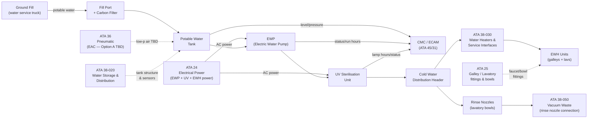
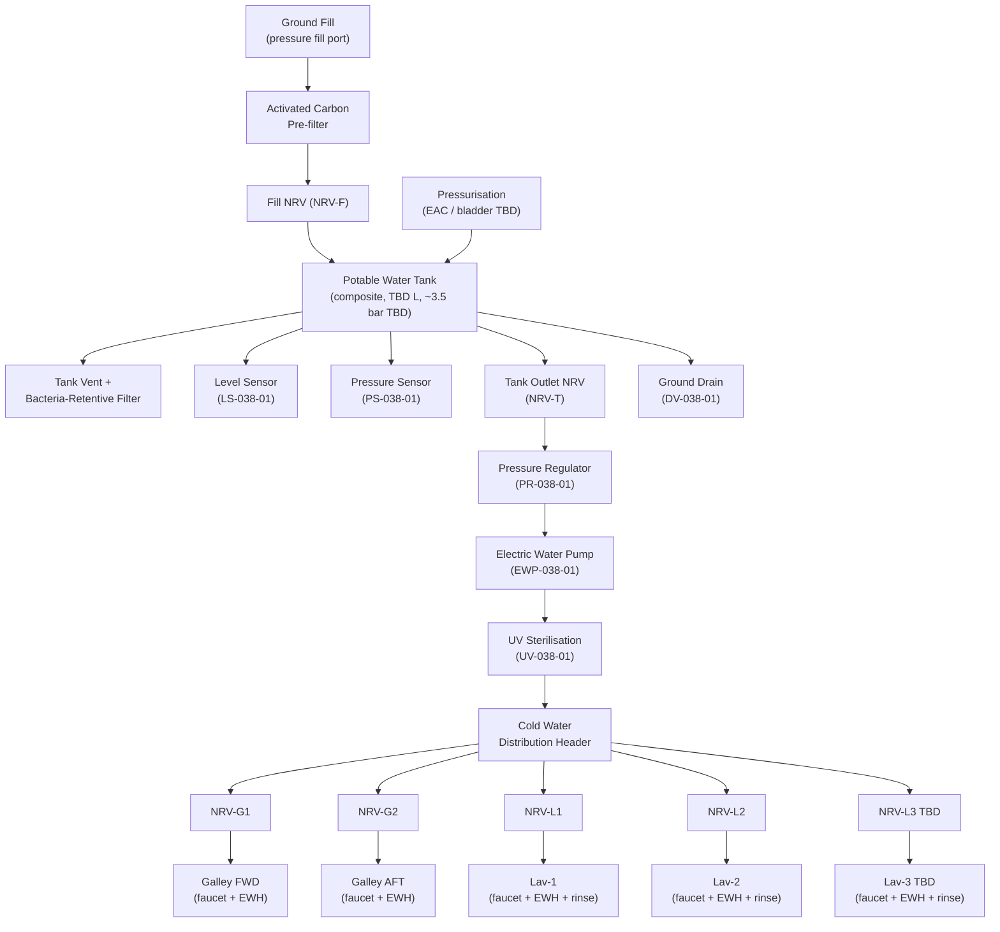
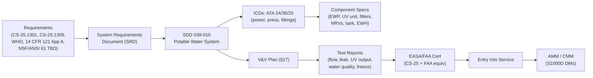

# 038-010 — Potable Water System
### [PROGRAMME-AIRCRAFT] [PROGRAMME-VARIANT] · ATA 38 · Q+ATLANTIDE ATLAS Scaffold

**Status:**   
**Revision:** 0.1.0 — 2026-05-10  
**Classification:** Q-AIR Primary | Q-MECHANICS / Q-DATAGOV / Q-GREENTECH / Q-GROUND Support

---

## §0 Hyperlink Policy

All cross-references within this document use relative Markdown links anchored to section headings within the Q+ATLANTIDE ATLAS repository. External regulatory references (CS-25, AMC, WHO, FAA) are cited by document identifier only; no live external URLs are embedded. Internal DMC cross-references follow the pattern `DMC-<PROGRAMME>-<VARIANT>-038-01-YYYY-A`. Where a parameter is not yet determined, the badge  is used inline.

---

## §1 Purpose

This document defines the agnostic ATLAS standard-level architecture context for `038-010 — Potable Water System`.

It describes the controlled scope, functions, interfaces, safety considerations, lifecycle traceability, and S1000D/CSDB mapping logic that programme implementations shall instantiate when this node is applicable.

This document is not a programme design baseline. Programme-specific capacities, locations, part numbers, effectivity, operating limits, maintenance references, and data module codes shall be defined only inside the applicable programme implementation branch.
## §2 Applicability

| Applicability Level | Rule |
|---|---|
| Standard taxonomy | Applies to the ATLAS node `<NODE>` |
| Programme implementation | Conditional; determined by programme architecture, trade studies, certification basis, and applicability model |
| Product configuration | Defined in the programme-specific configuration baseline |
| Effectivity | Defined in the programme CSDB / applicability layer |
| Non-applicability | Must be explicitly stated in the programme impact-study branch when excluded |
## §3 System/Function Overview

### 3.1 PWS Architecture on the [PROGRAMME-VARIANT]

The [PROGRAMME-VARIANT] Potable Water System is designed around fully electric supply:

- **Tank pressurisation:** Electric-derived (EAC low-pressure air or bladder/pump — OI-038-002 ). Target ~3.5 bar gauge working pressure.
- **Distribution pump:** Electric Water Pump (EWP) — centrifugal, motor-driven. Backup: gravity flow from pressurised tank if EWP fails.
- **Water treatment:** UV sterilisation unit at pump outlet; activated carbon pre-filter at fill point.
- **Hot water:** Electric Water Heaters (EWH) — instant or storage type, one per service point TBD.
- **Contamination prevention:** Non-Return Valves (NRVs) at tank outlet and all branch points; tank vent with bacteria-retentive filter; no cross-connection with grey or black water circuits.

### 3.2 Consumer Summary

| Consumer | Service | Cold | Hot | Rinse |
|---|---|---|---|---|
| Galley FWD | Faucet | Yes | Yes (EWH) | N/A |
| Galley AFT | Faucet | Yes | Yes (EWH) | N/A |
| Lavatory-1 | Faucet + rinse nozzle | Yes | Yes (EWH) | Yes |
| Lavatory-2 | Faucet + rinse nozzle | Yes | Yes (EWH) | Yes |
| Lavatory-3 | Faucet + rinse nozzle | Yes | Yes (EWH) | Yes (TBD) |

Lavatory count: TBD (nominally 3 for 100-pax configuration) .

---

## §4 Scope

### 4.1 In-Scope

- Water fill port assembly (fill fitting, quick-disconnect, overfill float valve, manual shutoff)
- Activated carbon pre-filter at fill (inlet water treatment)
- Potable water tank (see also [038-020](./038-020-Water-Storage-and-Distribution.md))
- Tank pressurisation interface (EAC connection or bladder pump connection)
- Tank vent assembly (bacteria-retentive filter + pressure relief)
- Tank level sensor (LS) and pressure sensor (PS)
- Electric Water Pump (EWP) — primary distribution pump
- UV sterilisation unit (inline, at EWP outlet or tank outlet)
- Cold water distribution header and branch lines to all consumers
- Hot water branches to each EWH unit (see [038-030](./038-030-Water-Heaters-and-Service-Interfaces.md))
- Rinse water branch to each lavatory flush rinse nozzle
- Non-Return Valves (NRVs) — tank outlet NRV and branch NRVs
- Pressure regulator (PR-038-01) at tank outlet
- Ground drain valve (DV-038-01) for maintenance drain
- Low-point drain valves in distribution lines
- Quantity indication to galley panel and CMC

### 4.2 Out-of-Scope

- Tank structural design and material selection: → [038-020](./038-020-Water-Storage-and-Distribution.md)
- EWH units: → [038-030](./038-030-Water-Heaters-and-Service-Interfaces.md)
- Grey water drain system: → [038-040](./038-040-Waste-Water-Drainage.md)
- Vacuum waste system: → [038-050](./038-050-Toilet-and-Vacuum-Waste-System.md)
- Galley cooling or catering equipment: → ATA 25

---

## §5 Architecture Description

### 5.1 System Flow Path

```
[Ground Fill Port] ──→ [Activated Carbon Pre-filter] ──→ [Fill NRV (NRV-F)]
                                                               │
                                                        [Potable Water Tank]
                                                          │           │
                                              [Tank Vent+Filter]   [Level Sensor]
                                                          │
                                            [Pressurisation: EAC/bladder TBD]
                                                          │
                                              [Tank Outlet NRV (NRV-T)]
                                                          │
                                            [Pressure Regulator (PR-038-01)]
                                                          │
                                               [Electric Water Pump (EWP)]
                                                          │
                                          [UV Sterilisation Unit (UV-038-01)]
                                                          │
                                         [Cold Water Distribution Header]
                    ┌─────────────────────┬──────────────────────────────────────┐
                    │                     │                                      │
            [Galley FWD branch]   [Galley AFT branch]           [Lavatory branches (×3 TBD)]
             NRV-G1                 NRV-G2                   NRV-L1 / NRV-L2 / NRV-L3
                    │                     │                         │
                [EWH-G1]             [EWH-G2]              [EWH-L1/L2/L3] + [Rinse nozzle]
```

### 5.2 Redundancy and Backup

- **Primary supply:** EWP provides pressurised flow at all galley and lavatory service points.
- **Backup supply:** If EWP fails, pressurised tank headspace (EAC/bladder) continues to supply water via gravity/pressure; flow rate will be reduced but sufficient for lavatory rinse and basic service.
- **UV failure:** Water remains potable per tank fill quality (WHO/FAA standards). UV fault advisory issued to crew. Continued operation TBD per operator procedures.

### 5.3 Contamination Prevention

| Risk | Mitigation |
|---|---|
| Backflow from consumer to tank | NRV at tank outlet + NRVs at each branch |
| Airborne contamination via tank vent | Bacteria-retentive vent filter (BRF-038-01) |
| Cross-connection with grey/black water | Physical separation; no shared fittings; different tubing colour coding TBD |
| Contaminated fill water | Activated carbon pre-filter at fill; UV inline; water quality testing per operator program |
| Legionella growth | EWH set-point ≥ 60°C; UV sterilisation; periodic flush per maintenance program |
| Hose cross-connection at service panel | Dedicated dedicated fill fitting (non-compatible with waste service coupling) |

---

## §6 Functional Breakdown

| Component | Function | Qty | Standard / Note |
|---|---|---|---|
| Fill port assembly | Ground fill interface; quick-disconnect; overfill shut-off | 1 |  |
| Activated carbon pre-filter | Remove chlorine/taste/odour from fill water | 1 | NSF/ANSI 42 or equiv TBD |
| Potable water tank | Store pressurised water supply | 1 | Composite, TBD L — see 038-020 |
| Tank vent + filter | Equalise pressure changes; prevent ingress | 1 | Bacteria-retentive filter (BRF) |
| Level sensor (LS-038-01) | Capacitive level — quantity indication | 1 | 3-point or continuous TBD |
| Pressure sensor (PS-038-01) | Tank pressure monitoring | 1 |  bar range |
| Pressure regulator (PR-038-01) | Reduce tank pressure to distribution pressure | 1 | TBD set-point ~2.5 bar |
| Electric Water Pump (EWP-038-01) | Centrifugal, motor-driven; primary distribution | 1 | TBD flow/head |
| UV sterilisation unit (UV-038-01) | UV-C lamp, inline; inactivate micro-organisms | 1 | ≥4-log reduction TBD |
| NRV-F (fill NRV) | Prevent backflow from tank to fill hose | 1 | Spring-loaded check valve |
| NRV-T (tank outlet NRV) | Prevent siphon-back from distribution line | 1 | Spring-loaded check valve |
| NRV-G1, NRV-G2 | Branch NRVs at galley tees | 2 | Spring-loaded check valve |
| NRV-L1, NRV-L2, NRV-L3 | Branch NRVs at lavatory tees | 3 (TBD) | Spring-loaded check valve |
| Distribution lines | LLDPE or PEX flexible tubing | TBD m | Food-grade, potable water rated |
| Ground drain valve (DV-038-01) | Low-point drain for tank/system maintenance drain | 1 | Manual quarter-turn |
| Low-point drain valves | Drain residual water from lines | TBD | Manual or automatic TBD |
| Rinse water sub-branch | Supply rinse nozzles in lavatory bowls | 3 (TBD) | From cold water header |

---

## §7 System Context Diagram



---

## §8 Internal Functional Architecture



---

## §9 Lifecycle Traceability



---

## §10 Interfaces

| Interface | ATA Chapter | Direction | Signal/Medium | Notes |
|---|---|---|---|---|
| Electrical power — EWP | ATA 24 | In | AC TBD (115V or 28V DC) | Motor power for distribution pump |
| Electrical power — UV unit | ATA 24 | In | AC/DC TBD | UV lamp power; UV-C lamp, TBD W |
| Pneumatic pressurisation (Option A) | ATA 36 | In | Low-pressure air ~3.5 bar | EAC-derived tank headspace; OI-038-002 |
| Bladder pump (Option B) | ATA 24 | In | DC power | Electric pump for bladder pressurisation |
| EWH hot water branch | ATA 38-030 | Out | Pressurised water | Branch lines to each EWH unit |
| Rinse nozzle supply | ATA 38-050 | Out | Pressurised water | Cold water to lavatory rinse nozzle circuit |
| Tank level sensor output | ATA 38-060 | Out | Analogue/digital signal | Quantity indication to ECAM and CMC |
| CMC monitoring | ATA 45 | Out | AFDX  | EWP status, UV status, level/pressure |
| Ground fill — potable water | Ground (ATA 38-070) | In | Fluid | Pressure fill port on lower fuselage |
| Galley faucet fittings | ATA 25 | Out | Fluid/mechanical | Cold+hot water to galley mixing tap |
| Lavatory faucet fittings | ATA 25 | Out | Fluid/mechanical | Cold+hot water to lavatory mixing tap |

---

## §11 Operating Modes

| Mode | EWP State | UV State | Pressurisation | Notes |
|---|---|---|---|---|
| Normal Flight | Running | Active | EAC/bladder maintaining pressure | Full service to all outlets |
| Ground — Pre-flight (GPU) | Running | Active | Ground power maintains press | EWH pre-heating; catering load |
| Ground — Water fill | Off | Off | Fill pressure from truck | Fill valve open; overfill valve armed |
| Ground — Maintenance drain | Off | Off | Off (depressurised) | DV-038-01 open; system depressurised |
| EWP Fault — Degraded | Off | Active | Tank pressure backup | Gravity/pressure flow; reduced flow |
| UV Fault — Degraded | Running | Off (fault) | Normal | "UV FAULT" advisory; crew notified |
| Cold Soak (freeze risk) | Standby | Off | Off | THC activates trace heaters |

---

## §12 Monitoring and Diagnostics

| Parameter | Sensor | CMC Signal | Alert Level | Alert Text |
|---|---|---|---|---|
| Water quantity (% full) | LS-038-01 (capacitive) | AFDX | Amber < 15% TBD | "WATER LO" |
| Water quantity (fill advisory) | LS-038-01 | AFDX | Advisory < 30% TBD | "WATER FILL" |
| Tank pressure | PS-038-01 | AFDX | Advisory if < 2.5 bar or > 4.0 bar TBD | "WATER PRESS" |
| EWP run/fault | Current + speed monitor | AFDX | Caution on fault | "EWP FAULT" |
| EWP run hours | Hour counter in CMC | CMC log | Maintenance alert TBD | Maintenance advisory |
| UV lamp status | UV sensor / lamp timer | AFDX | Advisory on lamp fail/EOL | "UV FAULT" |
| UV lamp hours | Hour counter | CMC log | Maintenance alert at TBD h | Maintenance advisory |
| Water line temperature (cold zones) | NTC probes | AFDX | Advisory < +4°C | → THC activates trace heaters |

---

## §13 Maintenance Concept

| Task | Access | Interval | Skill |
|---|---|---|---|
| Visual inspection — lines and fittings | Belly/fairing panels | A-check TBD | Line maintenance |
| EWP strainer clean | EWP access panel | C-check TBD | Line/base |
| UV lamp replacement | UV unit access panel | ~6000 h TBD | Line maintenance |
| Activated carbon filter replacement | Fill port access | Per maintenance program TBD | Line maintenance |
| NRV function check (all NRVs) | Rig check at R&R | Per maintenance program TBD | Line/base |
| Water quality sample | Inline sample port | Per operator water program | Line maintenance |
| System flush (Legionella prevention) | Full system flush | Per operator schedule (e.g. 10 days) | Line maintenance |
| Tank drain and internal inspection | Tank access panel | TBD interval | Base maintenance |
| Low-point drain open check | Drain valve access | C-check TBD | Line/base |

---

## §14 S1000D/CSDB Mapping

| Document | DMC Pattern | Info Code | Status |
|---|---|---|---|
| System description — PWS | DMC-<PROGRAMME>-<VARIANT>-038-01-00A-040A-A | 040 |  |
| EWP description | DMC-<PROGRAMME>-<VARIANT>-038-01-10A-040A-A | 040 |  |
| EWP removal | DMC-<PROGRAMME>-<VARIANT>-038-01-10A-520A-A | 520 |  |
| EWP installation | DMC-<PROGRAMME>-<VARIANT>-038-01-10A-720A-A | 720 |  |
| UV unit description | DMC-<PROGRAMME>-<VARIANT>-038-01-20A-040A-A | 040 |  |
| UV lamp replacement | DMC-<PROGRAMME>-<VARIANT>-038-01-20A-720A-A | 720 |  |
| Fault isolation — PWS | DMC-<PROGRAMME>-<VARIANT>-038-01-00A-400A-A | 400 |  |
| Water quality check procedure | DMC-<PROGRAMME>-<VARIANT>-038-01-00A-300A-A | 300 |  |

---

## §15 Footprints

| Parameter | Value |
|---|---|
| Tank capacity |  (target ~80–120 L for 100-pax) |
| Tank working pressure |  (~3.5 bar gauge) |
| EWP rated flow |  (L/min at rated head) |
| EWP motor power |  (W) |
| UV unit power |  (W) |
| UV lamp replacement interval |  (~6000 h) |
| Distribution line length (total) |  |
| Line OD (nominal) |  |
| Number of NRVs |  (~7: fill + tank + 2 galley + 3 lav) |
| System mass (PWS dry) |  |

---

## §16 Safety and Certification

| Requirement | Standard | Application |
|---|---|---|
| Equipment function/installation | CS-25.1301 | All PWS components |
| System safety/failure effects | CS-25.1309 | EWP failure modes; UV failure; pressurisation loss |
| Freeze protection | CS-25.1419 | Cold-zone lines; trace heating + THC |
| Flammability — materials | CS-25.853 | Tank, line insulation materials |
| Potable water quality | WHO Guidelines (4th Ed.) | Fill quality + inline treatment |
| Commercial water quality | 14 CFR Part 121 Appendix A | US operator water testing program |
| Material contact with drinking water | NSF/ANSI 61 or equiv  | Tank, tubing, fittings, UV wetted parts |
| Backflow prevention | Regulatory and design requirement | NRVs at all branch points |
| Legionella prevention | UK HSG274 / ASHRAE 188 equivalent  | EWH set-point; periodic flush; UV |
| EMC | CS-25.1353 | EWP motor; UV lamp |

---

## §17 Verification and Validation

| Test | Method | Acceptance Criterion | Status |
|---|---|---|---|
| EWP flow test | Bench + rig test | Flow ≥ TBD L/min at TBD bar |  |
| Tank leak test | Hydrostatic at 1.5× working pressure | No leakage for TBD minutes |  |
| EWH thermal test | Bench thermostat verification | Outlet ≤ 60°C; TMV ≤ 43°C TBD |  |
| UV steriliser output test | UV intensity + log-reduction test | ≥ 4-log reduction TBD organism |  |
| Mast heater continuity test | Resistance at installation | Within rated tolerance |  |
| Flush cycle test | Functional on rig | Waste transported ≤ 1.5 s TBD |  |
| Fill-level sensor accuracy | Cal check at 0%, 50%, 100% | ± TBD % accuracy |  |
| Overflow sensor function | Simulated overfill | Alert within TBD s |  |
| Grey water drain flow test | Max simultaneous load | Drains clear within TBD s |  |
| Potable water quality test | Sample per WHO / 14 CFR 121 App A | Meets potable standard |  |
| Freeze protection activation test | Cold chamber at −40°C TBD | THC activates; no freeze |  |

---

## §18 Glossary

| Term | Definition |
|---|---|
| PWS | Potable Water System |
| EWP | Electric Water Pump — centrifugal, motor-driven distribution pump |
| EWH | Electric Water Heater — point-of-use electric heater |
| UV sterilisation | Inline UV-C treatment inactivating micro-organisms in potable water |
| Activated carbon filter | Removes chlorine, taste, odour from fill water |
| LLDPE | Linear Low-Density Polyethylene — flexible potable water tubing |
| PEX | Cross-linked Polyethylene — flexible potable water tubing, higher temperature |
| Capacitive level sensor | Non-contact level measurement by capacitance change |
| NRV | Non-Return Valve — check valve preventing backflow |
| TMV | Thermostatic Mixing Valve — delivers controlled-temperature hot water |
| Grey water | Sink drainage — not toilet waste |
| Black water | Toilet waste |
| Waste tank | Storage vessel for toilet waste |
| Freeze protection | Electric trace heating preventing pipe freezing |
| Trace heating | Resistance heating elements bonded to water lines |
| THC | Trace Heater Controller |
| CMC | Central Maintenance Computer |
| EAC | Electric Air Compressor — ATA 36 source for tank pressurisation Option A |
| BRF | Bacteria-Retentive Filter — tank vent filter |
| WIV | Waste Inlet Valve — toilet bowl outlet valve to waste line |
| EMH | Electric Mast Heater — heats overboard grey drain nozzle |
| VWS | Vacuum Waste System |
| EFV | Electric Flush Valve |
| Mast drain | Heated overboard grey water nozzle |

---

## §19 Citations

1. EASA CS-25.1301 — Function and installation.
2. EASA CS-25.1309 — Equipment, systems, and installations (safety).
3. EASA CS-25.1419 — Ice protection.
4. EASA CS-25.853 — Compartment interiors (material flammability).
5. WHO, *Guidelines for Drinking-water Quality*, 4th Ed., Geneva, 2011.
6. 14 CFR Part 121 Appendix A — Aircraft Drinking Water Rule.
7. NSF/ANSI 61 — Drinking Water System Components — Health Effects (or equivalent TBD).
8. [038-000 Water and Waste General](./038-000-Water-and-Waste-General.md) — parent document.
9. [038-020 Water Storage and Distribution](./038-020-Water-Storage-and-Distribution.md).
10. [038-030 Water Heaters and Service Interfaces](./038-030-Water-Heaters-and-Service-Interfaces.md).

---

## §20 References

| Ref | Document | Notes |
|---|---|---|
| [R1] | CS-25.1301 | Equipment installation |
| [R2] | CS-25.1309 | System safety |
| [R3] | CS-25.1419 | Ice protection |
| [R4] | CS-25.853 | Material flammability |
| [R5] | WHO Guidelines 4th Ed. | Potable water quality |
| [R6] | 14 CFR Part 121 Appendix A | US commercial water quality |
| [R7] | NSF/ANSI 61 TBD | Material contact with drinking water |
| [R8] | [038-000](./038-000-Water-and-Waste-General.md) | Parent — ATA 38 General |
| [R9] | [038-020](./038-020-Water-Storage-and-Distribution.md) | Tank and distribution |
| [R10] | [038-030](./038-030-Water-Heaters-and-Service-Interfaces.md) | Water heaters |

---

## §21 Open Issues

| ID | Description | Owner | Status |
|---|---|---|---|
| OI-038-001 | Potable water tank capacity and material | Q-AIR / Q-MECHANICS |  |
| OI-038-002 | Tank pressurisation method (EAC vs. bladder/pump) | Q-AIR / Q-MECHANICS |  |
| OI-038-003 | EWH count, placement, and power budget | Q-AIR / Q-MECHANICS |  |
| OI-038-004 | Grey water retention vs. overboard drain (regulatory) | Q-AIR / ORB-LEG |  |
| OI-038-005 | Waste tank count and capacity | Q-AIR / Q-MECHANICS |  |
| OI-038-006 | Freeze protection strategy for belly lines | Q-AIR / Q-MECHANICS |  |
| OI-038-007 | UV sterilisation unit certification and maintenance interval | Q-AIR / ORB-LEG |  |
| OI-038-008 | Mast drain count and location | Q-AIR / Q-MECHANICS |  |
| OI-038-009 | Single-point servicing panel location and configuration | Q-AIR / Q-GROUND |  |

---

## §22 Change Log

| Revision | Date | Author | Description |
|---|---|---|---|
| 0.1.0 | 2026-05-10 | Q+ATLANTIDE ATLAS Working Group | Initial full-template draft; all 23 sections; [PROGRAMME-VARIANT] PWS context incorporated |
| 0.0.0 | 2026-05-10 | Q+ATLANTIDE ATLAS Working Group | Scaffold stub created |
