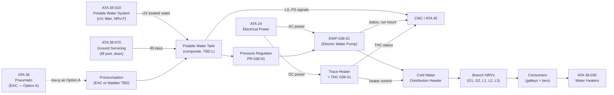
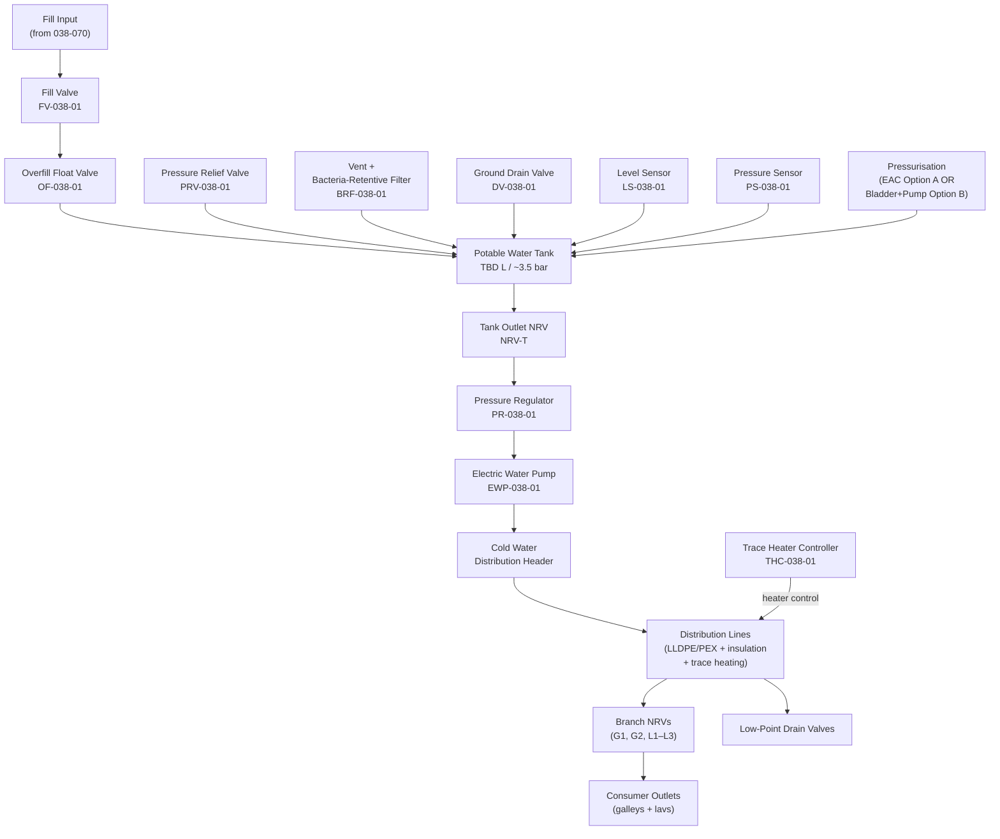
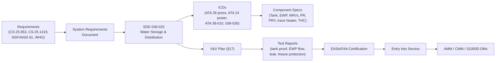

# 038-020 — Water Storage and Distribution
### [PROGRAMME-AIRCRAFT] [PROGRAMME-VARIANT] · ATA 38 · Q+ATLANTIDE ATLAS Scaffold

**Status:**   
**Revision:** 0.1.0 — 2026-05-10  
**Classification:** Q-AIR Primary | Q-MECHANICS / Q-DATAGOV / Q-GREENTECH / Q-GROUND Support

---

## §0 Hyperlink Policy

All cross-references within this document use relative Markdown links anchored to section headings within the Q+ATLANTIDE ATLAS repository. External regulatory references are cited by document identifier only. Internal DMC cross-references follow the pattern `DMC-<PROGRAMME>-<VARIANT>-038-02-YYYY-A`. Where a parameter is not yet determined, the badge  is used inline.

---

## §1 Purpose

This document defines the agnostic ATLAS standard-level architecture context for `038-020 — Water Storage and Distribution`.

It describes the controlled scope, functions, interfaces, safety considerations, lifecycle traceability, and S1000D/CSDB mapping logic that programme implementations shall instantiate when this node is applicable.

This document is not a programme design baseline. Programme-specific capacities, locations, part numbers, effectivity, operating limits, maintenance references, and data module codes shall be defined only inside the applicable programme implementation branch.
## §2 Applicability

| Applicability Level | Rule |
|---|---|
| Standard taxonomy | Applies to the ATLAS node `<NODE>` |
| Programme implementation | Conditional; determined by programme architecture, trade studies, certification basis, and applicability model |
| Product configuration | Defined in the programme-specific configuration baseline |
| Effectivity | Defined in the programme CSDB / applicability layer |
| Non-applicability | Must be explicitly stated in the programme impact-study branch when excluded |
## §3 System/Function Overview

### 3.1 Potable Water Tank

The potable water tank stores pressurised water for all onboard potable water consumers. Key design drivers:

| Parameter | Value |
|---|---|
| Capacity |  (target 80–120 L for 100-pax) |
| Working pressure |  (~3.5 bar gauge) |
| Design pressure (burst) |  (≥ 2× working pressure) |
| Material |  (CFRP shell / PE liner, or PE-lined aluminium — OI-038-001) |
| Location |  (aft belly fairing or forward galley area) |
| Mounting | Structural brackets with vibration isolators TBD |
| Certifying requirement | CS-25.853 (material flammability); NSF/ANSI 61 (potable water contact) TBD |

### 3.2 Electric Water Pump (EWP)

| Parameter | Value |
|---|---|
| Type | Centrifugal, motor-driven |
| Drive | 3-phase AC motor or brushless DC  |
| Rated flow |  L/min at rated head |
| Rated head |  bar |
| Motor power |  W |
| Backup | Gravity/pressure flow from pressurised tank if EWP fails |
| Self-priming | Yes (tank always above EWP inlet) |
| Inlet strainer | Stainless mesh, removable for cleaning |

### 3.3 Distribution Piping

| Parameter | Value |
|---|---|
| Primary tube material | LLDPE or PEX  |
| Tube OD |  (nominal 12–19 mm) |
| Fittings | Push-fit or compression fittings; potable water rated  |
| Clamping | Clipped to structure every TBD mm; vibration-isolated clamps |
| Insulation | Closed-cell foam in cold zones (belly, tail area) |
| Trace heating | Electric trace on cold-zone lines; activated by THC below +4°C |
| Colour coding | Blue = cold potable water; Red = hot water TBD |
| Routing | From aft belly (tank) forward to forward galley; aft galley branch; lavatory branches |

---

## §4 Scope

### 4.1 In-Scope

- Potable water tank (vessel, mounting, liner, fittings)
- Tank accessories: fill valve (FV), overfill float valve (OF), drain valve (DV), pressure-relief valve (PRV), vent + bacteria-retentive filter, level sensor (LS), pressure sensor (PS)
- Tank pressurisation supply connection (EAC or bladder inlet fitting)
- Bladder assembly (if Option B selected — OI-038-002)
- Pressure regulator (PR-038-01) at tank outlet
- Electric Water Pump (EWP-038-01)
- Cold water distribution header and all branch lines to consumers
- Non-Return Valves (NRVs) — fill, outlet, all branches
- Line insulation and trace heating elements
- Trace Heater Controller (THC-038-01) logic and sensors
- Low-point drain valves on distribution lines
- Line supports, clamps, and brackets

### 4.2 Out-of-Scope

- UV sterilisation and activated carbon pre-filter: → [038-010](./038-010-Potable-Water-System.md)
- EWH hot water branches: → [038-030](./038-030-Water-Heaters-and-Service-Interfaces.md)
- Ground fill port assembly: → [038-070](./038-070-Water-and-Waste-Servicing-and-Ground-Interfaces.md)

---

## §5 Architecture Description

### 5.1 Tank and Distribution Overview

```
                    ┌────────────────────────────────────────────────────┐
                    │            POTABLE WATER TANK (TBD L)              │
                    │  ┌──────────────────────────────────────────────┐  │
                    │  │  Pressurised headspace: ~3.5 bar (EAC/bladder)│  │
                    │  └──────────────────────────────────────────────┘  │
                    │                                                      │
  [Fill port] ──FV──→──CF──→ TANK ──→ LS (level)                         │
                    │           │     → PS (pressure)                     │
                    │          OF (overfill float valve)                  │
                    │          DV (drain valve)                           │
                    │          PRV (pressure relief)                      │
                    │          Vent + BRF                                 │
                    └──────────────────────────────────────────────────────┘
                                     │
                              [NRV-T (tank outlet)]
                                     │
                              [PR-038-01 (regulator)]
                                     │
                              [EWP-038-01 (pump)]
                                     │
                          [Cold Water Distribution Header]
             ┌────────────┬─────────────┬──────────────┬─────────────┐
          [NRV-G1]    [NRV-G2]       [NRV-L1]      [NRV-L2]     [NRV-L3]
             │            │              │              │              │
         [Galley FWD] [Galley AFT]   [Lav-1]       [Lav-2]       [Lav-3 TBD]
```

### 5.2 Pressurisation Options

**Option A — EAC (Electric Air Compressor):**
- Low-pressure air (~3.5 bar) from ATA 36 EAC enters tank headspace.
- Tank is an air-over-water type. Water in direct contact with compressed air.
- Advantages: simple; uses existing EAC infrastructure.
- Disadvantages: air contact with water (quality concern); requires water quality management.
- EAC flow: TBD — small volume to maintain headspace; EWP supplements for peak demand.

**Option B — Bladder/Electric Pump:**
- Flexible bladder inside tank; electric pump compresses air side of bladder.
- Water never contacts compressed air.
- Advantages: better water quality; no contamination from air system.
- Disadvantages: heavier; more complex bladder assembly; replacement interval TBD.
- Decision: OI-038-002 

---

## §6 Functional Breakdown

| Component | Function | Qty | Status |
|---|---|---|---|
| Potable water tank | Store pressurised water | 1 | OI-038-001 TBD |
| Fill valve (FV-038-01) | Control fill inlet | 1 |  |
| Overfill float valve (OF-038-01) | Prevent overfill | 1 |  |
| Drain valve (DV-038-01) | Ground maintenance drain | 1 | Manual quarter-turn |
| Pressure relief valve (PRV-038-01) | Tank overpressure protection | 1 | Set at TBD bar |
| Tank vent + bacteria-retentive filter (BRF-038-01) | Vent; prevent contamination | 1 |  |
| Level sensor (LS-038-01) | Capacitive; continuous or 3-point | 1 |  |
| Pressure sensor (PS-038-01) | Monitor headspace pressure | 1 |  |
| EAC connection fitting (Option A) | Interface ATA 36 | 1 | OI-038-002 TBD |
| Bladder assembly (Option B) | Air-water separation | 1 | OI-038-002 TBD |
| Tank outlet NRV (NRV-T) | Check valve at outlet | 1 | Spring-loaded |
| Pressure regulator (PR-038-01) | Reduce to distribution pressure | 1 | TBD set-point |
| Electric Water Pump (EWP-038-01) | Primary distribution pump | 1 | TBD spec |
| NRV-G1, NRV-G2 | Galley branch check valves | 2 | Spring-loaded |
| NRV-L1, NRV-L2, NRV-L3 | Lav branch check valves | 3 (TBD) | Spring-loaded |
| Cold water distribution lines | LLDPE or PEX tubing | TBD m | TBD OD |
| Line insulation | Closed-cell foam | TBD m | Cold zones only |
| Electric trace heater elements | Resistance trace on cold lines | TBD m | TBD W/m |
| Trace Heater Controller (THC-038-01) | Temp-monitoring + heater switching | 1 | AFDX interface |
| Low-point drain valves | Residual water drain | TBD | Manual TBD |
| Clamps and brackets | Line support | TBD | To structure |

---

## §7 System Context Diagram



---

## §8 Internal Functional Architecture



---

## §9 Lifecycle Traceability



---

## §10 Interfaces

| Interface | ATA Chapter | Direction | Signal/Medium | Notes |
|---|---|---|---|---|
| EWP electrical power | ATA 24 | In | AC/DC TBD | Motor power |
| Trace heater electrical power | ATA 24 | In | Low-voltage DC TBD | THC-controlled |
| EAC pressure (Option A) | ATA 36 | In | Low-pressure air ~3.5 bar | Tank pressurisation |
| Fill input | ATA 38-070 / Ground | In | Potable water | Via fill port and carbon filter |
| Treated water to distribution | ATA 38-010 | Bi | Pressurised water | UV-treated water enters header |
| Hot water branch to EWH | ATA 38-030 | Out | Pressurised water | Cold water header → EWH inlet |
| Level and pressure sensors | ATA 38-060 | Out | Digital/analogue | Quantity/pressure to CMC/ECAM |
| CMC monitoring | ATA 45 | Out | AFDX TBD | EWP, THC, sensor data |

---

## §11 Operating Modes

| Mode | Tank State | EWP State | THC State | Notes |
|---|---|---|---|---|
| Normal Flight | Pressurised, water available | Running | Monitoring | All consumers served |
| Ground — Fill | Receiving fill | Off | Monitoring | FV open, OF valve armed |
| Ground — Drain | Draining | Off | Off | DV-038-01 open |
| Cold Soak | Static, cold | Standby | Active (heaters ON) | Trace heaters prevent freeze |
| EWP Fault — Degraded | Pressurised | Off | Monitoring | Gravity/pressure flow only |
| Maintenance | Depressurised | Off | Off | Safe state for R&R |

---

## §12 Monitoring and Diagnostics

| Parameter | Sensor | Alert | Text |
|---|---|---|---|
| Water quantity (%) | LS-038-01 | Amber < 15% TBD | "WATER LO" |
| Tank pressure | PS-038-01 | Advisory out of band | "WATER PRESS" |
| EWP status | Current + speed | Caution on fault | "EWP FAULT" |
| EWP run hours | CMC counter | Maintenance advisory | Maintenance |
| THC status | THC internal monitor | Caution on fault | "TRACE HTR FAULT" |
| Line temperature (cold zones) | NTC probes | Advisory < +4°C | → THC activates |
| PRV activated | Pressure spike / CMC log | Advisory | "WATER PRESS HI" |

---

## §13 Maintenance Concept

| Task | Access | Interval | Skill |
|---|---|---|---|
| Tank visual inspection | Belly fairing panels | C-check TBD | Base |
| Tank drain, flush, and internal inspection | Tank access panel | TBD | Base |
| EWP strainer clean | EWP access panel | C-check TBD | Line/base |
| EWP R&R (removal and replacement) | EWP mounting panel | On condition / schedule TBD | Line/base |
| NRV function check | Rig test at R&R | Per maintenance program | Line/base |
| PRV set-point check | Bench test | Periodic / on condition | Base |
| Trace heater continuity check | Resistance measurement | A-check TBD | Line |
| THC calibration and BITE check | Maintenance terminal | C-check TBD | Line/base |
| Low-point drain valve open check | Drain valve access | C-check TBD | Line |

---

## §14 S1000D/CSDB Mapping

| Document | DMC Pattern | Info Code | Status |
|---|---|---|---|
| System description — storage & dist | DMC-<PROGRAMME>-<VARIANT>-038-02-00A-040A-A | 040 |  |
| Potable water tank description | DMC-<PROGRAMME>-<VARIANT>-038-02-10A-040A-A | 040 |  |
| Tank removal | DMC-<PROGRAMME>-<VARIANT>-038-02-10A-520A-A | 520 |  |
| EWP description | DMC-<PROGRAMME>-<VARIANT>-038-02-20A-040A-A | 040 |  |
| EWP removal | DMC-<PROGRAMME>-<VARIANT>-038-02-20A-520A-A | 520 |  |
| Fault isolation — storage & distribution | DMC-<PROGRAMME>-<VARIANT>-038-02-00A-400A-A | 400 |  |
| Trace heater inspection | DMC-<PROGRAMME>-<VARIANT>-038-02-30A-300A-A | 300 |  |

---

## §15 Footprints

| Parameter | Value |
|---|---|
| Tank capacity |  (80–120 L target) |
| Tank envelope |  |
| Tank mass (empty) |  kg |
| EWP envelope |  |
| EWP mass |  kg |
| Distribution line length |  m total |
| Trace heater total power |  W |
| System mass (dry, excl. tank water) |  kg |

---

## §16 Safety and Certification

| Requirement | Standard | Application |
|---|---|---|
| Freeze protection | CS-25.1419 | Trace heating on all cold-zone water lines |
| Material flammability | CS-25.853 | Tank material and line insulation |
| Potable water contact | NSF/ANSI 61 TBD | Tank liner, tubing, fittings |
| Overpressure protection | CS-25.1301/1309 | PRV-038-01 rated for tank design pressure |
| System safety | CS-25.1309 | EWP failure modes; tank pressurisation loss |
| Water quality | WHO / 14 CFR 121 App A | Tank materials and cleaning regime |
| EMC | CS-25.1353 | EWP motor, THC controller |

---

## §17 Verification and Validation

| Test | Method | Acceptance Criterion | Status |
|---|---|---|---|
| EWP flow test | Bench/rig at rated pressure | ≥ TBD L/min at TBD bar |  |
| Tank leak test | Hydrostatic at 1.5× WP | No leakage for TBD min |  |
| EWH thermal test | Bench thermostat check | Outlet ≤ 60°C; TMV ≤ 43°C TBD |  |
| UV steriliser output test | UV intensity + log-reduction | ≥ 4-log reduction TBD |  |
| Mast heater continuity test | Resistance check at install | Within rated tolerance |  |
| Flush cycle test | Functional rig | Waste ≤ 1.5 s cycle TBD |  |
| Fill-level sensor accuracy | Cal at 0/50/100% | ± TBD % |  |
| Overflow sensor function | Simulated overfill | Alert within TBD s |  |
| Grey water drain flow test | Max simultaneous load | Clear within TBD s |  |
| Potable water quality test | Sample analysis | Meets WHO/FAA standard |  |
| Freeze protection activation test | Cold chamber −40°C TBD | THC activates; no freeze |  |

---

## §18 Glossary

| Term | Definition |
|---|---|
| PWS | Potable Water System |
| EWP | Electric Water Pump |
| EWH | Electric Water Heater |
| VWS | Vacuum Waste System |
| EFV | Electric Flush Valve |
| WIV | Waste Inlet Valve |
| Mast drain | Heated overboard grey drain nozzle |
| EMH | Electric Mast Heater |
| UV sterilisation | UV-C inline water treatment |
| Activated carbon filter | Removes chlorine/taste/odour from fill water |
| LLDPE | Linear Low-Density Polyethylene — potable water tubing |
| PEX | Cross-linked Polyethylene — higher-temperature potable water tubing |
| Capacitive level sensor | Non-contact fluid level sensor |
| NRV | Non-Return Valve — prevents backflow |
| TMV | Thermostatic Mixing Valve — delivers controlled outlet temperature |
| Grey water | Sink drainage (not toilet waste) |
| Black water | Toilet waste |
| Waste tank | Collects toilet waste |
| Freeze protection | Electric trace heating preventing pipe ice |
| Trace heating | Resistance heating on water lines |
| THC | Trace Heater Controller |
| CMC | Central Maintenance Computer |
| BRF | Bacteria-Retentive Filter — tank vent filter |
| PRV | Pressure Relief Valve — tank overpressure protection |

---

## §19 Citations

1. EASA CS-25.853 — Material flammability.
2. EASA CS-25.1301 — Function and installation.
3. EASA CS-25.1309 — Equipment, systems, and installations (safety).
4. EASA CS-25.1419 — Ice protection.
5. WHO, *Guidelines for Drinking-water Quality*, 4th Ed.
6. 14 CFR Part 121 Appendix A — Aircraft Drinking Water Rule.
7. NSF/ANSI 61 — Drinking Water System Components TBD.
8. [038-000 General](./038-000-Water-and-Waste-General.md).
9. [038-010 Potable Water System](./038-010-Potable-Water-System.md).
10. [038-030 Water Heaters](./038-030-Water-Heaters-and-Service-Interfaces.md).

---

## §20 References

| Ref | Document | Notes |
|---|---|---|
| [R1] | CS-25.853 | Material flammability |
| [R2] | CS-25.1419 | Ice protection |
| [R3] | CS-25.1309 | System safety |
| [R4] | NSF/ANSI 61 TBD | Potable water contact materials |
| [R5] | WHO Guidelines 4th Ed. | Water quality |
| [R6] | [038-000](./038-000-Water-and-Waste-General.md) | ATA 38 General |
| [R7] | [038-010](./038-010-Potable-Water-System.md) | PWS overview |
| [R8] | [038-030](./038-030-Water-Heaters-and-Service-Interfaces.md) | Water heaters |
| [R9] | [038-070](./038-070-Water-and-Waste-Servicing-and-Ground-Interfaces.md) | Ground servicing |

---

## §21 Open Issues

| ID | Description | Owner | Status |
|---|---|---|---|
| OI-038-001 | Tank capacity and material (CFRP vs. PE-lined aluminium) | Q-AIR / Q-MECHANICS |  |
| OI-038-002 | Pressurisation method (EAC Option A vs. bladder Option B) | Q-AIR / Q-MECHANICS |  |
| OI-038-003 | EWH count, placement, power budget | Q-AIR / Q-MECHANICS |  |
| OI-038-004 | Grey water retention regulatory review | Q-AIR / ORB-LEG |  |
| OI-038-005 | Waste tank count and capacity | Q-AIR / Q-MECHANICS |  |
| OI-038-006 | Freeze protection strategy (trace heat vs. routing) | Q-AIR / Q-MECHANICS |  |
| OI-038-007 | UV unit certification and maintenance interval | Q-AIR / ORB-LEG |  |
| OI-038-008 | Mast drain count and location | Q-AIR / Q-MECHANICS |  |
| OI-038-009 | Single-point servicing panel location | Q-AIR / Q-GROUND |  |

---

## §22 Change Log

| Revision | Date | Author | Description |
|---|---|---|---|
| 0.1.0 | 2026-05-10 | Q+ATLANTIDE ATLAS Working Group | Initial full-template draft; all 23 sections; tank, EWP, distribution, THC |
| 0.0.0 | 2026-05-10 | Q+ATLANTIDE ATLAS Working Group | Scaffold stub created |
