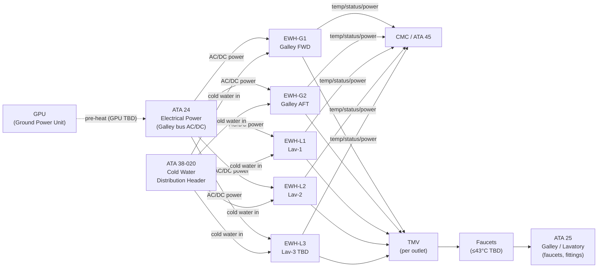
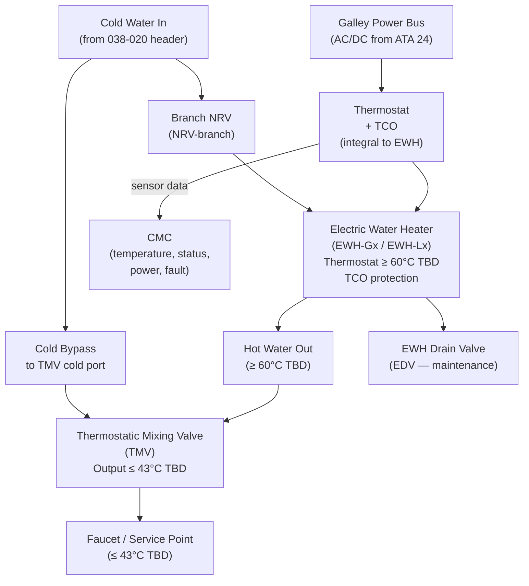
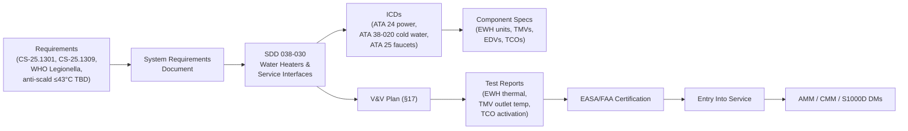

# 038-030 — Water Heaters and Service Interfaces
### AMPEL360e eWTW · ATA 38 · Q+ATLANTIDE ATLAS Scaffold

**Status:**   
**Revision:** 0.1.0 — 2026-05-10  
**Classification:** Q-AIR Primary | Q-MECHANICS / Q-DATAGOV / Q-GREENTECH / Q-GROUND Support

---

## §0 Hyperlink Policy

All cross-references within this document use relative Markdown links anchored to section headings within the Q+ATLANTIDE ATLAS repository. External regulatory references are cited by document identifier only. Internal DMC cross-references follow the pattern `DMC-AMPEL360E-EWTW-038-03-YYYY-A`. Where a parameter is not yet determined, the badge  is used inline.

---

## §1 Purpose

This document describes the **Water Heaters and Service Interfaces** subsystem of ATA 38 for the **AMPEL360e eWTW**. It covers:

1. The Electric Water Heater (EWH) units — type (instant or storage), quantity, power, thermostat settings, and installation locations at each galley and lavatory.
2. The Thermostatic Mixing Valve (TMV) at each hot water outlet — anti-scald protection.
3. Hot water service interfaces: galley faucets, lavatory faucets, hot water connections.
4. Cold water bypass at mixing valves — faucet mixing.
5. EWH drain valves for maintenance.
6. Ground pre-heat capability via Ground Power Unit (GPU).
7. EWH monitoring and fault alerts.
8. Power supply: galley power bus interface.

---

## §2 Applicability

| Item | Value |
|---|---|
| Aircraft Programme | AMPEL360e eWTW |
| Variant | All variants (unless noted) |
| ATA Chapter/Subsubject | 38-030 — Water Heaters and Service Interfaces |
| Document Tier | Level 2 — SDD |
| Effectivity | MSN 0001 onwards  |
| Parent Document | [038-000](./038-000-Water-and-Waste-General.md) / [038-010](./038-010-Potable-Water-System.md) |

---

## §3 System/Function Overview

### 3.1 EWH Architecture on the eWTW

The eWTW uses fully electric water heating — no engine bleed, no APU steam, no heat exchanger from the pneumatic system. Each service point (galley, lavatory) has a dedicated Electric Water Heater (EWH) receiving cold water from the potable water distribution header and delivering hot water locally.

| Parameter | Value |
|---|---|
| EWH type | Instant (tankless) or small-storage  (OI-038-003) |
| EWH power per unit |  (typically 1–2 kW) |
| EWH thermostat set-point |  (typically 60°C — Legionella prevention) |
| TMV outlet temperature |  (typically ≤ 43°C — anti-scald) |
| EWH count |  (1 per galley + 1 per lavatory, OI-038-003) |
| Power bus | Galley power bus (AC 115V or 28V DC ) |
| Ground pre-heat | Yes — GPU energises EWH for catering preparation TBD |

### 3.2 Consumer Summary

| Location | EWH Designation | Type | Power | Qty |
|---|---|---|---|---|
| Galley FWD | EWH-G1 | Instant/storage TBD | TBD kW | 1 |
| Galley AFT | EWH-G2 | Instant/storage TBD | TBD kW | 1 |
| Lavatory-1 | EWH-L1 | Instant/storage TBD | TBD kW | 1 |
| Lavatory-2 | EWH-L2 | Instant/storage TBD | TBD kW | 1 |
| Lavatory-3 | EWH-L3 TBD | Instant/storage TBD | TBD kW | 1 (TBD) |

Total EWH count:  (nominally 4–5 for 2 galleys + 3 lavatories).

---

## §4 Scope

### 4.1 In-Scope

- EWH units — all at galleys and lavatories
- EWH power connections (AC/DC from galley bus)
- EWH thermostat and thermal cutout (TCO) protection
- EWH drain valves (maintenance drain per unit)
- TMV (Thermostatic Mixing Valve) at each hot water outlet
- Hot water service piping from EWH to faucet / service connection
- Cold water bypass piping to faucet mixing tap
- Galley faucet connections (hot + cold inlet fittings)
- Lavatory faucet connections (hot + cold inlet fittings)
- EWH CMC monitoring interface (temperature, on/off status, power consumption, fault)
- Ground pre-heat logic (GPU energisation of EWH)

### 4.2 Out-of-Scope

- Cold water distribution to EWH inlet: → [038-020](./038-020-Water-Storage-and-Distribution.md)
- Galley faucet fixtures and lavatory faucet fixtures (furniture): → ATA 25
- Electrical bus architecture: → ATA 24
- EWP: → [038-020](./038-020-Water-Storage-and-Distribution.md)

---

## §5 Architecture Description

### 5.1 EWH Integration per Service Point

Each service point (galley or lavatory) receives:
- **Cold water in** from distribution header (via NRV branch).
- **EWH** inline on the hot water branch: heats water to thermostat set-point (≥ 60°C TBD).
- **TMV** on hot water outlet: mixes EWH hot output with cold bypass to deliver ≤ 43°C TBD at faucet.
- **EWH drain valve (EDV)**: manual drain for maintenance depressurisation and replacement.
- **Thermal cutout (TCO)**: auto-reset or manual-reset safety device preventing overheating.

```
[Cold Water Header] ──→ [NRV-branch] ──┬──→ [EWH cold inlet]──[EWH]──→ [EWH hot outlet]
                                        │                                         │
                                        └──→ [Cold bypass to TMV cold inlet] ──→ [TMV]
                                                                                   │
                                                                           [Faucet (≤43°C)]
                                                                           [Drain valve EDV]
```

### 5.2 EWH Types

| Type | Instant (tankless) | Small storage (e.g. 1–2 L) |
|---|---|---|
| Response time | Immediate | Slight lag while reheating |
| Power demand | Higher peak (2–3 kW) | Lower peak (1–2 kW) |
| Size | Compact | Larger (tank volume) |
| Legionella risk | Lower (no standing water) | Higher if set-point not maintained |
| Maintenance | Simpler | Tank flush required periodically |
| Selection | OI-038-003 TBD | OI-038-003 TBD |

### 5.3 Ground Pre-heat

When aircraft is on GPU (Ground Power Unit), EWH units can be energised from the galley power bus for catering preparation before boarding. This ensures hot water is available from gate departure. GPU activation of EWH: TBD (manual switch or automatic via galley power-up sequence). OI-038-003 TBD.

---

## §6 Functional Breakdown

| Component | Function | Qty | Status |
|---|---|---|---|
| EWH-G1 (Galley FWD) | Heat water for galley FWD faucet | 1 |  |
| EWH-G2 (Galley AFT) | Heat water for galley AFT faucet | 1 |  |
| EWH-L1 (Lavatory-1) | Heat water for lav-1 faucet | 1 |  |
| EWH-L2 (Lavatory-2) | Heat water for lav-2 faucet | 1 |  |
| EWH-L3 (Lavatory-3 TBD) | Heat water for lav-3 faucet | 1 (TBD) |  |
| TMV per EWH outlet | Anti-scald; deliver ≤ 43°C TBD | TBD (1 per EWH) |  |
| EWH drain valve (EDV) | Maintenance drain per EWH | TBD (1 per EWH) | Manual quarter-turn |
| EWH thermostat | Set-point controller ≥ 60°C TBD | Per EWH | Integral to EWH |
| EWH thermal cutout (TCO) | Over-temperature safety shutoff | Per EWH | Integral, auto or manual reset |
| EWH power connection | AC/DC from galley bus | Per EWH | Per ATA 24 |

---

## §7 System Context Diagram



---

## §8 Internal Functional Architecture



---

## §9 Lifecycle Traceability



---

## §10 Interfaces

| Interface | ATA Chapter | Direction | Signal/Medium | Notes |
|---|---|---|---|---|
| Electrical power — EWH | ATA 24 | In | AC galley bus (115V or 28V DC TBD) | Heater element power; thermostat control |
| GPU pre-heat | ATA 24 | In | GPU bus | Pre-heat EWH before departure (TBD) |
| Cold water in | ATA 38-020 | In | Pressurised potable water | From distribution header branch |
| Hot water out to faucet | ATA 25 | Out | Hot water ≤ 43°C (via TMV) | Galley and lavatory faucets |
| EWH temperature monitoring | ATA 38-060 | Out | Analogue/digital | To CMC; heater temp, on/off, fault |
| CMC fault reporting | ATA 45 | Out | AFDX TBD | "EWH FAULT" alert |
| EWH drain (maintenance) | ATA 38-070 | Out | Fluid | Manual drain at servicing |

---

## §11 Operating Modes

| Mode | EWH State | TMV State | Notes |
|---|---|---|---|
| Normal Flight | Thermostatically controlled (on/off cycling) | Active | Outlet ≤ 43°C TBD; cycled by thermostat |
| Ground — GPU pre-heat | Heating (GPU power) | Active | Pre-heat for catering TBD |
| Ground — No power | Off | Passive | No hot water; cold water available via pressure |
| Maintenance drain | Off, depressurised | Passive | EDV open; EWH drained for replacement |
| EWH Fault — Degraded | Off (fault isolation) | Cold water bypass | Cold water only at faucet; "EWH FAULT" |
| TCO activated | Off (over-temp cutout) | Cold water bypass | Manual reset required TBD; "EWH FAULT" |

---

## §12 Monitoring and Diagnostics

| Parameter | Sensor | CMC Signal | Alert |
|---|---|---|---|
| EWH water temperature | NTC thermistor (integral) | AFDX | "EWH FAULT" (caution) if below set-point or over-temp |
| EWH on/off status | Current monitor | AFDX | "EWH FAULT" if unexpected state |
| EWH power consumption | Watt meter (integral or external) | CMC log | Maintenance advisory on drift |
| TCO activation | Discrete output | AFDX | "EWH FAULT" (caution); manual reset required |
| EWH energy accumulation | CMC energy counter | CMC log | Maintenance advisory at TBD kWh |

---

## §13 Maintenance Concept

| Task | Access | Interval | Skill |
|---|---|---|---|
| EWH visual inspection | Galley/lavatory panel | A-check TBD | Line maintenance |
| EWH thermostat calibration check | Bench test (at R&R) | Periodic / on condition | Base maintenance |
| EWH R&R (removal and replacement) | Galley/lavatory under-counter | On condition | Line/base |
| TMV set-point verification | Outlet temperature measurement | C-check TBD | Line maintenance |
| TMV R&R | Same as EWH access | On condition | Line/base |
| EDV function check | Open/close test | C-check TBD | Line |
| EWH storage type — tank flush | Via EDV | Per maintenance program (Legionella prevention) | Line |
| BITE / CMC fault review | CMC terminal | Each visit | Line |

---

## §14 S1000D/CSDB Mapping

| Document | DMC Pattern | Info Code | Status |
|---|---|---|---|
| System description — water heaters | DMC-AMPEL360E-EWTW-038-03-00A-040A-A | 040 |  |
| EWH description (general) | DMC-AMPEL360E-EWTW-038-03-10A-040A-A | 040 |  |
| EWH removal | DMC-AMPEL360E-EWTW-038-03-10A-520A-A | 520 |  |
| EWH installation | DMC-AMPEL360E-EWTW-038-03-10A-720A-A | 720 |  |
| EWH tank flush (storage type) | DMC-AMPEL360E-EWTW-038-03-10A-810A-A | 810 |  |
| TMV removal | DMC-AMPEL360E-EWTW-038-03-20A-520A-A | 520 |  |
| Fault isolation — water heaters | DMC-AMPEL360E-EWTW-038-03-00A-400A-A | 400 |  |

---

## §15 Footprints

| Parameter | Value |
|---|---|
| EWH count |  (nominally 4–5) |
| EWH power per unit |  (1–2 kW) |
| Total EWH power (simultaneous) |  (4–10 kW total TBD) |
| EWH thermostat set-point |  (≥ 60°C) |
| TMV outlet temperature |  (≤ 43°C) |
| EWH envelope (per unit) |  |
| EWH mass (per unit) |  kg |
| Total EWH system mass |  kg |

---

## §16 Safety and Certification

| Requirement | Standard | Application |
|---|---|---|
| Equipment installation | CS-25.1301 | All EWH and TMV units |
| System safety | CS-25.1309 | EWH failure modes; TCO protection |
| Anti-scald protection | Building/aviation standard TBD ≤ 43°C | TMV limits outlet temperature |
| Legionella prevention | WHO / HSG274 equivalent TBD | EWH set-point ≥ 60°C; periodic flush |
| Flammability | CS-25.853 | EWH body material and installation insulation |
| EMC | CS-25.1353 | EWH power electronics, thermostat |
| Potable water contact | NSF/ANSI 61 TBD | EWH wetted parts, TMV internals |
| Over-temperature protection | TCO per IEC 60335 equivalent TBD | Integral TCO in each EWH |

---

## §17 Verification and Validation

| Test | Method | Acceptance Criterion | Status |
|---|---|---|---|
| EWP flow test | Bench/rig at rated pressure | ≥ TBD L/min |  |
| Tank leak test | Hydrostatic at 1.5× WP | No leakage TBD min |  |
| EWH thermal test | Bench; thermostat set-point verification | Outlet ≥ 60°C (EWH), TMV ≤ 43°C TBD |  |
| UV steriliser output test | UV intensity + log-reduction | ≥ 4-log TBD |  |
| Mast heater continuity test | Resistance at installation | Within tolerance |  |
| Flush cycle test | Functional rig | Waste ≤ 1.5 s TBD |  |
| Fill-level sensor accuracy | Cal at 0/50/100% | ± TBD % |  |
| Overflow sensor function | Simulated overfill | Alert within TBD s |  |
| Grey water drain flow test | Max simultaneous load | Clear within TBD s |  |
| Potable water quality test | Sample analysis | Meets WHO/FAA standard |  |
| Freeze protection activation test | Cold chamber −40°C TBD | THC activates; no freeze |  |
| TCO activation test | Over-temperature on bench | TCO trips at TBD °C; power isolated |  |

---

## §18 Glossary

| Term | Definition |
|---|---|
| PWS | Potable Water System |
| EWP | Electric Water Pump |
| EWH | Electric Water Heater — point-of-use or storage electric heater |
| VWS | Vacuum Waste System |
| EFV | Electric Flush Valve |
| WIV | Waste Inlet Valve |
| Mast drain | Heated overboard grey drain nozzle |
| EMH | Electric Mast Heater |
| UV sterilisation | UV-C inline water treatment |
| Activated carbon filter | Removes chlorine/taste/odour |
| LLDPE | Linear Low-Density Polyethylene tubing |
| PEX | Cross-linked Polyethylene tubing |
| Capacitive level sensor | Non-contact fluid level sensor |
| NRV | Non-Return Valve |
| TMV | Thermostatic Mixing Valve — limits hot water outlet temperature |
| Grey water | Sink drainage |
| Black water | Toilet waste |
| Waste tank | Toilet waste storage vessel |
| Freeze protection | Trace heating preventing pipe ice |
| Trace heating | Resistance elements on water lines |
| THC | Trace Heater Controller |
| CMC | Central Maintenance Computer |
| TCO | Thermal Cutout — EWH over-temperature safety device |
| EDV | EWH Drain Valve — maintenance drain per EWH unit |
| GPU | Ground Power Unit |
| Legionella | Bacterium that proliferates in warm stagnant water; prevented by ≥ 60°C set-point |

---

## §19 Citations

1. EASA CS-25.1301 — Function and installation.
2. EASA CS-25.1309 — Equipment, systems, and installations.
3. EASA CS-25.853 — Material flammability.
4. WHO, *Guidelines for Drinking-water Quality*, 4th Ed. (Legionella section).
5. UK HSG274 — Legionella control (or ASHRAE 188 equivalent) TBD.
6. NSF/ANSI 61 — Drinking Water System Components TBD.
7. IEC 60335 (or equivalent) — Household electrical appliances safety TBD.
8. [038-000 General](./038-000-Water-and-Waste-General.md).
9. [038-010 Potable Water System](./038-010-Potable-Water-System.md).
10. [038-020 Water Storage and Distribution](./038-020-Water-Storage-and-Distribution.md).

---

## §20 References

| Ref | Document | Notes |
|---|---|---|
| [R1] | CS-25.1301 | Equipment installation |
| [R2] | CS-25.1309 | System safety |
| [R3] | CS-25.853 | Material flammability |
| [R4] | WHO Guidelines 4th Ed. | Legionella; hot water |
| [R5] | NSF/ANSI 61 TBD | Potable water contact |
| [R6] | [038-000](./038-000-Water-and-Waste-General.md) | ATA 38 General |
| [R7] | [038-010](./038-010-Potable-Water-System.md) | PWS |
| [R8] | [038-020](./038-020-Water-Storage-and-Distribution.md) | Storage & distribution |
| [R9] | [038-060](./038-060-Water-and-Waste-Indication-and-Warning.md) | Indication & warning |

---

## §21 Open Issues

| ID | Description | Owner | Status |
|---|---|---|---|
| OI-038-001 | Tank capacity and material | Q-AIR / Q-MECHANICS |  |
| OI-038-002 | Tank pressurisation method | Q-AIR / Q-MECHANICS |  |
| OI-038-003 | EWH count, type (instant vs. storage), placement, power budget | Q-AIR / Q-MECHANICS |  |
| OI-038-004 | Grey water retention regulatory review | Q-AIR / ORB-LEG |  |
| OI-038-005 | Waste tank count and capacity | Q-AIR / Q-MECHANICS |  |
| OI-038-006 | Freeze protection strategy | Q-AIR / Q-MECHANICS |  |
| OI-038-007 | UV sterilisation certification and maintenance interval | Q-AIR / ORB-LEG |  |
| OI-038-008 | Mast drain count and location | Q-AIR / Q-MECHANICS |  |
| OI-038-009 | Single-point servicing panel location | Q-AIR / Q-GROUND |  |

---

## §22 Change Log

| Revision | Date | Author | Description |
|---|---|---|---|
| 0.1.0 | 2026-05-10 | Q+ATLANTIDE ATLAS Working Group | Initial full-template draft; all 23 sections; EWH, TMV, anti-scald, Legionella |
| 0.0.0 | 2026-05-10 | Q+ATLANTIDE ATLAS Working Group | Scaffold stub created |
