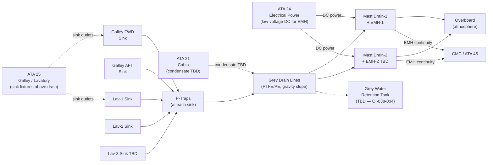
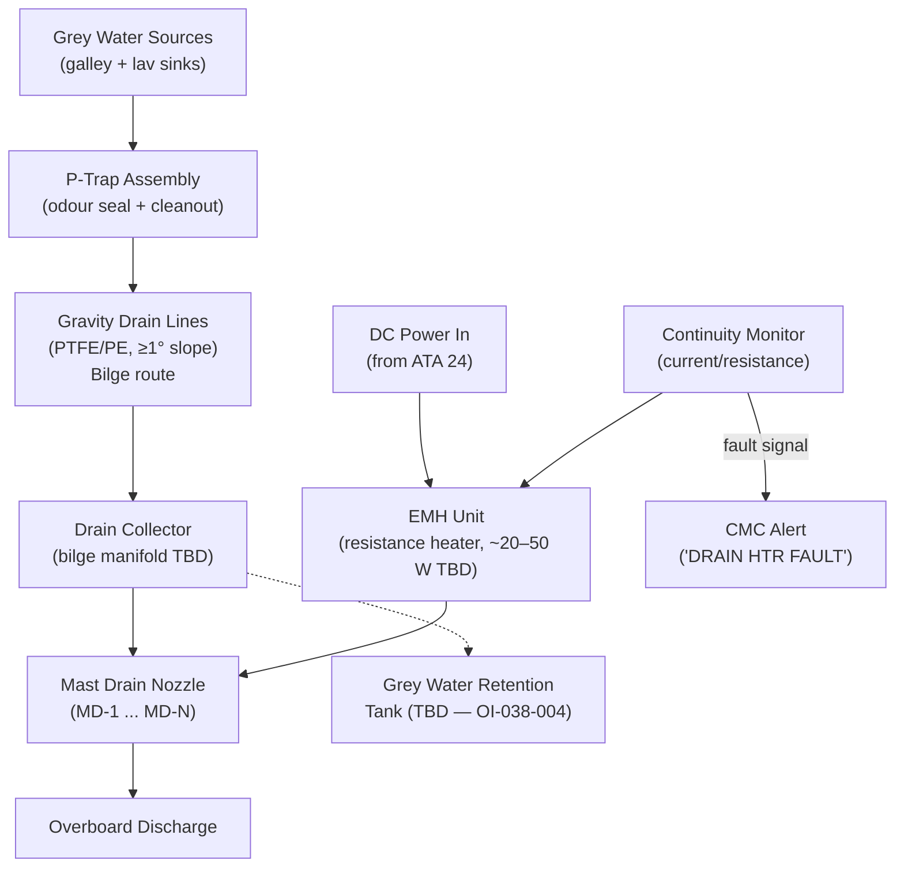
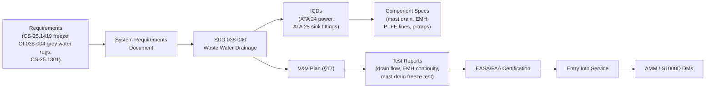

# 038-040 — Waste Water Drainage
### AMPEL360e eWTW · ATA 38 · Q+ATLANTIDE ATLAS Scaffold

**Status:**   
**Revision:** 0.1.0 — 2026-05-10  
**Classification:** Q-AIR Primary | Q-MECHANICS / Q-DATAGOV / Q-GREENTECH / Q-GROUND Support

---

## §0 Hyperlink Policy

All cross-references within this document use relative Markdown links anchored to section headings within the Q+ATLANTIDE ATLAS repository. External regulatory references are cited by document identifier only. Internal DMC cross-references follow the pattern `DMC-AMPEL360E-EWTW-038-04-YYYY-A`. Where a parameter is not yet determined, the badge  is used inline.

---

## §1 Purpose

This document describes the **Waste Water Drainage** (grey water) subsystem of ATA 38 for the **AMPEL360e eWTW**. It covers:

1. Grey water sources: galley sinks and lavatory sinks (not toilet waste — that is ATA 38-050).
2. Gravity drain line routing from each sink to mast drain nozzles on the lower fuselage.
3. Mast drain nozzle design: overboard drain, electrically heated (EMH — Electric Mast Heater) to prevent ice blockage.
4. Drain line materials: PTFE-lined or polyethylene, slopes, supports, and p-trap cleanouts.
5. Galley waste condensate routing TBD (potential routing to grey drain).
6. Grey water retention requirement: regulatory review pending (OI-038-004).
7. Separation from black water (toilet waste) circuit: physical separation maintained at all points.
8. EMH monitoring: continuity check, CMC "DRAIN HTR FAULT" alert.

---

## §2 Applicability

| Item | Value |
|---|---|
| Aircraft Programme | AMPEL360e eWTW |
| Variant | All variants (unless noted) |
| ATA Chapter/Subsubject | 38-040 — Waste Water Drainage |
| Document Tier | Level 2 — SDD |
| Effectivity | MSN 0001 onwards  |
| Parent Document | [038-000](./038-000-Water-and-Waste-General.md) |

---

## §3 System/Function Overview

### 3.1 Grey Water Sources

Grey water on the eWTW originates from:

| Source | Location | Qty |
|---|---|---|
| Galley FWD sink | Forward galley area | 1 |
| Galley AFT sink | Aft galley area | 1 |
| Lavatory-1 sink | Lavatory-1 | 1 |
| Lavatory-2 sink | Lavatory-2 | 1 |
| Lavatory-3 sink | Lavatory-3 (TBD) | 1 (TBD) |
| Galley cooling condensate | Galley equipment drain | TBD |

**Total grey water drain points:** TBD (~4–5 sinks plus condensate TBD).

Grey water does **not** include toilet waste (black water). The toilet waste circuit is entirely separate and described in [038-050](./038-050-Toilet-and-Vacuum-Waste-System.md).

### 3.2 Drain System Overview

- **Principle:** Gravity drain — sloped drain lines (minimum slope: TBD, typically ≥ 1° / 17 mm per metre) routing downward from each sink p-trap through the bilge to the mast drain exit fittings on the lower fuselage.
- **Mast drain nozzles:** Overboard nozzles with electrically heated shrouds (EMH) to prevent ice formation at the drain outlet during flight in icing conditions. Drain overboard during flight; no grey water retention tank (TBD — OI-038-004).
- **Line material:** PTFE-lined stainless or polyethylene; food/grey-water compatible; easy to inspect and clean.
- **P-traps:** At each sink drain outlet; removable cleanout plugs for maintenance.

### 3.3 Grey Water Retention Option (OI-038-004)

Current baseline: grey water drains overboard via mast drains (no retention tank). Regulatory review in progress (OI-038-004). If regulations require grey water retention (e.g. port environmental rules), a grey water retention tank would be added aft of the bilge drain system. This document will be updated once OI-038-004 is resolved.

---

## §4 Scope

### 4.1 In-Scope

- Sink drain fittings (drain outlet at each galley and lavatory sink)
- P-trap assemblies (removable, at each sink)
- Grey water drain lines: PTFE-lined or PE; from p-trap to mast drain manifold
- Drain line supports and clamps (minimum slope maintained)
- Drain line cleanout access points (bilge access panels)
- Mast drain nozzle assemblies (drain nozzle + EMH heating element)
- Electric Mast Heater (EMH) units — resistance elements, power connection
- EMH monitoring: continuity (current/resistance monitor), CMC interface
- Grey water retention tank (if required by OI-038-004 — TBD)
- Separation from black water system (physical; no shared pipework)

### 4.2 Out-of-Scope

- Toilet waste system (black water): → [038-050](./038-050-Toilet-and-Vacuum-Waste-System.md)
- Potable water system: → [038-010](./038-010-Potable-Water-System.md)
- Galley sink fixtures (above drain outlet): → ATA 25
- Cabin condensate drain (if separate from grey drain): → ATA 21

---

## §5 Architecture Description

### 5.1 Drain Routing

```
[Galley FWD sink] ──[p-trap G1]──┐
[Galley AFT sink] ──[p-trap G2]──┤
                                  ├──[Grey drain collector line — bilge route]──→ [Mast Drain-1] → Overboard
[Lav-1 sink] ──[p-trap L1]───────┤
[Lav-2 sink] ──[p-trap L2]───────┤──[Grey drain line — bilge route]──────────→ [Mast Drain-2] → Overboard
[Lav-3 sink] ──[p-trap L3 TBD]──┘
[Galley condensate TBD] ──────────── route to grey drain TBD
```

**Mast drain count:**  (~2–4, OI-038-008). Each mast drain fitted with EMH.

### 5.2 Mast Drain Nozzle

The mast drain nozzle protrudes through the lower fuselage skin. It incorporates:
- **Drain channel:** PTFE-lined bore; drain opens downward/rearward.
- **EMH element:** Resistance heater bonded to nozzle body; keeps nozzle above freezing during flight.
- **Seal:** Sealed penetration through fuselage skin with aerodynamic fairing TBD.
- **Drain cover:** Open drain (no valve); gravity drains continuously during flight.

### 5.3 Drain Line Material and Slope

| Parameter | Requirement |
|---|---|
| Drain line material | PTFE-lined stainless steel or polyethylene (PE) TBD |
| Line OD |  (typical ~25–38 mm for gravity drain) |
| Minimum slope |  (typically ≥ 1°, ~17 mm/m) |
| Joints | Push-fit or flanged; cleanable TBD |
| Colour coding | Grey or clear (distinct from potable water) TBD |
| Insulation | Not required (ambient temp drain) unless routed through cold zone |

---

## §6 Functional Breakdown

| Component | Function | Qty | Status |
|---|---|---|---|
| Sink drain fitting (G1, G2) | Outlet fitting at galley sink | 2 |  |
| Sink drain fitting (L1, L2, L3) | Outlet fitting at lav sink | 3 (TBD) |  |
| P-trap (G1, G2, L1–L3) | Odour barrier; cleanout | TBD (1 per sink) | Removable |
| Grey drain lines | Gravity drain from p-trap to mast | TBD m | PTFE/PE |
| Drain line supports | Slope-maintaining clamps | TBD | Structural |
| Cleanout access panels | Bilge access for drain maintenance | TBD | Per design |
| Mast drain nozzles (MD-1, MD-2, etc.) | Overboard drain; aerodynamic | TBD (~2–4) | OI-038-008 |
| EMH units (EMH-1, EMH-2, etc.) | Prevent ice at mast drain | TBD (1 per mast) | TBD ~20–50 W each |
| EMH power connections | Low-voltage DC from ATA 24 | TBD | TBD |
| EMH monitoring (current/resist.) | Detect open-circuit heater fault | TBD (1 per EMH) | AFDX to CMC |
| Grey water retention tank (TBD) | Store grey water if regulations require | 0 (TBD if OI-038-004) | OI-038-004 |

---

## §7 System Context Diagram



---

## §8 Internal Functional Architecture



---

## §9 Lifecycle Traceability



---

## §10 Interfaces

| Interface | ATA Chapter | Direction | Signal/Medium | Notes |
|---|---|---|---|---|
| EMH electrical power | ATA 24 | In | Low-voltage DC TBD | EMH heater elements |
| Sink drain connections | ATA 25 | In | Grey water (fluid) | Galley and lavatory sink outlets |
| Galley condensate drain | ATA 25 | In | Condensate fluid (TBD) | Routing to grey drain TBD |
| Cabin condensate | ATA 21 | In | Condensate (TBD) | Potential routing to grey drain |
| EMH status to CMC | ATA 45 | Out | Digital/AFDX | Continuity/fault signal |
| Grey water retention (if OI-038-004) | ATA 38-070 | Out | Grey water | Retention tank service point TBD |

---

## §11 Operating Modes

| Mode | Drain Line State | EMH State | Notes |
|---|---|---|---|
| Normal Flight (all altitudes) | Gravity draining continuously | Active (icing conditions) | EMH on when temp sensor < threshold TBD |
| Ground — Hot day | Gravity draining | EMH off | No ice risk |
| Ground — Cold weather | Gravity draining | EMH may be active | Prevent nozzle freeze on ground |
| Icing conditions in flight | Gravity draining | EMH active | Critical — EMH prevents exit ice |
| Maintenance | Lines depressurised; accessible | Off | P-trap removal; line inspection |
| EMH Fault | Drain continues (gravity) | Off (fault) | "DRAIN HTR FAULT" caution; monitor for ice |

---

## §12 Monitoring and Diagnostics

| Parameter | Sensor | CMC Signal | Alert |
|---|---|---|---|
| EMH-1 continuity | Current/resistance monitor (CMH-1) | AFDX | "DRAIN HTR FAULT" (caution) |
| EMH-2 continuity | Current/resistance monitor (CMH-2) | AFDX | "DRAIN HTR FAULT" (caution) |
| EMH temperature (TBD) | NTC at nozzle (TBD) | AFDX | Advisory if below threshold |
| Grey water line blockage | None (gravity; no active sensor) | N/A | Detected by inspection only |

Note: Grey water drain lines do not carry active flow sensors. Blockage is detected by periodic maintenance inspection. EMH fault is the primary airworthiness-relevant alert for this subsystem.

---

## §13 Maintenance Concept

| Task | Access | Interval | Skill |
|---|---|---|---|
| P-trap inspection and clean | Galley/lav under-counter | A-check or per catering clean | Line |
| Grey drain line visual inspection | Bilge access panels | C-check TBD | Line/base |
| Mast drain nozzle inspection | Lower fuselage belly | C-check TBD | Base |
| Mast drain nozzle clean (scale/residue) | Mast drain access | C-check TBD | Base |
| EMH continuity test | Resistance measurement at access | A-check TBD | Line |
| EMH R&R | Mast drain removal access | On condition | Base |
| Drain line blockage clearance | Bilge access / p-trap | On condition | Line/base |
| Grey water retention tank drain (if fitted) | Service panel | Per turn / OI-038-004 | Line |

---

## §14 S1000D/CSDB Mapping

| Document | DMC Pattern | Info Code | Status |
|---|---|---|---|
| System description — grey water drainage | DMC-AMPEL360E-EWTW-038-04-00A-040A-A | 040 |  |
| Mast drain description | DMC-AMPEL360E-EWTW-038-04-10A-040A-A | 040 |  |
| Mast drain inspection | DMC-AMPEL360E-EWTW-038-04-10A-300A-A | 300 |  |
| EMH removal | DMC-AMPEL360E-EWTW-038-04-20A-520A-A | 520 |  |
| P-trap clean | DMC-AMPEL360E-EWTW-038-04-30A-810A-A | 810 |  |
| Fault isolation — grey water drain | DMC-AMPEL360E-EWTW-038-04-00A-400A-A | 400 |  |

---

## §15 Footprints

| Parameter | Value |
|---|---|
| Mast drain count |  (~2–4, OI-038-008) |
| EMH power per unit |  (~20–50 W) |
| Total EMH power |  |
| Grey drain line length (total) |  m |
| Line diameter |  (typical ~25–38 mm) |
| Minimum slope |  (≥ 1°) |
| System mass (grey drain) |  kg |

---

## §16 Safety and Certification

| Requirement | Standard | Application |
|---|---|---|
| Freeze protection — mast drain | CS-25.1419 | EMH prevents ice blockage of overboard drain |
| Equipment installation | CS-25.1301 | Mast drain nozzle, EMH installation |
| System safety | CS-25.1309 | EMH failure mode; drain blockage consequence |
| Material flammability | CS-25.853 | Drain line material in cabin/bilge zones |
| Grey water disposal (regulatory) | OI-038-004 — regulatory review pending | Overboard drain vs. retention tank |
| Separation from potable water | NRV and physical separation | Grey circuit never contacts clean circuit |
| EMC | CS-25.1353 | EMH power connections |

---

## §17 Verification and Validation

| Test | Method | Acceptance Criterion | Status |
|---|---|---|---|
| EWP flow test | Bench/rig | ≥ TBD L/min |  |
| Tank leak test | Hydrostatic 1.5× WP | No leakage TBD min |  |
| EWH thermal test | Bench thermostat | Outlet ≥ 60°C; TMV ≤ 43°C TBD |  |
| UV steriliser output test | UV intensity + log-reduction | ≥ 4-log TBD |  |
| Mast heater continuity test | Resistance at installation | Within rated tolerance |  |
| Flush cycle test | Functional rig | Waste ≤ 1.5 s TBD |  |
| Fill-level sensor accuracy | Cal 0/50/100% | ± TBD % |  |
| Overflow sensor function | Simulated overfill | Alert within TBD s |  |
| Grey water drain flow test | Max simultaneous sink load | All drains clear within TBD s |  |
| Potable water quality test | Sample analysis | Meets WHO/FAA standard |  |
| Freeze protection activation test | Cold chamber −40°C TBD | THC / EMH activate; no ice |  |

---

## §18 Glossary

| Term | Definition |
|---|---|
| PWS | Potable Water System |
| EWP | Electric Water Pump |
| EWH | Electric Water Heater |
| VWS | Vacuum Waste System |
| EFV | Electric Flush Valve |
| WIV | Waste Inlet Valve |
| Mast drain | Overboard grey water drain nozzle on lower fuselage |
| EMH | Electric Mast Heater — resistance heater on mast drain nozzle |
| UV sterilisation | UV-C inline potable water treatment |
| Activated carbon filter | Filter at potable water fill point |
| LLDPE | Linear Low-Density Polyethylene tubing |
| PEX | Cross-linked Polyethylene tubing |
| Capacitive level sensor | Non-contact level sensor |
| NRV | Non-Return Valve |
| TMV | Thermostatic Mixing Valve |
| Grey water | Sink drainage (not toilet waste) |
| Black water | Toilet waste |
| Waste tank | Toilet waste storage vessel |
| Freeze protection | Trace/mast heating system preventing ice |
| Trace heating | Resistance elements on water/drain lines |
| THC | Trace Heater Controller |
| CMC | Central Maintenance Computer |
| P-trap | Sink drain trap providing odour barrier; removable for cleaning |
| PTFE | Polytetrafluoroethylene — drain line liner material |

---

## §19 Citations

1. EASA CS-25.1419 — Ice protection.
2. EASA CS-25.1301 — Function and installation.
3. EASA CS-25.1309 — System safety.
4. EASA CS-25.853 — Material flammability.
5. OI-038-004 — Grey water retention regulatory review.
6. [038-000 General](./038-000-Water-and-Waste-General.md).
7. [038-050 Toilet and Vacuum Waste System](./038-050-Toilet-and-Vacuum-Waste-System.md) — black water system.
8. [038-060 Indication and Warning](./038-060-Water-and-Waste-Indication-and-Warning.md).
9. [038-070 Servicing and Ground Interfaces](./038-070-Water-and-Waste-Servicing-and-Ground-Interfaces.md).

---

## §20 References

| Ref | Document | Notes |
|---|---|---|
| [R1] | CS-25.1419 | Freeze protection (EMH) |
| [R2] | CS-25.1301 | Installation |
| [R3] | CS-25.1309 | System safety |
| [R4] | CS-25.853 | Flammability |
| [R5] | OI-038-004 | Grey water retention review |
| [R6] | [038-000](./038-000-Water-and-Waste-General.md) | ATA 38 General |
| [R7] | [038-050](./038-050-Toilet-and-Vacuum-Waste-System.md) | Black water system |
| [R8] | [038-060](./038-060-Water-and-Waste-Indication-and-Warning.md) | Indication |
| [R9] | [038-070](./038-070-Water-and-Waste-Servicing-and-Ground-Interfaces.md) | Ground servicing |

---

## §21 Open Issues

| ID | Description | Owner | Status |
|---|---|---|---|
| OI-038-001 | Tank capacity and material | Q-AIR / Q-MECHANICS |  |
| OI-038-002 | Tank pressurisation method | Q-AIR / Q-MECHANICS |  |
| OI-038-003 | EWH count, placement, power budget | Q-AIR / Q-MECHANICS |  |
| OI-038-004 | Grey water retention regulatory review (overboard drain vs. retention tank) | Q-AIR / ORB-LEG |  |
| OI-038-005 | Waste tank count and capacity | Q-AIR / Q-MECHANICS |  |
| OI-038-006 | Freeze protection strategy (trace heat vs. routing) | Q-AIR / Q-MECHANICS |  |
| OI-038-007 | UV sterilisation certification and interval | Q-AIR / ORB-LEG |  |
| OI-038-008 | Mast drain count and location | Q-AIR / Q-MECHANICS |  |
| OI-038-009 | Single-point servicing panel location | Q-AIR / Q-GROUND |  |

---

## §22 Change Log

| Revision | Date | Author | Description |
|---|---|---|---|
| 0.1.0 | 2026-05-10 | Q+ATLANTIDE ATLAS Working Group | Initial full-template draft; all 23 sections; grey water drain, mast drain, EMH |
| 0.0.0 | 2026-05-10 | Q+ATLANTIDE ATLAS Working Group | Scaffold stub created |
