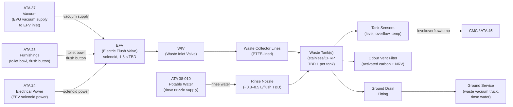
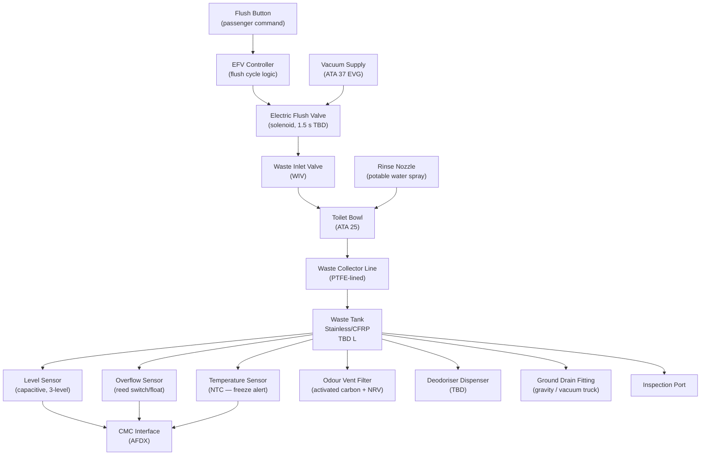
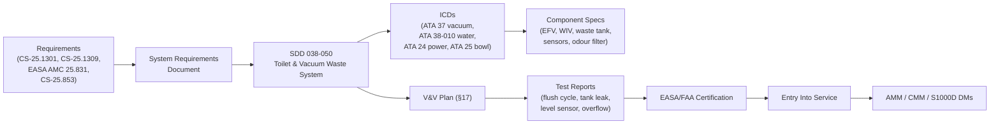

# 038-050 — Toilet and Vacuum Waste System
### [PROGRAMME-AIRCRAFT] [PROGRAMME-VARIANT] · ATA 38 · Q+ATLANTIDE ATLAS Scaffold

**Status:**   
**Revision:** 0.1.0 — 2026-05-10  
**Classification:** Q-AIR Primary | Q-MECHANICS / Q-DATAGOV / Q-GREENTECH / Q-GROUND Support

---

## §0 Hyperlink Policy

All cross-references within this document use relative Markdown links anchored to section headings within the Q+ATLANTIDE ATLAS repository. External regulatory references are cited by document identifier only. Internal DMC cross-references follow the pattern `DMC-<PROGRAMME>-<VARIANT>-038-05-YYYY-A`. Where a parameter is not yet determined, the badge  is used inline.

---

## §1 Purpose

This document defines the agnostic ATLAS standard-level architecture context for `038-050 — Toilet and Vacuum Waste System`.

It describes the controlled scope, functions, interfaces, safety considerations, lifecycle traceability, and S1000D/CSDB mapping logic that programme implementations shall instantiate when this node is applicable.

This document is not a programme design baseline. Programme-specific capacities, locations, part numbers, effectivity, operating limits, maintenance references, and data module codes shall be defined only inside the applicable programme implementation branch.
## §2 Applicability

| Applicability Level | Rule |
|---|---|
| Standard taxonomy | Applies to the ATLAS node `<NODE>` |
| Programme implementation | Conditional; determined by programme architecture, trade studies, certification basis, and applicability model |
| Product configuration | Defined in the programme-specific configuration baseline |
| Effectivity | Defined in the programme CSDB / applicability layer |
| Non-applicability | Must be explicitly stated in the programme impact-study branch when excluded |
## §3 System/Function Overview

### 3.1 Toilet System Architecture

The [PROGRAMME-VARIANT] uses a vacuum-flush toilet system where differential pressure (cabin pressure above waste-line pressure) transports waste from the toilet bowl to the waste tank. The vacuum is generated by the Electric Vacuum Generator (EVG — ATA 37).

**ATA 37 scope:** EVG, SOV, VRV, vacuum manifold and lines up to and including the flush valve vacuum inlet port.  
**ATA 38 scope:** Toilet bowl assembly (bowl, seat, lid, flush button), EFV, WIV, rinse nozzle, waste collection lines, waste tank, sensors, odour filter, and ground drain fittings.

### 3.2 Flush Cycle

A single flush cycle proceeds as follows:
1. Passenger presses flush button → flush controller command → EFV commanded open.
2. EFV opens (solenoid energised): vacuum from ATA 37 manifold applied to WIV.
3. WIV opens: differential pressure transports waste from bowl to waste collector line.
4. Simultaneously, rinse water nozzle activates: small volume (~0.3–0.5 L TBD) of potable water sprays bowl interior.
5. EFV commanded closed after ~1.5 s flush cycle TBD.
6. WIV closes. Bowl refills with rinse water for next passenger.

### 3.3 Waste Tank Summary

| Parameter | Value |
|---|---|
| Waste tank count |  (~3 per-lav or 1 consolidated — OI-038-005) |
| Capacity per tank |  (~15–20 L per lavatory) |
| Material |  (stainless steel or CFRP) |
| Location |  (belly, aft of wing) |
| Level sensing | Capacitive, 3-level (normal/high/full) |
| Overflow sensor | Reed switch or float |
| Temperature sensor | NTC (freeze protection alert) |
| Odour vent | Activated carbon filter + check valve |

---

## §4 Scope

### 4.1 In-Scope

- Toilet bowl assemblies (bowl, seat, lid, flush button) — interface to EFV and rinse nozzle
- Electric Flush Valve (EFV) per toilet — solenoid, flush cycle controller
- Waste Inlet Valve (WIV) per toilet — vacuum interface between bowl outlet and waste line
- Rinse water supply branch per toilet — from potable water header (ATA 38-010)
- Rinse water nozzle (spray nozzle inside bowl)
- Waste collector lines — PTFE-lined; from each toilet to waste tank(s)
- Waste tank(s) — vessel, mounting, fittings
- Waste tank accessories: level sensor (capacitive, 3-level), overflow sensor, temperature sensor, odour filter vent assembly, deodoriser tablet dispenser TBD
- Ground drain fitting per tank or consolidated single-point drain
- Waste tank inspection port
- Waste tank rinse fitting (for ground rinse of tank interior)

### 4.2 Out-of-Scope

- Vacuum generation (EVG, SOV, VRV, vacuum manifold): → ATA 37
- Toilet bowl furniture and installation: → ATA 25
- Potable water supply to rinse nozzle (distribution header): → [038-010](./038-010-Potable-Water-System.md)
- Grey water sink drain: → [038-040](./038-040-Waste-Water-Drainage.md)

---

## §5 Architecture Description

### 5.1 System Flow

```
[ATA 37 EVG vacuum] ──────────────────────────────────┐
                                                        ↓
[Potable water header (ATA 38-010)] → [Rinse nozzle supply]
                                                ↓
                                       [Toilet Bowl (ATA 25)]
                                          [Flush button]
                                                ↓  (flush command)
                                          [EFV-1 (solenoid)]  ← [Vacuum from ATA 37]
                                                ↓
                                          [WIV-1]
                                                ↓
                                     [Waste collector line 1 (PTFE)]
                                                ↓
                                     [Waste Tank 1 (or manifold)]
                                      ├── Level sensor (3-level capacitive)
                                      ├── Overflow sensor (reed/float)
                                      ├── Temperature sensor (NTC)
                                      ├── Odour vent (activated carbon + NRV)
                                      ├── Inspection port
                                      └── Ground drain fitting (gravity/vacuum)
```

(Repeated for Toilet-2, Toilet-3, etc.)

### 5.2 ATA 37 / ATA 38 Interface Boundary

| Component | ATA Chapter |
|---|---|
| EVG-1, EVG-2 | ATA 37 |
| SOV (shutoff valve) | ATA 37 |
| VRV (vacuum relief valve) | ATA 37 |
| Vacuum manifold and distribution lines | ATA 37 |
| Flush valve vacuum inlet fitting | ATA 37/38 boundary |
| EFV (flush valve body, solenoid, controller) | **ATA 38** |
| WIV (waste inlet valve) | **ATA 38** |
| Toilet bowl assembly | **ATA 38** (bowl/hardware); ATA 25 (furniture) |
| Waste collector lines | **ATA 38** |
| Waste tanks | **ATA 38** |
| Ground drain fittings | **ATA 38** |

---

## §6 Functional Breakdown

| Component | Function | Qty | Status |
|---|---|---|---|
| Toilet bowl assemblies | Receive waste; flush button; seat/lid | TBD (~3) | ATA 25 interface |
| EFV-1, EFV-2, EFV-3 | Solenoid flush valve; 1.5 s cycle TBD | TBD (~3) |  |
| WIV-1, WIV-2, WIV-3 | Vacuum differential valve; bowl to waste line | TBD (~3) |  |
| Rinse nozzle (RN-1 to RN-3) | Pre-wet/rinse bowl interior | TBD (~3) | ~0.3–0.5 L/flush TBD |
| Waste collector lines | PTFE-lined; transport waste to tank | TBD m |  |
| Waste tank(s) | Store toilet waste | TBD (~3 or 1 consol.) | OI-038-005 |
| Level sensor (LS-W) | Capacitive; 3-level (normal/high/full) | Per tank |  |
| Overflow sensor (OS-W) | Reed switch or float; full alert | Per tank |  |
| Temperature sensor (TS-W) | NTC; freeze protection alert | Per tank |  |
| Odour vent filter (OVF-W) | Activated carbon + NRV; vent tank to cabin zone TBD | Per tank |  |
| Deodoriser dispenser (TBD) | Tablet/gel deodoriser in bowl or tank | Per toilet TBD | OI TBD |
| Ground drain fitting (GDF-W) | Gravity/vacuum drain interface for ground service | Per tank or 1 consolidated |  |
| Waste tank inspection port | Access for inspection and cleaning | Per tank |  |
| Ground rinse fitting | Tank interior rinse connection | 1 (consolidated) TBD |  |

---

## §7 System Context Diagram



---

## §8 Internal Functional Architecture



---

## §9 Lifecycle Traceability



---

## §10 Interfaces

| Interface | ATA Chapter | Direction | Signal/Medium | Notes |
|---|---|---|---|---|
| Vacuum supply (ATA 37 EVG) | ATA 37 | In | Vacuum −0.7 to −1.0 bar TBD | EVG vacuum to EFV inlet; boundary at EFV vacuum inlet fitting |
| Rinse water supply | ATA 38-010 | In | Pressurised potable water | Cold water to rinse nozzle; ~0.3–0.5 L per flush |
| Toilet bowl assembly | ATA 25 | Bi | Mechanical + flush button signal | Bowl outlet to WIV; flush button to EFV controller |
| EFV solenoid power | ATA 24 | In | DC/AC TBD (galley/cabin bus) | Power for EFV solenoid actuation |
| Tank sensors to CMC | ATA 45 | Out | AFDX/ARINC TBD | Level, overflow, temp signals |
| Ground drain service | ATA 38-070 / Ground | Out | Waste fluid | Drain fitting for ground service truck |
| Odour vent | Cabin structure | Out | Air + carbon filter | Tank pressure equalisation with odour removed |

---

## §11 Operating Modes

| Mode | EFV | WIV | Rinse | Waste Tank | Notes |
|---|---|---|---|---|---|
| Normal Flight — Ready | Armed (solenoid idle) | Closed | Off | Accepting waste | Normal state between flushes |
| Flush Cycle Active | Open (solenoid ON) | Open | Active | Receiving waste | ~1.5 s cycle TBD |
| Flush Cycle Complete | Closed | Closed | Off | Level updated | Ready for next passenger |
| Tank Full (≥ 90% TBD) | Inhibited (TBD) | Inhibited | — | Full | "WASTE FULL" alert; no further flushing |
| Overflow | EFV inhibited | Closed | Off | Overflow alert | "WASTE OVFL" (red) |
| Freeze Risk | As normal | As normal | As normal | Freeze alert | THC or equivalent activates tank area heater |
| Ground — Service | EFV off | Off | Off | Draining | Ground drain valve open; waste truck connected |
| Maintenance | Off | Off | Off | Drained | Safe state; inspection port opened |

---

## §12 Monitoring and Diagnostics

| Parameter | Sensor | CMC Signal | Alert |
|---|---|---|---|
| Waste tank fill level | LS-W (capacitive, 3-level) | AFDX | "WASTE FULL" (amber ≥ 90% TBD) |
| Waste tank overflow | OS-W (reed switch / float) | Discrete | "WASTE OVFL" (red) |
| Waste tank temperature | TS-W (NTC) | AFDX | "WASTE FREEZE RISK" advisory < +4°C TBD |
| EFV-1 cycle count | CMC counter | CMC log | Maintenance advisory at TBD cycles |
| EFV-2 cycle count | CMC counter | CMC log | Maintenance advisory |
| EFV status (fault) | Current monitor | AFDX | "EFV FAULT" (caution) |
| Rinse water flow (TBD) | Flow sensor TBD | AFDX | Advisory on no-flow TBD |

---

## §13 Maintenance Concept

| Task | Access | Interval | Skill |
|---|---|---|---|
| Waste tank drain (turn/post-flight) | Ground service panel | Per turn / operator program | Line |
| Waste tank rinse | Ground rinse fitting | Per maintenance program | Line |
| Waste tank inspection | Inspection port | C-check TBD | Base |
| EFV function test | BITE / manual test | C-check TBD | Line/base |
| EFV R&R | Lavatory access | On condition | Line/base |
| WIV R&R | Lavatory access | On condition | Line/base |
| Odour filter replacement | Tank access | Per maintenance program TBD | Line |
| Deodoriser refill | Lavatory access | Per turn TBD | Line |
| Rinse nozzle inspection | Lavatory bowl access | C-check TBD | Line |
| Waste collector line inspection | Bilge / belly access | C-check TBD | Base |

---

## §14 S1000D/CSDB Mapping

| Document | DMC Pattern | Info Code | Status |
|---|---|---|---|
| System description — VWS | DMC-<PROGRAMME>-<VARIANT>-038-05-00A-040A-A | 040 |  |
| EFV description | DMC-<PROGRAMME>-<VARIANT>-038-05-10A-040A-A | 040 |  |
| EFV removal | DMC-<PROGRAMME>-<VARIANT>-038-05-10A-520A-A | 520 |  |
| EFV installation | DMC-<PROGRAMME>-<VARIANT>-038-05-10A-720A-A | 720 |  |
| Waste tank description | DMC-<PROGRAMME>-<VARIANT>-038-05-20A-040A-A | 040 |  |
| Waste tank drain/service | DMC-<PROGRAMME>-<VARIANT>-038-05-20A-910A-A | 910 |  |
| Odour filter replacement | DMC-<PROGRAMME>-<VARIANT>-038-05-30A-720A-A | 720 |  |
| Fault isolation — VWS | DMC-<PROGRAMME>-<VARIANT>-038-05-00A-400A-A | 400 |  |

---

## §15 Footprints

| Parameter | Value |
|---|---|
| Waste tank count |  (OI-038-005) |
| Waste tank capacity |  (~15–20 L per lav) |
| Waste tank material |  (stainless or CFRP) |
| Waste tank location |  (belly, aft of wing) |
| EFV cycle time |  (~1.5 s) |
| Rinse water per flush |  (~0.3–0.5 L) |
| Number of EFV units |  (1 per toilet) |
| Waste collector line length |  m |
| System mass (VWS, excl. waste) |  kg |

---

## §16 Safety and Certification

| Requirement | Standard | Application |
|---|---|---|
| Equipment installation | CS-25.1301 | EFV, WIV, waste tank |
| System safety | CS-25.1309 | EFV failure modes; tank overflow; vacuum loss |
| Lavatory waste and air quality | EASA AMC 25.831 | Odour filter; cabin air protection |
| Material flammability | CS-25.853 | Waste tank material; collector line material |
| Freeze protection | CS-25.1419 | Tank temperature sensor; heater if tank in cold zone |
| EMC | CS-25.1353 | EFV solenoid; level sensor electronics |
| Backflow prevention (rinse) | Design requirement | NRV on rinse water supply to prevent waste backflow |
| Contamination separation | Physical + NRV | Waste lines never contact potable water circuit |

---

## §17 Verification and Validation

| Test | Method | Acceptance Criterion | Status |
|---|---|---|---|
| EWP flow test | Bench/rig | ≥ TBD L/min |  |
| Tank leak test | Hydrostatic 1.5× WP | No leakage TBD min |  |
| EWH thermal test | Bench thermostat | Outlet ≥ 60°C; TMV ≤ 43°C TBD |  |
| UV steriliser output test | UV intensity + log-reduction | ≥ 4-log TBD |  |
| Mast heater continuity test | Resistance at install | Within rated tolerance |  |
| Flush cycle test | Functional rig; vacuum available | Waste transported ≤ 1.5 s TBD |  |
| Fill-level sensor accuracy | Cal 0/50/100% | ± TBD % |  |
| Overflow sensor function | Simulated overfill | Alert within TBD s |  |
| Grey water drain flow test | Max load | Clear within TBD s |  |
| Potable water quality test | Sample analysis | Meets WHO/FAA standard |  |
| Freeze protection activation test | Cold chamber | THC/heater activates; no freeze |  |

---

## §18 Glossary

| Term | Definition |
|---|---|
| PWS | Potable Water System |
| EWP | Electric Water Pump |
| EWH | Electric Water Heater |
| VWS | Vacuum Waste System — complete toilet waste collection and storage subsystem |
| EFV | Electric Flush Valve — solenoid valve controlling vacuum flush cycle |
| WIV | Waste Inlet Valve — connects toilet bowl outlet to vacuum waste line |
| Mast drain | Heated overboard grey water nozzle |
| EMH | Electric Mast Heater |
| UV sterilisation | UV-C potable water treatment |
| Activated carbon filter | Removes odour from tank vent or chlorine from fill |
| LLDPE | Linear Low-Density Polyethylene |
| PEX | Cross-linked Polyethylene |
| Capacitive level sensor | Non-contact level measurement |
| NRV | Non-Return Valve |
| TMV | Thermostatic Mixing Valve |
| Grey water | Sink drainage |
| Black water | Toilet waste (liquid and solid) |
| Waste tank | Pressurised/unpressurised vessel collecting toilet waste |
| Freeze protection | Trace or zone heating preventing ice in water/waste system |
| Trace heating | Resistance elements on lines |
| THC | Trace Heater Controller |
| CMC | Central Maintenance Computer |
| OVF | Odour Vent Filter — activated carbon vent filter on waste tank |
| GDF | Ground Drain Fitting — tank drain interface for ground service truck |
| EVG | Electric Vacuum Generator (ATA 37) |
| SOV | Shutoff Valve (ATA 37 — isolates EVG from manifold) |
| PTFE | Polytetrafluoroethylene — waste line liner material |

---

## §19 Citations

1. EASA CS-25.1301 — Function and installation.
2. EASA CS-25.1309 — System safety.
3. EASA CS-25.853 — Material flammability.
4. EASA CS-25.1419 — Ice protection.
5. EASA AMC 25.831 — Lavatory waste; cabin air quality.
6. [037-000 Vacuum General](../037_Vacuum/037-000-Vacuum-General.md) — EVG, vacuum supply.
7. [038-000 General](./038-000-Water-and-Waste-General.md).
8. [038-010 Potable Water System](./038-010-Potable-Water-System.md) — rinse water supply.
9. [038-060 Indication and Warning](./038-060-Water-and-Waste-Indication-and-Warning.md).
10. [038-070 Servicing and Ground Interfaces](./038-070-Water-and-Waste-Servicing-and-Ground-Interfaces.md).

---

## §20 References

| Ref | Document | Notes |
|---|---|---|
| [R1] | CS-25.1301 | Installation |
| [R2] | CS-25.1309 | System safety |
| [R3] | CS-25.853 | Flammability |
| [R4] | CS-25.1419 | Freeze protection |
| [R5] | EASA AMC 25.831 | Lavatory waste, air quality |
| [R6] | [037-000](../037_Vacuum/037-000-Vacuum-General.md) | Vacuum EVG |
| [R7] | [038-000](./038-000-Water-and-Waste-General.md) | ATA 38 General |
| [R8] | [038-010](./038-010-Potable-Water-System.md) | Rinse water supply |
| [R9] | [038-060](./038-060-Water-and-Waste-Indication-and-Warning.md) | Indication |
| [R10] | [038-070](./038-070-Water-and-Waste-Servicing-and-Ground-Interfaces.md) | Ground servicing |

---

## §21 Open Issues

| ID | Description | Owner | Status |
|---|---|---|---|
| OI-038-001 | Tank capacity and material | Q-AIR / Q-MECHANICS |  |
| OI-038-002 | Tank pressurisation method | Q-AIR / Q-MECHANICS |  |
| OI-038-003 | EWH count, placement, power budget | Q-AIR / Q-MECHANICS |  |
| OI-038-004 | Grey water retention regulatory review | Q-AIR / ORB-LEG |  |
| OI-038-005 | Waste tank count and capacity (per-lav vs. consolidated) | Q-AIR / Q-MECHANICS |  |
| OI-038-006 | Freeze protection strategy | Q-AIR / Q-MECHANICS |  |
| OI-038-007 | UV sterilisation certification and interval | Q-AIR / ORB-LEG |  |
| OI-038-008 | Mast drain count and location | Q-AIR / Q-MECHANICS |  |
| OI-038-009 | Single-point servicing panel location | Q-AIR / Q-GROUND |  |

---

## §22 Change Log

| Revision | Date | Author | Description |
|---|---|---|---|
| 0.1.0 | 2026-05-10 | Q+ATLANTIDE ATLAS Working Group | Initial full-template draft; all 23 sections; VWS, EFV, WIV, waste tank, sensors |
| 0.0.0 | 2026-05-10 | Q+ATLANTIDE ATLAS Working Group | Scaffold stub created |
