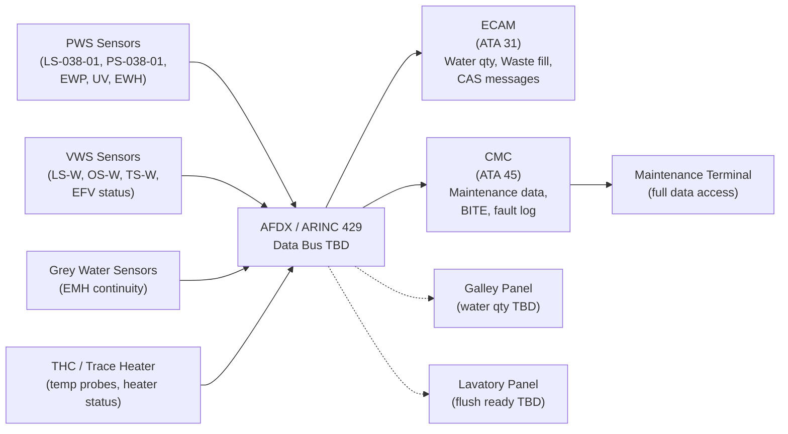
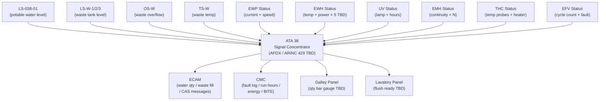
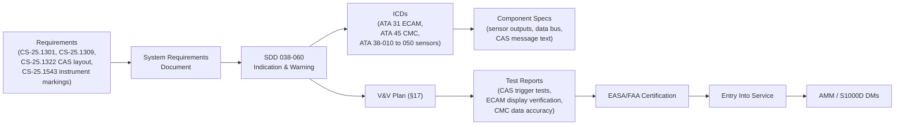

# 038-060 — Water and Waste Indication and Warning
### [PROGRAMME-AIRCRAFT] [PROGRAMME-VARIANT] · ATA 38 · Q+ATLANTIDE ATLAS Scaffold

**Status:**   
**Revision:** 0.1.0 — 2026-05-10  
**Classification:** Q-AIR Primary | Q-MECHANICS / Q-DATAGOV / Q-GREENTECH / Q-GROUND Support

---

## §0 Hyperlink Policy

All cross-references within this document use relative Markdown links anchored to section headings within the Q+ATLANTIDE ATLAS repository. External regulatory references are cited by document identifier only. Internal DMC cross-references follow the pattern `DMC-<PROGRAMME>-<VARIANT>-038-06-YYYY-A`. Where a parameter is not yet determined, the badge  is used inline.

---

## §1 Purpose

This document defines the agnostic ATLAS standard-level architecture context for `038-060 — Water and Waste Indication and Warning`.

It describes the controlled scope, functions, interfaces, safety considerations, lifecycle traceability, and S1000D/CSDB mapping logic that programme implementations shall instantiate when this node is applicable.

This document is not a programme design baseline. Programme-specific capacities, locations, part numbers, effectivity, operating limits, maintenance references, and data module codes shall be defined only inside the applicable programme implementation branch.
## §2 Applicability

| Applicability Level | Rule |
|---|---|
| Standard taxonomy | Applies to the ATLAS node `<NODE>` |
| Programme implementation | Conditional; determined by programme architecture, trade studies, certification basis, and applicability model |
| Product configuration | Defined in the programme-specific configuration baseline |
| Effectivity | Defined in the programme CSDB / applicability layer |
| Non-applicability | Must be explicitly stated in the programme impact-study branch when excluded |
## §3 System/Function Overview

### 3.1 Indication Architecture

The ATA 38 indication system collects sensor data from all water and waste system components and distributes it to:

- **ECAM (Electronic Centralised Aircraft Monitor):** Operational parameters visible to flight crew — water quantity, waste fill level.
- **CAS (Crew Alerting System):** Alert messages when operational limits are exceeded or equipment faults occur.
- **CMC (Central Maintenance Computer):** Detailed maintenance data — run hours, energy, fault codes, BITE results, sensor values.
- **Galley operator panel (TBD):** Optional water quantity indicator visible to cabin crew.
- **Lavatory (TBD):** Optional flush-ready indicator light.

### 3.2 Data Bus

All ATA 38 component status and sensor data is transmitted to the CMC and ECAM via  (AFDX or ARINC 429 — data bus selection pending).

---

## §4 Scope

### 4.1 In-Scope

- ECAM page for ATA 38 (water and waste system page — TBD, may be combined on a systems page)
- Water quantity indication: LS-038-01 signal → ECAM display (% full or litres)
- Waste tank fill level indication: LS-W signal → ECAM display (% full per tank)
- All CAS messages for ATA 38 (see §6 Functional Breakdown and §11)
- CMC fault log and data storage for ATA 38 components
- Galley operator water quantity gauge (optional, TBD)
- Lavatory flush ready light (optional, TBD)
- Data bus wiring and interface: ATA 38 sensors → AFDX/ARINC 429 concentrators
- BITE results output to CMC display and maintenance terminal

### 4.2 Out-of-Scope

- Sensor units themselves (LS, OS, TS, EWP monitor, EWH monitor, UV sensor, EMH monitor): defined in their respective subsubjects (038-010 to 038-050).
- ECAM display hardware (ATA 31 scope).
- CMC hardware (ATA 45 scope).
- Cabin crew interphone and PA system.

---

## §5 Architecture Description

### 5.1 Signal Flow

```
[LS-038-01 — potable water level] ─────────────────────────────→ ECAM water qty
[LS-W-1/2/3 — waste tank level] ──────────────────────────────→ ECAM waste fill
[OS-W-1/2/3 — waste tank overflow] ──────────────────────────→ CAS "WASTE OVFL"
[PS-038-01 — tank pressure] ──────────────────────────────────→ CMC log
[EWP status (current + speed)] ───────────────────────────────→ CAS "EWP FAULT"
[EWH-G1/G2/L1/L2/L3 — temp/status/power] ────────────────────→ CAS "EWH FAULT"
[UV-038-01 — lamp status/hours] ──────────────────────────────→ CAS "UV FAULT"
[EMH-1/2 — continuity] ──────────────────────────────────────→ CAS "DRAIN HTR FAULT"
[THC-038-01 — heater status/temp] ───────────────────────────→ CMC log; advisory
[TS-W — waste tank temp] ────────────────────────────────────→ CMC / freeze alert
[EFV cycle count] ───────────────────────────────────────────→ CMC maintenance advisory
                │
                └── Data bus (AFDX / ARINC 429 TBD) ── CMC ── Maintenance terminal
```

---

## §6 Functional Breakdown

### 6.1 CAS Message Summary

| Message | Level | Trigger | System | Action |
|---|---|---|---|---|
| WATER LO | Amber | Water quantity < TBD% (e.g. 15%) | PWS | Notify crew; plan water fill at next stop |
| WATER FILL | Advisory (blue/white) | Water quantity < TBD% (e.g. 30%) | PWS | Cabin crew advisory: fill water at next turn |
| WATER PRESS | Advisory | Tank pressure out of band TBD | PWS | CMC log; monitor |
| EWP FAULT | Caution (amber) | EWP current fault or speed fault | PWS | Reduced water flow; crew informed; maintenance |
| EWH FAULT | Caution (amber) | EWH temperature fault or TCO activation | PWS | Hot water degraded; crew informed; maintenance |
| UV FAULT | Advisory | UV lamp fail or lamp end-of-life | PWS | Water quality advisory; ops check per QRH TBD |
| WASTE FULL | Amber | Waste tank ≥ 90% TBD | VWS | Plan waste drain at next stop; reduced flush capability TBD |
| WASTE OVFL | Red (warning) | Waste tank overflow sensor activated | VWS | Immediate action; EFV inhibit TBD; maintenance |
| DRAIN HTR FAULT | Caution (amber) | EMH continuity loss (open circuit) | Grey drain | Monitor for ice; plan maintenance |
| TRACE HTR FAULT | Caution (amber) | Trace heater circuit fault | PWS/all | Freeze risk; crew aware; monitor temp |
| EFV FAULT | Caution (amber) | EFV solenoid fault (no cycle confirmation) | VWS | Lavatory out of service; maintenance |

### 6.2 ECAM Page Elements

| Element | Source | Display | Notes |
|---|---|---|---|
| Potable water quantity | LS-038-01 | % full (0–100%) and/or litres TBD | Bar graph or numeric |
| Waste tank fill (per tank) | LS-W per tank | % full (0–100%) per tank | Bar graph or numeric |
| EWP status | EWP monitor | ON / OFF / FAULT | Coloured indicator |
| UV status | UV-038-01 | OK / FAULT / LAMP-EOL | Coloured indicator |
| EMH status (mast heaters) | EMH monitors | OK / FAULT per unit | Coloured indicators |
| EWH status (per unit) | EWH monitors | OK / FAULT per unit | Coloured indicators TBD |

### 6.3 Galley Operator Panel (TBD)

Optional water quantity indicator on galley operator panel: simple LED bar gauge showing 0–100% potable water level. Sourced from same LS-038-01 signal via cabin system bus TBD. OI TBD.

### 6.4 Lavatory Flush Ready Indicator (TBD)

Optional LED indicator on lavatory wall panel: green = flush ready, red = tank full / system fault. Sourced from EFV cycle complete signal and waste tank level. OI TBD.

### 6.5 Maintenance Data (CMC)

| Data Item | Source | CMC Record |
|---|---|---|
| Potable water quantity (continuous) | LS-038-01 | Time-stamped log |
| Waste fill level (continuous) | LS-W | Time-stamped log |
| EWP run hours | Hour counter | Cumulative |
| EWP fault events | EWP monitor | Fault log with timestamp |
| EWH energy consumption (per unit) | EWH watt-meter | kWh cumulative |
| EWH fault events | EWH monitor | Fault log |
| UV lamp hours | UV unit counter | Cumulative; alert at TBD h |
| UV fault events | UV monitor | Fault log |
| EMH fault events | EMH monitor | Fault log |
| Trace heater fault events | THC | Fault log |
| EFV cycle count (per valve) | EFV controller | Cumulative; maintenance advisory at TBD |
| Waste tank service events | CMC log (manual entry) | Date/time of drain |
| Water fill events | CMC log (sensor-triggered) | Date/time; quantity |

---

## §7 System Context Diagram



---

## §8 Internal Functional Architecture



---

## §9 Lifecycle Traceability



---

## §10 Interfaces

| Interface | ATA Chapter | Direction | Signal/Medium | Notes |
|---|---|---|---|---|
| All ATA 38 sensors | ATA 38-010 to 038-050 | In | Analogue/digital | Level, pressure, temp, status |
| ECAM display system | ATA 31 | Out | AFDX / ARINC 429 | Water and waste page data |
| CMC | ATA 45 | Out | AFDX | Maintenance data, BITE |
| Galley management system (if applicable) | ATA 46 TBD | Out | Data bus TBD | Galley panel water qty |
| Cabin interphone (crew alert TBD) | ATA 23 TBD | Out | Discrete TBD | Optional crew alert for waste full |
| Maintenance terminal | ATA 45 | Out | Ethernet / AFDX TBD | Full maintenance data display |

---

## §11 Operating Modes

| Mode | ECAM Display | CAS | CMC | Notes |
|---|---|---|---|---|
| Normal Flight | Water qty + waste fill displayed | No active alerts | Monitoring continuously | Normal state |
| Water Low | Water qty bar red/amber | WATER LO (amber) | Log event | Crew plans water fill |
| Waste Near Full | Waste fill bar amber | WASTE FULL (amber) | Log event | Crew plans waste drain |
| Waste Overflow | Waste bar full + overflow | WASTE OVFL (red) | Log + alert | Immediate action |
| EWP Fault | EWP FAULT indication | EWP FAULT (amber) | Log fault | Reduced water service |
| EWH Fault | EWH FAULT indication | EWH FAULT (amber) | Log fault | Cold water only at affected outlet |
| UV Fault | UV FAULT indication | UV FAULT (advisory) | Log fault | Water quality advisory |
| Drain Heater Fault | DRAIN HTR FAULT | DRAIN HTR FAULT (amber) | Log fault | Monitor for ice |
| Maintenance | Full BITE display | N/A | Full access | Maintenance terminal active |

---

## §12 Monitoring and Diagnostics

| Parameter | Source | ECAM | CMC | Alert |
|---|---|---|---|---|
| Potable water qty | LS-038-01 | Yes (% full) | Yes (log) | WATER LO / WATER FILL |
| Waste tank fill | LS-W | Yes (% per tank) | Yes (log) | WASTE FULL / WASTE OVFL |
| Tank pressure | PS-038-01 | Optional TBD | Yes (log) | WATER PRESS advisory |
| EWP status | EWP monitor | Indicator | Yes (run hours, faults) | EWP FAULT |
| EWH status | EWH monitor (×N) | Indicator | Yes (energy, faults) | EWH FAULT |
| UV status | UV monitor | Indicator | Yes (lamp hours) | UV FAULT |
| EMH status | EMH monitor | Indicator | Yes (faults) | DRAIN HTR FAULT |
| Trace heater status | THC | Optional TBD | Yes (faults) | TRACE HTR FAULT |
| EFV cycle count | EFV controller | N/A | Yes (cumulative) | Maintenance advisory |
| Waste temp | TS-W | N/A | Yes (log) | Freeze advisory |

---

## §13 Maintenance Concept

| Task | Access | Interval | Skill |
|---|---|---|---|
| CMC fault review | CMC terminal / maintenance terminal | Each visit | Line |
| ECAM indication functional test | Maintenance BITE mode | C-check TBD | Line/base |
| CAS message verification test | Signal injection / BITE | C-check TBD | Line/base |
| Sensor calibration check | Per sensor subsubject | C-check TBD | Line/base |
| Data bus continuity check | AFDX / ARINC 429 test | C-check TBD | Base |
| CMC data download | Maintenance terminal USB/network | On demand | Line |

---

## §14 S1000D/CSDB Mapping

| Document | DMC Pattern | Info Code | Status |
|---|---|---|---|
| System description — indication & warning | DMC-<PROGRAMME>-<VARIANT>-038-06-00A-040A-A | 040 |  |
| CAS message list | DMC-<PROGRAMME>-<VARIANT>-038-06-00A-040B-A | 040 |  |
| ECAM page description | DMC-<PROGRAMME>-<VARIANT>-038-06-10A-040A-A | 040 |  |
| Fault isolation — indication system | DMC-<PROGRAMME>-<VARIANT>-038-06-00A-400A-A | 400 |  |
| BITE / ECAM test procedure | DMC-<PROGRAMME>-<VARIANT>-038-06-00A-300A-A | 300 |  |

---

## §15 Footprints

| Parameter | Value |
|---|---|
| Data bus type |  (AFDX or ARINC 429) |
| ECAM page count for ATA 38 |  (likely sub-page on systems display) |
| Number of CAS messages |  (~11 defined; more TBD) |
| CMC data retention |  (e.g. last 500 flight hours TBD) |
| Galley panel water gauge |  (optional; OI TBD) |
| Lavatory flush ready light |  (optional; OI TBD) |

---

## §16 Safety and Certification

| Requirement | Standard | Application |
|---|---|---|
| Equipment installation | CS-25.1301 | All ATA 38 indication components |
| System safety | CS-25.1309 | False alerts; missed alerts (single failure analysis) |
| CAS message format and levels | CS-25.1322 | Warning (red)/Caution (amber)/Advisory colours and levels |
| Instrument markings | CS-25.1543 TBD | ECAM quantity bar markings |
| Data bus safety | CS-25.1309 | AFDX or ARINC 429 reliability |
| EMC | CS-25.1353 | Data bus, sensor wiring |

---

## §17 Verification and Validation

| Test | Method | Acceptance Criterion | Status |
|---|---|---|---|
| EWP flow test | Bench/rig | ≥ TBD L/min |  |
| Tank leak test | Hydrostatic 1.5× WP | No leakage TBD min |  |
| EWH thermal test | Bench | Outlet ≥ 60°C; TMV ≤ 43°C TBD |  |
| UV steriliser output test | UV intensity | ≥ 4-log TBD |  |
| Mast heater continuity test | Resistance | Within tolerance |  |
| Flush cycle test | Functional rig | Waste ≤ 1.5 s TBD |  |
| Fill-level sensor accuracy | Cal 0/50/100% | ± TBD % |  |
| Overflow sensor function | Simulated overfill | Alert within TBD s |  |
| Grey water drain flow test | Max load | Clear within TBD s |  |
| Potable water quality test | Sample | Meets WHO/FAA standard |  |
| Freeze protection activation test | Cold chamber | THC activates; no freeze |  |
| CAS trigger test | Signal injection | All CAS messages trigger at correct thresholds |  |
| ECAM display verification | Display test | Correct values displayed; correct colours |  |

---

## §18 Glossary

| Term | Definition |
|---|---|
| PWS | Potable Water System |
| EWP | Electric Water Pump |
| EWH | Electric Water Heater |
| VWS | Vacuum Waste System |
| EFV | Electric Flush Valve |
| WIV | Waste Inlet Valve |
| Mast drain | Heated overboard grey drain nozzle |
| EMH | Electric Mast Heater |
| UV sterilisation | UV-C inline water treatment |
| Activated carbon filter | Filter on vent or fill |
| LLDPE | Linear Low-Density Polyethylene |
| PEX | Cross-linked Polyethylene |
| Capacitive level sensor | Non-contact level measurement |
| NRV | Non-Return Valve |
| TMV | Thermostatic Mixing Valve |
| Grey water | Sink drainage |
| Black water | Toilet waste |
| Waste tank | Toilet waste vessel |
| Freeze protection | Electric trace / mast heating |
| Trace heating | Resistance elements on water lines |
| THC | Trace Heater Controller |
| CMC | Central Maintenance Computer |
| ECAM | Electronic Centralised Aircraft Monitor |
| CAS | Crew Alerting System — cockpit alert messages |
| AFDX | Avionics Full-Duplex Switched Ethernet |
| ARINC 429 | Standard avionics data bus |
| BITE | Built-In Test Equipment |

---

## §19 Citations

1. EASA CS-25.1301 — Function and installation.
2. EASA CS-25.1309 — Equipment, systems, and installations.
3. EASA CS-25.1322 — Warning, caution, and advisory lights.
4. EASA CS-25.1543 — Instrument markings (TBD applicability).
5. ARINC 429 standard (Aeronautical Radio Inc.).
6. AFDX standard (ARINC 664 Part 7).
7. [038-000 General](./038-000-Water-and-Waste-General.md).
8. [038-010 Potable Water System](./038-010-Potable-Water-System.md).
9. [038-050 Toilet and Vacuum Waste](./038-050-Toilet-and-Vacuum-Waste-System.md).
10. [038-080 Monitoring Diagnostics and Control](./038-080-Water-and-Waste-Monitoring-Diagnostics-and-Control-Interfaces.md).

---

## §20 References

| Ref | Document | Notes |
|---|---|---|
| [R1] | CS-25.1301 | Installation |
| [R2] | CS-25.1309 | System safety |
| [R3] | CS-25.1322 | CAS format and levels |
| [R4] | ARINC 429 | Data bus standard |
| [R5] | ARINC 664 Part 7 (AFDX) | Data bus standard |
| [R6] | [038-000](./038-000-Water-and-Waste-General.md) | ATA 38 General |
| [R7] | [038-010](./038-010-Potable-Water-System.md) | PWS sensors |
| [R8] | [038-050](./038-050-Toilet-and-Vacuum-Waste-System.md) | VWS sensors |
| [R9] | [038-080](./038-080-Water-and-Waste-Monitoring-Diagnostics-and-Control-Interfaces.md) | Monitoring |
| [R10] | [038-090](./038-090-S1000D-CSDB-Mapping-and-Traceability.md) | CSDB mapping |

---

## §21 Open Issues

| ID | Description | Owner | Status |
|---|---|---|---|
| OI-038-001 | Tank capacity and material | Q-AIR / Q-MECHANICS |  |
| OI-038-002 | Tank pressurisation method | Q-AIR / Q-MECHANICS |  |
| OI-038-003 | EWH count, placement, power budget | Q-AIR / Q-MECHANICS |  |
| OI-038-004 | Grey water retention regulatory review | Q-AIR / ORB-LEG |  |
| OI-038-005 | Waste tank count and capacity | Q-AIR / Q-MECHANICS |  |
| OI-038-006 | Freeze protection strategy | Q-AIR / Q-MECHANICS |  |
| OI-038-007 | UV sterilisation certification and interval | Q-AIR / ORB-LEG |  |
| OI-038-008 | Mast drain count and location | Q-AIR / Q-MECHANICS |  |
| OI-038-009 | Single-point servicing panel location | Q-AIR / Q-GROUND |  |

---

## §22 Change Log

| Revision | Date | Author | Description |
|---|---|---|---|
| 0.1.0 | 2026-05-10 | Q+ATLANTIDE ATLAS Working Group | Initial full-template draft; all 23 sections; CAS messages, ECAM, CMC data |
| 0.0.0 | 2026-05-10 | Q+ATLANTIDE ATLAS Working Group | Scaffold stub created |
