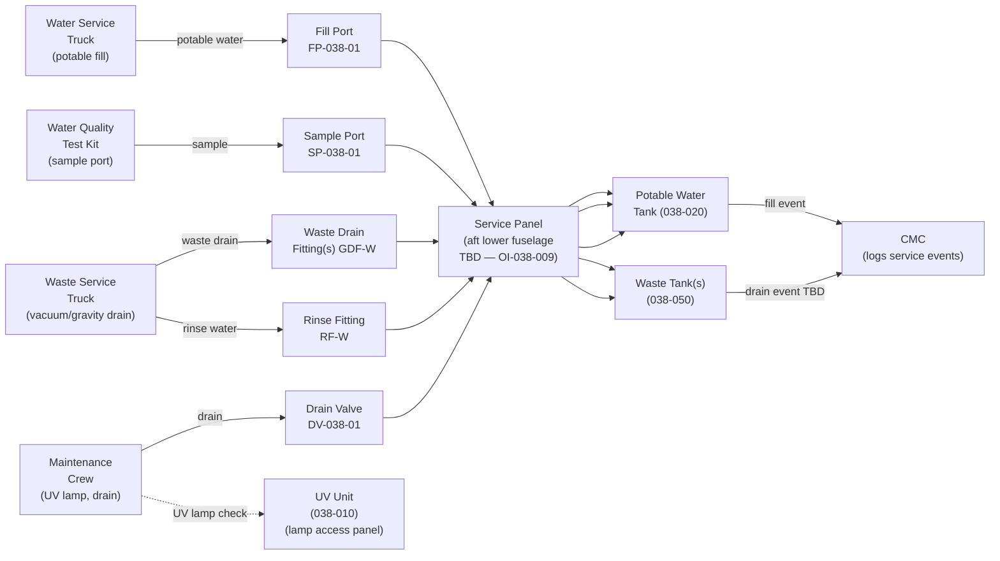
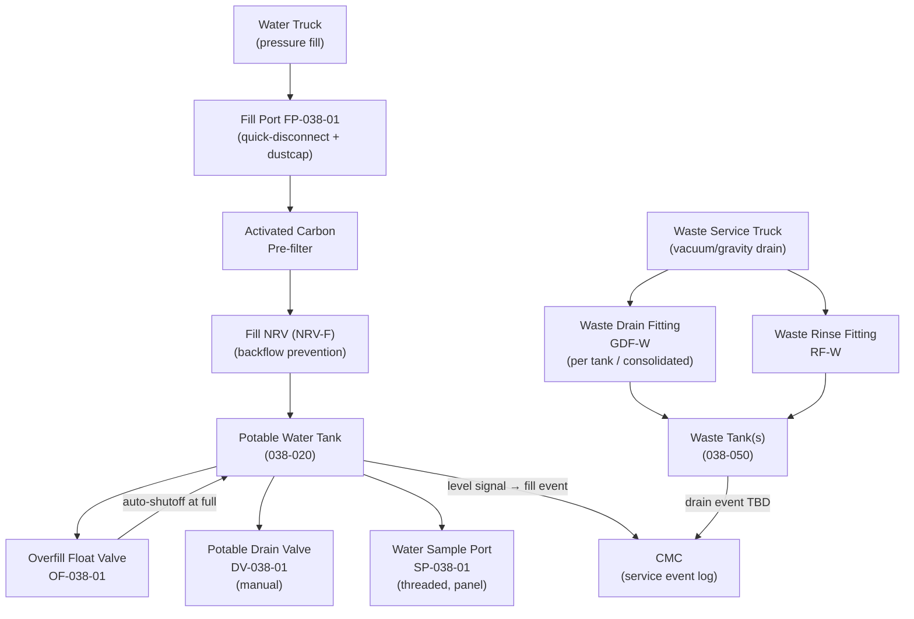
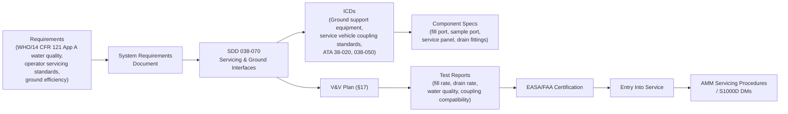

# 038-070 — Water and Waste Servicing and Ground Interfaces
### [PROGRAMME-AIRCRAFT] [PROGRAMME-VARIANT] · ATA 38 · Q+ATLANTIDE ATLAS Scaffold

**Status:**   
**Revision:** 0.1.0 — 2026-05-10  
**Classification:** Q-AIR Primary | Q-MECHANICS / Q-DATAGOV / Q-GREENTECH / Q-GROUND Support

---

## §0 Hyperlink Policy

All cross-references within this document use relative Markdown links anchored to section headings within the Q+ATLANTIDE ATLAS repository. External regulatory references are cited by document identifier only. Internal DMC cross-references follow the pattern `DMC-<PROGRAMME>-<VARIANT>-038-07-YYYY-A`. Where a parameter is not yet determined, the badge  is used inline.

---

## §1 Purpose

This document defines the agnostic ATLAS standard-level architecture context for `038-070 — Water and Waste Servicing and Ground Interfaces`.

It describes the controlled scope, functions, interfaces, safety considerations, lifecycle traceability, and S1000D/CSDB mapping logic that programme implementations shall instantiate when this node is applicable.

This document is not a programme design baseline. Programme-specific capacities, locations, part numbers, effectivity, operating limits, maintenance references, and data module codes shall be defined only inside the applicable programme implementation branch.
## §2 Applicability

| Applicability Level | Rule |
|---|---|
| Standard taxonomy | Applies to the ATLAS node `<NODE>` |
| Programme implementation | Conditional; determined by programme architecture, trade studies, certification basis, and applicability model |
| Product configuration | Defined in the programme-specific configuration baseline |
| Effectivity | Defined in the programme CSDB / applicability layer |
| Non-applicability | Must be explicitly stated in the programme impact-study branch when excluded |
## §3 System/Function Overview

### 3.1 Ground Servicing Concept

The [PROGRAMME-VARIANT] ATA 38 ground servicing design targets minimum turn-around time consistent with water quality and waste management requirements. The preferred design is a **single-point service panel** combining both potable water fill and waste drain connections on one panel, accessible from one ground vehicle position.

| Service Operation | Interface | Vehicle | Typical Interval |
|---|---|---|---|
| Potable water fill | Fill port + quick-disconnect | Water service truck | Per turn or per operator |
| Water quality sample | Sample port (inline) | Handheld test kit | Per operator water program (e.g. monthly) |
| Potable water drain (maintenance) | Gravity drain valve DV-038-01 | Drain bucket / drain hose | Periodic maintenance TBD |
| Waste tank drain | Drain fitting GDF-W (per tank or consolidated) | Waste vacuum/gravity truck | Per turn or per operator |
| Waste tank rinse | Rinse water fitting | Water service truck | Per maintenance program TBD |
| UV lamp check | UV unit access panel | Handheld UV meter / visual | Per lamp hours TBD |

### 3.2 Service Panel Concept

Proposed single-point service panel location: **aft lower fuselage, port side**  (OI-038-009).

Panel contents (TBD):
- Potable water fill fitting (quick-disconnect, colour-coded, labelled)
- Potable water drain valve (DV-038-01, manual quarter-turn)
- Potable water sample port (SP-038-01, threaded cap)
- Waste drain fitting(s) (GDF-W, truck-connect coupling)
- Waste tank rinse fitting (RF-W, separate coupling)
- Service indicators: water full light (optional), waste full light (optional)

Fitting compatibility: potable water fill fitting is NOT compatible with waste drain coupling, preventing cross-connection.

---

## §4 Scope

### 4.1 In-Scope

- Potable water fill port assembly (FP-038-01): quick-disconnect fitting, dustcap, manual shutoff, overfill float valve connection
- Water quality sample port (SP-038-01): inline threaded port with dust cap
- Potable water maintenance drain valve (DV-038-01): location, access, procedure
- Waste tank drain fittings (GDF-W-1 through GDF-W-N or consolidated): truck-connect coupling, manual valve, cap
- Waste tank rinse fitting (RF-W): separate coupling for rinse water injection
- Single-point service panel (TBD — OI-038-009): panel door, lighting, labelling
- Service panel location and accessibility: ground clearance, vehicle access angle, service time
- Ground vehicle interface definition: hose coupling standard TBD
- Low-point drain valves on distribution lines (access and procedure)
- UV lamp check procedure: access, visual or meter check

### 4.2 Out-of-Scope

- Fill port detailed structural integration: → [038-020](./038-020-Water-Storage-and-Distribution.md)
- Waste tank structural: → [038-050](./038-050-Toilet-and-Vacuum-Waste-System.md)
- Ground vehicles and ground support equipment: → Q-GROUND

---

## §5 Architecture Description

### 5.1 Service Panel Layout (Conceptual)

```
┌─────────────────────────────────────────────────────────┐
│            ATA 38 SERVICE PANEL (TBD location)          │
│                                                          │
│  [POTABLE WATER FILL PORT]      [WATER SAMPLE PORT]     │
│   FP-038-01 (QD, colour=blue)   SP-038-01 (threaded)   │
│                                                          │
│  [POTABLE WATER DRAIN]          [WASTE DRAIN FITTING]   │
│   DV-038-01 (quarter-turn)      GDF-W (colour=grey)     │
│                                                          │
│  [WASTE RINSE FITTING]          [PANEL STATUS LIGHTS]   │
│   RF-W (colour=yellow TBD)      (optional TBD)          │
└─────────────────────────────────────────────────────────┘
```

### 5.2 Fill Procedure Overview

1. Connect ground water truck hose to FP-038-01 fill port.
2. Ensure DV-038-01 (tank drain) is closed.
3. Open fill valve: water flows under truck pressure through carbon filter and NRV-F to tank.
4. Overfill float valve (OF-038-01) auto-shuts when tank reaches 100% TBD.
5. Confirm fill level on ECAM water quantity display or galley panel gauge.
6. Disconnect fill hose; replace dust cap.
7. CMC logs fill event (sensor-triggered, timestamp, quantity TBD).

### 5.3 Waste Drain Procedure Overview

1. Connect waste service truck vacuum/gravity hose to GDF-W drain fitting.
2. Open GDF-W valve.
3. Waste drains under gravity (or truck vacuum if gravity insufficient).
4. When empty (level sensor at zero, or ground crew confirms), close GDF-W valve.
5. Optionally, connect rinse water to RF-W fitting; rinse tank interior with potable water.
6. Disconnect hose; replace cap.
7. CMC optionally logs drain event (manual entry or sensor-triggered).

---

## §6 Functional Breakdown

| Component | Function | Qty | Status |
|---|---|---|---|
| Fill port FP-038-01 | Pressure fill interface; quick-disconnect; dust cap | 1 |  |
| Overfill float valve OF-038-01 | Auto-shutoff at 100% fill TBD | 1 | Integral to tank; see 038-020 |
| Potable drain valve DV-038-01 | Manual gravity drain for maintenance | 1 | Quarter-turn; see 038-020 |
| Water sample port SP-038-01 | Inline sample port for quality testing | 1 | Threaded cap; panel-mounted |
| Waste drain fittings GDF-W | Ground service truck connection per tank | TBD (1–3 or 1 consolidated) | OI-038-005 / OI-038-009 |
| Waste rinse fitting RF-W | Inject rinse water into waste tank | 1 (consolidated) TBD | TBD |
| Service panel door and housing | Weatherproof enclosure; labelling; lighting | 1 | TBD |
| Low-point line drain valves | Residual water drain from distribution lines | TBD | Manual; see 038-020 |
| UV lamp access panel | Quick access for lamp check and replacement | TBD (1 per UV unit) | See 038-010 |
| Service indicators (optional) | Water full / waste full LED at panel | TBD | Optional |

---

## §7 System Context Diagram



---

## §8 Internal Functional Architecture



---

## §9 Lifecycle Traceability



---

## §10 Interfaces

| Interface | ATA Chapter | Direction | Signal/Medium | Notes |
|---|---|---|---|---|
| Potable water fill | Ground (water truck) | In | Potable water (fluid) | Pressure fill via FP-038-01 |
| Potable water quality sample | Ground (test kit) | Out | Water sample | Via SP-038-01 |
| Potable water maintenance drain | Maintenance (drain hose) | Out | Water (fluid) | DV-038-01 gravity drain |
| Waste tank drain | Ground (waste truck) | Out | Waste fluid | GDF-W drain fitting |
| Waste tank rinse | Ground (rinse water) | In | Potable water (rinse) | RF-W fitting |
| Fill event signal | ATA 38-060 / CMC | Out | AFDX TBD | Level sensor triggers fill event log |
| Service panel lighting | ATA 24 | In | Low-voltage DC | Panel interior light TBD |
| UV lamp check | Maintenance access | Physical | Visual/UV meter | Access panel at UV unit |

---

## §11 Operating Modes

| Mode | Service Action | Access | Notes |
|---|---|---|---|
| Normal Turn (per-turn service) | Waste drain + water fill | Service panel | Ground crew with water/waste truck |
| Water Quality Check | Water sample taken at SP-038-01 | Service panel | Per operator water program |
| Potable Water Maintenance Drain | Full system drain via DV-038-01 | Service panel | Before tank removal or flush |
| Waste Tank Rinse | Rinse water injected via RF-W | Service panel | After drain; periodic |
| UV Lamp Check | Visual or UV meter check at UV unit | UV access panel | Per lamp hours (TBD ~6000 h) |
| Water Tank Flush (Legionella) | Full flush + drain cycle | Service panel | Per operator schedule |
| Cold Weather Service | Standard procedure; EMH and THC active | Service panel | Prevent ice in lines during servicing |

---

## §12 Monitoring and Diagnostics

| Parameter | How Monitored | Notes |
|---|---|---|
| Fill level during fill | ECAM water quantity display / galley gauge | Ground crew confirms target level |
| Water quality | Offline water sample analysis | Per operator water program |
| UV lamp hours | CMC lamp hour counter | Alert at TBD hours |
| Waste tank level during drain | ECAM waste fill / ground crew visual | Confirm zero before disconnect |
| Service event logging | CMC (fill + drain events) | Time-stamped; supports operator water program |

---

## §13 Maintenance Concept

| Task | Access | Interval | Skill |
|---|---|---|---|
| Potable water fill | Service panel | Per turn or operator | Ground crew |
| Waste tank drain | Service panel | Per turn or operator | Ground crew |
| Waste tank rinse | Service panel | Per maintenance program | Line maintenance |
| Water sample collection | Service panel (SP-038-01) | Per operator water program | Line maintenance |
| Sample analysis | Offsite lab or onsite kit | Per operator program | Trained tester |
| Service panel inspection | Visual inspection | A-check TBD | Line |
| Fill port coupling inspect/replace | Service panel | C-check TBD | Line |
| Waste drain coupling inspect/replace | Service panel | C-check TBD | Line |
| UV lamp check | UV unit access panel | Per lamp hours TBD | Line |
| Water system flush | Full system via service panel | Per operator schedule | Line maintenance |

---

## §14 S1000D/CSDB Mapping

| Document | DMC Pattern | Info Code | Status |
|---|---|---|---|
| System description — ground interfaces | DMC-<PROGRAMME>-<VARIANT>-038-07-00A-040A-A | 040 |  |
| Potable water fill servicing | DMC-<PROGRAMME>-<VARIANT>-038-07-10A-910A-A | 910 |  |
| Waste tank drain servicing | DMC-<PROGRAMME>-<VARIANT>-038-07-20A-910A-A | 910 |  |
| Water quality sample procedure | DMC-<PROGRAMME>-<VARIANT>-038-07-30A-300A-A | 300 |  |
| UV lamp check procedure | DMC-<PROGRAMME>-<VARIANT>-038-07-40A-300A-A | 300 |  |
| Service panel description | DMC-<PROGRAMME>-<VARIANT>-038-07-50A-040A-A | 040 |  |
| Fault isolation — servicing interface | DMC-<PROGRAMME>-<VARIANT>-038-07-00A-400A-A | 400 |  |

---

## §15 Footprints

| Parameter | Value |
|---|---|
| Service panel location |  (aft lower fuselage, port side; OI-038-009) |
| Service panel size |  |
| Fill rate (water truck) |  (L/min) |
| Waste drain rate |  (gravity or vacuum truck TBD) |
| Turn-around service time (target) |  (minutes) |
| Water truck hose coupling standard |  (e.g. ATA standard quick-disconnect TBD) |
| Waste truck coupling standard |  |
| Sample port type |  (threaded or push-fit; cap) |

---

## §16 Safety and Certification

| Requirement | Standard | Application |
|---|---|---|
| Water quality compliance | WHO / 14 CFR Part 121 Appendix A | Water quality testing at fill; sample port enables compliance |
| Coupling cross-connection prevention | Design requirement | Fill port NOT compatible with waste coupling |
| Contamination of fill water | Carbon pre-filter; NRV at fill | Prevents backflow; filters fill water |
| Waste disposal compliance | Local airport regulations TBD | Waste truck disposal per OI-038-004 |
| Service panel weatherproofing | CS-25.1301 | Panel enclosure rated for operating environment |
| Ground safety | Ground operations procedures | Clear labelling; colour coding; personnel safety |
| UV lamp handling | Per manufacturer safety sheet | UV-C lamp — safe handling instructions in AMM |

---

## §17 Verification and Validation

| Test | Method | Acceptance Criterion | Status |
|---|---|---|---|
| EWP flow test | Bench/rig | ≥ TBD L/min |  |
| Tank leak test | Hydrostatic 1.5× WP | No leakage TBD min |  |
| EWH thermal test | Bench | Outlet ≥ 60°C; TMV ≤ 43°C TBD |  |
| UV steriliser output test | UV intensity + log-reduction | ≥ 4-log TBD |  |
| Mast heater continuity test | Resistance at install | Within tolerance |  |
| Flush cycle test | Functional rig | Waste ≤ 1.5 s TBD |  |
| Fill-level sensor accuracy | Cal 0/50/100% | ± TBD % |  |
| Overflow sensor function | Simulated overfill | Alert within TBD s |  |
| Grey water drain flow test | Max load | Clear within TBD s |  |
| Potable water quality test | Sample analysis | Meets WHO/FAA standard |  |
| Freeze protection activation test | Cold chamber | THC/EMH activate; no freeze |  |
| Fill rate test | Timed fill at nominal truck pressure | Meets target turn time TBD |  |
| Coupling cross-connection test | Attempt cross-connection | Fill fitting incompatible with waste fitting |  |

---

## §18 Glossary

| Term | Definition |
|---|---|
| PWS | Potable Water System |
| EWP | Electric Water Pump |
| EWH | Electric Water Heater |
| VWS | Vacuum Waste System |
| EFV | Electric Flush Valve |
| WIV | Waste Inlet Valve |
| Mast drain | Heated overboard grey drain nozzle |
| EMH | Electric Mast Heater |
| UV sterilisation | UV-C inline water treatment |
| Activated carbon filter | Filter at fill point |
| LLDPE | Linear Low-Density Polyethylene |
| PEX | Cross-linked Polyethylene |
| Capacitive level sensor | Non-contact fluid level sensor |
| NRV | Non-Return Valve |
| TMV | Thermostatic Mixing Valve |
| Grey water | Sink drainage |
| Black water | Toilet waste |
| Waste tank | Toilet waste storage vessel |
| Freeze protection | Trace/mast heating |
| Trace heating | Resistance elements on water lines |
| THC | Trace Heater Controller |
| CMC | Central Maintenance Computer |
| FP | Fill Port — potable water pressure fill interface |
| SP | Sample Port — inline water quality sample |
| DV | Drain Valve — potable water maintenance drain |
| GDF | Ground Drain Fitting — waste tank drain interface |
| RF | Rinse Fitting — waste tank rinse water interface |
| QD | Quick-Disconnect coupling |
| GPU | Ground Power Unit |

---

## §19 Citations

1. EASA CS-25.1301 — Function and installation.
2. WHO, *Guidelines for Drinking-water Quality*, 4th Ed.
3. 14 CFR Part 121 Appendix A — Aircraft Drinking Water Rule.
4. OI-038-009 — Single-point servicing panel location TBD.
5. OI-038-004 — Grey water retention regulatory review.
6. [038-000 General](./038-000-Water-and-Waste-General.md).
7. [038-020 Water Storage and Distribution](./038-020-Water-Storage-and-Distribution.md).
8. [038-050 Toilet and Vacuum Waste](./038-050-Toilet-and-Vacuum-Waste-System.md).
9. [038-060 Indication and Warning](./038-060-Water-and-Waste-Indication-and-Warning.md).
10. [038-080 Monitoring and Diagnostics](./038-080-Water-and-Waste-Monitoring-Diagnostics-and-Control-Interfaces.md).

---

## §20 References

| Ref | Document | Notes |
|---|---|---|
| [R1] | CS-25.1301 | Installation |
| [R2] | WHO Guidelines 4th Ed. | Water quality |
| [R3] | 14 CFR Part 121 Appendix A | US commercial water quality |
| [R4] | [038-000](./038-000-Water-and-Waste-General.md) | ATA 38 General |
| [R5] | [038-020](./038-020-Water-Storage-and-Distribution.md) | Tank and distribution |
| [R6] | [038-050](./038-050-Toilet-and-Vacuum-Waste-System.md) | Waste tanks |
| [R7] | [038-060](./038-060-Water-and-Waste-Indication-and-Warning.md) | Indication |
| [R8] | [038-080](./038-080-Water-and-Waste-Monitoring-Diagnostics-and-Control-Interfaces.md) | Monitoring |
| [R9] | OI-038-004 | Grey water retention |
| [R10] | OI-038-009 | Service panel location |

---

## §21 Open Issues

| ID | Description | Owner | Status |
|---|---|---|---|
| OI-038-001 | Tank capacity and material | Q-AIR / Q-MECHANICS |  |
| OI-038-002 | Tank pressurisation method | Q-AIR / Q-MECHANICS |  |
| OI-038-003 | EWH count, placement, power budget | Q-AIR / Q-MECHANICS |  |
| OI-038-004 | Grey water retention regulatory review | Q-AIR / ORB-LEG |  |
| OI-038-005 | Waste tank count and capacity | Q-AIR / Q-MECHANICS |  |
| OI-038-006 | Freeze protection strategy | Q-AIR / Q-MECHANICS |  |
| OI-038-007 | UV sterilisation certification and interval | Q-AIR / ORB-LEG |  |
| OI-038-008 | Mast drain count and location | Q-AIR / Q-MECHANICS |  |
| OI-038-009 | Single-point servicing panel location and configuration | Q-AIR / Q-GROUND |  |

---

## §22 Change Log

| Revision | Date | Author | Description |
|---|---|---|---|
| 0.1.0 | 2026-05-10 | Q+ATLANTIDE ATLAS Working Group | Initial full-template draft; all 23 sections; ground servicing, fill, drain, sample, UV |
| 0.0.0 | 2026-05-10 | Q+ATLANTIDE ATLAS Working Group | Scaffold stub created |
