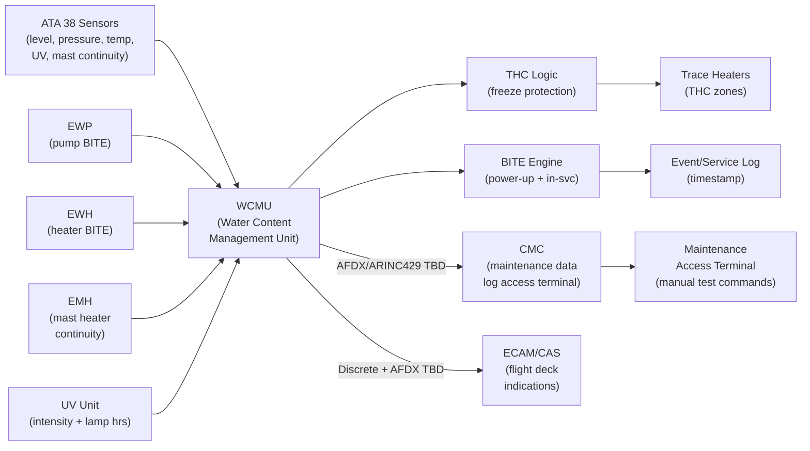
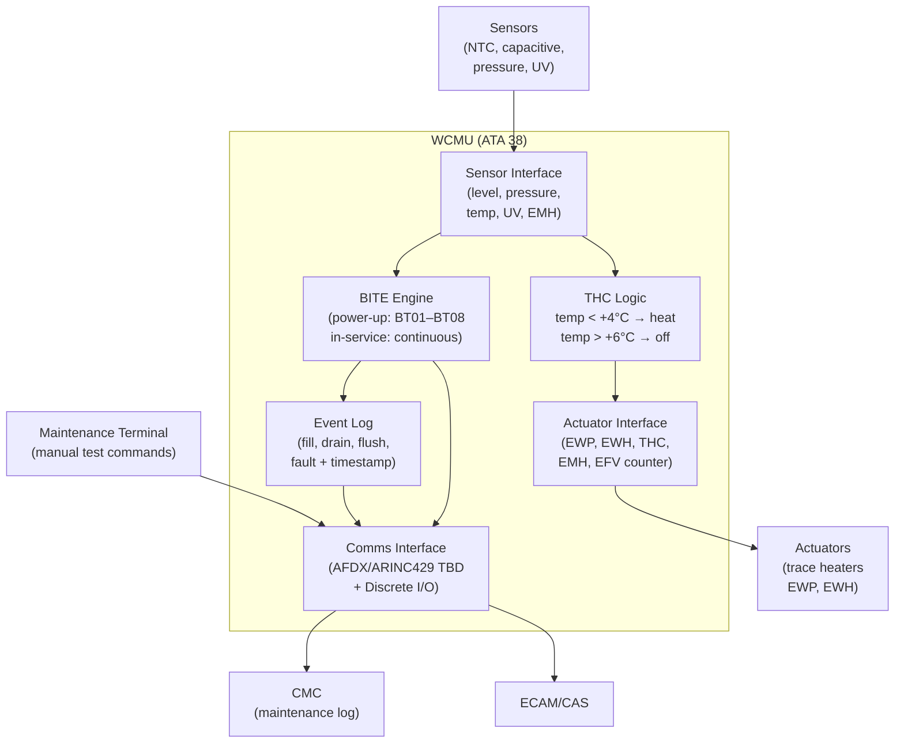
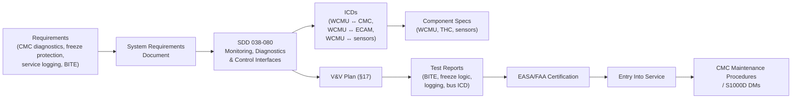

# 038-080 — Water and Waste Monitoring, Diagnostics and Control Interfaces
### AMPEL360e eWTW · ATA 38 · Q+ATLANTIDE ATLAS Scaffold

**Status:**   
**Revision:** 0.1.0 — 2026-05-10  
**Classification:** Q-AIR Primary | Q-MECHANICS / Q-DATAGOV / Q-DIGITAL / Q-GREENTECH Support

---

## §0 Hyperlink Policy

All cross-references within this document use relative Markdown links anchored to section headings within the Q+ATLANTIDE ATLAS repository. External regulatory references are cited by document identifier only. Internal DMC cross-references follow the pattern `DMC-AMPEL360E-EWTW-038-08-YYYY-A`. Where a parameter is not yet determined, the badge  is used inline.

---

## §1 Purpose

This document describes the **Water and Waste Monitoring, Diagnostics and Control Interfaces** of ATA 38 for the **AMPEL360e eWTW**. It covers:

1. CMC/OMS parameter table: all ATA 38 sensors, actuators, and controllers reported to the Central Maintenance Computer.
2. BITE (Built-In Test Equipment): power-up self-tests and in-service monitoring for EWP, EWH, mast heaters (EMH), UV unit, and sensors.
3. Maintenance terminal commands: manual test and override commands via the maintenance access terminal.
4. Data bus interfaces: AFDX (ARINC 664) or ARINC 429 TBD — bus allocation, message rates, label assignments.
5. THC freeze protection control logic: temperature threshold monitoring and trace heater activation.
6. Service event logging: fill, drain, flush cycle and fault data with timestamp.
7. ECAM/CAS interface: ATA 38 parameter transmission to ECAM and CAS.

---

## §2 Applicability

| Item | Value |
|---|---|
| Aircraft Programme | AMPEL360e eWTW |
| Variant | All variants |
| ATA Chapter/Subsubject | 038-080 — Monitoring, Diagnostics and Control Interfaces |
| Document Tier | Level 2 — SDD |
| Effectivity | MSN 0001 onwards  |
| Parent Document | [038-000](./038-000-Water-and-Waste-General.md) |

---

## §3 System/Function Overview

### 3.1 Monitoring Architecture Overview

ATA 38 monitoring, diagnostics and control is distributed across:

| Subsystem | Controller / Monitor | Location |
|---|---|---|
| Potable water tank level | Capacitive level sensor array → WCMU TBD | Tank compartment |
| Potable water pressure | Pressure transducer → WCMU | Distribution line |
| Water temperature (freeze) | NTC thermistor → THC | Low-risk lines and tank |
| Trace heater activation | THC (Trace Heater Controller) | Heater zones |
| EWP status | EWP internal BITE → WCMU | Tank outlet |
| EWH status | EWH thermostat + BITE → WCMU | Heater unit(s) |
| UV unit status | UV intensity sensor + lamp hour counter → WCMU | UV unit |
| Waste tank level | Capacitive level + overflow sensor → WCMU | Waste tank(s) |
| Waste tank temperature | NTC thermistor → WCMU | Waste tank(s) |
| Mast drain heater (EMH) | Resistance continuity monitor → WCMU | Drain nozzle |
| CAS messages | WCMU → ECAM/CAS | Cockpit |
| Maintenance data | WCMU → CMC | CMC access terminal |

**WCMU** = Water Content Management Unit (ATA 38 avionics unit — designation TBD; may be WCU, WCMU, or integrated in another avionics box; hereafter WCMU).

### 3.2 Data Bus Allocation

| Bus | Allocation | Status |
|---|---|---|
| AFDX (ARINC 664) | Preferred for WCMU to CMC and ECAM |  |
| ARINC 429 | Alternative if AFDX not available on ATA 38 LRU |  |
| Discrete I/O | EWP/EWH enable, THC on/off, overflow alert | Hardwired |
| CAN / RS-485 | Intra-WCMU sensor bus TBD |  |

---

## §4 Scope

### 4.1 In-Scope

- CMC/OMS parameter table: parameter names, units, update rate, CMC label TBD
- BITE architecture: power-up self-test sequence; in-service health monitoring
- BITE for EWP: flow sensor check, motor current check
- BITE for EWH: thermostat check, outlet temperature at set point
- BITE for EMH: resistance continuity check at startup
- BITE for UV unit: UV intensity check, lamp hour alert
- BITE for level sensors: sensor value plausibility check
- Maintenance terminal test commands: EWP test, EWH test, UV bypass, waste reset
- THC freeze logic: sensor polling, threshold, heater activation / deactivation hysteresis
- Service event logging: fill events, drain events, flush cycle counts, fault log
- ECAM/CAS interface: parameter transmission, CAS message triggers

### 4.2 Out-of-Scope

- EWP detailed design: → [038-020](./038-020-Water-Storage-and-Distribution.md)
- EWH detailed design: → [038-030](./038-030-Water-Heaters-and-Service-Interfaces.md)
- CAS message table: → [038-060](./038-060-Water-and-Waste-Indication-and-Warning.md)
- Sensor hardware specifications: → respective subsubject docs

---

## §5 Architecture Description

### 5.1 Monitoring and Control Architecture

```
         ┌────────────────────────────────────────────────────────┐
         │                   WCMU (ATA 38)                        │
         │                                                        │
         │  ┌──────────────┐   ┌────────────────┐               │
         │  │ Sensor I/F   │   │ THC Logic      │               │
         │  │ - Level x N  │   │ (temp < +4°C   │               │
         │  │ - Pressure   │   │ → trace heat)  │               │
         │  │ - Temp x N   │   └──────┬─────────┘               │
         │  │ - UV sensor  │          │ heater on/off            │
         │  │ - EMH cont.  │          ↓                          │
         │  └──────┬───────┘   ┌──────────────┐                 │
         │         │           │ Trace Heaters │                 │
         │         ↓           └──────────────┘                 │
         │  ┌─────────────────────────────────┐                  │
         │  │ BITE Engine (power-up + in-svc) │                  │
         │  └───────────────┬─────────────────┘                  │
         │                  │ fault / status                     │
         │         ┌────────┴────────────────────────┐           │
         │         │ Event / Service Log (timestamp)  │           │
         │         └────────────────────────────────-┘           │
         └──────────────┬───────────────────────────────────────┘
                        │
           ┌────────────┴──────────────┐
           │                           │
    AFDX/ARINC429              Discrete I/O
           │                           │
    ┌──────┴──────┐           ┌────────┴──────────┐
    │    CMC      │           │  ECAM / CAS        │
    │ (maintenance│           │ (flight deck       │
    │  data / log)│           │  indications)      │
    └─────────────┘           └───────────────────┘
```

---

## §6 Functional Breakdown

### 6.1 CMC/OMS Parameter Table

All ATA 38 parameters reported to the CMC. Update rates and CMC labels are TBD pending data bus design.

| Parameter ID | Description | Unit | Source | Update Rate | CMC Label |
|---|---|---|---|---|---|
| W38-P01 | Potable water tank quantity | % or L | Capacitive level sensor | 1 Hz TBD |  |
| W38-P02 | Potable water supply pressure | bar | Pressure transducer | 1 Hz TBD |  |
| W38-P03 | Potable water tank temperature | °C | NTC thermistor | 0.1 Hz TBD |  |
| W38-P04 | EWP operating status | On/Off/Fault | EWP BITE | On demand |  |
| W38-P05 | EWP current draw | A | EWP current sensor | 1 Hz TBD |  |
| W38-P06 | EWH status (per unit) | On/Off/Fault | EWH BITE | On demand |  |
| W38-P07 | EWH outlet temperature | °C | EWH thermocouple | 0.2 Hz TBD |  |
| W38-P08 | UV unit status | OK/Fault/LampHrs | UV sensor | On demand |  |
| W38-P09 | UV lamp accumulated hours | h | UV lamp hour counter | On demand |  |
| W38-P10 | Waste tank quantity (per tank) | % or L | Capacitive level sensor | 1 Hz TBD |  |
| W38-P11 | Waste tank overflow status | OK/Overflow | Float/capacitive sensor | On event |  |
| W38-P12 | Waste tank temperature | °C | NTC thermistor | 0.1 Hz TBD |  |
| W38-P13 | Mast drain heater (EMH) status | OK/Fault | Resistance continuity | Startup + on demand |  |
| W38-P14 | Trace heater zone status (per zone) | On/Off/Fault | THC output | 0.1 Hz TBD |  |
| W38-P15 | Freeze protection temperature (per zone) | °C | NTC thermistor | 0.2 Hz TBD |  |
| W38-P16 | Service event: fill (last fill) | timestamp | Fill NRV flow or manual | On event |  |
| W38-P17 | Service event: waste drain (last drain) | timestamp | Level sensor | On event |  |
| W38-P18 | Flush cycle count (total) | count | EFV actuation counter | On event |  |

### 6.2 BITE Architecture

#### 6.2.1 Power-Up Self-Test Sequence (WCMU)

At aircraft power application, the WCMU executes the following sequence:

| Step | BITE Test | Pass Criterion | Fail Action |
|---|---|---|---|
| BT01 | RAM / ROM self-check | Checksum OK | WCMU FAIL → CAS + CMC |
| BT02 | Sensor bus communication check | All sensors respond | Sensor FAIL → CAS + CMC |
| BT03 | EWP motor current / winding check (static) | Within rated limits | EWP FAIL → CAS + CMC |
| BT04 | EWH thermostat check (static) | Thermostat opens at set point | EWH FAIL → CAS + CMC |
| BT05 | EMH resistance continuity (per nozzle) | Within rated limits TBD Ω | EMH FAIL → CAS + CMC |
| BT06 | UV unit lamp status | Intensity ≥ TBD mW/cm² | UV FAULT → CAS + CMC |
| BT07 | Level sensor plausibility | Not stuck at 0% or 100% | SENSOR FAULT → CMC |
| BT08 | THC temperature sensor check | Sensor in range −40 to +70°C | TEMP SENSOR FAIL → CMC |

Total power-up self-test duration:  seconds.

#### 6.2.2 In-Service BITE (Continuous Monitoring)

| Parameter | Monitoring | Fault Condition | Action |
|---|---|---|---|
| EWP current | Continuous | < min or > max rated current | W38 EWP FAULT / advisory |
| EWH outlet temp | Continuous when EWH on | > 65°C (Legionella) or < 30°C (cold TBD) | W38 EWH OVERHEAT / advisory |
| UV lamp hours | Accumulated | ≥ TBD h | W38 UV SERVICE advisory → CMC |
| Waste tank level | Continuous | ≥ 80% (advisory); ≥ 95% (warning) | W38 WASTE FULL ADVSY / W38 WASTE FULL |
| Potable water level | Continuous | ≤ 20% (advisory); ≤ 10% (warning) | W38 WATER LOW / advisory |
| Freeze zone temp | Continuous when OAT TBD | < +4°C | THC activates trace heaters (automatic) |
| EMH continuity | Startup + periodic TBD | Open circuit | W38 MAST HTR FAULT |

---

## §7 System Context Diagram



---

## §8 Internal Functional Architecture



---

## §9 Lifecycle Traceability



---

## §10 Interfaces

| Interface | ATA Chapter | Direction | Signal/Medium | Notes |
|---|---|---|---|---|
| Sensor data (level, pressure, temp, UV, EMH) | ATA 38 sensors | In | Analogue / digital / CAN TBD | All sensors to WCMU |
| EWP control + BITE | ATA 38-020 | Bi-directional | Discrete + serial TBD | WCMU commands EWP; reads BITE |
| EWH control + BITE | ATA 38-030 | Bi-directional | Discrete + serial TBD | WCMU commands EWH; reads thermostat |
| EMH continuity | ATA 38-040 | In | Resistance measurement | WCMU measures at startup |
| Trace heater control (THC) | ATA 38-020/040 | Out | Discrete (on/off) | THC logic → heater zones |
| CMC data bus | ATA 42 / CMC | Out | AFDX / ARINC 429 TBD | Maintenance parameters and logs |
| ECAM/CAS | ATA 31 | Out | AFDX / Discrete TBD | CAS message triggers |
| Aircraft power | ATA 24 | In | 115 V AC or 28 V DC TBD | WCMU power supply |
| Maintenance terminal | ATA 42 / CMC | Bi-directional | CMC terminal or dedicated laptop | Manual BITE / test commands |

---

## §11 Operating Modes

| Mode | Description | WCMU State |
|---|---|---|
| Normal in-flight | All systems operating; continuous sensor polling; THC active if cold | Continuous monitoring |
| Ground (power-up) | BITE self-test BT01–BT08; all parameters initialised | Self-test → normal |
| Ground (servicing) | Fill and drain events logged; EWP may be disabled during fill TBD | Monitoring + logging |
| Freeze protection active | THC detects temp < +4°C; activates trace heaters | THC heating loop active |
| Maintenance test | Maintenance terminal commands activate individual component tests | Manual BITE mode |
| Degraded / partial fault | BITE identifies fault; CAS message; CMC log; continued operation per MEL TBD | Fault flagged |
| Shutdown / unpowered | No monitoring; heaters off; THC relies on passive freeze protection if any TBD | Unpowered |

---

## §12 Monitoring and Diagnostics

### 12.1 Maintenance Terminal Commands

| Command | Function | Expected Response | Notes |
|---|---|---|---|
| `ATA38 EWP TEST` | Energise EWP for TBD seconds; measure current | Pass/Fail with current reading | Requires pump primed |
| `ATA38 EWH TEST` | Enable EWH; monitor outlet temp rise | Pass: temp reaches set point in TBD min | Requires water in lines |
| `ATA38 UV TEST` | Read UV intensity sensor | Pass: intensity ≥ TBD mW/cm² | Lamp must be warmed TBD |
| `ATA38 EMH TEST <zone>` | Measure EMH resistance for specified zone | Pass: within rated Ω TBD | Static test; no power to heater |
| `ATA38 LEVEL RESET` | Reset waste tank fill counter to zero after drain | Log entry created | After confirmed drain |
| `ATA38 FLUSH TEST` | Trigger one flush cycle and record EFV actuation | Pass: EFV activated; cycle completed | Requires water in line TBD |
| `ATA38 BITE STATUS` | Display full BITE status summary | All BITE results (last run) | Read-only |
| `ATA38 LOG DUMP` | Export service event log to CMC memory | Log exported; timestamp range selectable | For maintenance history |
| `ATA38 UV BYPASS` | Inhibit UV fault reporting (maintenance only, TBD max duration) | UV fault inhibited; log entry created | Requires maintenance authorisation |
| `ATA38 SENSOR CAL` | Initiate level sensor calibration mode | Enter cal procedure | Tank must be empty or full TBD |

### 12.2 THC Freeze Protection Logic

```
WHILE aircraft_powered:
    FOR EACH freeze_zone IN [tank, distribution_line_fwd, distribution_line_aft,
                             grey_drain_line, waste_line]:
        temp = read_NTC(freeze_zone)
        IF temp < +4.0°C:
            enable_trace_heater(freeze_zone)
            log_event("FREEZE PROTECT ON", freeze_zone, temp, timestamp)
            send_CAS("W38 FREEZE PROT ACTIVE")
        ELIF temp > +6.0°C AND heater_on(freeze_zone):
            disable_trace_heater(freeze_zone)
            log_event("FREEZE PROTECT OFF", freeze_zone, temp, timestamp)
        ENDIF
    ENDFOR
    sleep(T_poll)   // T_poll = TBD seconds
ENDWHILE
```

Threshold temperatures and hysteresis band are  — subject to freeze protection test campaign (OI-038-006).

### 12.3 Service Event Logging

| Event | Trigger | Log Entry Content |
|---|---|---|
| Potable water fill | Fill NRV flow sensor pulse or level rise | Timestamp; quantity before/after TBD |
| Waste tank drain | Level sensor drops to 0% or drain valve open | Timestamp; quantity before TBD |
| Flush cycle | EFV actuation count increment | Timestamp; cycle count total |
| Freeze protect on | THC activates any zone | Timestamp; zone; temperature |
| Freeze protect off | THC deactivates zone | Timestamp; zone; temperature |
| BITE fault | Any BITE test failure | Timestamp; test ID; parameter value |
| UV lamp hours | Accumulated lamp hours | Current hours at each power cycle |
| Maintenance command | Any `ATA38 xxx` terminal command | Timestamp; command; user ID TBD |

---

## §13 Maintenance Concept

| Task | Tool | Interval | Notes |
|---|---|---|---|
| View BITE status | CMC terminal | A-check TBD | `ATA38 BITE STATUS` |
| Export service log | CMC terminal | As required | `ATA38 LOG DUMP` |
| EWP test | CMC terminal | A-check TBD | `ATA38 EWP TEST` |
| EWH test | CMC terminal | A-check TBD | `ATA38 EWH TEST` |
| EMH continuity check | CMC terminal | C-check TBD | `ATA38 EMH TEST <zone>` |
| UV test | CMC terminal | Per lamp hours | `ATA38 UV TEST` |
| Level sensor check | CMC terminal | A-check TBD | `ATA38 SENSOR CAL` |
| THC logic verification | Ground test procedure | C-check TBD | Cold chamber or sensor injection |
| WCMU software update | ACMU / laptop TBD | As required | Per software load procedure TBD |

---

## §14 S1000D/CSDB Mapping

| Document | DMC Pattern | Info Code | Status |
|---|---|---|---|
| System description — monitoring and control | DMC-AMPEL360E-EWTW-038-08-00A-040A-A | 040 |  |
| BITE description | DMC-AMPEL360E-EWTW-038-08-10A-040A-A | 040 |  |
| THC freeze protection description | DMC-AMPEL360E-EWTW-038-08-20A-040A-A | 040 |  |
| Maintenance terminal commands | DMC-AMPEL360E-EWTW-038-08-30A-300A-A | 300 |  |
| Fault isolation — monitoring system | DMC-AMPEL360E-EWTW-038-08-00A-400A-A | 400 |  |
| BITE power-up procedure | DMC-AMPEL360E-EWTW-038-08-10A-300A-A | 300 |  |
| CMC parameter list | DMC-AMPEL360E-EWTW-038-08-40A-720A-A | 720 |  |

---

## §15 Footprints

| Parameter | Value |
|---|---|
| WCMU location |  (avionics bay or distributed TBD) |
| WCMU mass |  kg |
| WCMU power consumption |  W |
| THC zones |  (count TBD — OI-038-006) |
| Data bus standard |  (AFDX or ARINC 429 — TBD) |
| BITE execution time (power-up) |  s |
| Log storage capacity |  events / days |
| Freeze threshold |  (target +4°C activate / +6°C deactivate — OI-038-006) |

---

## §16 Safety and Certification

| Requirement | Standard | Application |
|---|---|---|
| BITE coverage | CS-25.1309 | BITE required for safety-critical ATA 38 functions |
| Freeze protection certification | CS-25.1419 | THC logic and heater coverage must demonstrate compliance |
| Equipment function and installation | CS-25.1301 | WCMU installation |
| Potable water quality compliance | WHO / 14 CFR Part 121 App A | Monitoring data supports operator compliance program |
| Fire protection — electrical | CS-25.853 | WCMU materials |
| Environmental qualification | RTCA DO-160 TBD | WCMU environmental certification |
| Software assurance | RTCA DO-178C TBD | WCMU software development assurance level TBD |
| Data bus safety | ARINC 664 Part 7 TBD | AFDX design assurance TBD |

---

## §17 Verification and Validation

| Test | Method | Acceptance Criterion | Status |
|---|---|---|---|
| EWP flow test | Bench/rig | ≥ TBD L/min |  |
| Tank leak test | Hydrostatic 1.5× WP | No leakage TBD min |  |
| EWH thermal test | Bench | Outlet ≥ 60°C; TMV ≤ 43°C TBD |  |
| UV steriliser output test | UV intensity + log-reduction | ≥ 4-log TBD |  |
| Mast heater continuity test | Resistance at install | Within tolerance |  |
| Flush cycle test | Functional rig | Waste ≤ 1.5 s TBD |  |
| Fill-level sensor accuracy | Cal 0/50/100% | ± TBD % |  |
| Overflow sensor function | Simulated overfill | Alert within TBD s |  |
| Grey water drain flow test | Max load | Clear within TBD s |  |
| Potable water quality test | Sample analysis | Meets WHO/FAA standard |  |
| Freeze protection activation test | Cold chamber | THC/EMH activate; no freeze |  |
| BITE power-up test | Ground test | All BT01–BT08 pass on serviceable aircraft |  |
| BITE fault injection test | Simulated fault | Correct CAS message + CMC log within TBD s |  |
| THC logic verification | Cold chamber / sensor injection | Heater on at ≤ +4°C; off at ≥ +6°C |  |
| CMC data accuracy | Comparison to reference | All W38-P01–P18 within tolerance |  |
| Service event log test | Triggered fill + drain events | Correct timestamp; correct quantity TBD |  |

---

## §18 Glossary

| Term | Definition |
|---|---|
| PWS | Potable Water System |
| EWP | Electric Water Pump |
| EWH | Electric Water Heater |
| VWS | Vacuum Waste System |
| EFV | Electric Flush Valve |
| WIV | Waste Inlet Valve |
| Mast drain | Heated overboard grey drain nozzle |
| EMH | Electric Mast Heater |
| UV sterilisation | UV-C inline water treatment |
| Activated carbon filter | Filter at fill point |
| LLDPE | Linear Low-Density Polyethylene |
| PEX | Cross-linked Polyethylene |
| Capacitive level sensor | Non-contact fluid level sensor |
| NRV | Non-Return Valve |
| TMV | Thermostatic Mixing Valve |
| Grey water | Sink drainage |
| Black water | Toilet waste |
| Waste tank | Toilet waste storage vessel |
| Freeze protection | Trace/mast heating |
| Trace heating | Resistance elements on water lines |
| THC | Trace Heater Controller |
| CMC | Central Maintenance Computer |
| WCMU | Water Content Management Unit — ATA 38 avionics LRU (designation TBD) |
| BITE | Built-In Test Equipment — onboard self-test capability |
| OMS | Onboard Maintenance System |
| AFDX | Avionics Full-Duplex Switched Ethernet (ARINC 664 Part 7) |
| ARINC 429 | Standard avionics data bus |
| NTC | Negative Temperature Coefficient thermistor |
| CAS | Crew Alerting System |
| ECAM | Electronic Centralised Aircraft Monitor |
| BT | BITE Test step identifier |
| W38-P | Water/Waste Parameter (CMC identifier prefix) |
| DO-160 | RTCA environmental qualification standard |
| DO-178C | RTCA software development assurance standard |
| ACMU | Avionics Configuration Management Unit |

---

## §19 Citations

1. EASA CS-25.1309 — Equipment, systems and installations.
2. EASA CS-25.1419 — Ice protection.
3. EASA CS-25.1301 — Function and installation.
4. EASA CS-25.853 — Material flammability.
5. RTCA DO-160G — Environmental qualification.
6. RTCA DO-178C — Software development assurance.
7. ARINC 664 Part 7 — AFDX.
8. OI-038-006 — Freeze protection strategy TBD.
9. [038-000 General](./038-000-Water-and-Waste-General.md).
10. [038-060 Indication and Warning](./038-060-Water-and-Waste-Indication-and-Warning.md).

---

## §20 References

| Ref | Document | Notes |
|---|---|---|
| [R1] | CS-25.1309 | Equipment safety |
| [R2] | CS-25.1419 | Freeze protection |
| [R3] | CS-25.1301 | Installation |
| [R4] | RTCA DO-160G | Environmental |
| [R5] | RTCA DO-178C | Software |
| [R6] | ARINC 664 Part 7 | AFDX |
| [R7] | [038-000](./038-000-Water-and-Waste-General.md) | ATA 38 General |
| [R8] | [038-020](./038-020-Water-Storage-and-Distribution.md) | Tank and EWP |
| [R9] | [038-030](./038-030-Water-Heaters-and-Service-Interfaces.md) | EWH |
| [R10] | [038-060](./038-060-Water-and-Waste-Indication-and-Warning.md) | Indication |
| [R11] | OI-038-006 | Freeze protection strategy |

---

## §21 Open Issues

| ID | Description | Owner | Status |
|---|---|---|---|
| OI-038-001 | Tank capacity and material | Q-AIR / Q-MECHANICS |  |
| OI-038-002 | Tank pressurisation method | Q-AIR / Q-MECHANICS |  |
| OI-038-003 | EWH count, placement, power budget | Q-AIR / Q-MECHANICS |  |
| OI-038-004 | Grey water retention regulatory review | Q-AIR / ORB-LEG |  |
| OI-038-005 | Waste tank count and capacity | Q-AIR / Q-MECHANICS |  |
| OI-038-006 | Freeze protection strategy | Q-AIR / Q-MECHANICS |  |
| OI-038-007 | UV sterilisation certification and interval | Q-AIR / ORB-LEG |  |
| OI-038-008 | Mast drain count and location | Q-AIR / Q-MECHANICS |  |
| OI-038-009 | Single-point servicing panel location and configuration | Q-AIR / Q-GROUND |  |

---

## §22 Change Log

| Revision | Date | Author | Description |
|---|---|---|---|
| 0.1.0 | 2026-05-10 | Q+ATLANTIDE ATLAS Working Group | Initial full-template draft; all 23 sections; CMC parameters, BITE, THC logic, maintenance commands, service logging |
| 0.0.0 | 2026-05-10 | Q+ATLANTIDE ATLAS Working Group | Scaffold stub created |
