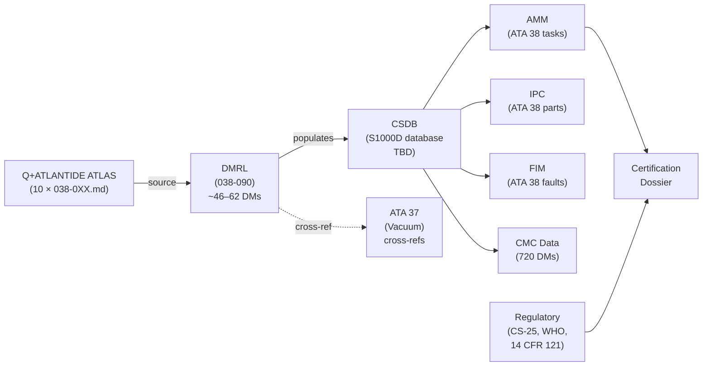
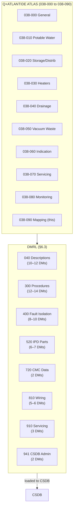
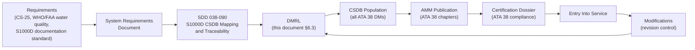

# 038-090 — S1000D CSDB Mapping and Traceability
### <PROGRAMME> · ATA 38 · Q+ATLANTIDE ATLAS Scaffold

**Status:**   
**Revision:** 0.1.0 — 2026-05-10  
**Classification:** Q-AIR Primary | Q-DATAGOV / Q-DIGITAL / Q-MECHANICS Support

---

## §0 Hyperlink Policy

All cross-references within this document use relative Markdown links anchored to section headings within the Q+ATLANTIDE ATLAS repository. External regulatory references are cited by document identifier only. Internal DMC cross-references follow the pattern `DMC-<MODEL>-<SYSTEMDIFF>-038-NN-NNA-XXXXA-A`. Where a parameter is not yet determined, the badge  is used inline.

---

## §1 Purpose

This document defines the **S1000D CSDB Mapping and Traceability** for ATA 38 Water and Waste on the **<PROGRAMME>**. It provides:

1. Data Module Requirements List (DMRL): all 10 ATA 38 subsubjects × applicable info codes; estimated total DM count.
2. Info code definitions: the S1000D info codes used for ATA 38 documentation.
3. CSDB structure: SNS coding, BREX/DMRL status, CSDB address.
4. AMM chapter list: correspondence between ATA 38 subsubjects and AMM task numbers.
5. ATA 37 cross-references: boundary at EFV inlet; shared data modules.
6. Traceability matrix: ATLAS document → DMRL DM → AMM task → regulatory requirement.

---

> **Agnostic standard.** This file defines the S1000D/CSDB mapping rule for this ATLAS node. It does not instantiate programme-specific DMCs, model identifiers, or system-difference codes. Programme-specific content belongs in the programme implementation branch.

## §2 Applicability

| Item | Value |
|---|---|
| Aircraft Programme | <PROGRAMME> |
| Variant | All variants |
| ATA Chapter/Subsubject | 038-090 — S1000D CSDB Mapping and Traceability |
| Document Tier | Level 2 — SDD |
| Effectivity | MSN 0001 onwards  |
| Parent Document | [038-000](./038-000-Water-and-Waste-General.md) |
| S1000D Issue | 5.0 TBD  |
| CSDB Status | Not yet created  |

---

## §3 System/Function Overview

### 3.1 S1000D Documentation Framework

The <PROGRAMME> uses S1000D Issue TBD for all technical publications. ATA 38 documentation is structured as follows:

| Publication | ATA 38 Content | S1000D Pub Module |
|---|---|---|
| Aircraft Maintenance Manual (AMM) | All ATA 38 maintenance tasks (remove, install, test, service) | ATA 38 AMM publication module |
| Illustrated Parts Catalog (IPC) | All ATA 38 line-replaceable units and parts | ATA 38 IPC publication module |
| System Description Document (SDD) | System description DMs (info code 040) | ATA 38 SDD publication module |
| Fault Isolation Manual (FIM) | Fault isolation DMs (info code 400) | ATA 38 FIM publication module |
| Component Maintenance Manual (CMM) | Shop-level tasks for ATA 38 LRUs | Vendor-supplied TBD |
| Wiring Diagram Manual (WDM) | Electrical schematics for ATA 38 | ATA 38 WDM publication module |

### 3.2 SNS Reference Structure

| Level | Pattern | Example |
|---|---|---|
| System | ATA 38 | Water and Waste |
| Subsystem | ATA 38-0X | 038-00 to 038-09 |
| Sub-subsystem | ATA 38-0X0 | 038-000 to 038-090 |
| S1000D SNS | 038-0X-00A | 038-07-10A (fill servicing) |

DMC pattern: `DMC-<MODEL>-<SYSTEMDIFF>-038-NN-NNA-XXXXA-A`

Where:
- `038` = ATA chapter
- `NN` = subsubject (00–09)
- `NNA` = sub-subsubject + variant (00A = first variant)
- `XXXX` = info code (4 characters)
- `A` = language/country code
- `A` = issue number

---

## §4 Scope

### 4.1 In-Scope

- DMRL table for all 10 ATA 38 subsubjects
- Info code list and definitions
- Total DM count estimate per subsubject
- AMM chapter / task number list
- ATA 37 cross-reference DMCs
- CSDB address, BREX, DMRL status fields
- Traceability: ATLAS doc → DM → AMM task → certification requirement

### 4.2 Out-of-Scope

- Content of individual data modules (written as separate CSDB documents)
- CSDB database administration: → Q-DATAGOV
- S1000D BREX development: → Q-DATAGOV / Q-DIGITAL
- Vendor CMMs: → individual suppliers

---

## §5 Architecture Description

### 5.1 ATA 38 Document Hierarchy

```
ATA 38 Water and Waste
│
├── 038-000  General ─────────────────────► SDD (040) + WDM refs
│
├── 038-010  Potable Water System ─────────► SDD + AMM (300/300) + IPC + FIM
│
├── 038-020  Water Storage and Distribution ► SDD + AMM (300/300) + IPC + FIM
│
├── 038-030  Water Heaters & Service I/F ──► SDD + AMM (300/300) + IPC + FIM
│
├── 038-040  Waste Water Drainage ─────────► SDD + AMM (300/300) + IPC + FIM
│
├── 038-050  Toilet & Vacuum Waste System ─► SDD + AMM (300/300) + IPC + FIM
│
├── 038-060  Indication and Warning ───────► SDD + FIM + CMC listing (720)
│
├── 038-070  Servicing & Ground I/F ───────► SDD + Servicing (910) + AMM
│
├── 038-080  Monitoring, Diag & Control ──► SDD + BITE (300) + FIM + CMC (720)
│
└── 038-090  S1000D CSDB Mapping ──────────► DMRL + Traceability (this document)

Cross-reference: ATA 37 Vacuum → EFV boundary DMC-<MODEL>-<SYSTEMDIFF>-037-038-00A-040A-A TBD
```

---

## §6 Functional Breakdown

### 6.1 Info Code Definitions Used in ATA 38

| Info Code | S1000D Type | Description | Used in ATA 38 |
|---|---|---|---|
| 040 | Descriptive | System description | All subsubjects |
| 300 | Procedural | Maintenance procedure (test, inspect, check) | 010–080 |
| 400 | Fault | Fault isolation | 000, 010, 020, 030, 040, 050, 060, 080 |
| 520 | Parts | IPD (Illustrated Parts Data) | 010–070 |
| 720 | CMC/OMS data | Onboard maintenance system data listing | 060, 080 |
| 810 | Wiring | Wiring data | 010, 020, 030, 040, 050, 060, 080 |
| 910 | Servicing | Servicing procedure | 020, 070 |
| 941 | External | CSDB administration data | 090 |

### 6.2 DMRL — Data Module Requirements List

**Estimated total DM count: 46–62 DMs** (TBD pending DMRL freeze — Q-DATAGOV).

| Subsubject | ATLAS Document | Estimated DMs | Info Codes Covered | DMRL Status |
|---|---|---|---|---|
| 038-000 | [038-000-Water-and-Waste-General.md](./038-000-Water-and-Waste-General.md) | 4–6 | 040, 400, 810, 941 |  |
| 038-010 | [038-010-Potable-Water-System.md](./038-010-Potable-Water-System.md) | 5–7 | 040, 300, 400, 520, 810 |  |
| 038-020 | [038-020-Water-Storage-and-Distribution.md](./038-020-Water-Storage-and-Distribution.md) | 5–7 | 040, 300, 400, 520, 810, 910 |  |
| 038-030 | [038-030-Water-Heaters-and-Service-Interfaces.md](./038-030-Water-Heaters-and-Service-Interfaces.md) | 5–6 | 040, 300, 400, 520, 810 |  |
| 038-040 | [038-040-Waste-Water-Drainage.md](./038-040-Waste-Water-Drainage.md) | 4–6 | 040, 300, 400, 520, 810 |  |
| 038-050 | [038-050-Toilet-and-Vacuum-Waste-System.md](./038-050-Toilet-and-Vacuum-Waste-System.md) | 6–8 | 040, 300, 400, 520, 810 |  |
| 038-060 | [038-060-Water-and-Waste-Indication-and-Warning.md](./038-060-Water-and-Waste-Indication-and-Warning.md) | 4–5 | 040, 400, 720, 810 |  |
| 038-070 | [038-070-Water-and-Waste-Servicing-and-Ground-Interfaces.md](./038-070-Water-and-Waste-Servicing-and-Ground-Interfaces.md) | 5–7 | 040, 300, 520, 810, 910 |  |
| 038-080 | [038-080-Water-and-Waste-Monitoring-Diagnostics-and-Control-Interfaces.md](./038-080-Water-and-Waste-Monitoring-Diagnostics-and-Control-Interfaces.md) | 6–8 | 040, 300, 400, 720, 810 |  |
| 038-090 | [038-090-S1000D-CSDB-Mapping-and-Traceability.md](./038-090-S1000D-CSDB-Mapping-and-Traceability.md) | 2–2 | 040, 941 |  |
| **Total** | | **46–62 DMs** | |  |

### 6.3 Detailed DMRL — Per-Subsubject

#### 038-000 — General

| DMC | Title | Info Code | Priority | Status |
|---|---|---|---|---|
| DMC-<MODEL>-<SYSTEMDIFF>-038-00-00A-040A-A | ATA 38 Water and Waste — System Description | 040 | High |  |
| DMC-<MODEL>-<SYSTEMDIFF>-038-00-00A-400A-A | ATA 38 Water and Waste — Fault Isolation | 400 | High |  |
| DMC-<MODEL>-<SYSTEMDIFF>-038-00-00A-810A-A | ATA 38 Water and Waste — Wiring Diagram | 810 | Medium |  |
| DMC-<MODEL>-<SYSTEMDIFF>-038-00-00A-941A-A | ATA 38 DMRL and CSDB Mapping | 941 | Medium |  |

#### 038-010 — Potable Water System

| DMC | Title | Info Code | Priority | Status |
|---|---|---|---|---|
| DMC-<MODEL>-<SYSTEMDIFF>-038-01-00A-040A-A | Potable Water System — Description | 040 | High |  |
| DMC-<MODEL>-<SYSTEMDIFF>-038-01-10A-300A-A | Potable Water System — EWP Removal/Installation | 300 | High |  |
| DMC-<MODEL>-<SYSTEMDIFF>-038-01-20A-300A-A | UV Steriliser Unit — Removal/Installation | 300 | High |  |
| DMC-<MODEL>-<SYSTEMDIFF>-038-01-00A-400A-A | Potable Water System — Fault Isolation | 400 | High |  |
| DMC-<MODEL>-<SYSTEMDIFF>-038-01-00A-520A-A | Potable Water System — Illustrated Parts Data | 520 | Medium |  |
| DMC-<MODEL>-<SYSTEMDIFF>-038-01-00A-810A-A | Potable Water System — Wiring Diagram | 810 | Medium |  |

#### 038-020 — Water Storage and Distribution

| DMC | Title | Info Code | Priority | Status |
|---|---|---|---|---|
| DMC-<MODEL>-<SYSTEMDIFF>-038-02-00A-040A-A | Water Storage and Distribution — Description | 040 | High |  |
| DMC-<MODEL>-<SYSTEMDIFF>-038-02-10A-300A-A | Water Tank — Removal/Installation | 300 | High |  |
| DMC-<MODEL>-<SYSTEMDIFF>-038-02-20A-300A-A | Water Distribution — Leak Check | 300 | High |  |
| DMC-<MODEL>-<SYSTEMDIFF>-038-02-00A-400A-A | Water Storage — Fault Isolation | 400 | High |  |
| DMC-<MODEL>-<SYSTEMDIFF>-038-02-00A-520A-A | Water Storage and Distribution — Illustrated Parts Data | 520 | Medium |  |
| DMC-<MODEL>-<SYSTEMDIFF>-038-02-10A-910A-A | Water Tank — Drain and Fill Servicing | 910 | High |  |

#### 038-030 — Water Heaters and Service Interfaces

| DMC | Title | Info Code | Priority | Status |
|---|---|---|---|---|
| DMC-<MODEL>-<SYSTEMDIFF>-038-03-00A-040A-A | Water Heaters — Description | 040 | High |  |
| DMC-<MODEL>-<SYSTEMDIFF>-038-03-10A-300A-A | EWH — Removal/Installation | 300 | High |  |
| DMC-<MODEL>-<SYSTEMDIFF>-038-03-20A-300A-A | TMV — Removal/Installation | 300 | High |  |
| DMC-<MODEL>-<SYSTEMDIFF>-038-03-00A-400A-A | Water Heaters — Fault Isolation | 400 | High |  |
| DMC-<MODEL>-<SYSTEMDIFF>-038-03-00A-520A-A | Water Heaters — Illustrated Parts Data | 520 | Medium |  |

#### 038-040 — Waste Water Drainage

| DMC | Title | Info Code | Priority | Status |
|---|---|---|---|---|
| DMC-<MODEL>-<SYSTEMDIFF>-038-04-00A-040A-A | Waste Water Drainage — Description | 040 | High |  |
| DMC-<MODEL>-<SYSTEMDIFF>-038-04-10A-300A-A | Mast Drain Nozzle — Removal/Installation | 300 | High |  |
| DMC-<MODEL>-<SYSTEMDIFF>-038-04-00A-400A-A | Waste Water Drainage — Fault Isolation | 400 | High |  |
| DMC-<MODEL>-<SYSTEMDIFF>-038-04-00A-520A-A | Waste Water Drainage — Illustrated Parts Data | 520 | Medium |  |

#### 038-050 — Toilet and Vacuum Waste System

| DMC | Title | Info Code | Priority | Status |
|---|---|---|---|---|
| DMC-<MODEL>-<SYSTEMDIFF>-038-05-00A-040A-A | Toilet and Vacuum Waste System — Description | 040 | High |  |
| DMC-<MODEL>-<SYSTEMDIFF>-038-05-10A-300A-A | EFV — Removal/Installation | 300 | High |  |
| DMC-<MODEL>-<SYSTEMDIFF>-038-05-20A-300A-A | WIV — Removal/Installation | 300 | High |  |
| DMC-<MODEL>-<SYSTEMDIFF>-038-05-30A-300A-A | Waste Tank — Removal/Installation | 300 | High |  |
| DMC-<MODEL>-<SYSTEMDIFF>-038-05-00A-400A-A | Vacuum Waste System — Fault Isolation | 400 | High |  |
| DMC-<MODEL>-<SYSTEMDIFF>-038-05-00A-520A-A | Vacuum Waste System — Illustrated Parts Data | 520 | Medium |  |
| DMC-<MODEL>-<SYSTEMDIFF>-038-05-00A-810A-A | Vacuum Waste System — Wiring Diagram | 810 | Medium |  |

#### 038-060 — Indication and Warning

| DMC | Title | Info Code | Priority | Status |
|---|---|---|---|---|
| DMC-<MODEL>-<SYSTEMDIFF>-038-06-00A-040A-A | Indication and Warning — Description | 040 | High |  |
| DMC-<MODEL>-<SYSTEMDIFF>-038-06-00A-400A-A | Indication and Warning — Fault Isolation | 400 | High |  |
| DMC-<MODEL>-<SYSTEMDIFF>-038-06-00A-720A-A | CMC Parameter List — ATA 38 | 720 | High |  |
| DMC-<MODEL>-<SYSTEMDIFF>-038-06-00A-810A-A | Indication and Warning — Wiring Diagram | 810 | Medium |  |

#### 038-070 — Servicing and Ground Interfaces

| DMC | Title | Info Code | Priority | Status |
|---|---|---|---|---|
| DMC-<MODEL>-<SYSTEMDIFF>-038-07-00A-040A-A | Servicing and Ground Interfaces — Description | 040 | High |  |
| DMC-<MODEL>-<SYSTEMDIFF>-038-07-10A-910A-A | Potable Water Fill — Servicing Procedure | 910 | High |  |
| DMC-<MODEL>-<SYSTEMDIFF>-038-07-20A-910A-A | Waste Tank Drain — Servicing Procedure | 910 | High |  |
| DMC-<MODEL>-<SYSTEMDIFF>-038-07-30A-300A-A | Water Quality Sample — Procedure | 300 | High |  |
| DMC-<MODEL>-<SYSTEMDIFF>-038-07-40A-300A-A | UV Lamp Check — Procedure | 300 | Medium |  |
| DMC-<MODEL>-<SYSTEMDIFF>-038-07-00A-520A-A | Service Panel — Illustrated Parts Data | 520 | Medium |  |

#### 038-080 — Monitoring, Diagnostics and Control Interfaces

| DMC | Title | Info Code | Priority | Status |
|---|---|---|---|---|
| DMC-<MODEL>-<SYSTEMDIFF>-038-08-00A-040A-A | Monitoring and Control — System Description | 040 | High |  |
| DMC-<MODEL>-<SYSTEMDIFF>-038-08-10A-040A-A | BITE — Description | 040 | High |  |
| DMC-<MODEL>-<SYSTEMDIFF>-038-08-10A-300A-A | BITE Power-Up — Procedure | 300 | High |  |
| DMC-<MODEL>-<SYSTEMDIFF>-038-08-20A-040A-A | THC Freeze Protection — Description | 040 | High |  |
| DMC-<MODEL>-<SYSTEMDIFF>-038-08-30A-300A-A | Maintenance Terminal Commands — Procedure | 300 | High |  |
| DMC-<MODEL>-<SYSTEMDIFF>-038-08-00A-400A-A | Monitoring System — Fault Isolation | 400 | High |  |
| DMC-<MODEL>-<SYSTEMDIFF>-038-08-40A-720A-A | CMC Parameter List — ATA 38 Monitoring | 720 | High |  |

#### 038-090 — S1000D CSDB Mapping

| DMC | Title | Info Code | Priority | Status |
|---|---|---|---|---|
| DMC-<MODEL>-<SYSTEMDIFF>-038-09-00A-040A-A | S1000D CSDB Mapping — Description | 040 | Medium |  |
| DMC-<MODEL>-<SYSTEMDIFF>-038-09-00A-941A-A | ATA 38 DMRL — CSDB Administration | 941 | High |  |

---

## §7 System Context Diagram



---

## §8 Internal Functional Architecture



---

## §9 Lifecycle Traceability



---

## §10 Interfaces

| Interface | System | Direction | Medium | Notes |
|---|---|---|---|---|
| ATLAS document input | All 038-0XX ATLAS docs | In | Markdown / YAML | Source material for CSDB content |
| CSDB | S1000D CSDB system | Out | S1000D XML | Populated from DMRL |
| AMM publication | ATA 38 AMM module | Out | S1000D publication | Maintenance tasks |
| IPC publication | ATA 38 IPC module | Out | S1000D publication | Parts data |
| FIM publication | ATA 38 FIM module | Out | S1000D publication | Fault isolation |
| CMC data | ATA 38 720 DMs | Out | S1000D publication | Onboard maintenance |
| ATA 37 cross-reference | ATA 37 CSDB | Bi-directional | CSDB cross-reference | EFV boundary DMs |
| BREX | BREX document | In | S1000D BREX | Business rules for CSDB |

---

## §11 Operating Modes

| Mode | Description |
|---|---|
| DMRL Draft | DMRL under development; DM list TBD |
| DMRL Frozen | DMRL approved; no new DMs without change control |
| CSDB Population | DMs authored and loaded to CSDB |
| Publication Build | AMM/IPC/FIM publication modules built from CSDB |
| Revision | DM updated; revision level incremented; change log updated |

---

## §12 Monitoring and Diagnostics

| Metric | Tool | Target | Notes |
|---|---|---|---|
| DMRL completeness | Q-DATAGOV CSDB reports | 100% DMs assigned before EIS | TBD |
| DM authoring status | CSDB workflow status | 100% DMs in "reviewed" before EIS | TBD |
| BREX validation | CSDB BREX checker | 0 BREX errors | TBD |
| ATA 37 cross-reference validation | Cross-reference check tool | All xrefs resolve | TBD |

---

## §13 Maintenance Concept

S1000D data modules for ATA 38 are maintained in the CSDB. All changes follow the programme change control procedure. Key governance rules:

- DMRL changes require Q-DATAGOV / Q-AIR approval.
- DM revision level incremented for all substantive changes.
- Change log (§22 of each ATLAS document) maintained in parallel with CSDB revision history.
- BREX validation mandatory before DM approval.
- ATA 37 cross-reference DMCs must be validated against ATA 37 DMRL before approval.

---

## §14 S1000D/CSDB Mapping

This section is itself the CSDB mapping for ATA 38. The master DMRL is provided in §6.3.

| CSDB Administration DM | Status |
|---|---|
| DMC-<MODEL>-<SYSTEMDIFF>-038-09-00A-941A-A |  |
| DMC-<MODEL>-<SYSTEMDIFF>-038-09-00A-040A-A |  |

---

## §15 Footprints

| Parameter | Value |
|---|---|
| Total estimated ATA 38 DMs | 46–62  |
| S1000D issue | TBD  |
| CSDB system | TBD  |
| BREX identifier | TBD  |
| AMM chapter count (ATA 38) | 10 subsubjects |
| ATA 37 cross-reference DMs | TBD  |

---

## §16 Safety and Certification

| Requirement | Standard | Application |
|---|---|---|
| Technical publication accuracy | CS-25.1529 | Instructions for Continued Airworthiness (ICA) |
| S1000D compliance | S1000D Issue TBD | All DMs must conform to S1000D specification |
| AMM task accuracy | CS-25.1529 + EASA Part 145 | All maintenance tasks must be validated against design |
| CSDB data integrity | Q-DATAGOV procedures | CSDB access control; revision control |
| Water quality procedure accuracy | WHO / 14 CFR Part 121 App A | Water servicing AMM tasks must support operator compliance |

---

## §17 Verification and Validation

| Test | Method | Acceptance Criterion | Status |
|---|---|---|---|
| EWP flow test | Bench/rig | ≥ TBD L/min |  |
| Tank leak test | Hydrostatic 1.5× WP | No leakage TBD min |  |
| EWH thermal test | Bench | Outlet ≥ 60°C; TMV ≤ 43°C TBD |  |
| UV steriliser output test | UV intensity + log-reduction | ≥ 4-log TBD |  |
| Mast heater continuity test | Resistance at install | Within tolerance |  |
| Flush cycle test | Functional rig | Waste ≤ 1.5 s TBD |  |
| Fill-level sensor accuracy | Cal 0/50/100% | ± TBD % |  |
| Overflow sensor function | Simulated overfill | Alert within TBD s |  |
| Grey water drain flow test | Max load | Clear within TBD s |  |
| Potable water quality test | Sample analysis | Meets WHO/FAA standard |  |
| Freeze protection activation test | Cold chamber | THC/EMH activate; no freeze |  |
| DMRL completeness check | CSDB report | 100% DMs authored before EIS |  |
| BREX validation | CSDB BREX tool | 0 BREX errors |  |
| ATA 37 cross-reference validation | Cross-ref tool | All xrefs resolve |  |

---

## §18 Glossary

| Term | Definition |
|---|---|
| PWS | Potable Water System |
| EWP | Electric Water Pump |
| EWH | Electric Water Heater |
| VWS | Vacuum Waste System |
| EFV | Electric Flush Valve |
| WIV | Waste Inlet Valve |
| Mast drain | Heated overboard grey drain nozzle |
| EMH | Electric Mast Heater |
| UV sterilisation | UV-C inline water treatment |
| Activated carbon filter | Filter at fill point |
| LLDPE | Linear Low-Density Polyethylene |
| PEX | Cross-linked Polyethylene |
| Capacitive level sensor | Non-contact fluid level sensor |
| NRV | Non-Return Valve |
| TMV | Thermostatic Mixing Valve |
| Grey water | Sink drainage |
| Black water | Toilet waste |
| Waste tank | Toilet waste storage vessel |
| Freeze protection | Trace/mast heating |
| Trace heating | Resistance elements on water lines |
| THC | Trace Heater Controller |
| CMC | Central Maintenance Computer |
| S1000D | International specification for technical publications |
| CSDB | Common Source DataBase — S1000D content repository |
| DMRL | Data Module Requirements List |
| DMC | Data Module Code |
| DM | Data Module |
| Info Code | S1000D category code defining content type (040, 300, 400, etc.) |
| SNS | Standard Numbering System |
| BREX | Business Rules eXchange — S1000D rule set |
| AMM | Aircraft Maintenance Manual |
| IPC | Illustrated Parts Catalog |
| FIM | Fault Isolation Manual |
| IPD | Illustrated Parts Data |
| ICA | Instructions for Continued Airworthiness |
| WDM | Wiring Diagram Manual |
| CMM | Component Maintenance Manual |

---

## §19 Citations

1. S1000D International Specification, Issue TBD. <https://s1000d.org/>
2. EASA CS-25.1529 — Instructions for Continued Airworthiness.
3. OI-038-009 — DMRL freeze pending open issues resolution.
4. [038-000 General](./038-000-Water-and-Waste-General.md).
5. [038-010 Potable Water](./038-010-Potable-Water-System.md).
6. [038-020 Storage](./038-020-Water-Storage-and-Distribution.md).
7. [038-030 Heaters](./038-030-Water-Heaters-and-Service-Interfaces.md).
8. [038-040 Drainage](./038-040-Waste-Water-Drainage.md).
9. [038-050 Vacuum Waste](./038-050-Toilet-and-Vacuum-Waste-System.md).
10. [038-060 Indication](./038-060-Water-and-Waste-Indication-and-Warning.md).
11. [038-070 Servicing](./038-070-Water-and-Waste-Servicing-and-Ground-Interfaces.md).
12. [038-080 Monitoring](./038-080-Water-and-Waste-Monitoring-Diagnostics-and-Control-Interfaces.md).

---

## §20 References

| Ref | Document | Notes |
|---|---|---|
| [R1] | S1000D Issue TBD | Technical publications specification |
| [R2] | CS-25.1529 | ICA |
| [R3] | EASA Part 145 | Maintenance organisation |
| [R4] | [038-000](./038-000-Water-and-Waste-General.md) | ATA 38 General |
| [R5] | ATA 37 DMRL TBD | Vacuum system cross-reference |
| [R6] | Q-DATAGOV CSDB procedures | CSDB administration |

---

## §21 Open Issues

| ID | Description | Owner | Status |
|---|---|---|---|
| OI-038-001 | Tank capacity and material | Q-AIR / Q-MECHANICS |  |
| OI-038-002 | Tank pressurisation method | Q-AIR / Q-MECHANICS |  |
| OI-038-003 | EWH count, placement, power budget | Q-AIR / Q-MECHANICS |  |
| OI-038-004 | Grey water retention regulatory review | Q-AIR / ORB-LEG |  |
| OI-038-005 | Waste tank count and capacity | Q-AIR / Q-MECHANICS |  |
| OI-038-006 | Freeze protection strategy | Q-AIR / Q-MECHANICS |  |
| OI-038-007 | UV sterilisation certification and interval | Q-AIR / ORB-LEG |  |
| OI-038-008 | Mast drain count and location | Q-AIR / Q-MECHANICS |  |
| OI-038-009 | Single-point servicing panel — DMRL freeze pending | Q-AIR / Q-DATAGOV |  |

---

## §22 Change Log

| Revision | Date | Author | Description |
|---|---|---|---|
| 0.1.0 | 2026-05-10 | Q+ATLANTIDE ATLAS Working Group | Initial full-template draft; DMRL for all 10 subsubjects; ~46–62 DMs; info codes; AMM mapping; ATA 37 cross-refs; all 23 sections |
| 0.0.0 | 2026-05-10 | Q+ATLANTIDE ATLAS Working Group | Scaffold stub created |
