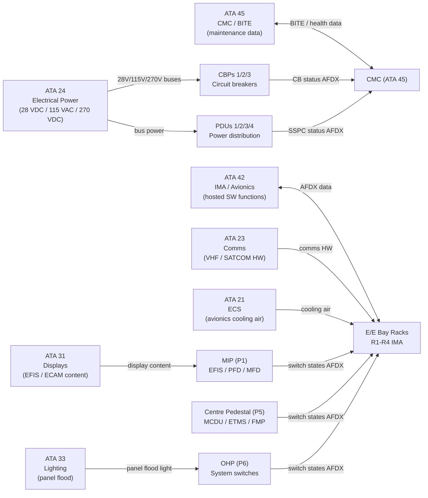
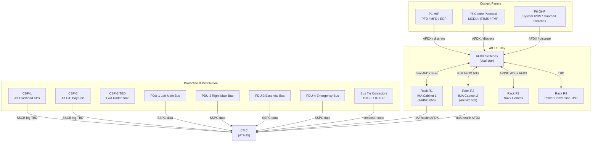
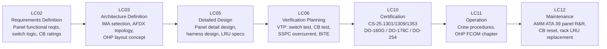

# 039-000 — Electrical/Electronic Panels and Multipurpose Components — General
### [PROGRAMME-AIRCRAFT] [PROGRAMME-VARIANT] · ATA 39 · Q+ATLANTIDE ATLAS Scaffold

**Status:**   
**Revision:** 0.1.0 — 2026-05-10  
**Classification:** Q-AIR Primary | Q-MECHANICS / Q-DATAGOV / Q-HPC / Q-GROUND / Q-INDUSTRY Support

---

## §0 Hyperlink Policy

All cross-references within this document use relative Markdown links anchored to section headings within the Q+ATLANTIDE ATLAS repository. External regulatory references (CS-25, DO-160G, DO-178C, DO-254, ARINC standards) are cited by document identifier only; no live external URLs are embedded because regulatory and standards document URLs are subject to change without notice. Internal DMC cross-references follow the pattern `DMC-<PROGRAMME>-<VARIANT>-039-XX-YYYY-A`. Traceability links to the CSDB are maintained in §14. Where a parameter is not yet determined, the badge  is used inline. Badges  and  indicate work in progress or planned content respectively.

---

## §1 Purpose

This document defines the agnostic ATLAS standard-level architecture context for `039-000 — Electrical/Electronic Panels and Multipurpose Components — General`.

It describes the controlled scope, functions, interfaces, safety considerations, lifecycle traceability, and S1000D/CSDB mapping logic that programme implementations shall instantiate when this node is applicable.

This document is not a programme design baseline. Programme-specific capacities, locations, part numbers, effectivity, operating limits, maintenance references, and data module codes shall be defined only inside the applicable programme implementation branch.
## §2 Applicability

| Applicability Level | Rule |
|---|---|
| Standard taxonomy | Applies to the ATLAS node `<NODE>` |
| Programme implementation | Conditional; determined by programme architecture, trade studies, certification basis, and applicability model |
| Product configuration | Defined in the programme-specific configuration baseline |
| Effectivity | Defined in the programme CSDB / applicability layer |
| Non-applicability | Must be explicitly stated in the programme impact-study branch when excluded |
## §3 System/Function Overview

### 3.1 [PROGRAMME-VARIANT] ATA 39 Philosophy

The [PROGRAMME-AIRCRAFT] [PROGRAMME-VARIANT] adopts a fully electric architecture. This has several direct consequences for ATA 39 panels and multipurpose components:

| Feature | Conventional Aircraft | [PROGRAMME-VARIANT] Solution |
|---|---|---|
| Hydraulic control switches on OHP | Multiple hydraulic pump, system A/B switches | Absent — replaced by EMA control switches and ECS electric compressor switches |
| APU generator switches | APU generator control unit switch | Retained (if APU fitted) or replaced by ground power only  |
| CB voltage levels | 28 VDC, 115 VAC, 230 VAC | 28 VDC, 115 VAC, **270 VDC HVDC** added  |
| IMA architecture | Traditional federated LRUs | ARINC 653 partitioned IMA — fewer boxes, software-defined functions |
| Panel data bus | ARINC 429 / discrete wiring | **AFDX (ARINC 664 Part 7)** primary; ARINC 429 legacy retained |
| Solid-State CBs | Not fitted | SSCB evaluation under way (OI-039-001) |

### 3.2 Panel Location Summary

| Panel ID | Location | Primary Function |
|---|---|---|
| P1 (MIP) | Forward cockpit, centre | EFIS display units, PFDs, MFDs, EFIS control panels |
| P5 (Centre Pedestal) | Between pilots, floor | FMS MCDU, ETMS panel, fuel management, comm selectors |
| P6 (OHP) | Forward overhead | System switches: ECS, electrical, lighting, fuel, de-ice, O₂, fire |
| CBP-1 | Aft overhead | Cabin and galley circuit breakers, 28 VDC / 115 VAC |
| CBP-2 | Aft E/E bay | Avionics and system circuit breakers |
| CBP-3 | Fwd under-floor |  — optional, pending OI-039-007 |
| R1–R4 | Aft E/E bay | IMA Rack 1/2, Nav/Comms Rack, Power Conversion Rack |

---

## §4 Scope

### 4.1 In-Scope

- Main Instrument Panel (MIP/P1): EFIS display units, EFIS control panels, instrument layout
- Centre Pedestal (P5): MCDU, ETMS panel, fuel management panel, comms selectors
- Overhead Panel (OHP/P6): all system switching assemblies, guarded switches, annunciator panels
- Circuit Breaker Panels CBP-1, CBP-2, CBP-3 (TBD): thermal-magnetic CBs and/or SSCBs
- Power Distribution Units PDU-1 through PDU-4 and Bus Tie Contactors (BTCs)
- Solid-State Power Controllers (SSPCs) for load management
- Aft E/E bay: avionics racks R1–R4, cooling interfaces
- Multipurpose component modules: SCMs, PSMs, RDCUs hosted in IMA racks
- Panel indication and HMI: LED push-buttons, ECAM-equivalent displays, MCDU
- Panel wiring, harnesses, MIL-DTL-38999 connectors, bonding
- Panel BITE, CMC monitoring interfaces, AFDX data links for panel health

### 4.2 Out-of-Scope

- Electrical power generation (IDGs, TRUs, batteries): → ATA 24
- Avionics software hosted in IMA (FMS, FCS): → ATA 42
- CMC hardware and software: → ATA 45
- Display system content and function: → ATA 31
- Communication equipment (radios, VHF, SATCOM hardware): → ATA 23
- Lighting fixtures and circuits (cabin, external): → ATA 33

### 4.3 Document Hierarchy

| Subsubject | Title | Status |
|---|---|---|
| 039-000 | General |  |
| 039-010 | Control Panels and Switching Assemblies |  |
| 039-020 | Circuit Breaker and Protection Panels |  |
| 039-030 | Relay, Contactor, and Power Distribution Panels |  |
| 039-040 | Avionics and Electronic Equipment Racks |  |
| 039-050 | Multipurpose Component Modules |  |
| 039-060 | Panel Indication, Lighting, and Human-Machine Interfaces |  |
| 039-070 | Panel Wiring, Connectors, and Installation Interfaces |  |
| 039-080 | Panel Monitoring, Diagnostics, and Control Interfaces |  |
| 039-090 | S1000D/CSDB Mapping and Traceability |  |

---

## §5 Architecture Description

### 5.1 Panel Architecture Overview

The [PROGRAMME-VARIANT] cockpit is a glass cockpit with three primary panel zones feeding into a centralised IMA architecture via AFDX:

**Zone 1 — Pilot Interface Panels (P1, P5, P6):**
All switch states (IPBS signals, rotary selector positions, guarded switch states) are wired to discrete I/O interfaces or directly to AFDX-connected panel controller modules. No direct hard-wiring of switches to actuated equipment is used for non-critical functions; critical functions (e.g. fire extinguisher discharge) retain direct hardwired loops.

**Zone 2 — Power Distribution and Protection (CBPs, PDUs, BTCs):**
CBP-1 and CBP-2 protect 28 VDC and 115 VAC branch circuits. PDU-1/2 serve main buses, PDU-3 the essential bus, PDU-4 the emergency bus. BTCs enable cross-feed. All SSPC states (if fitted) are logged and transmitted to CMC via AFDX.

**Zone 3 — Avionics E/E Bay (Racks R1–R4):**
IMA racks host ARINC 653-partitioned software modules. Rack cooling is supplied from ATA 21 (ECS conditioned air) or dedicated ACF. AFDX switches within the racks provide dual-star redundant data links to all aircraft systems.

### 5.2 Data Architecture

```
[P1/P5/P6 Switches] → [Panel I/O Modules / RDCUs] → [AFDX Switch] → [IMA R1/R2]
[CBP-1/CBP-2 SSCB] → [AFDX] → [CMC (ATA 45)]
[PDU-1/2/3/4 SSPCs] → [AFDX] → [IMA / CMC]
[Rack R3 Nav/Comms] → [ARINC 429 + AFDX]
```

---

## §6 Functional Breakdown

| Subsubject | Function | Key Components | Status |
|---|---|---|---|
| 039-000 | System overview | All ATA 39 |  |
| 039-010 | Control switching | OHP IPBS, guarded switches, P5 ETMS, P1 ECPs |  |
| 039-020 | CB and protection | CBP-1/2/3, thermal CBs, SSCB TBD |  |
| 039-030 | Power distribution | PDU-1/2/3/4, BTC, SSPC, contactors |  |
| 039-040 | Avionics racks | R1–R4, ARINC 600/404, IMA cabinets, cooling |  |
| 039-050 | Multipurpose modules | SCM, PSM, RDCU hosted in IMA |  |
| 039-060 | HMI / indication | LED IPBS, EFIS, ECAM, MCDU, CCD |  |
| 039-070 | Wiring and connectors | Harnesses, MIL-DTL-38999, bonding, AFDX cabling |  |
| 039-080 | Monitoring and BITE | Panel BITE, SSCB log, CMC, AFDX health |  |
| 039-090 | S1000D/CSDB mapping | DMC assignments, DMRL |  |

---

## §7 System Context Diagram



---

## §8 Internal Functional Architecture



---

## §9 Lifecycle Traceability



---

## §10 Interfaces

| Interface | Direction | Counterpart | Signal Type | Notes |
|---|---|---|---|---|
| 28 VDC bus power | In | ATA 24 | Electrical (28 VDC) | Panel avionics power |
| 115 VAC bus power | In | ATA 24 | Electrical (115 VAC) | IMA rack primary power TBD |
| 270 VDC HVDC bus | In | ATA 24 | Electrical (270 VDC) | High-current contactors / SSCB HVDC  |
| AFDX data — panels | Bi-directional | ATA 42 IMA | AFDX (ARINC 664 Pt 7) | Switch states, CB status, panel health |
| AFDX data — CMC | Out | ATA 45 CMC | AFDX | BITE reports, SSCB logs, SSPC states |
| ARINC 429 — nav/comms | Bi-directional | ATA 23/34 | ARINC 429 | Legacy avionics bus on rack R3 |
| Avionics cooling air | In | ATA 21 ECS | Fluid (conditioned air) | E/E bay rack cooling |
| Display content | In | ATA 31/42 | AFDX | EFIS PFD/MFD symbology to P1 screens |
| Panel flood lighting | In | ATA 33 | Electrical (28 VDC) | OHP and pedestal flood lights |
| BITE output to CMC | Out | ATA 45 | AFDX / discrete | Panel self-test results |
| Ground power interface | In | Ground (GPU) | Electrical (AC/DC) | Ground maintenance power for panels |

---

## §11 Operating Modes

| Mode | P1 MIP | P5 Pedestal | P6 OHP | CBPs | PDUs / SSPCs |
|---|---|---|---|---|---|
| Normal Flight | EFIS active, all displays | FMS CDU active, ETMS | All system switches armed | All CBs IN, monitoring | All buses energised, SSPC monitoring |
| Ground — Pre-flight | EFIS power-up BITE | FMS initialise | OHP pre-flight check | All CBs IN | GPU-powered buses |
| Ground — Maintenance | BITE mode via CMC terminal | Maintenance pages | Individual switch test | CB test, manual reset | SSPC test, manual |
| Emergency — Degraded Power | Essential bus PFD only | Minimal comms | Essential switches only | Non-essential CBs may trip | PDU-3/4 only; load shed |
| Cold Soak / Unpowered | Dark cockpit | Dark | Dark | CB states retained (mechanical) | Contactors open |
| Smoke/Fire Response | All displays operational | FMS running | Fire switch guards lifted, discharge armed | Per abnormal proc | Per load-shed logic |

---

## §12 Monitoring and Diagnostics

| Parameter | Sensor / Source | CMC Signal | Alert |
|---|---|---|---|
| Panel IPBS continuity | Switch self-test (BITE) | AFDX | "PANEL SW FAULT" (advisory) |
| CB trip state | CB trip indicator (mechanical + SSCB digital TBD) | AFDX (SSCB) / visual | CB collar / SSCB log |
| SSPC overcurrent | SSPC current sensor | AFDX | "PDU FAULT" (caution) |
| IMA rack temperature | Rack temperature sensors (internal) | AFDX | "RACK TEMP HI" (caution) |
| AFDX link health | AFDX switch port monitor | AFDX | "AFDX LINK FAIL" (caution) |
| Backlight brightness | Photosensor / dimmer feedback | AFDX | Maintenance advisory |
| Rack cooling airflow | Differential pressure or airflow sensor TBD | AFDX | "AVIONICS COOLING" (caution) |
| PDU bus voltage | Voltage monitor in PDU | AFDX | Bus overvoltage / undervoltage alert |
| BTC contact state | Position feedback relay | AFDX discrete | Bus tie open/closed status |

---

## §13 Maintenance Concept

### 13.1 On-Wing Maintenance

| Task | Interval | Access | Skill Level |
|---|---|---|---|
| Visual inspection all panels (P1, P5, P6) | A-check  | Cockpit direct access | Line maintenance |
| IPBS push-button legend lamp check | A-check TBD | Cockpit direct access | Line maintenance |
| CB reset (tripped CB) | On condition | CBP-1 / CBP-2 overhead or E/E bay | Line maintenance |
| SSCB digital log review | Each visit (via CMC) | CMC terminal | Line maintenance |
| Rack LRU replacement | On condition | E/E bay hinged rack doors | Line maintenance (trained) |
| Rack cooling filter clean / replace | C-check TBD | E/E bay access | Line/base |
| Panel bonding resistance check | C-check TBD | Panel mounting points | Base maintenance |
| Panel wiring insulation resistance test | C-check TBD | Panel disconnect | Base maintenance |
| AFDX cable inspection | C-check TBD | E/E bay racks | Base maintenance |
| BITE/CMC fault review | Each visit | CMC terminal | Line maintenance |

### 13.2 Off-Wing / Shop Maintenance

- CBP panel assemblies: bench inspection and CB replacement at manufacturer CMM interval TBD.
- PDU/SSPC modules: shop overhaul per manufacturer LRU CMM; SSPC calibration check TBD.
- IMA modules (LRMs): depot-level software reload, hardware bench test per ARINC 653 CMM.

---

## §14 S1000D/CSDB Mapping

| Document | DMC Pattern | Info Code | Status |
|---|---|---|---|
| System description (this document) | DMC-<PROGRAMME>-<VARIANT>-039-00-00A-040A-A | 040 |  |
| Fault isolation — ATA 39 general | DMC-<PROGRAMME>-<VARIANT>-039-00-00A-400A-A | 400 |  |
| Inspection — ATA 39 general | DMC-<PROGRAMME>-<VARIANT>-039-00-00A-300A-A | 300 |  |

Full DMRL mapping in [039-090](./039-090-S1000D-CSDB-Mapping-and-Traceability.md).

---

## §15 Footprints

| Parameter | Value |
|---|---|
| Panel count (cockpit) | 3 (P1, P5, P6) |
| CBP count | 3 (CBP-1 aft OHP, CBP-2 E/E bay, CBP-3 TBD) |
| PDU count | 4 (PDU-1 through PDU-4) |
| E/E bay rack count |  (~4 racks) |
| IMA rack form factor |  (ARINC 600 or ARINC 404) |
| AFDX switch count |  (~2 dual-redundant switches) |
| Total CB count (all CBPs) |  |
| Total SSPC count (all PDUs) |  |
| E/E bay volume |  |
| Panel system total mass |  |
| AFDX cable total length |  |

---

## §16 Safety and Certification

| Requirement | Standard | Application |
|---|---|---|
| Function and installation | CS-25.1301 | All panel and rack equipment fit for purpose |
| System safety — failure effects | CS-25.1309 | CBP, PDU, SSPC, IMA failure mode analysis; no catastrophic single failure |
| Electrical equipment and installations | CS-25.1353 | Panel wiring, CBPs, contactors, HVDC protection |
| Environmental qualification | DO-160G | All panel hardware: vibration, temperature, humidity, EMI/EMC |
| Avionics software | DO-178C | IMA-hosted software; DAL per function criticality |
| Complex electronic hardware | DO-254 | FPGA / ASIC in IMA modules, SSCBs |
| IMA partitioning | ARINC 653 | Spatial and temporal partitioning of IMA hosted functions |
| AFDX data bus | ARINC 664 Part 7 | Data bus qualification and redundancy |
| LRU form factor | ARINC 404 / ARINC 600 | Rack and module interchangeability |
| Avionics rack standard | ARINC 600 | E/E bay rack mechanical standard TBD |
| Trip-free CB design | ATA engineering standard | All CBs trip-free; cannot be held in by crew |
| Guarded critical switches | CS-25 / ATA 25 design standard | Fire extinguisher, emergency switches guarded |

---

## §17 Verification and Validation

| Test | Method | Acceptance Criterion | Status |
|---|---|---|---|
| Switch function test (all IPBS) | Functional test, measure switch state output | All states correctly reflected in AFDX data frame |  |
| CB trip / reset test | Apply overcurrent; measure trip time; manual reset | Trip within rated time; reset restores circuit |  |
| SSCB digital log verification | Trip event; read CMC log via maintenance terminal | Log entry generated with time-stamp, magnitude, temperature |  |
| PDU load test | Apply rated load per bus; verify SSPC no false trip | All SSPCs stable at rated load |  |
| SSPC overcurrent test | Inject overcurrent; measure trip threshold and time | Trip within SSPC spec ± TBD% |  |
| Rack cooling temperature test | Apply max heat dissipation; measure rack inlet/outlet air | Inlet ≤ TBD °C; components within rated temp |  |
| IMA module BITE test | Powerup BITE cycle; inject known fault | BITE correctly detected and reported to CMC |  |
| AFDX link test | Link-up verification; inject frame errors | Redundant path switchover < TBD ms |  |
| Panel bonding resistance check | Milliohm meter, panel to aircraft structure | ≤ 2.5 mΩ (TBD per ATA 24 standard) |  |
| Panel wiring insulation resistance | Megger test at 500 VDC | ≥ TBD MΩ per conductor-to-ground |  |
| LED backlight brightness check | Luminance meter at panel surface | Within TBD cd/m² range, dimmer response linear |  |
| DO-160G environmental | Per DO-160G test categories applicable | All tests pass per qualification test plan |  |

---

## §18 Glossary

| Term | Definition |
|---|---|
| OHP | Overhead Panel (P6) — the overhead cockpit panel carrying system switches for ECS, electrical, fuel, lighting, de-ice, oxygen, and fire protection |
| MIP | Main Instrument Panel (P1) — forward cockpit panel carrying EFIS display units and primary flight instruments |
| P5 | Centre Pedestal — the floor-mounted pedestal panel between pilots carrying MCDU, ETMS, FMP, and communications selectors |
| CBP | Circuit Breaker Panel — panel assembly carrying circuit breakers protecting individual electrical circuits |
| SSCB | Solid-State Circuit Breaker — electronic circuit breaker with digital trip logging, remote monitoring, and reduced weight vs. thermal-magnetic type |
| PDU | Power Distribution Unit — assembly distributing bus power to multiple load circuits via SSPCs and contactors |
| SSPC | Solid-State Power Controller — electronic load controller with programmable overcurrent trip, current sensing, and AFDX health reporting |
| BTC | Bus Tie Contactor — electromechanical contactor enabling cross-feed between left and right main buses |
| IMA | Integrated Modular Avionics — ARINC 653-compliant avionics architecture hosting multiple software functions in partitioned cabinets |
| LRM | Line-Replaceable Module — modular avionics hardware card replaceable at line maintenance level |
| LRU | Line-Replaceable Unit — aircraft equipment item replaceable as a complete unit at line maintenance level |
| RDCU | Remote Data Concentrator Unit — unit aggregating discrete, analog, and ARINC 429 I/O signals and forwarding over AFDX |
| SCM | Signal Conditioning Module — module converting analog sensor inputs (voltage, current, resistance) to digital format for IMA processing |
| PSM | Power Supply Module — DC/DC converter module within IMA rack providing regulated low-voltage supply to hosted modules |
| ARINC 600 | ARINC standard defining mechanical dimensions and connector interfaces for avionics rack equipment |
| ARINC 404 | ARINC standard defining mechanical and electrical interfaces for LRU form-factor equipment |
| ARINC 653 | ARINC standard defining IMA operating system partitioning (APEX API) — spatial and temporal isolation of hosted software functions |
| ARINC 664 Pt 7 | ARINC standard defining AFDX — full-duplex switched Ethernet with deterministic QoS for avionics |
| AFDX | Avionics Full-Duplex Switched Ethernet — aircraft data bus per ARINC 664 Part 7; dual-star redundant topology |
| MCDU | Multifunction Control Display Unit — crew-operated alphanumeric display and keyboard unit for FMS data entry |
| EFIS | Electronic Flight Instrument System — suite of electronic primary flight displays (PFD) and multifunction displays (MFD) |
| ECAM | Electronic Centralised Aircraft Monitor (or equivalent) — systems monitoring display showing engine parameters and system synoptics |
| ETMS | Electric Thrust Management System — the [PROGRAMME-VARIANT] all-electric equivalent of the FADEC/thrust management function; panel on P5 |
| CMC | Central Maintenance Computer — ATA 45 system collecting BITE, fault, and health data from all aircraft systems |
| BITE | Built-In Test Equipment — self-test capability embedded in aircraft LRUs/LRMs for fault detection and isolation |
| EWD | Engine/Warning Display — the upper ECAM screen showing engine parameters and system alerts |
| IPBS | Illuminated Push-Button Switch — a push-button cockpit switch with integral LED backlit legend indicating on/off/fault state |
| ETFE | Ethylene-Tetrafluoroethylene — high-temperature fluoropolymer wire insulation used in aerospace harnesses |
| PTFE | Polytetrafluoroethylene — wire insulation material for aerospace harnesses |
| MIL-DTL-38999 | US military-derived circular connector standard widely used for aerospace panel-to-harness connections |

---

## §19 Citations

1. EASA Certification Specifications CS-25, CS-25.1301 — Function and installation.
2. EASA Certification Specifications CS-25, CS-25.1309 — Equipment, systems, and installations.
3. EASA Certification Specifications CS-25, CS-25.1353 — Electrical equipment and installations.
4. RTCA/EUROCAE DO-160G — Environmental Conditions and Test Procedures for Airborne Equipment.
5. RTCA/EUROCAE DO-178C — Software Considerations in Airborne Systems and Equipment Certification.
6. RTCA/EUROCAE DO-254 — Design Assurance Guidance for Airborne Electronic Hardware.
7. ARINC Report 653 — Avionics Application Software Standard Interface (APEX).
8. ARINC Report 664 Part 7 — Aircraft Data Network — Avionics Full Duplex Switched Ethernet (AFDX).
9. ARINC Report 600 — Air Transport Avionics Equipment Interfaces.
10. ARINC Report 404 — Air Transport Equipment Cases and Racking.
11. Q+ATLANTIDE ATLAS [039-090 S1000D/CSDB Mapping](./039-090-S1000D-CSDB-Mapping-and-Traceability.md).

---

## §20 References

| Ref | Document | Notes |
|---|---|---|
| [R1] | CS-25.1301 | Function and installation — all ATA 39 equipment |
| [R2] | CS-25.1309 | System safety — failure mode analysis for panels and distribution |
| [R3] | CS-25.1353 | Electrical equipment installations — CBPs, PDUs, HVDC protection |
| [R4] | DO-160G | Environmental qualification for all panel hardware |
| [R5] | DO-178C | Software assurance for IMA-hosted functions |
| [R6] | DO-254 | Hardware assurance for complex electronic hardware in IMA / SSCB |
| [R7] | ARINC 653 | IMA partitioning standard |
| [R8] | ARINC 664 Pt 7 | AFDX data bus standard |
| [R9] | ARINC 600 | Avionics rack mechanical standard |
| [R10] | ARINC 404 | LRU form-factor standard |
| [R11] | ATA 24 — [Electrical Power ATLAS] | Bus architecture, CB and PDU power interfaces |
| [R12] | ATA 42 — [IMA ATLAS] | IMA and AFDX hosted function interfaces |
| [R13] | ATA 45 — [CMC ATLAS] | CMC and BITE architecture |

---

## §21 Open Issues

| ID | Description | Owner | Status |
|---|---|---|---|
| OI-039-001 | SSCB vs. thermal-magnetic CB decision (weight, cost, certification maturity for 270 VDC circuits) | Q-AIR / Q-MECHANICS |  |
| OI-039-002 | E/E bay cooling method: ECS air divert vs. dedicated avionics cooling fan (ACF) unit | Q-AIR / Q-MECHANICS |  |
| OI-039-003 | EFIS/ECAM manufacturer selection: Thales Avionics, Collins Aerospace, or L3Harris | Q-AIR / ORB-PMO |  |
| OI-039-004 | OHP layout freeze: awaiting ATA 24 and ATA 21 system architecture confirmation | Q-AIR |  |
| OI-039-005 | 270 VDC vs. 115 VAC primary distribution bus definition (pending ATA 24 decision) | Q-AIR / Q-MECHANICS |  |
| OI-039-006 | IMA rack form factor: ARINC 600 vs. ARINC 404, quantity TBD | Q-AIR / Q-HPC |  |
| OI-039-007 | Forward E/E bay inclusion decision: weight trade vs. maintenance access benefit | Q-AIR / Q-MECHANICS |  |
| OI-039-008 | Multipurpose component module expansion provisions and connector standardisation | Q-AIR / Q-HPC |  |

---

## §22 Change Log

| Revision | Date | Author | Description |
|---|---|---|---|
| 0.1.0 | 2026-05-10 | Q+ATLANTIDE ATLAS Working Group | Initial full-template draft; all 23 sections populated; [PROGRAMME-VARIANT] ATA 39 context incorporated |
| 0.0.0 | 2026-05-10 | Q+ATLANTIDE ATLAS Working Group | Scaffold stub created |
