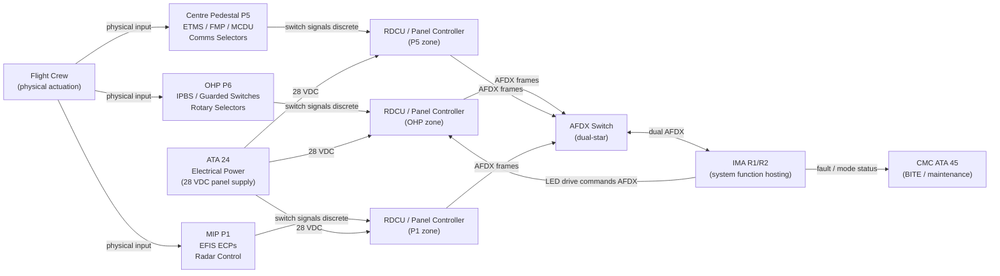
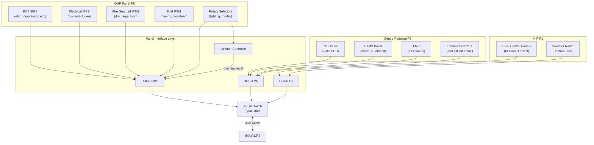
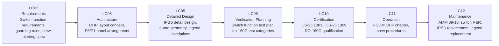

# 039-010 — Control Panels and Switching Assemblies
### AMPEL360e eWTW · ATA 39 · Q+ATLANTIDE ATLAS Scaffold

**Status:**   
**Revision:** 0.1.0 — 2026-05-10  
**Classification:** Q-AIR Primary | Q-MECHANICS / Q-DATAGOV / Q-HPC / Q-GROUND / Q-INDUSTRY Support

---

## §0 Hyperlink Policy

All cross-references within this document use relative Markdown links anchored to section headings within the Q+ATLANTIDE ATLAS repository. External regulatory references (CS-25, DO-160G, ARINC standards) are cited by document identifier only; no live external URLs are embedded. Internal DMC cross-references follow the pattern `DMC-AMPEL360E-EWTW-039-10-YYYY-A`. Where a parameter is not yet determined, the badge  is used inline. Badges  and  indicate work in progress or planned content respectively.

---

## §1 Purpose

This document describes the **Control Panels and Switching Assemblies** (subsubject 039-010) of the AMPEL360e eWTW. It covers:

1. Overhead Panel (OHP / P6): illuminated push-button switches (IPBS), guarded switches, rotary selectors, and annunciator backplates, grouped by ATA chapter.
2. Centre Pedestal (P5): ETMS (Electric Thrust Management System) panel, Fuel Management Panel (FMP), MCDU slots, and communications selector panels.
3. Main Instrument Panel (MIP / P1): EFIS Control Panels (ECPs), weather radar control panel, audio control panels.
4. Switch qualification requirements (DO-160G, critical function guarding).
5. Legend format: LED backlighting, AECMA colour convention.
6. Data interface: all switch states transmitted over AFDX to IMA.

---

## §2 Applicability

| Item | Value |
|---|---|
| Aircraft Programme | AMPEL360e eWTW |
| Variant | All variants |
| ATA Chapter | 39 — Electrical/Electronic Panels and Multipurpose Components |
| Subsubject | 039-010 Control Panels and Switching Assemblies |
| Document Tier | Level 3 — Component/Assembly Description |
| Effectivity | MSN 0001 onwards  |

Includes all switching devices on panel boards P1, P5, and P6. Excludes:
- Circuit breakers (→ 039-020)
- Display units and screens (→ 039-060 and ATA 31)
- Communication equipment (→ ATA 23)

---

## §3 System/Function Overview

### 3.1 Panel Zone Summary

The eWTW cockpit control panels are organised into three physical zones:

| Zone | Panel ID | Location | Primary Content |
|---|---|---|---|
| Glareshield / MIP | P1 | Forward cockpit centre | EFIS ECPs, PFD/MFD display bezels, radar/transponder controls |
| Centre Pedestal | P5 | Floor-mounted between pilots | MCDU ×2, ETMS panel, FMP, comms selectors, PA panel |
| Overhead Panel | P6 / OHP | Overhead forward | All system switches: ECS, electrical, fuel, lighting, de-ice, O₂, fire, EMA |

### 3.2 eWTW-Specific Differences

The all-electric architecture removes traditional hydraulic system switches (ATA 29 pump selectors absent). Their space on the OHP is replaced with:
- **EMA control switches**: Electric Motor Actuator arm/disarm selectors for flight control surfaces (ATA 27 interface).
- **Electric compressor switches**: ECS electric compressor start/stop (ATA 21 interface).
- **ETMS mode switches**: Electric Thrust Management System mode (on P5).
- No bleed air source management panel (absent — eWTW has no engine bleed).

### 3.3 Switch Types

| Switch Type | Description | Typical Application |
|---|---|---|
| IPBS (Illuminated Push-Button Switch) | Rectangular LED-backlit push-button; latching or momentary | OHP system switches |
| Guarded switch | IPBS with hinged guard requiring guard lift before actuation | Fire extinguisher discharge, emergency switches |
| Rotary selector | Multi-position rotary switch with detents | Lighting brightness, mode selectors (NAV/STBY) |
| Toggle switch | Two-position lever-action (ON/OFF or NML/OFF) | Retained for specific functions TBD |
| Momentary push-button | Non-latching, spring-return | Test buttons, reset buttons |

---

## §4 Scope

### 4.1 In-Scope

- All IPBS units on P6 OHP including backlit legend assemblies
- All guarded switches on P6 OHP (fire extinguisher discharge, emergency depressurisation)
- Rotary selectors on P6 OHP (lighting controls, mode selectors)
- Centre Pedestal P5: ETMS panel switches, FMP switches, comms selector panels
- MIP P1: EFIS control panels (ECP), weather radar control unit
- Panel board structures: aluminium or CFRP backplates, glareshield assembly 
- Switch AFDX interface modules (panel controller or RDCU per panel zone)
- Panel dimming circuits and dimmer controllers

### 4.2 Out-of-Scope

- EFIS display screens themselves (→ 039-060 / ATA 31)
- Circuit breakers (→ 039-020)
- Panel wiring harnesses (→ 039-070)
- Panel BITE and monitoring (→ 039-080)

---

## §5 Architecture Description

### 5.1 OHP (P6) Architecture

The OHP spans the full overhead area forward of the structural beam. It is divided into sub-panels by ATA chapter grouping:

| OHP Sub-Panel | ATA Systems | Switch Count TBD |
|---|---|---|
| ECS panel | ATA 21 electric compressors, distribution, recirculation |  |
| Electrical power panel | ATA 24 bus controls, generator switches, GPU |  |
| Lighting panel | ATA 33 exterior/interior lighting controls |  |
| Fuel panel | ATA 28 fuel pump switches, crossfeed |  |
| De-icing panel | ATA 30 WIPS, windshield, probe heat |  |
| Oxygen panel | ATA 35 O₂ system switches |  |
| Fire protection panel | ATA 26 fire loop select, extinguisher discharge (guarded) |  |
| EMA panel | ATA 27 EMA arm/disarm (eWTW-specific) |  |
| Maintenance / test panel | ATA 45 test switches TBD |  |

### 5.2 IPBS Legend Format

All OHP push-button switch legends are LED-backlit:
- **White inscription**: system/function name (always visible)
- **Amber fault**: lower lens illuminates amber when system fault detected
- **Green active**: lower or upper lens illuminates green when system ON/active
- **Dark**: system off, no fault

Legend inscription format:  (final inscription list pending OHP layout freeze — OI-039-004).

### 5.3 Centre Pedestal (P5) Architecture

| P5 Sub-Panel | Function | Components |
|---|---|---|
| MCDU ×2 | FMS data entry — primary crew interface | Two MCDU units (left/right) — manufacturer TBD (OI-039-003) |
| ETMS panel | Electric Thrust Management — power lever positions, mode select | ETMS mode selector, TO/GA buttons, autothrottle arm TBD |
| FMP | Fuel Management — pump status, crossfeed | Fuel pump switches, crossfeed lever/switch |
| Comms selectors | VHF 1/2/3, HF, SELCAL, interphone | Audio management panel (AMP) or RCMS TBD |
| PA / cabin interphone | Passenger address, crew interphone | PA push-to-talk, interphone selector |

---

## §6 Functional Breakdown

| ID | Function | Components | Interface | Status |
|---|---|---|---|---|
| 039-010-F01 | OHP IPBS actuation and state output | IPBS on P6 | AFDX → IMA |  |
| 039-010-F02 | OHP guarded switch actuation | Guarded IPBS on P6 | Hardwired (critical) + AFDX (monitoring) |  |
| 039-010-F03 | OHP rotary selector position sensing | Rotary selectors P6 | AFDX → IMA |  |
| 039-010-F04 | ETMS panel mode selection | ETMS panel on P5 | AFDX → ETMS function in IMA |  |
| 039-010-F05 | FMP pump and crossfeed control | FMP on P5 | AFDX → fuel management function |  |
| 039-010-F06 | EFIS control panel (ECP) inputs | ECP on P1 | AFDX → EFIS display function |  |
| 039-010-F07 | Panel dimming control | Dimmer switches P6/P5/P1 | Dimmer controller → LED drivers |  |
| 039-010-F08 | Crew alerting — annunciator lighting | LED lenses on IPBS | IMA → LED driver → IPBS lens |  |

---

## §7 System Context Diagram

---

## §8 Internal Functional Architecture

---

## §9 Lifecycle Traceability

---

## §10 Interfaces

| Interface | Direction | Counterpart | Signal Type | Notes |
|---|---|---|---|---|
| 28 VDC panel power | In | ATA 24 | Electrical (28 VDC) | Powers IPBS LED drivers and RDCU |
| Switch state → IMA | Out | ATA 42 IMA | AFDX discrete states | Switch ON/OFF/FAULT state frames |
| LED drive commands → IPBS | In | ATA 42 IMA | AFDX → LED driver (via RDCU) | Fault / active / normal lamp states |
| Hardwired fire discharge | Out | ATA 26 fire extinguishers | 28 VDC discrete | Critical hardwired loop — not via AFDX |
| EMA arm signal | Out | ATA 27 EMA controllers | Discrete / AFDX TBD | Electric Motor Actuator arm/disarm |
| ETMS mode select | Out | ETMS function (ATA 42 IMA) | AFDX | Thrust management mode commands |
| EFIS control panel | Bi-directional | ATA 31 / ATA 42 | AFDX | Display select, range, mode buttons |
| Fuel pump commands | Out | ATA 28 fuel management | AFDX / discrete TBD | Pump switch states |
| Panel flood lighting | In | ATA 33 | 28 VDC | Cockpit flood light circuits |
| Dimmer controller | Out | LED drivers in panels | Analog / PWM | Panel legend brightness control |

---

## §11 Operating Modes

| Mode | OHP IPBS | P5 Switches | P1 ECPs | Annunciators |
|---|---|---|---|---|
| Normal Flight | All system switches armed; LED state per system status | MCDU active; ETMS autothrust armed | PFD/MFD page select active | Normal: dark/green |
| Pre-flight Ground | OHP power-up check; IPBS test cycle | FMS init; ETMS GND mode | EFIS power-up | BITE: all lamps flash TBD |
| Abnormal — System Fault | Affected system IPBS amber lit | ETMS fault flag if applicable | EFIS fault annunciation | Amber caution IPBS |
| Emergency | Fire guards lifted; discharge switches available | PA announcement | Transponder select | Red IPBS where applicable |
| Maintenance BITE | IPBS continuity test via CMC | Manual switch test from terminal | ECP test | Maintenance terminal display |
| Cold/Dark | All IPBS unlit; no power | Dark | Dark | All dark |

---

## §12 Monitoring and Diagnostics

| Parameter | Sensor / Source | CMC Signal | Alert |
|---|---|---|---|
| IPBS switch continuity | RDCU BITE self-test | AFDX | "PANEL SW FAULT" advisory |
| IPBS LED lamp failure | LED current monitor in driver | AFDX | "PANEL LAMP FAULT" advisory |
| Guard position (guarded switch) | Hall sensor or microswitch TBD | AFDX | Ground advisory if guard open without action |
| Rotary selector position | Encoder or resistance ladder | AFDX | Selector invalid position advisory TBD |
| Panel supply voltage | RDCU voltage monitor | AFDX | Low-voltage advisory |
| Dimmer controller output | PWM feedback | AFDX | Dimmer fault advisory TBD |

---

## §13 Maintenance Concept

### 13.1 On-Wing Maintenance

| Task | Interval | Access | Skill Level |
|---|---|---|---|
| Visual inspection of all IPBS legends | A-check  | Cockpit direct | Line maintenance |
| IPBS push-button function check | A-check TBD | Cockpit direct | Line maintenance |
| Guard hinge inspection (guarded switches) | A-check TBD | Cockpit direct | Line maintenance |
| IPBS unit replacement | On condition | Cockpit direct (snap-in or screw mount TBD) | Line maintenance |
| Legend cap replacement | On condition | Cockpit direct | Line maintenance |
| Rotary selector detent check | A-check TBD | Cockpit direct | Line maintenance |
| RDCU replacement | On condition | Behind panel backplate | Line maintenance (trained) |
| Dimmer controller replacement | On condition | Behind panel backplate | Line maintenance (trained) |
| BITE fault review via CMC | Each visit | CMC terminal | Line maintenance |

### 13.2 Off-Wing

- IPBS units: bench test and LED replacement per manufacturer CMM TBD.
- RDCU: depot BITE test, connector check, software reload if applicable per CMM.

---

## §14 S1000D/CSDB Mapping

| Document | DMC Pattern | Info Code | Status |
|---|---|---|---|
| Control panels description | DMC-AMPEL360E-EWTW-039-10-00A-040A-A | 040 |  |
| OHP IPBS replacement | DMC-AMPEL360E-EWTW-039-10-00A-520A-A | 520 |  |
| OHP IPBS installation | DMC-AMPEL360E-EWTW-039-10-00A-720A-A | 720 |  |
| Fault isolation — panel switches | DMC-AMPEL360E-EWTW-039-10-00A-400A-A | 400 |  |
| Functional test — IPBS | DMC-AMPEL360E-EWTW-039-10-00A-300A-A | 300 |  |

Full DMRL in [039-090](./039-090-S1000D-CSDB-Mapping-and-Traceability.md).

---

## §15 Footprints

| Parameter | Value |
|---|---|
| OHP total IPBS count |  (pending OHP layout freeze — OI-039-004) |
| Guarded switch count |  (~6–10 for fire and emergency) |
| Rotary selector count |  |
| P5 MCDU units | 2 |
| OHP panel board material |  (aluminium or CFRP) |
| IPBS body size (typical) |  (standard ~30 mm × 30 mm or 40 mm × 14 mm) |
| RDCU count |  (~3 per panel zone) |
| Panel mass (P6 OHP complete) |  |
| Panel mass (P5 pedestal) |  |

---

## §16 Safety and Certification

| Requirement | Standard | Application |
|---|---|---|
| Equipment installation | CS-25.1301 | All IPBS, rotary selectors, guarded switches |
| System safety | CS-25.1309 | Switch failure mode: fail-safe states for critical functions |
| Environmental qualification | DO-160G | IPBS, RDCU: vibration, temperature, humidity, altitude, EMI/RFI |
| Critical function guarding | CS-25 / ATA design convention | Guarded switches for fire extinguisher and emergency functions |
| IPBS colour code | AECMA / ATA annunciator convention | Red = warning, Amber = caution, White = advisory, Green = normal |
| Minimum force actuation | Human factors / ergonomics standard TBD | IPBS requires deliberate force to prevent inadvertent actuation |
| Legend inscription | ATA 39 naming convention | Inscriptions per agreed FCOM/QREF standard TBD |
| Electrical bonding | ATA 24 bonding standard | Each panel bonded to aircraft structure |

---

## §17 Verification and Validation

| Test | Method | Acceptance Criterion | Status |
|---|---|---|---|
| Switch function test (all IPBS) | Actuate each IPBS; verify state in AFDX data frame | State changes correctly within 50 ms TBD |  |
| Guarded switch guarding test | Attempt direct actuation without guard lift | No actuation without deliberate guard lift |  |
| IPBS LED state test | Command each lamp state via AFDX; verify visual | Correct colour (amber / green / dark) illuminated |  |
| Rotary selector position accuracy | Rotate to each detent; verify AFDX position output | Each detent position correctly reported |  |
| Dimmer functionality | Rotate dimmer full range; measure legend brightness | Brightness proportional to dimmer setting within TBD % |  |
| RDCU BITE test | Powerup BITE; inject known switch fault | BITE reports fault; no false fault on healthy switches |  |
| DO-160G environmental | Per DO-160G test categories for panel hardware | All categories pass per qualification test plan |  |
| IPBS inadvertent actuation force | Apply force below minimum threshold | No actuation below TBD N |  |
| Panel bonding resistance | Milliohm meter, panel to structure | ≤ 2.5 mΩ |  |
| Panel wiring insulation resistance | Megger test 500 VDC | ≥ TBD MΩ |  |
| LED backlight brightness | Luminance meter at panel surface | Within TBD cd/m² specification |  |

---

## §18 Glossary

| Term | Definition |
|---|---|
| IPBS | Illuminated Push-Button Switch — rectangular push-button with integral LED backlit legend showing system on/off/fault state |
| OHP | Overhead Panel (P6) — the cockpit overhead panel carrying system control switches |
| P5 | Centre Pedestal — floor-mounted panel between pilots carrying MCDU, ETMS, FMP, and comms |
| MIP | Main Instrument Panel (P1) — forward cockpit panel carrying EFIS displays and EFIS control panels |
| ECP | EFIS Control Panel — crew panel for selecting PFD/MFD display modes, range, format |
| ETMS | Electric Thrust Management System — eWTW equivalent of autothrottle/FADEC panel on P5 |
| FMP | Fuel Management Panel — panel carrying fuel pump and crossfeed switches |
| MCDU | Multifunction Control Display Unit — alphanumeric FMS entry unit (×2 on P5) |
| Guarded switch | IPBS with hinged guard that must be lifted before switch can be actuated |
| AECMA colour convention | Annunciator colour standard: red = warning, amber = caution, white = advisory, green = normal |
| RDCU | Remote Data Concentrator Unit — I/O aggregator converting switch discrete signals to AFDX frames |
| Legend | The inscribed transparent plastic cap of an IPBS showing the function name |
| Dimmer controller | Unit controlling LED brightness across a panel zone via PWM or analog dimming |
| DO-160G | RTCA/EUROCAE environmental qualification standard for airborne electronic equipment |
| EMA | Electric Motor Actuator — all-electric flight control surface actuator (eWTW, replaces hydraulic actuator) |
| WIPS | Wing Ice Protection System (de-icing switches on OHP, ATA 30) |

---

## §19 Citations

1. EASA CS-25.1301 — Function and installation.
2. EASA CS-25.1309 — Equipment, systems, and installations.
3. RTCA/EUROCAE DO-160G — Environmental Conditions and Test Procedures for Airborne Equipment.
4. AECMA ATA 100 / iSpec 2200 — Annunciator colour convention.
5. Q+ATLANTIDE ATLAS [039-000 General](./039-000-Electrical-Electronic-Panels-and-Multipurpose-Components-General.md).
6. Q+ATLANTIDE ATLAS [039-060 Panel Indication and HMI](./039-060-Panel-Indication-Lighting-and-Human-Machine-Interfaces.md).
7. Q+ATLANTIDE ATLAS [039-080 Panel Monitoring and BITE](./039-080-Panel-Monitoring-Diagnostics-and-Control-Interfaces.md).
8. Q+ATLANTIDE ATLAS [039-090 S1000D/CSDB Mapping](./039-090-S1000D-CSDB-Mapping-and-Traceability.md).

---

## §20 References

| Ref | Document | Notes |
|---|---|---|
| [R1] | CS-25.1301 | All panel equipment must be fit for its intended function |
| [R2] | CS-25.1309 | Switch failure mode analysis; guarding for critical functions |
| [R3] | DO-160G | Environmental qualification for IPBS, RDCU, panel hardware |
| [R4] | AECMA / ATA 100 Annunciator Convention | Colour coding for IPBS legends |
| [R5] | ARINC 664 Pt 7 | AFDX interface for switch state transmission |
| [R6] | ATA 24 — Electrical Power ATLAS | 28 VDC panel power supply |
| [R7] | ATA 27 — Flight Controls ATLAS | EMA arm/disarm switch interface |
| [R8] | ATA 26 — Fire Protection ATLAS | Hardwired guarded switch interface for fire extinguisher |
| [R9] | ATA 31 — Instruments / Displays ATLAS | EFIS display content interfacing with ECP |
| [R10] | 039-060 | HMI and display details |

---

## §21 Open Issues

| ID | Description | Owner | Status |
|---|---|---|---|
| OI-039-001 | SSCB vs. thermal-magnetic CB (affects adjacent panel space allocation) | Q-AIR / Q-MECHANICS |  |
| OI-039-003 | EFIS/ECAM manufacturer selection impacts ECP design and P1 layout | Q-AIR / ORB-PMO |  |
| OI-039-004 | OHP layout freeze: pending ATA 24 and ATA 21 confirmation | Q-AIR |  |
| OI-039-010 | IPBS size standardisation: 30×30 mm vs. 40×14 mm format (human factors review TBD) | Q-AIR / Q-MECHANICS |  |
| OI-039-011 | Legend inscription language standard: English only vs. bilingual TBD | Q-AIR / ORB-LEG |  |

---

## §22 Change Log

| Revision | Date | Author | Description |
|---|---|---|---|
| 0.1.0 | 2026-05-10 | Q+ATLANTIDE ATLAS Working Group | Initial full-template draft; all 23 sections populated; eWTW OHP/P5/P1 context incorporated |
| 0.0.0 | 2026-05-10 | Q+ATLANTIDE ATLAS Working Group | Scaffold stub created |
