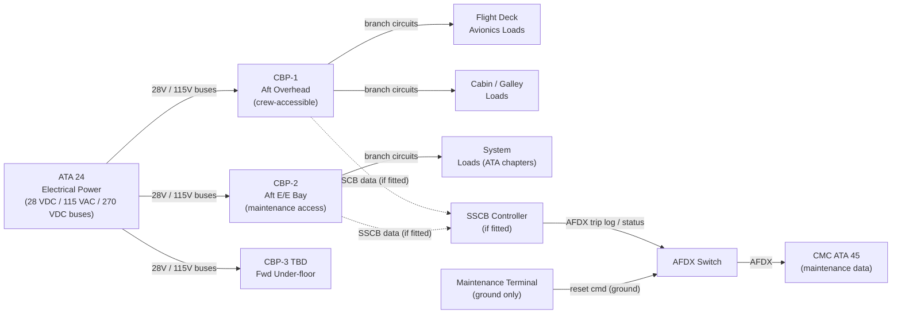
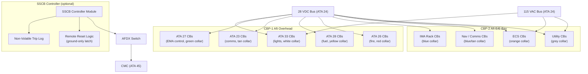
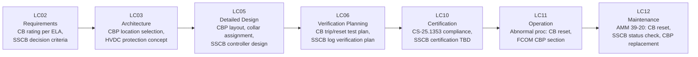

# 039-020 — Circuit Breaker and Protection Panels
### [PROGRAMME-AIRCRAFT] [PROGRAMME-VARIANT] · ATA 39 · Q+ATLANTIDE ATLAS Scaffold

**Status:**   
**Revision:** 0.1.0 — 2026-05-10  
**Classification:** Q-AIR Primary | Q-MECHANICS / Q-DATAGOV / Q-HPC / Q-GROUND / Q-INDUSTRY Support

---

## §0 Hyperlink Policy

All cross-references within this document use relative Markdown links. External regulatory references (CS-25, DO-160G) are cited by identifier only. Internal DMC cross-references follow `DMC-<PROGRAMME>-<VARIANT>-039-20-YYYY-A`. Badge  marks unresolved parameters;  and  indicate work-in-progress and planned content.

---

## §1 Purpose

This document defines the agnostic ATLAS standard-level architecture context for `039-020 — Circuit Breaker and Protection Panels`.

It describes the controlled scope, functions, interfaces, safety considerations, lifecycle traceability, and S1000D/CSDB mapping logic that programme implementations shall instantiate when this node is applicable.

This document is not a programme design baseline. Programme-specific capacities, locations, part numbers, effectivity, operating limits, maintenance references, and data module codes shall be defined only inside the applicable programme implementation branch.
## §2 Applicability

| Applicability Level | Rule |
|---|---|
| Standard taxonomy | Applies to the ATLAS node `<NODE>` |
| Programme implementation | Conditional; determined by programme architecture, trade studies, certification basis, and applicability model |
| Product configuration | Defined in the programme-specific configuration baseline |
| Effectivity | Defined in the programme CSDB / applicability layer |
| Non-applicability | Must be explicitly stated in the programme impact-study branch when excluded |
## §3 System/Function Overview

### 3.1 CBP Architecture

The [PROGRAMME-VARIANT] carries three circuit breaker panel locations:

| CBP | Location | Access | Voltage Levels Served | CB Count |
|---|---|---|---|---|
| CBP-1 | Aft overhead cockpit | Crew-accessible in flight | 28 VDC, 115 VAC |  |
| CBP-2 | Aft E/E bay (ground access only) | Ground / maintenance | 28 VDC, 115 VAC |  |
| CBP-3 | Forward under-floor (TBD) | Ground / maintenance | 28 VDC TBD |  |

### 3.2 CB Technology Options

Two circuit breaker technologies are under evaluation (OI-039-001):

**Option A — Thermal-Magnetic Circuit Breakers (TM-CB):**
- Mature technology; industry-standard for commercial aviation.
- Bi-metal thermal element (overload) + magnetic element (short-circuit trip).
- Trip time–current curve (TCC) per RTCA DO-160 application.
- Collar colour identifies ATA system grouping (industry convention).
- Manual reset: crew or maintenance technician pushes button to reset.
- No remote monitoring capability (no digital trip log).
- No remote reset (crew/maintenance must physically reset).

**Option B — Solid-State Circuit Breakers (SSCBs):**
- Electronic trip circuit (FET or GTO); configurable trip threshold.
- Digital trip log: records trip time-stamp, pre-trip current, junction temperature.
- Remote status monitoring via AFDX to CMC (ATA 45).
- Remote reset via maintenance terminal — ground-only (per certification; crew cannot remotely reset in flight).
- Faster trip time than thermal-magnetic.
- Weight reduction potential:  (supplier data pending).
- Certification maturity: TBD — OI-039-001.

### 3.3 Trip-Free Design

All circuit breakers — thermal-magnetic or SSCB — must be **trip-free**: once the protection mechanism has detected a fault and initiated a trip, the device cannot be held in the closed position by external force. This is a mandatory safety requirement per CS-25.1353 and ATA engineering standard. Pull-to-reset CBs (push-in to reset, stays out on trip) meet this requirement.

### 3.4 Colour-Coded Collar Convention

All CBP circuit breakers are identified by a colour-coded collar on the CB button per the ATA / AECMA convention grouping CBs by ATA system chapter:

| Collar Colour | System (ATA Chapter) | Example |
|---|---|---|
| White | Lights / Cabin (ATA 33) | Cabin lighting circuits |
| Green | Flight controls (ATA 27 / 29) | EMA control circuits ([PROGRAMME-VARIANT]) |
| Blue | Avionics / Instruments (ATA 31/34/42) | IMA module power |
| Red | Fire protection (ATA 26) | Fire detection loop power |
| Yellow | Fuel (ATA 28) | Fuel pump power |
| Orange | ECS / Pneumatic (ATA 21) | ECS compressor control power |
| Grey | Miscellaneous / Utility | Galley utility outlets TBD |
| Tan/Brown | Communication (ATA 23) | VHF transceiver power |

Note: Final colour assignments TBD pending complete system electrical load analysis (ELA). 

---

## §4 Scope

### 4.1 In-Scope

- CBP-1 panel structure and all CB assemblies (crew overhead)
- CBP-2 panel structure and all CB assemblies (E/E bay)
- CBP-3 panel structure (TBD, pending OI-039-007)
- SSCB modules (if selected — OI-039-001)
- CB collar colour identification
- CBP panel identification labels and circuit labels
- SSCB AFDX interface module (if fitted)
- HVDC branch protection concept (contactor/fuse TBD — OI-039-005)

### 4.2 Out-of-Scope

- Main bus contactors and BTCs (→ 039-030)
- PDUs and SSPCs (→ 039-030)
- Panel wiring harnesses to CB studs (→ 039-070)

---

## §5 Architecture Description

### 5.1 CBP-1 (Aft Overhead, Crew-Accessible)

CBP-1 is mounted in the aft section of the overhead panel (P6), accessible to both crew members in flight. It carries circuit breakers for:
- Flight deck avionics power feeds (28 VDC)
- Cabin and galley circuit branches (28 VDC and 115 VAC)
- Critical systems accessible to crew per abnormal/emergency procedures

CBP-1 layout is organised by ATA chapter column groupings with clear labelling. CB count:  (target < 200 CBs pending electrical load analysis).

### 5.2 CBP-2 (Aft E/E Bay, Maintenance Access)

CBP-2 is located in the aft E/E bay, accessible on the ground with E/E bay doors open. It carries:
- IMA rack power feeds
- Navigation and communications equipment branches
- System-level 28 VDC / 115 VAC branches for ATA chapters without CBP-1 representation

CB count: .

### 5.3 SSCB Architecture (if selected)

If SSCB technology is selected (OI-039-001), the SSCB modules would be integrated in a dedicated controller rack within the CBP assembly:
- SSCB controller module communicates with CMC via AFDX.
- Trip log stored in non-volatile memory within SSCB controller.
- Remote reset: ground maintenance terminal command → AFDX → SSCB controller → SSCB close.
- In-flight remote reset: **prohibited** — safety latch logic prevents remote reset in flight (weight-on-wheels or flight logic inhibit).

---

## §6 Functional Breakdown

| ID | Function | Components | Interface | Status |
|---|---|---|---|---|
| 039-020-F01 | Overcurrent protection (28 VDC) | TM-CB or SSCB on CBP-1/2/3 | Hardwired series protection |  |
| 039-020-F02 | Overcurrent protection (115 VAC) | TM-CB or SSCB on CBP-1/2 | Hardwired series protection |  |
| 039-020-F03 | SSCB digital trip log | SSCB controller | AFDX → CMC |  |
| 039-020-F04 | SSCB remote status monitoring | SSCB controller | AFDX → CMC |  |
| 039-020-F05 | SSCB remote reset (ground only) | SSCB controller | Maintenance terminal → AFDX |  |
| 039-020-F06 | CB identification (colour collar) | Collar on CB button | Visual |  |
| 039-020-F07 | HVDC branch protection (TBD) | HVDC fuse / contactor | ATA 24 interface |  |

---

## §7 System Context Diagram

---

## §8 Internal Functional Architecture

---

## §9 Lifecycle Traceability

---

## §10 Interfaces

| Interface | Direction | Counterpart | Signal Type | Notes |
|---|---|---|---|---|
| 28 VDC main bus | In | ATA 24 PDU / bus | Electrical (28 VDC) | Bus feed to CBP stud bars |
| 115 VAC main bus | In | ATA 24 AC bus | Electrical (115 VAC) | AC bus feed to CBP |
| 270 VDC HVDC | In | ATA 24 HVDC bus | Electrical (270 VDC) | HVDC protection TBD — OI-039-005 |
| Branch circuit outputs | Out | Various loads (ATA 21–45) | Electrical (28V/115V) | Protected branch circuits |
| SSCB status AFDX | Out | CMC (ATA 45) | AFDX | Trip log, state, temperature |
| Remote reset command | In | Maintenance terminal | AFDX (ground-only inhibit) | SSCB remote reset |
| Physical trip indicator | Visual | Crew / Maintenance | Mechanical (button out) | TM-CB trip visible on panel |

---

## §11 Operating Modes

| Mode | CB State | SSCB Monitoring | Remote Reset |
|---|---|---|---|
| Normal Flight | All CBs IN; automatic trip on fault | AFDX status transmitted | Inhibited in flight |
| Abnormal — CB Trip | Tripped CB button out (or SSCB open) | SSCB trip log written to CMC | Manual reset by crew (TM-CB); ground-only for SSCB |
| Ground — Maintenance | CBs available for test | Full log access via CMC terminal | SSCB remote reset available |
| Ground — GPU Power | CBs IN; aircraft systems powered by GPU | SSCB monitoring active | SSCB remote reset available |
| Unpowered (cold) | CB mechanical state preserved | No monitoring | No remote capability |

---

## §12 Monitoring and Diagnostics

| Parameter | Sensor / Source | CMC Signal | Alert |
|---|---|---|---|
| CB trip state (TM-CB) | Visual / mechanical (button out) | None (no automatic signal) | Crew visual check |
| CB trip state (SSCB) | SSCB controller digital state | AFDX → CMC | "CBP FAULT" advisory per SSCB trip |
| SSCB pre-trip current | SSCB current sensor | AFDX log entry | Stored in CMC log; no real-time alert |
| SSCB junction temperature | SSCB internal temperature sensor | AFDX log | Overtemperature advisory TBD |
| SSCB trip count | SSCB non-volatile log | CMC query | Prognostic indicator TBD |
| CBP panel supply voltage | Bus voltage monitor (in PDU, ATA 24) | AFDX | Bus undervoltage / overvoltage alert |

---

## §13 Maintenance Concept

### 13.1 On-Wing Maintenance

| Task | Interval | Access | Skill Level |
|---|---|---|---|
| Visual CBP scan for tripped CBs | Per crew procedure (post-flight or on call) | CBP-1 overhead; CBP-2 E/E bay | Line maintenance |
| TM-CB reset (manual push-in) | On condition after fault clearance | Direct panel access | Line maintenance |
| SSCB remote reset (ground) | On condition via CMC terminal | CMC terminal | Line maintenance |
| SSCB trip log download | Each visit or on condition | CMC terminal | Line maintenance |
| CB collar check and identification | A-check TBD | CBP-1 / CBP-2 visual | Line maintenance |
| CBP panel label/placard inspection | A-check TBD | CBP visual | Line maintenance |
| TM-CB replacement (tripped or failed) | On condition | Unplug and replace (direct panel) | Line maintenance |
| SSCB module replacement | On condition | Module extraction from controller rack | Line maintenance (trained) |
| HVDC protection device inspection | C-check TBD | E/E bay access | Base maintenance |

### 13.2 Off-Wing

- TM-CB: no off-wing maintenance — replace on condition.
- SSCB controller module: depot BITE test, non-volatile log clear, calibration per CMM TBD.

---

## §14 S1000D/CSDB Mapping

| Document | DMC Pattern | Info Code | Status |
|---|---|---|---|
| CBP description | DMC-<PROGRAMME>-<VARIANT>-039-20-00A-040A-A | 040 |  |
| CB reset procedure | DMC-<PROGRAMME>-<VARIANT>-039-20-00A-300A-A | 300 |  |
| CB (TM-CB) replacement | DMC-<PROGRAMME>-<VARIANT>-039-20-00A-520A-A | 520 |  |
| SSCB module replacement | DMC-<PROGRAMME>-<VARIANT>-039-20-01A-520A-A | 520 |  |
| SSCB log download | DMC-<PROGRAMME>-<VARIANT>-039-20-00A-920A-A | 920 |  |
| Fault isolation — CBP | DMC-<PROGRAMME>-<VARIANT>-039-20-00A-400A-A | 400 |  |

Full DMRL in [039-090](./039-090-S1000D-CSDB-Mapping-and-Traceability.md).

---

## §15 Footprints

| Parameter | Value |
|---|---|
| CBP-1 CB count |  |
| CBP-2 CB count |  |
| CBP-3 CB count |  (if fitted) |
| Total CB count (all panels) |  |
| CB trip current range |  (1 A to TBD A) |
| CB voltage rating | 28 VDC / 115 VAC (LV); 270 VDC (HVDC TBD) |
| SSCB controller mass (if fitted) |  |
| CBP-1 panel mass |  |
| CBP-2 panel mass |  |
| HVDC protection device type |  (fuse or contactor; OI-039-005) |

---

## §16 Safety and Certification

| Requirement | Standard | Application |
|---|---|---|
| Electrical equipment and installations | CS-25.1353 | CBP trip-free design; wiring protection; HVDC protection |
| System safety — failure effects | CS-25.1309 | CB failure modes: fail-trip (safe) vs. fail-hold-closed (hazardous — prevented by trip-free design) |
| Environmental qualification | DO-160G | All CB assemblies: temperature, vibration, humidity, altitude |
| Trip-free design | CS-25.1353(a) | Cannot hold CB closed during a fault trip — mandatory |
| SSCB certification maturity |  | OI-039-001 — SSCB may require novel means of compliance |
| CB identification | ATA / AECMA convention | Colour collar + placard label per ATA system chapter |
| HVDC protection | CS-25.1353 + emerging standards TBD | 270 VDC protection devices under evaluation |
| In-flight remote reset prohibition | CS-25 / operational requirement | SSCB remote reset inhibited in flight (WOW or flight logic) |

---

## §17 Verification and Validation

| Test | Method | Acceptance Criterion | Status |
|---|---|---|---|
| CB trip test | Apply overcurrent at rated trip level; time to trip | Trips within TCC curve tolerance |  |
| CB reset test | Manual reset after trip | CB resets and holds; no retrial-trip on good circuit |  |
| Trip-free test | Attempt to hold CB closed during fault | Cannot be held in — trips regardless of applied force |  |
| SSCB digital log verification | Trip event; read log via CMC terminal | Log entry with time-stamp, current, temperature within 1 s of trip |  |
| SSCB remote reset (ground) | Command reset via maintenance terminal | CB closes; confirmed in AFDX state message |  |
| SSCB in-flight remote reset inhibit | Simulate flight condition; attempt remote reset | Reset command rejected (inhibited) |  |
| CB collar identification | Visual check all CBs | Each CB has correct collar colour per ATA chapter assignment |  |
| DO-160G environmental (CBP) | Per DO-160G categories applicable | All categories pass per qualification test plan |  |
| Panel bonding resistance | Milliohm meter | ≤ 2.5 mΩ panel-to-structure |  |
| Panel wiring insulation test | Megger 500 VDC | ≥ TBD MΩ per circuit |  |
| LED backlight brightness (SSCB panel) | Luminance meter | Within TBD cd/m² range |  |

---

## §18 Glossary

| Term | Definition |
|---|---|
| CBP | Circuit Breaker Panel — panel assembly carrying circuit breakers protecting individual electrical circuits |
| TM-CB | Thermal-Magnetic Circuit Breaker — conventional CB using bi-metal thermal element (overload) and magnetic element (short circuit trip) |
| SSCB | Solid-State Circuit Breaker — electronic CB with digital trip logging, remote monitoring, and configurable trip threshold |
| Trip-free | CB design property: device cannot be held closed during a fault trip by external force on the actuator |
| Collar | Colour-coded ring on CB button identifying ATA system group for maintenance and operations identification |
| ELA | Electrical Load Analysis — systematic accounting of all aircraft electrical loads used to size buses, CBs, and wiring |
| TCC | Time-Current Curve — curve defining CB trip time as a function of fault current level |
| HVDC | High Voltage DC — the [PROGRAMME-VARIANT] 270 VDC bus architecture (vs. conventional 28 VDC and 115 VAC) |
| Remote reset | Ability to close a tripped SSCB via a data bus command rather than physical manual reset; permitted on ground only |
| WOW | Weight on Wheels — landing gear compressed sensor signal indicating aircraft is on ground |
| Non-volatile memory | Electronic memory retaining data when power is removed — used in SSCB controller for trip log storage |
| PDU | Power Distribution Unit — upstream device distributing bus power to CBP stud bars |
| AFDX | Avionics Full-Duplex Switched Ethernet — aircraft data bus (ARINC 664 Part 7) used for SSCB status reporting |
| CMC | Central Maintenance Computer (ATA 45) — receives SSCB logs and circuit health data |
| BITE | Built-In Test Equipment — embedded self-test in SSCB controller for fault detection |

---

## §19 Citations

1. EASA CS-25.1353 — Electrical equipment and installations.
2. EASA CS-25.1309 — Equipment, systems, and installations — system safety.
3. RTCA/EUROCAE DO-160G — Environmental Conditions and Test Procedures.
4. MIL-PRF-5764 (or equivalent TBD) — Circuit breaker military performance specification reference.
5. Q+ATLANTIDE ATLAS [039-000 General](./039-000-Electrical-Electronic-Panels-and-Multipurpose-Components-General.md).
6. Q+ATLANTIDE ATLAS [039-030 Relay, Contactor, and Power Distribution Panels](./039-030-Relay-Contactor-and-Power-Distribution-Panels.md).
7. Q+ATLANTIDE ATLAS [039-090 S1000D/CSDB Mapping](./039-090-S1000D-CSDB-Mapping-and-Traceability.md).

---

## §20 References

| Ref | Document | Notes |
|---|---|---|
| [R1] | CS-25.1353 | Electrical installations — CBP trip-free, HVDC protection |
| [R2] | CS-25.1309 | System safety — CB failure mode analysis |
| [R3] | DO-160G | Environmental qualification for CB panels |
| [R4] | MIL-PRF-5764 TBD | CB performance spec reference (or equivalent) |
| [R5] | ATA 24 — Electrical Power ATLAS | Bus power feed to CBPs |
| [R6] | ATA 45 — CMC ATLAS | SSCB log reception and fault reporting |
| [R7] | 039-030 | PDU and SSPC — upstream power distribution |
| [R8] | 039-080 | Panel monitoring and BITE — SSCB health monitoring |

---

## §21 Open Issues

| ID | Description | Owner | Status |
|---|---|---|---|
| OI-039-001 | SSCB vs. TM-CB decision: weight, cost, certification maturity for 270 VDC circuits | Q-AIR / Q-MECHANICS |  |
| OI-039-005 | 270 VDC vs. 115 VAC primary distribution — HVDC CBP protection scheme TBD | Q-AIR / Q-MECHANICS |  |
| OI-039-007 | Forward E/E bay (CBP-3) inclusion decision | Q-AIR / Q-MECHANICS |  |
| OI-039-012 | ELA (Electrical Load Analysis) completion — required to determine CB ratings and counts | Q-AIR |  |
| OI-039-013 | SSCB certification means of compliance (novel item per CS-25 / EASA SC TBD) | Q-AIR / ORB-LEG |  |

---

## §22 Change Log

| Revision | Date | Author | Description |
|---|---|---|---|
| 0.1.0 | 2026-05-10 | Q+ATLANTIDE ATLAS Working Group | Initial full-template draft; all 23 sections populated; [PROGRAMME-VARIANT] CBP context incorporated |
| 0.0.0 | 2026-05-10 | Q+ATLANTIDE ATLAS Working Group | Scaffold stub created |
