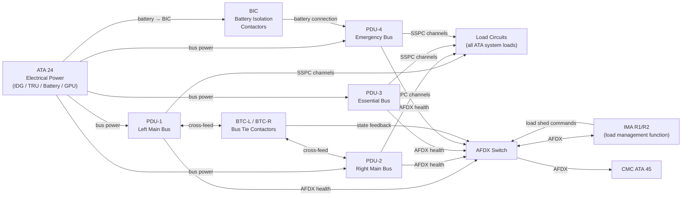
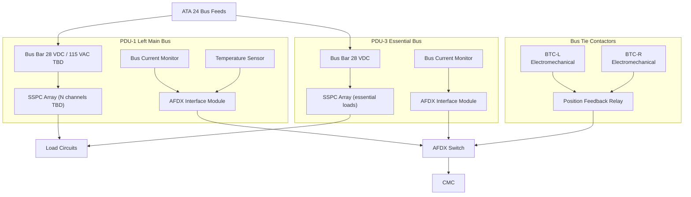
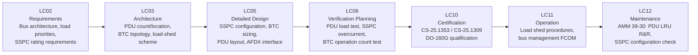

# 039-030 — Relay, Contactor, and Power Distribution Panels
### AMPEL360e eWTW · ATA 39 · Q+ATLANTIDE ATLAS Scaffold

**Status:**   
**Revision:** 0.1.0 — 2026-05-10  
**Classification:** Q-AIR Primary | Q-MECHANICS / Q-DATAGOV / Q-HPC / Q-GROUND / Q-INDUSTRY Support

---

## §0 Hyperlink Policy

All cross-references use relative Markdown links. Regulatory references are cited by identifier. DMC cross-references follow `DMC-AMPEL360E-EWTW-039-30-YYYY-A`. Badge  marks unresolved parameters. Badges  and  indicate work-in-progress and planned content.

---

## §1 Purpose

This document describes **Relay, Contactor, and Power Distribution Panels** (subsubject 039-030) of the AMPEL360e eWTW. It covers:

1. Power Distribution Units (PDUs): PDU-1 (left main), PDU-2 (right main), PDU-3 (essential), PDU-4 (emergency) — converting and distributing bus power to load groups.
2. Solid-State Power Controllers (SSPCs): electronic load management controllers within each PDU providing programmable overcurrent, current sensing, and AFDX health reporting.
3. Bus Tie Contactors (BTCs): BTC-L and BTC-R enabling cross-feed between main buses.
4. High-voltage relay contactors: battery isolation and HVDC bus switching (ATA 24 interface).
5. DC motor contactors for ECS electric compressor and galley/ECS high-power loads.
6. Load-shed logic: SSPC programmable trip thresholds supporting degraded power state load management.
7. Relay reliability and AFDX interface for PDU health data to CMC.

---

## §2 Applicability

| Item | Value |
|---|---|
| Aircraft Programme | AMPEL360e eWTW |
| Variant | All variants |
| ATA Chapter / Subsubject | 39 — 039-030 Relay, Contactor, and Power Distribution Panels |
| Document Tier | Level 3 — Component/Assembly Description |
| Effectivity | MSN 0001 onwards  |

Includes all PDU assemblies, SSPC modules, BTCs, battery isolation contactors, and motor contactors. Excludes:
- Electrical power generation and main bus architecture: → ATA 24
- Circuit breaker panels (upstream protection): → 039-020

---

## §3 System/Function Overview

### 3.1 Power Distribution Architecture

The eWTW power distribution architecture comprises four bus tiers:

| Bus | PDU | Voltage | Priority | Powered By |
|---|---|---|---|---|
| Left Main Bus | PDU-1 | 28 VDC (or 115 VAC TBD) | Normal ops | Left IDG / TRU / Battery |
| Right Main Bus | PDU-2 | 28 VDC (or 115 VAC TBD) | Normal ops | Right IDG / TRU |
| Essential Bus | PDU-3 | 28 VDC | Degraded ops | Battery + essential TRU |
| Emergency Bus | PDU-4 | 28 VDC | Emergency | Battery direct |

Cross-feed between Left and Right Main Buses is achieved via Bus Tie Contactors (BTC-L / BTC-R).

### 3.2 SSPC Architecture

Each PDU contains an array of Solid-State Power Controllers (SSPCs). Each SSPC is a channel protecting and controlling one or more load circuits:

| SSPC Feature | Description |
|---|---|
| Electronic trip | FET-based; current sensed in real-time |
| Programmable trip threshold | Set per load via ground maintenance terminal or factory configuration |
| Current sensing | Used for health monitoring and diagnostic logging |
| Load shedding | Programmable priority: essential loads remain powered; non-essential loads shed in degraded power state |
| AFDX reporting | SSPC state (open/closed), current, temperature reported via AFDX to CMC |
| Manual override (ground) | Via maintenance terminal — force open or close for test TBD |

### 3.3 Bus Tie Contactors

BTC-L and BTC-R are electromechanical contactors enabling cross-feed between left and right main buses:
- Open (normal): each bus powered independently from its own generation source.
- Closed (cross-feed): one generation source feeds both buses during single generator failure.
- BTC logic: driven by electrical power management function hosted in IMA (ATA 24 / ATA 42).
- Contact state reported via position feedback relay to CMC via AFDX.
- Rated for ≥ 50,000 operations  (supplier confirmation pending).

### 3.4 Battery Isolation and HVDC Contactors

- Battery isolation contactors (BICs): normally open in flight; close to connect battery to emergency bus on loss of all generation. Controlled by ATA 24 battery management function.
- HVDC contactors: for 270 VDC bus connection / isolation (OI-039-005 — pending bus voltage decision).

---

## §4 Scope

### 4.1 In-Scope

- PDU-1, PDU-2, PDU-3, PDU-4 assemblies and SSPC modules
- BTC-L, BTC-R electromechanical contactors
- Battery isolation contactors (BICs)
- HVDC bus contactors TBD
- DC motor contactors for ECS electric compressor and large loads
- Load-shed logic configuration (SSPC priority settings)
- AFDX interface modules in PDUs
- PDU panel structures and mounting in E/E bay

### 4.2 Out-of-Scope

- Electrical power generation (IDGs, TRUs): → ATA 24
- Circuit breaker protection (CBPs): → 039-020
- Battery hardware: → ATA 24
- IMA hosted power management software: → ATA 42

---

## §5 Architecture Description

### 5.1 PDU Internal Architecture

Each PDU contains:
- **Bus bars**: copper or aluminium; rated for full bus current TBD.
- **SSPC array**: N channels per PDU (N TBD per ELA TBD).
- **AFDX interface module**: PDU health and SSPC state reporting to CMC.
- **Current monitoring**: per-SSPC and per-bus total current sensor.
- **Temperature monitoring**: PDU internal temperature sensor.
- **Manual test interface**: maintenance connector on PDU front panel (ground service only).

### 5.2 Load-Shed Priority Scheme

In degraded power state (single generator, essential bus only), the SSPC load-shed logic disconnects non-essential loads in priority order:

| Priority | Load Category | SSPC Action |
|---|---|---|
| 1 — Essential | Flight instruments, autopilot, communication | Always powered |
| 2 — Required | ECS minimum, fuel management, navigation | Maintained if power available |
| 3 — Comfort | Galley outlets, IFE, reading lights | Shed first on degraded power |
| 4 — Non-essential | Utility outlets, supplementary cabin | Shed with load reduction |

Load-shed thresholds are configured at factory and verified per maintenance schedule. Priority table:  (pending ELA).

---

## §6 Functional Breakdown

| ID | Function | Components | Interface | Status |
|---|---|---|---|---|
| 039-030-F01 | Bus power distribution (Left Main) | PDU-1 SSPC array | ATA 24 bus → load circuits |  |
| 039-030-F02 | Bus power distribution (Right Main) | PDU-2 SSPC array | ATA 24 bus → load circuits |  |
| 039-030-F03 | Essential bus power distribution | PDU-3 SSPC array | Battery / TRU → essential loads |  |
| 039-030-F04 | Emergency bus power distribution | PDU-4 contactors / SSPC | Battery direct → emergency loads |  |
| 039-030-F05 | Bus cross-feed | BTC-L / BTC-R | Left ↔ Right main bus |  |
| 039-030-F06 | Battery isolation | BIC | Battery ↔ Emergency bus |  |
| 039-030-F07 | Load shedding | SSPC priority logic | IMA load management function |  |
| 039-030-F08 | PDU health reporting | AFDX module in PDU | AFDX → CMC |  |
| 039-030-F09 | HVDC contactor switching | HVDC contactor TBD | ATA 24 HVDC bus |  |

---

## §7 System Context Diagram

---

## §8 Internal Functional Architecture

---

## §9 Lifecycle Traceability

---

## §10 Interfaces

| Interface | Direction | Counterpart | Signal Type | Notes |
|---|---|---|---|---|
| Main bus power (Left) | In | ATA 24 Left IDG/TRU | Electrical (28 VDC or 115 VAC TBD) | PDU-1 bus feed |
| Main bus power (Right) | In | ATA 24 Right IDG/TRU | Electrical (28 VDC or 115 VAC TBD) | PDU-2 bus feed |
| Essential bus power | In | ATA 24 Battery / TRU | Electrical (28 VDC) | PDU-3 bus feed |
| Emergency bus power | In | ATA 24 Battery | Electrical (28 VDC) | PDU-4 direct battery |
| SSPC load outputs | Out | All ATA system loads | Electrical (branch circuits) | Per ELA TBD |
| PDU health — AFDX | Out | CMC (ATA 45) / IMA (ATA 42) | AFDX | SSPC states, current, temperature |
| Load shed commands | In | IMA load management (ATA 42) | AFDX | SSPC open/close commands for shedding |
| BTC state feedback | Out | CMC / IMA | AFDX discrete | BTC open / closed position |
| BTC control | In | IMA electrical power management | AFDX discrete | BTC open / close command |
| Battery isolation contactor control | In | ATA 24 battery management | Hardwired + AFDX | BIC open / close |
| HVDC contactor control | In | ATA 24 HVDC management TBD | TBD | OI-039-005 |

---

## §11 Operating Modes

| Mode | PDU State | SSPC State | BTC State | Load Shedding |
|---|---|---|---|---|
| Normal Dual Generator | PDU-1/2 powered independently | All SSPCs closed, loads powered | BTC open (normal) | None |
| Single Generator (left) | PDU-1 powered; PDU-2 from BTC | BTC-L closed; PDU-2 from left bus | BTC-L closed | Level 1: comfort loads shed |
| Essential Bus Only | PDU-3 powered | Essential SSPCs only | All BTCs open | Level 2: comfort + required shed |
| Emergency | PDU-4 battery direct | Minimum emergency SSPCs | All contactors open | Level 3: only essential emergency |
| Ground GPU | All PDUs powered by GPU | All SSPCs per pre-flight config | Per maintenance config | None (GPU power available) |
| Maintenance Test | Selected PDU/SSPC test | Individual SSPC test | Individual BTC test | Manual configuration |

---

## §12 Monitoring and Diagnostics

| Parameter | Sensor / Source | CMC Signal | Alert |
|---|---|---|---|
| SSPC state (per channel) | SSPC controller | AFDX | Per-channel state in CMC log |
| SSPC current (per channel) | SSPC current sensor | AFDX | Overcurrent trend advisory TBD |
| PDU bus voltage | Bus voltage monitor in PDU | AFDX | "PDU UNDERVOLT" (caution) |
| PDU internal temperature | PDU temperature sensor | AFDX | "PDU TEMP HI" (advisory/caution) |
| BTC contact state | Position feedback relay | AFDX | "BUS TIE FAULT" (caution) if command/state mismatch |
| BIC state | Position feedback | AFDX | "BATT ISOL FAULT" (caution) |
| SSPC operation count | SSPC non-volatile log | CMC query | Prognostic advisory TBD |

---

## §13 Maintenance Concept

### 13.1 On-Wing Maintenance

| Task | Interval | Access | Skill Level |
|---|---|---|---|
| PDU visual inspection | A-check  | E/E bay access | Line maintenance |
| SSPC configuration check | C-check TBD | CMC terminal | Line maintenance |
| SSPC status log download | Each visit (CMC) | CMC terminal | Line maintenance |
| BTC operation count check | C-check TBD | CMC query | Line maintenance |
| BTC functional test | C-check TBD | Maintenance mode via CMC | Line/base |
| PDU connector and bonding inspection | C-check TBD | E/E bay access | Base maintenance |
| PDU (LRU) replacement | On condition | E/E bay; rack slides | Line maintenance (trained) |
| SSPC module replacement (if modular) | On condition | PDU access panel | Line maintenance (trained) |
| BTC contactor replacement | On condition | E/E bay | Base maintenance |

### 13.2 Off-Wing

- PDU: shop test per CMM; SSPC calibration; bus bar inspection.
- BTC: contact resistance measurement, overhaul at operation limit TBD.

---

## §14 S1000D/CSDB Mapping

| Document | DMC Pattern | Info Code | Status |
|---|---|---|---|
| PDU system description | DMC-AMPEL360E-EWTW-039-30-00A-040A-A | 040 |  |
| PDU replacement | DMC-AMPEL360E-EWTW-039-30-00A-520A-A | 520 |  |
| BTC functional test | DMC-AMPEL360E-EWTW-039-30-01A-300A-A | 300 |  |
| SSPC configuration procedure | DMC-AMPEL360E-EWTW-039-30-00A-920A-A | 920 |  |
| Fault isolation — PDU | DMC-AMPEL360E-EWTW-039-30-00A-400A-A | 400 |  |

Full DMRL in [039-090](./039-090-S1000D-CSDB-Mapping-and-Traceability.md).

---

## §15 Footprints

| Parameter | Value |
|---|---|
| PDU count | 4 (PDU-1 through PDU-4) |
| SSPC count per PDU |  (pending ELA) |
| Total SSPC count |  |
| BTC count | 2 (BTC-L, BTC-R) |
| BIC count |  |
| BTC rated current |  A |
| BTC operation life | ≥ 50,000 operations  |
| PDU-1/2 mass (each) |  |
| PDU-3 mass |  |
| PDU-4 mass |  |
| PDU location | Aft E/E bay  |

---

## §16 Safety and Certification

| Requirement | Standard | Application |
|---|---|---|
| Electrical equipment and installations | CS-25.1353 | PDUs, BTCs, BICs, HVDC contactors |
| System safety — failure effects | CS-25.1309 | SSPC fail-open (safe) vs. fail-closed (hazardous for short circuit); BTC spurious close analysis |
| Environmental qualification | DO-160G | PDU, BTC, SSPC: vibration, temperature, humidity |
| Load-shed logic | CS-25.1309 | Degraded power state load management; essential loads always maintained |
| Contactor arc suppression | ARC suppression standard TBD | 270 VDC contactors require arc suppression per HVDC standards |
| Relay contact life | Supplier qualification | ≥ 50,000 operations for BTCs TBD |
| AFDX health reporting | ARINC 664 Pt 7 | PDU status on AFDX dual-star network |

---

## §17 Verification and Validation

| Test | Method | Acceptance Criterion | Status |
|---|---|---|---|
| PDU load test | Apply rated load per bus; measure SSPC and bus performance | All SSPCs stable; no false trip at rated load |  |
| SSPC overcurrent test | Inject overcurrent at TBD × rated; measure trip time | Trip within SSPC spec ± TBD% |  |
| SSPC load-shed test | Simulate degraded power; verify load shed sequence | Non-essential SSPCs open per priority table |  |
| BTC functional test | Command open/close; verify contact state and feedback | State changes within TBD ms; feedback matches command |  |
| BTC cross-feed test | Open one IDG; verify BTC closes and loads transfer | Bus voltage maintained within TBD% on transfer |  |
| BTC operation life test | Endurance test ≥ 50,000 operations (type test) | Contact resistance within spec after full life |  |
| BIC function test | Simulate loss of all generation; verify BIC closes | Battery connects to emergency bus within TBD ms |  |
| AFDX PDU health reporting | Monitor AFDX; inject SSPC state change | State change reflected in AFDX frame within TBD ms |  |
| DO-160G environmental (PDU) | Per DO-160G categories | All categories pass per qualification test plan |  |
| Panel bonding resistance | Milliohm meter | ≤ 2.5 mΩ |  |
| SSPC digital log verification | Trip event; read log | Log entry correct |  |

---

## §18 Glossary

| Term | Definition |
|---|---|
| PDU | Power Distribution Unit — assembly distributing bus power to load circuits via SSPCs and contactors |
| SSPC | Solid-State Power Controller — electronic load controller providing overcurrent protection, current sensing, and AFDX health reporting |
| BTC | Bus Tie Contactor — electromechanical contactor enabling cross-feed between left and right main electrical buses |
| BIC | Battery Isolation Contactor — contactor connecting or isolating the battery from the bus |
| Bus bar | Conductor bar within PDU distributing bus power to multiple SSPC inputs |
| Load shedding | Controlled disconnection of non-essential loads to prevent overloading a degraded power source |
| SSPC priority | Assigned load priority used by load-shed logic to determine which loads to disconnect first |
| Cross-feed | Condition where one generator supplies both main buses via closed BTC |
| Arc suppression | Mechanism or device limiting electrical arc when DC contactor opens under load |
| ELA | Electrical Load Analysis — document listing all aircraft loads, bus assignments, and load demands |
| HVDC | High Voltage DC — 270 VDC bus used in eWTW all-electric architecture |
| IFE | In-Flight Entertainment — passenger entertainment system (non-essential load, shed first) |
| Position feedback relay | Small relay in BTC that monitors contact position and provides a discrete signal confirming open/closed state |
| AFDX | Avionics Full-Duplex Switched Ethernet (ARINC 664 Part 7) — data bus for PDU health reporting |
| CMC | Central Maintenance Computer (ATA 45) — receives PDU and SSPC health data |

---

## §19 Citations

1. EASA CS-25.1353 — Electrical equipment and installations.
2. EASA CS-25.1309 — Equipment, systems, and installations — system safety.
3. RTCA/EUROCAE DO-160G — Environmental Conditions and Test Procedures.
4. ARINC Report 664 Part 7 — AFDX data bus.
5. Q+ATLANTIDE ATLAS [039-000 General](./039-000-Electrical-Electronic-Panels-and-Multipurpose-Components-General.md).
6. Q+ATLANTIDE ATLAS [039-020 CBPs](./039-020-Circuit-Breaker-and-Protection-Panels.md).
7. Q+ATLANTIDE ATLAS [039-090 S1000D/CSDB Mapping](./039-090-S1000D-CSDB-Mapping-and-Traceability.md).

---

## §20 References

| Ref | Document | Notes |
|---|---|---|
| [R1] | CS-25.1353 | PDU, BTC, SSPC electrical installations |
| [R2] | CS-25.1309 | System safety — SSPC/BTC failure analysis |
| [R3] | DO-160G | Environmental qualification — PDU, BTC |
| [R4] | ARINC 664 Pt 7 | AFDX health reporting from PDUs |
| [R5] | ATA 24 — Electrical Power ATLAS | Bus architecture, IDG/TRU/battery feeds to PDUs |
| [R6] | ATA 42 — IMA ATLAS | Load management function hosting in IMA |
| [R7] | ATA 45 — CMC ATLAS | CMC receiving PDU health AFDX data |
| [R8] | 039-020 | CBPs — upstream protection |
| [R9] | 039-080 | Panel monitoring — SSPC and PDU BITE |

---

## §21 Open Issues

| ID | Description | Owner | Status |
|---|---|---|---|
| OI-039-001 | SSCB vs. TM-CB decision (affects SSPC integration with CBP) | Q-AIR / Q-MECHANICS |  |
| OI-039-005 | 270 VDC vs. 115 VAC primary distribution — PDU bus voltage TBD | Q-AIR / Q-MECHANICS |  |
| OI-039-014 | ELA completion — SSPC count and rating per PDU | Q-AIR |  |
| OI-039-015 | BTC operation life target confirmation from supplier | Q-AIR / Q-MECHANICS |  |
| OI-039-016 | HVDC contactor arc suppression standard selection | Q-AIR / ORB-LEG |  |

---

## §22 Change Log

| Revision | Date | Author | Description |
|---|---|---|---|
| 0.1.0 | 2026-05-10 | Q+ATLANTIDE ATLAS Working Group | Initial full-template draft; all 23 sections populated; eWTW PDU/SSPC/BTC context incorporated |
| 0.0.0 | 2026-05-10 | Q+ATLANTIDE ATLAS Working Group | Scaffold stub created |
