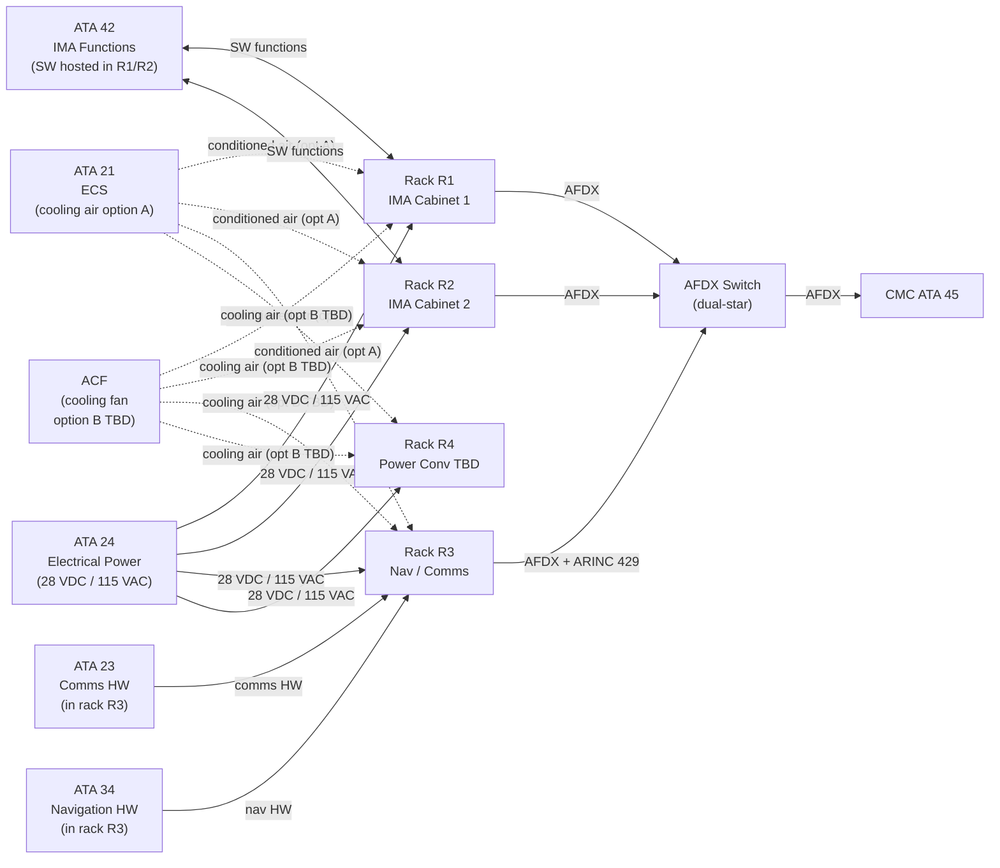
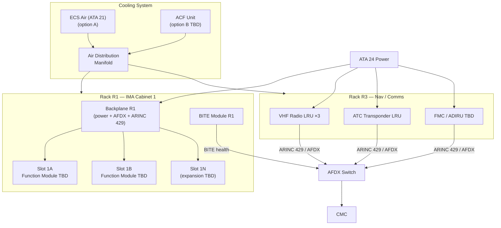
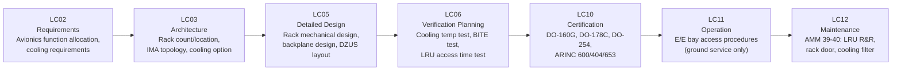

# 039-040 — Avionics and Electronic Equipment Racks
### [PROGRAMME-AIRCRAFT] [PROGRAMME-VARIANT] · ATA 39 · Q+ATLANTIDE ATLAS Scaffold

**Status:**   
**Revision:** 0.1.0 — 2026-05-10  
**Classification:** Q-AIR Primary | Q-MECHANICS / Q-DATAGOV / Q-HPC / Q-GROUND / Q-INDUSTRY Support

---

## §0 Hyperlink Policy

All cross-references use relative Markdown links. Regulatory and standards references cited by identifier only. DMC cross-references follow `DMC-<PROGRAMME>-<VARIANT>-039-40-YYYY-A`. Badge  marks unresolved parameters. Badges  and  indicate work-in-progress and planned content.

---

## §1 Purpose

This document defines the agnostic ATLAS standard-level architecture context for `039-040 — Avionics and Electronic Equipment Racks`.

It describes the controlled scope, functions, interfaces, safety considerations, lifecycle traceability, and S1000D/CSDB mapping logic that programme implementations shall instantiate when this node is applicable.

This document is not a programme design baseline. Programme-specific capacities, locations, part numbers, effectivity, operating limits, maintenance references, and data module codes shall be defined only inside the applicable programme implementation branch.
## §2 Applicability

| Applicability Level | Rule |
|---|---|
| Standard taxonomy | Applies to the ATLAS node `<NODE>` |
| Programme implementation | Conditional; determined by programme architecture, trade studies, certification basis, and applicability model |
| Product configuration | Defined in the programme-specific configuration baseline |
| Effectivity | Defined in the programme CSDB / applicability layer |
| Non-applicability | Must be explicitly stated in the programme impact-study branch when excluded |
## §3 System/Function Overview

### 3.1 Aft E/E Bay Rack Layout

The aft E/E bay is the primary avionics bay of the [PROGRAMME-VARIANT], located in the aft belly section below the cabin floor. It contains approximately 4 racks arranged in a serviceable configuration:

| Rack | Designation | Primary Content | Form Factor |
|---|---|---|---|
| R1 | IMA Cabinet 1 | ARINC 653 IMA — FCS, FMS, Navigation modules |  ARINC 600/404 |
| R2 | IMA Cabinet 2 | ARINC 653 IMA — ECS mgmt, electrical mgmt, fuel mgmt modules |  ARINC 600/404 |
| R3 | Nav / Comms Rack | VHF radios, ATC transponder, ADS-B, ACARS (ARINC 429 + AFDX) |  ARINC 404 |
| R4 | Power Conversion Rack | DC/DC converters, TRU modules TBD |  |

### 3.2 IMA Cabinet Architecture

IMA Cabinets R1 and R2 host ARINC 653-compliant modules in a partitioned backplane:
- **Backplane**: provides power, AFDX connectivity, and ARINC 429 legacy bus to each slot.
- **Module slots**: N slots per cabinet (TBD — OI-039-006).
- **ARINC 653 RTOS**: spatial and temporal partitioning ensures no function can interfere with another.
- **BITE**: IMA cabinet-level BITE monitors slot health, power integrity, backplane health.
- **Module types**: see 039-050 for SCM, PSM, RDCU details.

### 3.3 Rack Form Factor Decision

Two candidate form factors under evaluation (OI-039-006):

| Factor | ARINC 600 | ARINC 404 |
|---|---|---|
| Mechanical | Tray / box form factor | ATR unit form factor |
| Connector | ARINC 600 multi-pin connector | ARINC 404 rear connector |
| Module access | Rack front access | LRU front extractor |
| Industry usage | Widely used commercial aviation cabinets | Widely used LRU packaging |
| IMA compatibility | Yes (IMA cabinets often ARINC 600-based) | Yes (LRU-style IMA modules) |

---

## §4 Scope

### 4.1 In-Scope

- Aft E/E bay rack structures R1–R4
- Rack mounting to aircraft structure (shock mounts, DZUS fasteners)
- Rack access doors (hinged, positive latch)
- Rack cooling provisions: conditioned air ducts, ACF provisions (OI-039-002)
- IMA cabinet backplanes (R1, R2)
- Rack-to-aircraft AFDX and power cabling interfaces
- LRU extractor mechanisms (ARINC 404 extractors, handles)
- Forward E/E bay provision (TBD — OI-039-007)

### 4.2 Out-of-Scope

- IMA-hosted software functions: → ATA 42
- LRM / module electronic content: → 039-050
- E/E bay environmental conditioning source: → ATA 21
- Communication equipment inside rack R3: → ATA 23
- Power conversion equipment inside rack R4: → ATA 24

---

## §5 Architecture Description

### 5.1 Rack Mounting

Each rack is mounted to aircraft structure via shock-isolated mounts:
- **Shock isolation**: vibration isolators (elastomeric or wire-rope TBD) between rack base and aircraft structure rails.
- **DZUS fasteners**: quarter-turn quick-release fasteners on rack door panels for rapid LRU access.
- **Rack slides**: drawers (not full slide-out) — racks are fixed; only LRUs slide out via ARINC 404 extractors.
- **Positive latch**: rack door has a latching mechanism preventing inadvertent opening in flight.

### 5.2 Cooling Architecture

The E/E bay thermal management approach is under evaluation (OI-039-002):

| Option | Description | Pros | Cons |
|---|---|---|---|
| Option A — ECS Air Divert | Conditioned air from ATA 21 ECS routed to E/E bay | No additional equipment | ECS capacity impacted; single failure mode |
| Option B — Dedicated ACF | Dedicated Avionics Cooling Fan with separate heat exchanger | Independent from ECS | Additional weight and maintenance item |

Avionics operating temperature range (rack inlet): +10 °C to +35 °C TBD.
Heat dissipation (per rack):  W.

### 5.3 IMA Backplane

The IMA backplane (R1, R2) provides to each slot:
- Power rails: 28 VDC (primary) and 5 VDC / 3.3 VDC (secondary TBD).
- AFDX connection: dual AFDX end-system ports per slot.
- ARINC 429 legacy: RX/TX lines per slot (slot-dependent).
- Discrete I/O: high/low discrete signal lines TBD.
- Module identification: module type read via backplane ID pins.

---

## §6 Functional Breakdown

| ID | Function | Components | Interface | Status |
|---|---|---|---|---|
| 039-040-F01 | Host IMA partitioned functions (R1) | IMA Cabinet R1 | AFDX / ATA 42 |  |
| 039-040-F02 | Host IMA partitioned functions (R2) | IMA Cabinet R2 | AFDX / ATA 42 |  |
| 039-040-F03 | Host Nav/Comms LRUs (R3) | Nav/Comms Rack R3 | ARINC 429 / AFDX / ATA 23/34 |  |
| 039-040-F04 | Host power conversion (R4 TBD) | Power Conversion Rack R4 | ATA 24 TBD |  |
| 039-040-F05 | Avionics cooling — E/E bay | ACF or ECS air duct | ATA 21 interface |  |
| 039-040-F06 | Rack mechanical protection | Shock mounts, door latches | Structural / safety |  |
| 039-040-F07 | LRU access and replacement | DZUS, extractors, door | AMM line maintenance |  |
| 039-040-F08 | Rack BITE (IMA cabinet health) | IMA BITE module | AFDX → CMC |  |

---

## §7 System Context Diagram

---

## §8 Internal Functional Architecture

---

## §9 Lifecycle Traceability

---

## §10 Interfaces

| Interface | Direction | Counterpart | Signal Type | Notes |
|---|---|---|---|---|
| 28 VDC rack power | In | ATA 24 CBP-2 branch | Electrical (28 VDC) | IMA cabinet and LRU power |
| 115 VAC rack power | In | ATA 24 CBP-2 branch | Electrical (115 VAC TBD) | IMA primary power option TBD |
| AFDX dual links | Bi-directional | AFDX switch (dual-star) | AFDX ARINC 664 Pt 7 | Dual end-systems per rack |
| ARINC 429 (R3) | Bi-directional | Nav / comms LRUs | ARINC 429 | Legacy avionics bus |
| Cooling air supply | In | ATA 21 ECS or ACF | Fluid (conditioned air) | OI-039-002 — option TBD |
| BITE health to CMC | Out | CMC (ATA 45) | AFDX | IMA cabinet health, temperature |
| Structural mounting | N/A | Aircraft structure (E/E bay) | Mechanical | Shock-isolated mount points |
| E/E bay pressurisation | N/A | Aircraft structure | Ambient (TBD pressurised or not) | OI-039-002 |
| IMA software functions | N/A | ATA 42 | Software | Functions hosted in IMA R1/R2 |

---

## §11 Operating Modes

| Mode | Rack Power | Cooling | LRU Access | IMA State |
|---|---|---|---|---|
| Normal Flight | All racks powered | Cooling active | Doors closed (latched) | IMA running all partitions |
| Ground Maintenance | GPU power to racks | Cooling may be off (ground ambient) | Doors open for LRU access | IMA ground mode or off |
| Rack Cooling Failure | All racks powered | Degraded / off | Closed | IMA temperature alarm; possible shutdown if overtemperature |
| LRU Replacement | Rack partially powered (unless full power-off) | Cooling active or off | Target LRU door open | Remaining partitions running (if hot swap — TBD) |
| Emergency / Min Power | Selected racks only | Cooling may be off | Closed | Essential functions only in IMA R1 |

---

## §12 Monitoring and Diagnostics

| Parameter | Sensor / Source | CMC Signal | Alert |
|---|---|---|---|
| IMA rack temperature | Internal NTC per rack | AFDX | "RACK TEMP HI" (caution) |
| IMA slot health | IMA BITE module | AFDX | "IMA SLOT FAULT" (advisory) |
| Cooling airflow | Differential pressure or airflow sensor TBD | AFDX | "AVIONICS COOL FAULT" (caution) |
| Rack power supply | Power monitor on backplane | AFDX | "RACK PWR FAULT" (caution) |
| AFDX link (per rack) | AFDX switch port monitor | AFDX | "AFDX LINK FAULT" |
| ACF status (if fitted) | ACF speed sensor | AFDX | "ACF FAULT" (caution) |

---

## §13 Maintenance Concept

### 13.1 On-Wing Maintenance

| Task | Interval | Access | Skill Level |
|---|---|---|---|
| Visual inspection E/E bay racks | A-check  | E/E bay doors open | Line maintenance |
| IMA BITE review via CMC | Each visit | CMC terminal | Line maintenance |
| LRU replacement (R3 Nav/Comms) | On condition | E/E bay — rack door, DZUS, extractor | Line maintenance (trained) |
| IMA module (LRM) replacement (R1/R2) | On condition | IMA cabinet front access | Line maintenance (trained) |
| Cooling filter clean / replace | C-check TBD | E/E bay access | Line maintenance |
| ACF replacement (if fitted) | C-check TBD or on condition | E/E bay | Line maintenance (trained) |
| AFDX cable inspection (rack end) | C-check TBD | E/E bay | Base maintenance |
| Shock mount inspection | C-check TBD | E/E bay — rack base | Base maintenance |
| Rack door latch inspection | A-check TBD | E/E bay | Line maintenance |

### 13.2 Off-Wing

- IMA module (LRM): depot hardware test, SW reload per CMM.
- LRU (R3): bench test per manufacturer CMM.

---

## §14 S1000D/CSDB Mapping

| Document | DMC Pattern | Info Code | Status |
|---|---|---|---|
| Avionics rack description | DMC-<PROGRAMME>-<VARIANT>-039-40-00A-040A-A | 040 |  |
| LRU removal (general) | DMC-<PROGRAMME>-<VARIANT>-039-40-00A-520A-A | 520 |  |
| LRU installation (general) | DMC-<PROGRAMME>-<VARIANT>-039-40-00A-720A-A | 720 |  |
| Cooling functional check | DMC-<PROGRAMME>-<VARIANT>-039-40-00A-300A-A | 300 |  |
| Fault isolation — racks | DMC-<PROGRAMME>-<VARIANT>-039-40-00A-400A-A | 400 |  |

Full DMRL in [039-090](./039-090-S1000D-CSDB-Mapping-and-Traceability.md).

---

## §15 Footprints

| Parameter | Value |
|---|---|
| Rack count (aft E/E bay) | 4 (R1–R4)  |
| IMA slots per cabinet (R1, R2) |  (target ~8–12 slots per cabinet) |
| Rack form factor |  (ARINC 600 or ARINC 404 — OI-039-006) |
| E/E bay volume |  |
| Cooling air flow rate per rack |  |
| Rack inlet air temperature max |  (target +35 °C) |
| Total rack heat dissipation |  W |
| IMA cabinet power per slot |  W (typical ~15–30 W per module) |
| Rack mass (R1 IMA cabinet) |  kg |
| Shock mount attenuation |  (per DO-160G vibration input) |

---

## §16 Safety and Certification

| Requirement | Standard | Application |
|---|---|---|
| Equipment installation | CS-25.1301 | All rack hardware, mounting, cooling |
| System safety | CS-25.1309 | Cooling failure: single ACF failure shall not cause loss of all avionics (dual cooling or fan monitoring with alerts) |
| Environmental qualification | DO-160G | Racks and LRUs: vibration, temperature, humidity, altitude |
| IMA software | DO-178C | All software hosted in IMA R1/R2 — DAL A/B/C per function |
| IMA hardware | DO-254 | Complex electronic hardware in IMA modules |
| IMA partitioning | ARINC 653 | Spatial and temporal isolation of hosted functions |
| Rack mechanical standard | ARINC 600 / ARINC 404 TBD | Rack and LRU mechanical standardisation |
| AFDX bus | ARINC 664 Pt 7 | Dual-redundant AFDX interconnect |
| Shock isolation | DO-160G Cat B/C vibration input | Shock mounts qualified per aircraft vibration environment |
| LRU fire resistance | CS-25.853 | E/E bay materials flammability |

---

## §17 Verification and Validation

| Test | Method | Acceptance Criterion | Status |
|---|---|---|---|
| Rack cooling temperature test | Apply max heat dissipation; measure rack inlet/outlet air temp | Inlet ≤ TBD °C; all modules within rated operating temp |  |
| IMA BITE test | Powerup BITE cycle; inject known module fault | BITE correctly identifies module fault; reported to CMC |  |
| AFDX link test (per rack) | Link-up verification; inject frame errors; path switchover | Redundant path switchover < TBD ms; no data loss |  |
| LRU access time test | Time LRU removal and replacement by single technician | Removal + replacement < TBD minutes per AMM |  |
| Rack door latch test | Open and close rack door; test positive latch engagement | Door latches positively; inadvertent opening in vibration not possible |  |
| Shock mount qualification | DO-160G vibration test at rack mount | IMA functions nominal after vibration test |  |
| DO-160G environmental (rack LRUs) | Per DO-160G categories | All categories pass |  |
| IMA module BITE test | Per module type test | Module BITE passes per DO-254 test plan |  |
| Panel bonding resistance | Milliohm meter | ≤ 2.5 mΩ per rack-to-structure bond |  |
| Rack power supply range test | Apply rated and marginal supply voltage | IMA operates within CS-25.1353 voltage tolerance |  |
| LED backlight brightness check | Luminance check TBD | N/A for racks (no panel LEDs) — visual indicator check only |  |

---

## §18 Glossary

| Term | Definition |
|---|---|
| E/E Bay | Electronics/Electrics Bay — the pressurised or ambient bay in the aft belly of the aircraft housing avionics racks |
| IMA | Integrated Modular Avionics — ARINC 653-compliant avionics architecture hosting multiple partitioned software functions in shared hardware |
| ARINC 600 | ARINC standard defining mechanical dimensions and connector interfaces for avionics tray-type rack equipment |
| ARINC 404 | ARINC standard defining ATR (Air Transport Rack) mechanical and electrical interfaces for LRU-format equipment |
| ARINC 653 | ARINC partitioning standard — defines spatial and temporal isolation of software partitions in IMA (APEX API) |
| ARINC 664 Pt 7 | AFDX standard — dual-star switched Ethernet with deterministic QoS |
| LRU | Line-Replaceable Unit — aircraft equipment item replaceable as a whole unit at line maintenance |
| LRM | Line-Replaceable Module — individual avionics card/module replaceable within an IMA cabinet at line maintenance |
| DZUS | Brand name for quick-release quarter-turn fasteners widely used in avionics racks and panel access doors |
| ACF | Avionics Cooling Fan — dedicated fan unit for E/E bay cooling (option B, OI-039-002) |
| Backplane | The structural and electrical interconnect board within an IMA cabinet providing power, AFDX, and ARINC 429 to each module slot |
| Partition (IMA) | A software execution domain in ARINC 653 IMA that is spatially and temporally isolated from other partitions |
| BITE | Built-In Test Equipment — self-test capability in IMA module or rack for fault detection |
| CMC | Central Maintenance Computer (ATA 45) — receives rack and IMA BITE health data |
| AFDX | Avionics Full-Duplex Switched Ethernet (ARINC 664 Pt 7) — data bus used for rack data communications |
| DO-178C | RTCA/EUROCAE software assurance standard — defines DAL A through E |
| DO-254 | RTCA/EUROCAE complex electronic hardware assurance standard |

---

## §19 Citations

1. EASA CS-25.1301 — Function and installation.
2. EASA CS-25.1309 — Equipment, systems, and installations.
3. RTCA/EUROCAE DO-160G — Environmental Conditions and Test Procedures.
4. RTCA/EUROCAE DO-178C — Software assurance for airborne systems.
5. RTCA/EUROCAE DO-254 — Design assurance guidance for airborne electronic hardware.
6. ARINC Report 653 — IMA APEX partitioning standard.
7. ARINC Report 664 Part 7 — AFDX.
8. ARINC Report 600 — Air transport avionics equipment interfaces.
9. ARINC Report 404 — Air transport equipment cases and racking.
10. Q+ATLANTIDE ATLAS [039-000 General](./039-000-Electrical-Electronic-Panels-and-Multipurpose-Components-General.md).
11. Q+ATLANTIDE ATLAS [039-050 Multipurpose Component Modules](./039-050-Multipurpose-Component-Modules.md).
12. Q+ATLANTIDE ATLAS [039-090 S1000D/CSDB Mapping](./039-090-S1000D-CSDB-Mapping-and-Traceability.md).

---

## §20 References

| Ref | Document | Notes |
|---|---|---|
| [R1] | CS-25.1301 / CS-25.1309 | Equipment installation and system safety |
| [R2] | DO-160G | Environmental qualification for racks and LRUs |
| [R3] | DO-178C | IMA software assurance |
| [R4] | DO-254 | IMA module hardware assurance |
| [R5] | ARINC 653 | IMA partitioning |
| [R6] | ARINC 664 Pt 7 | AFDX bus |
| [R7] | ARINC 600 / ARINC 404 TBD | Rack form factor standard |
| [R8] | ATA 21 — ECS ATLAS | Cooling air source (option A) |
| [R9] | ATA 24 — Electrical Power ATLAS | Rack power supply |
| [R10] | ATA 42 — IMA ATLAS | IMA software function hosting |
| [R11] | ATA 45 — CMC ATLAS | BITE data reception from racks |

---

## §21 Open Issues

| ID | Description | Owner | Status |
|---|---|---|---|
| OI-039-002 | E/E bay cooling: ECS air divert (opt A) vs. ACF (opt B) | Q-AIR / Q-MECHANICS |  |
| OI-039-006 | IMA rack form factor: ARINC 600 vs. ARINC 404, quantity TBD | Q-AIR / Q-HPC |  |
| OI-039-007 | Forward E/E bay inclusion decision | Q-AIR / Q-MECHANICS |  |
| OI-039-017 | IMA slot count per cabinet — pending avionics function allocation | Q-AIR / Q-HPC |  |
| OI-039-018 | E/E bay pressurisation: ambient or conditioned pressurised bay | Q-AIR / Q-MECHANICS |  |

---

## §22 Change Log

| Revision | Date | Author | Description |
|---|---|---|---|
| 0.1.0 | 2026-05-10 | Q+ATLANTIDE ATLAS Working Group | Initial full-template draft; all 23 sections populated; [PROGRAMME-VARIANT] avionics rack context incorporated |
| 0.0.0 | 2026-05-10 | Q+ATLANTIDE ATLAS Working Group | Scaffold stub created |
