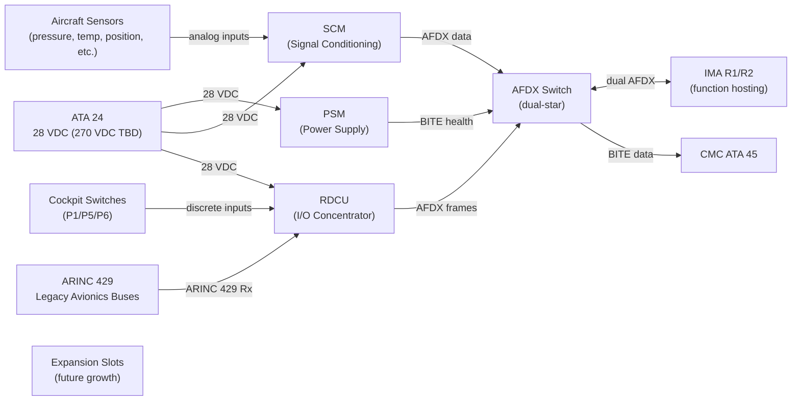
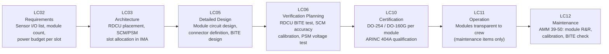

# 039-050 — Multipurpose Component Modules
### AMPEL360e eWTW · ATA 39 · Q+ATLANTIDE ATLAS Scaffold

**Status:**   
**Revision:** 0.1.0 — 2026-05-10  
**Classification:** Q-AIR Primary | Q-MECHANICS / Q-DATAGOV / Q-HPC / Q-GROUND / Q-INDUSTRY Support

---

## §0 Hyperlink Policy

All cross-references use relative Markdown links. Regulatory and standards references cited by identifier only. DMC cross-references follow `DMC-AMPEL360E-EWTW-039-50-YYYY-A`. Badge  marks unresolved parameters. Badges  and  indicate work-in-progress and planned content.

---

## §1 Purpose

This document describes **Multipurpose Component Modules** (subsubject 039-050) hosted in the IMA racks and distributed throughout the eWTW. It covers:

1. Signal Conditioning Modules (SCMs): convert analog sensor inputs to digital for IMA processing.
2. Power Supply Modules (PSMs): DC/DC converters providing regulated low-voltage rails from 28 VDC or 270 VDC bus.
3. Remote Data Concentrator Units (RDCUs): aggregate discrete I/O, analog signals, and ARINC 429 buses, forwarding over AFDX.
4. Module form factors: ARINC 404A or proprietary IMA format TBD (OI-039-008).
5. Hot-swap capability: ground replacement only (TBD).
6. Expansion slot provisions for future avionics growth.

---

## §2 Applicability

| Item | Value |
|---|---|
| Aircraft Programme | AMPEL360e eWTW |
| Variant | All variants |
| ATA Chapter / Subsubject | 39 — 039-050 Multipurpose Component Modules |
| Document Tier | Level 3 — Component/Assembly Description |
| Effectivity | MSN 0001 onwards  |

Includes all LRM/LRU multipurpose modules in IMA racks R1/R2 and distributed RDCUs throughout the aircraft. Excludes:
- IMA software functions: → ATA 42
- Rack mechanical structures: → 039-040
- Panel I/O modules used solely for cockpit switches (overlaps with RDCU function — see 039-010)

---

## §3 System/Function Overview

### 3.1 Module Types

| Module Type | Acronym | Function | Location |
|---|---|---|---|
| Signal Conditioning Module | SCM | Converts analog sensor signals (voltage, current, resistance, frequency) to digital values for IMA | IMA Rack R1/R2 slots |
| Power Supply Module | PSM | DC/DC converter: 28 VDC → ±5 VDC / ±15 VDC for IMA slot logic; or 270 VDC → 28 VDC TBD | IMA Rack R1/R2 slots |
| Remote Data Concentrator Unit | RDCU | Aggregates distributed discrete I/O, analog inputs, and ARINC 429 buses, forwards over AFDX | Distributed (cockpit zone, cabin zone, E/E bay) |
| Expansion Module Slot | — | Provision for future function module — no hardware fitted initially | IMA Rack R1/R2 (spare slots) |

### 3.2 RDCU Function

The RDCU is a critical multipurpose component in the eWTW distributed I/O architecture:
- **Inputs**: up to N discrete inputs (28V ON/OFF logic), M analog inputs (0–5 V, 0–20 mA, thermocouple), P ARINC 429 Rx channels.
- **Outputs**: up to Q discrete outputs (28V command), R ARINC 429 Tx channels.
- **Gateway**: aggregates all I/O into AFDX data frames; transmits to IMA over dual AFDX links.
- **BITE**: self-test monitors input/output continuity, AFDX link health, power supply rails.
- **Locations**: multiple RDCUs distributed around airframe (cockpit zone, cabin zone, aft E/E bay).

### 3.3 SCM Function

The SCM provides analog-to-digital conversion and signal conditioning for aircraft sensors:
- Input types:  (thermocouples, RTDs, strain gauges, pressure transducers, current loops).
- Resolution:  (16-bit ADC TBD).
- Sample rate:  (typically 10–100 Hz per channel).
- Output: AFDX data frame or ARINC 429 digital word.
- Calibration: configurable per sensor type via maintenance terminal.

### 3.4 PSM Function

The PSM provides regulated power supply to IMA slot electronics:
- Input: 28 VDC bus (primary).
- Output: 5 VDC / 3.3 VDC / ±15 VDC for IMA module logic (TBD per backplane requirements).
- Input from 270 VDC: TBD pending bus voltage decision (OI-039-005).
- Isolation: galvanic isolation between input and output rails.
- BITE: output voltage monitoring; BITE alert if any rail out of specification.

---

## §4 Scope

### 4.1 In-Scope

- All SCM modules hosted in IMA racks R1/R2
- All PSM modules hosted in IMA racks R1/R2
- All RDCU units (cockpit, cabin, E/E bay zones)
- Module connectors and backplane interface
- Expansion slot provisions (empty slots, connector provisions)
- Module BITE functions
- Module form factor (ARINC 404A or proprietary IMA TBD)

### 4.2 Out-of-Scope

- IMA-hosted software applications using SCM/RDCU data: → ATA 42
- Sensor harnesses connected to RDCU inputs: → 039-070
- Rack structural hardware: → 039-040

---

## §5 Architecture Description

### 5.1 Module Placement in IMA Racks

IMA Cabinet R1 (example — TBD):
- Slots 1–4: function modules (TBD — FCS, FMS, nav partition)
- Slots 5–6: SCM modules (sensor conditioning)
- Slot 7: PSM (rack power supply)
- Slot 8: RDCU (local I/O aggregator for aft zone)
- Slots 9–12: expansion (empty, provisions fitted)

IMA Cabinet R2 (example — TBD):
- Slots 1–4: function modules (TBD — ECS mgmt, electrical mgmt, fuel)
- Slots 5–6: SCM
- Slot 7: PSM
- Slot 8: RDCU (for forward zone TBD)

### 5.2 Distributed RDCU Architecture

RDCUs are distributed throughout the aircraft:

| RDCU ID | Location | I/O Served | AFDX Link |
|---|---|---|---|
| RDCU-OHP | Behind OHP P6 | OHP switch discrete inputs | AFDX Switch A/B |
| RDCU-P5 | Behind pedestal P5 | P5 switch and selector inputs | AFDX Switch A/B |
| RDCU-P1 | Behind MIP P1 | P1 ECP and panel inputs | AFDX Switch A/B |
| RDCU-AFT | Aft cabin zone | Cabin sensor I/O TBD | AFDX Switch A/B |
| RDCU-EE | Aft E/E bay R1 | E/E bay sensor I/O | AFDX Switch A/B |

All RDCUs connect to the dual AFDX switch (AFDX-SW1 and AFDX-SW2) to provide redundant paths to IMA.

### 5.3 Expansion Provisions

Expansion slots in IMA R1/R2 are provisioned with:
- Power rails fed but not activated (isolated by jumper or module ID logic).
- AFDX end-system connection points on backplane.
- Mechanical blanking plate: removable to insert future module.
- Purpose: allow avionics growth without rack modification.

---

## §6 Functional Breakdown

| ID | Function | Components | Interface | Status |
|---|---|---|---|---|
| 039-050-F01 | Analog sensor signal conditioning | SCM in R1/R2 | Sensor input → AFDX digital data |  |
| 039-050-F02 | IMA slot power supply | PSM in R1/R2 | 28 VDC in → 5/3.3/±15 VDC out |  |
| 039-050-F03 | Cockpit discrete I/O aggregation | RDCU-OHP / RDCU-P5 / RDCU-P1 | Switch signals → AFDX |  |
| 039-050-F04 | Distributed zone I/O aggregation | RDCU-AFT / RDCU-EE | Zone sensors → AFDX |  |
| 039-050-F05 | Legacy ARINC 429 gateway | RDCU ARINC 429 I/F | ARINC 429 ↔ AFDX |  |
| 039-050-F06 | Module BITE | All modules | AFDX → CMC |  |
| 039-050-F07 | Expansion slot provision | Empty slots in R1/R2 | Future growth |  |
| 039-050-F08 | PSM 270 VDC step-down TBD | PSM (HVDC variant) | 270 VDC → 28 VDC TBD |  |

---

## §7 System Context Diagram



---

## §8 Internal Functional Architecture

```mermaid
flowchart TB
    subgraph RDCU_UNIT["RDCU Unit"]
        DI_BUF["Discrete Input Buffer\n(28V logic)"]
        AIN_ADC["Analog Input ADC\n(0-5V / 4-20mA TBD)"]
        A429_RX["ARINC 429 Rx\n(legacy bus in)"]
        A429_TX["ARINC 429 Tx\n(legacy bus out)"]
        DO_DRV["Discrete Output Driver\n(28V command)"]
        AFDX_ES["AFDX End-System\n(dual port)"]
        RDCU_BITE["RDCU BITE\n(self-test)"]
    end
    subgraph SCM_UNIT["SCM Unit"]
        INPUT_COND["Input Signal Conditioning\n(filter, scale, offset)"]
        ADC16["16-bit ADC TBD"]
        CAL_REG["Calibration Registers\n(per sensor type)"]
        SCM_AFDX["AFDX Output Port"]
        SCM_BITE["SCM BITE"]
    end
    subgraph PSM_UNIT["PSM Unit"]
        DCDC["DC/DC Converter\n(28V → 5/3.3/±15V)"]
        ISO["Galvanic Isolation"]
        PSM_MON["Output Voltage Monitor"]
        PSM_BITE["PSM BITE"]
    end
    AFDX_SW["AFDX Switch"]

    DI_BUF & AIN_ADC & A429_RX --> AFDX_ES
    DO_DRV <-- AFDX_ES
    AFDX_ES & RDCU_BITE -->|"AFDX"| AFDX_SW
    INPUT_COND --> ADC16 --> SCM_AFDX --> AFDX_SW
    CAL_REG --> INPUT_COND
    SCM_BITE --> AFDX_SW
    DCDC --> ISO --> PSM_MON --> PSM_BITE --> AFDX_SW
```

---

## §9 Lifecycle Traceability



---

## §10 Interfaces

| Interface | Direction | Counterpart | Signal Type | Notes |
|---|---|---|---|---|
| 28 VDC module power | In | IMA backplane / ATA 24 | Electrical (28 VDC) | All modules |
| 270 VDC input (PSM TBD) | In | ATA 24 HVDC bus | Electrical (270 VDC) | PSM HVDC variant — OI-039-005 |
| Analog sensor inputs | In | Aircraft sensors (various ATA) | Analog (voltage, current, resistance) | SCM inputs |
| Discrete switch inputs | In | Cockpit/cabin switches | 28V discrete | RDCU inputs |
| ARINC 429 inputs | In | Legacy avionics LRUs | ARINC 429 serial | RDCU ARINC 429 Rx |
| Discrete command outputs | Out | System actuators / indicators | 28V discrete | RDCU outputs |
| ARINC 429 outputs | Out | Legacy avionics LRUs | ARINC 429 serial | RDCU ARINC 429 Tx |
| AFDX dual-link | Bi-directional | AFDX switch (dual-star) | AFDX ARINC 664 Pt 7 | All modules |
| BITE health to CMC | Out | CMC (ATA 45) | AFDX | Module self-test results |
| Calibration commands | In | Maintenance terminal | AFDX / maintenance bus | SCM calibration set-point |

---

## §11 Operating Modes

| Mode | SCM | PSM | RDCU | Notes |
|---|---|---|---|---|
| Normal Operation | Continuous sampling; data on AFDX | Steady-state regulated output | Continuous I/O scan; AFDX transmit | All modules operational |
| Powerup BITE | Self-test cycle (< TBD s) | Output voltage check | Discrete continuity check | BITE before operational |
| Ground Maintenance | Calibration check; sensor simulation TBD | Voltage trim TBD | I/O force test from terminal | via maintenance terminal |
| Module Failure | Module BITE flag; partition continues on redundant module | PSM BITE alert; standby PSM if redundant | RDCU BITE; IMA uses remaining RDCUs | Module-level fault isolation |
| Power-Off | No output | No output | No output | All modules dark |

---

## §12 Monitoring and Diagnostics

| Parameter | Sensor / Source | CMC Signal | Alert |
|---|---|---|---|
| SCM input continuity | RDCU/SCM BITE | AFDX | "SCM FAULT" advisory |
| PSM output voltage | PSM voltage monitor | AFDX | "PSM FAULT" (caution) |
| RDCU discrete input continuity | RDCU BITE | AFDX | "RDCU FAULT" advisory |
| RDCU AFDX link health | AFDX end-system monitor | AFDX | "RDCU AFDX FAIL" |
| SCM calibration status | Calibration register valid flag | CMC log | Advisory if calibration expired |
| Module temperature | Internal NTC per module | AFDX | Overtemperature advisory TBD |

---

## §13 Maintenance Concept

### 13.1 On-Wing Maintenance

| Task | Interval | Access | Skill Level |
|---|---|---|---|
| Module BITE review via CMC | Each visit | CMC terminal | Line maintenance |
| SCM calibration check | C-check TBD | CMC terminal + sensor simulation | Line / base |
| RDCU I/O functional test | C-check TBD | Maintenance terminal | Line / base |
| Module replacement (LRM) | On condition | IMA cabinet front access | Line maintenance (trained) |
| RDCU replacement (distributed) | On condition | Zone panel access (disconnect, replace) | Line maintenance |
| PSM output voltage check | C-check TBD | Maintenance terminal | Line maintenance |
| Expansion slot provisioning | As required (upgrade) | IMA cabinet front | Base maintenance |

### 13.2 Off-Wing

- LRM (SCM/PSM): depot hardware test, software reload per CMM.
- RDCU: bench BITE test, connector inspection, software update per CMM.

---

## §14 S1000D/CSDB Mapping

| Document | DMC Pattern | Info Code | Status |
|---|---|---|---|
| Multipurpose module description | DMC-AMPEL360E-EWTW-039-50-00A-040A-A | 040 |  |
| RDCU removal | DMC-AMPEL360E-EWTW-039-50-10A-520A-A | 520 |  |
| RDCU installation | DMC-AMPEL360E-EWTW-039-50-10A-720A-A | 720 |  |
| SCM calibration | DMC-AMPEL360E-EWTW-039-50-20A-920A-A | 920 |  |
| LRM removal (generic) | DMC-AMPEL360E-EWTW-039-50-00A-520B-A | 520 |  |
| Fault isolation — modules | DMC-AMPEL360E-EWTW-039-50-00A-400A-A | 400 |  |

Full DMRL in [039-090](./039-090-S1000D-CSDB-Mapping-and-Traceability.md).

---

## §15 Footprints

| Parameter | Value |
|---|---|
| SCM count per IMA rack |  |
| PSM count per IMA rack |  |
| RDCU count (cockpit zones) | 3 (OHP, P5, P1) |
| RDCU count (distributed) |  (~2–4 additional) |
| Total RDCU count |  |
| Module form factor |  (ARINC 404A or proprietary — OI-039-008) |
| RDCU discrete I/O capacity |  (per RDCU: TBD inputs / outputs) |
| SCM channel count |  (per module: TBD channels) |
| PSM power output |  W |
| Expansion slots per cabinet |  (~2–4 spare per cabinet) |

---

## §16 Safety and Certification

| Requirement | Standard | Application |
|---|---|---|
| Hardware assurance | DO-254 | SCM, PSM, RDCU: ASIC/FPGA assurance per DAL |
| Environmental qualification | DO-160G | All modules: vibration, temperature, humidity, EMI |
| IMA partitioning | ARINC 653 | SCM/RDCU data presented to partitioned IMA functions without cross-partition interference |
| AFDX interface | ARINC 664 Pt 7 | All modules transmit on dual AFDX |
| ARINC 429 compliance | ARINC 429 | RDCU ARINC 429 Rx/Tx |
| Calibration traceability | EASA AMC 25.1301 TBD | SCM calibration traceable to national standards |
| PSM galvanic isolation | CS-25.1353 | Isolation between 270 VDC input and 28 VDC output (if PSM HVDC variant) |
| Equipment installation | CS-25.1301 | All modules fit for purpose in IMA environment |

---

## §17 Verification and Validation

| Test | Method | Acceptance Criterion | Status |
|---|---|---|---|
| RDCU discrete I/O functional test | Apply known discrete states; read AFDX output | All states correctly reported in AFDX frame |  |
| SCM accuracy test | Apply reference sensor signal; read AFDX digital output | Output within ±TBD% of reference |  |
| PSM output voltage test | Apply rated input; measure output rails | All rails within ±TBD% of nominal |  |
| RDCU AFDX link test | Link-up; path switchover on primary failure | Switchover < TBD ms |  |
| RDCU BITE test | Powerup; inject known fault | BITE correctly reports to CMC |  |
| PSM BITE voltage fault | Remove load to cause undervoltage; check BITE | BITE alert generated via AFDX |  |
| SCM calibration procedure | Set calibration coefficients; verify output | Calibrated output within spec |  |
| DO-160G environmental | Per DO-160G categories | All categories pass |  |
| DO-254 hardware assurance | Per DO-254 test plan | FPGA/ASIC assurance objectives met |  |
| IMA module BITE test | Per ARINC 653 BITE test | BITE passes; partition unaffected |  |
| AFDX link test (module level) | End-system port test | Dual ports functional |  |

---

## §18 Glossary

| Term | Definition |
|---|---|
| SCM | Signal Conditioning Module — module converting analog sensor inputs to digital format for IMA processing |
| PSM | Power Supply Module — DC/DC converter module providing regulated low-voltage supply to IMA slot electronics |
| RDCU | Remote Data Concentrator Unit — distributed I/O aggregator forwarding discrete, analog, and ARINC 429 signals over AFDX to IMA |
| LRM | Line-Replaceable Module — individual electronic module replaceable within an IMA cabinet at line maintenance level |
| ARINC 404A | ARINC standard defining ATR-form-factor mechanical and electrical interfaces for LRU-style modules |
| ADC | Analog-to-Digital Converter — circuit converting analog voltage/current to digital numeric value |
| Galvanic isolation | Electrical isolation between input and output circuits preventing current flow; achieved by transformer or opto-isolator |
| AFDX end-system | AFDX protocol stack hardware within a module or LRU; connects to AFDX switch via Cat7 or optical fibre |
| ARINC 429 | ARINC serial data bus standard widely used in commercial avionics for LRU-to-LRU communication |
| Expansion slot | Unpopulated IMA rack slot provisioned with power and data connections for future module installation |
| BITE | Built-In Test Equipment — self-test capability in the module detecting internal faults |
| DAL | Design Assurance Level — DO-178C/DO-254 level A (most critical) to E (no safety impact) |
| IMA | Integrated Modular Avionics — shared hardware infrastructure hosting multiple software functions |
| ARINC 653 | IMA RTOS partitioning standard — ensures no interference between software partitions |
| CMC | Central Maintenance Computer (ATA 45) — receives module BITE and health data |
| HVDC | High Voltage DC — 270 VDC bus in eWTW architecture |

---

## §19 Citations

1. EASA CS-25.1301 — Function and installation.
2. EASA CS-25.1353 — Electrical equipment and installations.
3. RTCA/EUROCAE DO-160G — Environmental Conditions and Test Procedures.
4. RTCA/EUROCAE DO-254 — Design assurance for airborne electronic hardware.
5. ARINC Report 429 — Digital information transfer system.
6. ARINC Report 664 Part 7 — AFDX.
7. ARINC Report 653 — IMA APEX partitioning.
8. ARINC Report 404A — Air transport equipment cases and racking.
9. Q+ATLANTIDE ATLAS [039-000 General](./039-000-Electrical-Electronic-Panels-and-Multipurpose-Components-General.md).
10. Q+ATLANTIDE ATLAS [039-040 Avionics Racks](./039-040-Avionics-and-Electronic-Equipment-Racks.md).
11. Q+ATLANTIDE ATLAS [039-090 S1000D/CSDB Mapping](./039-090-S1000D-CSDB-Mapping-and-Traceability.md).

---

## §20 References

| Ref | Document | Notes |
|---|---|---|
| [R1] | CS-25.1301 | All module equipment fit for purpose |
| [R2] | DO-254 | Hardware assurance for FPGA/ASIC in modules |
| [R3] | DO-160G | Environmental qualification |
| [R4] | ARINC 429 | RDCU ARINC 429 interface |
| [R5] | ARINC 664 Pt 7 | AFDX module data bus |
| [R6] | ARINC 653 | IMA partitioning for hosted modules |
| [R7] | ARINC 404A | Module form factor |
| [R8] | ATA 42 — IMA ATLAS | IMA function hosting context |
| [R9] | ATA 45 — CMC ATLAS | BITE data reception |
| [R10] | 039-040 | Avionics rack context for module installation |

---

## §21 Open Issues

| ID | Description | Owner | Status |
|---|---|---|---|
| OI-039-005 | 270 VDC bus — PSM HVDC variant requirements | Q-AIR / Q-MECHANICS |  |
| OI-039-008 | Module expansion provisions and connector standardisation | Q-AIR / Q-HPC |  |
| OI-039-019 | SCM channel count per module — pending sensor I/O list | Q-AIR |  |
| OI-039-020 | RDCU hot-swap capability investigation (in-flight LRM replacement is non-standard) | Q-AIR / Q-HPC |  |
| OI-039-021 | RDCU count and placement — pending aircraft I/O architecture freeze | Q-AIR |  |

---

## §22 Change Log

| Revision | Date | Author | Description |
|---|---|---|---|
| 0.1.0 | 2026-05-10 | Q+ATLANTIDE ATLAS Working Group | Initial full-template draft; all 23 sections populated; eWTW SCM/PSM/RDCU context incorporated |
| 0.0.0 | 2026-05-10 | Q+ATLANTIDE ATLAS Working Group | Scaffold stub created |
