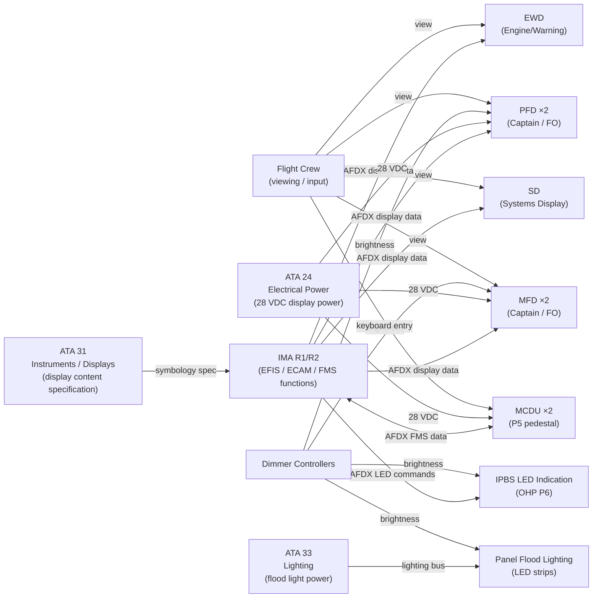
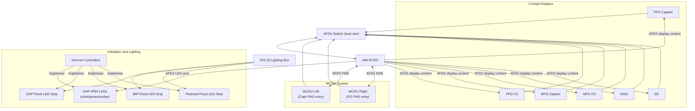
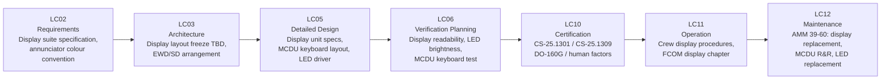

# 039-060 — Panel Indication, Lighting, and Human-Machine Interfaces
### [PROGRAMME-AIRCRAFT] [PROGRAMME-VARIANT] · ATA 39 · Q+ATLANTIDE ATLAS Scaffold

**Status:**   
**Revision:** 0.1.0 — 2026-05-10  
**Classification:** Q-AIR Primary | Q-MECHANICS / Q-DATAGOV / Q-HPC / Q-GROUND / Q-INDUSTRY Support

---

## §0 Hyperlink Policy

All cross-references use relative Markdown links. Regulatory references cited by identifier. DMC cross-references follow `DMC-<PROGRAMME>-<VARIANT>-039-60-YYYY-A`. Badge  marks unresolved parameters. Badges  and  indicate work-in-progress and planned content.

---

## §1 Purpose

This document defines the agnostic ATLAS standard-level architecture context for `039-060 — Panel Indication, Lighting, and Human-Machine Interfaces`.

It describes the controlled scope, functions, interfaces, safety considerations, lifecycle traceability, and S1000D/CSDB mapping logic that programme implementations shall instantiate when this node is applicable.

This document is not a programme design baseline. Programme-specific capacities, locations, part numbers, effectivity, operating limits, maintenance references, and data module codes shall be defined only inside the applicable programme implementation branch.
## §2 Applicability

| Applicability Level | Rule |
|---|---|
| Standard taxonomy | Applies to the ATLAS node `<NODE>` |
| Programme implementation | Conditional; determined by programme architecture, trade studies, certification basis, and applicability model |
| Product configuration | Defined in the programme-specific configuration baseline |
| Effectivity | Defined in the programme CSDB / applicability layer |
| Non-applicability | Must be explicitly stated in the programme impact-study branch when excluded |
## §3 System/Function Overview

### 3.1 Display Suite Architecture

The [PROGRAMME-VARIANT] cockpit display suite (OLED/LCD TBD — OI-039-003) comprises:

| Display | Count | Location | Function |
|---|---|---|---|
| PFD (Primary Flight Display) | 2 | Captain left, FO right | Attitude, speed, altitude, heading, flight mode annunciators |
| MFD (Multi-Function Display) | 2 | Inner screens, each pilot | Navigation, systems synoptic, weather, ECAM pages TBD |
| EWD (Engine/Warning Display) | 1 (or on MFD TBD) | Lower centre panel or MFD window | Engine parameters, ETMS thrust display, warning/caution messages |
| SD (Systems Display) | 1 (or on MFD TBD) | Lower centre or MFD window | Systems synoptic pages (ECS, fuel, electrical, etc.) |
| MCDU | 2 | P5 centre pedestal | FMS data entry, performance computations, route management |
| CCD (trackball) | TBD | P5 centre | MFD cursor control for interactive navigation and systems pages |

Note: EWD / SD layout (dedicated screens vs. MFD window allocation) is under evaluation — OI-039-003.

### 3.2 IPBS LED Indication Convention

All Overhead Panel (P6) IPBS push-button legends follow AECMA / ATA annunciator colour convention:

| Colour | Meaning | Legend Condition |
|---|---|---|
| **Dark** | System OFF, no fault | Normal state when system not selected |
| **Green** | System ON / Active / Normal | System energised or mode active |
| **Amber** | Caution / Fault | System fault detected (non-critical) |
| **Red** | Warning / Danger | Critical fault (rare on IPBS — red usually on display) |
| **White** | Advisory / Label always visible | Function name legend (always backlit white) |

### 3.3 Panel Flood Lighting

Panel flood lighting provides general illumination of cockpit panels independent of display backlighting:
- OHP flood: LED strip recessed in overhead structure.
- Glareshield / MIP flood: LED strip on glareshield fascia.
- Pedestal flood: LED strip on pedestal surround.
- Normal mode: white flood, adjustable brightness.
- Emergency mode: red flood (low-power backup, preserving crew night vision). 
- Power supply: 28 VDC from lighting bus (ATA 33 / ATA 24).

---

## §4 Scope

### 4.1 In-Scope

- PFD units (×2), MFD units (×2) on MIP P1
- EWD and SD units (TBD location and count)
- MCDU units (×2) on P5
- CCD trackball units (TBD — OI-039-003)
- IPBS LED backlight system: LED drivers, dimmer controllers, legend caps
- Panel flood lighting: LED strips (OHP, glareshield, pedestal)
- Display dimming and brightness control

### 4.2 Out-of-Scope

- EFIS display content and symbology (→ ATA 31 / ATA 42)
- FMS software (→ ATA 42)
- Cabin lighting (→ ATA 33)
- Panel wiring to displays (→ 039-070)

---

## §5 Architecture Description

### 5.1 Display Data Flow

```
[IMA R1/R2 - EFIS function] → [AFDX] → [Display Units (PFD/MFD)]
[IMA R1/R2 - ECAM function] → [AFDX] → [EWD / SD]
[MCDU keyboard entry]        → [AFDX] → [FMS in IMA] → [MCDU screen]
[ECP inputs (P1)]            → [AFDX] → [EFIS function] → [PFD/MFD format change]
```

All display data is carried on AFDX; displays are AFDX-connected end-systems with dedicated display processing (or shared TBD per manufacturer OI-039-003).

### 5.2 LED Backlight Architecture

Each IPBS legend LED is driven by a dedicated LED driver within the RDCU or a dedicated panel dimming controller:
- Normal operation: LED current set by dimmer potentiometer position.
- Fault state: amber LED commanded ON by IMA system function via AFDX → panel controller.
- Normal/active state: green LED commanded ON by IMA.
- Backlight dim range:  (day: max, night: min).

### 5.3 MCDU Architecture

Each MCDU is a standalone LRU containing:
- **Display**: high-resolution active matrix LCD or OLED TBD.
- **Keyboard**: alphanumeric with dedicated function keys (EXEC, PREV PAGE, NEXT PAGE, etc.).
- **Processor**: local display processor and FMS I/F AFDX end-system.
- **BITE**: MCDU self-test; keyboard key continuity check; display brightness check.
- **Interface**: AFDX to IMA FMS function; ARINC 429 legacy TBD if required.

---

## §6 Functional Breakdown

| ID | Function | Components | Interface | Status |
|---|---|---|---|---|
| 039-060-F01 | Primary flight display | PFD ×2 | AFDX ← IMA EFIS function |  |
| 039-060-F02 | Multi-function display | MFD ×2 | AFDX ← IMA EFIS/ECAM function |  |
| 039-060-F03 | Engine/Warning display | EWD | AFDX ← IMA ECAM function |  |
| 039-060-F04 | Systems display | SD | AFDX ← IMA ECAM function |  |
| 039-060-F05 | FMS data entry | MCDU ×2 | AFDX ↔ IMA FMS |  |
| 039-060-F06 | IPBS legend indication | LED IPBS lenses | IMA → RDCU → LED driver |  |
| 039-060-F07 | Panel flood lighting | LED flood strips | ATA 33 lighting bus |  |
| 039-060-F08 | Display / panel dimming | Dimmer controllers | Dimmer pot → LED driver / display |  |
| 039-060-F09 | CCD cursor control (TBD) | CCD trackball | AFDX ← IMA EFIS TBD |  |

---

## §7 System Context Diagram



---

## §8 Internal Functional Architecture



---

## §9 Lifecycle Traceability



---

## §10 Interfaces

| Interface | Direction | Counterpart | Signal Type | Notes |
|---|---|---|---|---|
| AFDX display data | In | IMA EFIS/ECAM function (ATA 42) | AFDX | PFD/MFD/EWD/SD content |
| MCDU keyboard entry | Out | IMA FMS function (ATA 42) | AFDX | FMS data entry |
| MCDU display content | In | IMA FMS (ATA 42) | AFDX | FMS page data to MCDU screen |
| ECP inputs (display control) | Out | IMA EFIS function | AFDX | PFD format, MFD range/mode |
| IPBS LED command | In | IMA system functions (ATA 42) | AFDX → RDCU → LED driver | Fault/active/normal states |
| Display flood lighting | In | ATA 33 lighting bus | Electrical (28 VDC) | Panel flood LED strips |
| Dimmer control | Bi-directional | Dimmer controller → display | Analog / PWM | Brightness adjustment |
| Display power | In | ATA 24 CBP-1 branch | Electrical (28 VDC / 115 VAC TBD) | Display unit power |
| CCD input (TBD) | Out | IMA EFIS function | AFDX (TBD) | MFD cursor control |

---

## §11 Operating Modes

| Mode | PFD / MFD | EWD / SD | MCDU | IPBS LEDs | Flood Lighting |
|---|---|---|---|---|---|
| Normal Flight | Full EFIS display; flight mode annunciators | ETMS thrust + system synoptic | FMS active; performance page | System states normal/active | White, adjusted to preference |
| Pre-flight Ground | EFIS power-up; BITE display | ECAM self-test | FMS init | BITE: all LEDs flash TBD | White full |
| Night / Low Ambient | Normal display; pilot-dimmed | Normal | Normal | Dimmed to min setting | Dimmed white |
| Abnormal / System Fault | Fault annunciator on PFD/EWD | Fault message on EWD; system page on SD | Abnormal proc reference TBD | Amber IPBS for affected system | Normal |
| Emergency | Essential display only (battery) | Min EWD | TBD | Emergency pattern TBD | Red flood (emergency mode TBD) |
| Maintenance BITE | BITE diagnostic page on MFD TBD | N/A | Maintenance page access | BITE LED test | Normal |

---

## §12 Monitoring and Diagnostics

| Parameter | Sensor / Source | CMC Signal | Alert |
|---|---|---|---|
| Display unit health | Display BITE | AFDX | "DISPLAY FAULT" advisory |
| MCDU keyboard continuity | MCDU BITE | AFDX | "MCDU FAULT" advisory |
| IPBS LED lamp failure | LED current monitor | AFDX | "PANEL LAMP FAULT" advisory |
| Display brightness (auto-check) | Ambient light sensor TBD | AFDX | Maintenance advisory if brightness out of range |
| Flood light continuity | LED current monitor | AFDX TBD | Maintenance advisory |
| Dimmer controller output | PWM feedback | AFDX | Dimmer fault advisory |

---

## §13 Maintenance Concept

### 13.1 On-Wing Maintenance

| Task | Interval | Access | Skill Level |
|---|---|---|---|
| Display pixel / image quality check | A-check  | Cockpit direct | Line maintenance |
| MCDU keyboard function check | A-check TBD | Cockpit direct | Line maintenance |
| IPBS LED legend check | A-check TBD | Cockpit direct | Line maintenance |
| Panel flood light check | A-check TBD | Cockpit direct | Line maintenance |
| Display unit replacement | On condition | Cockpit direct (display front frame, DZUS screws TBD) | Line maintenance (trained) |
| MCDU replacement | On condition | P5 pedestal, front access | Line maintenance |
| LED strip replacement (flood) | On condition | Overhead / glareshield strip removal TBD | Line / base |
| Dimmer controller replacement | On condition | Behind panel | Line maintenance (trained) |

### 13.2 Off-Wing

- Display unit: manufacturer bench test and calibration per CMM.
- MCDU: bench test, keyboard calibration, display calibration per CMM.

---

## §14 S1000D/CSDB Mapping

| Document | DMC Pattern | Info Code | Status |
|---|---|---|---|
| HMI / indication description | DMC-<PROGRAMME>-<VARIANT>-039-60-00A-040A-A | 040 |  |
| Display unit removal | DMC-<PROGRAMME>-<VARIANT>-039-60-10A-520A-A | 520 |  |
| Display unit installation | DMC-<PROGRAMME>-<VARIANT>-039-60-10A-720A-A | 720 |  |
| MCDU removal / installation | DMC-<PROGRAMME>-<VARIANT>-039-60-20A-520A-A | 520 |  |
| Fault isolation — displays | DMC-<PROGRAMME>-<VARIANT>-039-60-00A-400A-A | 400 |  |
| LED brightness check | DMC-<PROGRAMME>-<VARIANT>-039-60-00A-300A-A | 300 |  |

Full DMRL in [039-090](./039-090-S1000D-CSDB-Mapping-and-Traceability.md).

---

## §15 Footprints

| Parameter | Value |
|---|---|
| PFD count | 2 (one per crew station) |
| MFD count | 2 (one per crew station) |
| EWD count | 1 (or MFD window TBD) |
| SD count | 1 (or MFD window TBD) |
| MCDU count | 2 |
| PFD display size |  (typical ~8×10 in active area) |
| MFD display size |  |
| Display technology |  (OLED or LCD — OI-039-003) |
| Display mass (each PFD/MFD) |  |
| MCDU mass |  |
| CCD count |  (TBD — OI-039-003) |

---

## §16 Safety and Certification

| Requirement | Standard | Application |
|---|---|---|
| Equipment installation | CS-25.1301 | All display units, MCDU, LED drivers |
| System safety | CS-25.1309 | Single display failure; PFD reversion to backup display; no loss of all primary flight information |
| Environmental qualification | DO-160G | Displays, MCDU, LED drivers: vibration, temperature, humidity, EMI |
| EFIS software | DO-178C | EFIS display rendering software DAL per function (PFD → DAL A TBD) |
| EFIS hardware | DO-254 | Display processing hardware |
| Annunciator colour | AECMA / ATA 100 convention | Red, Amber, White, Green colour standard |
| Human factors — display | CS-25.1523 / EASA AMC 25.1302 | Crew workload; display readability; day/night lighting |
| Display readability | SAE ARP4102 / AC 25.11 | Minimum contrast ratio, viewing angle, sunlight readability |
| Panel lighting | CS-25.1381 | Instrument lighting; emergency lighting |

---

## §17 Verification and Validation

| Test | Method | Acceptance Criterion | Status |
|---|---|---|---|
| Display readability test | Measure contrast ratio and luminance in simulated cockpit | Contrast ≥ TBD:1; luminance ≥ TBD cd/m² |  |
| Display BITE test | Powerup BITE; inject known display fault | BITE correctly identified and reported to CMC |  |
| MCDU keyboard function test | Press each key; verify AFDX output | All keys correctly registered in AFDX frame |  |
| IPBS LED state test | Command each IPBS state; measure luminance | Correct colour and brightness within spec |  |
| LED backlight brightness check | Luminance meter at panel surface | Within TBD cd/m² range; dimmer response linear |  |
| Panel flood light check | Energise flood; measure illuminance at panel surface | ≥ TBD lux at panel surface |  |
| Dimmer functionality | Rotate dimmer full range; verify brightness variation | Proportional to setting TBD |  |
| DO-160G environmental | Per DO-160G for display units | All categories pass |  |
| PFD reversion test | Fail primary PFD; verify reversion | Backup display activates < TBD seconds |  |
| Panel bonding resistance | Milliohm meter | ≤ 2.5 mΩ |  |
| Sunlight readability | Daylight simulation (10,000 lux TBD) | Display legible in max ambient light |  |

---

## §18 Glossary

| Term | Definition |
|---|---|
| EFIS | Electronic Flight Instrument System — suite of electronic displays (PFD, MFD) replacing conventional electromechanical instruments |
| PFD | Primary Flight Display — cockpit display showing attitude, speed, altitude, heading, and flight mode annunciators |
| MFD | Multi-Function Display — display showing navigation maps, systems synoptic, weather, or ECAM pages as selected by crew |
| ECAM | Electronic Centralised Aircraft Monitor (or equivalent) — system monitoring display showing engine parameters and systems synoptics |
| EWD | Engine/Warning Display — upper ECAM screen showing engine parameters, ETMS thrust, and system warning/caution messages |
| SD | Systems Display — lower ECAM screen showing aircraft system synoptic pages |
| MCDU | Multifunction Control Display Unit — crew-operated alphanumeric display and keyboard for FMS data entry |
| ECP | EFIS Control Panel — crew panel for selecting PFD/MFD page formats, display range, and modes |
| CCD | Cursor Control Device — trackball or other pointing device for MFD interactive control |
| IPBS | Illuminated Push-Button Switch — panel switch with integral LED backlit legend |
| LED | Light-Emitting Diode — semiconductor light source used for all cockpit panel indication and backlighting |
| Dimmer controller | Unit providing variable brightness control to LED drivers and display panels |
| AECMA colour convention | Annunciator colour standard: Red = warning, Amber = caution, White = advisory, Green = normal/active |
| Contrast ratio | Ratio of luminance of bright to dark areas in a display; must meet minimum standard for readability |
| DO-178C | Software assurance standard; DAL A for critical flight display functions |
| DO-254 | Hardware assurance for display processing hardware |
| ETMS | Electric Thrust Management System — [PROGRAMME-VARIANT] all-electric thrust management; parameters shown on EWD |

---

## §19 Citations

1. EASA CS-25.1301 — Function and installation.
2. EASA CS-25.1309 — System safety.
3. EASA CS-25.1381 — Instrument lighting.
4. EASA AMC 25.1302 — Flight crew human factors.
5. RTCA/EUROCAE DO-160G — Environmental qualification.
6. RTCA/EUROCAE DO-178C — Software assurance.
7. RTCA/EUROCAE DO-254 — Hardware assurance.
8. SAE ARP4102 / FAA AC 25.11 — Display readability and luminance.
9. AECMA / ATA 100 iSpec 2200 — Annunciator colour convention.
10. Q+ATLANTIDE ATLAS [039-000 General](./039-000-Electrical-Electronic-Panels-and-Multipurpose-Components-General.md).
11. Q+ATLANTIDE ATLAS [039-010 Control Panels](./039-010-Control-Panels-and-Switching-Assemblies.md).
12. Q+ATLANTIDE ATLAS [039-090 S1000D/CSDB Mapping](./039-090-S1000D-CSDB-Mapping-and-Traceability.md).

---

## §20 References

| Ref | Document | Notes |
|---|---|---|
| [R1] | CS-25.1301 / CS-25.1309 | Equipment installation and system safety |
| [R2] | CS-25.1381 | Instrument lighting |
| [R3] | EASA AMC 25.1302 | Human factors / crew workload |
| [R4] | DO-160G | Environmental qualification for displays |
| [R5] | DO-178C / DO-254 | EFIS software and hardware assurance |
| [R6] | SAE ARP4102 | Display readability standards |
| [R7] | AECMA / ATA 100 convention | Annunciator colour code |
| [R8] | ATA 31 — Instruments ATLAS | Display content and symbology |
| [R9] | ATA 42 — IMA ATLAS | EFIS / FMS / ECAM function hosting |
| [R10] | ATA 33 — Lighting ATLAS | Panel flood light power supply |

---

## §21 Open Issues

| ID | Description | Owner | Status |
|---|---|---|---|
| OI-039-003 | EFIS/ECAM manufacturer selection: Thales, Collins, or L3Harris — impacts EWD/SD layout | Q-AIR / ORB-PMO |  |
| OI-039-022 | EWD/SD dedicated screens vs. MFD window — layout freeze pending | Q-AIR |  |
| OI-039-023 | CCD trackball inclusion decision | Q-AIR |  |
| OI-039-024 | Display technology: OLED vs. LCD (power, brightness, lifetime) | Q-AIR / Q-MECHANICS |  |
| OI-039-025 | Emergency flood lighting: red flood included or not (reg requirement review) | Q-AIR / ORB-LEG |  |

---

## §22 Change Log

| Revision | Date | Author | Description |
|---|---|---|---|
| 0.1.0 | 2026-05-10 | Q+ATLANTIDE ATLAS Working Group | Initial full-template draft; all 23 sections populated; [PROGRAMME-VARIANT] HMI context incorporated |
| 0.0.0 | 2026-05-10 | Q+ATLANTIDE ATLAS Working Group | Scaffold stub created |
