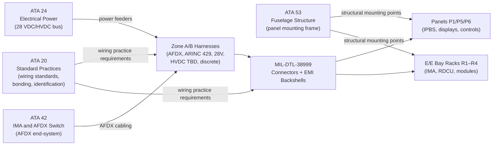
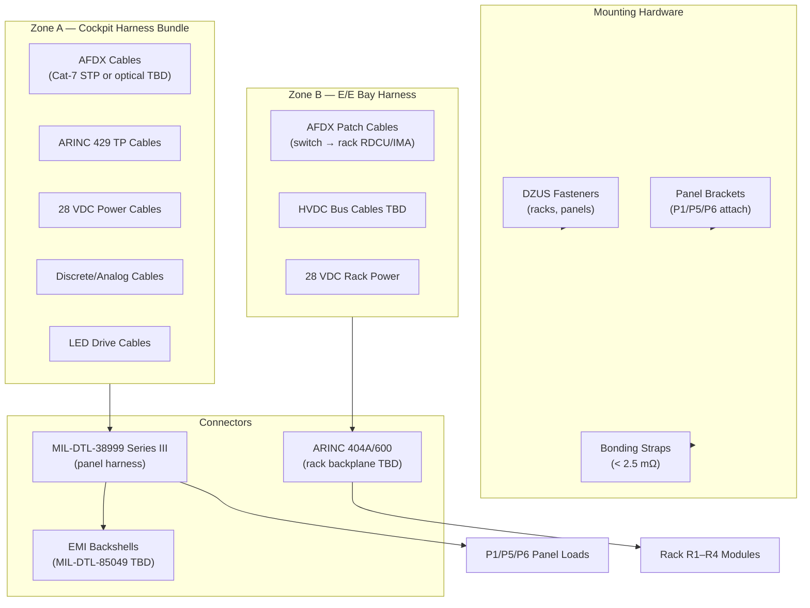
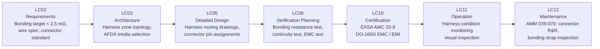

# 039-070 — Panel Wiring, Connectors, and Installation Interfaces
### AMPEL360e eWTW · ATA 39 · Q+ATLANTIDE ATLAS Scaffold

**Status:**   
**Revision:** 0.1.0 — 2026-05-10  
**Classification:** Q-AIR Primary | Q-MECHANICS / Q-DATAGOV / Q-HPC / Q-GROUND / Q-INDUSTRY Support

---

## §0 Hyperlink Policy

All cross-references use relative Markdown links. Regulatory references cited by identifier. DMC cross-references follow `DMC-AMPEL360E-EWTW-039-70-YYYY-A`. Badge  marks unresolved parameters. Badges  and  indicate work-in-progress and planned content.

---

## §1 Purpose

This document describes **Panel Wiring, Connectors, and Installation Interfaces** (subsubject 039-070) for the AMPEL360e eWTW. It covers:

1. Panel harnesses: wire gauge AWG selection (TBD), insulation material (PTFE/ETFE TBD).
2. Connector standards: MIL-DTL-38999 circular connectors; EMI backshells.
3. Bonding: panel bonding resistance target < 2.5 mΩ; ATA 24 ground return convention.
4. Structural mounting: P1 glareshield mounting; P5 pedestal mounting; P6 overhead structure mounting; rack DZUS fasteners in E/E bay.
5. AFDX network cabling: Cat-7 STP or optical fibre (TBD — open issue).
6. ARINC 429 data bus wiring: twisted shielded pairs.
7. EMC / EMI provisions.
8. Installation torque values and special tooling TBD.

---

## §2 Applicability

| Item | Value |
|---|---|
| Aircraft Programme | AMPEL360e eWTW |
| Variant | All variants |
| ATA Chapter / Subsubject | 39 — 039-070 Panel Wiring, Connectors, and Installation Interfaces |
| Document Tier | Level 3 — Component/Assembly Description |
| Effectivity | MSN 0001 onwards  |

Includes all ATA 39 panel and rack interconnect harnesses, connectors, mounting hardware, and grounding provisions. Excludes:
- Airframe primary structure (→ ATA 53)
- Power wiring for main bus feeders (→ ATA 24)
- Airframe standard bonding jumpers for fuel system (→ ATA 28/12)

---

## §3 System/Function Overview

### 3.1 Panel Harness Architecture

Panel harnesses interconnect:
1. **AFDX network cables**: Panel AFDX end-system (RDCU / display / MCDU) → AFDX switch in E/E bay.
2. **ARINC 429 cables**: Legacy I/O from RDCU to sensors/actuators where AFDX is not available.
3. **28 VDC power cables**: Distribution from CBP branch to panel loads.
4. **HVDC power cables** (TBD): From HVDC bus to PDU / motor drive if applicable; insulation class TBD.
5. **Discrete signal cables**: Analog inputs to RDCU; relay coil wiring; sensor supply.
6. **LED drive cables**: From RDCU or panel dimmer controller to IPBS LED drivers.

### 3.2 Connector Standards

| Connector Type | Standard | Application |
|---|---|---|
| Circular multi-pin, sealed | MIL-DTL-38999 Series III | Panel-to-harness, RDCU, display units |
| EMI backshell (conductive) | MIL-DTL-85049 TBD | All MIL-38999 where EMI important |
| Rack backplane connector | ARINC 404A or ARINC 600 TBD | IMA rack-to-module in E/E bay |
| AFDX patch connector | RJ-45 (Cat-7) or LC optical TBD | AFDX switch to panel harness |
| ARINC 429 connector | MS3106/38999 TBD | Twisted pair discrete data bus |
| Power distribution connector | MIL-DTL-38999 or lug-terminal TBD | CBP / PDU branch outputs |

### 3.3 Panel Mounting Summary

| Panel | Structure | Fastener | Notes |
|---|---|---|---|
| P1 Glareshield | Forward cockpit structure frame | Captive screw, DZUS TBD | Houses EFIS ECP, Autoland, AP |
| P5 Centre Pedestal | Floor structure, pedestal body | DZUS or screw-mount TBD | MCDU, FMP, ETMS controller |
| P6 Overhead Panel | Overhead fuselage frame (crown) | DZUS / Camloc TBD | Main bus switches, CBP-3 |
| E/E Bay Rack R1–R4 | Rack chassis, side rails | Shock mount + DZUS | IMA / RDCU / module LRUs |

---

## §4 Scope

### 4.1 In-Scope

- All panel interconnect harnesses (AFDX, ARINC 429, 28 VDC, discrete, LED)
- HVDC inter-rack cabling TBD
- MIL-DTL-38999 connectors and EMI backshells
- Panel structural mounting (hardware: brackets, DZUS, Camloc TBD)
- Bonding straps and bonding resistance verification
- Wire identification sleeving and labels
- Tooling requirements (insertion/extraction tools, torque tools TBD)

### 4.2 Out-of-Scope

- Main bus feeders and primary power cables (→ ATA 24)
- AFDX switch equipment (→ ATA 42 / 039-040)
- Panel functional connections other than as mounting/wiring I/F (→ 039-010 through 039-060)

---

## §5 Architecture Description

### 5.1 Wiring Topology

The panel wiring topology is a **distributed point-to-point network** from panels to E/E bay, bundled as zoned harnesses:

- **Zone A** harness: Cockpit P1/P5/P6 → aft bulkhead connector rack.
- **Zone B** harness: E/E bay R1–R4 interconnects.
- Each harness is routed via conduit / clamp supports compliant to EASA AMC 20-8 wiring standards.

### 5.2 Wire Specification

| Parameter | Value | Status |
|---|---|---|
| Wire gauge (AFDX) |  (typical AWG 24–26) | To be defined |
| Wire gauge (28 VDC power) |  (AWG 20–12 per current) | To be defined |
| Wire gauge (HVDC) |  (high-voltage class TBD) | To be defined |
| Insulation (standard) | PTFE or ETFE  | Selection pending |
| Insulation (HVDC) | Cross-linked ETFE or XLPE TBD | Selection pending |
| Shield coverage (ARINC 429) | ≥ 85 % coverage TBD | Twisted shielded pair |
| Shield (AFDX Cat-7 TBD) | S/STP — foil+braid per Cat-7 | If copper selected |
| Colour code | White for GND, black for power TBD | ATA 24 convention TBD |
| Wire identification | ATA wire number sleeving every ~30 cm TBD | Per ATA 20 convention |

### 5.3 Bonding

All panels, racks, and LRU mounting hardware must be bonded to aircraft structure:
- Target bonding resistance: **< 2.5 mΩ** (Class F per MIL-B-5087 TBD).
- Method: aluminium bonding braid strap or metallic mounting point on structural frame; contact area cleaned and alodined.
- Measurement: milliohm meter at panel attachment points; verified per AMM 039-070 procedure TBD.
- EMI backshells on all signal connectors provide cable shield termination to panel ground.

---

## §6 Functional Breakdown

| ID | Function | Component | Notes | Status |
|---|---|---|---|---|
| 039-070-F01 | AFDX cable routing | AFDX harness (Cat-7 or optical) | AFDX switch to panel RDCU/display |  |
| 039-070-F02 | ARINC 429 cable routing | Twisted shielded pairs | RDCU to legacy sensors |  |
| 039-070-F03 | 28 VDC power cable routing | Power harness | CBP/PDU to panel load |  |
| 039-070-F04 | Discrete/analog signal cable routing | Signal harness | RDCU to discrete I/O |  |
| 039-070-F05 | Panel structural mounting | DZUS / Camloc / captive screws | P1/P5/P6/racks |  |
| 039-070-F06 | Connector installation | MIL-DTL-38999 + EMI backshell | Panel-to-harness |  |
| 039-070-F07 | Bonding strap installation | Bonding braid | < 2.5 mΩ requirement |  |
| 039-070-F08 | HVDC inter-bay cabling (TBD) | HVDC harness | E/E bay to PDU |  |
| 039-070-F09 | LED drive harness | LED cable | Dimmer ctrl to IPBS |  |

---

## §7 System Context Diagram

---

## §8 Internal Functional Architecture

---

## §9 Lifecycle Traceability

---

## §10 Interfaces

| Interface | Direction | Counterpart | Signal/Medium | Notes |
|---|---|---|---|---|
| Panel power supply | In | ATA 24 CBP branches | 28 VDC electrical | Power harness to each panel |
| AFDX network | Bi-directional | ATA 42 AFDX switch | AFDX (Cat-7 or optical TBD) | Panel RDCU/display end-system |
| ARINC 429 data bus | Bi-directional | RDCU to/from sensors | ARINC 429 twisted shielded pair | Legacy discrete sensors |
| Discrete/analog signals | Bi-directional | RDCU I/O to panel switches | Electrical, analog/discrete | IPBS feedback, sensor inputs |
| Panel-to-structure mounting | Mechanical | ATA 53 structure | DZUS/bracket/bolt fasteners | P1/P5/P6 attach |
| Rack-to-structure mounting | Mechanical | ATA 53 E/E bay structure | Rack rails + DZUS | R1–R4 mounting |
| Bonding | Electrical | ATA 24 ground reference | Bonding braid < 2.5 mΩ | EMI reference potential |
| HVDC cabling (TBD) | In | ATA 24 HVDC bus | HVDC (voltage TBD) | E/E bay PDU interconnect |
| LED drive | Out | RDCU → IPBS LED drivers | Low-voltage electrical | Panel indication backlighting |

---

## §11 Operating Modes

| Mode | Harness / Connector | Bonding | Notes |
|---|---|---|---|
| Normal operation | All harnesses energised | All bonds ≤ 2.5 mΩ | AFDX active; ARINC 429 active |
| Panel removal (maintenance) | Harness connectors disconnected at panel | Bond strap must be last disconnected | Ground lockout; de-energise before disconnecting |
| Panel installation | Harness reconnected; bond strap first connected | Verify bond resistance after install | Torque connectors to MIL-DTL-38999 spec TBD |
| Single harness fault | Remaining harnesses operational | Isolated fault segment | BITE reports connector open TBD |

---

## §12 Monitoring and Diagnostics

| Parameter | Sensor / Source | CMC Signal | Alert |
|---|---|---|---|
| AFDX link state | AFDX switch port status | AFDX | "AFDX LINK FAULT" advisory |
| ARINC 429 continuity | RDCU I/O test | AFDX | "BUS FAULT" advisory |
| Bonding resistance | Milliohm meter (maintenance action) | Manual inspection record | > 2.5 mΩ → corrective action |
| Connector seating (insertion/extraction) | No sensor; visual/torque check | Manual | AMM 039-070 procedure |
| HVDC cable integrity (TBD) | Insulation resistance test | TBD | TBD |
| LED drive continuity | LED current monitor in RDCU | AFDX | "PANEL LAMP FAULT" advisory |

---

## §13 Maintenance Concept

### 13.1 Scheduled Maintenance

| Task | Interval | Access | Skill Level |
|---|---|---|---|
| Connector visual inspection | C-check  | Panel face / rear with panel removed | Line / base maintenance |
| Bonding resistance check | C-check TBD | Panel attachment points; milliohm meter | Line maintenance (trained) |
| Harness chafe / abrasion visual | C-check TBD | Conduit / clamp access | Line / base maintenance |
| DZUS fastener condition check | C-check TBD | Rack front face | Line maintenance |
| EMI backshell seating check | C-check TBD | Panel rear; connector inspection | Base maintenance |

### 13.2 Unscheduled Maintenance

| Corrective Action | Trigger | Notes |
|---|---|---|
| Connector replacement | Visible damage, bent pins, intermittent AFDX fault | MIL-DTL-38999 per CMM; insertion force TBD |
| Bonding strap replacement | Resistance > 2.5 mΩ | Remove, clean mounting surface, install new strap |
| Harness segment repair / replacement | Chafe or open circuit | Splice or full harness segment per ATA 20 practice |

---

## §14 S1000D/CSDB Mapping

| Document | DMC Pattern | Info Code | Status |
|---|---|---|---|
| Wiring / installation description | DMC-AMPEL360E-EWTW-039-70-00A-040A-A | 040 |  |
| Panel removal (cockpit panels) | DMC-AMPEL360E-EWTW-039-70-10A-520A-A | 520 |  |
| Panel installation (cockpit panels) | DMC-AMPEL360E-EWTW-039-70-10A-720A-A | 720 |  |
| Connector inspection | DMC-AMPEL360E-EWTW-039-70-20A-300A-A | 300 |  |
| Bonding resistance check | DMC-AMPEL360E-EWTW-039-70-30A-300A-A | 300 |  |
| Fault isolation — wiring | DMC-AMPEL360E-EWTW-039-70-00A-400A-A | 400 |  |

Full DMRL in [039-090](./039-090-S1000D-CSDB-Mapping-and-Traceability.md).

---

## §15 Footprints

| Parameter | Value |
|---|---|
| Zone A harness length (est.) |  (cockpit to E/E bay bulkhead) |
| Zone B harness length (est.) |  (E/E bay internal) |
| AFDX cable medium |  (Cat-7 STP or multimode optical fibre) |
| Wire insulation |  (PTFE or ETFE) |
| Connector type (standard) | MIL-DTL-38999 Series III |
| EMI backshell | MIL-DTL-85049 (type TBD) |
| Bonding resistance target | < 2.5 mΩ |
| DZUS fastener torque |  |
| HVDC insulation class |  |

---

## §16 Safety and Certification

| Requirement | Standard | Application |
|---|---|---|
| Aircraft wiring standards | EASA AMC 20-8 / SAE AS50881 | All panel and rack harnesses |
| Wire flammability | FAR/JAR 25.853 | All wire insulation must meet flame test |
| EMC / EMI | DO-160G, Category M/P TBD | All harnesses — shielding, bonding |
| HVDC insulation (TBD) | IEC 60664 / TBD | HVDC cable insulation class |
| Bonding | MIL-B-5087 Class F TBD | < 2.5 mΩ per attachment point |
| Panel connector retention | MIL-DTL-38999 extraction force | Connector retained under vibration per DO-160G |
| Wire identification | ATA 20 / iSpec 2200 | All wires labelled at both ends |
| Safety isolation | CS-25.1309 | Loss of single harness must not cause loss of critical function |

---

## §17 Verification and Validation

| Test | Method | Acceptance Criterion | Status |
|---|---|---|---|
| Continuity test (harness) | Milliohm meter on all harness pins | ≤ TBD Ω per conductor |  |
| Insulation resistance (28 VDC) | 500 V megger | ≥ 1 MΩ |  |
| HVDC insulation resistance (TBD) | Hi-pot test per HVDC spec TBD | ≥ TBD MΩ |  |
| Bonding resistance | Milliohm meter at panel attachment | < 2.5 mΩ |  |
| AFDX link test | AFDX switch port link-up after harness install | Link-up at full speed; no error frames |  |
| ARINC 429 bus test | RDCU bus loopback test | No bit errors on loopback |  |
| Connector retention (vibration) | DO-160G vibration profile on connector | No intermittent contact during test |  |
| Panel mounting retention | Structural pull test on mounted panel | Withstands CS-25 load without loosening |  |
| Flammability | Bunsen burner per FAR/JAR 25.853 | Self-extinguishing ≤ TBD seconds |  |
| EMC / EMI | DO-160G conducted / radiated | Pass all applicable categories |  |

---

## §18 Glossary

| Term | Definition |
|---|---|
| AWG | American Wire Gauge — wire cross-section standard; smaller AWG = larger wire |
| PTFE | Polytetrafluoroethylene — high-temperature, low-friction wire insulation used in aerospace |
| ETFE | Ethylene tetrafluoroethylene — lightweight, flexible wire insulation; lighter than PTFE |
| XLPE | Cross-linked polyethylene — insulation for higher-voltage cables |
| MIL-DTL-38999 | US military-specification circular electrical connector — primary aircraft panel connector |
| EMI backshell | Conductive connector backshell providing cable shield termination for EMI protection |
| DZUS fastener | Quarter-turn stud fastener for panel and rack installation |
| Camloc | Quarter-turn captive fastener for panel installation |
| Bonding strap | Metallic braid or strip creating low-impedance electrical connection for EMI and ground reference |
| MIL-B-5087 | Military standard for electrical bonding and grounding (superseded by AS50881 on some programs) |
| AMC 20-8 | EASA acceptable means of compliance for continuing airworthiness of aircraft electrical wiring |
| AS50881 | SAE aerospace standard for wiring, interconnection systems on aircraft |
| Cat-7 STP | Category-7 shielded twisted pair cable — high-bandwidth data cabling option for AFDX |
| AFDX | Avionics Full-Duplex Switched Ethernet — deterministic aircraft data network (ARINC 664 Part 7) |
| ARINC 429 | Legacy avionics data bus: serial, one-way, twisted shielded pair |
| HVDC | High-Voltage Direct Current — eWTW power distribution at ≥ 270 VDC or 540 VDC TBD |
| Zone A / B harness | Zonal wiring bundle designation: Zone A = cockpit, Zone B = E/E bay |
| Bonding resistance | Measured DC resistance between bonded parts; < 2.5 mΩ target for Class F bonding |

---

## §19 Citations

1. EASA CS-25.853 — Compartment interiors (flammability).
2. EASA AMC 20-8 — Continued airworthiness of aircraft electrical wiring.
3. SAE AS50881 — Wiring, interconnection systems on aircraft.
4. MIL-DTL-38999 — Connectors, circular, plug and receptacle, environmental.
5. MIL-B-5087 — Bonding and grounding.
6. RTCA/EUROCAE DO-160G — Environmental qualification.
7. ARINC 664 Part 7 — AFDX specification.
8. ARINC 429 — Avionics data bus.
9. Q+ATLANTIDE ATLAS [039-000 General](./039-000-Electrical-Electronic-Panels-and-Multipurpose-Components-General.md).
10. Q+ATLANTIDE ATLAS [039-080 Monitoring and Diagnostics](./039-080-Panel-Monitoring-Diagnostics-and-Control-Interfaces.md).
11. Q+ATLANTIDE ATLAS [039-090 S1000D/CSDB Mapping](./039-090-S1000D-CSDB-Mapping-and-Traceability.md).

---

## §20 References

| Ref | Document | Notes |
|---|---|---|
| [R1] | EASA AMC 20-8 / SAE AS50881 | Aircraft wiring practices |
| [R2] | MIL-DTL-38999 | Circular connector specification |
| [R3] | MIL-B-5087 | Bonding and grounding |
| [R4] | DO-160G | Environmental qualification for connectors and harnesses |
| [R5] | ATA iSpec 2200 / ATA 20 | Wire identification and standard practices |
| [R6] | ARINC 664 Part 7 (AFDX) | AFDX specification |
| [R7] | ARINC 429 | Legacy avionics data bus |
| [R8] | CS-25.853 | Wire flammability requirement |
| [R9] | ATA 24 — Electrical Power ATLAS | Ground reference and power distribution |
| [R10] | ATA 53 — Fuselage ATLAS | Panel mounting structure |

---

## §21 Open Issues

| ID | Description | Owner | Status |
|---|---|---|---|
| OI-039-071 | AFDX cable medium: Cat-7 STP copper vs. multimode optical fibre (weight, EMI, bandwidth, cost) | Q-AIR / Q-MECHANICS |  |
| OI-039-072 | Wire insulation selection: PTFE vs. ETFE (weight, flexibility, temperature rating) | Q-MECHANICS |  |
| OI-039-073 | HVDC cable specification: voltage class, insulation material, connector TBD | Q-AIR / Q-MECHANICS |  |
| OI-039-074 | DZUS fastener torque values: to be confirmed from structural analysis TBD | Q-MECHANICS |  |
| OI-039-075 | Rack backplane connector: ARINC 600 vs. ARINC 404A — pending IMA manufacturer selection | Q-AIR |  |

---

## §22 Change Log

| Revision | Date | Author | Description |
|---|---|---|---|
| 0.1.0 | 2026-05-10 | Q+ATLANTIDE ATLAS Working Group | Initial full-template draft; all 23 sections populated; eWTW wiring and connector context incorporated |
| 0.0.0 | 2026-05-10 | Q+ATLANTIDE ATLAS Working Group | Scaffold stub created |
