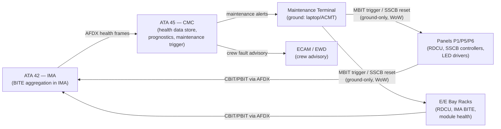
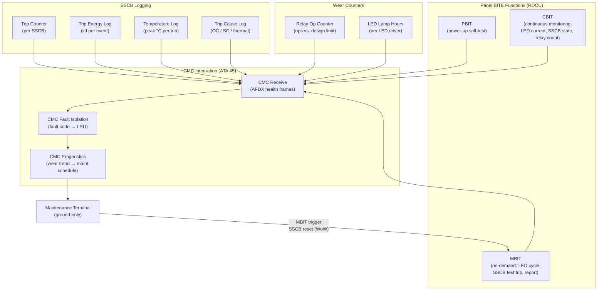
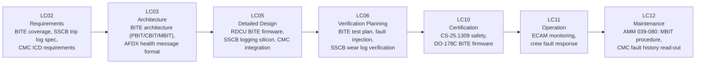

# 039-080 — Panel Monitoring, Diagnostics, and Control Interfaces
### AMPEL360e eWTW · ATA 39 · Q+ATLANTIDE ATLAS Scaffold

**Status:**   
**Revision:** 0.1.0 — 2026-05-10  
**Classification:** Q-AIR Primary | Q-MECHANICS / Q-DATAGOV / Q-HPC / Q-GROUND / Q-INDUSTRY Support

---

## §0 Hyperlink Policy

All cross-references use relative Markdown links. Regulatory references cited by identifier. DMC cross-references follow `DMC-AMPEL360E-EWTW-039-80-YYYY-A`. Badge  marks unresolved parameters. Badges  and  indicate work-in-progress and planned content.

---

## §1 Purpose

This document describes **Panel Monitoring, Diagnostics, and Control Interfaces** (subsubject 039-080) of the AMPEL360e eWTW. It covers:

1. Panel BITE: continuity test, backlight sensor, SSCB trip log.
2. CMC integration (ATA 45): AFDX pathway from panel RDCU to CMC.
3. Maintenance terminal interface: SSCB reset (ground-only), backlight brightness setting, CB group status interrogation.
4. Fault isolation philosophy: fault localised to panel level, then LRU level.
5. SSCB wear prognostics: trip count, energy per trip, temperature exceedance logging.
6. Relay / contactor contact wear monitoring: operation count vs. design limit.
7. LED lamp hours: LED driver accumulated ON-time logging.

---

## §2 Applicability

| Item | Value |
|---|---|
| Aircraft Programme | AMPEL360e eWTW |
| Variant | All variants |
| ATA Chapter / Subsubject | 39 — 039-080 Panel Monitoring, Diagnostics, and Control Interfaces |
| Document Tier | Level 3 — Component/Assembly Description |
| Effectivity | MSN 0001 onwards  |

Covers BITE architecture for all ATA 39 panels and modules; interface to ATA 45 CMC; and maintenance terminal operations. Excludes:
- IMA software BITE (→ ATA 42)
- CMC software architecture (→ ATA 45)
- Display unit self-test (→ 039-060 / ATA 31)

---

## §3 System/Function Overview

### 3.1 Panel BITE Architecture

Each panel zone and equipment rack provides built-in test functions at three levels:

| BITE Level | Scope | Trigger | Output |
|---|---|---|---|
| Power-up BIT (PBIT) | Hardware and LED drivers; SSCB comms check | At power application | Pass/fail to RDCU; displayed on ECAM TBD |
| Continuous BIT (CBIT) | Ongoing monitoring: LED current, SSCB trip state, relay coil current, AFDX link | Continuous in operation | Health data on AFDX → CMC |
| Maintenance BIT (MBIT) | Full test on demand: LED cycle, SSCB test trip, relay test actuation | Triggered via maintenance terminal | Detailed fault report to maintenance terminal |

### 3.2 CMC Integration (ATA 45)

The CMC (Central Maintenance Computer) receives health reports from all ATA 39 panels via:
- **AFDX**: panel RDCU health data → AFDX switch → IMA → AFDX → CMC.
- Health data format: ARINC 664 / AFDX frame (content per ICD TBD).
- CMC stores: fault codes, trip events, wear counters, lamp-hours.
- CMC provides: fault history; scheduled maintenance triggers; prognostic alerts.

### 3.3 Maintenance Terminal

The maintenance terminal is a ground-based tool (dedicated Laptop/DLMT or ACMT — ATA 45 TBD) connected via:
- **Ethernet / AFDX maintenance port** at aircraft ground test connector.
- Provides access to panel MBIT, SSCB reset, LED brightness calibration, CB status.
- SSCB reset via maintenance terminal is **ground-only** (weight-on-wheels interlock TBD).

### 3.4 SSCB Wear Prognostics

SSCB prognostic monitoring tracks:

| Parameter | Threshold | Action |
|---|---|---|
| Trip count | Manufacturer limit TBD (e.g., ≥ 100 trips TBD) | Maintenance alert; schedule inspection |
| Energy per trip (kJ TBD) | High-energy trip log: > TBD kJ | Immediate flag; accelerated inspection TBD |
| Case temperature exceedance | > T_max (TBD °C) | Log event; advisory to CMC |
| Last trip cause | Short circuit / overcurrent / thermal | Included in trip log for fault isolation |
| Days since last reset | For wear trending | Trend analysis in CMC |

---

## §4 Scope

### 4.1 In-Scope

- Panel BITE hardware and firmware (PBIT / CBIT / MBIT)
- RDCU BITE outputs on AFDX to CMC
- Maintenance terminal interface protocols (AFDX / Ethernet maintenance port)
- SSCB trip log (count, energy, temperature, cause)
- Relay/contactor operation counter
- LED driver lamp-hour counter
- Fault isolation to panel / LRU level
- CMC health message formats (TBD per ICD)

### 4.2 Out-of-Scope

- CMC software architecture (→ ATA 45)
- ACMT / laptop tool software (→ ATA 45 ground support)
- IMA BITE (→ ATA 42)
- Display unit BITE (→ 039-060 / ATA 31)
- Engine / propulsion BITE (→ ATA 71/80)

---

## §5 Architecture Description

### 5.1 BITE Data Flow

```
[Panel RDCU / SSCB controller]
    │ CBIT data (LED current, trip log, relay count, LED hours)
    ▼
[AFDX Switch]
    │
    ▼
[IMA R1/R2 — BITE aggregation function]
    │ AFDX
    ▼
[CMC (ATA 45)]
    │ Ethernet / AFDX maintenance port
    ▼
[Maintenance Terminal (ground)]
```

### 5.2 MBIT Test Sequence (Panel)

1. Maintenance terminal triggers MBIT for a specific panel or module.
2. RDCU executes LED cycle test (all LEDs: OFF → Green → Amber → OFF).
3. RDCU executes SSCB MBIT: test trip (low-current trip only TBD) and reset.
4. RDCU reads all SSCB trip logs, relay counts, LED hours.
5. RDCU compiles MBIT report and sends to maintenance terminal via AFDX / CMC.
6. Maintenance terminal displays pass/fail per test item; technician signs off.

### 5.3 Fault Isolation Philosophy

| Step | Action | Output |
|---|---|---|
| 1 | CBIT alert triggers fault code on ECAM / CMC | Fault code + panel/function identifier |
| 2 | Technician accesses maintenance terminal; reads fault code | Fault code → isolates to panel level |
| 3 | MBIT triggered on faulted panel | More detailed fault identifier |
| 4 | Fault isolated to LRU (RDCU, SSCB, relay, LED driver) | Line replaceable unit identified |
| 5 | LRU replaced on-wing | Verified by MBIT re-run |

---

## §6 Functional Breakdown

| ID | Function | Component | Interface | Status |
|---|---|---|---|---|
| 039-080-F01 | Power-up BITE (PBIT) | Panel RDCU | Internal; report on AFDX |  |
| 039-080-F02 | Continuous BITE (CBIT) | Panel RDCU, SSCB controller | AFDX → CMC |  |
| 039-080-F03 | Maintenance BITE (MBIT) | Panel RDCU + maintenance terminal | AFDX maint port |  |
| 039-080-F04 | SSCB trip log | SSCB internal logging | AFDX → CMC |  |
| 039-080-F05 | Relay operation counter | RDCU counter per relay | AFDX → CMC |  |
| 039-080-F06 | LED lamp-hour counter | RDCU/LED driver counter | AFDX → CMC |  |
| 039-080-F07 | SSCB remote reset (ground) | Maintenance terminal | WoW-interlocked; AFDX |  |
| 039-080-F08 | Panel fault isolation | RDCU + CMC FI algorithm | CMC → maintenance terminal |  |
| 039-080-F09 | LED brightness calibration (ground) | Maintenance terminal | AFDX → RDCU LED driver |  |
| 039-080-F10 | SSCB wear prognostics | CMC prognostic function | CMC → maintenance schedule |  |

---

## §7 System Context Diagram



---

## §8 Internal Functional Architecture



---

## §9 Lifecycle Traceability



---

## §10 Interfaces

| Interface | Direction | Counterpart | Signal Type | Notes |
|---|---|---|---|---|
| CBIT health data | Out | ATA 45 CMC via ATA 42 IMA | AFDX | Continuous health frames |
| MBIT trigger | In | Maintenance terminal (via CMC / maint port) | AFDX maintenance port | Ground-only; WoW interlock |
| SSCB trip log | Out | CMC ATA 45 | AFDX | SSCB trip count, energy, temp, cause |
| Relay counter | Out | CMC ATA 45 | AFDX | Op count per relay/contactor |
| LED lamp hours | Out | CMC ATA 45 | AFDX | Accumulated ON time per LED driver |
| SSCB remote reset | In | Maintenance terminal | AFDX maintenance port | Ground-only; WoW interlock |
| LED brightness set | In | Maintenance terminal | AFDX maintenance port | Calibration at ground; read/write |
| Fault advisory | Out | ECAM / EWD (via IMA) | AFDX | "PANEL FAULT" advisory to crew |
| CMC fault isolation report | Out | Maintenance terminal | AFDX / Ethernet maintenance | LRU-level fault isolation report |
| SSCB prognostic alert | Out | CMC → maint schedule | CMC | Wear threshold exceeded |

---

## §11 Operating Modes

| Mode | PBIT | CBIT | MBIT | Maintenance Terminal |
|---|---|---|---|---|
| Power-up (ground) | Runs automatically | Starts after PBIT pass | Available on request | Available: MBIT trigger, SSCB reset, LED set |
| Normal flight | N/A | Running continuously | Not available in flight | Not available |
| Abnormal / fault | N/A | Reports fault via AFDX → ECAM | Not available in flight | N/A |
| Post-flight (ground) | Available on power-up | Running | Available | Full access |
| Maintenance (dedicated) | Available | Running | Full MBIT available | Full access |

---

## §12 Monitoring and Diagnostics — Detailed Fault List

| Parameter | Monitor Source | AFDX Fault Code (TBD) | Alert | Isolation |
|---|---|---|---|---|
| LED open circuit | LED current < min | TBD | "PANEL LAMP FAULT" advisory | LED driver → IPBS legend |
| SSCB communications loss | RDCU CBIT | TBD | "CBP FAULT" advisory | RDCU → specific SSCB |
| SSCB trip count exceeded | SSCB trip counter | TBD | Maintenance advisory | Specific SSCB → schedule replacement |
| SSCB high-energy trip | Trip energy log | TBD | Maintenance advisory (elevated) | Specific SSCB → inspect circuit |
| SSCB thermal trip | Trip cause = thermal | TBD | Maintenance advisory | Specific SSCB + downstream load |
| Relay contact wear | Op counter > design limit | TBD | Maintenance advisory | Specific relay/contactor → schedule replacement |
| LED lamp hours exceeded | Lamp-hour counter > design limit | TBD | Maintenance advisory | Specific LED driver → schedule replacement |
| AFDX link down (panel) | AFDX switch port down | TBD | "PANEL COMM FAULT" advisory | Harness → RDCU → AFDX switch |
| RDCU power supply fault | RDCU PBIT | TBD | "RDCU FAULT" advisory | RDCU → CBP branch |
| Display BITE fault | Display PBIT | TBD | "DISPLAY FAULT" advisory | Specific display unit |

---

## §13 Maintenance Concept

### 13.1 BITE Access Procedure

1. Aircraft on ground; weight-on-wheels confirmed.
2. Maintenance terminal connected at ground test connector.
3. Technician logs in via maintenance terminal (authentication TBD).
4. Select aircraft → ATA 39 → Panel diagnostics menu.
5. Read CBIT health report (all panels, current status).
6. Read CMC fault history (ATA 45 CMC access TBD).
7. Trigger MBIT for specific panel as required.
8. Review MBIT report; identify faulty LRU.
9. Perform SSCB reset if required (authorised after fault investigation).

### 13.2 Maintenance Intervals

| Task | Interval | Method |
|---|---|---|
| CMC ATA 39 fault history read | A-check  | Maintenance terminal auto-read |
| SSCB trip log review | A-check TBD | Maintenance terminal |
| Relay operation count review | C-check TBD | CMC prognostic report |
| LED lamp-hour review | C-check TBD | CMC prognostic report |
| Full panel MBIT | C-check TBD | Maintenance terminal |

---

## §14 S1000D/CSDB Mapping

| Document | DMC Pattern | Info Code | Status |
|---|---|---|---|
| Panel monitoring / diagnostics description | DMC-AMPEL360E-EWTW-039-80-00A-040A-A | 040 |  |
| MBIT procedure | DMC-AMPEL360E-EWTW-039-80-10A-300A-A | 300 |  |
| SSCB trip log read | DMC-AMPEL360E-EWTW-039-80-20A-300A-A | 300 |  |
| SSCB remote reset | DMC-AMPEL360E-EWTW-039-80-30A-520A-A | 520 |  |
| Fault isolation — panel | DMC-AMPEL360E-EWTW-039-80-00A-400A-A | 400 |  |
| CMC integration description | DMC-AMPEL360E-EWTW-039-80-40A-040A-A | 040 |  |

Full DMRL in [039-090](./039-090-S1000D-CSDB-Mapping-and-Traceability.md).

---

## §15 Footprints

| Parameter | Value |
|---|---|
| BITE coverage (panels) | ≥ TBD % functional coverage | 
| SSCB trip log capacity | TBD events per SSCB (non-volatile memory) |
| Relay op counter capacity | TBD (≥ 10× design limit) |
| LED lamp-hour precision | ±1 hour TBD |
| CMC health frame period |  (est. 1 Hz CBIT frame) |
| Maintenance terminal access | Ethernet / AFDX maintenance port; aircraft nose gear bay TBD |
| SSCB reset authorisation | Ground-only; WoW interlock (TBD signal source) |
| BITE firmware DAL |  (DAL C or D per FHA TBD) |

---

## §16 Safety and Certification

| Requirement | Standard | Application |
|---|---|---|
| BITE design assurance | CS-25.1309 | BITE shall not cause or mask safety-critical faults |
| BITE firmware | DO-178C | BITE software DAL per function (C or D TBD) |
| CMC integration | DO-160G | CMC and BITE hardware environmental qualification |
| SSCB ground-only reset | CS-25.1309 / safety analysis | WoW interlock ensures no in-flight SSCB reset |
| Privacy / access | Programme policy | Maintenance terminal authentication required |
| Data integrity | AFDX CRC / health frame CRC | Fault code delivery verified |
| BITE vs. safety function isolation | CS-25.1309 | MBIT shall not affect live system in flight |

---

## §17 Verification and Validation

| Test | Method | Acceptance Criterion | Status |
|---|---|---|---|
| PBIT functional test | Power-on; verify PBIT pass/fail report | All expected pass/fail consistent with hardware state |  |
| CBIT health frame test | Inject known fault (LED open); verify AFDX health frame | Correct fault code reported in AFDX frame |  |
| MBIT LED cycle test | Trigger MBIT; observe LEDs via instrument | LEDs cycle green/amber/off in sequence |  |
| SSCB trip log test | Force test trip; read log via maintenance terminal | Trip count, energy, cause correctly logged |  |
| SSCB remote reset test | Ground: reset via maintenance terminal; confirm reset | SSCB reset; in-flight reset attempt blocked by WoW |  |
| Relay counter test | Actuate relay N times; read counter | Counter = N |  |
| LED lamp-hour test | Energise LED for T hours; read counter | Counter = T ± tolerance |  |
| CMC fault history test | Inject 10 faults; read CMC history | All 10 faults in CMC history with correct codes |  |
| Fault isolation test | Single LRU fault; verify isolation to LRU level | Fault report names correct LRU; no ambiguity |  |
| BITE isolation (no dispatch interference) | MBIT on powered system in flight simulation | MBIT does not disturb live load management |  |

---

## §18 Glossary

| Term | Definition |
|---|---|
| BITE | Built-In Test Equipment — integrated hardware and firmware performing automatic fault detection |
| PBIT | Power-up BIT — self-test at power application; determines equipment serviceable before first use |
| CBIT | Continuous BIT — ongoing background monitoring of key parameters during normal operation |
| MBIT | Maintenance BIT — on-demand detailed test triggered by maintenance personnel |
| CMC | Central Maintenance Computer — aircraft-level computer collecting and processing fault data from all systems (ATA 45) |
| SSCB | Solid-State Circuit Breaker — electronic CB with programmable trip characteristics and BITE logging |
| Trip log | Non-volatile record of each SSCB trip: count, energy, temperature, cause |
| Trip count | Number of trips experienced by an SSCB; tracked for wear prognostics |
| Trip energy | Energy dissipated in SSCB at trip (joules); high energy indicates severe fault |
| Relay op counter | Count of relay actuations; compared to design life limit for prognostics |
| LED lamp hours | Accumulated operating hours of LED; compared to rated lifetime for scheduled replacement |
| WoW interlock | Weight-on-Wheels interlock — prevents certain actions (e.g., SSCB reset) when aircraft is airborne |
| Maintenance terminal | Ground-based tool (laptop or ACMT) used to access aircraft diagnostic and maintenance functions |
| ACMT | Aircraft Condition Monitoring Terminal — ground tool for accessing CMC data and MBIT |
| Fault isolation | Process of identifying the specific LRU responsible for a reported fault |
| DLMT | Data Link Maintenance Terminal — portable laptop tool with AFDX/Ethernet connection |
| FHA | Functional Hazard Assessment — safety assessment determining DAL for BITE firmware |

---

## §19 Citations

1. EASA CS-25.1309 — System safety.
2. RTCA/EUROCAE DO-178C — Software assurance for BITE firmware.
3. RTCA/EUROCAE DO-160G — Environmental qualification.
4. ATA iSpec 2200 — Maintenance documentation standard.
5. ATA 45 CMC Specification (TBD per programme).
6. ARINC 664 Part 7 — AFDX specification.
7. Q+ATLANTIDE ATLAS [039-000 General](./039-000-Electrical-Electronic-Panels-and-Multipurpose-Components-General.md).
8. Q+ATLANTIDE ATLAS [039-020 Circuit Breaker Panels](./039-020-Circuit-Breaker-and-Protection-Panels.md).
9. Q+ATLANTIDE ATLAS [039-030 Relay and Distribution Panels](./039-030-Relay-Contactor-and-Power-Distribution-Panels.md).
10. Q+ATLANTIDE ATLAS [039-090 S1000D/CSDB Mapping](./039-090-S1000D-CSDB-Mapping-and-Traceability.md).

---

## §20 References

| Ref | Document | Notes |
|---|---|---|
| [R1] | CS-25.1309 | System safety — BITE shall not cause or mask faults |
| [R2] | DO-178C | BITE firmware software assurance |
| [R3] | DO-160G | Environmental qualification for CMC/BITE hardware |
| [R4] | ATA iSpec 2200 | Maintenance data module standard |
| [R5] | ATA 45 (CMC) ATLAS | CMC architecture and ICD |
| [R6] | ATA 42 (IMA) ATLAS | IMA BITE aggregation function |
| [R7] | ATA 39 — 039-020 | SSCB and CBP architecture |
| [R8] | ATA 39 — 039-030 | Relay and PDU architecture |
| [R9] | ARINC 664 Part 7 | AFDX used for BITE data transport |
| [R10] | Programme FHA (TBD) | BITE firmware DAL determination |

---

## §21 Open Issues

| ID | Description | Owner | Status |
|---|---|---|---|
| OI-039-081 | SSCB trip energy measurement resolution and logging capacity TBD | Q-AIR / Q-MECHANICS |  |
| OI-039-082 | SSCB trip count design limit (manufacturer data required) | Q-MECHANICS |  |
| OI-039-083 | WoW interlock signal source for SSCB ground-only reset | Q-AIR |  |
| OI-039-084 | Maintenance terminal authentication method TBD | Q-DATAGOV / ORB-LEG |  |
| OI-039-085 | CMC health message ICD (AFDX frame format) — pending CMC supplier selection | Q-AIR / Q-DATAGOV |  |
| OI-039-086 | BITE firmware DAL — pending FHA completion | Q-AIR |  |

---

## §22 Change Log

| Revision | Date | Author | Description |
|---|---|---|---|
| 0.1.0 | 2026-05-10 | Q+ATLANTIDE ATLAS Working Group | Initial full-template draft; all 23 sections populated; eWTW BITE and diagnostics context incorporated |
| 0.0.0 | 2026-05-10 | Q+ATLANTIDE ATLAS Working Group | Scaffold stub created |
