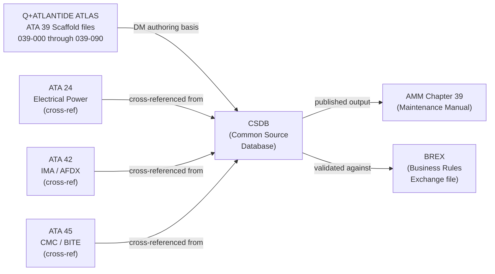
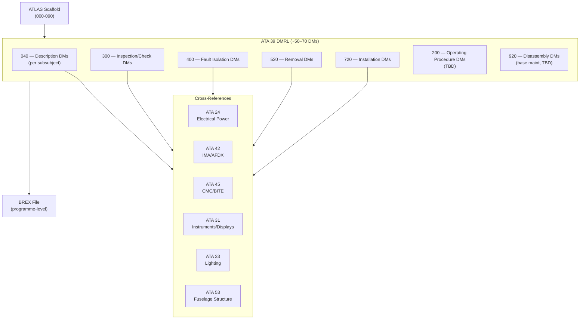
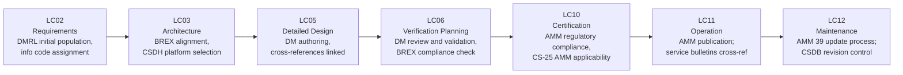

# 039-090 — S1000D/CSDB Mapping and Traceability
### <PROGRAMME> · ATA 39 · Q+ATLANTIDE ATLAS Scaffold

**Status:**   
**Revision:** 0.1.0 — 2026-05-10  
**Classification:** Q-AIR Primary | Q-MECHANICS / Q-DATAGOV / Q-HPC / Q-GROUND / Q-INDUSTRY Support

---

## §0 Hyperlink Policy

All cross-references use relative Markdown links. Regulatory references cited by identifier. DMC cross-references follow `DMC-<MODEL>-<SYSTEMDIFF>-039-90-YYYY-A`. Badge  marks unresolved parameters. Badges  and  indicate work-in-progress and planned content.

---

## §1 Purpose

This document is the **S1000D/CSDB Mapping and Traceability master** for ATA 39 (039-000 through 039-090) of the <PROGRAMME>. It provides:

1. Full DMRL (Data Module Requirements List) for all 10 subsubjects.
2. Data Module Code (DMC) structure and information code mapping.
3. AMM chapter cross-references (ATA 39 AMM structure).
4. Cross-references to ATA 24 (Electrical Power), ATA 42 (IMA), and ATA 45 (CMC).
5. BREX (Business Rules Exchange) status.
6. DMRL freeze status.
7. Estimated data module count (~50–70 DMs).

---

> **Agnostic standard.** This file defines the S1000D/CSDB mapping rule for this ATLAS node. It does not instantiate programme-specific DMCs, model identifiers, or system-difference codes. Programme-specific content belongs in the programme implementation branch.

## §2 Applicability

| Item | Value |
|---|---|
| Aircraft Programme | <PROGRAMME> |
| Variant | All variants |
| ATA Chapter / Subsubject | 39 — 039-090 S1000D/CSDB Mapping |
| Document Tier | Level 3 — CSDB/DMRL Traceability |
| Effectivity | MSN 0001 onwards  |

This document governs CSDB mapping for all ATA 39 subsubjects 000–080.

---

## §3 S1000D Framework for ATA 39

### 3.1 DMC Structure

Data Module Codes for the <PROGRAMME> ATA 39 follow the structure:

```
DMC-<MODEL>-<SYSTEMDIFF>-039-{SS}-{VARIANT}{SEQ}-{InfoCode}-{Variant}
```

Where:
- `039` = ATA Chapter 39
- `{SS}` = subsubject code (00–90, two digits)
- `{VARIANT}` = variant letter (A = all, B = specific variant TBD)
- `{SEQ}` = sequence within subsubject (00–99)
- `{InfoCode}` = S1000D information code (see §3.2)
- `{Variant}` = language variant (A = English)

Example: `DMC-<MODEL>-<SYSTEMDIFF>-039-20-00A-040A-A`

### 3.2 Information Codes Used in ATA 39

| Info Code | Type | Content |
|---|---|---|
| 040 | Description | Functional / system description |
| 200 | Procedure | Operating procedure |
| 300 | Inspection / check | Scheduled maintenance check |
| 400 | Fault isolation | Fault isolation procedure |
| 520 | Removal | Line replaceable unit removal |
| 720 | Installation | Line replaceable unit installation |
| 920 | Disassembly | Component disassembly (base maintenance) |

### 3.3 BREX Status

| BREX Item | Status |
|---|---|
| BREX file agreed with programme |  |
| BREX validation of DMs | Not yet performed |
| CSDB platform |  |
| Publication planned | AMM chapter 39 TBD |

---

## §4 Scope

This document covers the complete DMRL for ATA 39 subsubjects 000–090. Out of scope:
- Content within individual data modules (→ individual 039-NNN files and future DM authoring)
- ATA 24 DMRLs (→ ATA 24 mapping document TBD)
- ATA 42 DMRLs (→ ATA 42 mapping document TBD)
- ATA 45 DMRLs (→ ATA 45 mapping document TBD)

---

## §5 Architecture Description

### 5.1 DMRL Summary by Subsubject

| Subsubject | Title | Est. DM Count | DMRL Status |
|---|---|---|---|
| 039-000 | General | 5–7 |  |
| 039-010 | Control Panels and Switching Assemblies | 5–8 |  |
| 039-020 | Circuit Breaker and Protection Panels | 6–9 |  |
| 039-030 | Relay, Contactor, and Power Distribution Panels | 6–8 |  |
| 039-040 | Avionics and Electronic Equipment Racks | 5–8 |  |
| 039-050 | Multipurpose Component Modules | 5–7 |  |
| 039-060 | Panel Indication, Lighting, and HMI | 5–8 |  |
| 039-070 | Panel Wiring, Connectors, and Installation Interfaces | 6–8 |  |
| 039-080 | Panel Monitoring, Diagnostics, and Control Interfaces | 6–9 |  |
| 039-090 | S1000D/CSDB Mapping and Traceability | 1–2 |  |
| **Total** | | **~50–70 DMs** | |

---

## §6 Full DMRL — ATA 39

### 6.1 039-000 General

| DMC | Info Code | Title | Status |
|---|---|---|---|
| DMC-<MODEL>-<SYSTEMDIFF>-039-00-00A-040A-A | 040 | ATA 39 general description — system overview |  |
| DMC-<MODEL>-<SYSTEMDIFF>-039-00-10A-040A-A | 040 | ATA 39 document hierarchy and applicability |  |
| DMC-<MODEL>-<SYSTEMDIFF>-039-00-20A-300A-A | 300 | General maintenance inspection — ATA 39 panels |  |
| DMC-<MODEL>-<SYSTEMDIFF>-039-00-30A-400A-A | 400 | ATA 39 general fault isolation procedure |  |
| DMC-<MODEL>-<SYSTEMDIFF>-039-00-40A-200A-A | 200 | Panel master bus reset operating procedure |  |

### 6.2 039-010 Control Panels and Switching Assemblies

| DMC | Info Code | Title | Status |
|---|---|---|---|
| DMC-<MODEL>-<SYSTEMDIFF>-039-10-00A-040A-A | 040 | Control panels description — OHP, P5, P1 switching |  |
| DMC-<MODEL>-<SYSTEMDIFF>-039-10-10A-520A-A | 520 | IPBS removal — overhead panel P6 |  |
| DMC-<MODEL>-<SYSTEMDIFF>-039-10-10A-720A-A | 720 | IPBS installation — overhead panel P6 |  |
| DMC-<MODEL>-<SYSTEMDIFF>-039-10-20A-520A-A | 520 | RDCU removal — cockpit zone |  |
| DMC-<MODEL>-<SYSTEMDIFF>-039-10-20A-720A-A | 720 | RDCU installation — cockpit zone |  |
| DMC-<MODEL>-<SYSTEMDIFF>-039-10-00A-400A-A | 400 | Fault isolation — control panels and switching |  |
| DMC-<MODEL>-<SYSTEMDIFF>-039-10-00A-300A-A | 300 | IPBS function check |  |

### 6.3 039-020 Circuit Breaker and Protection Panels

| DMC | Info Code | Title | Status |
|---|---|---|---|
| DMC-<MODEL>-<SYSTEMDIFF>-039-20-00A-040A-A | 040 | CBP description — CBP-1, CBP-2, CBP-3 |  |
| DMC-<MODEL>-<SYSTEMDIFF>-039-20-10A-520A-A | 520 | CBP-1 removal |  |
| DMC-<MODEL>-<SYSTEMDIFF>-039-20-10A-720A-A | 720 | CBP-1 installation |  |
| DMC-<MODEL>-<SYSTEMDIFF>-039-20-20A-520A-A | 520 | SSCB module removal (if applicable) |  |
| DMC-<MODEL>-<SYSTEMDIFF>-039-20-20A-720A-A | 720 | SSCB module installation (if applicable) |  |
| DMC-<MODEL>-<SYSTEMDIFF>-039-20-00A-400A-A | 400 | Fault isolation — circuit breaker panels |  |
| DMC-<MODEL>-<SYSTEMDIFF>-039-20-00A-300A-A | 300 | CB state inspection and trip count read |  |
| DMC-<MODEL>-<SYSTEMDIFF>-039-20-30A-300A-A | 300 | HVDC protection panel inspection TBD |  |

### 6.4 039-030 Relay, Contactor, and Power Distribution Panels

| DMC | Info Code | Title | Status |
|---|---|---|---|
| DMC-<MODEL>-<SYSTEMDIFF>-039-30-00A-040A-A | 040 | PDU description — PDU-1 through PDU-4; SSPC |  |
| DMC-<MODEL>-<SYSTEMDIFF>-039-30-10A-520A-A | 520 | PDU module removal |  |
| DMC-<MODEL>-<SYSTEMDIFF>-039-30-10A-720A-A | 720 | PDU module installation |  |
| DMC-<MODEL>-<SYSTEMDIFF>-039-30-20A-520A-A | 520 | BTC relay removal |  |
| DMC-<MODEL>-<SYSTEMDIFF>-039-30-20A-720A-A | 720 | BTC relay installation |  |
| DMC-<MODEL>-<SYSTEMDIFF>-039-30-00A-400A-A | 400 | Fault isolation — PDU / distribution panels |  |
| DMC-<MODEL>-<SYSTEMDIFF>-039-30-00A-300A-A | 300 | SSPC and relay operation count check |  |

### 6.5 039-040 Avionics and Electronic Equipment Racks

| DMC | Info Code | Title | Status |
|---|---|---|---|
| DMC-<MODEL>-<SYSTEMDIFF>-039-40-00A-040A-A | 040 | E/E bay rack description — R1, R2, R3, R4 |  |
| DMC-<MODEL>-<SYSTEMDIFF>-039-40-10A-520A-A | 520 | IMA cabinet LRU removal |  |
| DMC-<MODEL>-<SYSTEMDIFF>-039-40-10A-720A-A | 720 | IMA cabinet LRU installation |  |
| DMC-<MODEL>-<SYSTEMDIFF>-039-40-20A-520A-A | 520 | Rack shock mount removal |  |
| DMC-<MODEL>-<SYSTEMDIFF>-039-40-20A-720A-A | 720 | Rack shock mount installation |  |
| DMC-<MODEL>-<SYSTEMDIFF>-039-40-00A-300A-A | 300 | Rack cooling and ventilation inspection |  |
| DMC-<MODEL>-<SYSTEMDIFF>-039-40-00A-400A-A | 400 | Fault isolation — E/E bay racks |  |

### 6.6 039-050 Multipurpose Component Modules

| DMC | Info Code | Title | Status |
|---|---|---|---|
| DMC-<MODEL>-<SYSTEMDIFF>-039-50-00A-040A-A | 040 | Multipurpose module description — SCM, PSM, RDCU |  |
| DMC-<MODEL>-<SYSTEMDIFF>-039-50-10A-520A-A | 520 | SCM module removal |  |
| DMC-<MODEL>-<SYSTEMDIFF>-039-50-10A-720A-A | 720 | SCM module installation |  |
| DMC-<MODEL>-<SYSTEMDIFF>-039-50-20A-520A-A | 520 | RDCU module removal |  |
| DMC-<MODEL>-<SYSTEMDIFF>-039-50-20A-720A-A | 720 | RDCU module installation |  |
| DMC-<MODEL>-<SYSTEMDIFF>-039-50-00A-400A-A | 400 | Fault isolation — multipurpose modules |  |

### 6.7 039-060 Panel Indication, Lighting, and HMI

| DMC | Info Code | Title | Status |
|---|---|---|---|
| DMC-<MODEL>-<SYSTEMDIFF>-039-60-00A-040A-A | 040 | HMI and indication description |  |
| DMC-<MODEL>-<SYSTEMDIFF>-039-60-10A-520A-A | 520 | Display unit (PFD/MFD) removal |  |
| DMC-<MODEL>-<SYSTEMDIFF>-039-60-10A-720A-A | 720 | Display unit (PFD/MFD) installation |  |
| DMC-<MODEL>-<SYSTEMDIFF>-039-60-20A-520A-A | 520 | MCDU removal / installation |  |
| DMC-<MODEL>-<SYSTEMDIFF>-039-60-00A-300A-A | 300 | LED brightness and backlight check |  |
| DMC-<MODEL>-<SYSTEMDIFF>-039-60-00A-400A-A | 400 | Fault isolation — displays and HMI |  |
| DMC-<MODEL>-<SYSTEMDIFF>-039-60-30A-300A-A | 300 | Panel flood light check |  |

### 6.8 039-070 Panel Wiring, Connectors, and Installation Interfaces

| DMC | Info Code | Title | Status |
|---|---|---|---|
| DMC-<MODEL>-<SYSTEMDIFF>-039-70-00A-040A-A | 040 | Panel wiring and connectors description |  |
| DMC-<MODEL>-<SYSTEMDIFF>-039-70-10A-520A-A | 520 | Cockpit panel removal (P1/P5/P6) |  |
| DMC-<MODEL>-<SYSTEMDIFF>-039-70-10A-720A-A | 720 | Cockpit panel installation (P1/P5/P6) |  |
| DMC-<MODEL>-<SYSTEMDIFF>-039-70-20A-300A-A | 300 | Connector inspection — MIL-DTL-38999 |  |
| DMC-<MODEL>-<SYSTEMDIFF>-039-70-30A-300A-A | 300 | Bonding resistance check |  |
| DMC-<MODEL>-<SYSTEMDIFF>-039-70-00A-400A-A | 400 | Fault isolation — wiring and connectors |  |
| DMC-<MODEL>-<SYSTEMDIFF>-039-70-40A-300A-A | 300 | Harness continuity and insulation test |  |

### 6.9 039-080 Panel Monitoring, Diagnostics, and Control Interfaces

| DMC | Info Code | Title | Status |
|---|---|---|---|
| DMC-<MODEL>-<SYSTEMDIFF>-039-80-00A-040A-A | 040 | Panel monitoring and diagnostics description |  |
| DMC-<MODEL>-<SYSTEMDIFF>-039-80-10A-300A-A | 300 | MBIT procedure |  |
| DMC-<MODEL>-<SYSTEMDIFF>-039-80-20A-300A-A | 300 | SSCB trip log read via maintenance terminal |  |
| DMC-<MODEL>-<SYSTEMDIFF>-039-80-30A-520A-A | 520 | SSCB remote reset (ground-only) |  |
| DMC-<MODEL>-<SYSTEMDIFF>-039-80-00A-400A-A | 400 | Fault isolation — panel diagnostics |  |
| DMC-<MODEL>-<SYSTEMDIFF>-039-80-40A-040A-A | 040 | CMC integration — ATA 39 health data |  |
| DMC-<MODEL>-<SYSTEMDIFF>-039-80-50A-300A-A | 300 | Relay operation count review |  |

### 6.10 039-090 S1000D/CSDB Mapping

| DMC | Info Code | Title | Status |
|---|---|---|---|
| DMC-<MODEL>-<SYSTEMDIFF>-039-90-00A-040A-A | 040 | S1000D/CSDB mapping master — ATA 39 DMRL |  |
| DMC-<MODEL>-<SYSTEMDIFF>-039-90-10A-040A-A | 040 | Cross-reference index — ATA 39 to ATA 24/42/45 |  |

---

## §7 System Context Diagram



---

## §8 Internal Functional Architecture



---

## §9 Lifecycle Traceability



---

## §10 Interfaces

| Interface | Direction | Counterpart | Notes |
|---|---|---|---|
| CSDB import | In | ATLAS scaffold → CSDB authoring tool | ATLAS provides basis for DM content |
| BREX validation | Bi-directional | Programme BREX file | DMs validated against BREX |
| ATA 24 cross-reference | Out | ATA 24 AMM | Power supply references |
| ATA 42 cross-reference | Out | ATA 42 AMM | IMA / AFDX function references |
| ATA 45 cross-reference | Out | ATA 45 AMM | CMC / BITE references |
| AMM publication | Out | AMM Chapter 39 | Published from CSDB |
| Service Bulletin cross-reference | Out | SB system | TBD on change incorporation |

---

## §11 Operating Modes

Not applicable — this document is a CSDB traceability document, not an operational system.

---

## §12 Monitoring and Diagnostics

Not applicable — this is a documentation mapping document. DMRL status is tracked via revision control (§22 Change Log).

---

## §13 Maintenance Concept

### 13.1 DMRL Maintenance Process

1. Any design change to ATA 39 triggers DMRL review.
2. New LRU or new maintenance task → add DM to DMRL.
3. BREX validation run on all new DMs.
4. ATLAS scaffold updated to reflect DM status.
5. AMM revision raised if published DM is affected.

### 13.2 DMRL Freeze Process

| Milestone | DMRL Action |
|---|---|
| PDR (Preliminary Design Review) | Initial DMRL release  |
| CDR (Critical Design Review) | DMRL frozen for baseline DMs  |
| SOV (Start of Verification) | All DMs at draft; BREX validated  |
| EIS (Entry Into Service) | All DMs published to AMM  |

---

## §14 S1000D/CSDB Mapping

This document **is** the CSDB mapping document for ATA 39. The DMRL tables in §6 constitute the full DMRL.

Full DMRL in [039-090](./039-090-S1000D-CSDB-Mapping-and-Traceability.md). *(self-reference)*

---

## §15 Footprints

| Parameter | Value |
|---|---|
| Total estimated DMs | ~50–70 |
| DMs at status DRAFT | ~10 (040 description DMs) |
| DMs at To-Be-Completed | ~45–55 |
| DMs TBD (pending design freeze) | ~5–8 |
| Info codes used | 040, 200, 300, 400, 520, 720, 920 |
| BREX status |  (not yet validated) |
| CSDB platform |  |
| AMM chapter target | AMM Chapter 39 |

---

## §16 Safety and Certification

| Requirement | Standard | Application |
|---|---|---|
| AMM content and format | CS-25 Appendix H / EASA AMC 25.1529 | AMM must describe all maintenance tasks required for airworthiness |
| Data module accuracy | S1000D Issue 5.0 TBD | All DMs must accurately reflect aircraft design at publication |
| Maintenance data legality | EASA Part-66 / Part-145 | AMM must be sufficient for Part-145 approved organisation maintenance |
| CSDB data integrity | Programme quality system | DM revisions controlled and traceable |

---

## §17 Verification and Validation

| Test | Method | Acceptance Criterion | Status |
|---|---|---|---|
| BREX compliance | Automated BREX validation tool | All DMs pass BREX; zero errors |  |
| DMRL completeness review | DMRL cross-check vs. design document LRU list | All LRUs have removal/installation DMs |  |
| DM technical accuracy review | System expert review of each DM | DM content matches aircraft configuration |  |
| AMM applicability check | CS-25 Appendix H review | All required AMM tasks present |  |
| Cross-reference links | Hyperlink check tool | All cross-references valid |  |

---

## §18 Glossary

| Term | Definition |
|---|---|
| CSDB | Common Source Database — repository storing all S1000D data modules for an aircraft programme |
| DMC | Data Module Code — unique identifier for each S1000D data module |
| DMRL | Data Module Requirements List — master list of all required data modules for a system chapter |
| Info Code | S1000D information code classifying the type of data module content (e.g., 040 = description, 520 = removal) |
| BREX | Business Rules Exchange — file defining the authoring rules for a specific programme's S1000D data |
| AMM | Aircraft Maintenance Manual — regulatory maintenance document published from CSDB data modules |
| DM | Data Module — individual S1000D document unit within the CSDB |
| PDR | Preliminary Design Review — programme milestone |
| CDR | Critical Design Review — programme milestone |
| EIS | Entry Into Service — aircraft enters commercial operation |
| SOV | Start of Verification — verification phase commencement |
| Part-145 | EASA maintenance organisation approval regulation |
| Part-66 | EASA aircraft maintenance licence regulation |
| Cross-reference | Link between data modules of different ATA chapters |
| ATLAS scaffold | Q+ATLANTIDE design document (this file series) providing the basis for CSDB DM authoring |

---

## §19 Citations

1. S1000D Issue 5.0 (or applicable issue TBD) — International specification for technical publications.
2. ATA iSpec 2200 — Information Standards for Aviation Maintenance.
3. EASA CS-25 Appendix H — Instructions for Continued Airworthiness.
4. EASA AMC 25.1529 — AMM content requirements.
5. EASA Part-145 — Maintenance organisation requirements.
6. Q+ATLANTIDE ATLAS [039-000 General](./039-000-Electrical-Electronic-Panels-and-Multipurpose-Components-General.md).
7. Q+ATLANTIDE ATLAS [039-010](./039-010-Control-Panels-and-Switching-Assemblies.md) through [039-080](./039-080-Panel-Monitoring-Diagnostics-and-Control-Interfaces.md).
8. ATA 24 ATLAS TBD — Electrical Power mapping.
9. ATA 42 ATLAS TBD — IMA/AFDX mapping.
10. ATA 45 ATLAS TBD — CMC/BITE mapping.

---

## §20 References

| Ref | Document | Notes |
|---|---|---|
| [R1] | S1000D Issue 5.0 | International specification for technical publications |
| [R2] | ATA iSpec 2200 | Aviation maintenance data standards |
| [R3] | EASA CS-25 Appendix H | Instructions for continued airworthiness |
| [R4] | EASA AMC 25.1529 | AMM content requirements |
| [R5] | EASA Part-145 | Maintenance organisation |
| [R6] | Programme BREX file (TBD) | Programme-specific S1000D business rules |
| [R7] | ATA 39 — 039-000 through 039-080 | All ATA 39 subsubject ATLAS scaffold files |
| [R8] | ATA 24 AMM (TBD) | Electrical power cross-reference |
| [R9] | ATA 42 AMM (TBD) | IMA/AFDX cross-reference |
| [R10] | ATA 45 AMM (TBD) | CMC/BITE cross-reference |

---

## §21 Open Issues

| ID | Description | Owner | Status |
|---|---|---|---|
| OI-039-091 | S1000D issue version selection (4.2 vs. 5.0) for programme | Q-DATAGOV |  |
| OI-039-092 | CSDB platform selection (Flatirons, Mekon, other TBD) | Q-DATAGOV / ORB-PMO |  |
| OI-039-093 | BREX file development and agreement with programme partners | Q-DATAGOV |  |
| OI-039-094 | DMRL freeze milestone (PDR / CDR schedule TBD) | ORB-PMO |  |
| OI-039-095 | 920 (disassembly) DM requirement review — which LRUs need base-maint disassembly DMs | Q-MECHANICS |  |
| OI-039-096 | 200 (operating procedure) DM requirement review — which panel ops require separate DMs | Q-AIR |  |

---

## §22 Change Log

| Revision | Date | Author | Description |
|---|---|---|---|
| 0.1.0 | 2026-05-10 | Q+ATLANTIDE ATLAS Working Group | Initial full-template draft; full DMRL for 039-000 through 039-090; all 23 sections populated |
| 0.0.0 | 2026-05-10 | Q+ATLANTIDE ATLAS Working Group | Scaffold stub created |
