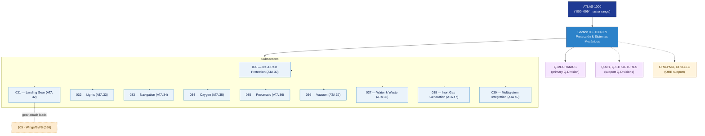

# ATLAS 030-039 · Section 03 — Protección & Sistemas Mecánicos

## 1. Purpose

Section-level index for *Protección & Sistemas Mecánicos* (`030-039`) within the ATLAS band. Protección hielo/lluvia, tren de aterrizaje, luces, navegación, oxígeno, neumática, agua/residuos e integración multisistema.

This section is part of the **ATLAS-1000** register, a subpart of the controlled **Q+ATLANTIDE** baseline[^baseline][^n001]. Bands classify technologies, Q-Divisions provide technical authority and ORB-Functions provide enterprise support[^n002].

## 2. Scope

- Aggregates the subsections within the `030-039` code range listed in §3.
- Inherits Q-Division authority and ORB support from the parent row in [`../README.md` §3](../README.md#3-architecture-table)[^archtable].
- Each subsection folder contains its own `README.md` (subsection index) and may contain Overview and subsubject documents.

## 3. Subsection Index

| Code | Title | Folder | Status |
|---:|---|---|---|
| `030` | Ice and Rain Protection | [`030_Ice-and-Rain-Protection/`](./030_Ice-and-Rain-Protection/) | active |
| `031` | Landing Gear | [`031_Landing-Gear/`](./031_Landing-Gear/) | active |
| `032` | Lights | [`032_Lights/`](./032_Lights/) | active |
| `033` | Navigation | [`033_Navigation/`](./033_Navigation/) | active |
| `034` | Oxygen | [`034_Oxygen/`](./034_Oxygen/) | active |
| `035` | Pneumatic | [`035_Pneumatic/`](./035_Pneumatic/) | active |
| `036` | Vacuum | [`036_Vacuum/`](./036_Vacuum/) | active |
| `037` | Water and Waste | [`037_Water-and-Waste/`](./037_Water-and-Waste/) | active |
| `038` | Inert Gas Generation | [`038_Inert-Gas-Generation/`](./038_Inert-Gas-Generation/) | active |
| `039` | Multisystem Integration | [`039_Multisystem-Integration/`](./039_Multisystem-Integration/) | active |

## 4. Interfaces Diagram

*Solid arrows show parent→section→subsection ownership and primary Q-Division authority; dotted arrows show support Q-Divisions, ORB enterprise support, and notable cross-section interfaces.*

## 5. Footprint

| Metric | Value |
|---|---|
| Architecture | `ATLAS` — Aircraft Top Level Architecture Schema/System (controlled term) |
| Master range | `000–099` |
| Code range | `030-039` |
| Section | `03` — Protección & Sistemas Mecánicos |
| Subsections | 10 populated |
| Primary Q-Division | Q-MECHANICS[^qdiv] |
| Support Q-Divisions | Q-AIR, Q-STRUCTURES |
| ORB support | ORB-PMO, ORB-LEG |
| Governance class | `baseline`[^gov] |
| Folder path | `Q+ATLANTIDE/000-099_ATLAS/030-039_Proteccion-y-Sistemas-Mecanicos/` |
| Document | `README.md` (this file) |
| Parent architecture | [`../README.md`](../README.md) |
| Parent baseline | [`organization/Q+ATLANTIDE.md`](../../../organization/Q+ATLANTIDE.md) |

## Governance

Governed by [`organization/Q+ATLANTIDE.md`](../../../organization/Q+ATLANTIDE.md)[^baseline]. All subsections under this section inherit `architecture_code = ATLAS`, `primary_q_division = Q-MECHANICS` and `governance_class = baseline` from this section header. Templates declared in this section must populate `architecture_band`, `architecture_code = ATLAS`, `q_division_owner` and `orb_function_support` per the Templates System[^templates]. The No-AAA Rule[^n004] applies.

## 6. References & Citations

[^baseline]: **Q+ATLANTIDE controlled baseline (v1.0.0)** — [`organization/Q+ATLANTIDE.md`](../../../organization/Q+ATLANTIDE.md). Defines the controlled `000-999` architecture-band taxonomy and the ATLAS-1000 register subpart.

[^archtable]: **§3 — Architecture Table (parent)** — [`../README.md` §3](../README.md#3-architecture-table). Source of authority for primary/support Q-Divisions and ORB support of this section.

[^qdiv]: **Q-Division authority** — [`organization/Q-Divisions/`](../../../organization/Q-Divisions/). Technical-authority units for the Q+ATLANTIDE baseline.

[^gov]: **Governance class** — `baseline` denotes documents under controlled change management within the Q+ATLANTIDE baseline.

[^templates]: **§5 — Templates System** — [`organization/Q+ATLANTIDE.md` §5](../../../organization/Q+ATLANTIDE.md#5-templates-system).

[^n001]: **Note N-001** — Q+ATLANTIDE (with its ATLAS-1000 register subpart) is a taxonomy and traceability ecosystem, not an organization chart. See [`organization/Q+ATLANTIDE.md` §4](../../../organization/Q+ATLANTIDE.md#4-notes).

[^n002]: **Note N-002** — Architecture bands classify technologies; Q-Divisions provide technical authority; ORB-Functions provide enterprise support. See [`organization/Q+ATLANTIDE.md` §4](../../../organization/Q+ATLANTIDE.md#4-notes).

[^n004]: **Note N-004 (No-AAA Rule)** — "AAA" is not a valid domain, division, architecture, interface or function in this baseline. See [`organization/Q+ATLANTIDE.md` §4](../../../organization/Q+ATLANTIDE.md#4-notes).
