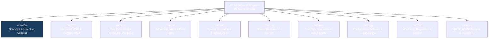
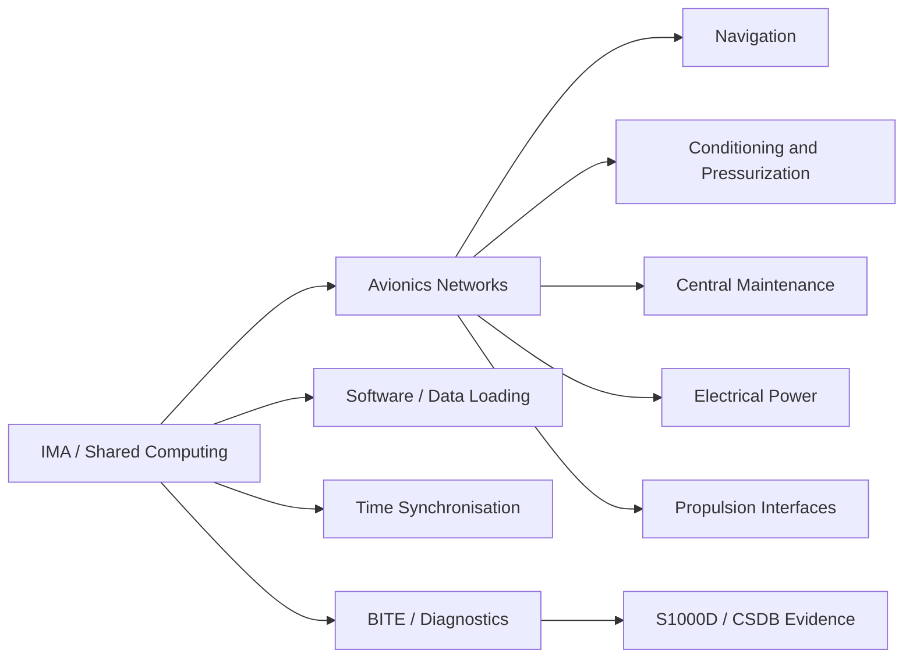
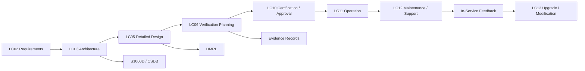

# ATLAS 040-049 · Section 04 · Subsection 040 · 000 — Multisystem General

## 0. Hyperlink Policy

All linkable content in this file shall be expressed as Markdown links where a stable target exists.

Use:

- relative links for repository-internal content;
- anchor links for headings, diagrams, glossary terms, citations, references, and footprint entries;
- stable external links only for public standards or authoritative sources;
- `TBD` where no stable target exists.

Do not invent links.

---

## 1. Purpose

This document establishes the general architectural description, scope boundary, and governing principles for the **[Multisystem](#glossary-multisystem)** subsection, **[ATLAS 040](./README.md)**, within the **[Q+ATLANTIDE](../../../../organization/Q+ATLANTIDE.md)** controlled baseline.

It provides the authoritative entry point for all subsubject documents within subsection **[040_Multisystem](./README.md)**, defining how cross-system avionics functions are structured, classified, and managed under the **[ATLAS](#glossary-atlas)** taxonomy.

The **[Multisystem](#glossary-multisystem)** concept recognises that modern aircraft avionics architectures are no longer composed only of isolated, federated black boxes. Instead, resources such as computing hardware, avionics data networks, power, cooling, timing references, configuration data, and diagnostic services are shared among multiple hosted applications through rigorously partitioned platforms.

This document anchors that conceptual shift within the **[ATLAS](../../../README.md)** framework and maps it to applicable industry standards and reference frameworks, including **[ATA iSpec 2200](#ref-ata-ispec-2200)**, **[ARINC 653](#ref-arinc-653)**, **[RTCA DO-178C](#ref-do-178c)**, **[RTCA DO-254](#ref-do-254)**, and **[S1000D](#ref-s1000d)**.

---

## 2. Applicability

| Applicability Item | Value |
|---|---|
| Architecture register | [Q+ATLANTIDE](../../../../organization/Q+ATLANTIDE.md) |
| ATLAS band | [000-099_ATLAS](../../../README.md) |
| ATA reference | [ATA iSpec 2200](#ref-ata-ispec-2200) |
| S1000D compatibility | [S1000D-CSDB-compatible](https://s1000d.org/) |
| Lifecycle use | LC03 Architecture Definition / LC05 Detailed Design / LC06 Verification Planning / LC11 Operation / LC12 Maintenance & Support |

---

## 3. System / Function Overview

The **[Multisystem](#glossary-multisystem)** node covers cross-functional avionics architecture elements shared across two or more aircraft systems or hosted functions.

For modern aircraft, the node addresses the shift from federated, single-function boxes to integrated platforms where computing resources, data networks, timing infrastructure, and diagnostic services are shared. Architecture drivers include weight reduction, volume efficiency, power savings, and simplified certification through consolidated hardware platforms governed by **[ARINC 653](#ref-arinc-653)** partitioning and **[DO-297](#ref-do-297)** IMA guidance.

This document does not freeze the final certified design. It establishes a controlled scaffold for downstream engineering, **[S1000D](#glossary-s1000d)** data-module planning, **[CSDB](#glossary-csdb)** integration, and evidence capture.

---

## 4. Scope

### 4.1 Included

- Controlled definition of the cross-system avionics architecture;
- **[Integrated Modular Avionics](#glossary-ima)** platforms hosting multiple avionics applications on shared computing resources;
- **[Avionics data networks](#glossary-avionics-data-network)** providing deterministic interconnectivity across subsystems;
- Shared services such as **[BITE](#glossary-bite)**, time synchronisation, bay-level power distribution, and configuration data loading;
- System integration and **[ICD](#glossary-icd)** management;
- Monitoring, diagnostics, and health-management aggregation across avionics domains;
- **[S1000D](#glossary-s1000d)** data-module and **[CSDB](#glossary-csdb)** traceability.

### 4.2 Excluded

- System-specific functions covered under dedicated ATLAS sections;
- Supplier-proprietary internal design data unless released to the programme baseline;
- Final certification compliance statements;
- Detailed maintenance procedures unless assigned by the [DMRL](#glossary-dmrl);
- Production-level configuration until CCB freeze.

---

## 5. Architecture Description

The **[Multisystem](#glossary-multisystem)** architecture is organised around controlled interfaces, deterministic function allocation, and maintainable component boundaries.

At architecture level, the system shall be described in terms of:

1. **Function** — what the system does.
2. **Equipment** — which [LRUs](#glossary-lru), assemblies, modules, or components implement the function.
3. **Interfaces** — how the system exchanges power, data, signal, or commands.
4. **Control logic** — how the system is commanded, monitored, degraded, isolated, or reset.
5. **Maintenance boundary** — what a technician can inspect, test, remove, install, or replace.
6. **Evidence boundary** — which requirements, tests, inspections, and records prove compliance.

---

## 6. Functional Breakdown

| Ref | Function | Description | Primary Interface |
|---:|---|---|---|
| [F-001](#f-001) | Shared Computing | Provides partitioned compute resources for multiple hosted avionics applications. | [040-010](./040-010-Integrated-Modular-Avionics-IMA.md) |
| [F-002](#f-002) | Avionics Networking | Supports deterministic data exchange across all avionics subsystems. | [040-030](./040-030-Avionics-Networks-and-Data-Buses.md) |
| [F-003](#f-003) | Shared Services | Delivers platform-level BITE, power, cooling, and timing services. | [040-050](./040-050-Shared-Avionics-Resources-and-Services.md) |
| [F-004](#f-004) | Monitoring | Captures status, failures, degradation, and maintenance data. | [040-080](./040-080-Multisystem-Monitoring-Diagnostics-and-Control-Interfaces.md) |
| [F-005](#f-005) | Traceability | Links architecture, requirements, evidence, and S1000D content. | [040-090](./040-090-S1000D-CSDB-Mapping-and-Traceability.md) |

---

## 7. Mermaid — Subsection Structure

***[Diagram 1](#diagram-subsection-structure) — Controlled subsection structure for [ATLAS 040 — Multisystem](./README.md). Related sections: [Functional Breakdown](#6-functional-breakdown), [Footprint](#15-footprints), and [References & Citations](#8-references--citations).***

---

## 8. Mermaid — Multisystem Context

***[Diagram 2](#diagram-multisystem-context) — Multisystem avionics context showing shared computing, networking, timing, software-loading, diagnostics, and CSDB evidence flow. Related sections: [Scope](#4-scope), [Architecture Principles](#architecture-principles), and [Glossary](#18-glossary).***

---

## 9. Mermaid — Lifecycle Traceability

***[Diagram 3](#diagram-lifecycle-traceability) — Lifecycle traceability from requirements to maintenance feedback. Related sections: [Verification and Validation](#17-verification-and-validation), [References](#20-references), [Open Issues](#21-open-issues).***

---

## 10. Interfaces

| Interface Type | Connected System | Description | Evidence Required |
|---|---|---|---|
| Data / control | [IMA / CMS / controller](./040-010-Integrated-Modular-Avionics-IMA.md) | Inter-system command and monitoring via AFDX/ARINC 664 and ARINC 429 buses. | ICD / data dictionary |
| Electrical power | [Electrical Power (023)](../../../020-029_Sistemas-Core-de-Aeronave/023_Electrical-Power/README.md) | 28 VDC / 115 VAC supply to IMA cabinets and avionics bays. | Wiring / load analysis |
| Mechanical | [Structure / avionics bay](TBD) | Rack mounting, cooling, access panels, bonding. | Installation drawing |
| Maintenance | [CSDB / IETP](./040-090-S1000D-CSDB-Mapping-and-Traceability.md) | Technician-facing BITE and CMC diagnostic interface. | [DMRL / BREX](#glossary-dmrl) |

---

## 11. Operating Modes

| Mode | Description | Entry Condition | Exit Condition |
|---|---|---|---|
| [Normal](#mode-normal) | All partitions and networks operating within nominal limits. | Aircraft powered and avionics enabled. | Shutdown, fault, or mode change. |
| [Degraded](#mode-degraded) | One or more shared resources operating at reduced capacity or failed; hosted applications continue via redundancy. | Fault detected or partial resource loss. | Recovery, isolation, or maintenance action. |
| [Maintenance](#mode-maintenance) | System configured for inspection, software load, test, or LRU exchange. | Authorized maintenance action. | Maintenance close-up and operational check. |
| [Failure / Safe State](#mode-failure-safe-state) | Shared platform enters protective isolation to prevent cascade failure. | Fault threshold exceeded. | Reset, repair, replacement, or dispatch decision. |

---

## 12. Monitoring and Diagnostics

The Multisystem shall provide sufficient monitoring to support safe operation, maintenance troubleshooting, and lifecycle evidence capture, including:

- Partition and resource health status;
- Network error counters (VL utilisation, latency, error frames);
- Power and thermal status of IMA cabinets;
- Time synchronisation accuracy and holdover status;
- Configuration and software load verification status;
- [BITE](#glossary-bite) results aggregated to [CMS](#glossary-cms);
- Maintenance messages routed through [ARINC 429](#ref-arinc-429) / [AFDX](#glossary-afdx) to the [Central Maintenance System](./040-080-Multisystem-Monitoring-Diagnostics-and-Control-Interfaces.md).

---

## 13. Maintenance Concept

Maintenance shall support modular inspection, fault isolation, LRU removal, installation, and return-to-service verification.

Content is structured around:

- avionics bay access requirements;
- safety precautions (power isolation, ESD, software load control);
- replacement boundaries (LRU / LRM level);
- functional and BITE verification after installation;
- controlled post-load configuration verification.

Maintenance procedures shall remain provisional until validated against the applicable [DMRL](#glossary-dmrl), [BREX](#glossary-brex), and task validation records.

---

## 14. S1000D / CSDB Mapping

| S1000D Element | Controlled Value |
|---|---|
| Model ident code | `[PROGRAMME-AIRCRAFT]` |
| System diff code | `[PROGRAMME-VARIANT]` |
| System code | `040` |
| Sub-system code | `0` |
| Sub-sub-system code | `00` |
| Assy code | `00A` |
| Info code | `040 / 300 / 400 / 520 / 720 / 941` |
| Item location code | `D` |
| DMC prefix | `DMC-<PROGRAMME>-<VARIANT>-040` |

### Recommended Data Module Set

| Info code | Data module purpose | Suggested filename |
|---:|---|---|
| [040](#dm-040) | Descriptive information | `DMC-<PROGRAMME>-<VARIANT>-040-000-00A-040A-D_System-Description.xml` |
| [300](#dm-300) | Examination / inspection / check | `DMC-<PROGRAMME>-<VARIANT>-040-000-00A-300A-D_Inspection.xml` |
| [400](#dm-400) | Fault isolation | `DMC-<PROGRAMME>-<VARIANT>-040-000-00A-400A-D_Fault-Isolation.xml` |
| [520](#dm-520) | Remove / disassemble | `DMC-<PROGRAMME>-<VARIANT>-040-000-00A-520A-D_Remove.xml` |
| [720](#dm-720) | Install / assemble / connect | `DMC-<PROGRAMME>-<VARIANT>-040-000-00A-720A-D_Install.xml` |
| [941](#dm-941) | Illustrated parts data | `DMC-<PROGRAMME>-<VARIANT>-040-000-00A-941A-D_Illustrated-Parts-Data.xml` |

---

## 15. Footprints

### 15.1 Physical Footprint

| Footprint Item | Description | Status |
|---|---|---|
| Installation zone | Avionics bay (forward / main equipment centre) |  |
| Access panels | Dedicated avionics bay access doors |  |
| Mounting provisions | ARINC 600 rack / cabinet provisions |  |
| Clearance envelope | Per LRU removal envelope |  |
| Cooling / ventilation | Forced-air cooling via avionics bay ventilation |  |
| Drainage / leak path | N/A (electronic equipment) | N/A |

### 15.2 Electrical / Data Footprint

| Footprint Item | Description | Status |
|---|---|---|
| Power supply | 28 VDC and 115 VAC from primary electrical buses |  |
| Protection | SSPCs / circuit breakers per electrical load analysis |  |
| Data buses | AFDX (ARINC 664), ARINC 429, discrete signals |  |
| Connectors | ARINC 600 Series I / MIL-C-38999 |  |
| Bonding / grounding | Avionics bay structural bonding per DO-160G Section 16 |  |
| EMC / EMI controls | Shielding, segregation, filtering per DO-160G |  |

### 15.3 Maintenance Footprint

| Footprint Item | Description | Status |
|---|---|---|
| Access level | Line / Base |  |
| Replaceable unit | LRU (cabinet level) / LRM (module level) |  |
| Removal time |  |  |
| Required tools | Standard avionics tools; ESD precautions |  |
| Required GSE | Avionics test set; data loader |  |
| Return-to-service check | BITE / operational check per applicable CMM |  |

### 15.4 Data Footprint

| Footprint Item | Description | Status |
|---|---|---|
| Configuration records | Part number, serial number, software load, effectivity |  |
| Evidence records | Test, inspection, compliance, review records |  |
| CSDB records | DMCs, ICNs, BREX, applicability |  |
| Maintenance data | Fault history, BITE, removal / installation records |  |
| Cybersecurity records | Access, load authorisation, integrity checks |  |

---

## 16. Safety and Certification Considerations

The Multisystem shared platform shall be assessed in terms of its aircraft-level failure effects and integration dependencies.

Considerations include:

- Common-cause failures in shared computing or networking resources;
- Partition containment failures (spatial or temporal);
- Loss of shared timing reference (timing integrity monitoring);
- Misleading diagnostic indication through shared BITE bus;
- Software and hardware assurance levels per [DO-178C](#ref-do-178c) / [DO-254](#ref-do-254);
- Environmental qualification per [DO-160G](#ref-do-160g);
- Electromagnetic compatibility.

Final safety classification shall remain  until reviewed against the applicable FHA, PSSA, SSA, and certification basis.

---

## 17. Verification and Validation

| Verification Method | Description | Evidence |
|---|---|---|
| [Analysis](#verification-analysis) | Partition analysis, timing analysis, FMEA, worst-case execution time. | Analysis report |
| [Inspection](#verification-inspection) | Physical and visual verification of installation, marking, routing. | Inspection record |
| [Test](#verification-test) | Functional, environmental, integration, and system test. | Test report |
| [Demonstration](#verification-demonstration) | Operational demonstration under controlled conditions. | Demonstration record |
| [Similarity](#verification-similarity) | Justified reuse of existing certified design evidence. | Similarity report |

---

## 18. Glossary

| Term / Acronym | Definition | Link |
|---|---|---|
| AFDX | Avionics Full-Duplex Switched Ethernet; deterministic switched Ethernet defined by ARINC 664 Part 7. | [ARINC 664](#ref-arinc-664) |
| ATLAS | Aircraft Top Level Architecture Schema/System — Q+ATLANTIDE taxonomic framework. | [ATLAS architecture](../../../README.md) |
| Avionics Data Network | Controlled aircraft data-network infrastructure supporting deterministic communication. | [040-030](./040-030-Avionics-Networks-and-Data-Buses.md) |
| BITE | Built-In Test Equipment; on-board self-test capability for fault detection, isolation, and reporting. | [040-080](./040-080-Multisystem-Monitoring-Diagnostics-and-Control-Interfaces.md) |
| BREX | Business Rules Exchange; S1000D rule set used to validate data-module content. | [040-090](./040-090-S1000D-CSDB-Mapping-and-Traceability.md) |
| CMS | Central Maintenance System; aircraft maintenance computer aggregating fault and diagnostic data. | [040-080](./040-080-Multisystem-Monitoring-Diagnostics-and-Control-Interfaces.md) |
| CSDB | Common Source DataBase; S1000D repository for controlled data modules. | [040-090](./040-090-S1000D-CSDB-Mapping-and-Traceability.md) |
| DMRL | Data Module Requirement List; controlled list of required S1000D data modules. | [040-090](./040-090-S1000D-CSDB-Mapping-and-Traceability.md) |
| ICD | Interface Control Document; formally managed interface specification between system elements. | [040-040](./040-040-System-Integration-and-Interface-Management.md) |
| IMA | Integrated Modular Avionics; shared, partitioned computing platform hosting multiple applications. | [040-010](./040-010-Integrated-Modular-Avionics-IMA.md) |
| LRU | Line-Replaceable Unit; modular assembly designed for rapid removal and replacement on the flight line. | [Maintenance Concept](#13-maintenance-concept) |
| Multisystem | Cross-functional aircraft architecture domain covering shared avionics resources, networks, timing, configuration, diagnostics, and traceability. | [040_Multisystem](./README.md) |
| Q+ATLANTIDE | Quantum and Aerospace Top-Level Architectures and Novel Technologies Identification Data Ecosystem. | [Parent baseline](../../../../organization/Q+ATLANTIDE.md) |
| S1000D | International specification for technical publications using a Common Source DataBase. | [S1000D reference](#ref-s1000d) |
| SNS | Standard Numbering System; hierarchical coding logic for aircraft system documentation. | [ATA iSpec 2200](#ref-ata-ispec-2200) |

---

## 19. Citations

| Ref | Citation | Use | Link |
|---|---|---|---|
| [CIT-001](#cit-001) | `ATA iSpec 2200, Edition 2022, Chapter 4.` | SNS logic and chapter numbering |  |
| [CIT-002](#cit-002) | `RTCA DO-297, Integrated Modular Avionics (IMA) Development Guidance and Certification Considerations, 2005.` | IMA architecture and certification |  |
| [CIT-003](#cit-003) | `ARINC 653, Avionics Application Software Standard Interface, Part 1–4.` | Partitioning and APEX interface |  |
| [CIT-004](#cit-004) | `RTCA DO-178C, Software Considerations in Airborne Systems, 2011.` | Software assurance levels |  |
| [CIT-005](#cit-005) | `RTCA DO-254, Design Assurance Guidance for Airborne Electronic Hardware, 2000.` | Hardware assurance levels |  |

---

## 20. References

| Ref | Document | Identifier | Revision | Status | Link |
|---|---|---:|---:|---|---|
| [REF-001](#ref-001) | Q+ATLANTIDE baseline | `QATL-ATLAS-000-099` |  | Draft | [Open](../../../../organization/Q+ATLANTIDE.md) |
| [REF-ATA-ISPEC-2200](#ref-ata-ispec-2200) | ATA iSpec 2200 | `ATA-ISPEC-2200` |  | External standard |  |
| [REF-ARINC-653](#ref-arinc-653) | ARINC 653 | `ARINC-653` |  | External standard |  |
| [REF-ARINC-664](#ref-arinc-664) | ARINC 664 / AFDX | `ARINC-664` |  | External standard |  |
| [REF-ARINC-429](#ref-arinc-429) | ARINC 429 | `ARINC-429` |  | External standard |  |
| [REF-DO-178C](#ref-do-178c) | RTCA DO-178C | `DO-178C` |  | External standard |  |
| [REF-DO-254](#ref-do-254) | RTCA DO-254 | `DO-254` |  | External standard |  |
| [REF-DO-297](#ref-do-297) | RTCA DO-297 | `DO-297` |  | External standard |  |
| [REF-DO-160G](#ref-do-160g) | RTCA DO-160G | `DO-160G` |  | External standard |  |
| [REF-MIL-STD-1553](#ref-mil-std-1553) | MIL-STD-1553 | `MIL-STD-1553` |  | External standard |  |
| [REF-S1000D](#ref-s1000d) | S1000D | `S1000D-ISS5` |  | External standard | [https://s1000d.org/](https://s1000d.org/) |
| [REF-GOV](#ref-gov) | Governance class — baseline | `QATL-GOV-BASELINE` |  | Controlled | [organization/Q+ATLANTIDE.md](../../../../organization/Q+ATLANTIDE.md) |

---

## 21. Open Issues

| ID | Issue | Owner | Status | Link |
|---|---|---|---|---|
| [OI-001](#oi-001) | Confirm whether ATLAS 040 and ATLAS 042 should remain separated between general multisystem and IMA-specific content. | Q-DATAGOV | Open | [Functional Breakdown](#6-functional-breakdown) |
| [OI-002](#oi-002) | Confirm final repository targets for external standards references. | ORB-LEG | Open | [References](#20-references) |
| [OI-003](#oi-003) | Confirm [PROGRAMME-AIRCRAFT]-specific applicability for hosted avionics functions. | Q-AIR | Open | [Scope](#4-scope) |
| [OI-004](#oi-004) | Confirm S1000D DMRL allocation for ATLAS 040 multisystem documents. | Q-DATAGOV | Open | [Glossary — DMRL](#glossary-dmrl) |

---

## 22. Change Log

| Version | Date | Author | Change | Link |
|---|---|---|---|---|
| [1.0.0](#chg-100) | 2026-05-09 | Q+ Team/Amedeo Pelliccia + AI | Initial active baseline for ATLAS 040-049 · 04.040.000 — Multisystem General. | [Document root](#atlas-040-049--section-04--subsection-040--000--multisystem-general) |

---

> Programme-controlled baseline. Content is subject to [Q+ATLANTIDE](../../../../organization/Q+ATLANTIDE.md), [Q-DATAGOV](../../../../organization/Q-Divisions/Q-DATAGOV.md), [S1000D / CSDB traceability](./040-090-S1000D-CSDB-Mapping-and-Traceability.md), and controlled change management before downstream programme release.

> **To be reviewed by system expert.**
