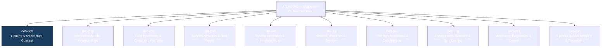

# ATLAS 040-049 · Section 04 · Subsection 040 · 000 — Multisystem General

## 1. Purpose

This document establishes the general architectural description, scope boundary, and governing principles for the **Multisystem** subsection (ATLAS 040) within the Q+ATLANTIDE controlled baseline. It provides the authoritative entry point for all subsubject documents within subsection 040, defining how cross-system avionics functions are structured, classified, and managed under the ATLAS taxonomy.

The Multisystem concept recognises that modern aircraft avionics architectures are no longer composed of isolated, federated black boxes. Instead, resources — computing hardware, data networks, power, cooling, and timing references — are shared among multiple hosted applications through rigorously partitioned platforms. This document anchors that conceptual shift within the ATLAS framework and maps it to applicable industry standards, including ATA iSpec 2200[^ref1], ARINC 653[^ref2], and RTCA DO-178C[^ref3].

## 2. Scope

The scope of ATLAS 040 — Multisystem encompasses all avionics system elements that are inherently cross-functional and shared across two or more aircraft systems or Line-Replaceable Units (LRUs). This includes, but is not limited to:

- **Integrated Modular Avionics (IMA)** platforms hosting multiple avionics applications on shared computing resources;
- **Avionics data networks** providing interconnectivity across subsystems (ARINC 664/AFDX, ARINC 429, MIL-STD-1553[^ref4]);
- **Shared services** such as Built-In Test Equipment (BITE), time synchronisation, power distribution at the avionics bay level, and configuration data loading;
- **System integration and interface management** protocols, including Interface Control Documents (ICDs) and integration verification strategies;
- **Monitoring, diagnostics, and health management** functions that aggregate status across multiple avionics domains;
- **Documentation traceability** infrastructure linking physical architecture to S1000D[^ref5] data modules and DO-178C/DO-254[^ref6] artefacts.

This subsection explicitly excludes system-specific functions covered under dedicated ATLAS sections (e.g., 021 for Air Data, 034 for Navigation). Where cross-system dependencies exist, those are captured through interface references.

## 3. Glossary

| Term / Acronym | Definition |
|---|---|
| **ATLAS** | Aircraft Top Level Architecture Schema/System — the Q+ATLANTIDE taxonomic framework governing avionics architecture classification. |
| **IMA** | Integrated Modular Avionics — a shared, partitioned computing platform hosting multiple avionics applications per ARINC 653. |
| **LRU** | Line-Replaceable Unit — a modular avionics assembly designed for rapid removal and replacement on the flight line. |
| **AFDX** | Avionics Full-Duplex Switched Ethernet — the deterministic switched Ethernet network defined by ARINC 664 Part 7. |
| **BITE** | Built-In Test Equipment — on-board self-test capability used for fault detection, isolation, and reporting. |
| **ICD** | Interface Control Document — a formally managed document specifying the electrical, logical, and data-protocol interface between two system elements. |
| **ATA iSpec 2200** | The ATA Specification 2200, governing information standards for aviation maintenance. |
| **SNS** | Standard Numbering System — the ATA-defined hierarchical code used to classify aircraft system, subsystem, and subject documentation. |
| **Q+ATLANTIDE** | The overarching taxonomy and traceability ecosystem within which ATLAS is registered as a controlled baseline. |

## 4. Diagram

## 5. Footprint

| Metric | Value |
|---|---|
| Architecture | `ATLAS` — Aircraft Top Level Architecture Schema/System (controlled term) |
| Master range | `000–099` |
| Code range | `040-049` |
| Section | `04` — Aviónica, Información & APU |
| Subsection | `040` — Multisystem |
| Subsubject | `000` — Multisystem General |
| Primary Q-Division | Q-DATAGOV[^qdiv] |
| Support Q-Divisions | Q-AIR, Q-SPACE, Q-HPC |
| ORB support | ORB-PMO, ORB-LEG |
| Governance class | `baseline`[^gov] |
| Folder path | `Q+ATLANTIDE/000-099_ATLAS/040-049_Avionica-Informacion-y-APU/040_Multisystem/` |
| Document | `040-000-Multisystem-General.md` (this file) |
| Parent subsection | [`README.md`](./README.md) |
| Parent section | [`../../README.md`](../../README.md) |
| Parent architecture | [`../../../README.md`](../../../README.md) |
| Parent baseline | [`organization/Q+ATLANTIDE.md`](../../../../organization/Q+ATLANTIDE.md) |

## 6. References & Citations

[^baseline]: **Q+ATLANTIDE controlled baseline (v1.0.0)** — [`organization/Q+ATLANTIDE.md`](../../../../organization/Q+ATLANTIDE.md).
[^qdiv]: **Q-Division authority** — [`organization/Q-Divisions/`](../../../../organization/Q-Divisions/).
[^gov]: **Governance class** — `baseline` denotes documents under controlled change management.
[^n001]: **Note N-001** — Q+ATLANTIDE is a taxonomy and traceability ecosystem. See [`organization/Q+ATLANTIDE.md` §4](../../../../organization/Q+ATLANTIDE.md#4-notes).
[^ref1]: **ATA iSpec 2200** — Information Standards for Aviation Maintenance, Air Transport Association of America. Defines SNS coding hierarchy used throughout ATLAS.
[^ref2]: **ARINC 653** — Avionics Application Software Standard Interface, defining time and space partitioning for IMA platforms.
[^ref3]: **RTCA DO-178C** — Software Considerations in Airborne Systems and Equipment Certification, the primary software assurance standard for civil avionics.
[^ref4]: **MIL-STD-1553** — Military Standard for Digital Time Division Command/Response Multiplex Data Bus, used in military and some civil avionics architectures.
[^ref5]: **S1000D Issue 5.0** — International specification for technical publications using a Common Source Database (CSDB).
[^ref6]: **RTCA DO-254** — Design Assurance Guidance for Airborne Electronic Hardware.
