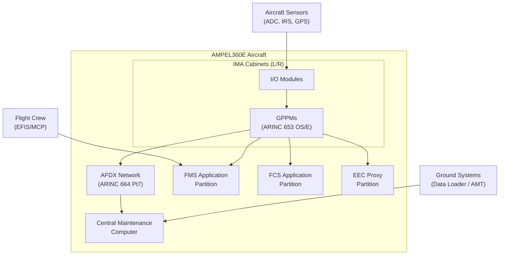
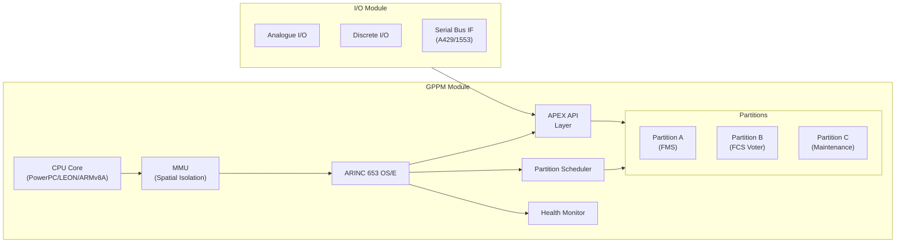
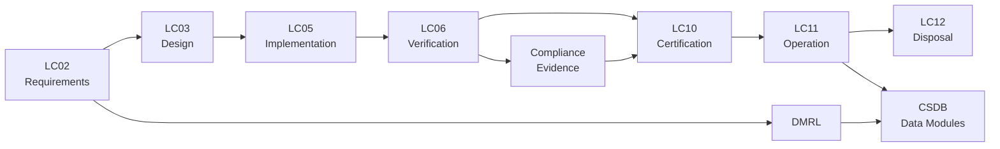

# ATLAS 040-049 · Section 04 · Subsection 040 · 010 — Integrated Modular Avionics IMA

## 0. Hyperlink Policy

All linkable content in this file shall be expressed as Markdown links where a stable target exists.
Use relative links for repository-internal content; anchor links for headings, diagrams, glossary terms, citations, references, and footprint entries.
Use `TBD` as placeholder where no stable target yet exists. External URLs are permitted only for normative standards bodies.
Parent context: [040-000 Multisystem General](./040-000-Multisystem-General.md).

---

## 1. Purpose

This document defines the Integrated Modular Avionics (IMA) platform architecture for the AMPEL360E aircraft within the ATLAS subsection 040. It establishes the principles of ARINC 653 time-space partitioning, the cabinet/module taxonomy, hosted application management, and the APEX API contract that enables multiple avionics applications to share common hardware resources with guaranteed isolation. This document is the primary reference for IMA platform architects, avionics software developers, and certification authorities.

---

## 2. Applicability

| Attribute | Value |
|-----------|-------|
| Aircraft Model | AMPEL360E (all variants) |
| ATA Reference | [ATA iSpec 2200](#ref-ata-ispec-2200) — Chapter 040 |
| Regulatory Framework | EASA CS-25, FAA 14 CFR Part 25 |
| Development Assurance | [DO-178C](#ref-do-178c), [DO-254](#ref-do-254), [DO-297](#ref-do-297) |
| Platform Standard | [ARINC 653](#ref-arinc-653) Part 1 Rev 4 |
| Applicability Code | All S/N unless superseded by service bulletin |

---

## 3. System / Function Overview

The IMA platform consolidates formerly federated avionics functions into shared computing cabinets (IMA Cabinets). Each cabinet hosts General-Purpose Processing Modules (GPPMs), I/O modules, power conditioning, and cooling. Applications execute within ARINC 653 partitions with guaranteed CPU time windows and memory segments. The Operating System/Executive (OS/E) enforces spatial and temporal isolation between partitions via the APEX API (ARINC 653 Part 1). DO-297 governs incremental certification of hosted applications and the IMA platform itself.

---

## 4. Scope

### 4.1 Included

- IMA Cabinet physical and logical architecture
- ARINC 653 partitioning model (spatial and temporal isolation)
- APEX API service definitions and partition scheduling
- Module types: GPPM, CPIOM, I/O modules (analogue, discrete, serial)
- DO-297 platform and hosted application certification boundaries
- Health monitoring at IMA OS/E level

### 4.2 Excluded

- Application software internal design (covered by individual system chapters)
- Network topology external to IMA cabinet (see [040-030](./040-030-Avionics-Networks-and-Data-Buses.md))
- Data loading procedures (see [040-070](./040-070-Configuration-Software-and-Data-Loading.md))
- BITE architecture above cabinet level (see [040-080](./040-080-Multisystem-Monitoring-Diagnostics-and-Control-Interfaces.md))

---

## 5. Architecture Description

The AMPEL360E IMA architecture is organised in three tiers:

1. **Platform Tier** — IMA Cabinets (IMA-CAB-L, IMA-CAB-R) hosting GPPMs and I/O modules, connected via AFDX network (see [040-030](./040-030-Avionics-Networks-and-Data-Buses.md)).
2. **Executive Tier** — ARINC 653-compliant OS/E per module, providing partition scheduler, health monitor, and APEX API.
3. **Application Tier** — Hosted applications (FMS, FCS, EEC proxy, maintenance) executing in isolated partitions with defined APEX port connections.

Redundancy is achieved by mirroring critical partitions across left and right cabinets. The IMA OS/E enforces a fixed Major Frame divided into Minor Frames; each partition receives an allocation guaranteed never to be preempted by another partition.

---

## 6. Functional Breakdown

| Function ID | Function Name | Description | Allocated To | DAL |
|-------------|---------------|-------------|-------------|-----|
| F-001 | Partition Scheduling | Time-slice CPU allocation per ARINC 653 schedule table | IMA OS/E | A |
| F-002 | Spatial Isolation | Memory Management Unit enforcement of partition address spaces | GPPM hardware + OS/E | A |
| F-003 | APEX Port Management | Queuing/sampling port creation, send, receive via APEX API | IMA OS/E | A |
| F-004 | Health Monitoring | Module-level fault detection, logging, partition restart | IMA OS/E HM | B |
| F-005 | I/O Service | Physical signal conditioning and bus interface to hosted applications | I/O Modules + OS/E drivers | B |
| F-006 | Configuration Management | Loading and activation of Partition Configuration Table (PCT) | OS/E loader | B |
| F-007 | Inter-Partition Communication | Intra-cabinet IPC via APEX sampling/queuing ports | IMA OS/E | A |

---

## 7. Mermaid — System Context Diagram

---

## 8. Mermaid — Internal Functional Architecture

---

## 9. Mermaid — Lifecycle Traceability

---

## 10. Interfaces

| Interface ID | From | To | Protocol / Standard | Direction | Notes |
|-------------|------|----|---------------------|-----------|-------|
| IF-010-01 | IMA OS/E | Hosted Application | APEX API (ARINC 653) | Bidirectional | Partition lifecycle and port services |
| IF-010-02 | IMA Cabinet | AFDX Network | ARINC 664 Part 7 | Bidirectional | Via AFDX end-system in GPPM |
| IF-010-03 | I/O Module | Aircraft Sensors/Actuators | Analogue/Discrete/ARINC 429 | Bidirectional | Conditioned by IOM |
| IF-010-04 | IMA OS/E | CMC | ARINC 429 / AFDX | Output | BITE and health data |
| IF-010-05 | Data Loader | IMA Cabinet | ARINC 615A / Ethernet | Input | Software and configuration loading |
| IF-010-06 | IMA Cabinet | Aircraft Power Bus | 28 VDC / 115 VAC | Input | Primary and secondary power feeds |

---

## 11. Operating Modes

| Mode | Description | Trigger | System Response |
|------|-------------|---------|-----------------|
| Normal | All partitions active per schedule table; full redundancy available | Nominal power-up and BIT pass | All hosted applications operational |
| Degraded | One or more partitions suspended due to fault; failover to redundant module | HM detects partition fault | Reduced capacity; alerts to CMC and crew |
| Maintenance | OS/E boots in maintenance partition only; data loading active | Ground crew command via AMT | Hosted applications suspended |
| Failure/Safe State | Cabinet inoperative; cross-side cabinet assumes load | Hardware failure detected by HM | Cross-side take-over; CAS advisory displayed |

---

## 12. Monitoring and Diagnostics

The IMA Health Monitor (HM) operates at three levels:
- **Partition level**: watchdog timer per partition; action table defines recovery (restart, reboot, module reset).
- **Module level**: Built-In Test Equipment (BITE) per GPPM and IOM; continuous self-test of memory, CPU, and bus interfaces.
- **Cabinet level**: Supervisory processor aggregates module health; reports to [CMC via AFDX](./040-080-Multisystem-Monitoring-Diagnostics-and-Control-Interfaces.md).

Fault logs are stored in non-volatile memory and are retrievable via [ARINC 615A data download](./040-070-Configuration-Software-and-Data-Loading.md).

---

## 13. Maintenance Concept

| Task | Interval | Access | Tooling |
|------|----------|--------|---------|
| BITE initiated self-test | Power-up | Automatic | None |
| Module replacement (LRU) | On condition | LRU extraction handle | Standard avionics tools |
| Software/data loading | On demand | Avionics Maintenance Terminal | ARINC 615A loader |
| Configuration audit | Per maintenance cycle | AMT / CMC download | Ground support equipment |
| Cooling filter inspection | 500 FH | Cabinet access panel | Visual inspection |

---

## 14. S1000D / CSDB Mapping

| Document Type | Data Module Code (DMC) | Info Code | Title |
|---------------|----------------------|-----------|-------|
| System Description | DMC-AMPEL360E-EWTW-040-010-00A-040A-A | 040 | IMA System Description |
| Maintenance Procedures | DMC-AMPEL360E-EWTW-040-010-00A-300A-A | 300 | IMA Fault Isolation Procedures |
| BITE/Test | DMC-AMPEL360E-EWTW-040-010-00A-400A-A | 400 | IMA BITE and Test Procedures |
| Wiring Data | DMC-AMPEL360E-EWTW-040-010-00A-520A-A | 520 | IMA Wiring and Connector Data |
| IPD | DMC-AMPEL360E-EWTW-040-010-00A-941A-A | 941 | IMA Illustrated Parts Data |
| Software Desc | DMC-AMPEL360E-EWTW-040-010-00A-720A-A | 720 | IMA Software Description |

### Recommended Data Module Set

| Info Code | Publication | Applicability |
|-----------|-------------|---------------|
| 040 | AMM — System Description | All variants |
| 300 | FIM — Fault Isolation | All variants |
| 400 | TSM — BITE Procedures | All variants |
| 520 | AMM — Wiring Data | All variants |
| 720 | SRM — Software Description | All variants |
| 941 | IPD — Parts Data | All variants |

---

## 15. Footprints

### 15.1 Physical

| Item | Dimension (mm) | Mass (kg) | Location |
|------|---------------|-----------|----------|
| IMA Cabinet Left (IMA-CAB-L) | 600 × 200 × 400 | 18.5 | E/E Bay — Forward Left |
| IMA Cabinet Right (IMA-CAB-R) | 600 × 200 × 400 | 18.5 | E/E Bay — Forward Right |
| GPPM Module | 222 × 194 × 25 | 1.2 | Within IMA Cabinet |
| I/O Module | 222 × 194 × 25 | 0.9 | Within IMA Cabinet |

### 15.2 Electrical / Data

| Interface | Standard | Bandwidth / Power |
|-----------|----------|-------------------|
| Primary Power | 28 VDC MIL-STD-704F | 400 W per cabinet |
| Secondary Power | 115 VAC 400 Hz | 200 VA per cabinet |
| AFDX | ARINC 664 Part 7 | 100 Mbps full-duplex |
| ARINC 429 I/O | ARINC 429 | 100 kbps per channel |

### 15.3 Maintenance

| Task | Man-Hours | Skill Level | Access |
|------|-----------|-------------|--------|
| GPPM LRU swap | 0.5 | Avionics technician | E/E Bay |
| Cabinet removal | 2.0 | Avionics technician | E/E Bay |
| Software load (full) | 1.0 | Avionics technician | AMT |

### 15.4 Data

| Data Item | Volume | Storage | Retention |
|-----------|--------|---------|-----------|
| Fault logs (NVM) | 64 MB | Non-volatile flash | 500 FH rolling |
| Partition Configuration Table | 2 MB | Protected NVM | Permanent until update |
| BITE raw data | 128 MB | NVM + CSDB | Per data loading cycle |

---

## 16. Safety and Certification Considerations

- IMA platform certified to [DO-297](#ref-do-297) as a reusable platform; hosted applications certified incrementally.
- Spatial isolation verified by [DO-254](#ref-do-254) hardware analysis and MMU testing.
- Temporal isolation verified by worst-case execution time (WCET) analysis per [DO-178C](#ref-do-178c) §6.
- Common-mode failure analysis per [SAE ARP4761](#ref-arp4761) required for shared resources.
- EASA AMC 25.1309 and FAA AC 25.1309-1A compliance required for DAL A partitions.
- Independence between OS/E and hosted applications must be demonstrated per [DO-297](#ref-do-297) Appendix B.

---

## 17. Verification and Validation

| V&V ID | Requirement | Method | Success Criteria | Status |
|--------|-------------|--------|-----------------|--------|
| VV-010-01 | Partition temporal isolation | WCET analysis + bench test | No partition exceeds allocated time window | TBD |
| VV-010-02 | Partition spatial isolation | MMU boundary test | No cross-partition memory access | TBD |
| VV-010-03 | HM fault detection | Fault injection test | All injected faults detected within 100 ms | TBD |
| VV-010-04 | Power cycling | Bench test | Clean restart within 60 s; no data corruption | TBD |
| VV-010-05 | Environmental compliance | DO-160G lab test | Pass all applicable sections | TBD |

---

## 18. Glossary

| Term/Acronym | Definition | Link |
|-------------|-----------|------|
| IMA | Integrated Modular Avionics — shared computing platform hosting multiple avionics functions | [§3](#3-system--function-overview) |
| ARINC 653 | Avionics Application Software Standard Interface defining time-space partitioning and APEX API | [§5](#5-architecture-description) |
| APEX | Application Executive — ARINC 653 API providing partition services (ports, time, health) | [§6](#6-functional-breakdown) |
| GPPM | General-Purpose Processing Module — primary compute module within IMA cabinet | [§5](#5-architecture-description) |
| CPIOM | Core Processing and I/O Module — integrated compute and I/O module variant | [040-020](./040-020-Core-Processing-and-Computing-Platforms.md) |
| MMU | Memory Management Unit — hardware enforcer of spatial isolation between partitions | [§6](#6-functional-breakdown) |
| HM | Health Monitor — OS/E subsystem detecting and recovering from partition faults | [§12](#12-monitoring-and-diagnostics) |
| PCT | Partition Configuration Table — ARINC 653 configuration data defining schedule and partition attributes | [§6](#6-functional-breakdown) |
| DAL | Design Assurance Level — rigor of development process per DO-178C/DO-254 (A=highest) | [§16](#16-safety-and-certification-considerations) |
| BITE | Built-In Test Equipment — hardware and software for in-situ fault detection | [§12](#12-monitoring-and-diagnostics) |
| LRU | Line Replaceable Unit — modular avionics unit replaceable at line maintenance | [§13](#13-maintenance-concept) |
| WCET | Worst-Case Execution Time — maximum time a software task can consume; used for scheduling proof | [§16](#16-safety-and-certification-considerations) |

---

## 19. Citations

| Ref | Citation | Use | Link |
|-----|---------|-----|------|
| DO-297 | RTCA DO-297 — Integrated Modular Avionics Development Guidance and Certification Considerations | IMA platform certification | TBD |
| ARINC 653 | ARINC 653 Part 1 Rev 4 — Avionics Application Software Standard Interface | APEX API and partitioning | TBD |
| DO-178C | RTCA DO-178C — Software Considerations in Airborne Systems and Equipment Certification | Software DAL | TBD |
| DO-254 | RTCA DO-254 — Design Assurance Guidance for Airborne Electronic Hardware | Hardware DAL | TBD |
| SAE ARP4761 | SAE ARP4761 — Guidelines for Conducting the Safety Assessment Process | Safety assessment | TBD |
| GOV | Q+ATLANTIDE Governance Framework | Document governance | [Q+ATLANTIDE.md](../../../../organization/Q+ATLANTIDE.md) |
| S1000D | S1000D Issue 5.0 — International Specification for Technical Publications | CSDB mapping | TBD |
| ATA iSpec 2200 | ATA iSpec 2200 — Information Standards for Aviation Maintenance | ATA chapter alignment | TBD |

---

## 20. References

| Ref | Document | Identifier | Revision | Status | Link |
|-----|---------|-----------|---------|--------|------|
| REF-010-01 | Multisystem General | QATL-ATLAS-1000-ATLAS-040-049-04-040-000 | 1.0.0 | Active | [040-000](./040-000-Multisystem-General.md) |
| REF-010-02 | Core Processing Platforms | QATL-ATLAS-1000-ATLAS-040-049-04-040-020 | 1.0.0 | Active | [040-020](./040-020-Core-Processing-and-Computing-Platforms.md) |
| REF-010-03 | Avionics Networks | QATL-ATLAS-1000-ATLAS-040-049-04-040-030 | 1.0.0 | Active | [040-030](./040-030-Avionics-Networks-and-Data-Buses.md) |
| REF-010-04 | RTCA DO-297 | DO-297 | Current | Normative | TBD |
| REF-010-05 | ARINC 653 Part 1 | ARINC 653-1 | Rev 4 | Normative | TBD |
| REF-010-06 | RTCA DO-178C | DO-178C | Current | Normative | TBD |

---

## 21. Open Issues

| ID | Issue | Owner | Status | Link |
|----|-------|-------|--------|------|
| OI-010-01 | GPPM processor family selection (PowerPC vs ARMv8A) pending hardware trade study | Q-HPC | Open | TBD |
| OI-010-02 | WCET analysis methodology to be agreed with EASA during Phase 1 review | Q-AIR | Open | TBD |
| OI-010-03 | DO-297 supplement for quantum-enhanced processing modules under development | Q-DATAGOV | Open | TBD |

---

## 22. Change Log

| Version | Date | Author | Change | Link |
|---------|------|--------|--------|------|
| 1.0.0 | 2026-05-09 | Q-DATAGOV / Copilot | Initial creation with full 22-section template | TBD |
