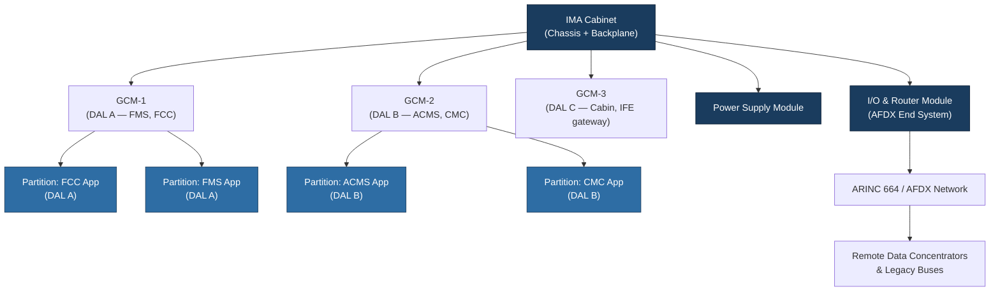

# ATLAS 040-049 · Section 04 · Subsection 040 · 010 — Integrated Modular Avionics IMA

## 1. Purpose

This document describes the **Integrated Modular Avionics (IMA)** architecture as applied within the ATLAS 040 Multisystem framework. It defines the principles of hosted application management, shared computing resource allocation, and time-space partitioning as mandated by ARINC 653[^ref1] and as certified under RTCA DO-178C[^ref2] and DO-254[^ref3] design assurance levels.

IMA represents the paradigm shift from the traditional federated avionics architecture — where each function resided in its own dedicated hardware — to a consolidated, multi-application computing environment. Within the Q+ATLANTIDE baseline, IMA is treated as a cross-cutting, multisystem-level function because the IMA platform simultaneously supports applications belonging to multiple ATA chapters.

## 2. Scope

This document covers IMA concepts as they apply within the Multisystem (ATLAS 040) context:

- Definition of the IMA cabinet, chassis, and Generic Computing Module (GCM) layer;
- ARINC 653 partitioning framework: time partitions (major/minor frames), spatial memory isolation, and health monitoring;
- Hosted application inventory structure and application-to-partition mapping;
- Resource budget allocation (CPU cycles, memory pages, I/O channel assignment);
- IMA certification strategy and the relationship between platform-level and application-level Design Assurance Levels (DALs);
- Integration with ARINC 664/AFDX[^ref4] for inter-partition and inter-system communication;
- Redundancy management across IMA cabinets (active/standby, cross-channel data links).

System-specific hosted applications (e.g., Flight Management, Air Data Reference) are documented in their respective ATLAS sections but reference this document for the IMA hosting context.

## 3. Glossary

| Term / Acronym | Definition |
|---|---|
| **IMA** | Integrated Modular Avionics — a shared, partitioned computing environment hosting multiple avionics applications on common hardware. |
| **ARINC 653** | Avionics Application Software Standard Interface — defines the APEX API and time/space partitioning for IMA operating environments. |
| **GCM** | Generic Computing Module — a standardised processing board forming the computational core of an IMA cabinet. |
| **DAL** | Design Assurance Level — the rigour level (A–E) assigned to software and hardware development per DO-178C/DO-254. |
| **Partition** | An isolated execution environment within an IMA operating system, providing deterministic CPU time and protected memory. |
| **APEX** | Application Executive — the ARINC 653-defined API through which hosted application software interfaces with the IMA operating system. |
| **Major Frame** | The highest-level scheduling cycle in ARINC 653, within which all partitions receive their allocated CPU time windows. |
| **CDLMU** | Configuration Data Loading and Management Unit — the IMA module responsible for receiving and distributing software and configuration data. |
| **Health Monitor** | An ARINC 653 system-level entity that detects partition faults and initiates recovery actions per a predefined fault containment strategy. |

## 4. Diagram

## 5. Footprint

| Metric | Value |
|---|---|
| Architecture | `ATLAS` — Aircraft Top Level Architecture Schema/System (controlled term) |
| Master range | `000–099` |
| Code range | `040-049` |
| Section | `04` — Aviónica, Información & APU |
| Subsection | `040` — Multisystem |
| Subsubject | `010` — Integrated Modular Avionics IMA |
| Primary Q-Division | Q-DATAGOV[^qdiv] |
| Support Q-Divisions | Q-AIR, Q-SPACE, Q-HPC |
| ORB support | ORB-PMO, ORB-LEG |
| Governance class | `baseline`[^gov] |
| Folder path | `Q+ATLANTIDE/000-099_ATLAS/040-049_Avionica-Informacion-y-APU/040_Multisystem/` |
| Document | `040-010-Integrated-Modular-Avionics-IMA.md` (this file) |
| Parent subsection | [`README.md`](./README.md) |
| Parent section | [`../../README.md`](../../README.md) |
| Parent architecture | [`../../../README.md`](../../../README.md) |
| Parent baseline | [`organization/Q+ATLANTIDE.md`](../../../../organization/Q+ATLANTIDE.md) |

## 6. References & Citations

[^baseline]: **Q+ATLANTIDE controlled baseline (v1.0.0)** — [`organization/Q+ATLANTIDE.md`](../../../../organization/Q+ATLANTIDE.md).
[^qdiv]: **Q-Division authority** — [`organization/Q-Divisions/`](../../../../organization/Q-Divisions/).
[^gov]: **Governance class** — `baseline` denotes documents under controlled change management.
[^n001]: **Note N-001** — Q+ATLANTIDE is a taxonomy and traceability ecosystem. See [`organization/Q+ATLANTIDE.md` §4](../../../../organization/Q+ATLANTIDE.md#4-notes).
[^ref1]: **ARINC 653** — Avionics Application Software Standard Interface, Part 1 (Required Services). Airlines Electronic Engineering Committee (AEEC). Defines the APEX API, time and space partitioning model used in all IMA-compliant operating systems.
[^ref2]: **RTCA DO-178C / EUROCAE ED-12C** — Software Considerations in Airborne Systems and Equipment Certification. Governs software DAL assignment and verification for all IMA-hosted applications.
[^ref3]: **RTCA DO-254 / EUROCAE ED-80** — Design Assurance Guidance for Airborne Electronic Hardware. Governs hardware DAL assignment for GCMs, I/O modules, and chassis backplanes.
[^ref4]: **ARINC 664 Part 7** — Aircraft Data Network, Avionics Full-Duplex Switched Ethernet (AFDX). Defines the deterministic Ethernet network used for IMA inter-partition and inter-system communication.
[^ref5]: **ATA iSpec 2200** — Information Standards for Aviation Maintenance. Provides the SNS coding structure mapping IMA documentation to chapter 40.
[^ref6]: **RTCA DO-297** — Integrated Modular Avionics (IMA) Development Guidance and Certification Considerations. Primary guidance document for IMA platform and hosted application certification.
