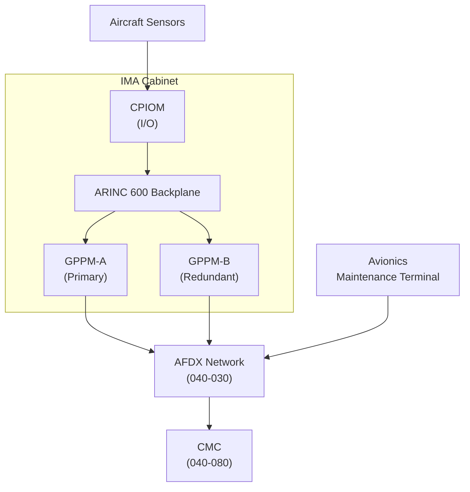
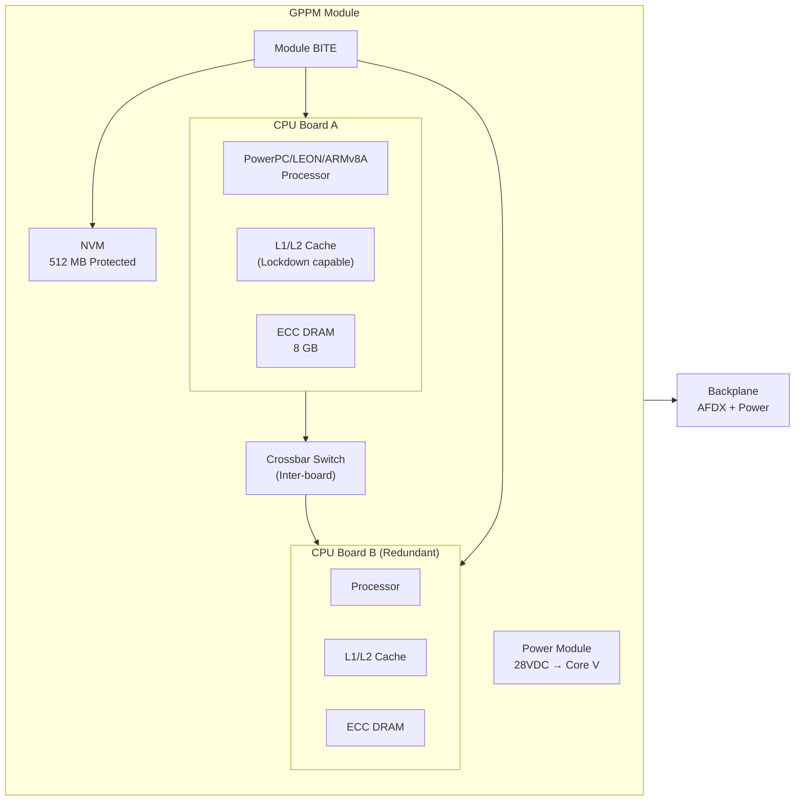
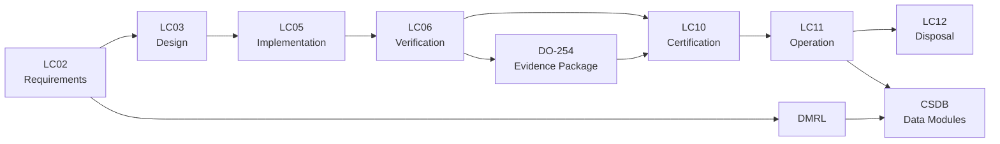

# ATLAS 040-049 · Section 04 · Subsection 040 · 020 — Core Processing and Computing Platforms

## 0. Hyperlink Policy

All linkable content in this file shall be expressed as Markdown links where a stable target exists.
Use relative links for repository-internal content; anchor links for headings, diagrams, glossary terms, citations, references, and footprint entries.
Use `TBD` as placeholder where no stable target yet exists.
Parent context: [040-000 Multisystem General](./040-000-Multisystem-General.md) | IMA Platform: [040-010](./040-010-Integrated-Modular-Avionics-IMA.md).

---

## 1. Purpose

This document describes the core processing and computing platforms used within the AMPEL360E IMA architecture. It covers GPPM and CPIOM module hardware design, processor architectures (PowerPC, LEON, ARMv8A), memory hierarchy, hardware redundancy schemes (dual/triple), DO-254 hardware assurance requirements, and BITE per module. It serves as the hardware design reference for avionics engineers, hardware assurance leads, and certification authorities.

---

## 2. Applicability

| Attribute | Value |
|-----------|-------|
| Aircraft Model | AMPEL360E (all variants) |
| ATA Reference | [ATA iSpec 2200](#ref-ata-ispec-2200) — Chapter 040 |
| Regulatory Framework | EASA CS-25, FAA 14 CFR Part 25 |
| Development Assurance | [DO-254](#ref-do-254) (hardware), [DO-178C](#ref-do-178c) (software) |
| Environmental Standard | [DO-160G](#ref-do-160g) |
| Applicability Code | All S/N unless superseded by service bulletin |

---

## 3. System / Function Overview

The GPPM (General-Purpose Processing Module) and CPIOM (Core Processing and I/O Module) are the primary compute elements of the IMA platform. GPPMs host ARINC 653 partitions; CPIOMs integrate I/O termination with processing. Both module families share a common form factor (ARINC 600 MCM) and backplane interface. Processor options include radiation-tolerant PowerPC e500mc, LEON4FT (SPARC V8), and ARMv8A cores. Memory hierarchy consists of L1/L2 cache, DRAM (ECC), and NVM (protected flash). Redundancy is implemented as dual-duplex or triple-modular redundancy (TMR) depending on DAL.

---

## 4. Scope

### 4.1 Included

- GPPM and CPIOM module hardware architecture
- Processor families and selection rationale
- Memory hierarchy (L1/L2, DRAM-ECC, NVM)
- Dual-duplex and TMR redundancy architectures
- DO-254 hardware assurance levels and processes
- Module-level BITE (continuous and initiated)
- Backplane and connector standards

### 4.2 Excluded

- ARINC 653 OS/E and APEX API (see [040-010](./040-010-Integrated-Modular-Avionics-IMA.md))
- Network interfaces external to module (see [040-030](./040-030-Avionics-Networks-and-Data-Buses.md))
- Application software assurance (each hosted application chapter)

---

## 5. Architecture Description

Each GPPM contains one or two processor boards (dual-duplex), a crossbar switch for inter-board communication, ECC DRAM (8 GB), and protected NVM (512 MB). The CPIOM variant adds an I/O termination card supporting ARINC 429, MIL-STD-1553, analogue and discrete channels. Both types plug into an ARINC 600 MCM backplane providing 100 Mbps AFDX and 28 VDC power.

DO-254 DAL A is required for partition-critical hardware paths; DAL B for I/O. Hardware assurance activities include: architectural analysis, hardware safety assessment, hardware design review, and certification test evidence package.

---

## 6. Functional Breakdown

| Function ID | Function Name | Description | Allocated To | DAL |
|-------------|---------------|-------------|-------------|-----|
| F-001 | Instruction Execution | Fetch/decode/execute pipeline for hosted applications | CPU Core | A |
| F-002 | ECC Memory Protection | Single-bit error correction, double-bit detection for DRAM | Memory Controller | A |
| F-003 | Cache Management | L1/L2 cache with lockdown for WCET-critical partitions | CPU + Cache Controller | A |
| F-004 | NVM Management | Read/write/erase management of protected configuration NVM | Flash Controller | B |
| F-005 | Module BITE | Self-test of CPU, memory, and bus interfaces at power-up and continuously | BITE logic | B |
| F-006 | TMR Voting | Triple-result comparison and majority vote for DAL A functions | TMR voter hardware | A |
| F-007 | Power Conditioning | DC/DC conversion and monitoring per module | Power Module | B |

---

## 7. Mermaid — System Context Diagram

---

## 8. Mermaid — Internal Functional Architecture

---

## 9. Mermaid — Lifecycle Traceability

---

## 10. Interfaces

| Interface ID | From | To | Protocol / Standard | Direction | Notes |
|-------------|------|----|---------------------|-----------|-------|
| IF-020-01 | GPPM | Backplane | ARINC 600 MCM connector | Bidirectional | Power + AFDX + discrete |
| IF-020-02 | CPU Board A | CPU Board B | Internal crossbar | Bidirectional | Dual-duplex sync |
| IF-020-03 | CPIOM I/O card | Aircraft sensors | ARINC 429 / Discrete / Analogue | Bidirectional | Per channel allocation |
| IF-020-04 | Module BITE | IMA HM | Internal bus | Output | Fault status reporting |
| IF-020-05 | Power Module | Aircraft 28 VDC bus | MIL-STD-704F | Input | Primary power |
| IF-020-06 | NVM | OS/E loader | Internal flash bus | Bidirectional | Configuration and SW load |

---

## 11. Operating Modes

| Mode | Description | Trigger | System Response |
|------|-------------|---------|-----------------|
| Normal | Both CPU boards active; cross-compare operational | Nominal power-up and BITE pass | Full redundancy; all partitions scheduled |
| Degraded | One CPU board failed; single-board operation | BITE detects board fault | Reduced redundancy; HM alert to CMC; DAL A functions may be suspended |
| Maintenance | Module halted for software loading or diagnostics | AMT command | Partitions suspended; NVM accessible |
| Failure/Safe State | Module inoperative; removed from schedule | Double-board failure or power loss | Cross-cabinet failover; crew CAS alert |

---

## 12. Monitoring and Diagnostics

- **Power-up BITE (PUBIT)**: Full CPU, memory, and bus self-test at power-on; result reported to IMA HM within 30 s.
- **Continuous BITE (CBIT)**: Background memory scrubbing (ECC), watchdog, and cache parity checks during normal operation.
- **Initiated BITE (IBIT)**: Triggered by maintenance personnel via AMT; extended test including cross-board comparison.
- Fault logs stored in NVM; accessible via [ARINC 615A download](./040-070-Configuration-Software-and-Data-Loading.md).
- Aggregated fault data forwarded to [CMC](./040-080-Multisystem-Monitoring-Diagnostics-and-Control-Interfaces.md).

---

## 13. Maintenance Concept

| Task | Interval | Access | Tooling |
|------|----------|--------|---------|
| Module BITE review | Power-up | CMC display / AMT | None |
| GPPM LRU swap | On condition | E/E Bay — module slot | Standard avionics tools |
| CPIOM LRU swap | On condition | E/E Bay — module slot | Standard avionics tools |
| NVM software reload | On demand | AMT / ARINC 615A loader | Ground data loader |
| DO-254 compliance audit | Per revision | Documentation review | N/A |

---

## 14. S1000D / CSDB Mapping

| Document Type | Data Module Code (DMC) | Info Code | Title |
|---------------|----------------------|-----------|-------|
| System Description | DMC-AMPEL360E-EWTW-040-020-00A-040A-A | 040 | Core Processing Platform Description |
| Maintenance Procedures | DMC-AMPEL360E-EWTW-040-020-00A-300A-A | 300 | GPPM/CPIOM Fault Isolation |
| BITE/Test | DMC-AMPEL360E-EWTW-040-020-00A-400A-A | 400 | Module BITE Procedures |
| Wiring Data | DMC-AMPEL360E-EWTW-040-020-00A-520A-A | 520 | GPPM/CPIOM Wiring Data |
| IPD | DMC-AMPEL360E-EWTW-040-020-00A-941A-A | 941 | GPPM/CPIOM Illustrated Parts |
| Software Desc | DMC-AMPEL360E-EWTW-040-020-00A-720A-A | 720 | Module Firmware Description |

### Recommended Data Module Set

| Info Code | Publication | Applicability |
|-----------|-------------|---------------|
| 040 | AMM — System Description | All variants |
| 300 | FIM — Fault Isolation | All variants |
| 400 | TSM — BITE Procedures | All variants |
| 520 | AMM — Wiring Data | All variants |
| 720 | SRM — Software/Firmware | All variants |
| 941 | IPD — Parts Data | All variants |

---

## 15. Footprints

### 15.1 Physical

| Item | Dimension (mm) | Mass (kg) | Location |
|------|---------------|-----------|----------|
| GPPM Module (ARINC 600 MCM) | 222 × 194 × 25 | 1.2 | IMA Cabinet slot |
| CPIOM Module | 222 × 194 × 50 | 1.8 | IMA Cabinet slot |
| CPU Board A/B | 180 × 160 × 8 | 0.4 | Within GPPM |

### 15.2 Electrical / Data

| Interface | Standard | Bandwidth / Power |
|-----------|----------|-------------------|
| Backplane Power | 28 VDC MIL-STD-704F | 80 W per GPPM |
| Backplane AFDX | ARINC 664 Part 7 | 100 Mbps full-duplex |
| CPIOM ARINC 429 | ARINC 429 | Up to 32 channels |

### 15.3 Maintenance

| Task | Man-Hours | Skill Level | Access |
|------|-----------|-------------|--------|
| GPPM swap | 0.5 | Avionics tech | E/E Bay |
| CPIOM swap | 0.5 | Avionics tech | E/E Bay |
| NVM reload | 0.75 | Avionics tech | AMT |

### 15.4 Data

| Data Item | Volume | Storage | Retention |
|-----------|--------|---------|-----------|
| ECC error log | 16 MB | NVM | 500 FH rolling |
| BITE result log | 32 MB | NVM | 500 FH rolling |
| DO-254 evidence package | 500 MB | CSDB | Permanent |

---

## 16. Safety and Certification Considerations

- Hardware DAL A for CPU and memory ECC paths per [DO-254](#ref-do-254).
- Dual-duplex design provides failure detection; TMR provides failure mitigation for DAL A functions.
- Environmental qualification per [DO-160G](#ref-do-160g) sections 4 (temperature), 7 (vibration), 17 (magnetic effect), 20 (RF susceptibility).
- Common-cause analysis required to demonstrate independence between CPU Board A and B.
- Processor radiation tolerance (SEU/SEFI) analysis required for high-altitude operations.

---

## 17. Verification and Validation

| V&V ID | Requirement | Method | Success Criteria | Status |
|--------|-------------|--------|-----------------|--------|
| VV-020-01 | ECC single-bit correction | Fault injection | Corrected without partition reset |  |
| VV-020-02 | PUBIT duration | Lab test | BITE complete within 30 s |  |
| VV-020-03 | Dual-duplex failover | Fault injection | Automatic failover within 50 ms |  |
| VV-020-04 | DO-160G vibration | Environmental test lab | No degradation per test plan |  |
| VV-020-05 | DO-254 DAL A evidence | Review + analysis | All objectives satisfied |  |

---

## 18. Glossary

| Term/Acronym | Definition | Link |
|-------------|-----------|------|
| GPPM | General-Purpose Processing Module — primary compute module in IMA cabinet | [§3](#3-system--function-overview) |
| CPIOM | Core Processing and I/O Module — integrated compute + I/O termination module | [§3](#3-system--function-overview) |
| ECC | Error Correcting Code — memory protection correcting single-bit errors | [§6](#6-functional-breakdown) |
| TMR | Triple Modular Redundancy — three-way voting for fault tolerance | [§6](#6-functional-breakdown) |
| DO-254 | RTCA DO-254 — Design Assurance Guidance for Airborne Electronic Hardware | [§16](#16-safety-and-certification-considerations) |
| PUBIT | Power-Up Built-In Test — self-test executed at module power-on | [§12](#12-monitoring-and-diagnostics) |
| CBIT | Continuous Built-In Test — background self-test during normal operation | [§12](#12-monitoring-and-diagnostics) |
| IBIT | Initiated Built-In Test — maintenance-triggered extended self-test | [§12](#12-monitoring-and-diagnostics) |
| MCM | Multi-Chip Module — ARINC 600 form-factor standard | [§5](#5-architecture-description) |
| SEFI | Single Event Functional Interrupt — radiation-induced processor state upset | [§16](#16-safety-and-certification-considerations) |
| SEU | Single Event Upset — radiation-induced bit flip in memory or logic | [§16](#16-safety-and-certification-considerations) |
| DAL | Design Assurance Level — rigor level A–E per DO-178C/DO-254 | [§16](#16-safety-and-certification-considerations) |

---

## 19. Citations

| Ref | Citation | Use | Link |
|-----|---------|-----|------|
| DO-254 | RTCA DO-254 — Design Assurance Guidance for Airborne Electronic Hardware | Hardware assurance |  |
| DO-178C | RTCA DO-178C — Software Considerations in Airborne Systems and Equipment Certification | Software DAL |  |
| DO-160G | RTCA DO-160G — Environmental Conditions and Test Procedures | Environmental qualification |  |
| GOV | Q+ATLANTIDE Governance Framework | Document governance | [Q+ATLANTIDE.md](../../../../organization/Q+ATLANTIDE.md) |
| S1000D | S1000D Issue 5.0 | CSDB mapping |  |
| ATA iSpec 2200 | ATA iSpec 2200 — Information Standards for Aviation Maintenance | ATA chapter alignment |  |

---

## 20. References

| Ref | Document | Identifier | Revision | Status | Link |
|-----|---------|-----------|---------|--------|------|
| REF-020-01 | Multisystem General | QATL-ATLAS-1000-ATLAS-040-049-04-040-000 | 1.0.0 | Active | [040-000](./040-000-Multisystem-General.md) |
| REF-020-02 | IMA Platform | QATL-ATLAS-1000-ATLAS-040-049-04-040-010 | 1.0.0 | Active | [040-010](./040-010-Integrated-Modular-Avionics-IMA.md) |
| REF-020-03 | RTCA DO-254 | DO-254 | Current | Normative |  |
| REF-020-04 | RTCA DO-160G | DO-160G | G | Normative |  |

---

## 21. Open Issues

| ID | Issue | Owner | Status | Link |
|----|-------|-------|--------|------|
| OI-020-01 | Final processor family selection (PowerPC vs ARMv8A vs LEON4FT) pending trade study completion | Q-HPC | Open |  |
| OI-020-02 | ECC DRAM qualification for extended temperature range (-55°C to +85°C) under review | Q-AIR | Open |  |
| OI-020-03 | DO-254 evidence package template to be established by Q-DATAGOV | Q-DATAGOV | Open |  |

---

## 22. Change Log

| Version | Date | Author | Change | Link |
|---------|------|--------|--------|------|
| 1.0.0 | 2026-05-09 | Q-DATAGOV / Copilot | Initial creation with full 22-section template |  |
