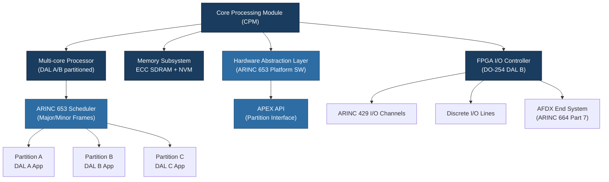

# ATLAS 040-049 · Section 04 · Subsection 040 · 020 — Core Processing and Computing Platforms

## 1. Purpose

This document defines the **Core Processing and Computing Platforms** that form the computational backbone of the ATLAS 040 Multisystem architecture. It characterises the hardware modules responsible for executing avionics software, managing memory hierarchies, and providing deterministic processing resources shared across multiple hosted applications and system domains.

Core processing platforms within a modern avionics architecture must satisfy stringent requirements in terms of determinism, fault tolerance, electromagnetic qualification (RTCA DO-160[^ref1]), and design assurance (RTCA DO-254[^ref2]). This document establishes the classification scheme, performance budgeting methodology, and redundancy approach used within the Q+ATLANTIDE baseline for all computing resources in the ATLAS 040 domain.

## 2. Scope

Coverage includes:

- Core Processing Module (CPM) hardware architecture: processor selection, clock domains, cache management, and memory types (SRAM, SDRAM, NVM);
- General-purpose processing boards and application-specific processing accelerators;
- Memory architecture: address space partitioning, ECC (Error-Correcting Code) RAM requirements, and non-volatile storage for configuration data;
- Thermal management at the module level and interaction with avionics bay cooling allocation;
- CPU cycle budgeting: worst-case execution time (WCET) analysis methodology per DO-178C;
- Redundancy configurations: duplex (active/standby), triplex, and cross-channel monitoring;
- Hardware abstraction layer (HAL) design and its relationship to ARINC 653 platform services;
- Qualification base: environmental categories per DO-160G and EUROCAE ED-14G[^ref3];
- Counterfeit component avoidance per SAE AS5553[^ref4] and AS6081.

## 3. Glossary

| Term / Acronym | Definition |
|---|---|
| **CPM** | Core Processing Module — the primary hardware computing unit within an IMA cabinet, hosting one or more processor cores and associated memory. |
| **WCET** | Worst-Case Execution Time — the maximum bounded execution time of a software task, established through analysis and measurement per DO-178C. |
| **ECC** | Error-Correcting Code — a memory protection technique capable of detecting and correcting single-bit errors and detecting multi-bit errors. |
| **HAL** | Hardware Abstraction Layer — a software interface layer that decouples avionics application software from the underlying hardware platform. |
| **NVM** | Non-Volatile Memory — storage that retains data without power, used for configuration tables, software load images, and fault logs. |
| **FPGA** | Field-Programmable Gate Array — a reconfigurable hardware device used in avionics for deterministic I/O processing, qualified under DO-254. |
| **DO-160** | RTCA DO-160 — Environmental Conditions and Test Procedures for Airborne Equipment. Defines qualification categories for temperature, vibration, humidity, EMI, and other stressors. |
| **AS5553** | SAE standard for Counterfeit Electronic Parts; Avoidance, Detection, Mitigation, and Disposition — applied to all components used in safety-critical avionics hardware. |
| **COTS** | Commercial Off-The-Shelf — commercially available hardware or software adapted for avionics use with appropriate qualification evidence. |

## 4. Diagram

## 5. Footprint

| Metric | Value |
|---|---|
| Architecture | `ATLAS` — Aircraft Top Level Architecture Schema/System (controlled term) |
| Master range | `000–099` |
| Code range | `040-049` |
| Section | `04` — Aviónica, Información & APU |
| Subsection | `040` — Multisystem |
| Subsubject | `020` — Core Processing and Computing Platforms |
| Primary Q-Division | Q-DATAGOV[^qdiv] |
| Support Q-Divisions | Q-AIR, Q-SPACE, Q-HPC |
| ORB support | ORB-PMO, ORB-LEG |
| Governance class | `baseline`[^gov] |
| Folder path | `Q+ATLANTIDE/000-099_ATLAS/040-049_Avionica-Informacion-y-APU/040_Multisystem/` |
| Document | `040-020-Core-Processing-and-Computing-Platforms.md` (this file) |
| Parent subsection | [`README.md`](./README.md) |
| Parent section | [`../../README.md`](../../README.md) |
| Parent architecture | [`../../../README.md`](../../../README.md) |
| Parent baseline | [`organization/Q+ATLANTIDE.md`](../../../../organization/Q+ATLANTIDE.md) |

## 6. References & Citations

[^baseline]: **Q+ATLANTIDE controlled baseline (v1.0.0)** — [`organization/Q+ATLANTIDE.md`](../../../../organization/Q+ATLANTIDE.md).
[^qdiv]: **Q-Division authority** — [`organization/Q-Divisions/`](../../../../organization/Q-Divisions/).
[^gov]: **Governance class** — `baseline` denotes documents under controlled change management.
[^n001]: **Note N-001** — Q+ATLANTIDE is a taxonomy and traceability ecosystem. See [`organization/Q+ATLANTIDE.md` §4](../../../../organization/Q+ATLANTIDE.md#4-notes).
[^ref1]: **RTCA DO-160G / EUROCAE ED-14G** — Environmental Conditions and Test Procedures for Airborne Equipment. Governs qualification of CPMs and IMA hardware against temperature, vibration, altitude, EMI, and other environmental stressors.
[^ref2]: **RTCA DO-254 / EUROCAE ED-80** — Design Assurance Guidance for Airborne Electronic Hardware. Mandates structured development and verification for all complex electronic hardware including FPGAs and ASICs.
[^ref3]: **EUROCAE ED-14G** — European equivalent of RTCA DO-160G, required for EASA certification projects.
[^ref4]: **SAE AS5553** — Counterfeit Electronic Parts; Avoidance, Detection, Mitigation, and Disposition. Required for supply chain management of all avionics computing hardware components.
[^ref5]: **RTCA DO-178C / EUROCAE ED-12C** — Software Considerations in Airborne Systems and Equipment Certification. Governs WCET analysis, structural coverage, and all hosted software verification activities on CPM platforms.
[^ref6]: **ARINC 653** — Avionics Application Software Standard Interface. The platform services layer executing on CPMs must conform to ARINC 653 APEX for time and space partitioning.
