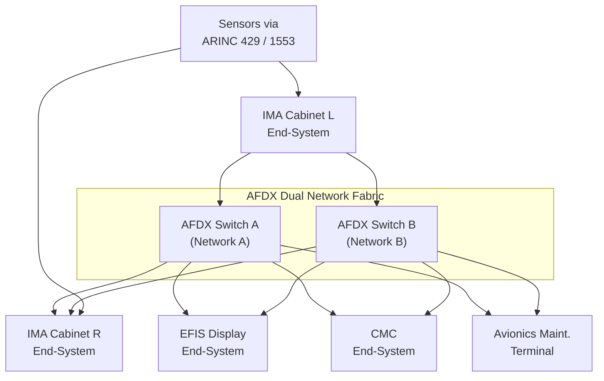
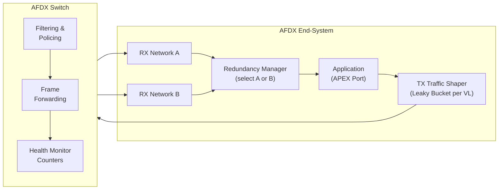
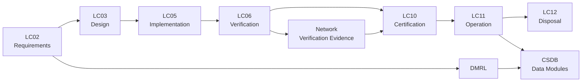

# ATLAS 040-049 · Section 04 · Subsection 040 · 030 — Avionics Networks and Data Buses

## 0. Hyperlink Policy

All linkable content in this file shall be expressed as Markdown links where a stable target exists.
Use relative links for repository-internal content; anchor links for headings, diagrams, glossary terms, citations, references, and footprint entries.
Use `TBD` as placeholder where no stable target yet exists.
Parent context: [040-000 Multisystem General](./040-000-Multisystem-General.md) | IMA: [040-010](./040-010-Integrated-Modular-Avionics-IMA.md).

---

## 1. Purpose

This document defines the avionics network and data bus architecture for the AMPEL360E aircraft. It covers AFDX (ARINC 664 Part 7) virtual link architecture, bandwidth allocation groups (BAG), end-system configuration, legacy buses (ARINC 429, MIL-STD-1553), network redundancy schemes, switch topology, traffic shaping, and bandwidth allocation. It is the primary reference for network architects, avionics integration engineers, and certification authorities.

---

## 2. Applicability

| Attribute | Value |
|-----------|-------|
| Aircraft Model | AMPEL360E (all variants) |
| ATA Reference | [ATA iSpec 2200](#ref-ata-ispec-2200) — Chapter 040 |
| Primary Network Standard | [ARINC 664 Part 7](#ref-arinc-664) (AFDX) |
| Legacy Bus Standards | [ARINC 429](#ref-arinc-429), [MIL-STD-1553B](#ref-1553) |
| Development Assurance | [DO-178C](#ref-do-178c), [DO-254](#ref-do-254) |
| Applicability Code | All S/N unless superseded by service bulletin |

---

## 3. System / Function Overview

The AMPEL360E avionics network uses a dual-redundant AFDX fabric (Network A and Network B) composed of AFDX switches interconnecting IMA Cabinets, avionics LRUs, displays, and maintenance terminals. Virtual Links (VLs) provide deterministic, unidirectional, latency-bounded data paths between end-systems. Legacy ARINC 429 buses serve sensors and actuators not yet migrated to AFDX. MIL-STD-1553B serves specific military-grade subsystems. All networks are fully redundant; end-systems select active network based on reception.

---

## 4. Scope

### 4.1 Included

- AFDX dual-redundant switch topology (Network A / Network B)
- Virtual Link (VL) configuration: BAG, max frame size, latency budget
- AFDX end-system architecture and traffic shaping
- ARINC 429 channel allocation and word definitions
- MIL-STD-1553B bus controller / remote terminal allocation
- Network health monitoring and fault isolation
- Bandwidth allocation and load analysis

### 4.2 Excluded

- Physical wiring and harness routing (see wiring design documents)
- Application-layer data content (each system chapter)
- Time synchronisation over AFDX (see [040-060](./040-060-Time-Synchronization-and-Data-Integrity.md))

---

## 5. Architecture Description

**AFDX Fabric**: Two fully independent AFDX networks (A and B), each comprising a star topology with a core switch (AFDX-SW-A, AFDX-SW-B) and edge ports for up to 100 end-systems. End-systems implement ARINC 664 Part 7 traffic shaping (leaky bucket per VL) to guarantee maximum frame inter-arrival time equal to BAG. Dual-end-system redundancy management selects data from the network with the best integrity status.

**Virtual Links**: Each VL is unidirectional, from one source end-system to one or more destination end-systems. VL parameters (BAG, payload size, latency budget) are defined in the Network Definition File (NDF) and enforced by the switch.

**Legacy Buses**: ARINC 429 high-speed (100 kbps) and low-speed (12.5 kbps) channels connect to CPIOM I/O termination cards. MIL-STD-1553B bus controllers reside on dedicated I/O modules.

---

## 6. Functional Breakdown

| Function ID | Function Name | Description | Allocated To | DAL |
|-------------|---------------|-------------|-------------|-----|
| F-001 | VL Traffic Shaping | Leaky-bucket enforcement of BAG per VL at source end-system | AFDX End-System | A |
| F-002 | Switch Filtering & Policing | VL integrity check and frame forwarding per NDF | AFDX Switch | A |
| F-003 | Redundancy Management | Selection of valid frame from Network A or B at destination | AFDX End-System | A |
| F-004 | ARINC 429 Transmit/Receive | Serial data encoding and decoding per ARINC 429 | CPIOM I/O | B |
| F-005 | MIL-STD-1553B BC/RT | Bus controller and remote terminal protocol management | 1553 I/O Module | B |
| F-006 | Network Health Monitoring | VL integrity counters, error rate monitoring, switch port status | AFDX Switch + CMC | B |
| F-007 | NDF Configuration | Load and apply Network Definition File defining all VL parameters | Ground loader / ARINC 615A | B |

---

## 7. Mermaid — System Context Diagram

---

## 8. Mermaid — Internal Functional Architecture

---

## 9. Mermaid — Lifecycle Traceability

---

## 10. Interfaces

| Interface ID | From | To | Protocol / Standard | Direction | Notes |
|-------------|------|----|---------------------|-----------|-------|
| IF-030-01 | IMA End-System | AFDX Switch | ARINC 664 Part 7 / 100BASE-TX | Bidirectional | Primary data fabric |
| IF-030-02 | AFDX Switch A | AFDX Switch B | Cross-link (optional) | Bidirectional | TBD — inter-switch redundancy |
| IF-030-03 | CPIOM I/O | Sensors/Actuators | ARINC 429 | Bidirectional | Per channel allocation |
| IF-030-04 | 1553 I/O Module | Subsystems | MIL-STD-1553B | Bidirectional | BC or RT per allocation |
| IF-030-05 | AFDX Switch | CMC | ARINC 664 / SNMP-like | Output | Network health telemetry |
| IF-030-06 | Ground Loader | End-System NDF | ARINC 615A / Ethernet | Input | NDF configuration load |

---

## 11. Operating Modes

| Mode | Description | Trigger | System Response |
|------|-------------|---------|-----------------|
| Normal | Both Network A and B active; redundancy management operating | Nominal | All VLs active; data from preferred network |
| Degraded | One network failed; single network operation | Switch or cable fault detected | Redundancy manager selects surviving network; alert to CMC |
| Maintenance | Network in diagnostic mode; NDF reload active | AMT command | VL scheduling suspended; network accessible for loading |
| Failure/Safe State | Both networks inoperative for critical VL | Double-network failure | Affected hosted applications enter safe state; crew CAS alert |

---

## 12. Monitoring and Diagnostics

- AFDX switch maintains per-VL integrity counters (received frames, discarded frames, integrity violations).
- End-system reports per-VL redundancy management status to IMA HM.
- Switch port status (link up/down, error rate) forwarded to [CMC](./040-080-Multisystem-Monitoring-Diagnostics-and-Control-Interfaces.md) via management VL.
- ARINC 429 parity error and word rate counters maintained by CPIOM BITE.
- 1553 bus error counters maintained by BC module; available via AMT.

---

## 13. Maintenance Concept

| Task | Interval | Access | Tooling |
|------|----------|--------|---------|
| AFDX switch health review | Power-up | CMC / AMT | None |
| AFDX switch LRU swap | On condition | E/E Bay | Standard avionics tools |
| NDF reload | On demand / post-modification | AMT / Ground loader | ARINC 615A loader |
| ARINC 429 wire continuity | Per maintenance cycle | Wiring inspection | Multimeter |
| VL bandwidth audit | Post modification | Engineering analysis | Network analysis tool |

---

## 14. S1000D / CSDB Mapping

| Document Type | Data Module Code (DMC) | Info Code | Title |
|---------------|----------------------|-----------|-------|
| System Description | DMC-AMPEL360E-EWTW-040-030-00A-040A-A | 040 | Avionics Network Description |
| Maintenance Procedures | DMC-AMPEL360E-EWTW-040-030-00A-300A-A | 300 | AFDX Fault Isolation |
| BITE/Test | DMC-AMPEL360E-EWTW-040-030-00A-400A-A | 400 | Network BITE Procedures |
| Wiring Data | DMC-AMPEL360E-EWTW-040-030-00A-520A-A | 520 | Network Wiring and Connector Data |
| IPD | DMC-AMPEL360E-EWTW-040-030-00A-941A-A | 941 | Network LRU Illustrated Parts |
| Software Desc | DMC-AMPEL360E-EWTW-040-030-00A-720A-A | 720 | NDF and Switch Configuration |

### Recommended Data Module Set

| Info Code | Publication | Applicability |
|-----------|-------------|---------------|
| 040 | AMM — System Description | All variants |
| 300 | FIM — Fault Isolation | All variants |
| 400 | TSM — BITE Procedures | All variants |
| 520 | AMM — Wiring Data | All variants |
| 720 | SRM — NDF Description | All variants |
| 941 | IPD — Parts Data | All variants |

---

## 15. Footprints

### 15.1 Physical

| Item | Dimension (mm) | Mass (kg) | Location |
|------|---------------|-----------|----------|
| AFDX Switch A | 300 × 150 × 40 | 2.5 | E/E Bay — Centre |
| AFDX Switch B | 300 × 150 × 40 | 2.5 | E/E Bay — Centre |
| AFDX cable harness | — | 8.0 (est.) | Aircraft-wide routing |

### 15.2 Electrical / Data

| Interface | Standard | Bandwidth / Power |
|-----------|----------|-------------------|
| AFDX | ARINC 664 Part 7 / 100BASE-TX | 100 Mbps per port |
| ARINC 429 HS | ARINC 429 | 100 kbps |
| MIL-STD-1553B | MIL-STD-1553B | 1 Mbps |
| Switch power | 28 VDC | 30 W per switch |

### 15.3 Maintenance

| Task | Man-Hours | Skill Level | Access |
|------|-----------|-------------|--------|
| Switch swap | 0.5 | Avionics tech | E/E Bay |
| NDF reload | 0.5 | Avionics tech | AMT |
| Cable inspection | 2.0 | Avionics tech | Multiple zones |

### 15.4 Data

| Data Item | Volume | Storage | Retention |
|-----------|--------|---------|-----------|
| NDF (Network Definition File) | 5 MB | Protected NVM | Until updated |
| VL integrity counters log | 64 MB | Switch NVM / CSDB | 500 FH rolling |
| ARINC 429 error log | 16 MB | CPIOM NVM | 500 FH rolling |

---

## 16. Safety and Certification Considerations

- Dual-network AFDX topology provides single-failure tolerance for all critical VLs.
- VL traffic shaping enforced at source ensures no single application can monopolise bandwidth.
- Latency budget analysis required per VL; worst-case end-to-end latency must satisfy hosted application requirements.
- Switch certification per [DO-178C](#ref-do-178c) (firmware) and [DO-254](#ref-do-254) (hardware) required.
- ARINC 664 Part 7 compliance verification required at system integration level.
- Network redundancy independence analysis must demonstrate A and B networks are physically and electrically separated.

---

## 17. Verification and Validation

| V&V ID | Requirement | Method | Success Criteria | Status |
|--------|-------------|--------|-----------------|--------|
| VV-030-01 | VL maximum latency | Network simulation + bench test | Worst-case latency within budget |  |
| VV-030-02 | VL traffic shaping | Bench test — overload injection | No VL exceeds BAG period |  |
| VV-030-03 | Network A/B independence | Physical inspection + test | No shared single-point failure |  |
| VV-030-04 | Redundancy manager selection | Fault injection | Correct network selected within 1 frame |  |
| VV-030-05 | NDF load and activation | Integration test | All VLs active post-load |  |

---

## 18. Glossary

| Term/Acronym | Definition | Link |
|-------------|-----------|------|
| AFDX | Avionics Full-Duplex Switched Ethernet — ARINC 664 Part 7 deterministic network | [§3](#3-system--function-overview) |
| VL | Virtual Link — unidirectional, bandwidth-bounded communication path in AFDX | [§5](#5-architecture-description) |
| BAG | Bandwidth Allocation Gap — minimum interval between AFDX frames on a VL | [§6](#6-functional-breakdown) |
| NDF | Network Definition File — configuration file defining all VL parameters | [§5](#5-architecture-description) |
| ES | End-System — AFDX network interface implementing ARINC 664 Part 7 | [§5](#5-architecture-description) |
| ARINC 429 | ARINC 429 — unidirectional serial avionics data bus standard | [§5](#5-architecture-description) |
| MIL-STD-1553B | Military standard 1 Mbps avionics bus with BC/RT/MT architecture | [§5](#5-architecture-description) |
| BC | Bus Controller — MIL-STD-1553B master node | [§6](#6-functional-breakdown) |
| RT | Remote Terminal — MIL-STD-1553B slave node | [§6](#6-functional-breakdown) |
| RM | Redundancy Management — selection logic choosing valid data from Network A or B | [§6](#6-functional-breakdown) |
| SNMP | Simple Network Management Protocol — used for switch health monitoring | [§12](#12-monitoring-and-diagnostics) |
| DAL | Design Assurance Level — rigor level per DO-178C/DO-254 | [§16](#16-safety-and-certification-considerations) |

---

## 19. Citations

| Ref | Citation | Use | Link |
|-----|---------|-----|------|
| ARINC 664 | ARINC 664 Part 7 — Aircraft Data Network, Avionics Full Duplex Switched Ethernet | AFDX network standard |  |
| ARINC 429 | ARINC 429 — Mark 33 Digital Information Transfer System | Legacy bus standard |  |
| MIL-STD-1553B | MIL-STD-1553B — Aircraft Internal Time Division Command/Response Multiplex Data Bus | Military bus standard |  |
| DO-178C | RTCA DO-178C | Software assurance |  |
| DO-254 | RTCA DO-254 | Hardware assurance |  |
| GOV | Q+ATLANTIDE Governance Framework | Document governance | [Q+ATLANTIDE.md](../../../../organization/Q+ATLANTIDE.md) |
| S1000D | S1000D Issue 5.0 | CSDB mapping |  |
| ATA iSpec 2200 | ATA iSpec 2200 | ATA chapter alignment |  |

---

## 20. References

| Ref | Document | Identifier | Revision | Status | Link |
|-----|---------|-----------|---------|--------|------|
| REF-030-01 | Multisystem General | QATL-ATLAS-1000-ATLAS-040-049-04-040-000 | 1.0.0 | Active | [040-000](./040-000-Multisystem-General.md) |
| REF-030-02 | IMA Platform | QATL-ATLAS-1000-ATLAS-040-049-04-040-010 | 1.0.0 | Active | [040-010](./040-010-Integrated-Modular-Avionics-IMA.md) |
| REF-030-03 | ARINC 664 Part 7 | ARINC 664-7 | Current | Normative |  |
| REF-030-04 | ARINC 429 | ARINC 429 | Current | Normative |  |
| REF-030-05 | MIL-STD-1553B | MIL-STD-1553B | Current | Normative |  |

---

## 21. Open Issues

| ID | Issue | Owner | Status | Link |
|----|-------|-------|--------|------|
| OI-030-01 | AFDX switch vendor selection pending procurement | Q-AIR | Open |  |
| OI-030-02 | VL latency budget analysis for FCS critical VLs to be completed | Q-DATAGOV | Open |  |
| OI-030-03 | MIL-STD-1553B usage to be confirmed for non-military variant | Q-AIR | Open |  |

---

## 22. Change Log

| Version | Date | Author | Change | Link |
|---------|------|--------|--------|------|
| 1.0.0 | 2026-05-09 | Q+ Team/Amedeo Pelliccia + AI | Initial creation with full 22-section template |  |
