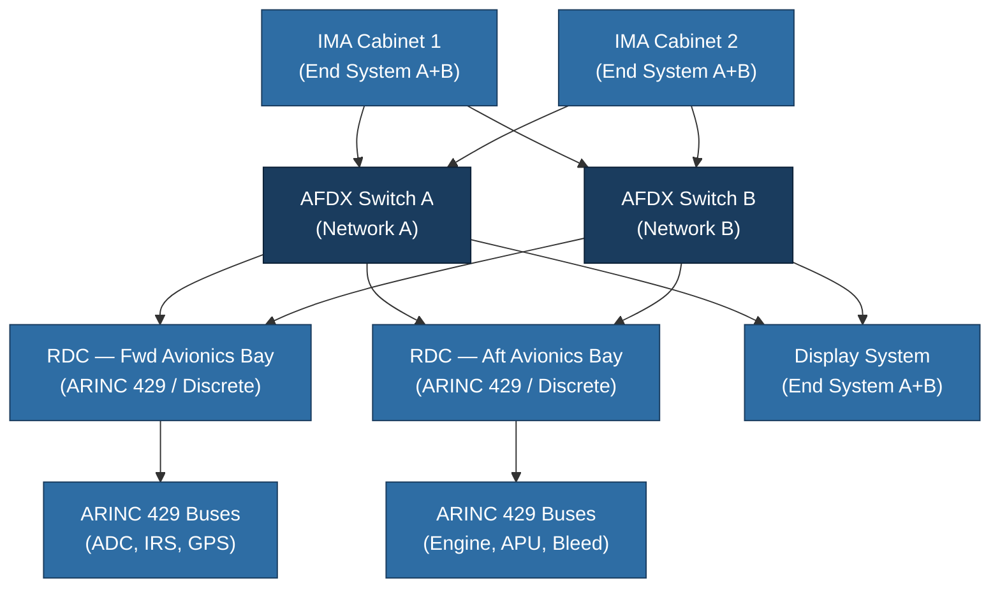

# ATLAS 040-049 · Section 04 · Subsection 040 · 030 — Avionics Networks and Data Buses

## 1. Purpose

This document characterises the **avionics data networks and data buses** that form the communication backbone of the ATLAS 040 Multisystem architecture. It defines the topologies, protocols, determinism requirements, and redundancy strategies governing all inter-system and intra-system communication within the avionics domain.

The selection and management of data buses is a multisystem-level concern because individual avionics systems — flight management, navigation, displays, engines — all depend on shared network infrastructure. The Q+ATLANTIDE baseline prescribes a layered network model that accommodates legacy protocols (ARINC 429[^ref1], MIL-STD-1553[^ref2]) alongside modern deterministic switched Ethernet (ARINC 664/AFDX[^ref3]) and emerging standards such as avionics CAN and Time-Sensitive Networking (TSN).

## 2. Scope

This document covers:

- **ARINC 664 Part 7 (AFDX)**: switch fabric topology, Virtual Links (VLs), Bandwidth Allocation Gaps (BAGs), end-system configuration, and network redundancy (Dual Network A/B);
- **ARINC 429**: unidirectional bus characteristics, word format, label allocation, bus loading rules, and receiver wiring topology;
- **MIL-STD-1553B**: command/response multiplex bus, Bus Controller (BC) / Remote Terminal (RT) / Bus Monitor (BM) roles, applicable on military derivative platforms;
- **CAN bus** (ISO 11898): usage in lower-criticality avionics and cabin subsystems;
- Network topology diagrams showing inter-cabinet connectivity, switch locations, and remote data concentrator (RDC) placement;
- Bandwidth allocation methodology: VL parameter derivation, traffic policing, and bandwidth reservation matrices;
- Network redundancy: dual-network switching, cross-channel monitoring, and network fault containment;
- EMC and cable shielding requirements per DO-160G[^ref4] for all network media.

## 3. Glossary

| Term / Acronym | Definition |
|---|---|
| **AFDX** | Avionics Full-Duplex Switched Ethernet — deterministic switched Ethernet defined by ARINC 664 Part 7, providing guaranteed latency and bandwidth for safety-critical avionics traffic. |
| **VL** | Virtual Link — a unidirectional logical communication channel in AFDX with defined bandwidth and latency bounds. |
| **BAG** | Bandwidth Allocation Gap — the minimum time interval between successive AFDX frames on a given VL, used to police bandwidth. |
| **ARINC 429** | A unidirectional, differential serial data bus standard widely used in civil transport aircraft for point-to-point avionics communication at 12.5 or 100 kbps. |
| **RDC** | Remote Data Concentrator — an interface unit that converts AFDX traffic to/from legacy buses (ARINC 429, discrete signals) and distributes them to local sensors and actuators. |
| **MIL-STD-1553B** | US military standard for a time-division multiplexed, command/response serial data bus operating at 1 Mbps. |
| **TSN** | Time-Sensitive Networking — IEEE 802.1Q extensions that bring deterministic Ethernet capabilities for future avionics network evolutions. |
| **BC** | Bus Controller — the master node on a MIL-STD-1553 bus that initiates all data transfers. |
| **End System** | An AFDX network node that generates or receives VL traffic, incorporating an ARINC 664 conformant MAC and traffic shaper. |

## 4. Diagram

## 5. Footprint

| Metric | Value |
|---|---|
| Architecture | `ATLAS` — Aircraft Top Level Architecture Schema/System (controlled term) |
| Master range | `000–099` |
| Code range | `040-049` |
| Section | `04` — Aviónica, Información & APU |
| Subsection | `040` — Multisystem |
| Subsubject | `030` — Avionics Networks and Data Buses |
| Primary Q-Division | Q-DATAGOV[^qdiv] |
| Support Q-Divisions | Q-AIR, Q-SPACE, Q-HPC |
| ORB support | ORB-PMO, ORB-LEG |
| Governance class | `baseline`[^gov] |
| Folder path | `Q+ATLANTIDE/000-099_ATLAS/040-049_Avionica-Informacion-y-APU/040_Multisystem/` |
| Document | `040-030-Avionics-Networks-and-Data-Buses.md` (this file) |
| Parent subsection | [`README.md`](./README.md) |
| Parent section | [`../../README.md`](../../README.md) |
| Parent architecture | [`../../../README.md`](../../../README.md) |
| Parent baseline | [`organization/Q+ATLANTIDE.md`](../../../../organization/Q+ATLANTIDE.md) |

## 6. References & Citations

[^baseline]: **Q+ATLANTIDE controlled baseline (v1.0.0)** — [`organization/Q+ATLANTIDE.md`](../../../../organization/Q+ATLANTIDE.md).
[^qdiv]: **Q-Division authority** — [`organization/Q-Divisions/`](../../../../organization/Q-Divisions/).
[^gov]: **Governance class** — `baseline` denotes documents under controlled change management.
[^n001]: **Note N-001** — Q+ATLANTIDE is a taxonomy and traceability ecosystem. See [`organization/Q+ATLANTIDE.md` §4](../../../../organization/Q+ATLANTIDE.md#4-notes).
[^ref1]: **ARINC 429** — Mark 33 Digital Information Transfer System (DITS). Aeronautical Radio Inc. Defines the physical layer, word format, and label set for the most widely deployed civil avionics serial bus.
[^ref2]: **MIL-STD-1553B** — Military Standard: Aircraft Internal Time Division Command/Response Multiplex Data Bus. US Department of Defense. Required for military platforms and some civil derivative programmes.
[^ref3]: **ARINC 664 Part 7** — Aircraft Data Network, Avionics Full-Duplex Switched Ethernet (AFDX). Aeronautical Radio Inc. Defines switched deterministic Ethernet for modern IMA-based avionics architectures.
[^ref4]: **RTCA DO-160G / EUROCAE ED-14G** — Environmental Conditions and Test Procedures for Airborne Equipment. Section 21 (Emission of Radio Frequency Energy) and Section 20 (Radio Frequency Susceptibility) govern electromagnetic qualification of all network hardware and cabling.
[^ref5]: **ARINC 600** — Air Transport Avionics Equipment Interfaces. Defines connector and rack standards for avionics LRUs connected to AFDX and legacy bus networks.
[^ref6]: **IEEE 802.1Q** — Bridges and Bridged Networks. The underlying standard extended by TSN task groups to provide deterministic Ethernet capabilities applicable to next-generation avionics networks.
