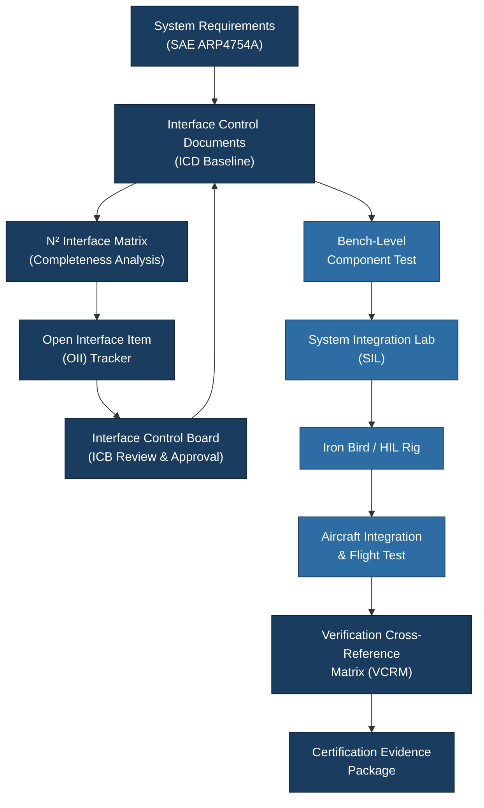

# ATLAS 040-049 · Section 04 · Subsection 040 · 040 — System Integration and Interface Management

## 1. Purpose

This document defines the **System Integration and Interface Management** framework governing all cross-system interfaces within the ATLAS 040 Multisystem domain. It establishes the methodology for specifying, controlling, verifying, and releasing interface definitions between avionics systems, subsystems, and external integration partners.

Interface management is inherently a multisystem function: any point where two system elements exchange data, power, or mechanical loads requires a jointly managed Interface Control Document (ICD). The Q+ATLANTIDE baseline mandates a structured ICD lifecycle and a corresponding integration test strategy that provides end-to-end traceability from system-level requirements through to hardware-in-the-loop (HIL) verification evidence.

## 2. Scope

This document covers:

- **Interface classification**: physical (electrical, mechanical, pneumatic), logical (data protocol, message format), and environmental (thermal, vibration coupling) interfaces;
- **ICD lifecycle management**: creation, approval authority, change control, and configuration baseline incorporation;
- **Interface Control Document structure**: mandatory ICD content per ATA iSpec 2200[^ref1] and applicable to ARINC 429[^ref2], ARINC 664[^ref3], and discrete signal interfaces;
- **System Integration Laboratory (SIL) and Iron Bird** facility requirements for avionics integration testing;
- **Integration test strategy**: bench-level, rig-level, iron-bird, and aircraft-level integration verification phases;
- **Interface matrix (N²-diagram)** methodology for capturing all system-to-system interactions;
- **Open interface items (OIIs)** tracking and resolution process;
- Applicability to SAE ARP4754A[^ref4] system development process requirements for interface definition and verification.

## 3. Glossary

| Term / Acronym | Definition |
|---|---|
| **ICD** | Interface Control Document — a formally configuration-managed document specifying all parameters of an interface between two or more system elements. |
| **N²-Diagram** | A matrix diagram where each cell represents the interface (information flow or dependency) between the row system and the column system; used for completeness analysis. |
| **SIL** | System Integration Laboratory — a ground facility where avionics LRUs are integrated and tested together, prior to aircraft installation. |
| **OII** | Open Interface Item — a tracked interface definition element that is not yet agreed, resolved, or verified. |
| **HIL** | Hardware-In-the-Loop — an integration test approach where real hardware LRUs are connected to simulated environments to verify system-level behaviour. |
| **ARP4754A** | SAE Aerospace Recommended Practice 4754A — Guidelines for Development of Civil Aircraft and Systems. Provides the system-level development process framework within which interface management is conducted. |
| **ICB** | Interface Control Board — a joint governance body with representatives from interfacing system teams, responsible for approving ICD changes. |
| **Verification Cross-Reference Matrix (VCRM)** | A traceability matrix linking each system requirement to its verification method and corresponding test evidence. |
| **End-to-End Test** | An integration test that exercises a complete functional chain across multiple LRUs and network segments, demonstrating system-level compliance. |

## 4. Diagram

## 5. Footprint

| Metric | Value |
|---|---|
| Architecture | `ATLAS` — Aircraft Top Level Architecture Schema/System (controlled term) |
| Master range | `000–099` |
| Code range | `040-049` |
| Section | `04` — Aviónica, Información & APU |
| Subsection | `040` — Multisystem |
| Subsubject | `040` — System Integration and Interface Management |
| Primary Q-Division | Q-DATAGOV[^qdiv] |
| Support Q-Divisions | Q-AIR, Q-SPACE, Q-HPC |
| ORB support | ORB-PMO, ORB-LEG |
| Governance class | `baseline`[^gov] |
| Folder path | `Q+ATLANTIDE/000-099_ATLAS/040-049_Avionica-Informacion-y-APU/040_Multisystem/` |
| Document | `040-040-System-Integration-and-Interface-Management.md` (this file) |
| Parent subsection | [`README.md`](./README.md) |
| Parent section | [`../../README.md`](../../README.md) |
| Parent architecture | [`../../../README.md`](../../../README.md) |
| Parent baseline | [`organization/Q+ATLANTIDE.md`](../../../../organization/Q+ATLANTIDE.md) |

## 6. References & Citations

[^baseline]: **Q+ATLANTIDE controlled baseline (v1.0.0)** — [`organization/Q+ATLANTIDE.md`](../../../../organization/Q+ATLANTIDE.md).
[^qdiv]: **Q-Division authority** — [`organization/Q-Divisions/`](../../../../organization/Q-Divisions/).
[^gov]: **Governance class** — `baseline` denotes documents under controlled change management.
[^n001]: **Note N-001** — Q+ATLANTIDE is a taxonomy and traceability ecosystem. See [`organization/Q+ATLANTIDE.md` §4](../../../../organization/Q+ATLANTIDE.md#4-notes).
[^ref1]: **ATA iSpec 2200** — Information Standards for Aviation Maintenance. Provides the ICD structure conventions and SNS coding standards applied to all ATLAS 040 interface documentation.
[^ref2]: **ARINC 429** — Mark 33 Digital Information Transfer System (DITS). ICDs for ARINC 429 interfaces must specify label set, transmission rate, bus number, receiver addressing, and data quality requirements.
[^ref3]: **ARINC 664 Part 7** — Aircraft Data Network, AFDX. ICDs for AFDX interfaces must specify VL identifiers, BAG, maximum frame size, network path (A/B), and latency budget allocation.
[^ref4]: **SAE ARP4754A** — Guidelines for Development of Civil Aircraft and Systems. Section 5 defines the system development process requirements including interface identification, specification, and verification applicable to all ATLAS 040 interfaces.
[^ref5]: **EUROCAE ED-79A** — European equivalent of SAE ARP4754A, required for EASA certification programmes.
[^ref6]: **RTCA DO-178C / EUROCAE ED-12C** — Software Considerations in Airborne Systems and Equipment Certification. Interface specifications must be traceable to software requirements and verified through integration tests documented in the Software Verification Plan.
