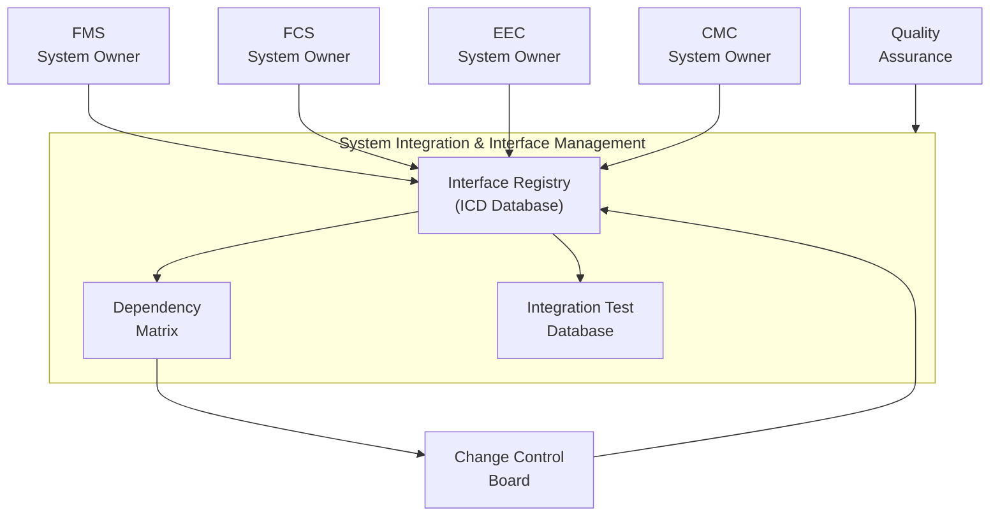
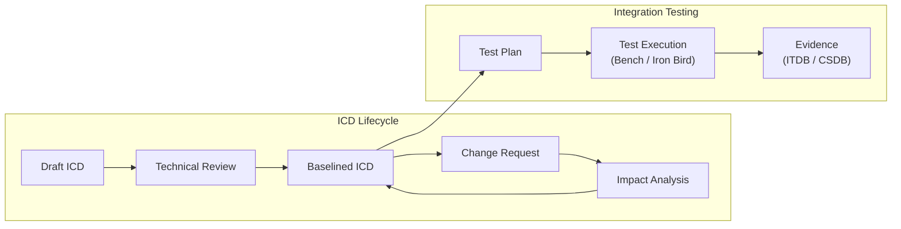
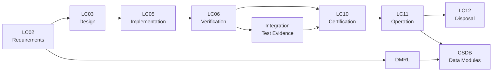

# ATLAS 040-049 · Section 04 · Subsection 040 · 040 — System Integration and Interface Management

## 0. Hyperlink Policy

All linkable content in this file shall be expressed as Markdown links where a stable target exists.
Use relative links for repository-internal content; anchor links for headings, diagrams, glossary terms, citations, references, and footprint entries.
Use `TBD` as placeholder where no stable target yet exists.
Parent context: [040-000 Multisystem General](./040-000-Multisystem-General.md).

---

## 1. Purpose

This document defines the system integration and interface management strategy for the [PROGRAMME-AIRCRAFT] avionics multisystem. It covers the Interface Control Document (ICD) framework, integration strategies (incremental and full), verification at integration level, cross-system dependency management, and compliance with SAE ARP4754A and EUROCAE ED-79A system development processes. It is the primary reference for systems integration engineers, verification leads, and program management.

---

## 2. Applicability

| Attribute | Value |
|-----------|-------|
| Aircraft Model | [PROGRAMME-AIRCRAFT] (all variants) |
| ATA Reference | [ATA iSpec 2200](#ref-ata-ispec-2200) — Chapter 040 |
| System Development Process | [SAE ARP4754A](#ref-arp4754a) / [EUROCAE ED-79A](#ref-ed79a) |
| Regulatory Framework | EASA CS-25, FAA 14 CFR Part 25 |
| Development Assurance | [DO-178C](#ref-do-178c), [DO-254](#ref-do-254) |
| Applicability Code | All S/N unless superseded by service bulletin |

---

## 3. System / Function Overview

System Integration and Interface Management (SIIM) provides the framework for controlling and verifying all interfaces between avionics systems. ICDs are the contractual baseline between system owners; they define data formats, timing, error handling, and resource consumption. Integration is performed in four phases: component, subsystem, system, and aircraft level. Cross-system dependency management tracks requirements allocation and interface changes to prevent integration failures. ARP4754A §5 governs the integration verification process.

---

## 4. Scope

### 4.1 Included

- ICD structure and lifecycle management
- Interface registration and change control
- Integration levels (component, subsystem, system, aircraft)
- Incremental integration strategy
- Cross-system dependency matrix
- Integration verification planning and execution
- ARP4754A / ED-79A process compliance mapping

### 4.2 Excluded

- Individual system internal design (each system chapter)
- Physical wiring design (see wiring design documents)
- Software internal verification (DO-178C, each application chapter)

---

## 5. Architecture Description

The SIIM framework is organised in four tiers:

1. **Interface Registry**: Master list of all inter-system interfaces, assigned ICD identifiers, owners, and status.
2. **ICD Content**: Each ICD defines signal/message name, type, range, accuracy, update rate, source, sink, protocol, and error handling.
3. **Dependency Matrix**: Cross-reference of systems sharing interfaces; used for change impact analysis.
4. **Integration Test Database (ITDB)**: Maps requirements through integration test cases to evidence; traceable to CSDB.

ARP4754A §5.4 requires that all derived requirements from integration are fed back to the affected system development processes.

---

## 6. Functional Breakdown

| Function ID | Function Name | Description | Allocated To | DAL |
|-------------|---------------|-------------|-------------|-----|
| F-001 | ICD Creation and Baseline | Define, approve, and baseline all inter-system ICDs | Systems Integration Team | A |
| F-002 | Interface Change Control | Impact assessment and approval of ICD changes | Change Control Board | A |
| F-003 | Dependency Tracking | Maintain cross-system dependency matrix; flag affected parties on change | Q-DATAGOV tool | B |
| F-004 | Integration Test Planning | Define integration test cases from ICDs and system requirements | V&V Team | A |
| F-005 | Integration Test Execution | Execute tests on bench and iron bird; record evidence | V&V Team | A |
| F-006 | Integration Evidence Management | Store, version, and link test evidence to requirements in ITDB | Q-DATAGOV CSDB | B |
| F-007 | ARP4754A Process Audit | Periodic audit of integration process against ARP4754A objectives | Quality Assurance | B |

---

## 7. Mermaid — System Context Diagram

---

## 8. Mermaid — Internal Functional Architecture

---

## 9. Mermaid — Lifecycle Traceability

---

## 10. Interfaces

| Interface ID | From | To | Protocol / Standard | Direction | Notes |
|-------------|------|----|---------------------|-----------|-------|
| IF-040-01 | System Owner | ICD Registry | Document submission | Input | New or updated ICD |
| IF-040-02 | ICD Registry | Change Control Board | Change notification | Output | On ICD change request |
| IF-040-03 | Dependency Matrix | Affected System Owners | Change impact notification | Output | Automated via Q-DATAGOV tool |
| IF-040-04 | ITDB | CSDB | Evidence traceability | Bidirectional | Integration test to DM linkage |
| IF-040-05 | Integration Test Rig | ITDB | Test result upload | Input | Bench / iron bird results |
| IF-040-06 | Quality Assurance | ARP4754A audit records | Document access | Input | Process compliance evidence |

---

## 11. Operating Modes

| Mode | Description | Trigger | System Response |
|------|-------------|---------|-----------------|
| Normal (Development) | Active ICD management and integration testing ongoing | Program phase | ICDs baselined; ITDB active |
| Change Control | ICD modification under assessment | Change request submitted | Dependency analysis initiated; affected systems notified |
| Maintenance (In-service) | ICDs updated for service bulletins or modifications | SB or modification approved | Updated ICD and re-test evidence required |
| Failure/Safe State | Integration discrepancy discovered during certification | Test failure or non-conformance | NCR raised; root cause analysis initiated; evidence withheld |

---

## 12. Monitoring and Diagnostics

- Interface Registry tool tracks ICD status (draft, review, baselined, superseded).
- Dependency Matrix automatically identifies affected systems when an ICD change is submitted.
- ITDB dashboard shows integration test coverage percentage per system and per requirement.
- Quality Assurance conducts quarterly ARP4754A process audits; findings tracked to closure.

---

## 13. Maintenance Concept

| Task | Interval | Access | Tooling |
|------|----------|--------|---------|
| ICD registry review | Per program milestone | Interface registry tool | Q-DATAGOV platform |
| Dependency matrix update | On ICD change | Interface registry tool | Q-DATAGOV platform |
| Integration test plan update | Per baseline change | ITDB | Q-DATAGOV platform |
| ARP4754A process audit | Quarterly | QA records | Audit checklist |

---

## 14. S1000D / CSDB Mapping

| Document Type | Data Module Code (DMC) | Info Code | Title |
|---------------|----------------------|-----------|-------|
| System Description | DMC-<PROGRAMME>-<VARIANT>-040-040-00A-040A-A | 040 | SIIM Description |
| Maintenance Procedures | DMC-<PROGRAMME>-<VARIANT>-040-040-00A-300A-A | 300 | Integration Fault Isolation |
| BITE/Test | DMC-<PROGRAMME>-<VARIANT>-040-040-00A-400A-A | 400 | Integration BITE Procedures |
| Wiring Data | DMC-<PROGRAMME>-<VARIANT>-040-040-00A-520A-A | 520 | Interface Wiring Data |
| IPD | DMC-<PROGRAMME>-<VARIANT>-040-040-00A-941A-A | 941 | Integration LRU Parts |
| Software Desc | DMC-<PROGRAMME>-<VARIANT>-040-040-00A-720A-A | 720 | ICD and ITDB Tool Description |

### Recommended Data Module Set

| Info Code | Publication | Applicability |
|-----------|-------------|---------------|
| 040 | AMM — System Description | All variants |
| 300 | FIM — Fault Isolation | All variants |
| 400 | TSM — BITE Procedures | All variants |
| 520 | AMM — Wiring Data | All variants |
| 720 | SRM — Software/Tools | All variants |
| 941 | IPD — Parts Data | All variants |

---

## 15. Footprints

### 15.1 Physical

| Item | Dimension (mm) | Mass (kg) | Location |
|------|---------------|-----------|----------|
| Integration Test Bench | 3000 × 800 × 1800 | 500 | Test facility |
| Iron Bird Rig | 15000 × 5000 × 3000 | 5000 | Integration facility |

### 15.2 Electrical / Data

| Interface | Standard | Bandwidth / Power |
|-----------|----------|-------------------|
| ITDB Server | Ethernet | 1 Gbps LAN |
| ICD Registry | HTTPS / REST API | N/A |

### 15.3 Maintenance

| Task | Man-Hours | Skill Level | Access |
|------|-----------|-------------|--------|
| ICD update and approval | 4–40 (complexity dependent) | Systems engineer | Remote |
| Integration test cycle | 40–400 | Test engineer | Test facility |

### 15.4 Data

| Data Item | Volume | Storage | Retention |
|-----------|--------|---------|-----------|
| ICD repository | 10 GB | Q-DATAGOV CSDB | Life of programme |
| Integration test evidence | 500 GB | CSDB | Life of programme |
| Dependency matrix | 50 MB | Q-DATAGOV tool | Life of programme |

---

## 16. Safety and Certification Considerations

- ARP4754A §5 mandates that all inter-system interfaces be covered by ICDs and verified at integration level.
- ED-79A requires integration verification evidence to be provided to the certification authority.
- Derived requirements arising from integration analysis must feed back to affected system DAL processes.
- Independence between integration test team and development team required for DAL A systems.
- All integration evidence must be controlled and reproducible per [DO-178C](#ref-do-178c) §11 and [DO-254](#ref-do-254) §10.

---

## 17. Verification and Validation

| V&V ID | Requirement | Method | Success Criteria | Status |
|--------|-------------|--------|-----------------|--------|
| VV-040-01 | All interfaces covered by ICD | Inspection of ICD registry | 100% interface coverage |  |
| VV-040-02 | ICD compliance at bench | Integration test per ITDB test plan | All VLs, buses, and signals verified |  |
| VV-040-03 | Dependency matrix completeness | Review against system architecture | All cross-system dependencies captured |  |
| VV-040-04 | ARP4754A §5 objectives | Process audit | All objectives satisfied |  |
| VV-040-05 | Evidence traceability | ITDB to requirement mapping | 100% requirement coverage |  |

---

## 18. Glossary

| Term/Acronym | Definition | Link |
|-------------|-----------|------|
| ICD | Interface Control Document — contractual specification of all parameters of an inter-system interface | [§3](#3-system--function-overview) |
| SIIM | System Integration and Interface Management — framework governing interface control and integration | [§3](#3-system--function-overview) |
| ARP4754A | SAE ARP4754A — Guidelines for Development of Civil Aircraft and Systems | [§5](#5-architecture-description) |
| ED-79A | EUROCAE ED-79A — equivalent to ARP4754A for European regulatory context | [§5](#5-architecture-description) |
| ITDB | Integration Test Database — traceability tool linking requirements to integration test evidence | [§5](#5-architecture-description) |
| CCB | Change Control Board — authority approving changes to baselined ICDs | [§6](#6-functional-breakdown) |
| NCR | Non-Conformance Report — formal record of a test failure or process deviation | [§11](#11-operating-modes) |
| DAL | Design Assurance Level — rigor level per DO-178C/DO-254 | [§16](#16-safety-and-certification-considerations) |
| Iron Bird | Full-scale aircraft system integration rig replicating aircraft wiring and structure | [§15](#15-footprints) |
| SB | Service Bulletin — engineering document directing an aircraft modification | [§11](#11-operating-modes) |
| CSDB | Common Source Data Base — S1000D repository for all technical publication data modules | [§14](#14-s1000d--csdb-mapping) |
| DM | Data Module — atomic S1000D technical publication unit | [§14](#14-s1000d--csdb-mapping) |

---

## 19. Citations

| Ref | Citation | Use | Link |
|-----|---------|-----|------|
| ARP4754A | SAE ARP4754A — Guidelines for Development of Civil Aircraft and Systems | System integration process |  |
| ED-79A | EUROCAE ED-79A — Guidelines for Development of Civil Aircraft and Systems | European equivalent to ARP4754A |  |
| DO-178C | RTCA DO-178C | Software assurance |  |
| DO-254 | RTCA DO-254 | Hardware assurance |  |
| GOV | Q+ATLANTIDE Governance Framework | Document governance | [Q+ATLANTIDE.md](../../../../organization/Q+ATLANTIDE.md) |
| S1000D | S1000D Issue 5.0 | CSDB mapping |  |
| ATA iSpec 2200 | ATA iSpec 2200 | ATA chapter alignment |  |

---

## 20. References

| Ref | Document | Identifier | Revision | Status | Link |
|-----|---------|-----------|---------|--------|------|
| REF-040-01 | Multisystem General | QATL-ATLAS-1000-ATLAS-040-049-04-040-000 | 1.0.0 | Active | [040-000](./040-000-Multisystem-General.md) |
| REF-040-02 | IMA Platform | QATL-ATLAS-1000-ATLAS-040-049-04-040-010 | 1.0.0 | Active | [040-010](./040-010-Integrated-Modular-Avionics-IMA.md) |
| REF-040-03 | SAE ARP4754A | ARP4754A | A | Normative |  |
| REF-040-04 | EUROCAE ED-79A | ED-79A | A | Normative |  |

---

## 21. Open Issues

| ID | Issue | Owner | Status | Link |
|----|-------|-------|--------|------|
| OI-040-01 | ITDB tool selection and qualification pending | Q-DATAGOV | Open |  |
| OI-040-02 | ICD template to be standardised across all system owners | Q-DATAGOV | Open |  |
| OI-040-03 | Iron bird rig schedule and facility to be confirmed | ORB-PMO | Open |  |

---

## 22. Change Log

| Version | Date | Author | Change | Link |
|---------|------|--------|--------|------|
| 1.0.0 | 2026-05-09 | Q+ Team/Amedeo Pelliccia + AI | Initial creation with full 22-section template |  |
