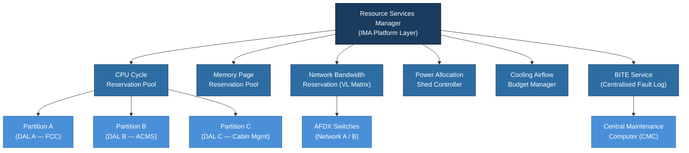

# ATLAS 040-049 · Section 04 · Subsection 040 · 050 — Shared Avionics Resources and Services

## 1. Purpose

This document defines the **Shared Avionics Resources and Services** architecture within the ATLAS 040 Multisystem domain. Shared resources are computing, power, cooling, network bandwidth, and service-layer capabilities that are consumed by multiple avionics systems simultaneously and must be managed through formal arbitration and reservation mechanisms.

In an IMA-based avionics architecture, resource sharing is the defining feature that distinguishes it from federated architectures. However, sharing introduces risks of resource contention, priority inversion, and cascading failures if not governed by a rigorous resource management framework. This document establishes the resource categorisation, reservation methodology, and service API definitions used within the Q+ATLANTIDE baseline to ensure deterministic, safe resource utilisation across all hosted applications and integrated systems.

## 2. Scope

This document covers:

- **Shared computing resources**: CPU cycle allocation, memory page reservation, DMA channel arbitration, and storage I/O scheduling across IMA partitions;
- **Shared network bandwidth**: AFDX Virtual Link (VL) bandwidth reservation matrices, bandwidth admission control, and guaranteed latency allocation[^ref1];
- **Shared power resources**: avionics bay power bus capacity allocation, load sequencing, and shed logic for non-essential loads;
- **Shared cooling allocation**: avionics bay cooling airflow budgets per LRU slot and forced-air cooling management;
- **Built-In Test Equipment (BITE) as a shared service**: BITE service API, centralised fault recording, fault correlation across LRUs;
- **Service API definitions**: the interface through which hosted applications and external LRUs request shared services (time, BITE, data loading triggers);
- **Resource arbitration policy**: priority schemes, pre-emption rules, and starvation prevention mechanisms;
- **Degraded-mode resource management**: resource re-allocation strategies when a GCM or network switch fails.

## 3. Glossary

| Term / Acronym | Definition |
|---|---|
| **Resource Arbitration** | The process by which a shared resource manager resolves competing requests from multiple consumers, applying a defined priority policy. |
| **BITE** | Built-In Test Equipment — on-board self-test circuitry and software providing automated fault detection, isolation, and reporting; treated as a shared service accessible to all hosted applications. |
| **VL** | Virtual Link — an AFDX unidirectional logical channel with reserved bandwidth; each VL constitutes a pre-allocated share of the shared network resource. |
| **Power Shedding** | The controlled disconnection of non-essential electrical loads to preserve power for safety-critical systems during abnormal power conditions. |
| **DMA** | Direct Memory Access — a mechanism allowing peripheral devices to transfer data to/from main memory without CPU intervention; DMA channels are shared resources requiring arbitration. |
| **Service API** | Application Programming Interface for platform services — the ARINC 653 APEX-defined interface through which partitions access shared platform resources (time, health monitoring, inter-partition communication). |
| **Cooling Budget** | The assigned airflow rate (in CFM or m³/h) allocated to each LRU slot in the avionics bay, ensuring thermal limits are not exceeded under worst-case heat dissipation. |
| **Admission Control** | A resource management function that evaluates whether a new resource request can be granted without violating existing reservations or safety margins. |
| **FDIR** | Fault Detection, Isolation, and Recovery — the integrated capability combining BITE outputs with system-level logic to detect failures, isolate faulty components, and initiate recovery. |

## 4. Diagram

## 5. Footprint

| Metric | Value |
|---|---|
| Architecture | `ATLAS` — Aircraft Top Level Architecture Schema/System (controlled term) |
| Master range | `000–099` |
| Code range | `040-049` |
| Section | `04` — Aviónica, Información & APU |
| Subsection | `040` — Multisystem |
| Subsubject | `050` — Shared Avionics Resources and Services |
| Primary Q-Division | Q-DATAGOV[^qdiv] |
| Support Q-Divisions | Q-AIR, Q-SPACE, Q-HPC |
| ORB support | ORB-PMO, ORB-LEG |
| Governance class | `baseline`[^gov] |
| Folder path | `Q+ATLANTIDE/000-099_ATLAS/040-049_Avionica-Informacion-y-APU/040_Multisystem/` |
| Document | `040-050-Shared-Avionics-Resources-and-Services.md` (this file) |
| Parent subsection | [`README.md`](./README.md) |
| Parent section | [`../../README.md`](../../README.md) |
| Parent architecture | [`../../../README.md`](../../../README.md) |
| Parent baseline | [`organization/Q+ATLANTIDE.md`](../../../../organization/Q+ATLANTIDE.md) |

## 6. References & Citations

[^baseline]: **Q+ATLANTIDE controlled baseline (v1.0.0)** — [`organization/Q+ATLANTIDE.md`](../../../../organization/Q+ATLANTIDE.md).
[^qdiv]: **Q-Division authority** — [`organization/Q-Divisions/`](../../../../organization/Q-Divisions/).
[^gov]: **Governance class** — `baseline` denotes documents under controlled change management.
[^n001]: **Note N-001** — Q+ATLANTIDE is a taxonomy and traceability ecosystem. See [`organization/Q+ATLANTIDE.md` §4](../../../../organization/Q+ATLANTIDE.md#4-notes).
[^ref1]: **ARINC 664 Part 7** — Aircraft Data Network, AFDX. Defines the VL parameter set (BAG, Lmax, latency bound) that constitutes the reserved bandwidth allocation per traffic source; VL tables must be statically configured and verified.
[^ref2]: **ARINC 653** — Avionics Application Software Standard Interface. Section 3 defines the APEX Health Monitor API and inter-partition communication queuing ports that constitute the shared service API for IMA-hosted applications.
[^ref3]: **RTCA DO-297** — Integrated Modular Avionics Development Guidance. Section 4 addresses resource management requirements, including CPU budget analysis, memory partitioning, and I/O channel allocation for shared IMA platforms.
[^ref4]: **SAE ARP4754A** — Guidelines for Development of Civil Aircraft and Systems. Provides the failure effect classification framework (catastrophic, hazardous, major, minor) used to assign resource priority and shedding priority in degraded-mode scenarios.
[^ref5]: **RTCA DO-160G / EUROCAE ED-14G** — Environmental Conditions and Test Procedures. Power input characteristics (Section 16) and conducted susceptibility (Section 18) govern the shared power bus design and qualification of power conditioning modules.
[^ref6]: **ATA iSpec 2200** — Chapter 45 (Central Maintenance System) provisions apply to the BITE shared service architecture, including fault code standardisation and maintenance message routing.
